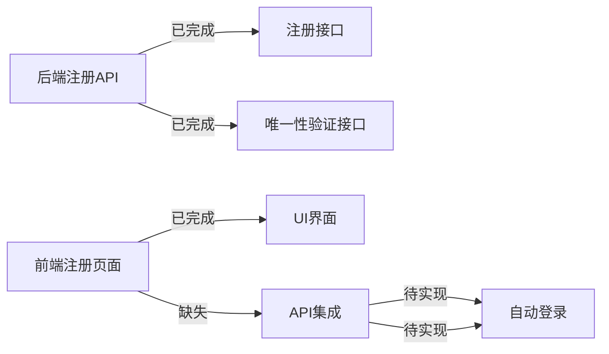
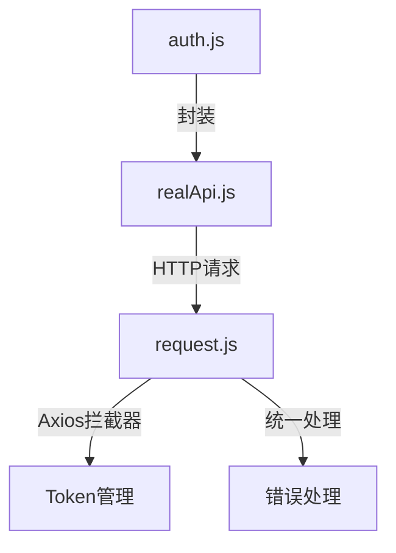
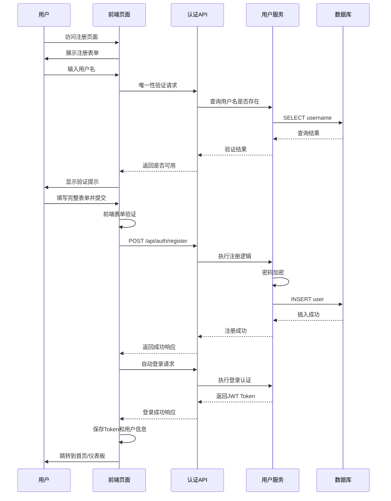
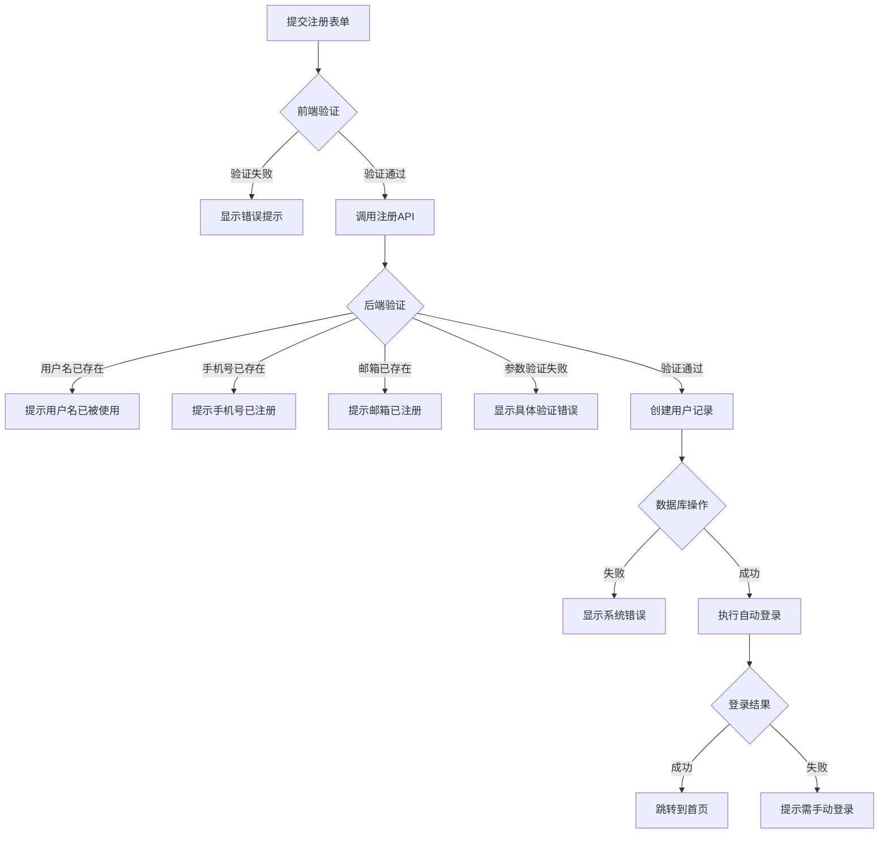
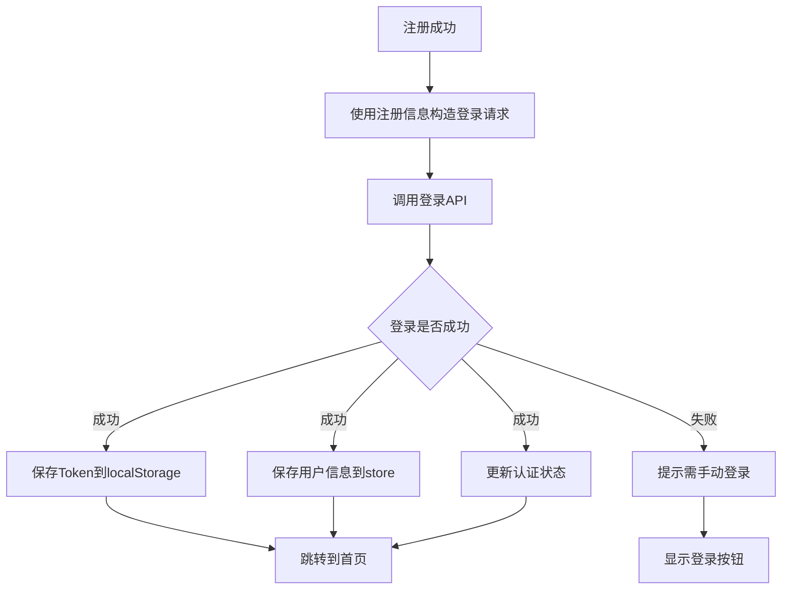
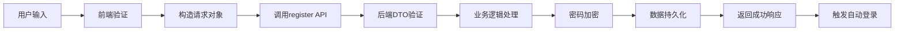
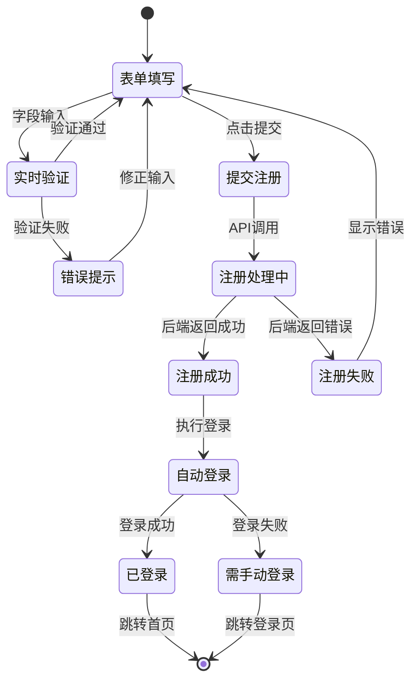
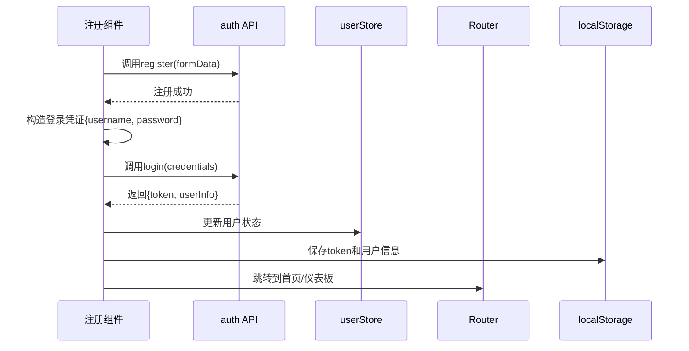

# 注册功能API集成设计文档

## 文档信息

**文档版本：** v1.0  
**创建时间：** 2025年1月  
**设计状态：** 待实施  
**优先级：** 极高  
**预计工期：** 1周  

---

## 一、功能概述

### 1.1 业务目标

完成用户注册流程的前后端API集成,构建完整的用户生命周期闭环。当前系统已具备后端注册API和前端唯一性验证接口,需将前端注册页面与后端API打通,实现真实的用户注册和自动登录功能。

### 1.2 核心价值

| 价值维度 | 具体收益 |
|---------|---------|
| 商业闭环 | 用户可自主注册,无需依赖管理员手动创建账户 |
| 用户体验 | 注册后自动登录,流程顺畅无缝 |
| 数据安全 | 密码强度验证和加密存储,保障账户安全 |
| 系统完整性 | 完善认证模块,为后续功能扩展奠定基础 |

### 1.3 当前状态



---

## 二、系统分析

### 2.1 功能范围界定

#### 2.1.1 包含功能

- 用户注册表单提交与后端API对接
- 用户名、手机号、邮箱唯一性实时验证
- 密码强度校验和二次确认
- 注册成功后自动登录
- 注册状态的用户反馈

#### 2.1.2 不包含功能

- 短信验证码功能(后续阶段实现)
- 邮箱验证码功能(后续阶段实现)
- 社交账号注册(微信、支付宝等)
- 图形验证码防刷机制

### 2.2 现有架构分析

#### 2.2.1 后端注册能力

系统已具备完整的后端注册基础设施:

| 组件 | 状态 | 功能描述 |
|------|------|---------|
| AuthController | 已实现 | 提供注册接口 POST /api/auth/register |
| 唯一性验证接口 | 已实现 | GET /api/auth/check-username、check-phone、check-email |
| RegisterRequest DTO | 已实现 | 包含完整的参数验证规则 |
| UserServiceImpl | 已实现 | 注册业务逻辑和数据持久化 |
| 密码加密 | 已实现 | 使用 BCrypt 算法加密密码 |

#### 2.2.2 后端验证规则

系统通过 Jakarta Validation 实现的字段级验证规则:

| 字段 | 验证规则 | 错误提示 |
|------|---------|---------|
| username | 长度3-20字符,仅含字母数字下划线 | "用户名长度必须在3-20个字符之间" |
| password | 长度8-20字符,必含字母和数字 | "密码需包含字母和数字,可含特殊字符" |
| confirmPassword | 非空,需与password一致 | "两次输入的密码不一致" |
| email | 符合Email格式,非空 | "邮箱格式不正确" |
| phone | 可选,格式为1[3-9]开头的11位数字 | "手机号格式不正确" |
| realName | 可选,长度不超过50字符 | "真实姓名长度不能超过50个字符" |

#### 2.2.3 前端API服务层

现有前端API架构:



已存在但未使用的API方法:

- `realApi.register(userInfo)` - 后端注册接口调用
- `realApi.checkUsername(username)` - 用户名唯一性检查
- `realApi.checkPhone(phone)` - 手机号唯一性检查  
- `realApi.checkEmail(email)` - 邮箱唯一性检查

### 2.3 用户旅程分析

#### 2.3.1 注册流程



#### 2.3.2 异常处理流程



---

## 三、系统设计

### 3.1 API接口设计

#### 3.1.1 注册接口规范

**请求端点**

| 属性 | 值 |
|------|-----|
| 方法 | POST |
| 路径 | /api/auth/register |
| 认证 | 不需要(公开接口) |
| Content-Type | application/json |

**请求参数**

| 参数名 | 类型 | 必填 | 描述 | 示例 |
|--------|------|------|------|------|
| username | String | 是 | 用户名,3-20字符 | "zhangsan" |
| password | String | 是 | 密码,8-20字符,含字母数字 | "Pass1234" |
| confirmPassword | String | 是 | 确认密码,需与password一致 | "Pass1234" |
| email | String | 是 | 邮箱地址 | "user@example.com" |
| phone | String | 否 | 手机号,11位数字 | "13800138000" |
| realName | String | 否 | 真实姓名,不超过50字符 | "张三" |

**响应格式**

成功响应:
```
{
  "code": 200,
  "message": "注册成功",
  "data": null
}
```

失败响应示例:
```
{
  "code": 4001,
  "message": "用户名已存在",
  "data": null
}
```

**错误码定义**

| 错误码 | 含义 | 处理建议 |
|--------|------|---------|
| 4001 | 用户名已存在 | 提示用户更换用户名 |
| 4002 | 手机号已存在 | 提示用户该手机号已注册 |
| 4003 | 邮箱已存在 | 提示用户该邮箱已注册 |
| 4000 | 参数验证失败 | 显示具体验证错误信息 |
| 5000 | 系统错误 | 提示用户稍后重试 |

#### 3.1.2 唯一性验证接口

**用户名唯一性检查**

| 属性 | 值 |
|------|-----|
| 方法 | GET |
| 路径 | /api/auth/check-username |
| 参数 | username=要检查的用户名 |
| 返回 | true表示可用,false表示已被使用 |

**手机号唯一性检查**

| 属性 | 值 |
|------|-----|
| 方法 | GET |
| 路径 | /api/auth/check-phone |
| 参数 | phone=要检查的手机号 |
| 返回 | true表示可用,false表示已被使用 |

**邮箱唯一性检查**

| 属性 | 值 |
|------|-----|
| 方法 | GET |
| 路径 | /api/auth/check-email |
| 参数 | email=要检查的邮箱 |
| 返回 | true表示可用,false表示已被使用 |

### 3.2 前端表单设计

#### 3.2.1 表单字段配置

| 字段标签 | 字段名 | 输入类型 | 是否必填 | 实时验证 |
|---------|--------|---------|---------|---------|
| 用户名 | username | text | 是 | 唯一性验证 |
| 密码 | password | password | 是 | 强度验证 |
| 确认密码 | confirmPassword | password | 是 | 一致性验证 |
| 邮箱 | email | email | 是 | 格式+唯一性验证 |
| 手机号 | phone | tel | 否 | 格式+唯一性验证 |
| 真实姓名 | realName | text | 否 | 长度验证 |

#### 3.2.2 前端验证规则

**立即验证(输入时触发)**

- 用户名: 输入3个字符后触发唯一性检查
- 密码: 实时显示密码强度
- 邮箱: 格式验证后触发唯一性检查
- 手机号: 11位数字后触发唯一性检查

**提交时验证(防呆设计)**

- 所有必填字段非空检查
- 密码与确认密码一致性检查
- 格式规范二次确认

#### 3.2.3 用户反馈机制

**验证状态可视化**

| 验证状态 | 视觉反馈 | 文字提示示例 |
|---------|---------|------------|
| 验证中 | 加载图标 | "正在检查..." |
| 验证通过 | 绿色勾号 | "用户名可用" |
| 验证失败 | 红色叉号 | "用户名已被使用" |
| 未验证 | 无特殊标识 | - |

**错误提示层级**

1. 字段级错误: 显示在输入框下方,红色文字
2. 表单级错误: 显示在提交按钮上方,错误汇总
3. 系统级错误: 弹窗或顶部通知栏

### 3.3 自动登录设计

#### 3.3.1 登录触发时机

注册成功后立即执行自动登录流程,无需用户手动跳转。

#### 3.3.2 登录流程



#### 3.3.3 状态同步机制

登录成功后需同步更新:

| 存储位置 | 更新内容 | 用途 |
|---------|---------|------|
| localStorage | token、user对象 | 持久化存储,页面刷新保持登录 |
| Vuex Store | 用户状态、认证标识 | 全局状态管理 |
| Axios默认Header | Authorization: Bearer {token} | 后续请求自动携带Token |

### 3.4 数据流设计

#### 3.4.1 注册数据流



#### 3.4.2 状态管理流



---

## 四、实现方案

### 4.1 前端实现策略

#### 4.1.1 注册页面改造方案

**现有页面能力评估**

假设当前注册页面已具备基础UI结构,需增强以下能力:

- API集成层: 将表单提交对接到真实后端接口
- 实时验证: 为用户名、邮箱、手机号添加唯一性检查
- 错误处理: 完善后端错误信息的展示逻辑
- 加载状态: 添加注册中的loading状态
- 自动登录: 注册成功后调用登录接口

#### 4.1.2 表单验证策略

**验证时机划分**

| 验证类型 | 触发时机 | 实现方式 |
|---------|---------|---------|
| 格式验证 | 输入失去焦点(blur) | 正则表达式或Element Plus规则 |
| 唯一性验证 | 输入3秒后无新输入(防抖) | 调用后端唯一性检查接口 |
| 密码一致性 | 确认密码输入或密码修改 | 前端对比两个字段值 |
| 提交前验证 | 点击注册按钮 | 表单全局验证方法 |

**防抖优化**

唯一性验证需采用防抖机制,避免频繁请求:

- 用户停止输入3秒后发起验证请求
- 输入长度达到最小要求后才执行验证
- 验证请求应可取消,避免结果错乱

#### 4.1.3 API调用封装

**auth.js服务层增强**

在现有auth.js基础上添加:

```
register(registerForm)
  - 功能: 提交注册表单
  - 参数: 包含username、password等字段的对象
  - 返回: Promise,解析为注册结果
  - 异常: 抛出包含错误码和消息的业务异常
```

**实时验证方法**

```
checkUsernameAvailable(username)
  - 功能: 检查用户名是否可用
  - 防抖: 3秒延迟
  - 返回: Boolean,true表示可用

checkEmailAvailable(email)
  - 功能: 检查邮箱是否可用
  - 防抖: 3秒延迟
  - 返回: Boolean,true表示可用

checkPhoneAvailable(phone)
  - 功能: 检查手机号是否可用
  - 防抖: 3秒延迟
  - 返回: Boolean,true表示可用
```

### 4.2 自动登录实现策略

#### 4.2.1 登录流程集成

**流程控制**



#### 4.2.2 状态持久化

**需要保存的状态**

| 存储项 | 存储位置 | 数据格式 | 用途 |
|--------|---------|---------|------|
| token | localStorage | String | API认证令牌 |
| user | localStorage | JSON对象 | 用户基本信息 |
| isAuthenticated | Vuex Store | Boolean | 认证状态标识 |
| userInfo | Vuex Store | Object | 当前用户详细信息 |

**同步机制**

注册成功自动登录后,需确保:

1. localStorage与Vuex Store数据一致
2. Axios拦截器的Authorization头自动更新
3. 路由守卫能正确识别登录状态

### 4.3 错误处理策略

#### 4.3.1 错误分类

| 错误类型 | 示例场景 | 处理方式 |
|---------|---------|---------|
| 网络错误 | 接口超时、网络断开 | 提示"网络异常,请检查连接" |
| 参数验证错误 | 密码格式不符 | 显示具体字段错误信息 |
| 业务逻辑错误 | 用户名已存在 | 显示后端返回的业务错误消息 |
| 系统错误 | 数据库故障 | 提示"系统繁忙,请稍后重试" |

#### 4.3.2 错误展示规范

**字段级错误**

- 位置: 输入框下方
- 样式: 红色文字,警告图标
- 消失时机: 用户修正输入后

**表单级错误**

- 位置: 提交按钮上方
- 样式: 错误提示框
- 内容: 错误汇总列表

**系统级错误**

- 方式: 弹窗或顶部通知
- 自动消失: 3秒后
- 可手动关闭

---

## 五、质量保证

### 5.1 功能验收标准

#### 5.1.1 核心功能验收

| 功能点 | 验收标准 | 测试方法 |
|--------|---------|---------|
| 注册提交 | 输入合法信息后可成功注册 | 填写表单并提交,检查数据库是否创建用户记录 |
| 唯一性验证 | 重复用户名/邮箱/手机号会被拦截 | 输入已存在的信息,验证是否显示错误提示 |
| 密码加密 | 数据库中密码为加密后的密文 | 查询用户记录,确认password字段为BCrypt密文 |
| 自动登录 | 注册成功后自动跳转到首页且处于登录状态 | 注册后检查localStorage是否有token,页面是否跳转 |
| 错误处理 | 各类错误能正确显示给用户 | 模拟各种错误场景,验证提示信息 |

#### 5.1.2 用户体验验收

| 体验要点 | 标准 |
|---------|------|
| 响应时间 | 唯一性验证在1秒内返回结果 |
| 加载提示 | 注册提交时显示loading状态 |
| 错误提示 | 错误信息清晰易懂,位置显眼 |
| 操作流畅 | 注册到登录无需用户干预 |
| 移动适配 | 表单在移动端正常显示和交互 |

### 5.2 安全性保证

#### 5.2.1 前端安全

| 安全措施 | 实施方式 |
|---------|---------|
| 密码不明文传输 | 使用HTTPS协议 |
| 敏感信息不暴露 | 不在URL或日志中记录密码 |
| XSS防护 | 对用户输入进行转义 |
| CSRF防护 | 注册接口虽为公开接口,但登录接口需CSRF Token |

#### 5.2.2 后端安全(已实现)

| 安全措施 | 当前状态 |
|---------|---------|
| 密码强度验证 | ✅ 已通过正则表达式强制要求 |
| 密码加密存储 | ✅ 使用BCrypt算法 |
| SQL注入防护 | ✅ MyBatis Plus自动防护 |
| 参数验证 | ✅ Jakarta Validation框架 |

### 5.3 测试策略

#### 5.3.1 单元测试

**前端测试点**

- 表单验证规则是否生效
- 防抖机制是否按预期工作
- API调用参数是否正确
- 状态更新逻辑是否正确

**后端测试点(已有)**

- 注册业务逻辑
- 唯一性检查准确性
- 密码加密功能
- 异常处理覆盖率

#### 5.3.2 集成测试

**测试场景**

| 场景 | 测试步骤 | 预期结果 |
|------|---------|---------|
| 正常注册 | 填写所有字段并提交 | 创建用户并自动登录 |
| 用户名重复 | 输入已存在的用户名 | 实时提示已被使用 |
| 邮箱重复 | 输入已存在的邮箱 | 实时提示已被使用 |
| 密码不一致 | 两次密码输入不同 | 前端拦截并提示 |
| 格式错误 | 输入不合法的邮箱格式 | 前端显示格式错误 |
| 网络异常 | 断网后提交注册 | 显示网络错误提示 |
| 自动登录失败 | 注册成功但登录失败(模拟) | 提示需手动登录 |

#### 5.3.3 端到端测试

**完整用户旅程测试**

1. 访问注册页面
2. 逐个填写表单字段
3. 验证实时验证是否工作
4. 提交注册请求
5. 确认注册成功
6. 验证自动登录是否成功
7. 验证页面跳转是否正确
8. 验证用户状态是否同步

---

## 六、实施计划

### 6.1 开发阶段划分

| 阶段 | 任务 | 工期 | 输出物 |
|------|------|------|--------|
| 准备阶段 | API文档确认、环境准备 | 0.5天 | 开发环境就绪 |
| 前端开发 | 表单改造、API集成、验证逻辑 | 2天 | 可工作的注册页面 |
| 自动登录 | 登录流程集成、状态管理 | 1天 | 注册后自动登录 |
| 错误处理 | 完善各类错误提示 | 1天 | 健壮的错误处理 |
| 测试阶段 | 单元测试、集成测试、端到端测试 | 1.5天 | 测试报告 |
| 优化阶段 | 性能优化、用户体验优化 | 1天 | 优化后的最终版本 |

总计: 7天(包含测试和优化)

### 6.2 里程碑节点

| 里程碑 | 完成标准 | 验收方式 |
|--------|---------|---------|
| M1: API对接完成 | 可成功调用注册和验证接口 | Postman/前端调用测试 |
| M2: 基础注册功能可用 | 可完成正常注册流程 | 手动功能测试 |
| M3: 自动登录完成 | 注册后自动登录并跳转 | 完整流程测试 |
| M4: 测试通过 | 所有测试用例通过 | 测试报告 |
| M5: 功能上线 | 功能部署到生产环境 | 线上验证 |

### 6.3 风险控制

#### 6.3.1 技术风险

| 风险 | 影响 | 应对策略 |
|------|------|---------|
| 后端接口不稳定 | 注册失败率上升 | 增加重试机制和降级方案 |
| 前端状态同步失败 | 登录状态异常 | 完善状态管理和同步逻辑 |
| 唯一性验证性能问题 | 用户体验下降 | 优化防抖参数和缓存策略 |

#### 6.3.2 业务风险

| 风险 | 影响 | 应对策略 |
|------|------|---------|
| 恶意注册攻击 | 垃圾账户增多 | 后续阶段增加验证码 |
| 用户信息泄露 | 安全隐患 | 严格遵循安全规范 |
| 注册转化率低 | 用户增长慢 | 优化注册流程,减少必填项 |

---

## 七、后续扩展

### 7.1 短期优化(1-2周内)

- 增加短信验证码验证
- 增加邮箱验证功能
- 增加图形验证码防刷

### 7.2 中期扩展(1个月内)

- 社交账号注册(微信、QQ、支付宝)
- 手机号快捷注册
- 注册来源追踪

### 7.3 长期规划(3个月内)

- 多语言注册支持
- 实名认证集成
- 用户画像数据收集

---

## 八、附录

### 8.1 相关文档

- 后端认证API文档
- 前端开发规范
- 数据库设计文档
- 安全开发规范

### 8.2 技术依赖

**后端**

- Spring Boot 3.x
- Spring Security
- Jakarta Validation
- BCrypt密码加密
- MyBatis Plus

**前端**

- Vue 3
- Element Plus
- Axios
- Vuex/Pinia
- Vue Router

### 8.3 参考资源

- Spring Security官方文档
- Vue 3表单验证最佳实践
- RESTful API设计规范
- OWASP安全开发指南
