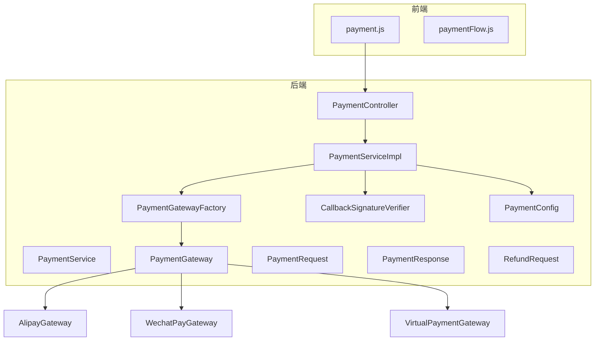
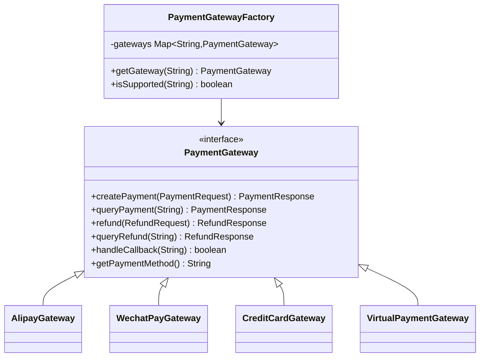
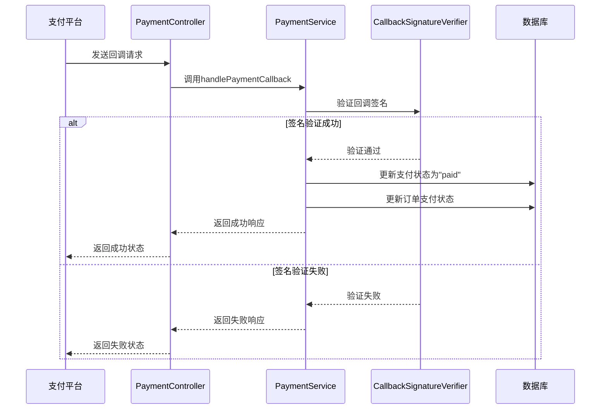
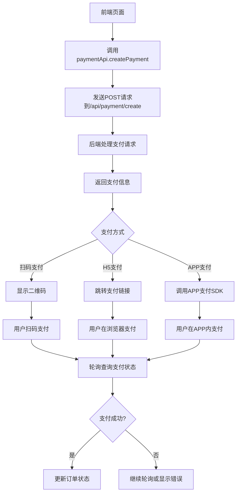
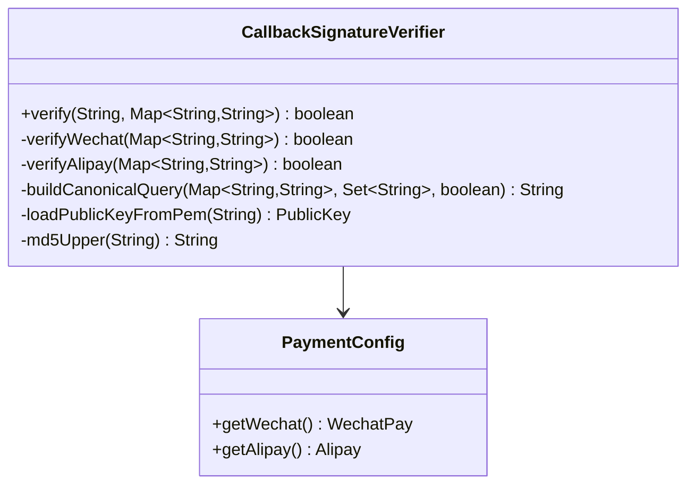
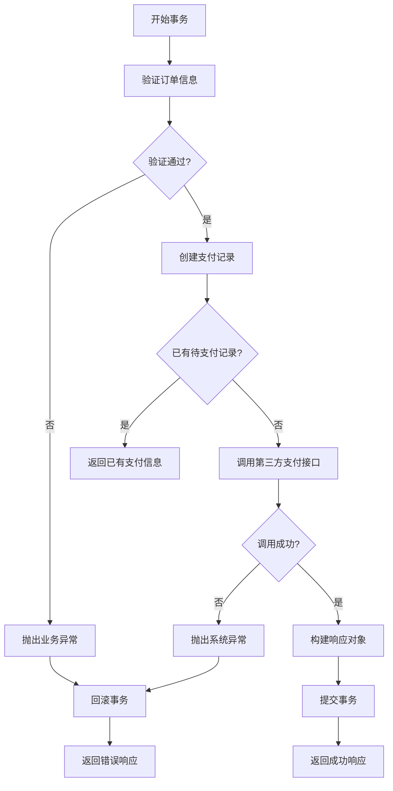

# 支付接口

<cite>
**本文档引用的文件**  
- [PaymentController.java](file://backend/src/main/java/com/carwash/controller/PaymentController.java)
- [PaymentRequest.java](file://backend/src/main/java/com/carwash/dto/PaymentRequest.java)
- [PaymentResponse.java](file://backend/src/main/java/com/carwash/dto/PaymentResponse.java)
- [RefundRequest.java](file://backend/src/main/java/com/carwash/dto/RefundRequest.java)
- [PaymentService.java](file://backend/src/main/java/com/carwash/service/PaymentService.java)
- [PaymentServiceImpl.java](file://backend/src/main/java/com/carwash/service/impl/PaymentServiceImpl.java)
- [PaymentGateway.java](file://backend/src/main/java/com/carwash/service/payment/PaymentGateway.java)
- [PaymentGatewayFactory.java](file://backend/src/main/java/com/carwash/service/payment/PaymentGatewayFactory.java)
- [CallbackSignatureVerifier.java](file://backend/src/main/java/com/carwash/service/payment/security/CallbackSignatureVerifier.java)
- [PaymentConfig.java](file://backend/src/main/java/com/carwash/config/PaymentConfig.java)
- [payment.js](file://frontend/src/api/payment.js)
- [paymentFlow.js](file://frontend/src/utils/paymentFlow.js)
- [AlipayGateway.java](file://backend/src/main/java/com/carwash/service/payment/AlipayGateway.java)
- [WechatPayGateway.java](file://backend/src/main/java/com/carwash/service/payment/WechatPayGateway.java)
- [VirtualPaymentGateway.java](file://backend/src/main/java/com/carwash/service/payment/VirtualPaymentGateway.java)
</cite>

## 目录
1. [项目结构](#项目结构)
2. [核心组件](#核心组件)
3. [支付API接口](#支付api接口)
4. [支付方式选择机制](#支付方式选择机制)
5. [回调处理流程](#回调处理流程)
6. [前端集成方式](#前端集成方式)
7. [安全校验机制](#安全校验机制)
8. [事务一致性保障](#事务一致性保障)

## 项目结构

**图示来源**
- [PaymentController.java](file://backend/src/main/java/com/carwash/controller/PaymentController.java)
- [PaymentServiceImpl.java](file://backend/src/main/java/com/carwash/service/impl/PaymentServiceImpl.java)
- [PaymentGatewayFactory.java](file://backend/src/main/java/com/carwash/service/payment/PaymentGatewayFactory.java)
- [payment.js](file://frontend/src/api/payment.js)

**本节来源**
- [PaymentController.java](file://backend/src/main/java/com/carwash/controller/PaymentController.java)
- [payment.js](file://frontend/src/api/payment.js)

## 核心组件

支付系统的核心组件包括支付控制器、支付服务、支付网关工厂、支付网关接口及具体实现、回调签名验证器等。这些组件共同构成了一个可扩展的支付处理系统，支持多种支付方式。

**本节来源**
- [PaymentController.java](file://backend/src/main/java/com/carwash/controller/PaymentController.java)
- [PaymentService.java](file://backend/src/main/java/com/carwash/service/PaymentService.java)
- [PaymentGateway.java](file://backend/src/main/java/com/carwash/service/payment/PaymentGateway.java)

## 支付API接口

### 发起支付接口

**端点**: `POST /api/payment/create`

**请求参数**:
- `orderNo`: 订单号
- `amount`: 支付金额
- `paymentMethod`: 支付方式 (wechat/alipay/credit_card)
- `channel`: 支付渠道 (qr/app/h5，默认为qr)
- `securePayload`: 加密的敏感支付载荷（信用卡等）
- `description`: 支付描述
- `clientIp`: 用户IP地址
- `returnUrl`: 支付成功回调地址
- `notifyUrl`: 支付异步通知地址

**响应参数**:
- `paymentNo`: 支付流水号
- `orderNo`: 订单号
- `amount`: 支付金额
- `paymentMethod`: 支付方式
- `status`: 支付状态
- `qrCode`: 支付二维码
- `payUrl`: 支付链接
- `expireAt`: 支付过期时间
- `paidAt`: 支付时间
- `transactionId`: 第三方支付平台交易号
- `errorMessage`: 错误信息

**本节来源**
- [PaymentController.java](file://backend/src/main/java/com/carwash/controller/PaymentController.java#L47-L63)
- [PaymentRequest.java](file://backend/src/main/java/com/carwash/dto/PaymentRequest.java)
- [PaymentResponse.java](file://backend/src/main/java/com/carwash/dto/PaymentResponse.java)

### 查询支付状态接口

**端点**: `GET /api/payment/status/{paymentNo}`

**路径参数**:
- `paymentNo`: 支付流水号

**响应参数**: 同发起支付接口响应参数

**本节来源**
- [PaymentController.java](file://backend/src/main/java/com/carwash/controller/PaymentController.java#L68-L78)

### 退款申请接口

**端点**: `POST /api/payment/refund`

**请求参数**:
- `paymentNo`: 支付流水号
- `amount`: 退款金额
- `reason`: 退款原因
- `operatorId`: 操作员ID

**响应参数**:
- `paymentNo`: 支付流水号
- `status`: 退款状态
- `transactionId`: 第三方支付平台交易号
- `errorMessage`: 错误信息

**本节来源**
- [PaymentController.java](file://backend/src/main/java/com/carwash/controller/PaymentController.java#L114-L127)
- [RefundRequest.java](file://backend/src/main/java/com/carwash/dto/RefundRequest.java)

## 支付方式选择机制

支付方式通过`PaymentRequest`对象中的`paymentMethod`字段进行选择，支持以下支付方式：

- `wechat`: 微信支付
- `alipay`: 支付宝支付
- `credit_card`: 信用卡支付
- `virtual`: 虚拟支付（开发测试用）

系统采用策略模式实现支付方式的选择，通过`PaymentGatewayFactory`工厂类根据支付方式选择对应的`PaymentGateway`实现：

**图示来源**
- [PaymentGateway.java](file://backend/src/main/java/com/carwash/service/payment/PaymentGateway.java)
- [PaymentGatewayFactory.java](file://backend/src/main/java/com/carwash/service/payment/PaymentGatewayFactory.java)
- [AlipayGateway.java](file://backend/src/main/java/com/carwash/service/payment/AlipayGateway.java)
- [WechatPayGateway.java](file://backend/src/main/java/com/carwash/service/payment/WechatPayGateway.java)
- [VirtualPaymentGateway.java](file://backend/src/main/java/com/carwash/service/payment/VirtualPaymentGateway.java)

**本节来源**
- [PaymentGateway.java](file://backend/src/main/java/com/carwash/service/payment/PaymentGateway.java)
- [PaymentGatewayFactory.java](file://backend/src/main/java/com/carwash/service/payment/PaymentGatewayFactory.java)

## 回调处理流程

系统为不同支付方式提供了独立的回调处理端点：

- 微信支付回调: `POST /api/payment/callback/wechat`
- 支付宝支付回调: `POST /api/payment/callback/alipay`
- 虚拟支付回调: `POST /api/payment/callback/virtual`

回调处理流程如下：

**图示来源**
- [PaymentController.java](file://backend/src/main/java/com/carwash/controller/PaymentController.java#L132-L181)
- [PaymentServiceImpl.java](file://backend/src/main/java/com/carwash/service/impl/PaymentServiceImpl.java#L173-L229)
- [CallbackSignatureVerifier.java](file://backend/src/main/java/com/carwash/service/payment/security/CallbackSignatureVerifier.java)

**本节来源**
- [PaymentController.java](file://backend/src/main/java/com/carwash/controller/PaymentController.java)
- [PaymentServiceImpl.java](file://backend/src/main/java/com/carwash/service/impl/PaymentServiceImpl.java)

## 前端集成方式

前端通过`payment.js`文件提供的API与后端支付接口进行交互：

**图示来源**
- [payment.js](file://frontend/src/api/payment.js)
- [paymentFlow.js](file://frontend/src/utils/paymentFlow.js)

**本节来源**
- [payment.js](file://frontend/src/api/payment.js)
- [paymentFlow.js](file://frontend/src/utils/paymentFlow.js)

## 安全校验机制

系统通过`CallbackSignatureVerifier`组件实现支付回调的安全校验，针对不同支付方式采用不同的验签机制：

- **微信支付**: 采用参数字典序 + &key=API_KEY 的 MD5(大写)校验
- **支付宝**: 采用 RSA/RSA2 公钥验签（Base64签名），参数字典序拼接
- **虚拟支付**: 始终通过（开发/测试用）

**图示来源**
- [CallbackSignatureVerifier.java](file://backend/src/main/java/com/carwash/service/payment/security/CallbackSignatureVerifier.java)
- [PaymentConfig.java](file://backend/src/main/java/com/carwash/config/PaymentConfig.java)

**本节来源**
- [CallbackSignatureVerifier.java](file://backend/src/main/java/com/carwash/service/payment/security/CallbackSignatureVerifier.java)
- [PaymentConfig.java](file://backend/src/main/java/com/carwash/config/PaymentConfig.java)

## 事务一致性保障

支付系统通过Spring的事务管理机制确保操作的原子性和一致性。关键操作如创建支付订单、处理退款等都使用`@Transactional`注解标记，确保数据库操作的事务性。

**图示来源**
- [PaymentServiceImpl.java](file://backend/src/main/java/com/carwash/service/impl/PaymentServiceImpl.java#L73-L146)

**本节来源**
- [PaymentServiceImpl.java](file://backend/src/main/java/com/carwash/service/impl/PaymentServiceImpl.java)