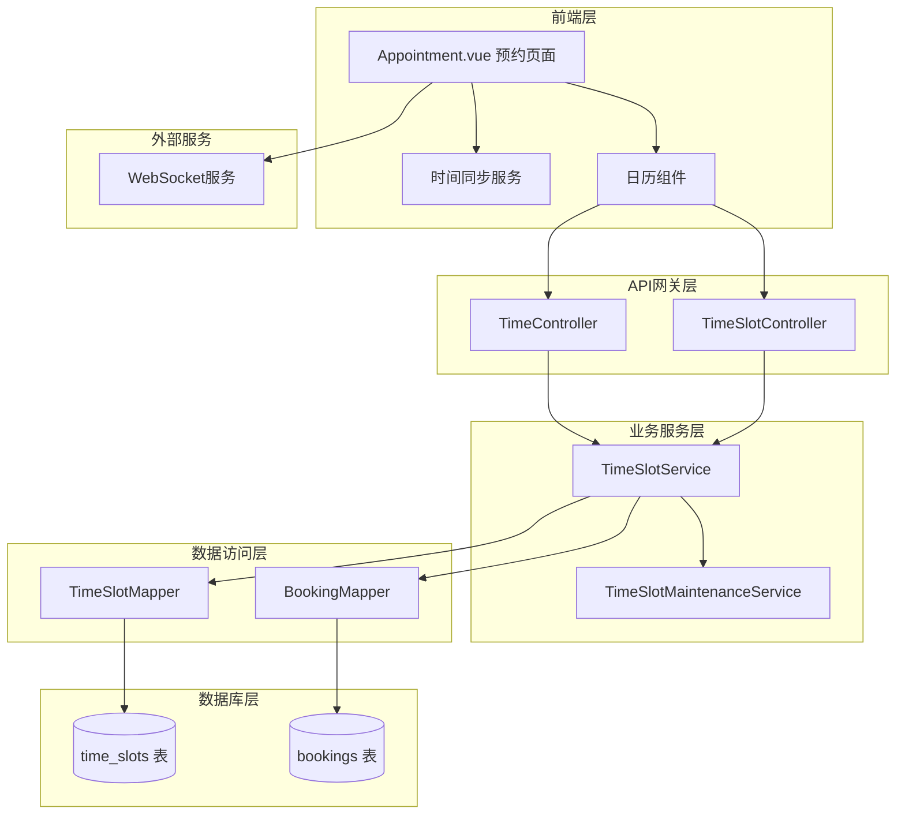
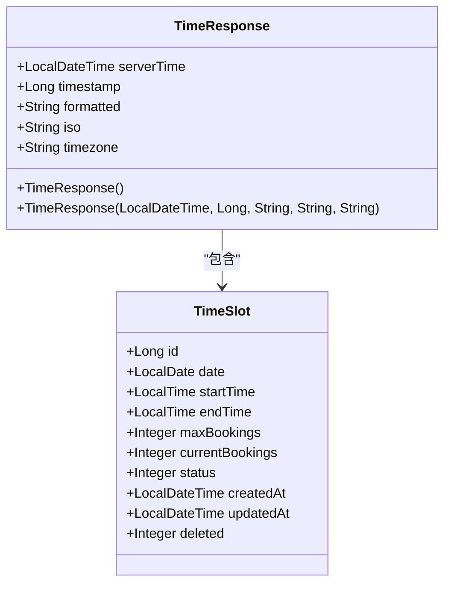
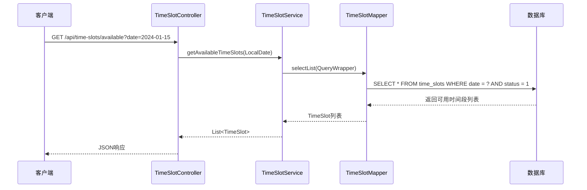
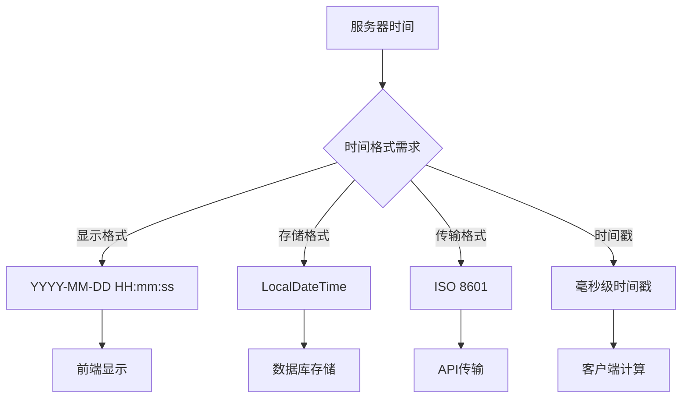
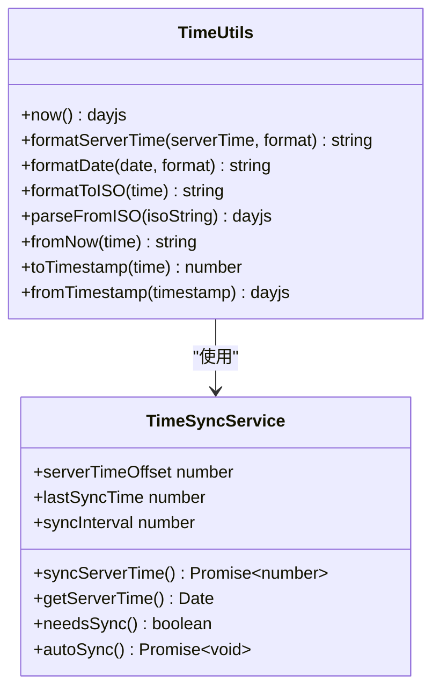
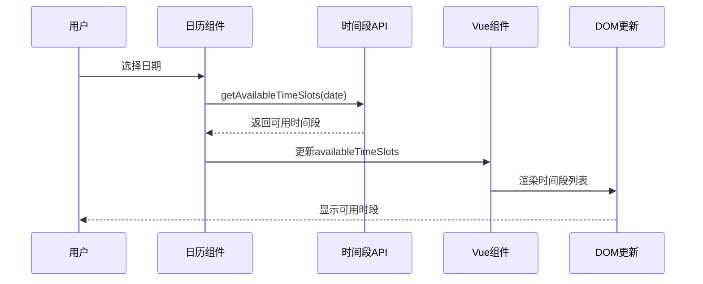
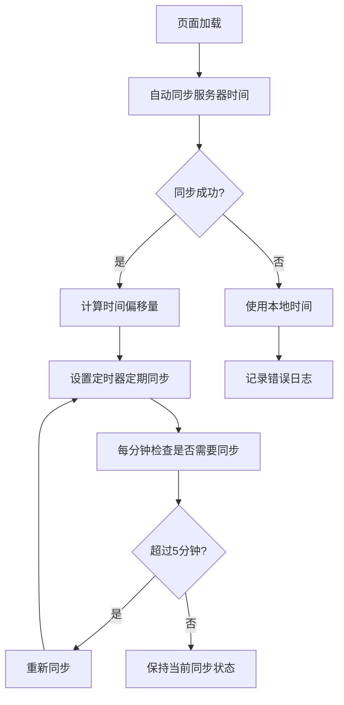
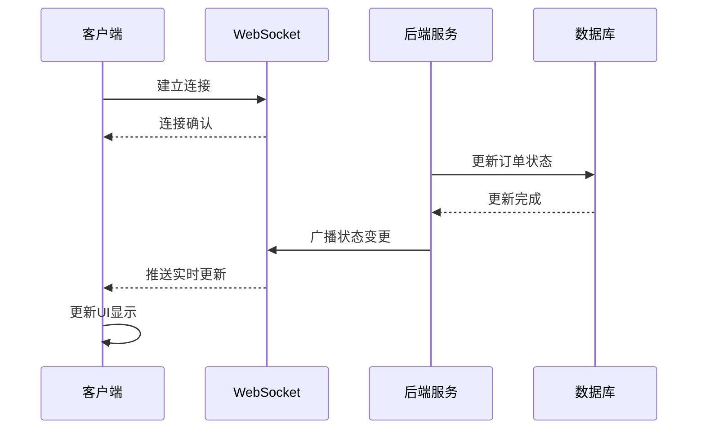
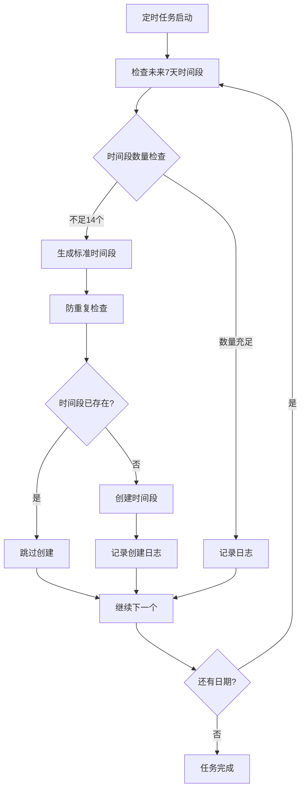

# 时间管理接口

<cite>
**本文档中引用的文件**
- [TimeController.java](file://backend/src/main/java/com/carwash/controller/TimeController.java)
- [TimeSlotController.java](file://backend/src/main/java/com/carwash/controller/TimeSlotController.java)
- [TimeResponse.java](file://backend/src/main/java/com/carwash/dto/TimeResponse.java)
- [TimeSlotServiceImpl.java](file://backend/src/main/java/com/carwash/service/impl/TimeSlotServiceImpl.java)
- [TimeSlot.java](file://backend/src/main/java/com/carwash/entity/TimeSlot.java)
- [TimeSlotService.java](file://backend/src/main/java/com/carwash/service/TimeSlotService.java)
- [time.js](file://frontend/src/api/time.js)
- [timeSlots.js](file://frontend/src/api/timeSlots.js)
- [timeUtils.js](file://frontend/src/utils/timeUtils.js)
- [Appointment.vue](file://frontend/src/views/Appointment.vue)
- [TimeSlotMaintenanceService.java](file://backend/src/main/java/com/carwash/service/TimeSlotMaintenanceService.java)
- [init.sql](file://sql/init.sql)
</cite>

## 目录
1. [简介](#简介)
2. [系统架构](#系统架构)
3. [核心组件](#核心组件)
4. [API接口详解](#api接口详解)
5. [时间格式化与时区处理](#时间格式化与时区处理)
6. [前端集成与数据绑定](#前端集成与数据绑定)
7. [实时刷新机制](#实时刷新机制)
8. [管理员维护功能](#管理员维护功能)
9. [最佳实践](#最佳实践)
10. [故障排除](#故障排除)

## 简介

汽车洗车服务预约系统的时间管理模块提供了完整的时间段查询、可用性检查和动态调整功能。该系统采用前后端分离架构，通过RESTful API提供时间同步、时间段管理和状态维护服务。

### 主要功能特性

- **时间同步服务**：提供精确的服务器时间同步，确保客户端时间一致性
- **时间段查询**：根据日期和服务类型动态获取可用预约时段
- **状态管理**：支持时间段的启用、禁用和动态调整
- **实时通知**：基于WebSocket的实时数据刷新机制
- **管理员维护**：提供时间段的批量管理和自动化维护功能

## 系统架构



**图表来源**
- [TimeController.java](file://backend/src/main/java/com/carwash/controller/TimeController.java#L1-L69)
- [TimeSlotController.java](file://backend/src/main/java/com/carwash/controller/TimeSlotController.java#L1-L39)
- [TimeSlotService.java](file://backend/src/main/java/com/carwash/service/TimeSlotService.java#L1-L54)

## 核心组件

### 时间响应DTO

TimeResponse类负责封装时间相关信息，确保前后端时间格式的一致性。



**图表来源**
- [TimeResponse.java](file://backend/src/main/java/com/carwash/dto/TimeResponse.java#L1-L59)
- [TimeSlot.java](file://backend/src/main/java/com/carwash/entity/TimeSlot.java#L1-L164)

**章节来源**
- [TimeResponse.java](file://backend/src/main/java/com/carwash/dto/TimeResponse.java#L1-L59)
- [TimeSlot.java](file://backend/src/main/java/com/carwash/entity/TimeSlot.java#L1-L164)

### 时间段服务实现

TimeSlotServiceImpl提供了完整的时间段管理功能，包括查询、更新和维护操作。



**图表来源**
- [TimeSlotController.java](file://backend/src/main/java/com/carwash/controller/TimeSlotController.java#L29-L36)
- [TimeSlotServiceImpl.java](file://backend/src/main/java/com/carwash/service/impl/TimeSlotServiceImpl.java#L60-L68)

**章节来源**
- [TimeSlotServiceImpl.java](file://backend/src/main/java/com/carwash/service/impl/TimeSlotServiceImpl.java#L1-L183)
- [TimeSlotService.java](file://backend/src/main/java/com/carwash/service/TimeSlotService.java#L1-L54)

## API接口详解

### GET /api/time/current - 获取服务器当前时间

**功能描述**：获取服务器当前时间信息，用于前后端时间同步。

**请求参数**：无

**响应格式**：
```json
{
  "code": 200,
  "message": "success",
  "data": {
    "serverTime": "2024-01-15T14:30:00",
    "timestamp": 1705321800000,
    "formatted": "2024-01-15 14:30:00",
    "iso": "2024-01-15T06:30:00.000Z",
    "timezone": "Asia/Shanghai"
  }
}
```

**字段说明**：
- `serverTime`: 服务器本地时间
- `timestamp`: 时间戳（毫秒）
- `formatted`: 格式化的时间字符串
- `iso`: ISO 8601格式的时间字符串
- `timezone`: 时区标识符

**章节来源**
- [TimeController.java](file://backend/src/main/java/com/carwash/controller/TimeController.java#L26-L38)

### GET /api/time-slots/available - 获取可用时间段

**功能描述**：根据指定日期获取可用的预约时间段列表。

**请求参数**：
- `date` (必需): 日期字符串，格式：YYYY-MM-DD

**响应格式**：
```json
{
  "code": 200,
  "message": "success",
  "data": [
    {
      "id": 1,
      "date": "2024-01-15",
      "startTime": "09:00:00",
      "endTime": "09:30:00",
      "maxBookings": 3,
      "currentBookings": 0,
      "status": 1
    },
    {
      "id": 2,
      "date": "2024-01-15",
      "startTime": "09:30:00",
      "endTime": "10:00:00",
      "maxBookings": 3,
      "currentBookings": 1,
      "status": 1
    }
  ]
}
```

**查询条件**：
- `date`: 匹配指定日期
- `status`: 必须为1（可用）
- `deleted`: 必须为0（未删除）
- `current_bookings < max_bookings`: 当前预约数小于最大预约数

**章节来源**
- [TimeSlotController.java](file://backend/src/main/java/com/carwash/controller/TimeSlotController.java#L29-L36)
- [TimeSlotServiceImpl.java](file://backend/src/main/java/com/carwash/service/impl/TimeSlotServiceImpl.java#L60-L68)

### PUT /api/time-slots/{id}/status - 更新时间段状态

**功能描述**：管理员可以更新特定时间段的状态（启用/禁用）。

**请求路径参数**：
- `id` (必需): 时间段ID

**请求体**：
```json
{
  "status": 0
}
```

**状态码说明**：
- `0`: 禁用（不可用）
- `1`: 启用（可用）

**响应格式**：
```json
{
  "code": 200,
  "message": "success",
  "data": null
}
```

**章节来源**
- [TimeSlotServiceImpl.java](file://backend/src/main/java/com/carwash/service/impl/TimeSlotServiceImpl.java#L78-L94)

## 时间格式化与时区处理

### 后端时间格式化规则

系统采用统一的时间格式化策略，确保跨平台时间处理的一致性。



**图表来源**
- [TimeResponse.java](file://backend/src/main/java/com/carwash/dto/TimeResponse.java#L24-L36)

### 时区处理策略

系统采用中国标准时间（CST）作为默认时区，确保与用户所在地的时间一致性。

**时区配置**：
- 默认时区：`Asia/Shanghai`
- UTC偏移量：+8小时
- 夏令时：不适用

**章节来源**
- [TimeController.java](file://backend/src/main/java/com/carwash/controller/TimeController.java#L45-L52)
- [TimeResponse.java](file://backend/src/main/java/com/carwash/dto/TimeResponse.java#L34-L36)

### 前端时间处理

前端使用day.js库进行时间处理，支持多种格式转换和时区管理。



**图表来源**
- [timeUtils.js](file://frontend/src/utils/timeUtils.js#L38-L277)
- [time.js](file://frontend/src/api/time.js#L40-L120)

**章节来源**
- [timeUtils.js](file://frontend/src/utils/timeUtils.js#L1-L277)
- [time.js](file://frontend/src/api/time.js#L1-L120)

## 前端集成与数据绑定

### 日历组件数据绑定

预约页面的日历组件通过Vue响应式系统实现数据绑定，支持动态加载和实时更新。



**图表来源**
- [Appointment.vue](file://frontend/src/views/Appointment.vue#L472-L506)
- [timeSlots.js](file://frontend/src/api/timeSlots.js#L11-L15)

### 时间段状态映射

前端将后端的时间段状态映射为视觉化的显示效果：

| 后端状态 | 前端显示 | 样式类名 |
|---------|---------|---------|
| `0` | 已禁用 | `disabled` |
| `1` | 可用 | `available` |
| `maxBookings === currentBookings` | 已满 | `busy` |

**章节来源**
- [Appointment.vue](file://frontend/src/views/Appointment.vue#L91-L117)
- [timeSlots.js](file://frontend/src/api/timeSlots.js#L1-L86)

### 时间同步机制

前端实现了智能的时间同步机制，确保客户端时间与服务器时间的一致性。



**图表来源**
- [time.js](file://frontend/src/api/time.js#L47-L117)

**章节来源**
- [time.js](file://frontend/src/api/time.js#L40-L120)

## 实时刷新机制

### WebSocket集成

系统集成了WebSocket服务，实现订单状态和时间段数据的实时更新。



### 数据同步策略

系统采用多层次的数据同步策略，确保数据的一致性和实时性：

1. **主动轮询**：定期检查数据更新
2. **被动监听**：监听用户操作触发的更新
3. **WebSocket推送**：实时推送重要变更

**章节来源**
- [Appointment.vue](file://frontend/src/views/Appointment.vue#L337-L506)

## 管理员维护功能

### 自动化维护服务

TimeSlotMaintenanceService提供了自动化的时间段维护功能，确保系统始终有足够的时间段可用。



**图表来源**
- [TimeSlotMaintenanceService.java](file://backend/src/main/java/com/carwash/service/TimeSlotMaintenanceService.java#L30-L47)

### 时间段维护规则

系统按照固定的时间段模板自动生成未来7天的时间段：

| 时间段 | 开始时间 | 结束时间 | 最大预约数 |
|-------|---------|---------|-----------|
| 上午 | 09:00 | 09:30 | 3 |
| 上午 | 09:30 | 10:00 | 3 |
| ... | ... | ... | ... |
| 下午 | 17:00 | 17:30 | 3 |
| 下午 | 17:30 | 18:00 | 3 |

**章节来源**
- [TimeSlotMaintenanceService.java](file://backend/src/main/java/com/carwash/service/TimeSlotMaintenanceService.java#L1-L111)
- [init.sql](file://sql/init.sql#L207-L310)

### 手动维护操作

管理员可以通过以下方式手动维护时间段：

1. **禁用时间段**：通过PUT接口临时关闭特定时间段
2. **批量调整**：通过管理界面批量调整多个时间段
3. **强制刷新**：触发维护服务立即运行

## 最佳实践

### 性能优化建议

1. **缓存策略**：合理使用Redis缓存热门时间段数据
2. **分页查询**：对于大量时间段数据使用分页查询
3. **索引优化**：确保数据库查询使用适当的索引

### 安全考虑

1. **权限控制**：确保只有管理员可以修改时间段状态
2. **输入验证**：严格验证日期和时间段参数
3. **事务处理**：使用数据库事务保证数据一致性

### 错误处理

1. **网络异常**：实现重试机制和降级策略
2. **数据不一致**：定期执行数据完整性检查
3. **并发冲突**：使用乐观锁防止并发更新冲突

## 故障排除

### 常见问题及解决方案

| 问题描述 | 可能原因 | 解决方案 |
|---------|---------|---------|
| 时间显示不准确 | 客户端时间不同步 | 检查时间同步服务 |
| 可用时间段为空 | 数据库查询条件错误 | 验证查询条件和索引 |
| WebSocket连接失败 | 网络或防火墙限制 | 检查网络配置 |
| 时间段状态更新失败 | 权限不足或数据冲突 | 检查用户权限和数据一致性 |

### 调试工具

1. **浏览器开发者工具**：监控API请求和响应
2. **后端日志**：查看详细的错误日志
3. **数据库查询**：直接查询数据库验证数据状态

**章节来源**
- [TimeSlotServiceImpl.java](file://backend/src/main/java/com/carwash/service/impl/TimeSlotServiceImpl.java#L1-L183)