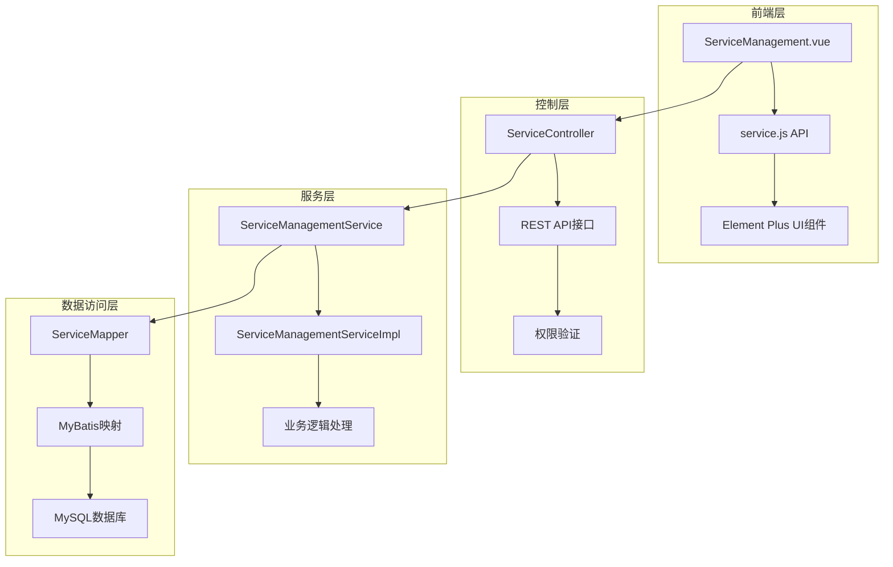
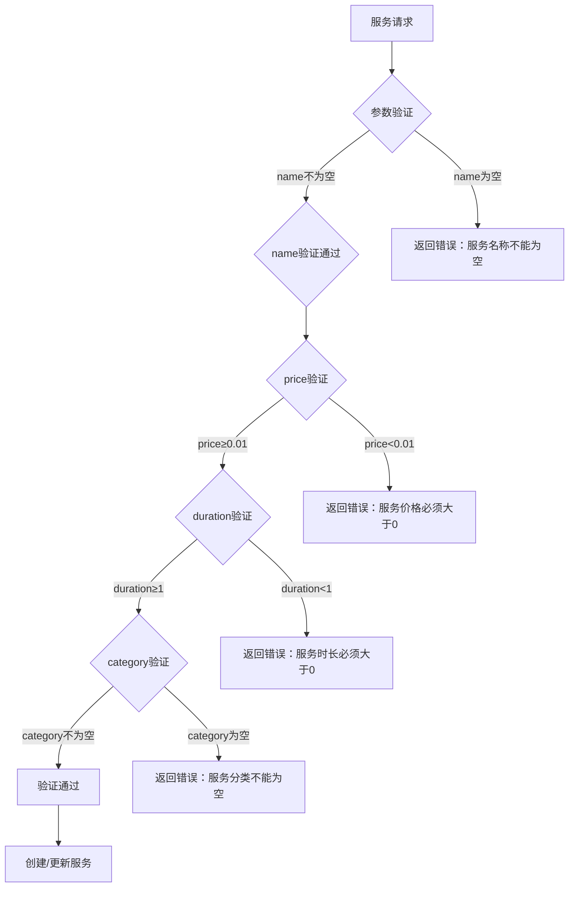
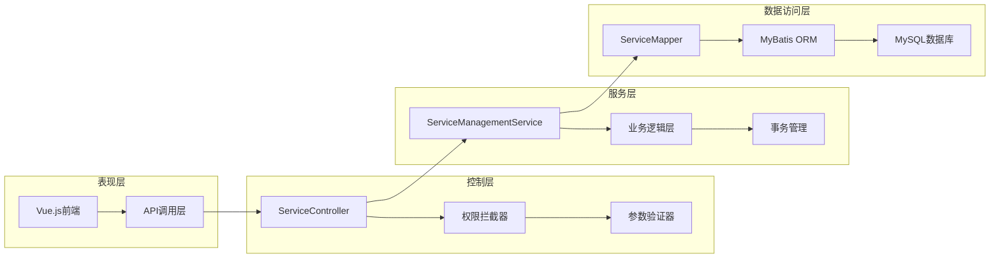
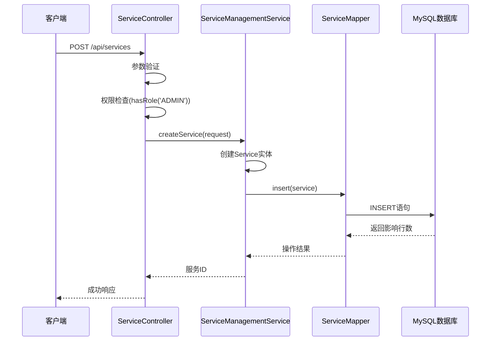
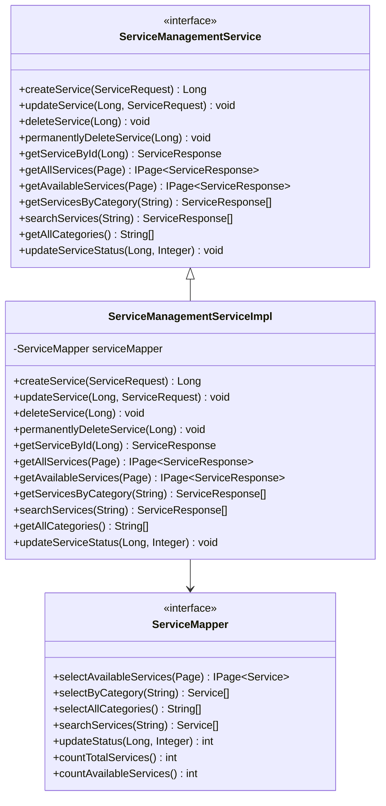
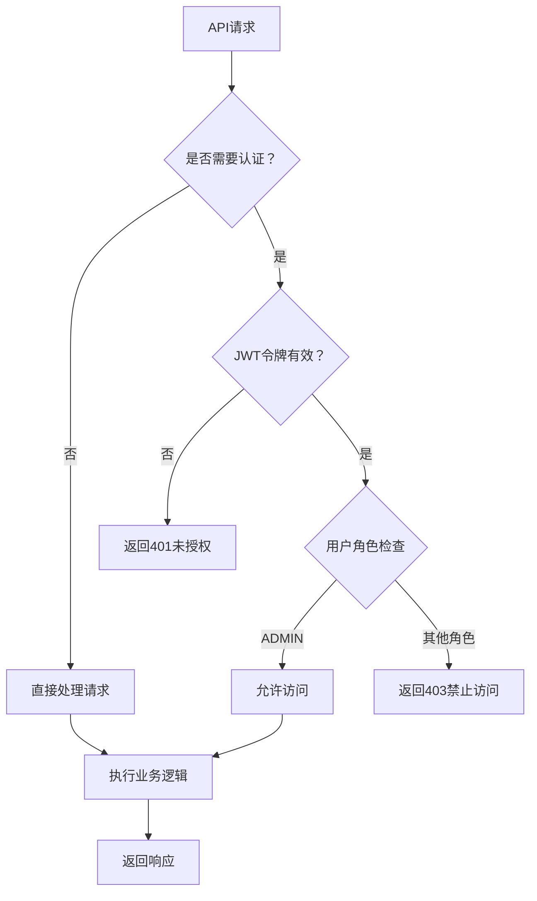
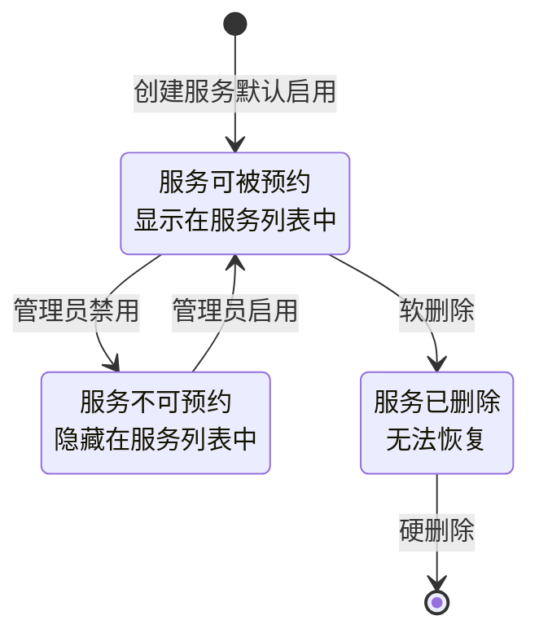
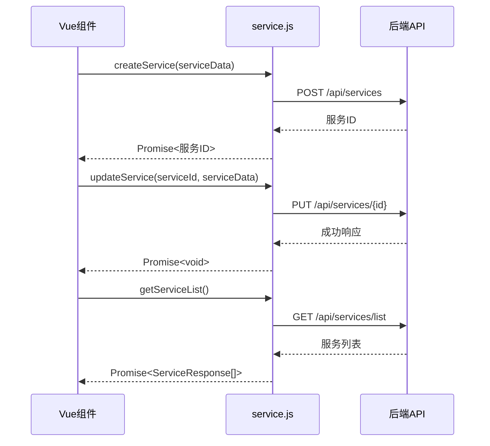
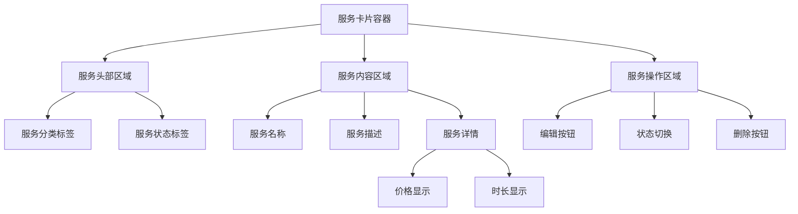

# 服务管理接口

<cite>
**本文档中引用的文件**
- [ServiceController.java](file://backend/src/main/java/com/carwash/controller/ServiceController.java)
- [ServiceRequest.java](file://backend/src/main/java/com/carwash/dto/ServiceRequest.java)
- [Service.java](file://backend/src/main/java/com/carwash/entity/Service.java)
- [ServiceManagementService.java](file://backend/src/main/java/com/carwash/service/ServiceManagementService.java)
- [ServiceManagementServiceImpl.java](file://backend/src/main/java/com/carwash/service/impl/ServiceManagementServiceImpl.java)
- [ServiceResponse.java](file://backend/src/main/java/com/carwash/dto/ServiceResponse.java)
- [service.js](file://frontend/src/api/service.js)
- [ServiceManagement.vue](file://frontend/src/views/admin/ServiceManagement.vue)
- [ServiceMapper.java](file://backend/src/main/java/com/carwash/mapper/ServiceMapper.java)
- [Constants.java](file://backend/src/main/java/com/carwash/common/constants/Constants.java)
- [AppointmentStatus.java](file://backend/src/main/java/com/carwash/common/enums/AppointmentStatus.java)
</cite>

## 目录
1. [简介](#简介)
2. [项目结构](#项目结构)
3. [核心组件](#核心组件)
4. [架构概览](#架构概览)
5. [详细组件分析](#详细组件分析)
6. [API接口规范](#api接口规范)
7. [权限控制机制](#权限控制机制)
8. [服务状态管理](#服务状态管理)
9. [前端集成](#前端集成)
10. [故障排除指南](#故障排除指南)
11. [总结](#总结)

## 简介

汽车洗车服务管理系统提供了一套完整的服务管理API，支持管理员对洗车服务项目进行增删改查操作。该系统采用前后端分离架构，后端使用Spring Boot框架，前端使用Vue.js技术栈，实现了服务项目的全生命周期管理。

系统的核心功能包括：
- 服务项目的创建、更新、删除和查询
- 服务状态的灵活控制（启用/禁用）
- 多维度的服务搜索和筛选
- 权限控制确保只有管理员可以修改服务信息
- 服务状态变更对预约可用性的影响机制

## 项目结构

服务管理系统采用标准的MVC架构模式，主要分为以下几个层次：



**图表来源**
- [ServiceController.java](file://backend/src/main/java/com/carwash/controller/ServiceController.java#L26-L166)
- [ServiceManagementServiceImpl.java](file://backend/src/main/java/com/carwash/service/impl/ServiceManagementServiceImpl.java#L28-L232)
- [ServiceMapper.java](file://backend/src/main/java/com/carwash/mapper/ServiceMapper.java#L19-L63)

**章节来源**
- [ServiceController.java](file://backend/src/main/java/com/carwash/controller/ServiceController.java#L1-L166)
- [ServiceManagementServiceImpl.java](file://backend/src/main/java/com/carwash/service/impl/ServiceManagementServiceImpl.java#L1-L232)

## 核心组件

### 服务实体模型

服务系统的核心数据模型包含以下关键字段：

| 字段名 | 类型 | 描述 | 约束条件 |
|--------|------|------|----------|
| id | Long | 服务唯一标识符 | 主键，自增 |
| name | String | 服务名称 | 必填，非空字符串 |
| description | String | 服务描述 | 可选，支持富文本 |
| price | BigDecimal | 服务价格 | 必填，≥0.01 |
| duration | Integer | 服务时长（分钟） | 必填，≥1 |
| category | String | 服务分类 | 必填，预定义分类 |
| status | Integer | 服务状态 | 0-禁用，1-启用，默认1 |
| imageUrl | String | 服务图片URL | 可选，图片路径 |
| sortOrder | Integer | 排序权重 | 可选，默认0 |
| deleted | Integer | 逻辑删除标志 | 0-未删除，1-已删除 |

### 服务请求参数验证

系统对服务请求参数进行了严格的验证规则：



**图表来源**
- [ServiceRequest.java](file://backend/src/main/java/com/carwash/dto/ServiceRequest.java#L23-L54)

**章节来源**
- [ServiceRequest.java](file://backend/src/main/java/com/carwash/dto/ServiceRequest.java#L1-L118)
- [Service.java](file://backend/src/main/java/com/carwash/entity/Service.java#L1-L191)

## 架构概览

服务管理系统采用分层架构设计，确保了良好的可维护性和扩展性：



**图表来源**
- [ServiceController.java](file://backend/src/main/java/com/carwash/controller/ServiceController.java#L26-L166)
- [ServiceManagementServiceImpl.java](file://backend/src/main/java/com/carwash/service/impl/ServiceManagementServiceImpl.java#L28-L232)

## 详细组件分析

### 控制器层 - ServiceController

ServiceController提供了完整的RESTful API接口，支持服务的全生命周期管理：

#### 公开接口（无需认证）

| 接口路径 | HTTP方法 | 功能描述 | 参数说明 |
|----------|----------|----------|----------|
| `/api/services/list` | GET | 获取可用服务列表 | current, size（分页参数） |
| `/api/services/{id}` | GET | 获取服务详情 | id（服务ID） |
| `/api/services/category/{category}` | GET | 按分类获取服务 | category（服务分类） |
| `/api/services/search` | GET | 搜索服务 | keyword（搜索关键词） |
| `/api/services/categories` | GET | 获取所有分类 | 无 |

#### 管理员专用接口

| 接口路径 | HTTP方法 | 功能描述 | 权限要求 |
|----------|----------|----------|----------|
| `/api/services` | POST | 创建新服务 | ADMIN角色 |
| `/api/services/{id}` | PUT | 更新服务信息 | ADMIN角色 |
| `/api/services/{id}` | DELETE | 删除服务（软删除） | ADMIN角色 |
| `/api/services/{id}/permanent` | DELETE | 永久删除服务 | ADMIN角色 |
| `/api/services/admin/all` | GET | 获取所有服务（含已删除） | ADMIN角色 |
| `/api/services/{id}/status` | PUT | 更新服务状态 | ADMIN角色 |



**图表来源**
- [ServiceController.java](file://backend/src/main/java/com/carwash/controller/ServiceController.java#L95-L102)
- [ServiceManagementServiceImpl.java](file://backend/src/main/java/com/carwash/service/impl/ServiceManagementServiceImpl.java#L37-L52)

**章节来源**
- [ServiceController.java](file://backend/src/main/java/com/carwash/controller/ServiceController.java#L1-L166)
- [ServiceManagementServiceImpl.java](file://backend/src/main/java/com/carwash/service/impl/ServiceManagementServiceImpl.java#L37-L52)

### 服务层 - ServiceManagementService

服务层封装了业务逻辑，提供了清晰的接口定义：



**图表来源**
- [ServiceManagementService.java](file://backend/src/main/java/com/carwash/service/ServiceManagementService.java#L16-L73)
- [ServiceManagementServiceImpl.java](file://backend/src/main/java/com/carwash/service/impl/ServiceManagementServiceImpl.java#L28-L232)
- [ServiceMapper.java](file://backend/src/main/java/com/carwash/mapper/ServiceMapper.java#L19-L63)

**章节来源**
- [ServiceManagementService.java](file://backend/src/main/java/com/carwash/service/ServiceManagementService.java#L1-L73)
- [ServiceManagementServiceImpl.java](file://backend/src/main/java/com/carwash/service/impl/ServiceManagementServiceImpl.java#L1-L232)

### 数据访问层 - ServiceMapper

数据访问层使用MyBatis框架，提供了高效的数据操作能力：

#### 核心查询方法

| 方法名 | SQL语句 | 功能描述 |
|--------|---------|----------|
| selectAvailableServices | SELECT * FROM services WHERE status = 1 AND deleted = 0 ORDER BY sort_order ASC, created_at DESC | 分页查询可用服务 |
| selectByCategory | SELECT * FROM services WHERE category = #{category} AND status = 1 AND deleted = 0 ORDER BY sort_order ASC | 根据分类查询服务 |
| selectAllCategories | SELECT DISTINCT category FROM services WHERE status = 1 AND deleted = 0 ORDER BY category | 查询所有分类 |
| searchServices | SELECT * FROM services WHERE (name LIKE CONCAT('%', #{keyword}, '%') OR description LIKE CONCAT('%', #{keyword}, '%')) AND status = 1 AND deleted = 0 ORDER BY sort_order ASC | 关键词搜索服务 |
| updateStatus | UPDATE services SET status = #{status} WHERE id = #{serviceId} | 更新服务状态 |

**章节来源**
- [ServiceMapper.java](file://backend/src/main/java/com/carwash/mapper/ServiceMapper.java#L19-L63)

## API接口规范

### 创建服务 - POST /api/services

**请求格式：**
```json
{
  "name": "专业洗车",
  "description": "包含内外清洗的专业洗车服务",
  "price": 88.00,
  "duration": 60,
  "imageUrl": "/images/professional-car-wash.jpg",
  "category": "premium",
  "sortOrder": 1
}
```

**响应格式：**
```json
{
  "code": 200,
  "message": "操作成功",
  "data": 123
}
```

**状态码说明：**
- 200: 创建成功
- 400: 参数验证失败
- 401: 未授权访问
- 403: 权限不足
- 500: 系统内部错误

### 更新服务 - PUT /api/services/{id}

**请求格式：**
```json
{
  "name": "专业洗车",
  "description": "升级版专业洗车服务，增加内饰清洁",
  "price": 98.00,
  "duration": 75,
  "imageUrl": "/images/professional-updated.jpg",
  "category": "premium",
  "sortOrder": 1
}
```

**响应格式：**
```json
{
  "code": 200,
  "message": "服务更新成功",
  "data": null
}
```

### 获取服务列表 - GET /api/services/list

**查询参数：**
- `current`: 当前页码，默认为1
- `size`: 每页大小，默认为10

**响应格式：**
```json
{
  "code": 200,
  "message": "操作成功",
  "data": {
    "records": [
      {
        "id": 1,
        "name": "基础洗车",
        "description": "基本的外部清洗服务",
        "price": 48.00,
        "duration": 30,
        "category": "basic",
        "status": 1,
        "createdAt": "2024-01-15T10:30:00"
      }
    ],
    "total": 10,
    "size": 10,
    "current": 1
  }
}
```

### 更新服务状态 - PUT /api/services/{id}/status

**查询参数：**
- `status`: 服务状态值（0-禁用，1-启用）

**响应格式：**
```json
{
  "code": 200,
  "message": "服务状态更新成功",
  "data": null
}
```

**章节来源**
- [ServiceController.java](file://backend/src/main/java/com/carwash/controller/ServiceController.java#L95-L165)

## 权限控制机制

系统采用基于角色的访问控制（RBAC）机制，确保只有管理员可以执行敏感操作：

### 权限验证流程



**图表来源**
- [ServiceController.java](file://backend/src/main/java/com/carwash/controller/ServiceController.java#L97-L164)

### 权限注解说明

系统使用`@PreAuthorize`注解实现细粒度的权限控制：

| 注解内容 | 权限要求 | 适用接口 |
|----------|----------|----------|
| `hasRole('ADMIN')` | 必须是管理员角色 | 所有管理接口 |
| 无注解 | 匿名用户可访问 | 公开查询接口 |

**章节来源**
- [ServiceController.java](file://backend/src/main/java/com/carwash/controller/ServiceController.java#L97-L164)

## 服务状态管理

### 服务状态对预约的影响

服务状态变更会直接影响用户的预约体验：



**图表来源**
- [Service.java](file://backend/src/main/java/com/carwash/entity/Service.java#L65-L67)
- [Constants.java](file://backend/src/main/java/com/carwash/common/constants/Constants.java#L35-L36)

### 状态转换规则

| 当前状态 | 目标状态 | 影响范围 | 用户体验 |
|----------|----------|----------|----------|
| 启用 | 禁用 | 预约系统 | 无法选择该服务 |
| 禁用 | 启用 | 预约系统 | 可重新选择该服务 |
| 启用 | 删除 | 所有系统 | 服务消失，影响现有预约 |
| 删除 | 启用 | 需要恢复数据 | 服务恢复，可能影响预约 |

**章节来源**
- [ServiceManagementServiceImpl.java](file://backend/src/main/java/com/carwash/service/impl/ServiceManagementServiceImpl.java#L158-L173)
- [ServiceMapper.java](file://backend/src/main/java/com/carwash/mapper/ServiceMapper.java#L48-L50)

## 前端集成

### 前端API调用方式

前端通过service.js模块封装了所有服务管理相关的API调用：



**图表来源**
- [service.js](file://frontend/src/api/service.js#L79-L132)

### 表单绑定与验证

前端使用Element Plus组件库实现表单绑定和验证：

#### 表单字段映射

| 前端字段 | 后端字段 | 验证规则 | 示例值 |
|----------|----------|----------|--------|
| `form.name` | `name` | 必填，非空 | "专业洗车" |
| `form.price` | `price` | 必填，≥0.01 | 88.00 |
| `form.duration` | `duration` | 必填，≥1 | 60 |
| `form.category` | `category` | 必填，预定义 | "premium" |
| `form.description` | `description` | 可选 | "包含内外清洗" |

#### 分类选项

前端支持的服务分类选项：

| 分类值 | 显示文本 | 颜色标识 |
|--------|----------|----------|
| `basic` | 基础洗车 | 默认 |
| `premium` | 精洗套餐 | 黄色 |
| `interior` | 内饰清洁 | 绿色 |
| `beauty` | 美容服务 | 红色 |
| `maintenance` | 保养维护 | 蓝色 |

**章节来源**
- [service.js](file://frontend/src/api/service.js#L1-L132)
- [ServiceManagement.vue](file://frontend/src/views/admin/ServiceManagement.vue#L535-L547)

### 列表渲染逻辑

前端采用响应式设计，支持卡片视图和列表视图两种展示模式：

#### 卡片视图布局



**图表来源**
- [ServiceManagement.vue](file://frontend/src/views/admin/ServiceManagement.vue#L171-L227)

#### 列表视图特性

| 列名 | 数据类型 | 功能特性 |
|------|----------|----------|
| 服务名称 | 文本 | 支持分类标签显示 |
| 服务描述 | 文本 | 超出省略显示 |
| 价格 | 数字 | 格式化显示 |
| 时长 | 数字 | 单位显示 |
| 状态 | 开关 | 实时状态切换 |
| 创建时间 | 日期 | 格式化显示 |
| 操作 | 按钮组 | 批量操作支持 |

**章节来源**
- [ServiceManagement.vue](file://frontend/src/views/admin/ServiceManagement.vue#L232-L302)

## 故障排除指南

### 常见问题及解决方案

#### 1. 权限相关问题

**问题现象：** 403 Forbidden错误
**可能原因：**
- 用户未登录或JWT令牌过期
- 用户角色不是ADMIN
- 权限配置错误

**解决方案：**
- 检查用户登录状态
- 验证用户角色权限
- 查看SecurityConfig配置

#### 2. 参数验证失败

**问题现象：** 400 Bad Request错误
**常见原因：**
- 服务名称为空
- 价格小于等于0
- 服务时长小于等于0
- 分类值不在预定义范围内

**解决方案：**
- 检查前端表单验证规则
- 查看后端参数验证注解
- 确认数据类型匹配

#### 3. 服务状态异常

**问题现象：** 服务状态更新失败
**可能原因：**
- 服务ID不存在
- 数据库连接异常
- 事务回滚

**解决方案：**
- 验证服务ID有效性
- 检查数据库连接状态
- 查看事务日志

#### 4. 前端API调用失败

**问题现象：** 前端API调用返回错误
**排查步骤：**
1. 检查网络连接状态
2. 验证API接口地址
3. 查看浏览器控制台错误
4. 检查CORS配置

**章节来源**
- [ServiceManagementServiceImpl.java](file://backend/src/main/java/com/carwash/service/impl/ServiceManagementServiceImpl.java#L58-L72)
- [ServiceController.java](file://backend/src/main/java/com/carwash/controller/ServiceController.java#L97-L164)

## 总结

汽车洗车服务管理系统提供了一套完整的服务管理解决方案，具有以下特点：

### 技术优势

1. **分层架构设计**：清晰的职责分离，便于维护和扩展
2. **完善的权限控制**：基于角色的访问控制，确保数据安全
3. **严格的数据验证**：前后端双重验证，保证数据完整性
4. **灵活的状态管理**：支持服务的启用、禁用和删除操作
5. **优秀的用户体验**：响应式设计，支持多种视图模式

### 功能特性

1. **全生命周期管理**：从创建到删除的完整服务管理
2. **多维度查询**：支持按分类、关键词、状态等多种方式查询
3. **实时状态同步**：服务状态变更即时反映在预约系统中
4. **批量操作支持**：支持批量启用、禁用等操作
5. **统计分析功能**：提供服务数量、价格分布等统计信息

### 扩展建议

1. **缓存优化**：为频繁查询的服务数据添加Redis缓存
2. **异步处理**：对于耗时的操作（如大量数据导入）采用异步处理
3. **监控告警**：添加服务操作的日志记录和异常监控
4. **国际化支持**：为多语言环境提供支持
5. **移动端适配**：优化移动端的用户体验

该系统为企业级的汽车洗车服务管理提供了可靠的技术支撑，能够满足日常运营的各种需求，并具备良好的扩展性和维护性。