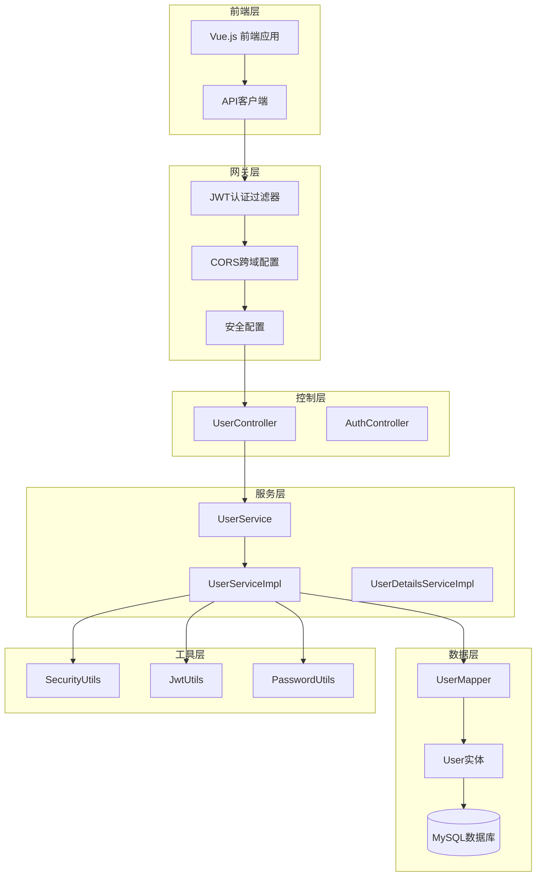
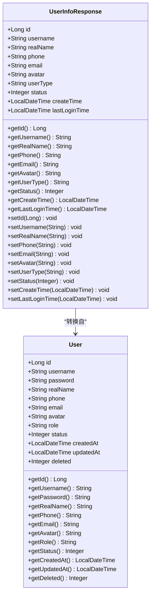
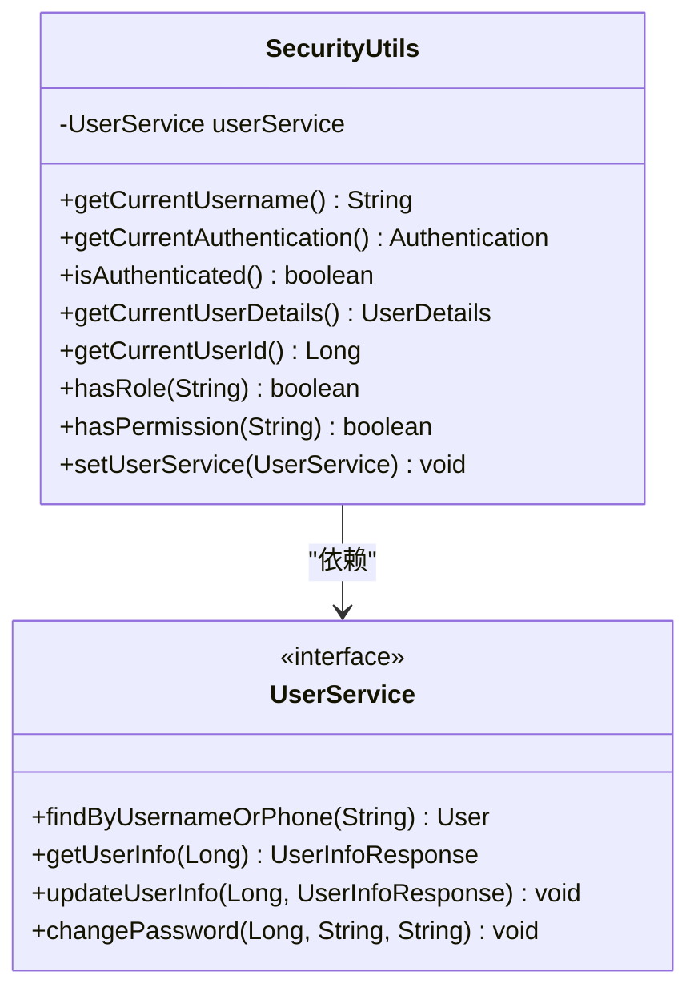
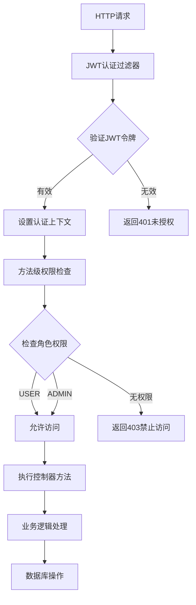
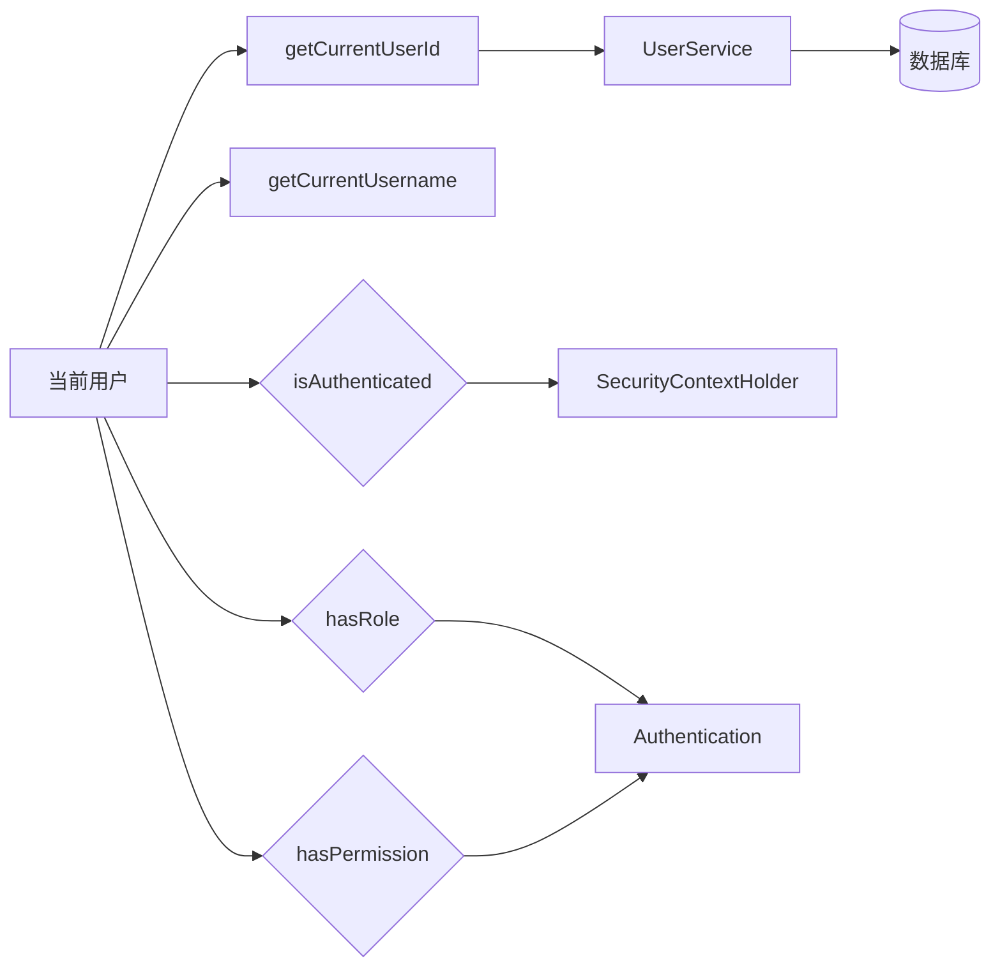
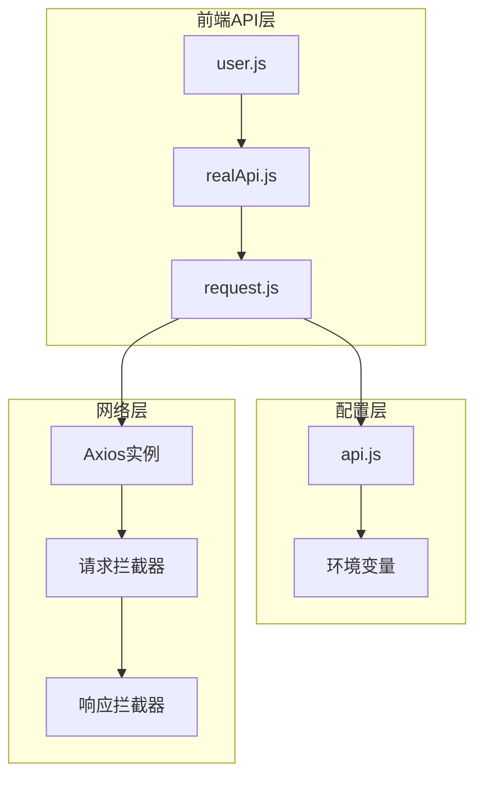
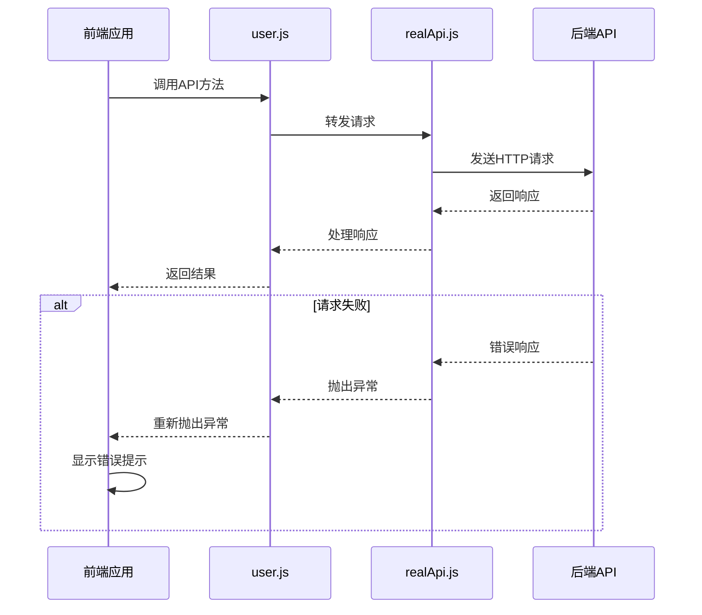
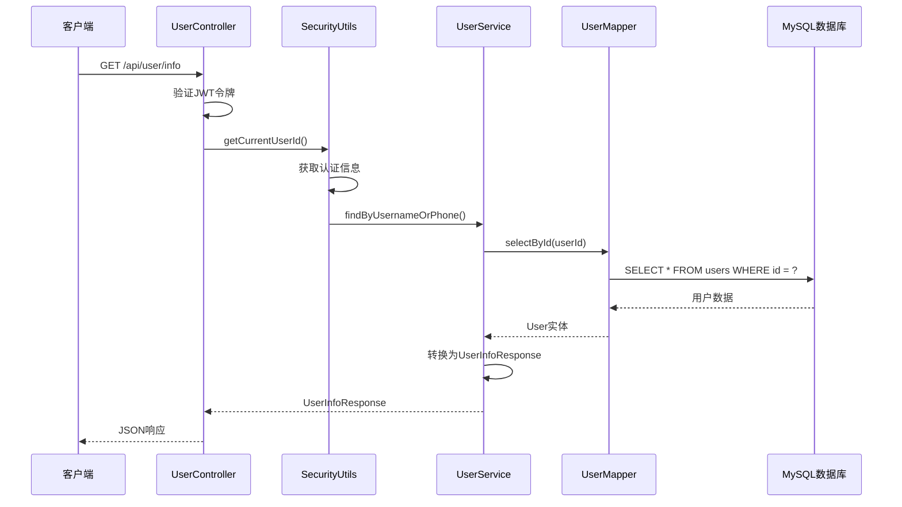
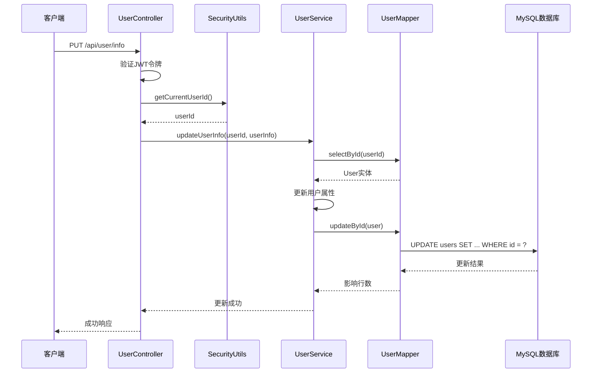
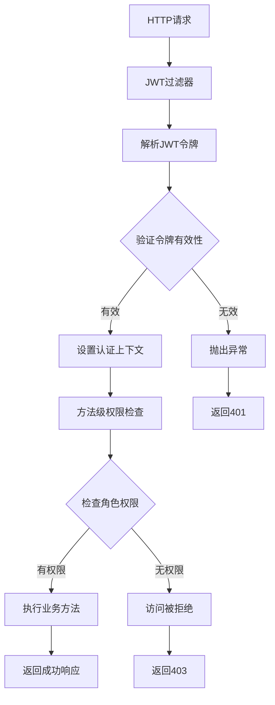

# 用户管理接口文档

<cite>
**本文档中引用的文件**
- [UserController.java](file://backend/src/main/java/com/carwash/controller/UserController.java)
- [UserInfoResponse.java](file://backend/src/main/java/com/carwash/dto/UserInfoResponse.java)
- [UserService.java](file://backend/src/main/java/com/carwash/service/UserService.java)
- [UserServiceImpl.java](file://backend/src/main/java/com/carwash/service/impl/UserServiceImpl.java)
- [SecurityUtils.java](file://backend/src/main/java/com/carwash/utils/SecurityUtils.java)
- [User.java](file://backend/src/main/java/com/carwash/entity/User.java)
- [user.js](file://frontend/src/api/user.js)
- [realApi.js](file://frontend/src/api/realApi.js)
- [api.js](file://frontend/src/config/api.js)
- [SecurityConfig.java](file://backend/src/main/java/com/carwash/config/SecurityConfig.java)
</cite>

## 目录
1. [简介](#简介)
2. [项目架构概览](#项目架构概览)
3. [核心组件分析](#核心组件分析)
4. [用户管理API详解](#用户管理api详解)
5. [权限控制系统](#权限控制系统)
6. [前端API封装](#前端api封装)
7. [数据流分析](#数据流分析)
8. [最佳实践](#最佳实践)
9. [故障排除](#故障排除)
10. [总结](#总结)

## 简介

本文档详细介绍了汽车洗车服务预约系统中的用户管理相关API接口。该系统采用前后端分离架构，后端基于Spring Boot框架，前端使用Vue.js技术栈，实现了完整的用户信息管理功能，包括用户信息获取、更新、密码修改以及管理员级别的用户管理功能。

## 项目架构概览

系统采用经典的三层架构模式，包含表现层（Controller）、业务逻辑层（Service）和数据访问层（Mapper）。



**图表来源**
- [UserController.java](file://backend/src/main/java/com/carwash/controller/UserController.java#L24-L126)
- [UserService.java](file://backend/src/main/java/com/carwash/service/UserService.java#L15-L102)
- [UserServiceImpl.java](file://backend/src/main/java/com/carwash/service/impl/UserServiceImpl.java#L41-L412)

## 核心组件分析

### 用户信息响应DTO

UserInfoResponse是用户信息的核心数据传输对象，包含了用户的所有基本信息。



**图表来源**
- [UserInfoResponse.java](file://backend/src/main/java/com/carwash/dto/UserInfoResponse.java#L13-L147)
- [User.java](file://backend/src/main/java/com/carwash/entity/User.java#L15-L190)

### 安全工具类

SecurityUtils提供了获取当前登录用户身份的核心功能，是整个权限控制系统的基础。



**图表来源**
- [SecurityUtils.java](file://backend/src/main/java/com/carwash/utils/SecurityUtils.java#L17-L124)
- [UserService.java](file://backend/src/main/java/com/carwash/service/UserService.java#L15-L102)

**章节来源**
- [UserInfoResponse.java](file://backend/src/main/java/com/carwash/dto/UserInfoResponse.java#L13-L147)
- [User.java](file://backend/src/main/java/com/carwash/entity/User.java#L15-L190)
- [SecurityUtils.java](file://backend/src/main/java/com/carwash/utils/SecurityUtils.java#L17-L124)

## 用户管理API详解

### GET /api/user/info - 获取用户信息

#### 接口描述
获取当前登录用户的详细信息，包括基本资料、头像、状态等信息。

#### 请求格式
```http
GET /api/user/info
Authorization: Bearer <jwt_token>
```

#### 响应格式
```json
{
  "code": 200,
  "message": "操作成功",
  "data": {
    "id": 1,
    "username": "john_doe",
    "realName": "张三",
    "phone": "13800138000",
    "email": "john@example.com",
    "avatar": "https://example.com/avatar.jpg",
    "userType": "user",
    "status": 1,
    "createTime": "2024-01-01T10:00:00",
    "lastLoginTime": "2024-01-15T14:30:00"
  }
}
```

#### 参数说明

| 字段 | 类型 | 必填 | 描述 |
|------|------|------|------|
| Authorization | String | 是 | Bearer Token，JWT格式的认证令牌 |

#### 响应字段说明

| 字段 | 类型 | 描述 |
|------|------|------|
| id | Long | 用户唯一标识符 |
| username | String | 用户名，系统唯一 |
| realName | String | 真实姓名 |
| phone | String | 手机号码 |
| email | String | 电子邮箱 |
| avatar | String | 头像图片URL |
| userType | String | 用户类型（user/admin） |
| status | Integer | 用户状态（0-禁用，1-启用） |
| createTime | DateTime | 用户创建时间 |
| lastLoginTime | DateTime | 最后登录时间 |

#### 权限控制
- **角色要求**: USER, ADMIN
- **认证要求**: 需要有效的JWT令牌
- **数据隔离**: 只能获取当前登录用户的信息

### PUT /api/user/info - 更新用户信息

#### 接口描述
更新当前登录用户的基本信息，包括真实姓名、手机号、邮箱、头像等。

#### 请求格式
```http
PUT /api/user/info
Content-Type: application/json
Authorization: Bearer <jwt_token>

{
  "realName": "李四",
  "phone": "13900139000",
  "email": "li@example.com",
  "avatar": "https://example.com/new-avatar.jpg"
}
```

#### 响应格式
```json
{
  "code": 200,
  "message": "用户信息更新成功",
  "data": null
}
```

#### 请求参数说明

| 字段 | 类型 | 必填 | 描述 |
|------|------|------|------|
| realName | String | 否 | 真实姓名 |
| phone | String | 否 | 手机号码 |
| email | String | 否 | 电子邮箱 |
| avatar | String | 否 | 头像URL |

#### 权限控制
- **角色要求**: USER, ADMIN
- **认证要求**: 需要有效的JWT令牌
- **数据隔离**: 只能更新当前登录用户的信息

### POST /api/user/change-password - 修改密码

#### 接口描述
修改当前登录用户的密码，需要提供旧密码进行验证。

#### 请求格式
```http
POST /api/user/change-password?oldPassword=old123&newPassword=new123
Authorization: Bearer <jwt_token>
```

#### 响应格式
```json
{
  "code": 200,
  "message": "密码修改成功",
  "data": null
}
```

#### 参数说明

| 字段 | 类型 | 必填 | 描述 |
|------|------|------|------|
| oldPassword | String | 是 | 旧密码 |
| newPassword | String | 是 | 新密码 |

#### 权限控制
- **角色要求**: USER, ADMIN
- **认证要求**: 需要有效的JWT令牌
- **安全性**: 需要验证旧密码正确性

### 管理员专用接口

#### GET /api/user/admin/list - 获取用户列表

#### PUT /api/user/admin/{userId}/status - 更新用户状态

#### DELETE /api/user/admin/{userId} - 删除用户

#### DELETE /api/user/admin/{userId}/permanent - 永久删除用户

这些接口仅对管理员开放，提供完整的用户管理功能。

**章节来源**
- [UserController.java](file://backend/src/main/java/com/carwash/controller/UserController.java#L38-L125)
- [UserInfoResponse.java](file://backend/src/main/java/com/carwash/dto/UserInfoResponse.java#L16-L147)

## 权限控制系统

### Spring Security配置

系统采用基于角色的访问控制（RBAC），通过Spring Security框架实现细粒度的权限管理。



**图表来源**
- [SecurityConfig.java](file://backend/src/main/java/com/carwash/config/SecurityConfig.java#L60-L98)

### 角色权限定义

| 角色 | 权限范围 | 可访问接口 |
|------|----------|------------|
| USER | 普通用户 | GET /api/user/info<br/>PUT /api/user/info<br/>POST /api/user/change-password |
| ADMIN | 管理员 | 上述所有接口 + 管理员专用接口 |

### 方法级权限注解

系统使用`@PreAuthorize`注解实现方法级别的权限控制：

```java
// 用户和管理员可访问
@PreAuthorize("hasRole('USER') or hasRole('ADMIN')")
public Result<UserInfoResponse> getUserInfo() { ... }

// 仅管理员可访问
@PreAuthorize("hasRole('ADMIN')")
public Result<List<UserInfoResponse>> getAllUsers() { ... }
```

### SecurityUtils工具类功能

SecurityUtils提供了多种权限检查和用户信息获取的功能：



**图表来源**
- [SecurityUtils.java](file://backend/src/main/java/com/carwash/utils/SecurityUtils.java#L78-L124)

**章节来源**
- [SecurityConfig.java](file://backend/src/main/java/com/carwash/config/SecurityConfig.java#L30-L133)
- [SecurityUtils.java](file://backend/src/main/java/com/carwash/utils/SecurityUtils.java#L78-L124)

## 前端API封装

### 前端架构

前端采用模块化的API封装设计，通过多层抽象实现与后端的通信。



**图表来源**
- [user.js](file://frontend/src/api/user.js#L1-L134)
- [realApi.js](file://frontend/src/api/realApi.js#L1-L65)
- [api.js](file://frontend/src/config/api.js#L1-L57)

### 用户API封装示例

#### 获取用户信息
```javascript
// 前端调用示例
async function fetchUserInfo() {
  try {
    const response = await realApi.getUserInfo();
    return response.data;
  } catch (error) {
    console.error('获取用户信息失败:', error);
    throw error;
  }
}
```

#### 更新用户信息
```javascript
// 前端调用示例
async function updateUserInfo(userData) {
  try {
    const response = await realApi.updateUserInfo(userData);
    return response;
  } catch (error) {
    console.error('更新用户信息失败:', error);
    throw error;
  }
}
```

#### 修改密码
```javascript
// 前端调用示例
async function changePassword(oldPassword, newPassword) {
  try {
    const response = await realApi.changePassword(oldPassword, newPassword);
    return response;
  } catch (error) {
    console.error('修改密码失败:', error);
    throw error;
  }
}
```

### 错误处理机制

前端API封装包含了完整的错误处理机制：



**图表来源**
- [user.js](file://frontend/src/api/user.js#L6-L134)
- [realApi.js](file://frontend/src/api/realApi.js#L43-L65)

**章节来源**
- [user.js](file://frontend/src/api/user.js#L1-L134)
- [realApi.js](file://frontend/src/api/realApi.js#L1-L65)
- [api.js](file://frontend/src/config/api.js#L1-L57)

## 数据流分析

### 用户信息获取流程



**图表来源**
- [UserController.java](file://backend/src/main/java/com/carwash/controller/UserController.java#L38-L42)
- [SecurityUtils.java](file://backend/src/main/java/com/carwash/utils/SecurityUtils.java#L83-L92)
- [UserServiceImpl.java](file://backend/src/main/java/com/carwash/service/impl/UserServiceImpl.java#L176-L185)

### 用户信息更新流程



**图表来源**
- [UserController.java](file://backend/src/main/java/com/carwash/controller/UserController.java#L50-L54)
- [UserServiceImpl.java](file://backend/src/main/java/com/carwash/service/impl/UserServiceImpl.java#L188-L207)

### 权限验证流程



**图表来源**
- [SecurityConfig.java](file://backend/src/main/java/com/carwash/config/SecurityConfig.java#L60-L98)
- [SecurityUtils.java](file://backend/src/main/java/com/carwash/utils/SecurityUtils.java#L101-L123)

## 最佳实践

### 安全最佳实践

1. **JWT令牌管理**
   - 使用HTTPS传输确保令牌安全
   - 实现令牌刷新机制避免频繁重新登录
   - 设置合理的令牌过期时间

2. **密码安全**
   - 生产环境中使用强密码加密算法
   - 实现密码强度验证
   - 提供密码修改历史限制

3. **数据验证**
   - 前端和后端双重验证
   - 使用正则表达式验证手机号、邮箱格式
   - 防止SQL注入攻击

### 性能优化建议

1. **缓存策略**
   - 对用户基本信息进行缓存
   - 实现Redis缓存减少数据库压力
   - 设置合理的缓存过期时间

2. **分页查询**
   - 对于大量用户数据采用分页查询
   - 实现懒加载提升用户体验
   - 添加索引优化查询性能

3. **并发控制**
   - 实现乐观锁防止数据冲突
   - 使用事务保证数据一致性
   - 添加限流机制防止恶意请求

### 错误处理规范

1. **统一错误响应格式**
   ```json
   {
     "code": 400,
     "message": "参数错误",
     "data": null
   }
   ```

2. **详细的错误日志**
   - 记录详细的错误堆栈信息
   - 区分不同级别的错误日志
   - 实现错误监控和告警

## 故障排除

### 常见问题及解决方案

#### 1. JWT令牌验证失败
**症状**: 返回401未授权错误
**原因**: 
- 令牌过期
- 令牌格式错误
- 服务器时间不同步

**解决方案**:
- 检查令牌有效期
- 验证令牌格式是否符合JWT标准
- 同步服务器时间

#### 2. 用户信息更新失败
**症状**: 返回系统错误
**原因**:
- 数据库连接问题
- 数据验证失败
- 并发更新冲突

**解决方案**:
- 检查数据库连接状态
- 验证输入数据格式
- 实现重试机制

#### 3. 权限访问被拒绝
**症状**: 返回403禁止访问
**原因**:
- 用户角色权限不足
- 角色配置错误
- 权限验证逻辑问题

**解决方案**:
- 检查用户角色配置
- 验证权限注解使用
- 查看安全配置

### 调试技巧

1. **启用详细日志**
   ```properties
   logging.level.com.carwash=DEBUG
   logging.level.org.springframework.security=DEBUG
   ```

2. **使用浏览器开发者工具**
   - 检查请求头中的Authorization字段
   - 验证响应状态码和错误信息
   - 监控网络请求的完整流程

3. **单元测试**
   - 编写针对API的单元测试
   - 测试各种边界条件
   - 验证权限控制逻辑

## 总结

本文档全面介绍了汽车洗车服务预约系统中的用户管理接口，涵盖了从后端API设计到前端封装的完整实现。系统采用了现代化的Spring Security框架实现细粒度的权限控制，通过JWT令牌确保API的安全性，同时提供了完善的错误处理和日志记录机制。

主要特点包括：
- **安全性**: 基于JWT的无状态认证，Spring Security角色权限控制
- **可维护性**: 清晰的分层架构，模块化的API设计
- **可扩展性**: 支持未来功能扩展和权限调整
- **易用性**: 完善的错误处理和详细的文档说明

通过本文档的指导，开发者可以快速理解和使用用户管理相关API，并根据具体需求进行定制和扩展。系统的模块化设计也为后续的功能增强提供了良好的基础。