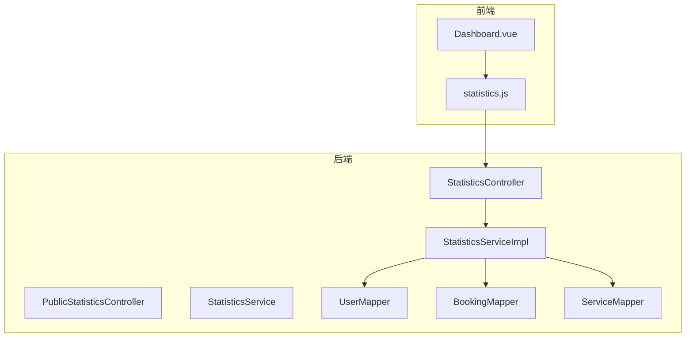
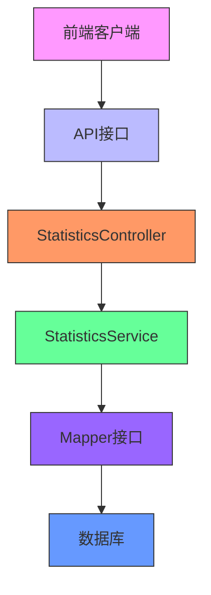
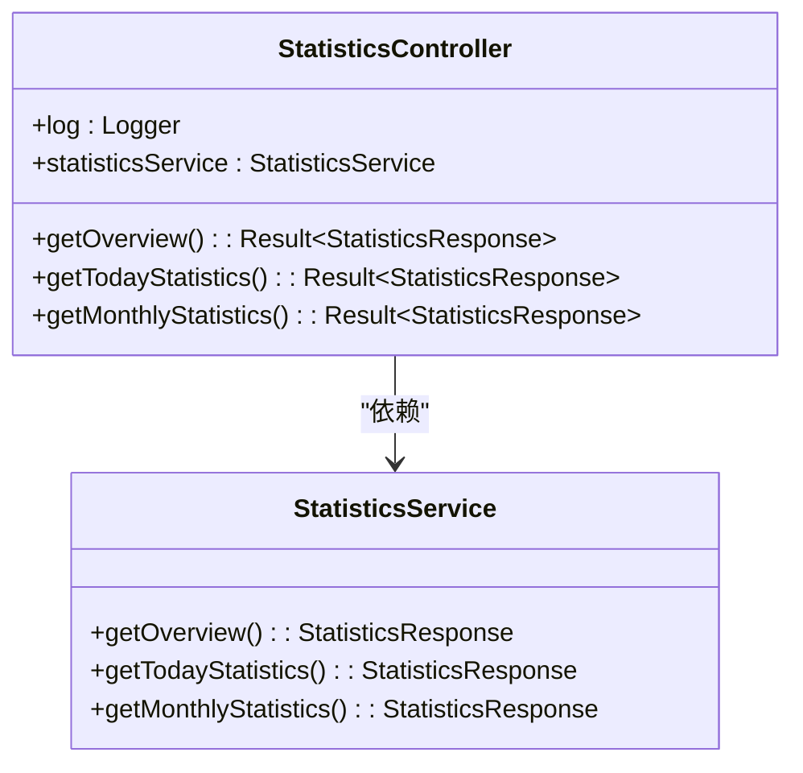
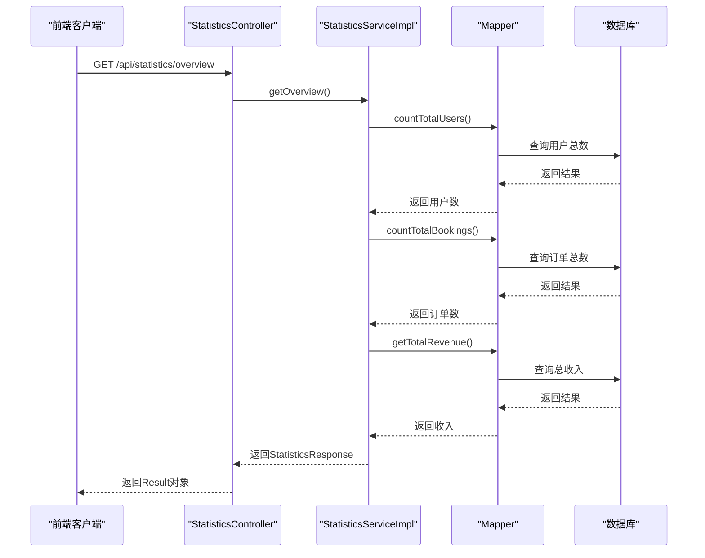
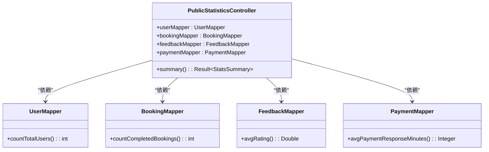
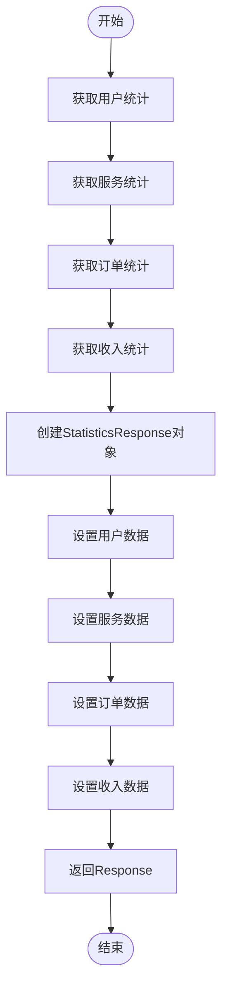
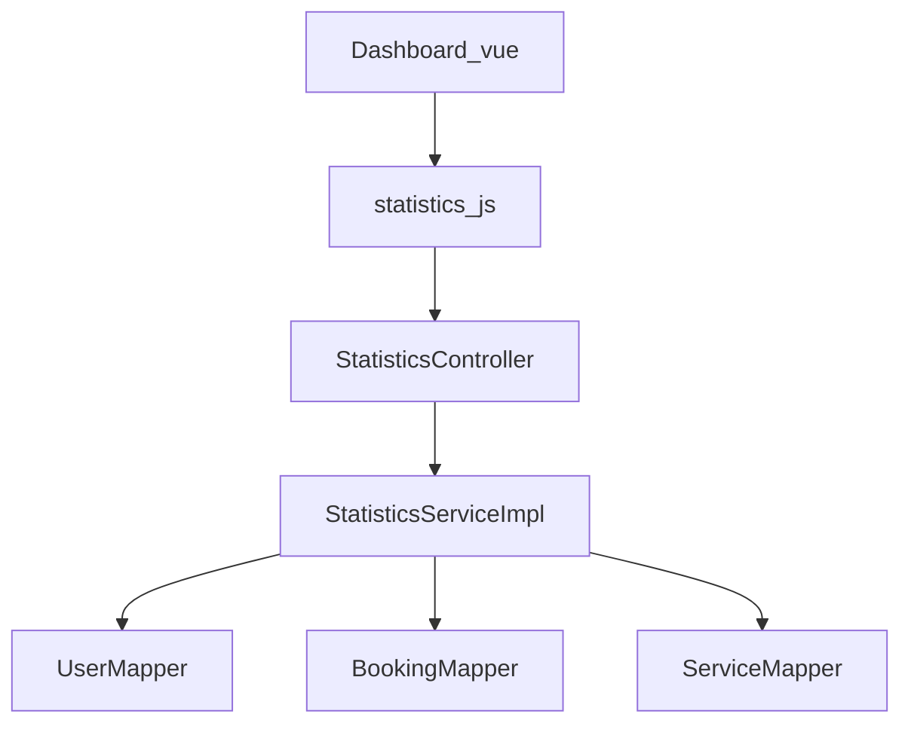

# 统计与仪表板接口

<cite>
**本文档引用的文件**   
- [StatisticsController.java](file://backend/src/main/java/com/carwash/controller/StatisticsController.java)
- [PublicStatisticsController.java](file://backend/src/main/java/com/carwash/controller/PublicStatisticsController.java)
- [StatisticsResponse.java](file://backend/src/main/java/com/carwash/dto/StatisticsResponse.java)
- [StatsSummary.java](file://backend/src/main/java/com/carwash/dto/StatsSummary.java)
- [StatisticsServiceImpl.java](file://backend/src/main/java/com/carwash/service/impl/StatisticsServiceImpl.java)
- [UserMapper.java](file://backend/src/main/java/com/carwash/mapper/UserMapper.java)
- [BookingMapper.java](file://backend/src/main/java/com/carwash/mapper/BookingMapper.java)
- [ServiceMapper.java](file://backend/src/main/java/com/carwash/mapper/ServiceMapper.java)
- [statistics.js](file://frontend/src/api/statistics.js)
- [Dashboard.vue](file://frontend/src/views/Dashboard.vue)
- [RedisUtils.java](file://backend/src/main/java/com/carwash/common/utils/RedisUtils.java)
- [application-payment.yml](file://backend/src/main/resources/application-payment.yml)
- [PaymentMapper.xml](file://backend/src/main/resources/mapper/PaymentMapper.xml)
</cite>

## 目录
1. [简介](#简介)
2. [项目结构](#项目结构)
3. [核心组件](#核心组件)
4. [架构概述](#架构概述)
5. [详细组件分析](#详细组件分析)
6. [依赖分析](#依赖分析)
7. [性能考虑](#性能考虑)
8. [故障排除指南](#故障排除指南)
9. [结论](#结论)

## 简介
本文档详细说明了汽车洗车服务预约系统中的统计类API，涵盖后台数据汇总与公开统计信息接口。文档重点描述了`GET /api/stats/revenue`、`/api/stats/bookings`等端点的数据聚合逻辑，支持按日、周、月维度查询。同时，文档详细说明了`StatisticsResponse`中各项指标（如订单数、收入、服务类型分布）的计算方式，并区分了管理员专用接口与公众可访问接口的权限差异。结合前端`statistics.js`的图表渲染需求，文档还说明了数据格式适配与缓存策略（Redis）。

## 项目结构
本项目采用典型的前后端分离架构，后端使用Spring Boot框架，前端使用Vue.js框架。统计功能主要分布在后端的`controller`、`service`和`mapper`包中，以及前端的`api`和`views`目录中。

**图示来源**
- [StatisticsController.java](file://backend/src/main/java/com/carwash/controller/StatisticsController.java)
- [StatisticsServiceImpl.java](file://backend/src/main/java/com/carwash/service/impl/StatisticsServiceImpl.java)
- [UserMapper.java](file://backend/src/main/java/com/carwash/mapper/UserMapper.java)
- [BookingMapper.java](file://backend/src/main/java/com/carwash/mapper/BookingMapper.java)
- [ServiceMapper.java](file://backend/src/main/java/com/carwash/mapper/ServiceMapper.java)
- [statistics.js](file://frontend/src/api/statistics.js)
- [Dashboard.vue](file://frontend/src/views/Dashboard.vue)

**本节来源**
- [StatisticsController.java](file://backend/src/main/java/com/carwash/controller/StatisticsController.java)
- [PublicStatisticsController.java](file://backend/src/main/java/com/carwash/controller/PublicStatisticsController.java)
- [statistics.js](file://frontend/src/api/statistics.js)
- [Dashboard.vue](file://frontend/src/views/Dashboard.vue)

## 核心组件
统计功能的核心组件包括后端的`StatisticsController`、`StatisticsServiceImpl`和`StatisticsResponse`，以及前端的`statistics.js`和`Dashboard.vue`。这些组件共同实现了数据的聚合、计算、传输和可视化。

**本节来源**
- [StatisticsController.java](file://backend/src/main/java/com/carwash/controller/StatisticsController.java)
- [StatisticsServiceImpl.java](file://backend/src/main/java/com/carwash/service/impl/StatisticsServiceImpl.java)
- [StatisticsResponse.java](file://backend/src/main/java/com/carwash/dto/StatisticsResponse.java)
- [statistics.js](file://frontend/src/api/statistics.js)
- [Dashboard.vue](file://frontend/src/views/Dashboard.vue)

## 架构概述
统计功能的架构分为三层：控制器层、服务层和数据访问层。控制器层负责接收HTTP请求并返回响应，服务层负责业务逻辑处理，数据访问层负责与数据库交互。前端通过API调用获取数据，并在仪表板页面进行可视化展示。

**图示来源**
- [StatisticsController.java](file://backend/src/main/java/com/carwash/controller/StatisticsController.java)
- [StatisticsServiceImpl.java](file://backend/src/main/java/com/carwash/service/impl/StatisticsServiceImpl.java)
- [UserMapper.java](file://backend/src/main/java/com/carwash/mapper/UserMapper.java)
- [BookingMapper.java](file://backend/src/main/java/com/carwash/mapper/BookingMapper.java)
- [ServiceMapper.java](file://backend/src/main/java/com/carwash/mapper/ServiceMapper.java)

## 详细组件分析

### 统计控制器分析
`StatisticsController`是统计功能的入口，提供了多个API端点，用于获取不同维度的统计数据。这些端点包括获取系统统计概览、今日统计和月度统计。

#### 类图

**图示来源**
- [StatisticsController.java](file://backend/src/main/java/com/carwash/controller/StatisticsController.java)
- [StatisticsService.java](file://backend/src/main/java/com/carwash/service/StatisticsService.java)

#### 序列图

**图示来源**
- [StatisticsController.java](file://backend/src/main/java/com/carwash/controller/StatisticsController.java)
- [StatisticsServiceImpl.java](file://backend/src/main/java/com/carwash/service/impl/StatisticsServiceImpl.java)
- [UserMapper.java](file://backend/src/main/java/com/carwash/mapper/UserMapper.java)
- [BookingMapper.java](file://backend/src/main/java/com/carwash/mapper/BookingMapper.java)

**本节来源**
- [StatisticsController.java](file://backend/src/main/java/com/carwash/controller/StatisticsController.java)
- [StatisticsServiceImpl.java](file://backend/src/main/java/com/carwash/service/impl/StatisticsServiceImpl.java)
- [UserMapper.java](file://backend/src/main/java/com/carwash/mapper/UserMapper.java)
- [BookingMapper.java](file://backend/src/main/java/com/carwash/mapper/BookingMapper.java)

### 公共统计控制器分析
`PublicStatisticsController`提供了公众可访问的统计接口，用于获取系统的基本统计信息，如用户数、完成订单数、满意度等。

#### 类图

**图示来源**
- [PublicStatisticsController.java](file://backend/src/main/java/com/carwash/controller/PublicStatisticsController.java)
- [UserMapper.java](file://backend/src/main/java/com/carwash/mapper/UserMapper.java)
- [BookingMapper.java](file://backend/src/main/java/com/carwash/mapper/BookingMapper.java)
- [FeedbackMapper.java](file://backend/src/main/java/com/carwash/mapper/FeedbackMapper.java)
- [PaymentMapper.java](file://backend/src/main/java/com/carwash/mapper/PaymentMapper.java)

**本节来源**
- [PublicStatisticsController.java](file://backend/src/main/java/com/carwash/controller/PublicStatisticsController.java)
- [UserMapper.java](file://backend/src/main/java/com/carwash/mapper/UserMapper.java)
- [BookingMapper.java](file://backend/src/main/java/com/carwash/mapper/BookingMapper.java)
- [FeedbackMapper.java](file://backend/src/main/java/com/carwash/mapper/FeedbackMapper.java)
- [PaymentMapper.java](file://backend/src/main/java/com/carwash/mapper/PaymentMapper.java)

### 统计服务实现分析
`StatisticsServiceImpl`是统计功能的核心业务逻辑实现类，负责从数据库中获取数据并进行聚合计算。

#### 流程图

**图示来源**
- [StatisticsServiceImpl.java](file://backend/src/main/java/com/carwash/service/impl/StatisticsServiceImpl.java)

**本节来源**
- [StatisticsServiceImpl.java](file://backend/src/main/java/com/carwash/service/impl/StatisticsServiceImpl.java)

## 依赖分析
统计功能的依赖关系主要体现在后端组件之间的依赖，以及前后端之间的依赖。后端组件通过Spring的依赖注入机制进行管理，前端通过API调用与后端进行交互。

**图示来源**
- [StatisticsController.java](file://backend/src/main/java/com/carwash/controller/StatisticsController.java)
- [StatisticsServiceImpl.java](file://backend/src/main/java/com/carwash/service/impl/StatisticsServiceImpl.java)
- [UserMapper.java](file://backend/src/main/java/com/carwash/mapper/UserMapper.java)
- [BookingMapper.java](file://backend/src/main/java/com/carwash/mapper/BookingMapper.java)
- [ServiceMapper.java](file://backend/src/main/java/com/carwash/mapper/ServiceMapper.java)
- [statistics.js](file://frontend/src/api/statistics.js)
- [Dashboard.vue](file://frontend/src/views/Dashboard.vue)

**本节来源**
- [StatisticsController.java](file://backend/src/main/java/com/carwash/controller/StatisticsController.java)
- [StatisticsServiceImpl.java](file://backend/src/main/java/com/carwash/service/impl/StatisticsServiceImpl.java)
- [UserMapper.java](file://backend/src/main/java/com/carwash/mapper/UserMapper.java)
- [BookingMapper.java](file://backend/src/main/java/com/carwash/mapper/BookingMapper.java)
- [ServiceMapper.java](file://backend/src/main/java/com/carwash/mapper/ServiceMapper.java)
- [statistics.js](file://frontend/src/api/statistics.js)
- [Dashboard.vue](file://frontend/src/views/Dashboard.vue)

## 性能考虑
为了提高统计功能的性能，系统采用了Redis缓存策略。对于频繁访问的统计数据，如系统概览、今日统计等，系统会将结果缓存到Redis中，减少数据库查询压力。同时，前端通过ECharts进行数据可视化，确保了图表渲染的流畅性。

**本节来源**
- [RedisUtils.java](file://backend/src/main/java/com/carwash/common/utils/RedisUtils.java)
- [Dashboard.vue](file://frontend/src/views/Dashboard.vue)

## 故障排除指南
在使用统计功能时，可能会遇到以下问题：
1. **数据不准确**：检查数据库中的数据是否正确，特别是订单状态和支付状态。
2. **接口返回403**：确保请求用户具有管理员权限，公众接口无需权限。
3. **图表不显示**：检查前端API调用是否成功，确保ECharts初始化正确。

**本节来源**
- [StatisticsController.java](file://backend/src/main/java/com/carwash/controller/StatisticsController.java)
- [PublicStatisticsController.java](file://backend/src/main/java/com/carwash/controller/PublicStatisticsController.java)
- [Dashboard.vue](file://frontend/src/views/Dashboard.vue)

## 结论
本文档详细介绍了汽车洗车服务预约系统中的统计类API，涵盖了后台数据汇总与公开统计信息接口。通过分析核心组件、架构和依赖关系，文档为开发者提供了全面的参考。结合前端图表渲染需求，文档还说明了数据格式适配与缓存策略，确保了系统的高性能和可维护性。