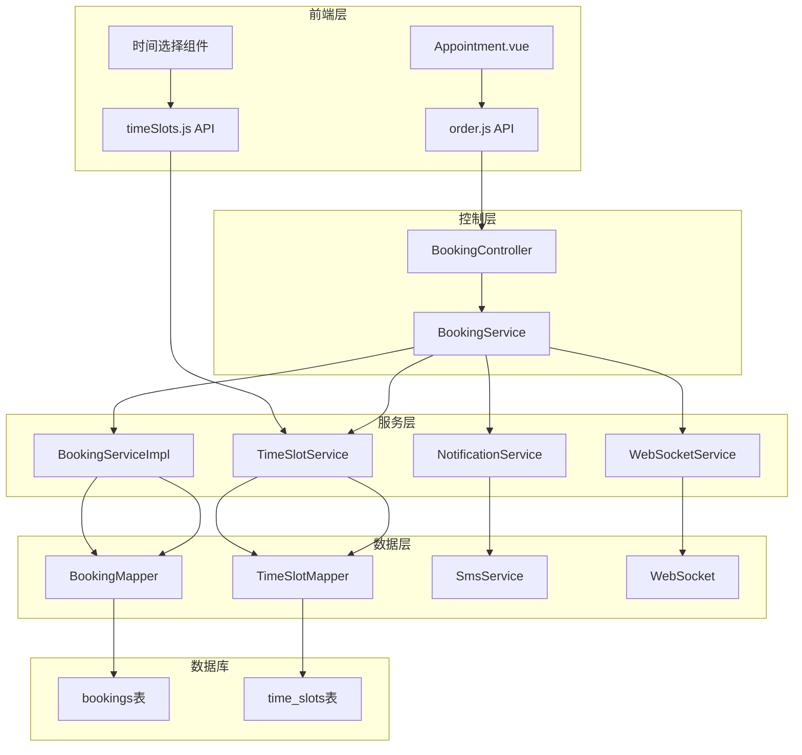
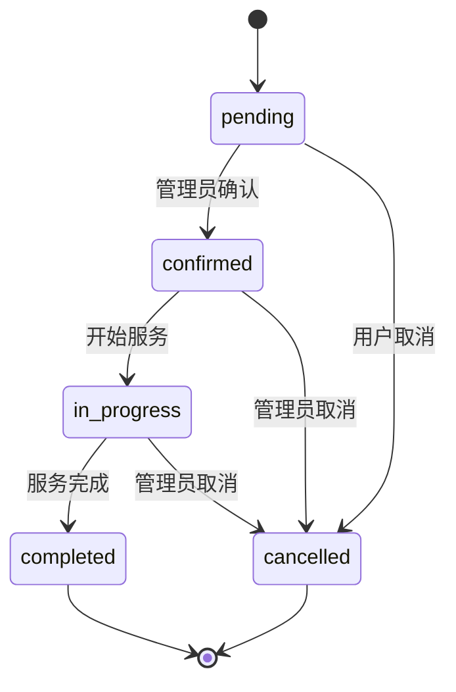
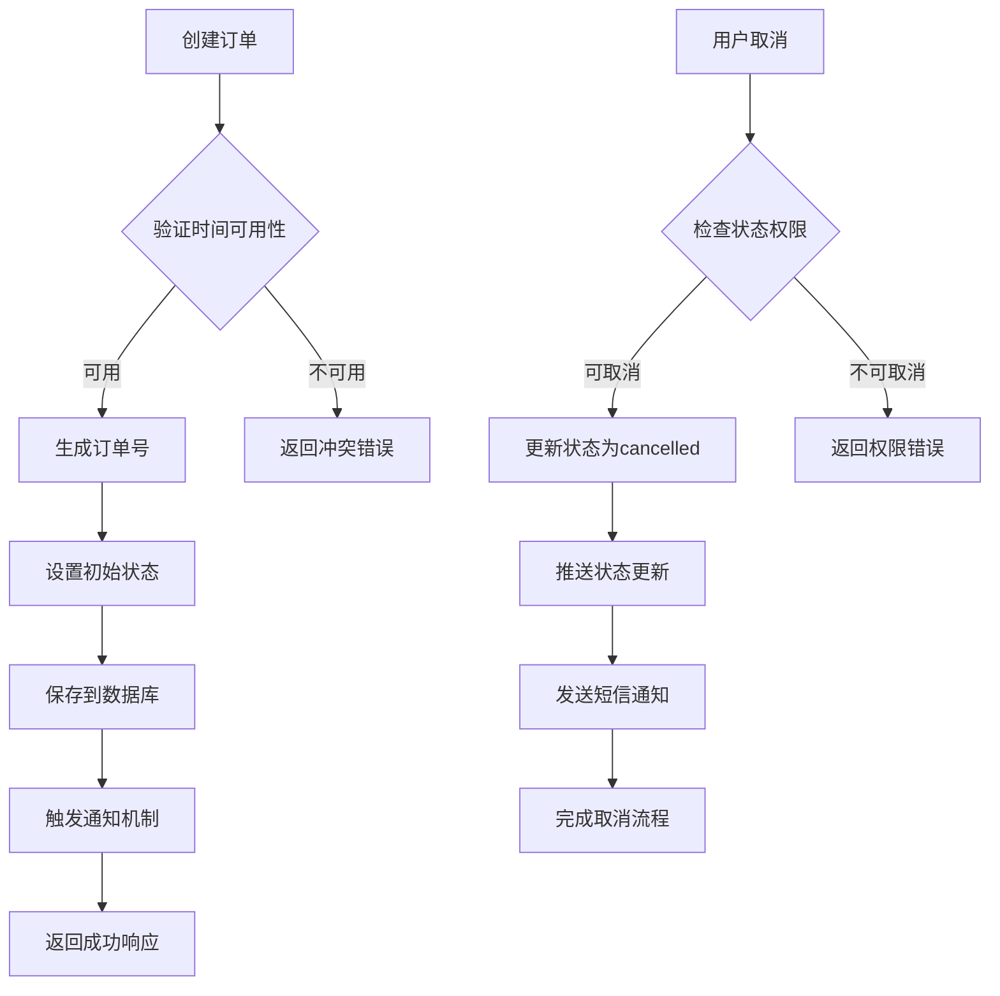
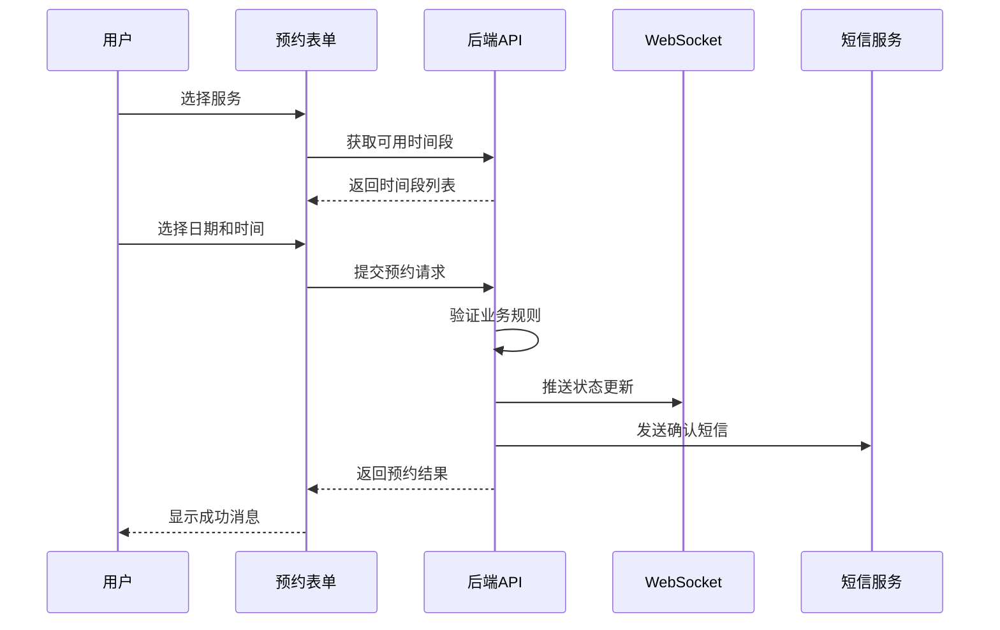
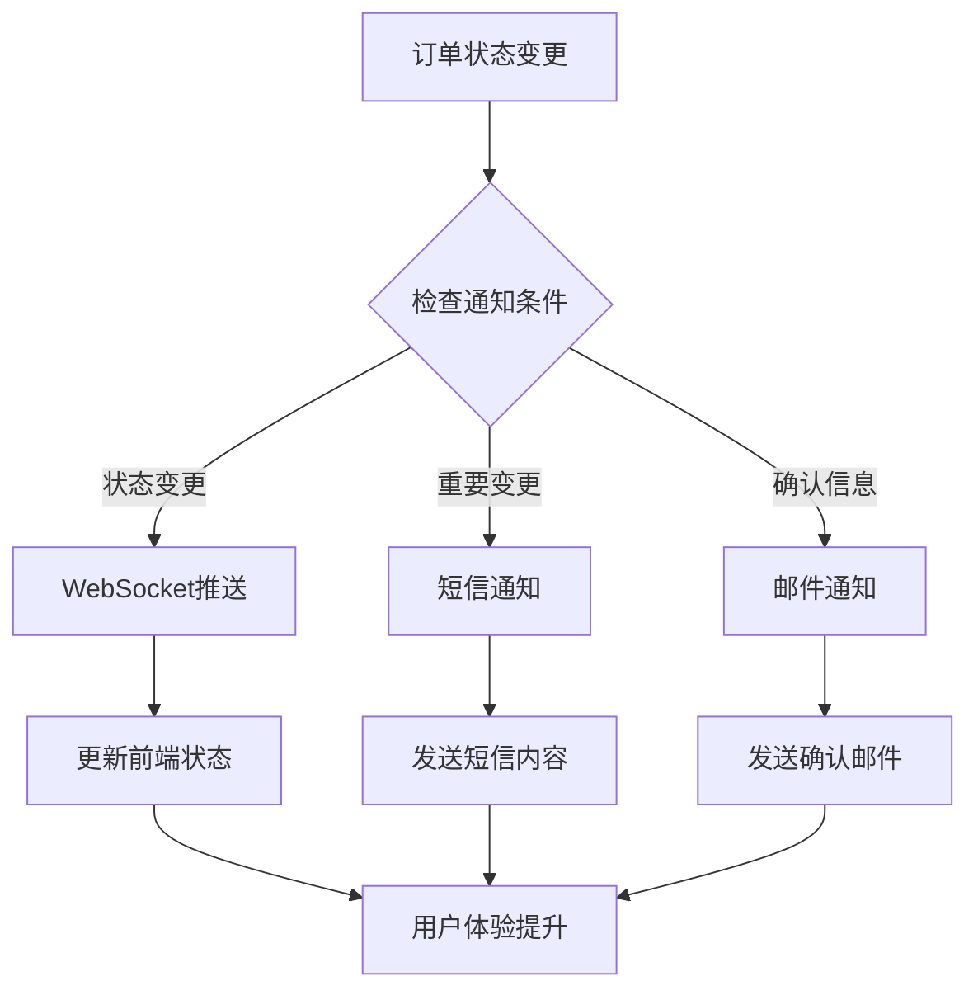
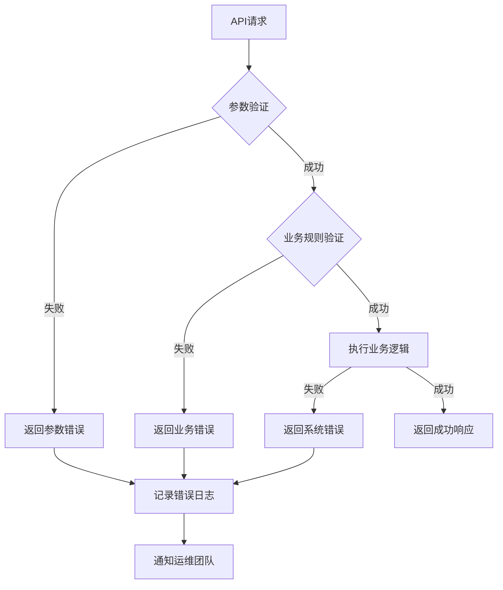

# 预约接口

<cite>
**本文档引用的文件**
- [BookingController.java](file://backend/src/main/java/com/carwash/controller/BookingController.java)
- [BookingRequest.java](file://backend/src/main/java/com/carwash/dto/BookingRequest.java)
- [BookingResponse.java](file://backend/src/main/java/com/carwash/dto/BookingResponse.java)
- [Booking.java](file://backend/src/main/java/com/carwash/entity/Booking.java)
- [BookingServiceImpl.java](file://backend/src/main/java/com/carwash/service/impl/BookingServiceImpl.java)
- [TimeSlotService.java](file://backend/src/main/java/com/carwash/service/TimeSlotService.java)
- [TimeSlot.java](file://backend/src/main/java/com/carwash/entity/TimeSlot.java)
- [AppointmentStatus.java](file://backend/src/main/java/com/carwash/common/enums/AppointmentStatus.java)
- [order.js](file://frontend/src/api/order.js)
- [Appointment.vue](file://frontend/src/views/Appointment.vue)
- [timeSlots.js](file://frontend/src/api/timeSlots.js)
</cite>

## 目录
1. [简介](#简介)
2. [系统架构](#系统架构)
3. [核心数据结构](#核心数据结构)
4. [API端点详解](#api端点详解)
5. [业务规则与约束](#业务规则与约束)
6. [前端集成示例](#前端集成示例)
7. [通知机制](#通知机制)
8. [错误处理](#错误处理)
9. [最佳实践](#最佳实践)

## 简介

汽车洗车服务预约系统提供完整的预约管理功能，支持用户在线预约洗车服务、查询预约状态、取消预约等操作。系统采用前后端分离架构，后端基于Spring Boot框架，前端使用Vue.js技术栈。

### 主要功能特性

- **多步骤预约流程**：包含服务选择、时间选择、车辆信息填写和确认阶段
- **智能时间冲突检测**：自动验证时间段可用性和避免重复预约
- **实时状态同步**：通过WebSocket实现实时订单状态更新
- **多种通知方式**：支持短信通知和WebSocket推送
- **灵活的权限控制**：区分普通用户和管理员权限

## 系统架构



**图表来源**
- [BookingController.java](file://backend/src/main/java/com/carwash/controller/BookingController.java#L26-L228)
- [BookingServiceImpl.java](file://backend/src/main/java/com/carwash/service/impl/BookingServiceImpl.java#L44-L598)
- [TimeSlotService.java](file://backend/src/main/java/com/carwash/service/TimeSlotService.java#L16-L54)

## 核心数据结构

### BookingRequest - 预约请求数据结构

预约请求包含了创建预约所需的所有必要信息：

| 字段名 | 类型 | 必填 | 描述 | 示例值 |
|--------|------|------|------|--------|
| userId | Long | 是 | 用户唯一标识 | 1001 |
| serviceId | Long | 是 | 服务类型ID | 5 |
| timeSlotId | Long | 否 | 时间段ID | 123 |
| bookingDate | LocalDate | 否 | 预约日期 | 2024-12-15 |
| carNumber | String | 是 | 车牌号码 | 京A12345 |
| carModel | String | 是 | 车辆型号 | 奥迪A4L |
| contactPhone | String | 是 | 联系电话 | 13800138000 |
| notes | String | 否 | 备注信息 | 特殊要求说明 |

**节来源**
- [BookingRequest.java](file://backend/src/main/java/com/carwash/dto/BookingRequest.java#L12-L120)

### BookingResponse - 预约响应数据结构

预约响应包含了完整的订单信息和状态：

| 字段名 | 类型 | 描述 | 示例值 |
|--------|------|------|--------|
| id | Long | 订单唯一标识 | 10001 |
| orderNo | String | 订单编号 | CW1702534800000 |
| userId | Long | 用户ID | 1001 |
| serviceId | Long | 服务ID | 5 |
| serviceName | String | 服务名称 | 基础洗车 |
| timeSlotId | Long | 时间段ID | 123 |
| bookingDate | LocalDate | 预约日期 | 2024-12-15 |
| bookingTime | String | 预约时间 | 09:00-10:00 |
| carNumber | String | 车牌号 | 京A12345 |
| carModel | String | 车型 | 奥迪A4L |
| contactPhone | String | 联系电话 | 13800138000 |
| totalPrice | BigDecimal | 总价 | 88.00 |
| status | String | 订单状态 | pending |
| paymentStatus | String | 支付状态 | unpaid |
| createdAt | LocalDateTime | 创建时间 | 2024-12-15T10:30:00 |

**节来源**
- [BookingResponse.java](file://backend/src/main/java/com/carwash/dto/BookingResponse.java#L14-L129)

### TimeSlot - 时间段数据结构

时间段实体定义了可预约的时间窗口：

| 字段名 | 类型 | 描述 | 默认值 |
|--------|------|------|--------|
| id | Long | 时间段ID | 自动生成 |
| date | LocalDate | 日期 | 当前日期 |
| startTime | LocalTime | 开始时间 | 09:00 |
| endTime | LocalTime | 结束时间 | 09:30 |
| maxBookings | Integer | 最大预约数 | 3 |
| currentBookings | Integer | 当前预约数 | 0 |
| status | Integer | 可用状态 | 1 (可用) |

**节来源**
- [TimeSlot.java](file://backend/src/main/java/com/carwash/entity/TimeSlot.java#L17-L164)

## API端点详解

### POST /api/bookings - 创建预约

创建新的预约订单，系统会自动验证时间可用性和业务规则。

#### 请求参数

```json
{
  "userId": 1001,
  "serviceId": 5,
  "timeSlotId": 123,
  "bookingDate": "2024-12-15",
  "carNumber": "京A12345",
  "carModel": "奥迪A4L",
  "contactPhone": "13800138000",
  "notes": "需要打蜡服务"
}
```

#### 响应格式

```json
{
  "code": 200,
  "message": "成功",
  "data": {
    "id": 10001,
    "orderNo": "CW1702534800000",
    "userId": 1001,
    "serviceId": 5,
    "serviceName": "基础洗车",
    "timeSlotId": 123,
    "bookingDate": "2024-12-15",
    "bookingTime": "09:00-10:00",
    "carNumber": "京A12345",
    "carModel": "奥迪A4L",
    "contactPhone": "13800138000",
    "totalPrice": 88.00,
    "status": "pending",
    "paymentStatus": "unpaid",
    "createdAt": "2024-12-15T10:30:00"
  }
}
```

#### 业务规则

1. **用户验证**：必须提供有效的用户ID
2. **服务验证**：服务ID必须存在且有效
3. **时间验证**：
   - 时间段ID必须存在且可用
   - 时间段不能超过最大预约限制
   - 时间段状态必须为可用（status=1）
4. **重复检查**：同一时间段内同一用户只能预约一次

**节来源**
- [BookingController.java](file://backend/src/main/java/com/carwash/controller/BookingController.java#L38-L63)
- [BookingServiceImpl.java](file://backend/src/main/java/com/carwash/service/impl/BookingServiceImpl.java#L77-L174)

### GET /api/bookings/user/{userId} - 获取用户预约列表

获取指定用户的全部预约记录。

#### URL参数

| 参数名 | 类型 | 必填 | 描述 |
|--------|------|------|------|
| userId | Long | 是 | 用户ID |

#### 响应格式

```json
{
  "code": 200,
  "message": "成功",
  "data": [
    {
      "id": 10001,
      "orderNo": "CW1702534800000",
      "userId": 1001,
      "serviceId": 5,
      "serviceName": "基础洗车",
      "timeSlotId": 123,
      "bookingDate": "2024-12-15",
      "bookingTime": "09:00-10:00",
      "status": "confirmed",
      "paymentStatus": "paid",
      "createdAt": "2024-12-15T10:30:00"
    }
  ]
}
```

**节来源**
- [BookingController.java](file://backend/src/main/java/com/carwash/controller/BookingController.java#L69-L74)

### GET /api/bookings/{bookingId} - 获取预约详情

根据订单ID获取详细的预约信息。

#### URL参数

| 参数名 | 类型 | 必填 | 描述 |
|--------|------|------|------|
| bookingId | Long | 是 | 订单ID |

#### 响应格式

```json
{
  "code": 200,
  "message": "成功",
  "data": {
    "id": 10001,
    "orderNo": "CW1702534800000",
    "userId": 1001,
    "serviceId": 5,
    "serviceName": "基础洗车",
    "timeSlotId": 123,
    "bookingDate": "2024-12-15",
    "bookingTime": "09:00-10:00",
    "carNumber": "京A12345",
    "carModel": "奥迪A4L",
    "contactPhone": "13800138000",
    "totalPrice": 88.00,
    "status": "pending",
    "paymentStatus": "unpaid",
    "createdAt": "2024-12-15T10:30:00",
    "completedAt": null,
    "cancelledAt": null,
    "cancelReason": null
  }
}
```

**节来源**
- [BookingController.java](file://backend/src/main/java/com/carwash/controller/BookingController.java#L79-L85)

### DELETE /api/bookings/{bookingId} - 取消预约

取消指定的预约订单，仅限于待确认或已确认状态的订单。

#### URL参数

| 参数名 | 类型 | 必填 | 描述 |
|--------|------|------|------|
| bookingId | Long | 是 | 订单ID |

#### 请求参数

| 参数名 | 类型 | 必填 | 描述 |
|--------|------|------|------|
| reason | String | 是 | 取消原因 |

#### 响应格式

```json
{
  "code": 200,
  "message": "成功",
  "data": null
}
```

#### 状态转换规则

- **待确认订单**：可以直接取消
- **已确认订单**：可以取消，但可能产生违约金
- **进行中订单**：不能取消
- **已完成订单**：不能取消
- **已取消订单**：不能再次取消

**节来源**
- [BookingController.java](file://backend/src/main/java/com/carwash/controller/BookingController.java#L99-L105)
- [BookingServiceImpl.java](file://backend/src/main/java/com/carwash/service/impl/BookingServiceImpl.java#L220-L256)

### PUT /api/bookings/{bookingId}/status - 更新订单状态

管理员专用接口，用于更新订单的各种状态。

#### URL参数

| 参数名 | 类型 | 必填 | 描述 |
|--------|------|------|------|
| bookingId | Long | 是 | 订单ID |

#### 请求参数

| 参数名 | 类型 | 必填 | 描述 | 枚举值 |
|--------|------|------|------|--------|
| status | String | 是 | 新状态 | pending, confirmed, in_progress, completed, cancelled |

#### 响应格式

```json
{
  "code": 200,
  "message": "成功",
  "data": {
    "id": 10001,
    "orderNo": "CW1702534800000",
    "userId": 1001,
    "serviceId": 5,
    "serviceName": "基础洗车",
    "timeSlotId": 123,
    "bookingDate": "2024-12-15",
    "bookingTime": "09:00-10:00",
    "status": "confirmed",
    "paymentStatus": "paid",
    "createdAt": "2024-12-15T10:30:00",
    "updatedAt": "2024-12-15T11:00:00"
  }
}
```

#### 状态转换验证



**图表来源**
- [BookingServiceImpl.java](file://backend/src/main/java/com/carwash/service/impl/BookingServiceImpl.java#L392-L411)

**节来源**
- [BookingController.java](file://backend/src/main/java/com/carwash/controller/BookingController.java#L148-L166)
- [BookingServiceImpl.java](file://backend/src/main/java/com/carwash/service/impl/BookingServiceImpl.java#L259-L390)

## 业务规则与约束

### 时间冲突检测机制

系统实现了多层次的时间冲突检测：

1. **时间段可用性检查**
   - 验证时间段状态是否为可用（status=1）
   - 检查当前预约数量是否达到上限
   - 确保时间段未被锁定或维护

2. **用户重复预约检查**
   - 同一时间段内同一用户只能预约一次
   - 同一用户在同一时间段内的重复预约会被拒绝

3. **时间范围验证**
   - 验证预约时间是否在工作时间内
   - 确保预约时间不早于当前时间
   - 检查跨天预约的合法性

**节来源**
- [BookingServiceImpl.java](file://backend/src/main/java/com/carwash/service/impl/BookingServiceImpl.java#L100-L118)

### 订单状态生命周期



**图表来源**
- [BookingServiceImpl.java](file://backend/src/main/java/com/carwash/service/impl/BookingServiceImpl.java#L220-L256)

### 权限控制

| 操作 | 用户权限 | 管理员权限 |
|------|----------|------------|
| 创建预约 | ✓ | ✓ |
| 查看个人预约 | ✓ | ✓ |
| 查看所有预约 | ✗ | ✓ |
| 取消预约 | ✓（特定状态） | ✓ |
| 更新订单状态 | ✗ | ✓ |
| 删除订单 | ✗ | ✓ |
| 永久删除订单 | ✗ | ✓ |

**节来源**
- [BookingController.java](file://backend/src/main/java/com/carwash/controller/BookingController.java#L70-L113)

## 前端集成示例

### 表单提交流程

前端预约表单采用多步骤设计，逐步引导用户完成预约：



**图表来源**
- [Appointment.vue](file://frontend/src/views/Appointment.vue#L1-L200)
- [order.js](file://frontend/src/api/order.js#L1-L222)

### 状态同步机制

前端通过WebSocket实现实时状态同步：

```javascript
// 前端状态监听示例
const orderApi = {
  // 监听订单状态变化
  listenOrderStatus(orderId, callback) {
    // WebSocket连接处理
    wsConnection.onMessage((message) => {
      if (message.type === 'ORDER_STATUS_UPDATE' && 
          message.orderId === orderId) {
        callback(message.newStatus, message.timestamp);
      }
    });
  }
};
```

**节来源**
- [order.js](file://frontend/src/api/order.js#L110-L140)

### 时间段可用性验证

前端通过专门的时间段API验证时间可用性：

```javascript
// 时间段验证示例
const timeSlotsApi = {
  // 获取可用时间段
  async getAvailableTimeSlots(date) {
    return request.get('/time-slots/available', {
      params: { date }
    });
  },
  
  // 查找时间段ID
  async findTimeSlotId(date, timeRange) {
    return request.get('/time-slots/find', {
      params: { date, timeRange }
    });
  }
};
```

**节来源**
- [timeSlots.js](file://frontend/src/api/timeSlots.js#L6-L35)

## 通知机制

### 通知类型

系统提供多种通知方式确保用户及时收到重要信息：

1. **WebSocket推送**：实时状态更新
2. **短信通知**：关键状态变更提醒
3. **邮件通知**：正式确认和提醒

### 通知触发时机



**图表来源**
- [BookingServiceImpl.java](file://backend/src/main/java/com/carwash/service/impl/BookingServiceImpl.java#L348-L390)

### 通知内容模板

#### 订单状态变更短信

```
尊敬的客户，您的预约订单【{orderNo}】状态已变更为：{newStatus}
服务时间：{bookingTime}
如需帮助，请联系客服：400-123-4567
```

#### 订单确认邮件

```
主题：预约确认 - #{orderNo}

尊敬的{customerName}，

感谢您选择我们的洗车服务！您的预约已成功确认：

服务项目：{serviceName}
预约时间：{bookingDate} {bookingTime}
车牌号码：{carNumber}

注意事项：
1. 请提前10分钟到达
2. 如需改期，请至少提前2小时通知
3. 服务完成后可进行评价

期待为您提供优质服务！
```

**节来源**
- [BookingServiceImpl.java](file://backend/src/main/java/com/carwash/service/impl/BookingServiceImpl.java#L360-L389)

## 错误处理

### 常见错误码

| 错误码 | 错误描述 | 解决方案 |
|--------|----------|----------|
| PARAM_ERROR | 参数错误 | 检查必填字段和参数格式 |
| SERVICE_NOT_FOUND | 服务不存在 | 确认服务ID有效性 |
| APPOINTMENT_CONFLICT | 预约冲突 | 选择其他时间段或日期 |
| ORDER_NOT_FOUND | 订单不存在 | 检查订单ID |
| ORDER_CANNOT_CANCEL | 无法取消订单 | 检查订单状态 |
| INVALID_STATUS_TRANSITION | 无效的状态转换 | 遵循状态转换规则 |

### 错误处理流程



**节来源**
- [BookingController.java](file://backend/src/main/java/com/carwash/controller/BookingController.java#L38-L63)
- [BookingServiceImpl.java](file://backend/src/main/java/com/carwash/service/impl/BookingServiceImpl.java#L168-L174)

## 最佳实践

### 开发建议

1. **前端验证**
   - 在提交前验证表单完整性
   - 提供实时的可用性反馈
   - 显示清晰的错误提示

2. **后端安全**
   - 实施适当的权限验证
   - 记录详细的审计日志
   - 防止SQL注入和XSS攻击

3. **性能优化**
   - 缓存常用的服务和时间段数据
   - 实现异步处理长耗时操作
   - 使用数据库索引优化查询

### 运维监控

1. **关键指标**
   - 预约成功率
   - 平均响应时间
   - 错误率统计
   - 用户活跃度

2. **告警机制**
   - 系统异常告警
   - 性能瓶颈告警
   - 业务异常告警

### 扩展性考虑

1. **水平扩展**
   - 数据库读写分离
   - 缓存集群部署
   - 负载均衡配置

2. **功能扩展**
   - 支持更多支付方式
   - 集成第三方服务
   - 多语言国际化支持

通过遵循这些最佳实践，可以确保预约系统的稳定性、安全性和可扩展性，为用户提供优质的预约体验。