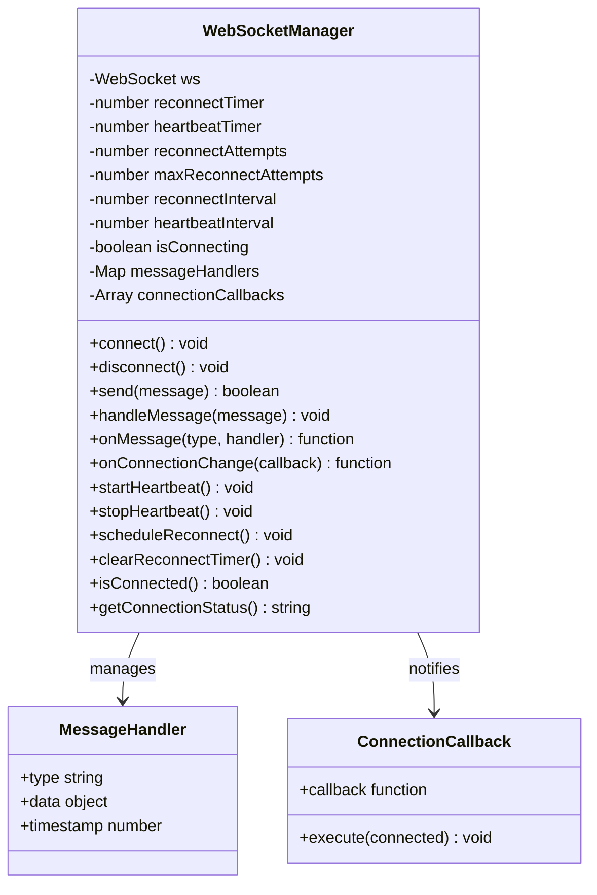
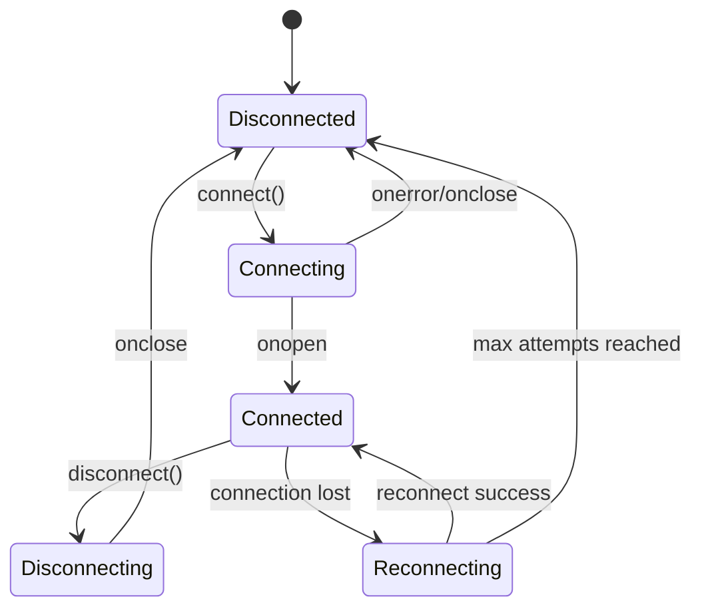
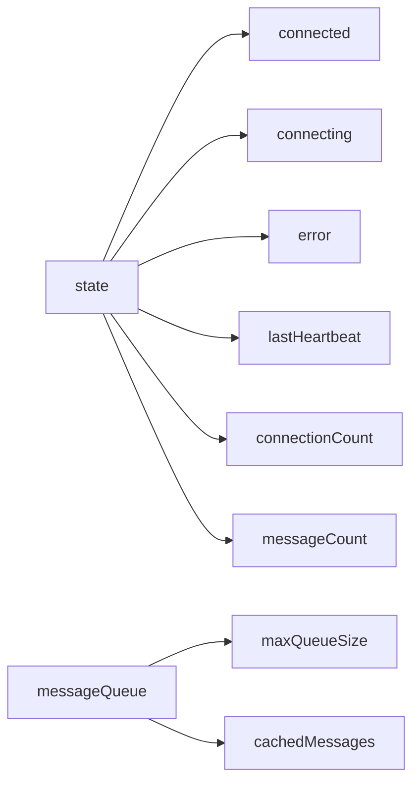
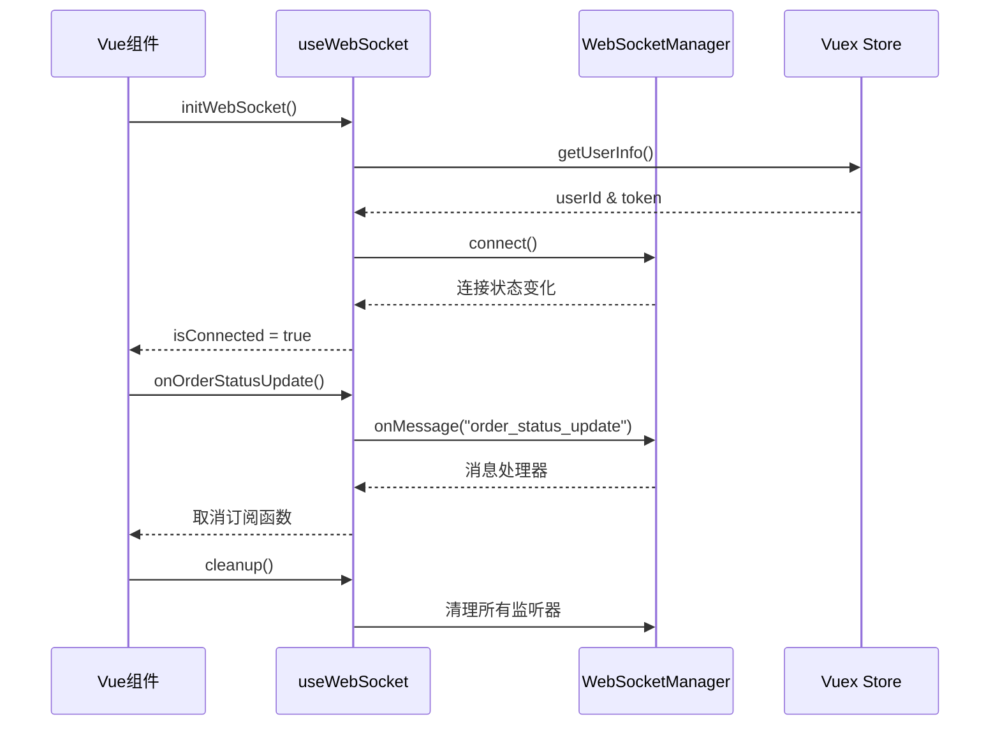
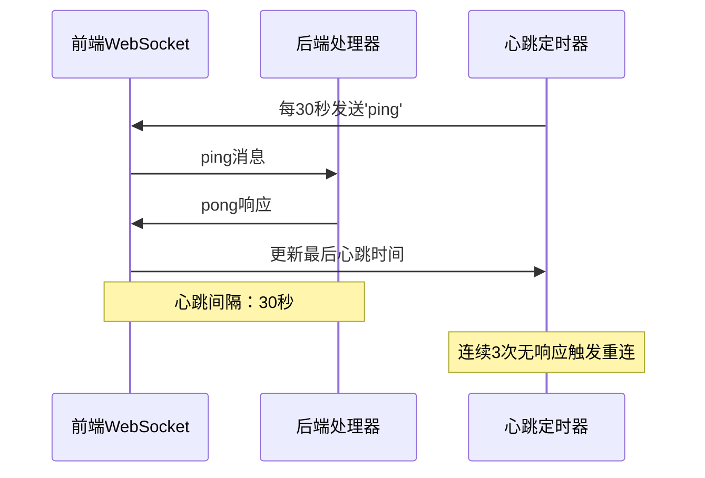
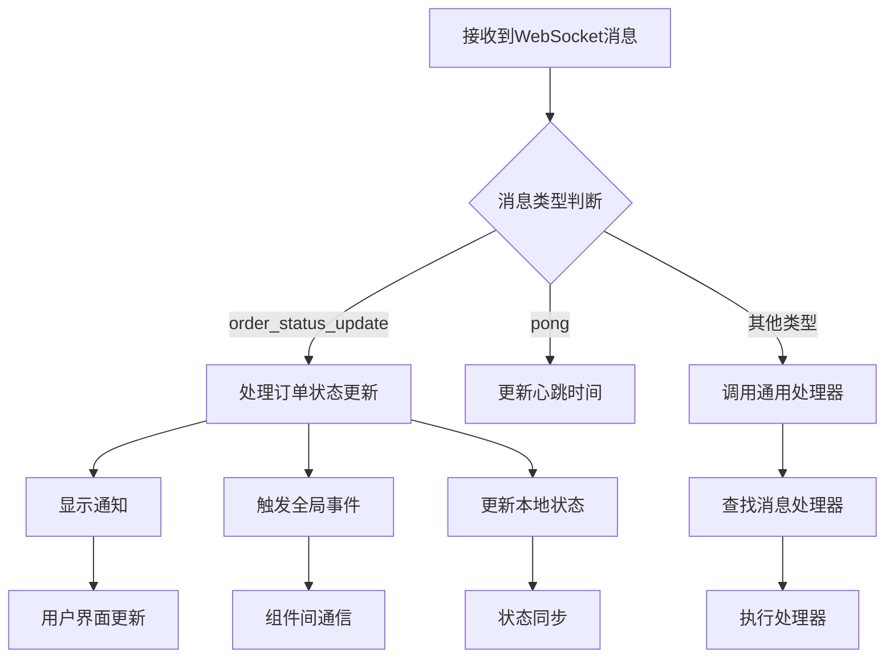
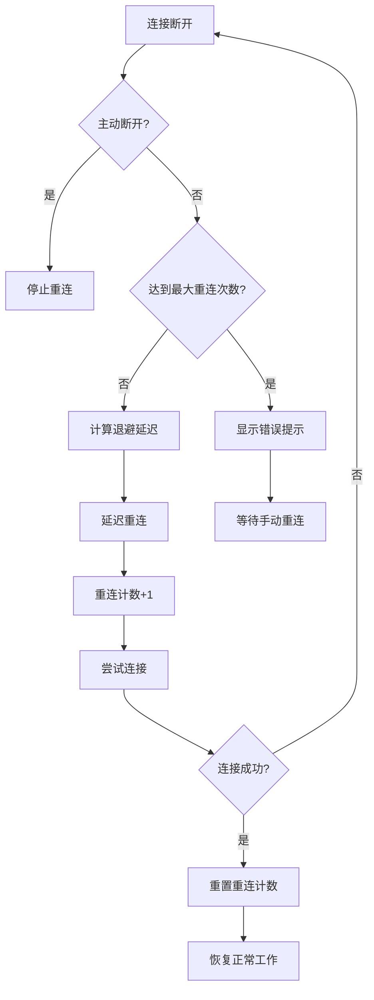
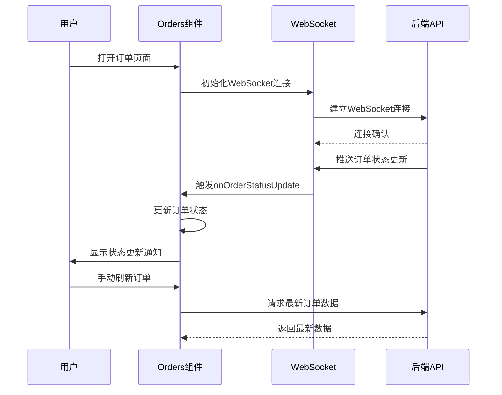
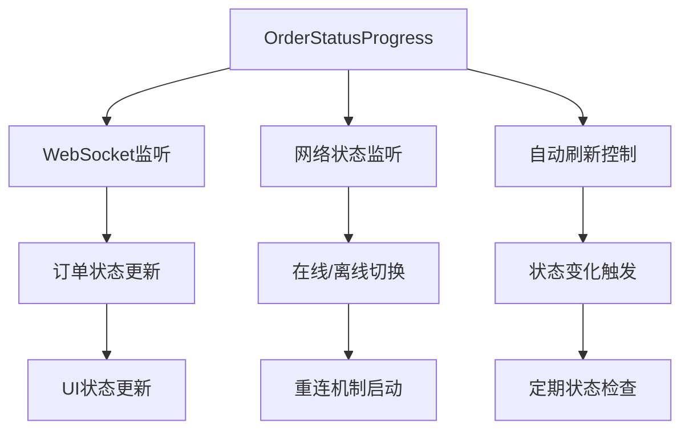

# WebSocket实时通信系统全面解析

<cite>
**本文档引用的文件**
- [websocket.js](file://frontend/src/utils/websocket.js)
- [useWebSocket.js](file://frontend/src/composables/useWebSocket.js)
- [enhancedWebSocket.js](file://frontend/src/utils/enhancedWebSocket.js)
- [Orders.vue](file://frontend/src/views/Orders.vue)
- [OrderStatusProgress.vue](file://frontend/src/components/OrderStatusProgress.vue)
- [OrderStatusWebSocketHandler.java](file://backend/src/main/java/com/carwash/websocket/OrderStatusWebSocketHandler.java)
- [WebSocketConfig.java](file://backend/src/main/java/com/carwash/config/WebSocketConfig.java)
</cite>

## 目录
1. [系统概述](#系统概述)
2. [核心架构设计](#核心架构设计)
3. [WebSocketManager类深度分析](#websocketmanager类深度分析)
4. [增强版WebSocket管理器](#增强版websocket管理器)
5. [Vue组合式函数封装](#vue组合式函数封装)
6. [心跳机制实现](#心跳机制实现)
7. [消息分发系统](#消息分发系统)
8. [错误处理与自动重连](#错误处理与自动重连)
9. [实际应用案例](#实际应用案例)
10. [性能优化与最佳实践](#性能优化与最佳实践)

## 系统概述

本WebSocket实时通信系统采用前后端分离架构，实现了订单状态的实时推送功能。系统包含三个主要层次：后端Spring WebSocket处理器、前端WebSocket管理器、Vue组件层的组合式函数封装。

### 技术栈特点

- **后端**: Spring Boot + WebSocket + Jackson JSON序列化
- **前端**: Vue 3 + Composition API + TypeScript风格的JavaScript
- **通信协议**: WebSocket + JSON消息格式
- **实时性**: 心跳保活 + 自动重连机制

## 核心架构设计

```mermaid
graph TB
subgraph "前端架构"
A[Vue组件] --> B[useWebSocket Composable]
B --> C[WebSocketManager]
C --> D[原生WebSocket]
E[增强版WebSocket] --> F[EnhancedWebSocketManager]
F --> G[高级功能]
end
subgraph "后端架构"
H[WebSocketConfig] --> I[OrderStatusWebSocketHandler]
I --> J[用户会话管理]
I --> K[消息广播]
end
D < --> H
G < --> H
subgraph "消息流转"
L[订单状态变更] --> M[后端服务]
M --> N[WebSocket推送]
N --> O[前端接收处理]
end
```

**图表来源**
- [WebSocketConfig.java](file://backend/src/main/java/com/carwash/config/WebSocketConfig.java#L1-L30)
- [OrderStatusWebSocketHandler.java](file://backend/src/main/java/com/carwash/websocket/OrderStatusWebSocketHandler.java#L1-L225)
- [websocket.js](file://frontend/src/utils/websocket.js#L1-L297)

## WebSocketManager类深度分析

### 类结构概览

WebSocketManager是系统的核心控制器，负责WebSocket连接的全生命周期管理。



**图表来源**
- [websocket.js](file://frontend/src/utils/websocket.js#L4-L297)

### 连接管理机制

#### connect()方法实现

连接方法实现了严格的连接状态控制和用户身份验证：

- **状态检查**: 防止重复连接和并发连接
- **用户验证**: 从Vuex store获取用户信息
- **URL构建**: 动态生成带用户ID的WebSocket URL
- **事件绑定**: 设置完整的WebSocket事件处理器

#### disconnect()方法实现

断开连接时的优雅处理：

- **心跳停止**: 清理心跳定时器
- **重连清理**: 取消自动重连计划
- **连接状态**: 正确设置连接状态标志

**章节来源**
- [websocket.js](file://frontend/src/utils/websocket.js#L18-L111)

### 连接状态机设计

系统使用`isConnecting`标志实现精确的状态控制：



**图表来源**
- [websocket.js](file://frontend/src/utils/websocket.js#L44-L99)

## 增强版WebSocket管理器

### 高级功能特性

EnhancedWebSocketManager提供了更丰富的功能集，包括：

- **响应式状态管理**: 使用Vue的reactive系统
- **消息队列**: 离线消息缓存和重发
- **连接统计**: 详细的连接和消息统计
- **超时处理**: 连接超时检测和处理
- **多事件监听**: 支持多种事件类型的监听

### 状态管理系统



**图表来源**
- [enhancedWebSocket.js](file://frontend/src/utils/enhancedWebSocket.js#L23-L31)

**章节来源**
- [enhancedWebSocket.js](file://frontend/src/utils/enhancedWebSocket.js#L1-L523)

## Vue组合式函数封装

### useWebSocket组合式函数

useWebSocket提供了简洁的Vue 3 API，封装了WebSocket管理器的所有功能：



**图表来源**
- [useWebSocket.js](file://frontend/src/composables/useWebSocket.js#L13-L80)

### 生命周期集成

系统实现了完整的Vue生命周期集成：

- **onMounted**: 自动初始化WebSocket连接
- **onUnmounted**: 清理所有监听器和定时器
- **响应式状态**: 使用ref和computed实现响应式连接状态

**章节来源**
- [useWebSocket.js](file://frontend/src/composables/useWebSocket.js#L1-L100)

## 心跳机制实现

### 心跳流程设计

系统实现了双向心跳机制，确保连接的可靠性：



**图表来源**
- [websocket.js](file://frontend/src/utils/websocket.js#L224-L236)
- [OrderStatusWebSocketHandler.java](file://backend/src/main/java/com/carwash/websocket/OrderStatusWebSocketHandler.java#L62-L65)

### 心跳配置参数

| 参数 | 默认值 | 说明 |
|------|--------|------|
| heartbeatInterval | 30000ms | 心跳发送间隔 |
| reconnectInterval | 3000ms | 初始重连间隔 |
| maxReconnectAttempts | 5 | 最大重连次数 |
| connectTimeout | 10000ms | 连接超时时间 |

**章节来源**
- [websocket.js](file://frontend/src/utils/websocket.js#L8-L12)
- [enhancedWebSocket.js](file://frontend/src/utils/enhancedWebSocket.js#L18-L20)

## 消息分发系统

### 消息路由机制

系统实现了灵活的消息分发系统：



**图表来源**
- [websocket.js](file://frontend/src/utils/websocket.js#L129-L158)

### 消息处理器注册

系统支持动态注册消息处理器：

```javascript
// 注册订单状态更新处理器
const unsubscribe = onMessage("order_status_update", (data) => {
    // 处理订单状态更新逻辑
});

// 返回的取消函数用于清理
unsubscribe();
```

**章节来源**
- [websocket.js](file://frontend/src/utils/websocket.js#L192-L209)

## 错误处理与自动重连

### 重连策略设计

系统实现了指数退避算法的重连策略：



**图表来源**
- [websocket.js](file://frontend/src/utils/websocket.js#L247-L259)
- [enhancedWebSocket.js](file://frontend/src/utils/enhancedWebSocket.js#L268-L297)

### 错误分类处理

| 错误类型 | 处理策略 | 用户反馈 |
|----------|----------|----------|
| 网络错误 | 自动重连 | 显示重连提示 |
| 认证失败 | 停止重连 | 显示登录提示 |
| 服务器错误 | 指数退避重连 | 显示错误状态 |
| 主动断开 | 清理资源 | 无提示 |

**章节来源**
- [websocket.js](file://frontend/src/utils/websocket.js#L83-L90)
- [enhancedWebSocket.js](file://frontend/src/utils/enhancedWebSocket.js#L149-L159)

## 实际应用案例

### 在Orders.vue中的使用

Orders组件展示了完整的WebSocket集成模式：



**图表来源**
- [Orders.vue](file://frontend/src/views/Orders.vue#L390-L405)

### 订单状态更新流程

系统实现了完整的订单状态实时更新流程：

1. **状态变更检测**: 后端服务检测到订单状态变化
2. **WebSocket推送**: 通过WebSocket推送给相关客户端
3. **前端接收**: useWebSocket监听器捕获状态更新
4. **状态同步**: 更新本地订单状态和UI
5. **用户通知**: 显示状态更新的通知

**章节来源**
- [Orders.vue](file://frontend/src/views/Orders.vue#L695-L725)

### OrderStatusProgress组件集成

OrderStatusProgress组件展示了细粒度的状态监控：



**图表来源**
- [OrderStatusProgress.vue](file://frontend/src/components/OrderStatusProgress.vue#L385-L405)

**章节来源**
- [Orders.vue](file://frontend/src/views/Orders.vue#L1-L800)
- [OrderStatusProgress.vue](file://frontend/src/components/OrderStatusProgress.vue#L380-L420)

## 性能优化与最佳实践

### 连接池管理

系统采用了高效的连接管理模式：

- **单例模式**: WebSocketManager作为全局单例
- **连接复用**: 复用现有连接而非频繁重建
- **资源清理**: 及时清理断开的连接和监听器

### 内存管理

- **弱引用**: 避免循环引用导致的内存泄漏
- **及时清理**: 组件卸载时自动清理所有资源
- **消息去重**: 防止重复处理相同的消息

### 网络优化

- **心跳保活**: 避免中间代理断开连接
- **批量处理**: 合并多个小消息减少网络开销
- **压缩传输**: 对大型消息进行压缩传输

### 错误恢复

- **渐进式重连**: 指数退避算法避免服务器过载
- **降级策略**: 连接失败时使用轮询作为备选方案
- **状态同步**: 连接恢复后自动同步丢失的状态

### 监控与调试

系统提供了完善的监控能力：

- **连接状态监控**: 实时显示连接状态和统计信息
- **消息追踪**: 记录所有发送和接收的消息
- **性能指标**: 监控连接延迟和消息处理时间

## 总结

本WebSocket实时通信系统通过精心设计的架构和完善的机制，实现了可靠的实时状态推送功能。系统的主要优势包括：

1. **可靠性**: 完善的错误处理和自动重连机制
2. **实时性**: 心跳保活和低延迟的消息传递
3. **可维护性**: 清晰的架构设计和模块化组织
4. **用户体验**: 及时的状态更新和友好的错误提示

该系统为汽车洗车服务预约平台提供了坚实的实时通信基础，确保用户能够及时获得订单状态的最新信息，提升了整体的服务质量和用户体验。