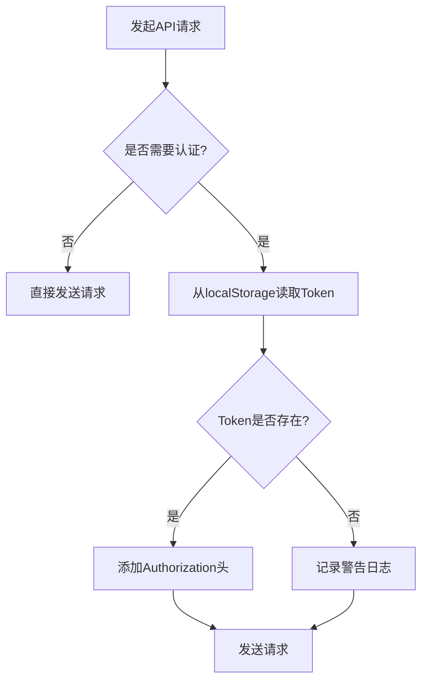
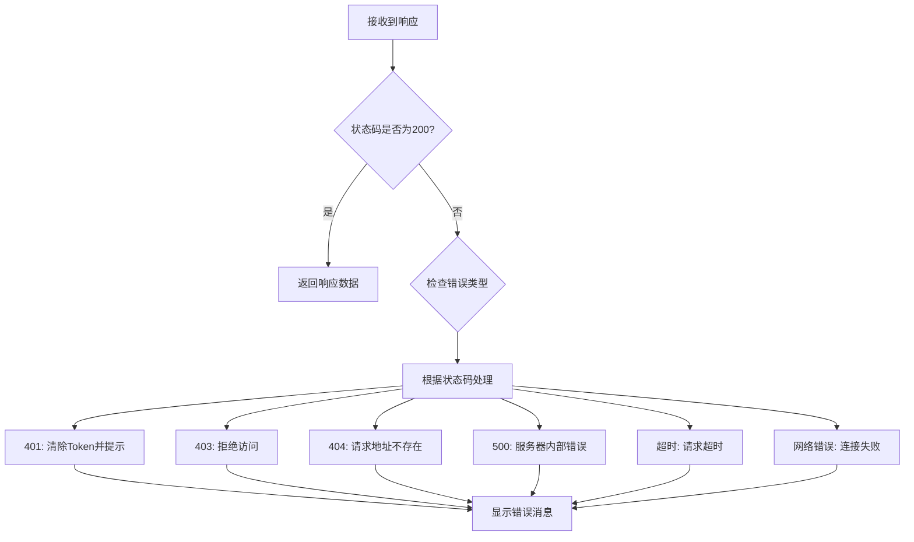
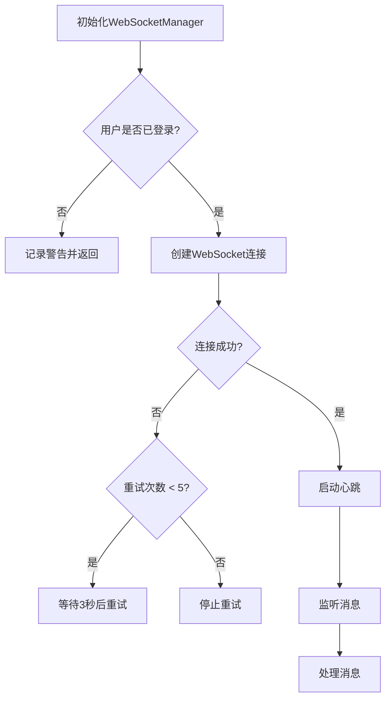
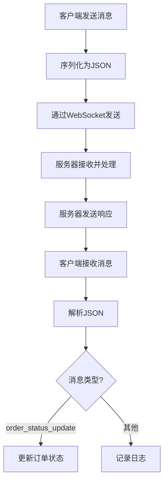
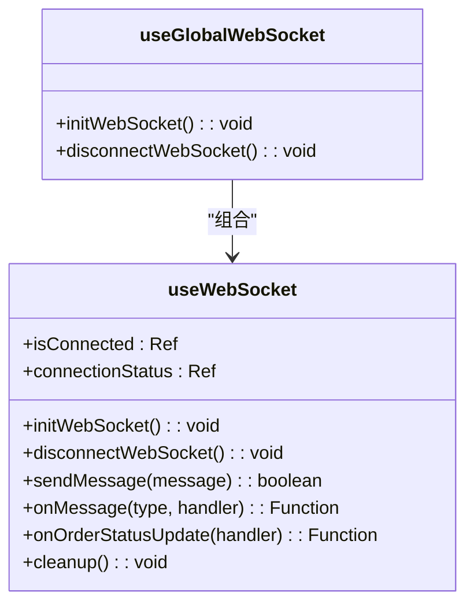

# 前端API通信

<cite>
**本文档引用的文件**   
- [request.js](file://frontend/src/api/request.js)
- [api.js](file://frontend/src/config/api.js)
- [auth.js](file://frontend/src/api/auth.js)
- [order.js](file://frontend/src/api/order.js)
- [payment.js](file://frontend/src/api/payment.js)
- [useWebSocket.js](file://frontend/src/composables/useWebSocket.js)
- [websocket.js](file://frontend/src/utils/websocket.js)
- [enhancedWebSocket.js](file://frontend/src/utils/enhancedWebSocket.js)
- [user.js](file://frontend/src/stores/user.js)
- [realApi.js](file://frontend/src/api/realApi.js)
- [Orders.vue](file://frontend/src/views/Orders.vue)
- [orderSync.js](file://frontend/src/utils/orderSync.js)
- [dataSync.js](file://frontend/src/utils/dataSync.js)
- [WebSocketConfig.java](file://backend/src/main/java/com/carwash/config/WebSocketConfig.java)
- [OrderStatusWebSocketHandler.java](file://backend/src/main/java/com/carwash/websocket/OrderStatusWebSocketHandler.java)
</cite>

## 目录
1. [引言](#引言)
2. [Axios请求封装机制](#axios请求封装机制)
3. [业务API模块组织与调用](#业务api模块组织与调用)
4. [WebSocket实时通信实现](#websocket实时通信实现)
5. [Composition API在通信逻辑复用中的应用](#composition-api在通信逻辑复用中的应用)
6. [API调用最佳实践](#api调用最佳实践)
7. [常见问题解决方案](#常见问题解决方案)
8. [结论](#结论)

## 引言
本文档旨在系统阐述汽车洗车服务预约系统中前端与后端的通信机制。系统采用Vue 3作为前端框架，通过Axios进行HTTP通信，并利用WebSocket实现订单状态的实时推送。前端通过模块化的方式组织API调用，确保代码的可维护性和可扩展性。同时，系统通过Pinia管理用户状态，并结合Composition API实现通信逻辑的高效复用。

**Section sources**
- [request.js](file://frontend/src/api/request.js#L1-L143)
- [api.js](file://frontend/src/config/api.js#L1-L92)

## Axios请求封装机制

### 请求拦截器
前端通过`request.js`文件对Axios实例进行全局配置和拦截器设置。请求拦截器负责在发送请求前自动注入JWT Token。系统通过`API_CONFIG.NO_AUTH_URLS`配置项定义了无需认证的接口列表（如登录、注册等），并根据请求URL判断是否需要添加Token。若需要认证，拦截器会从`localStorage`中读取Token并将其添加到请求头的`Authorization`字段中，格式为`{tokenType} {token}`。



**Diagram sources **
- [request.js](file://frontend/src/api/request.js#L15-L67)

### 响应拦截器
响应拦截器负责统一处理后端返回的数据和错误。对于成功的响应（HTTP状态码200），拦截器直接返回响应数据中的`data`字段。对于失败的响应，拦截器会根据HTTP状态码或错误类型进行分类处理，并通过Element Plus的`ElMessage`组件向用户展示相应的错误提示，如“未授权，请重新登录”、“请求超时”等。此外，当收到401状态码时，拦截器会自动清除本地存储的用户信息，确保用户状态的一致性。



**Diagram sources **
- [request.js](file://frontend/src/api/request.js#L69-L140)

### 配置管理
API的基础URL、超时时间以及无需认证的接口列表等配置信息被集中定义在`config/api.js`文件中。该文件通过`API_CONFIG`对象导出所有配置，支持通过环境变量（`VITE_API_BASE_URL`）进行动态覆盖，便于在不同环境（开发、生产）下切换后端地址。

**Section sources**
- [request.js](file://frontend/src/api/request.js#L1-L143)
- [api.js](file://frontend/src/config/api.js#L1-L92)

## 业务API模块组织与调用

### 模块化组织结构
前端的API调用被组织在`src/api`目录下，每个业务模块（如`auth.js`、`order.js`、`payment.js`）都拥有独立的API文件。这种模块化设计使得代码职责清晰，易于维护和测试。每个API模块文件都导出一个包含多个API方法的对象，这些方法内部调用封装好的`request`实例或`realApi`实例。

### 核心API模块分析

#### 认证模块 (auth.js)
`auth.js`模块封装了与用户认证相关的所有API，包括登录、获取用户信息、登出、检查用户名/手机号/邮箱是否已存在等。该模块通过`realApi`间接调用底层的HTTP请求，实现了业务逻辑与网络请求的分离。

**Section sources**
- [auth.js](file://frontend/src/api/auth.js#L1-L63)

#### 订单模块 (order.js)
`order.js`模块是系统中最复杂的API模块之一，它不仅封装了订单的增删改查操作，还提供了分页查询、模拟数据切换等高级功能。该模块通过`USE_MOCK_API`标志位来控制是否使用模拟数据，便于在后端服务不可用时进行前端开发和测试。

**Section sources**
- [order.js](file://frontend/src/api/order.js#L1-L222)

#### 支付模块 (payment.js)
`payment.js`模块提供了完整的支付功能，包括创建支付订单、查询支付状态、申请退款等。该模块还包含了管理员专用的API，如处理退款申请、取消过期支付订单等。所有API方法都直接使用`request`实例，确保了请求拦截和响应处理的一致性。

**Section sources**
- [payment.js](file://frontend/src/api/payment.js#L1-L139)

### 统一API入口 (realApi.js)
`realApi.js`文件作为所有真实API的统一入口，它直接调用`request.js`封装的实例，定义了与后端完全对应的API方法。这种设计模式使得上层业务模块（如`auth.js`、`order.js`）可以专注于业务逻辑，而无需关心底层的HTTP细节。

**Section sources**
- [realApi.js](file://frontend/src/api/realApi.js#L1-L336)

## WebSocket实时通信实现

### 连接管理
系统的WebSocket连接由`utils/websocket.js`中的`WebSocketManager`类管理。连接的建立需要用户已登录并提供`userId`。连接URL为`ws://localhost:8080/ws/order-status?userId={userId}`。连接过程包含重试机制，最多尝试5次，每次重试间隔为3秒。



**Diagram sources **
- [websocket.js](file://frontend/src/utils/websocket.js#L1-L100)

### 心跳机制
为了保持连接的活跃并检测网络状况，系统实现了心跳机制。客户端会每隔30秒向服务器发送一个纯文本的`ping`消息。服务器收到`ping`后会回复`pong`。客户端通过监听`pong`消息来确认连接的健康状态。

**Section sources**
- [websocket.js](file://frontend/src/utils/websocket.js#L224-L237)

### 断线重连
当WebSocket连接意外断开（非主动关闭）且重试次数未达到上限时，系统会自动安排重连。重连尝试次数会递增，并在达到最大重试次数后停止，避免无限重试。

**Section sources**
- [websocket.js](file://frontend/src/utils/websocket.js#L247-L259)

### 消息收发
客户端通过`send`方法发送消息，消息会被序列化为JSON字符串。接收到的消息会被解析并根据`type`字段分发给相应的处理器。系统主要监听`order_status_update`类型的消息，用于实时更新订单状态。



**Diagram sources **
- [websocket.js](file://frontend/src/utils/websocket.js#L113-L127)

### 后端WebSocket配置
后端通过`WebSocketConfig.java`配置WebSocket端点，并使用`OrderStatusWebSocketHandler.java`作为消息处理器。当订单状态发生变化时，后端会向所有订阅了该订单的客户端推送`order_status_update`消息。

**Section sources**
- [WebSocketConfig.java](file://backend/src/main/java/com/carwash/config/WebSocketConfig.java#L1-L20)
- [OrderStatusWebSocketHandler.java](file://backend/src/main/java/com/carwash/websocket/OrderStatusWebSocketHandler.java#L1-L50)

## Composition API在通信逻辑复用中的应用

### useWebSocket组合式函数
`composables/useWebSocket.js`文件导出了`useWebSocket`和`useGlobalWebSocket`两个组合式函数。`useWebSocket`提供了WebSocket连接的初始化、断开、发送消息、监听消息等核心功能，并返回响应式状态（如`isConnected`）。`useGlobalWebSocket`则利用`onMounted`和`onUnmounted`生命周期钩子，在组件挂载时自动初始化连接，在卸载时清理资源。



**Diagram sources **
- [useWebSocket.js](file://frontend/src/composables/useWebSocket.js#L1-L100)

### 在组件中的应用
在`Orders.vue`组件中，通过`useWebSocket`组合式函数实现了订单状态的实时更新。组件在挂载时订阅`order_status_update`消息，当收到消息时，会触发`forceRefreshOrders`函数强制刷新订单列表，确保用户界面与后端数据保持同步。

**Section sources**
- [useWebSocket.js](file://frontend/src/composables/useWebSocket.js#L1-L100)
- [Orders.vue](file://frontend/src/views/Orders.vue#L356-L407)

## API调用最佳实践

### 使用示例
以下是在组件中调用API的最佳实践示例：

```javascript
import { orderApi } from '@/api/order';
import { useWebSocket } from '@/composables/useWebSocket';

export default {
  setup() {
    const { onOrderStatusUpdate } = useWebSocket();

    // 监听订单状态更新
    onOrderStatusUpdate((data) => {
      console.log('订单状态已更新:', data);
      // 执行刷新逻辑
    });

    // 调用订单API
    const fetchOrders = async () => {
      try {
        const response = await orderApi.getOrderList();
        // 处理响应
      } catch (error) {
        // 处理错误
      }
    };

    return {
      fetchOrders
    };
  }
}
```

### 错误处理
所有API调用都应使用`try-catch`块包裹，以优雅地处理可能发生的网络错误或业务逻辑错误。错误信息应通过用户友好的方式展示，避免直接暴露技术细节。

**Section sources**
- [order.js](file://frontend/src/api/order.js#L10-L20)
- [Orders.vue](file://frontend/src/views/Orders.vue#L656-L692)

## 常见问题解决方案

### 网络异常
系统通过Axios的响应拦截器和WebSocket的重连机制来应对网络异常。对于HTTP请求，拦截器会捕获超时和网络连接错误，并给出相应提示。对于WebSocket，断线重连机制确保了连接的可靠性。

### 跨域问题
跨域问题应在后端通过`CorsConfig.java`配置CORS（跨域资源共享）策略来解决，允许前端应用的域名访问后端API。

### CSRF防护
系统通过JWT Token进行身份验证，Token存储在`localStorage`中，并在每次请求时通过`Authorization`头发送。由于Token不会被浏览器自动附加到请求中（如Cookie），因此天然具备一定的CSRF防护能力。更高级的防护可以通过在请求头中添加自定义Token来实现。

**Section sources**
- [request.js](file://frontend/src/api/request.js#L30-L47)
- [CorsConfig.java](file://backend/src/main/java/com/carwash/config/CorsConfig.java#L1-L15)

## 结论
本系统通过精心设计的Axios封装和WebSocket实现实现了高效、可靠的前后端通信。Axios的拦截器机制确保了请求的统一处理和错误的集中管理，而WebSocket则提供了实时数据同步的能力。通过模块化的API组织和Composition API的逻辑复用，系统代码结构清晰，易于维护和扩展。这些实践为构建现代化的Web应用提供了坚实的基础。