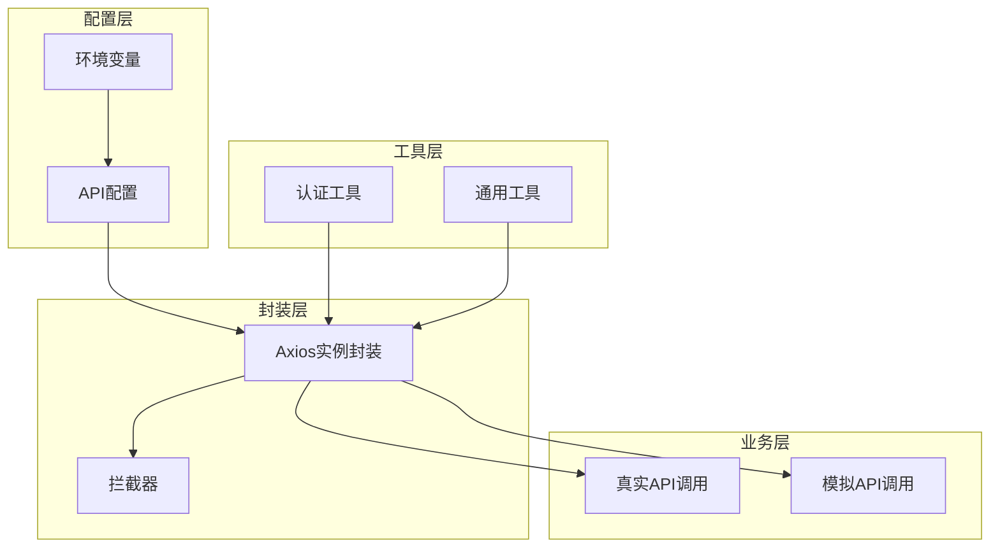
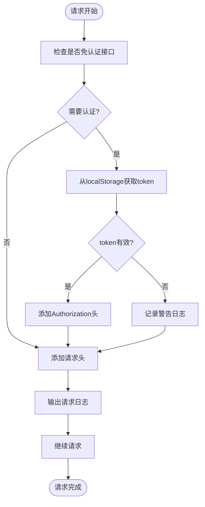
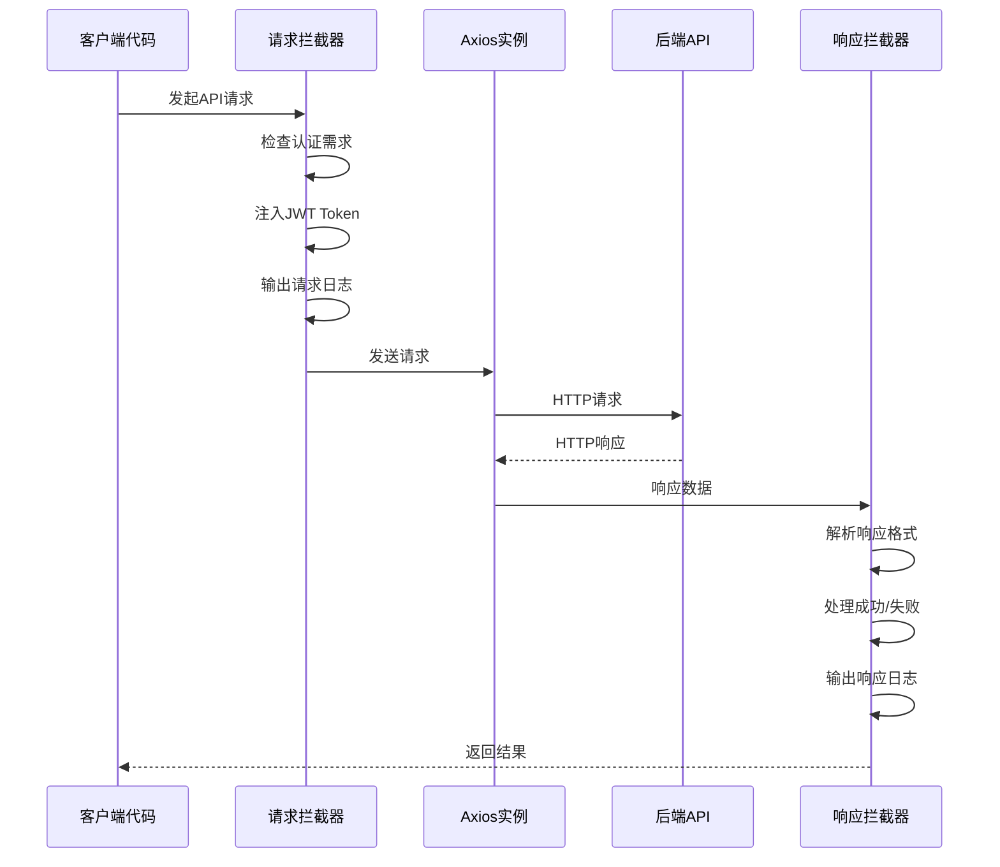
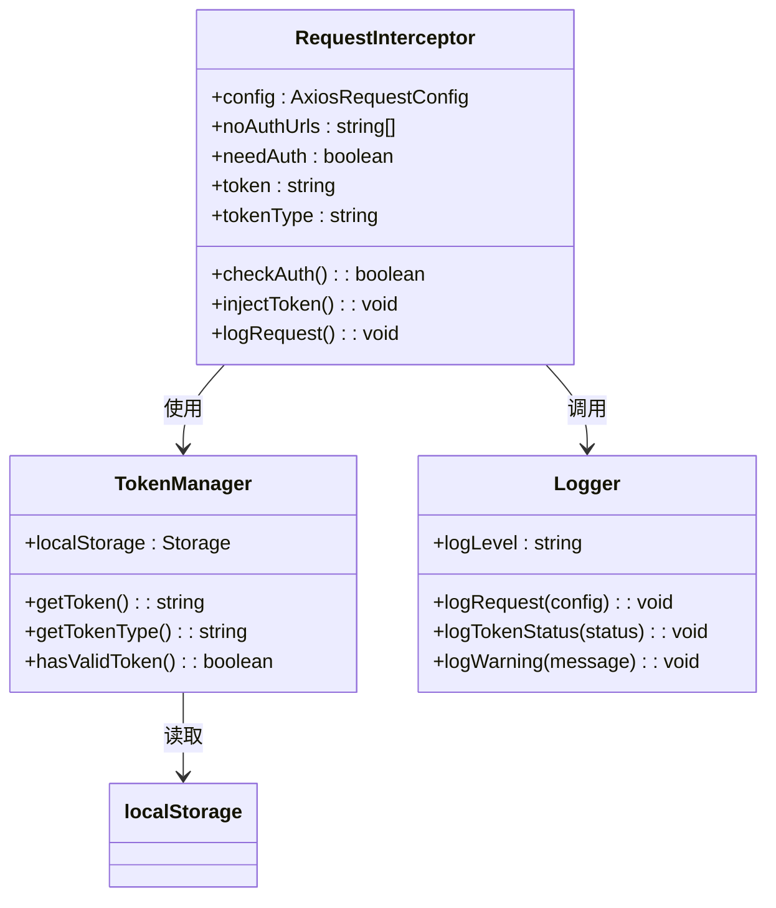
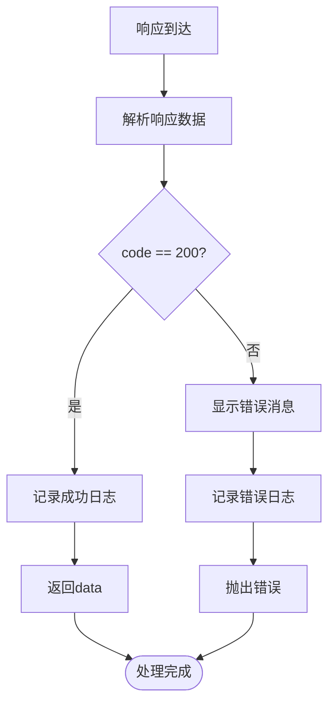
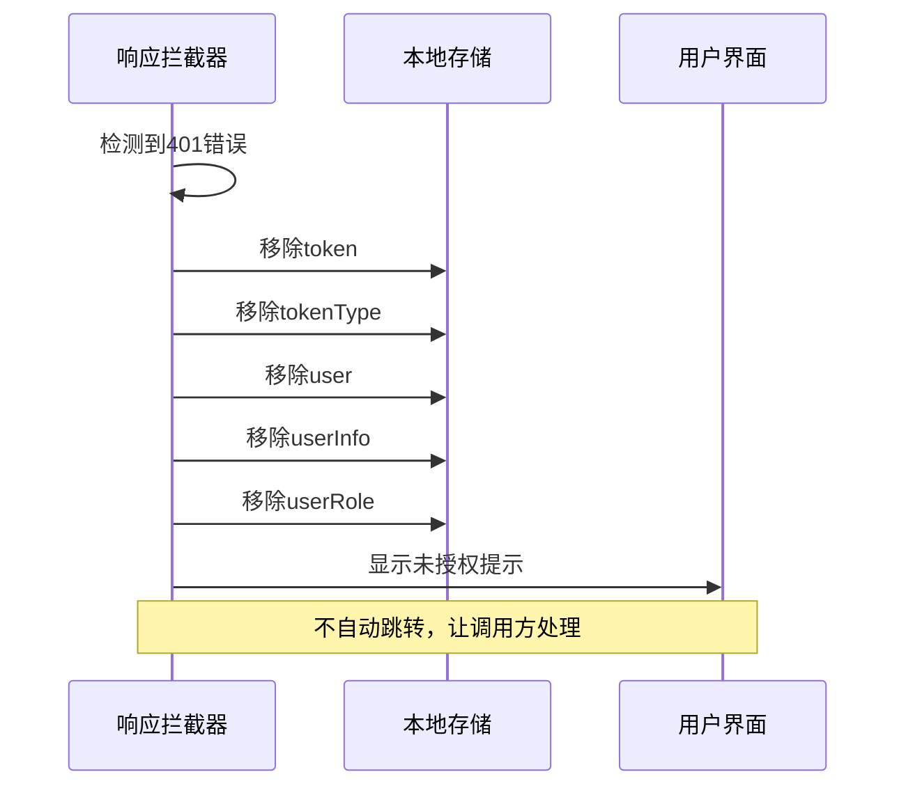
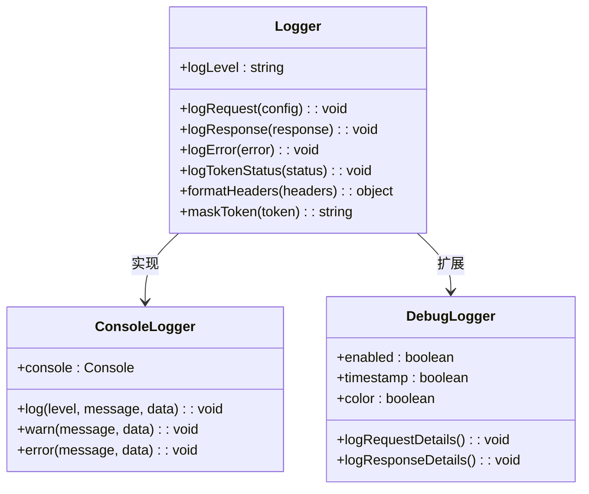
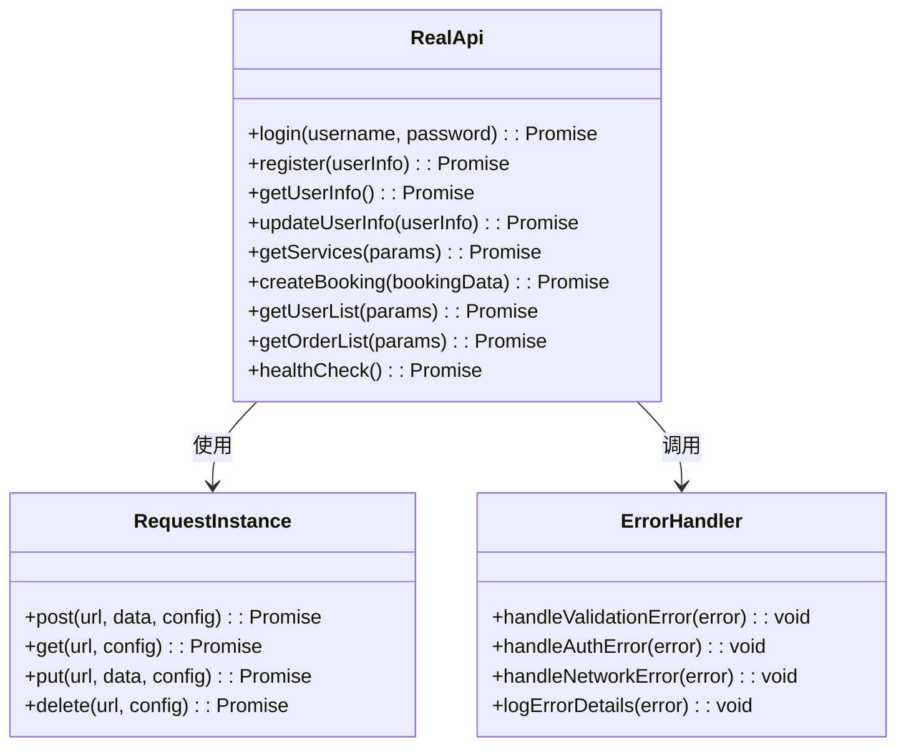
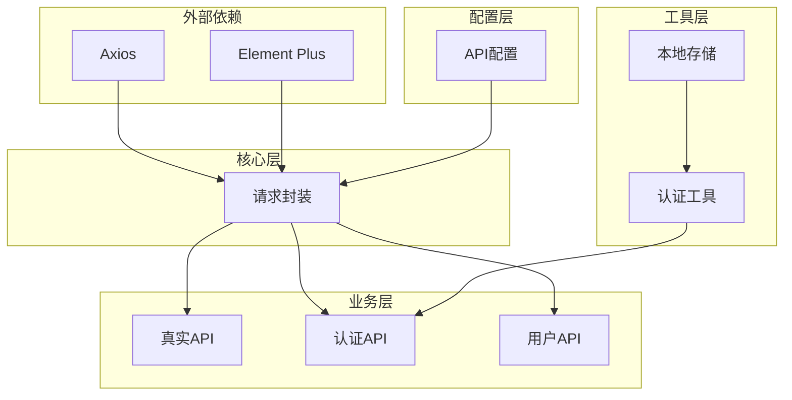

# 前端HTTP请求封装

<cite>
**本文档引用的文件**
- [request.js](file://frontend/src/api/request.js)
- [api.js](file://frontend/src/config/api.js)
- [auth.js](file://frontend/src/utils/auth.js)
- [realApi.js](file://frontend/src/api/realApi.js)
- [auth.js](file://frontend/src/api/auth.js)
- [user.js](file://frontend/src/api/user.js)
</cite>

## 目录
1. [简介](#简介)
2. [项目结构](#项目结构)
3. [核心组件](#核心组件)
4. [架构概览](#架构概览)
5. [详细组件分析](#详细组件分析)
6. [依赖关系分析](#依赖关系分析)
7. [性能考虑](#性能考虑)
8. [故障排除指南](#故障排除指南)
9. [结论](#结论)

## 简介

本文档深入解析基于Axios的前端HTTP请求封装实现，该封装提供了完整的API通信解决方案，包括JWT Token自动注入、统一错误处理、请求响应日志记录等功能。整个封装采用模块化设计，支持灵活配置和扩展，为前端应用提供了稳定可靠的HTTP通信基础设施。

## 项目结构

前端HTTP请求封装采用分层架构设计，主要包含以下核心模块：



**图表来源**
- [request.js](file://frontend/src/api/request.js#L1-L143)
- [api.js](file://frontend/src/config/api.js#L1-L92)

**章节来源**
- [request.js](file://frontend/src/api/request.js#L1-L143)
- [api.js](file://frontend/src/config/api.js#L1-L92)

## 核心组件

### Axios实例创建与配置

HTTP请求封装的核心是通过`axios.create()`方法创建的配置化实例，该实例包含了完整的请求配置：

| 配置项 | 值 | 说明 |
|--------|-----|------|
| baseURL | API_CONFIG.BASE_URL | 后端API基础地址，支持环境变量配置 |
| timeout | API_CONFIG.TIMEOUT | 请求超时时间，默认10秒 |
| Content-Type | application/json;charset=UTF-8 | 默认请求内容类型 |

### JWT Token自动注入机制

请求拦截器实现了智能的JWT Token注入机制：



**图表来源**
- [request.js](file://frontend/src/api/request.js#L15-L61)

**章节来源**
- [request.js](file://frontend/src/api/request.js#L6-L12)
- [request.js](file://frontend/src/api/request.js#L15-L61)

## 架构概览

整个HTTP请求封装采用拦截器模式，提供了请求和响应的统一处理机制：



**图表来源**
- [request.js](file://frontend/src/api/request.js#L15-L61)
- [request.js](file://frontend/src/api/request.js#L69-L141)

## 详细组件分析

### 请求拦截器实现

请求拦截器负责在请求发送前进行预处理，主要包括认证检查和Token注入：

#### 免认证接口配置

通过`API_CONFIG.NO_AUTH_URLS`配置免认证接口列表，支持精确匹配和通配符匹配：

| 接口类型 | URL模式 | 用途 |
|----------|---------|------|
| 登录认证 | `/auth/login` | 用户登录接口 |
| 注册认证 | `/auth/register` | 用户注册接口 |
| 数据校验 | `/auth/check-*` | 用户名、手机、邮箱校验 |
| 系统测试 | `/test/*` | 系统健康检查接口 |

#### Token注入流程



**图表来源**
- [request.js](file://frontend/src/api/request.js#L15-L61)
- [auth.js](file://frontend/src/utils/auth.js#L34-L37)

**章节来源**
- [request.js](file://frontend/src/api/request.js#L15-L61)
- [api.js](file://frontend/src/config/api.js#L12-L22)

### 响应拦截器实现

响应拦截器处理API响应，提供统一的成功/失败处理和错误提示：

#### 成功响应处理

对于成功的HTTP响应（code=200），直接返回data部分，简化后续处理：



**图表来源**
- [request.js](file://frontend/src/api/request.js#L70-L92)

#### HTTP状态码统一处理

响应拦截器对不同HTTP状态码提供专门的错误处理策略：

| 状态码 | 错误信息 | 处理策略 |
|--------|----------|----------|
| 401 | 未授权，请重新登录 | 清除本地认证信息，不自动跳转 |
| 403 | 拒绝访问 | 显示权限不足提示 |
| 404 | 请求地址不存在 | 显示资源未找到提示 |
| 500 | 服务器内部错误 | 显示服务器错误提示 |
| ECONNABORTED | 请求超时 | 显示超时错误提示 |
| Network Error | 网络连接失败 | 显示网络错误提示 |

#### 自动清除认证信息机制

当遇到401未授权错误时，系统会自动清除本地存储的认证信息：



**图表来源**
- [request.js](file://frontend/src/api/request.js#L110-L118)

**章节来源**
- [request.js](file://frontend/src/api/request.js#L69-L141)

### ElMessage全局错误提示集成

封装集成了Element Plus的ElMessage组件，提供统一的错误提示功能：

#### 错误提示配置

| 错误类型 | 提示方式 | 持续时间 |
|----------|----------|----------|
| 网络错误 | ElMessage.error | 默认 |
| 请求失败 | ElMessage.error | 默认 |
| 权限错误 | ElMessage.error | 默认 |
| 成功操作 | ElMessage.success | 3秒 |

#### 日志输出功能

封装提供了丰富的日志输出功能，支持调试和监控：



**图表来源**
- [request.js](file://frontend/src/api/request.js#L30-L60)
- [request.js](file://frontend/src/api/request.js#L70-L92)

**章节来源**
- [request.js](file://frontend/src/api/request.js#L2-L3)
- [request.js](file://frontend/src/api/request.js#L91-L92)

### API调用层实现

#### 真实API调用

`realApi.js`文件提供了完整的API调用实现，每个API方法都经过封装：



**图表来源**
- [realApi.js](file://frontend/src/api/realApi.js#L1-L336)

#### API方法分类

| 功能模块 | API方法 | 描述 |
|----------|---------|------|
| 认证相关 | login, register, checkUsername | 用户认证和注册功能 |
| 用户管理 | getUserInfo, updateUserInfo, getUserList | 用户信息管理和查询 |
| 服务管理 | getServices, createService, updateService | 服务项目管理 |
| 订单管理 | createBooking, getOrderList, updateOrderStatus | 预约订单管理 |
| 统计分析 | getStatisticsOverview, getRevenueStatistics | 系统统计功能 |
| 系统测试 | healthCheck, getSystemInfo, testDatabase | 系统健康检查 |

**章节来源**
- [realApi.js](file://frontend/src/api/realApi.js#L1-L336)
- [auth.js](file://frontend/src/api/auth.js#L1-L63)
- [user.js](file://frontend/src/api/user.js#L1-L134)

## 依赖关系分析

### 模块依赖图



**图表来源**
- [request.js](file://frontend/src/api/request.js#L1-L4)
- [realApi.js](file://frontend/src/api/realApi.js#L1)
- [auth.js](file://frontend/src/utils/auth.js#L1-L3)

### 循环依赖检测

经过分析，该封装系统不存在循环依赖问题，各模块职责清晰，层次分明。

**章节来源**
- [request.js](file://frontend/src/api/request.js#L1-L4)
- [api.js](file://frontend/src/config/api.js#L1-L92)

## 性能考虑

### 请求超时配置

系统设置了合理的请求超时时间（10秒），平衡了用户体验和网络稳定性：

- **默认超时**: 10000ms（10秒）
- **特殊场景**: 用户订单查询设置为5000ms（5秒）
- **网络错误处理**: 区分超时和其他网络错误

### Token缓存策略

采用localStorage进行Token持久化，同时提供快速读取：

- **读取时机**: 每次请求前检查
- **缓存大小**: 单个Token，内存占用极小
- **安全性**: 支持多种Token类型（Bearer、JWT等）

### 日志输出优化

日志系统采用条件输出策略，减少生产环境性能影响：

- **开发环境**: 完整日志输出
- **生产环境**: 可配置的日志级别
- **敏感信息**: 自动脱敏处理

## 故障排除指南

### 常见问题及解决方案

#### 1. Token注入失败

**症状**: 请求中缺少Authorization头
**原因**: localStorage中未存储有效Token
**解决方案**: 
- 检查登录状态
- 验证Token存储完整性
- 确认Token格式正确

#### 2. 401未授权错误

**症状**: 接口返回401状态码
**原因**: Token过期或无效
**解决方案**:
- 自动清除本地认证信息
- 引导用户重新登录
- 检查Token刷新机制

#### 3. 请求超时问题

**症状**: 请求长时间无响应
**原因**: 网络延迟或后端处理缓慢
**解决方案**:
- 检查网络连接
- 调整超时配置
- 优化后端性能

#### 4. 日志输出异常

**症状**: 控制台无日志输出
**原因**: 日志级别配置错误
**解决方案**:
- 检查NODE_ENV环境变量
- 验证日志配置
- 确认浏览器控制台可用

**章节来源**
- [request.js](file://frontend/src/api/request.js#L110-L118)
- [request.js](file://frontend/src/api/request.js#L132-L136)

### 调试技巧

#### 启用详细日志

在开发环境中，可以通过注释掉日志输出代码来启用详细调试信息：

```javascript
// 开启详细日志输出
// console.log('🔍 请求拦截器详情:', {
//   url: config.url,
//   noAuthUrls: noAuthUrls,
//   needAuth: needAuth,
//   matchedUrls: noAuthUrls.filter(url => config.url.includes(url))
// })
```

#### Token状态监控

通过控制台可以直接查看Token状态：

```javascript
console.log('🔑 Token状态:', {
  hasToken: !!token,
  tokenLength: token?.length || 0,
  tokenType: tokenType,
  tokenPreview: token ? `${token.substring(0, 20)}...` : '无'
})
```

## 结论

基于Axios的前端HTTP请求封装提供了完整而优雅的API通信解决方案。该封装具有以下优势：

### 技术优势

1. **模块化设计**: 清晰的分层架构，易于维护和扩展
2. **智能认证**: 自动化的JWT Token注入和管理
3. **统一错误处理**: 完善的HTTP状态码和错误处理机制
4. **调试友好**: 丰富的日志输出和错误提示功能
5. **性能优化**: 合理的超时配置和缓存策略

### 最佳实践

1. **配置集中管理**: 通过API_CONFIG统一管理所有配置
2. **拦截器模式**: 使用Axios拦截器实现横切关注点
3. **错误边界**: 完善的错误处理和用户反馈机制
4. **日志记录**: 结构化的日志输出便于调试和监控
5. **安全考虑**: 敏感信息的自动脱敏处理

### 扩展建议

1. **Token刷新**: 实现自动Token刷新机制
2. **请求重试**: 添加指数退避的请求重试功能
3. **并发控制**: 实现请求队列和并发限制
4. **缓存策略**: 添加响应数据缓存机制
5. **监控集成**: 集成APM工具进行性能监控

该HTTP请求封装为前端应用提供了坚实的基础，能够满足大多数Web应用的API通信需求，同时具备良好的可扩展性和维护性。