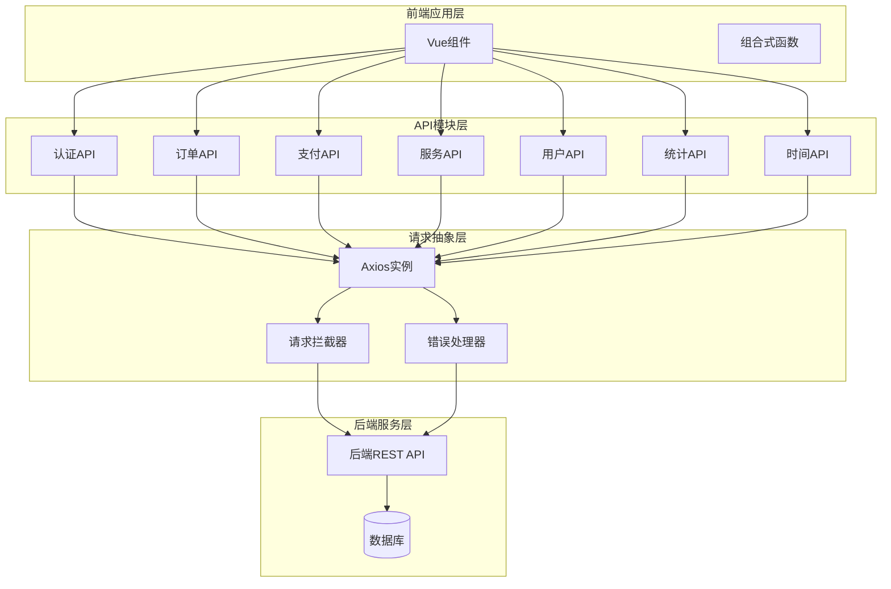
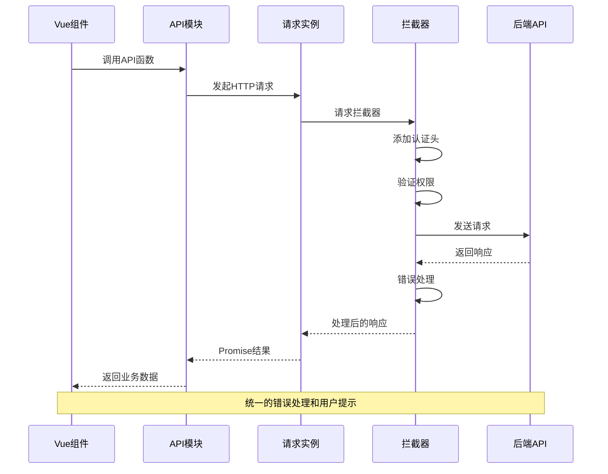
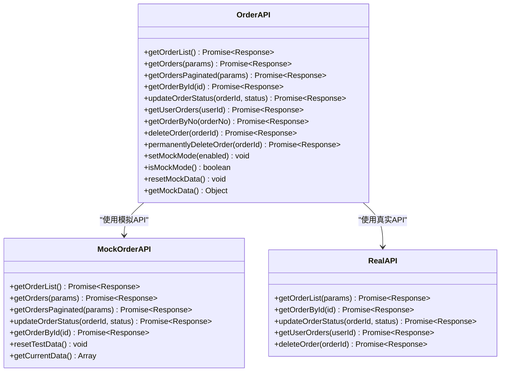
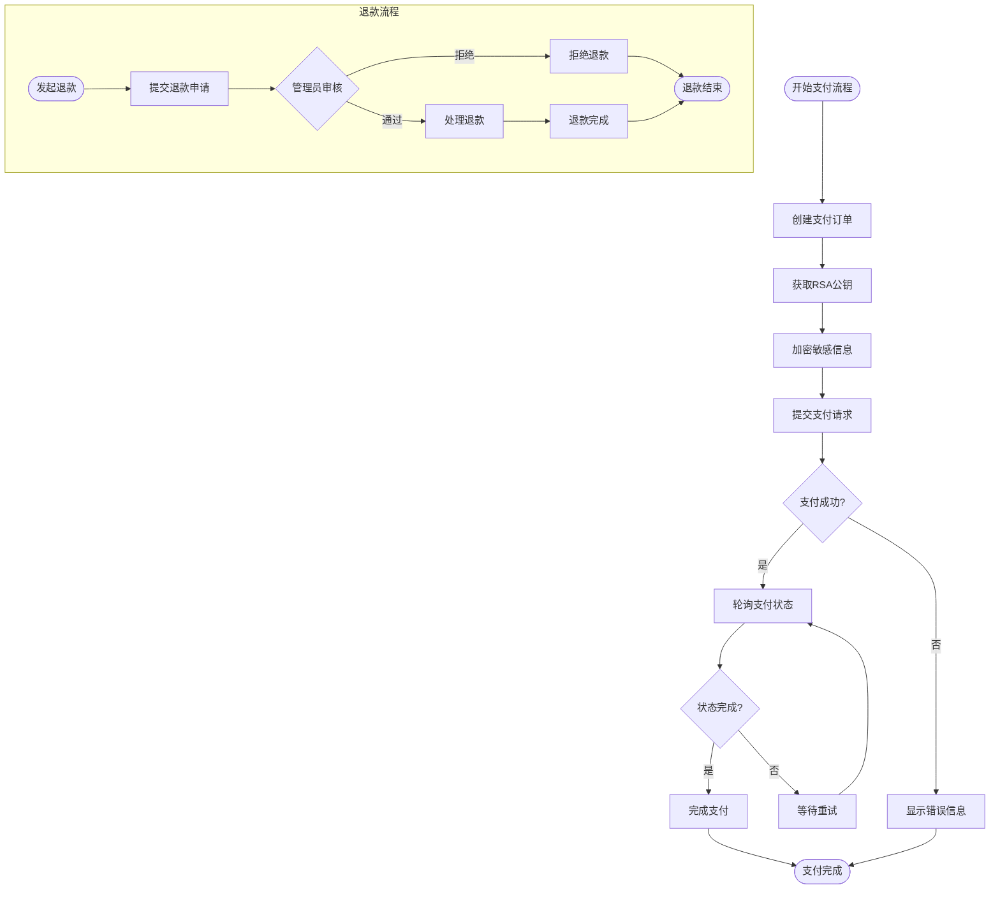
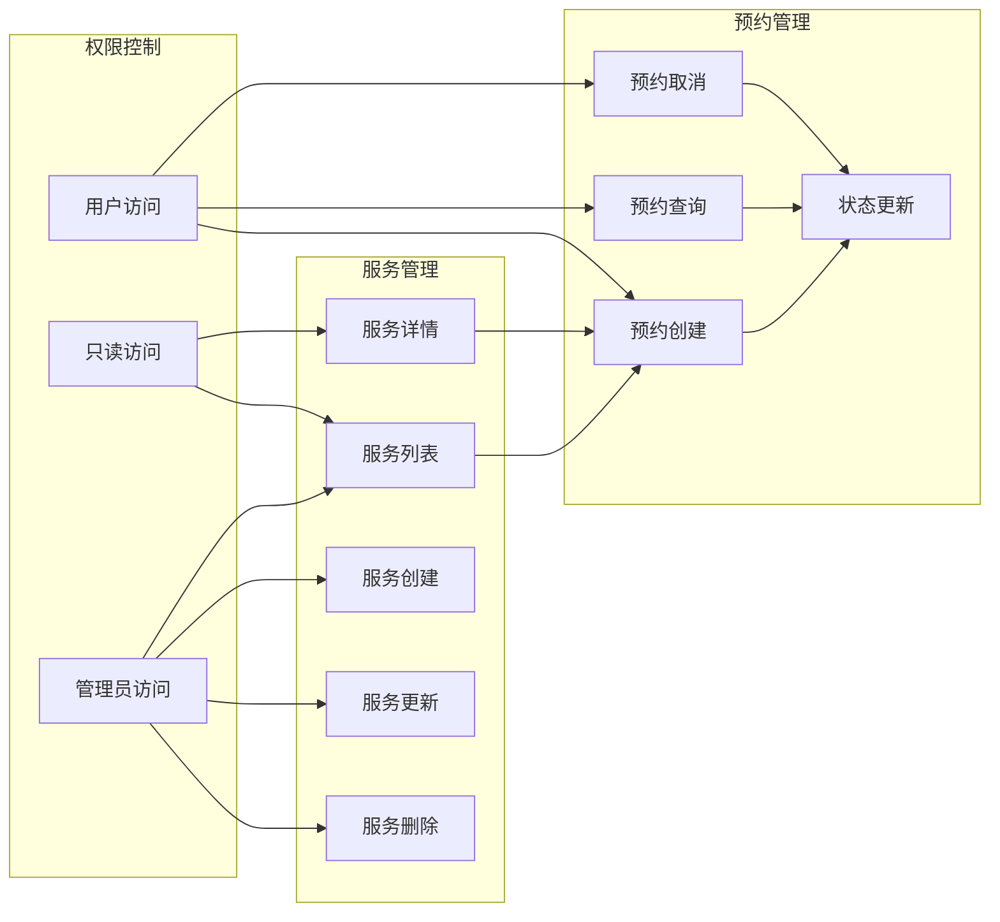
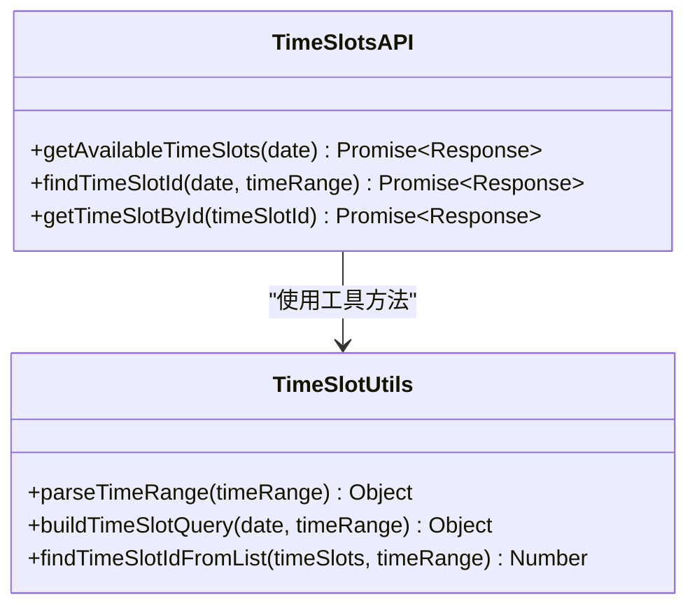
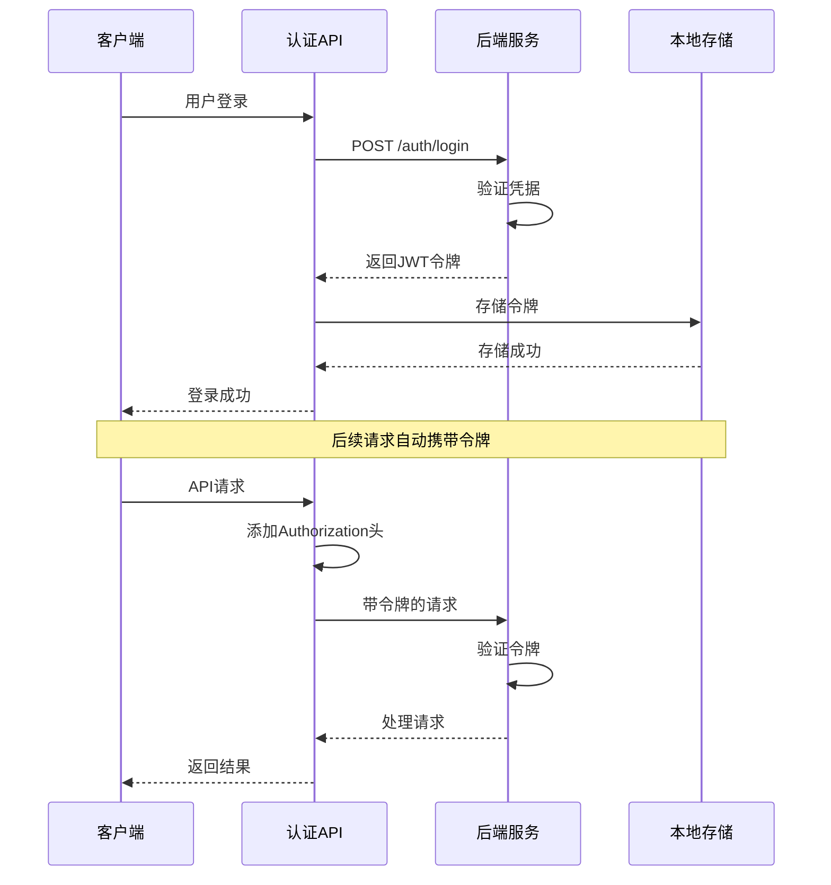
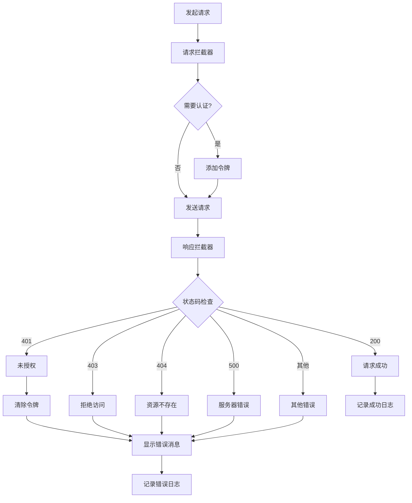

# 前端业务API模块

<cite>
**本文档引用的文件**
- [request.js](file://frontend/src/api/request.js)
- [auth.js](file://frontend/src/api/auth.js)
- [order.js](file://frontend/src/api/order.js)
- [payment.js](file://frontend/src/api/payment.js)
- [service.js](file://frontend/src/api/service.js)
- [statistics.js](file://frontend/src/api/statistics.js)
- [timeSlots.js](file://frontend/src/api/timeSlots.js)
- [user.js](file://frontend/src/api/user.js)
- [realApi.js](file://frontend/src/api/realApi.js)
- [mockOrderApi.js](file://frontend/src/api/mockOrderApi.js)
- [api.js](file://frontend/src/config/api.js)
- [public.js](file://frontend/src/api/public.js)
- [sms.js](file://frontend/src/api/sms.js)
- [dashboard.js](file://frontend/src/api/dashboard.js)
- [Login.vue](file://frontend/src/views/Login.vue)
- [Appointment.vue](file://frontend/src/views/Appointment.vue)
</cite>

## 目录
1. [概述](#概述)
2. [API架构设计](#api架构设计)
3. [核心API模块详解](#核心api模块详解)
4. [认证与安全机制](#认证与安全机制)
5. [错误处理与日志](#错误处理与日志)
6. [组件集成模式](#组件集成模式)
7. [高级用法与最佳实践](#高级用法与最佳实践)
8. [总结](#总结)

## 概述

本系统采用模块化的API设计架构，将前端业务逻辑分为多个专门的API模块，每个模块负责特定领域的业务功能。这种设计遵循单一职责原则，确保了代码的可维护性和可扩展性。

### 架构特点

- **模块化设计**：每个业务领域独立成模块
- **统一请求层**：基于Axios的统一网络请求处理
- **类型安全**：严格的参数验证和返回值处理
- **错误统一处理**：全局错误处理和用户友好的提示
- **开发友好**：支持模拟API和真实API切换

## API架构设计

### 整体架构图



**图表来源**
- [request.js](file://frontend/src/api/request.js#L1-L143)
- [auth.js](file://frontend/src/api/auth.js#L1-L63)
- [order.js](file://frontend/src/api/order.js#L1-L222)

### 请求流程图



**图表来源**
- [request.js](file://frontend/src/api/request.js#L15-L141)
- [auth.js](file://frontend/src/api/auth.js#L8-L62)

## 核心API模块详解

### 认证API模块 (auth.js)

认证模块提供了用户身份验证的核心功能，包括登录、注册、用户信息获取和登出等操作。

#### 主要功能

| 功能 | 方法 | 参数 | 返回值 | 描述 |
|------|------|------|--------|------|
| 用户登录 | `login(username, password)` | 用户名、密码 | Promise\<LoginResponse\> | 执行用户身份验证 |
| 获取用户信息 | `getUserInfo()` | 无 | Promise\<UserInfo\> | 获取当前登录用户信息 |
| 用户登出 | `logout()` | 无 | Promise\<LogoutResponse\> | 清除本地认证信息 |
| 检查用户名 | `checkUsername(username)` | 用户名 | Promise\<CheckResponse\> | 验证用户名是否可用 |
| 检查手机号 | `checkPhone(phone)` | 手机号 | Promise\<CheckResponse\> | 验证手机号是否已注册 |
| 检查邮箱 | `checkEmail(email)` | 邮箱 | Promise\<CheckResponse\> | 验证邮箱是否已注册 |

#### 实现特点

- **统一错误处理**：所有API调用都经过统一的错误处理机制
- **自动认证**：请求拦截器自动添加JWT令牌
- **状态管理**：与localStorage集成，自动管理认证状态

**章节来源**
- [auth.js](file://frontend/src/api/auth.js#L8-L62)
- [realApi.js](file://frontend/src/api/realApi.js#L8-L39)

### 订单API模块 (order.js)

订单模块负责预约订单的全生命周期管理，包括创建、查询、更新和删除操作。

#### 核心功能架构



**图表来源**
- [order.js](file://frontend/src/api/order.js#L8-L221)
- [mockOrderApi.js](file://frontend/src/api/mockOrderApi.js#L41-L218)
- [realApi.js](file://frontend/src/api/realApi.js#L165-L247)

#### 分页查询策略

订单模块实现了灵活的分页查询机制，支持多种数据结构的适配：

| 查询类型 | 方法 | 参数 | 数据结构适配 |
|----------|------|------|--------------|
| 基础查询 | `getOrders(params)` | `{status, search}` | 自动识别数组或分页对象 |
| 分页查询 | `getOrdersPaginated(params)` | `{page, size, status, search}` | 强制返回标准分页格式 |
| 管理员查询 | `getOrderList()` | `{page, size, status, search}` | 后端原生分页支持 |

**章节来源**
- [order.js](file://frontend/src/api/order.js#L24-L108)

### 支付API模块 (payment.js)

支付模块提供了完整的支付解决方案，包括支付创建、状态查询、退款处理等功能。

#### 支付流程图



**图表来源**
- [payment.js](file://frontend/src/api/payment.js#L16-L138)

#### 支付功能表

| 功能类别 | 方法 | 参数 | 描述 |
|----------|------|------|------|
| 支付创建 | `createPayment(paymentData)` | 支付数据对象 | 创建新的支付订单 |
| 公钥获取 | `getPublicKey()` | 无 | 获取RSA公钥用于加密 |
| 状态查询 | `getPaymentStatus(paymentNo)` | 支付单号 | 查询支付状态 |
| 订单查询 | `getPaymentByOrderNo(orderNo)` | 订单号 | 根据订单号查询支付信息 |
| 退款申请 | `requestRefund(refundData)` | 退款数据 | 提交退款申请 |
| 退款查询 | `getRefundStatus(refundNo)` | 退款单号 | 查询退款处理状态 |
| 管理员功能 | `admin.processRefund()` | 退款处理数据 | 管理员处理退款申请 |

**章节来源**
- [payment.js](file://frontend/src/api/payment.js#L16-L138)

### 服务API模块 (service.js)

服务模块管理洗车服务的相关操作，包括服务列表、预约创建和管理功能。

#### 服务管理架构



**图表来源**
- [service.js](file://frontend/src/api/service.js#L4-L129)

**章节来源**
- [service.js](file://frontend/src/api/service.js#L6-L129)

### 用户API模块 (user.js)

用户模块提供用户信息管理和用户相关的各种操作。

#### 用户管理功能

| 功能 | 方法 | 权限要求 | 描述 |
|------|------|----------|------|
| 获取用户列表 | `getUserList()` | 管理员 | 获取所有用户信息 |
| 分页查询 | `getUsersPaginated(params)` | 管理员 | 分页获取用户列表 |
| 获取用户详情 | `getUserById(id)` | 管理员 | 根据ID获取用户信息 |
| 更新用户信息 | `updateUser(userId, userData)` | 管理员 | 更新用户基本信息 |
| 更新用户状态 | `updateUserStatus(userId, status)` | 管理员 | 启用/禁用用户账户 |
| 删除用户 | `deleteUser(userId)` | 管理员 | 软删除用户账户 |
| 永久删除 | `permanentlyDeleteUser(userId)` | 管理员 | 物理删除用户数据 |

**章节来源**
- [user.js](file://frontend/src/api/user.js#L6-L131)

### 统计API模块 (statistics.js)

统计模块提供各种业务数据的统计和分析功能。

#### 统计数据类型

```mermaid
mindmap
root((统计API))
概览统计
总体概览
今日统计
用户统计
趋势分析
预约趋势
收入趋势
服务趋势
分布分析
服务类型分布
时间段分布
地域分布
质量指标
客户满意度
服务完成率
用户留存率
实时监控
实时数据
告警信息
性能指标
```

**图表来源**
- [statistics.js](file://frontend/src/api/statistics.js#L4-L76)

**章节来源**
- [statistics.js](file://frontend/src/api/statistics.js#L6-L76)

### 时间段API模块 (timeSlots.js)

时间段模块专门处理预约时间段的查询和管理。

#### 时间段工具类



**图表来源**
- [timeSlots.js](file://frontend/src/api/timeSlots.js#L6-L85)

**章节来源**
- [timeSlots.js](file://frontend/src/api/timeSlots.js#L7-L85)

## 认证与安全机制

### JWT认证流程



**图表来源**
- [request.js](file://frontend/src/api/request.js#L30-L48)
- [auth.js](file://frontend/src/api/auth.js#L8-L62)

### 安全配置

| 配置项 | 值 | 说明 |
|--------|-----|------|
| 基础URL | `VITE_API_BASE_URL` 或 `http://localhost:8080/api` | 后端API基础地址 |
| 超时时间 | 10000ms | 请求超时设置 |
| 不需要认证的接口 | `/auth/login`, `/auth/register`等 | 公开接口列表 |
| 认证头格式 | `Bearer {token}` | JWT令牌格式 |

**章节来源**
- [api.js](file://frontend/src/config/api.js#L7-L22)
- [request.js](file://frontend/src/api/request.js#L15-L48)

## 错误处理与日志

### 错误处理机制

系统实现了多层次的错误处理机制：



**图表来源**
- [request.js](file://frontend/src/api/request.js#L69-L141)

### 错误类型与处理

| 错误类型 | HTTP状态码 | 处理方式 | 用户提示 |
|----------|------------|----------|----------|
| 网络错误 | - | 显示网络连接失败 | 网络连接失败，请检查网络 |
| 请求超时 | ECONNABORTED | 显示请求超时 | 请求超时，请重试 |
| 未授权 | 401 | 清除认证信息 | 未授权，请重新登录 |
| 拒绝访问 | 403 | 显示拒绝访问 | 拒绝访问 |
| 资源不存在 | 404 | 显示资源不存在 | 请求地址不存在 |
| 服务器错误 | 500 | 显示服务器错误 | 服务器内部错误 |

**章节来源**
- [request.js](file://frontend/src/api/request.js#L94-L141)

## 组件集成模式

### API调用模式

Vue组件通过以下模式集成API：

#### 登录组件示例

```javascript
// 组件中的API调用模式
const handleLogin = async () => {
  try {
    // 表单验证
    await loginFormRef.value.validate();
    
    // 设置加载状态
    loading.value = true;
    
    // 调用认证API
    const response = await authApi.login(
      loginForm.username,
      loginForm.password
    );
    
    // 处理成功响应
    if (response.code === 200) {
      // 使用AuthManager处理登录
      const loginSuccess = AuthManager.login(
        response.data.user,
        response.data.token,
        response.data.tokenType
      );
      
      // 跳转到相应页面
      if (loginSuccess) {
        // 根据用户角色确定跳转路径
        const userRole = response.data.user.role;
        if (userRole === "admin") {
          await router.push("/admin/dashboard");
        } else {
          await router.push("/");
        }
      }
    }
  } catch (error) {
    // 错误会自动处理，无需额外处理
    console.error("登录失败:", error);
  } finally {
    loading.value = false;
  }
};
```

**章节来源**
- [Login.vue](file://frontend/src/views/Login.vue#L126-L200)

#### 预约组件示例

```javascript
// 预约流程中的API调用
const createBooking = async () => {
  try {
    // 构建预约数据
    const bookingData = {
      userId: currentUser.value.id,
      serviceId: selectedService.value.id,
      timeSlotId: selectedTimeSlot.value.id,
      vehicleInfo: vehicleForm.value
    };
    
    // 调用服务API创建预约
    const response = await serviceApi.createBooking(bookingData);
    
    if (response.code === 200) {
      // 显示成功消息
      ElMessage.success("预约创建成功！");
      
      // 跳转到订单页面
      router.push("/orders");
    }
  } catch (error) {
    ElMessage.error("预约创建失败：" + error.message);
  }
};
```

**章节来源**
- [Appointment.vue](file://frontend/src/views/Appointment.vue#L1-L200)

### 组合式函数模式

系统还提供了组合式函数来封装复杂的API逻辑：

```javascript
// useBooking.js 示例
export function useBooking() {
  const bookings = ref([]);
  const loading = ref(false);
  
  const fetchBookings = async (params = {}) => {
    try {
      loading.value = true;
      const response = await serviceApi.getUserBookings(currentUser.value.id);
      bookings.value = response.data;
    } catch (error) {
      bookings.value = [];
      throw error;
    } finally {
      loading.value = false;
    }
  };
  
  return {
    bookings,
    loading,
    fetchBookings
  };
}
```

## 高级用法与最佳实践

### 并发请求处理

#### 批量操作示例

```javascript
// 批量更新订单状态
const batchUpdateOrders = async (orderIds, status) => {
  try {
    // 创建并发请求
    const updatePromises = orderIds.map(id => 
      orderApi.updateOrderStatus(id, status)
    );
    
    // 等待所有请求完成
    const results = await Promise.allSettled(updatePromises);
    
    // 处理结果
    const successfulUpdates = results.filter(
      result => result.status === 'fulfilled'
    ).length;
    
    ElMessage.success(`成功更新 ${successfulUpdates} 个订单`);
    
  } catch (error) {
    ElMessage.error('批量更新失败');
  }
};
```

#### 请求取消机制

```javascript
// 使用AbortController实现请求取消
class RequestManager {
  constructor() {
    this.controllers = new Map();
  }
  
  createController(operationId) {
    if (this.controllers.has(operationId)) {
      this.abort(operationId);
    }
    const controller = new AbortController();
    this.controllers.set(operationId, controller);
    return controller;
  }
  
  abort(operationId) {
    const controller = this.controllers.get(operationId);
    if (controller) {
      controller.abort();
      this.controllers.delete(operationId);
    }
  }
  
  async makeRequest(operationId, apiCall) {
    const controller = this.createController(operationId);
    try {
      const response = await apiCall(controller.signal);
      this.controllers.delete(operationId);
      return response;
    } catch (error) {
      if (error.name === 'AbortError') {
        console.log('请求已取消');
      }
      throw error;
    }
  }
}
```

### 模拟API使用

#### 开发环境切换

```javascript
// 在组件中启用模拟API
import orderApi from '@/api/order';

// 开发时启用模拟API
if (process.env.NODE_ENV === 'development') {
  orderApi.setMockMode(true);
}

// 使用模拟数据
const loadMockData = async () => {
  try {
    const response = await orderApi.getOrderList();
    console.log('模拟数据:', response.data);
  } catch (error) {
    console.error('加载模拟数据失败:', error);
  }
};
```

### 性能优化策略

#### 请求缓存机制

```javascript
class APICache {
  constructor(ttl = 5 * 60 * 1000) { // 5分钟
    this.cache = new Map();
    this.ttl = ttl;
  }
  
  set(key, value) {
    this.cache.set(key, {
      value,
      timestamp: Date.now()
    });
  }
  
  get(key) {
    const item = this.cache.get(key);
    if (!item) return null;
    
    if (Date.now() - item.timestamp > this.ttl) {
      this.cache.delete(key);
      return null;
    }
    
    return item.value;
  }
  
  async cachedRequest(apiMethod, cacheKey, ...args) {
    const cached = this.get(cacheKey);
    if (cached) return cached;
    
    const result = await apiMethod(...args);
    this.set(cacheKey, result);
    return result;
  }
}

// 使用缓存的API调用
const cachedServiceList = async () => {
  return await apiCache.cachedRequest(
    serviceApi.getServiceList,
    'service-list'
  );
};
```

### 错误恢复机制

#### 自动重试策略

```javascript
class RetryManager {
  constructor(maxRetries = 3, baseDelay = 1000) {
    this.maxRetries = maxRetries;
    this.baseDelay = baseDelay;
  }
  
  async retry(apiCall, ...args) {
    let lastError;
    
    for (let i = 0; i <= this.maxRetries; i++) {
      try {
        return await apiCall(...args);
      } catch (error) {
        lastError = error;
        
        if (i < this.maxRetries && this.shouldRetry(error)) {
          const delay = this.baseDelay * Math.pow(2, i);
          await new Promise(resolve => setTimeout(resolve, delay));
          continue;
        }
        
        break;
      }
    }
    
    throw lastError;
  }
  
  shouldRetry(error) {
    // 只对网络错误和临时错误重试
    return error.code === 'ECONNABORTED' || 
           error.response?.status >= 500;
  }
}
```

## 总结

本系统的前端API模块设计体现了现代Web应用的最佳实践：

### 设计优势

1. **模块化架构**：每个业务领域独立成模块，职责清晰
2. **统一请求层**：基于Axios的统一网络请求处理
3. **类型安全**：严格的参数验证和返回值处理
4. **错误统一处理**：全局错误处理和用户友好的提示
5. **开发友好**：支持模拟API和真实API切换
6. **性能优化**：缓存机制和并发处理支持

### 技术特色

- **JWT认证**：安全的令牌认证机制
- **请求拦截**：自动添加认证头和权限验证
- **响应拦截**：统一的错误处理和状态管理
- **模拟API**：开发环境下的高效调试支持
- **组合式函数**：Vue 3的现代化开发模式

### 应用价值

该API架构不仅满足了当前业务需求，还为未来的功能扩展奠定了坚实的基础。通过模块化的设计，系统具备了良好的可维护性和可扩展性，能够适应业务发展的需要。