# 前端架构

<cite>
**本文档引用的文件**
- [main.js](file://frontend/src/main.js)
- [router/index.js](file://frontend/src/router/index.js)
- [stores/user.js](file://frontend/src/stores/user.js)
- [App.vue](file://frontend/src/App.vue)
- [package.json](file://frontend/package.json)
- [Layout.vue](file://frontend/src/components/Layout/Layout.vue)
- [OrderStatusProgress.vue](file://frontend/src/components/OrderStatusProgress.vue)
- [StatCard.vue](file://frontend/src/components/StatCard.vue)
- [useWebSocket.js](file://frontend/src/composables/useWebSocket.js)
- [Dashboard.vue](file://frontend/src/views/Dashboard.vue)
- [statistics.js](file://frontend/src/api/statistics.js)
- [websocket.js](file://frontend/src/utils/websocket.js)
- [vite.config.js](file://frontend/vite.config.js)
</cite>

## 目录
1. [项目概述](#项目概述)
2. [项目初始化流程](#项目初始化流程)
3. [路由系统架构](#路由系统架构)
4. [状态管理系统](#状态管理系统)
5. [组件化设计](#组件化设计)
6. [视图层与API层分离](#视图层与api层分离)
7. [响应式数据流](#响应式数据流)
8. [WebSocket通信机制](#websocket通信机制)
9. [构建配置与开发环境](#构建配置与开发环境)
10. [总结](#总结)

## 项目概述

本前端系统采用Vue 3 + Vite技术栈构建，是一个现代化的汽车洗车服务预约系统。项目遵循模块化、组件化的设计理念，通过清晰的分层架构实现了高效的开发和维护。

### 技术栈特点
- **Vue 3**: 使用Composition API提供更好的逻辑复用和性能
- **Vite**: 快速的开发服务器和构建工具
- **Pinia**: Vue 3官方推荐的状态管理库
- **Element Plus**: 企业级UI组件库
- **ECharts**: 数据可视化图表库

## 项目初始化流程

### 应用入口点

Vue应用的初始化过程体现了现代前端框架的最佳实践：

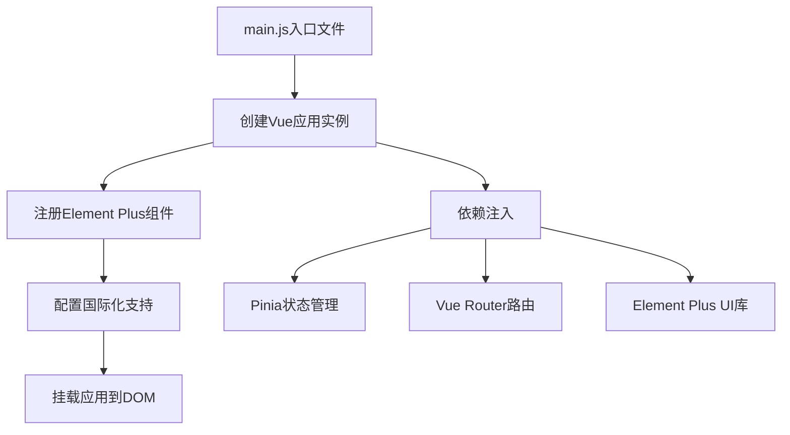

**图表来源**
- [main.js](file://frontend/src/main.js#L1-L26)

### 核心初始化步骤

1. **应用创建与配置**
   - 使用`createApp`创建Vue应用实例
   - 注册Element Plus图标组件，实现按需加载
   - 配置全局CSS样式和主题

2. **插件集成**
   - Pinia状态管理：提供全局状态持久化
   - Vue Router：实现单页面应用路由
   - Element Plus：提供丰富的UI组件

3. **应用挂载**
   - 将应用挂载到DOM元素`#app`
   - 启动应用生命周期

**章节来源**
- [main.js](file://frontend/src/main.js#L1-L26)

## 路由系统架构

### 路由配置结构

系统采用嵌套路由设计，通过`Layout`组件实现统一的页面布局：

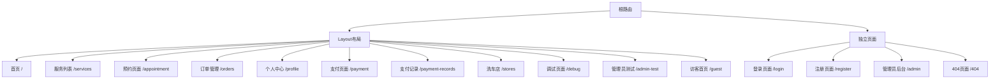

**图表来源**
- [router/index.js](file://frontend/src/router/index.js#L25-L188)

### 导航守卫机制

路由守卫系统实现了多层次的权限控制和用户体验优化：

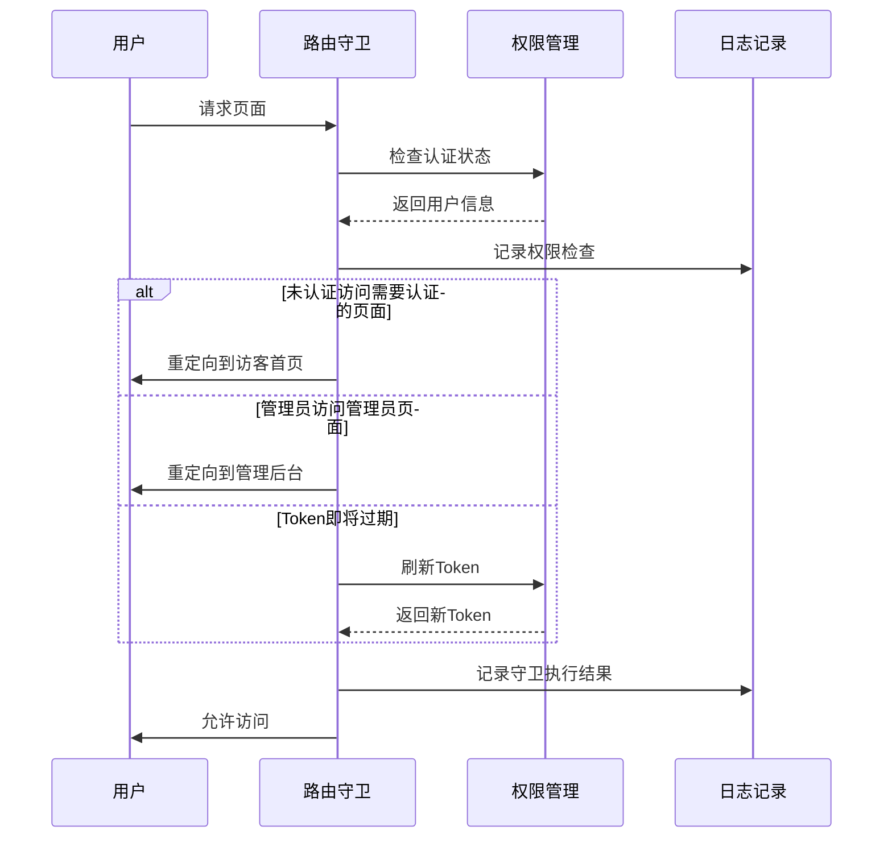

**图表来源**
- [router/index.js](file://frontend/src/router/index.js#L208-L335)

### 权限控制策略

1. **基础权限验证**
   - `requiresAuth`: 是否需要登录
   - `hideForAuth`: 已登录用户隐藏页面
   - `requiresAdmin`: 管理员专用页面

2. **动态路由处理**
   - 首页根据用户角色重定向
   - Token自动刷新机制
   - 网络状态异常处理

**章节来源**
- [router/index.js](file://frontend/src/router/index.js#L208-L335)

## 状态管理系统

### Pinia Store设计

系统采用Pinia作为状态管理解决方案，提供了简洁而强大的状态管理能力：

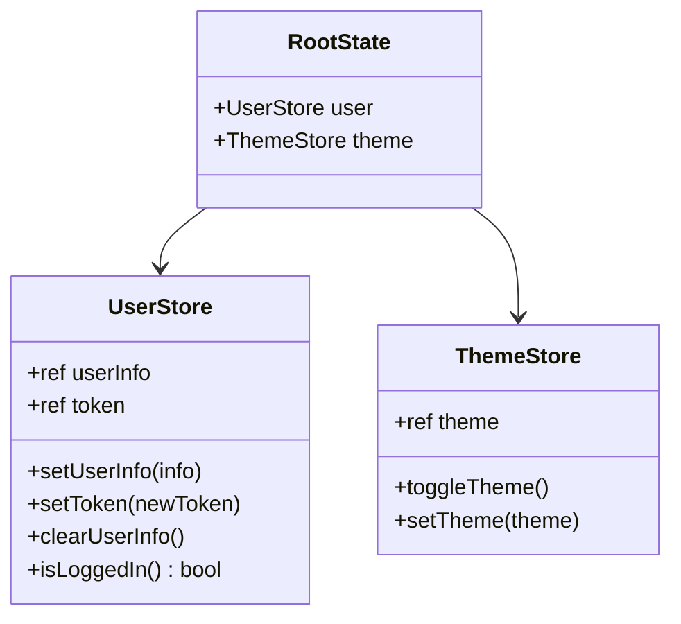

**图表来源**
- [stores/user.js](file://frontend/src/stores/user.js#L1-L40)

### 状态持久化机制

1. **本地存储集成**
   - Token自动保存到localStorage
   - 用户信息状态化管理
   - 自动清理机制

2. **响应式状态更新**
   - 基于ref的响应式数据
   - 自动化的状态变更追踪
   - 组件级别的状态订阅

**章节来源**
- [stores/user.js](file://frontend/src/stores/user.js#L1-L40)

## 组件化设计

### Layout组件架构

Layout组件作为应用的基础布局容器，体现了组件化设计的核心思想：

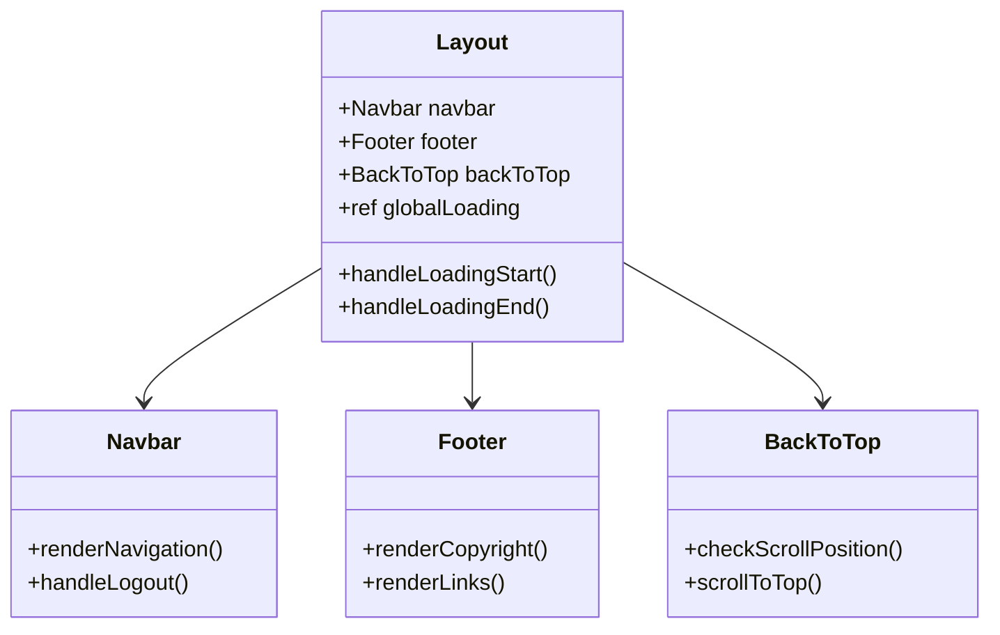

**图表来源**
- [Layout.vue](file://frontend/src/components/Layout/Layout.vue#L1-L151)

### UI组件设计原则

1. **可复用性设计**
   - 统一的组件接口规范
   - 灵活的Props配置
   - 事件驱动的交互模式

2. **主题一致性**
   - CSS变量系统
   - 组件样式隔离
   - 暗黑模式支持

### 特色组件分析

#### OrderStatusProgress组件

该组件展示了复杂的响应式数据流和实时状态更新机制：

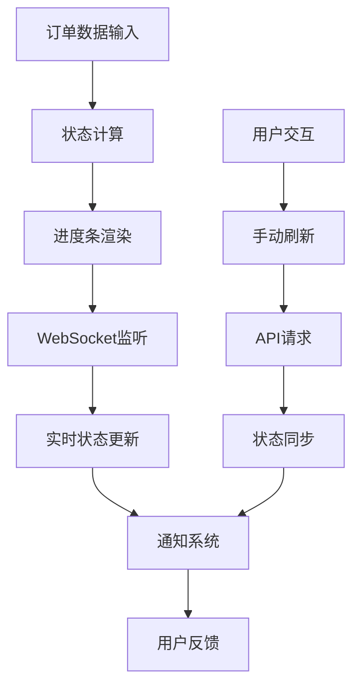

**图表来源**
- [OrderStatusProgress.vue](file://frontend/src/components/OrderStatusProgress.vue#L1-L609)

#### StatCard组件

统计卡片组件体现了数据可视化和响应式设计的完美结合：

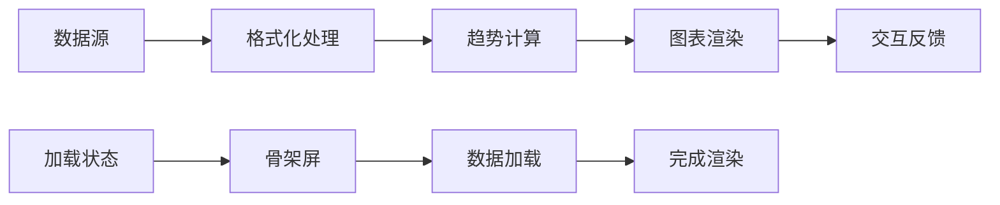

**图表来源**
- [StatCard.vue](file://frontend/src/components/StatCard.vue#L1-L342)

**章节来源**
- [Layout.vue](file://frontend/src/components/Layout/Layout.vue#L1-L151)
- [OrderStatusProgress.vue](file://frontend/src/components/OrderStatusProgress.vue#L1-L609)
- [StatCard.vue](file://frontend/src/components/StatCard.vue#L1-L342)

## 视图层与API层分离

### API抽象层设计

系统采用分层的API设计模式，实现了视图层与数据层的有效解耦：

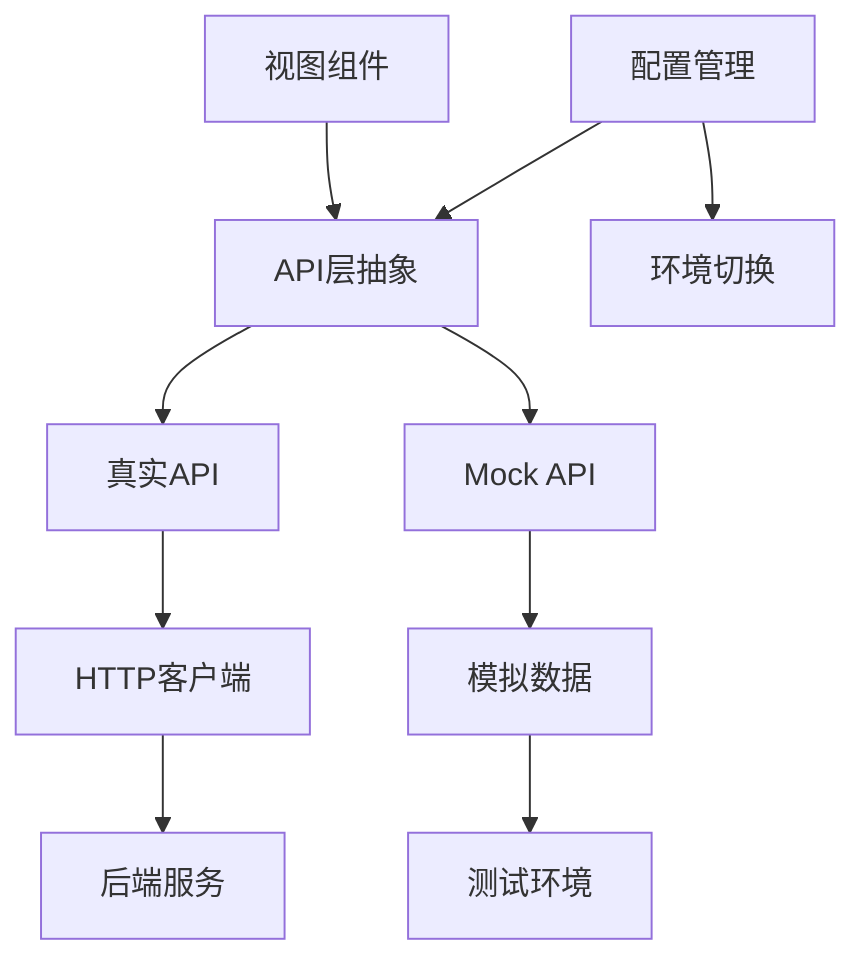

**图表来源**
- [statistics.js](file://frontend/src/api/statistics.js#L1-L77)

### API调用模式

1. **统一的API接口**
   - 标准化的请求方法
   - 错误处理机制
   - 响应数据格式化

2. **环境适配**
   - 开发环境使用Mock数据
   - 生产环境连接真实后端
   - 灵活的配置管理

**章节来源**
- [statistics.js](file://frontend/src/api/statistics.js#L1-L77)

## 响应式数据流

### Composables自定义Hook

系统大量使用Composables模式来实现逻辑复用和响应式数据管理：

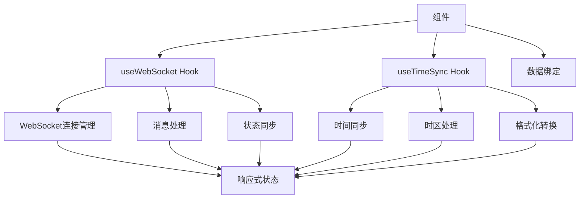

**图表来源**
- [useWebSocket.js](file://frontend/src/composables/useWebSocket.js#L1-L100)

### 数据流架构

1. **单向数据流**
   - 状态集中管理
   - 组件被动渲染
   - 明确的数据流向

2. **响应式更新**
   - 自动化的依赖追踪
   - 组件级别的精确更新
   - 性能优化的更新策略

**章节来源**
- [useWebSocket.js](file://frontend/src/composables/useWebSocket.js#L1-L100)

## WebSocket通信机制

### 实时通信架构

系统实现了完整的WebSocket通信机制，支持实时状态更新和双向通信：

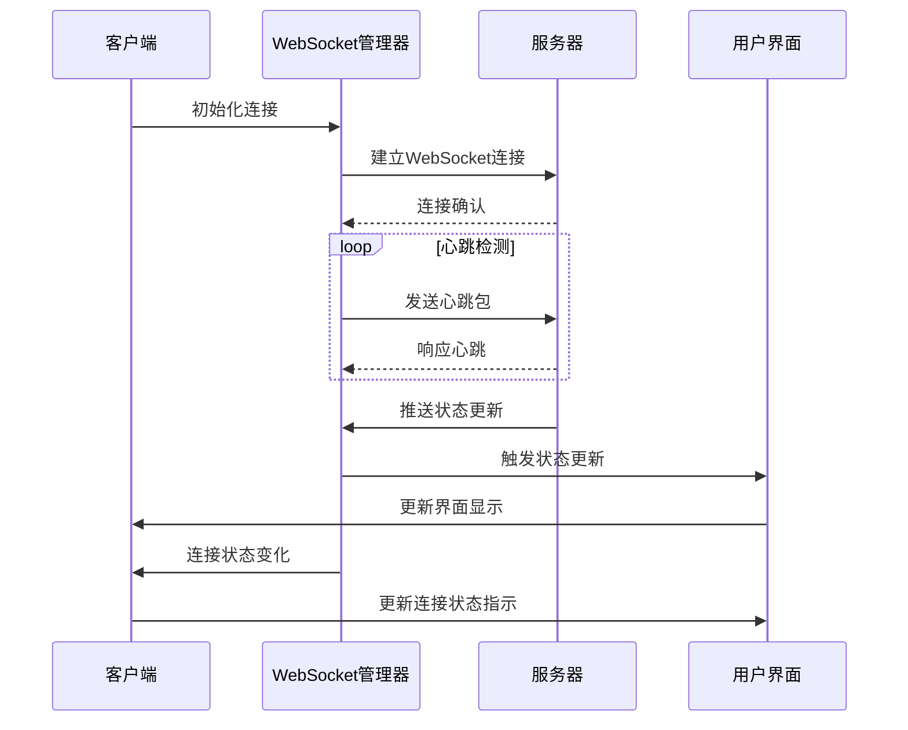

**图表来源**
- [websocket.js](file://frontend/src/utils/websocket.js#L1-L297)

### WebSocket特性

1. **自动重连机制**
   - 指数退避算法
   - 最大重连次数限制
   - 连接状态监控

2. **消息处理系统**
   - 类型化消息处理
   - 消息处理器注册
   - 异常情况优雅降级

3. **性能优化**
   - 心跳保活机制
   - 连接池管理
   - 内存泄漏防护

**章节来源**
- [websocket.js](file://frontend/src/utils/websocket.js#L1-L297)

## 构建配置与开发环境

### Vite配置优化

项目采用Vite作为构建工具，提供了优秀的开发体验和构建性能：

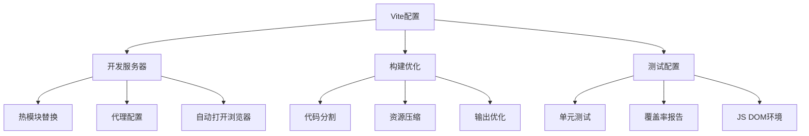

**图表来源**
- [vite.config.js](file://frontend/vite.config.js#L1-L46)

### 开发环境特性

1. **开发服务器**
   - 端口配置和代理设置
   - 自动热重载
   - 开发工具集成

2. **构建优化**
   - 代码分割策略
   - 资源文件命名规则
   - 源码映射配置

3. **测试支持**
   - 单元测试框架
   - 覆盖率报告
   - 测试环境配置

**章节来源**
- [vite.config.js](file://frontend/vite.config.js#L1-L46)

## 总结

本前端系统展现了现代Vue 3应用开发的最佳实践，通过以下核心设计理念实现了高质量的架构：

### 架构优势

1. **模块化设计**
   - 清晰的职责分离
   - 可复用的组件库
   - 灵活的配置系统

2. **响应式架构**
   - 基于Composition API的逻辑复用
   - 自动化的状态管理
   - 实时的用户反馈

3. **可维护性**
   - 标准化的代码结构
   - 完善的错误处理
   - 详细的日志记录

4. **用户体验**
   - 平滑的页面过渡
   - 实时的状态更新
   - 优雅的加载状态

### 技术亮点

- **Vue 3生态系统**：充分利用Composition API和新的生命周期钩子
- **Pinia状态管理**：提供直观且类型安全的状态管理方案
- **组件化思维**：每个组件都有明确的职责和接口
- **实时通信**：WebSocket实现实时状态同步
- **开发体验**：Vite提供的快速开发和构建体验

这套架构设计不仅满足了当前的功能需求，还为未来的功能扩展和性能优化奠定了坚实的基础。通过合理的分层和模块化设计，系统具备了良好的可扩展性和可维护性，能够适应业务发展的需要。