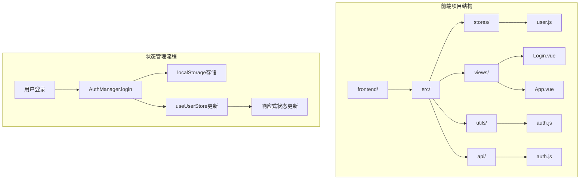
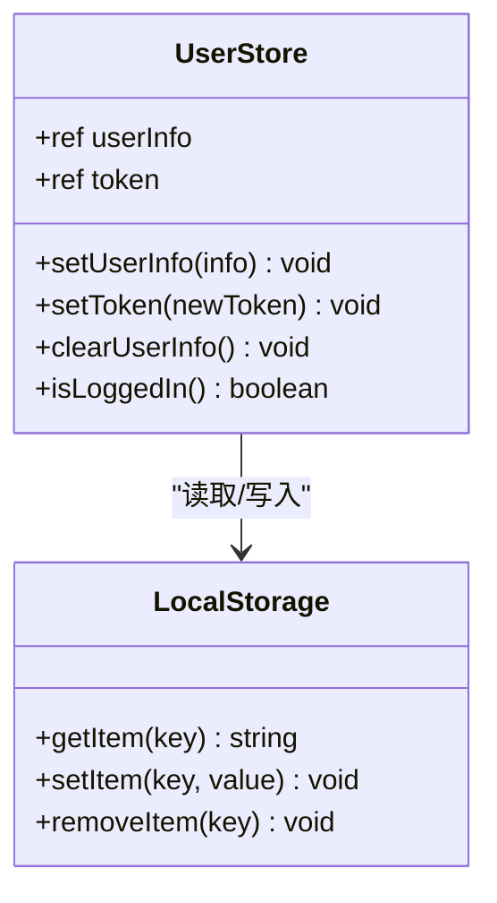
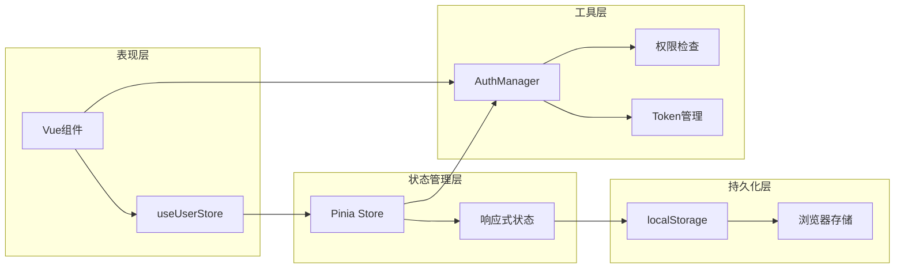
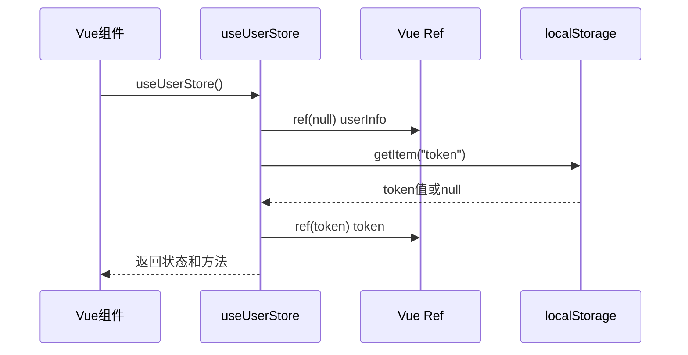
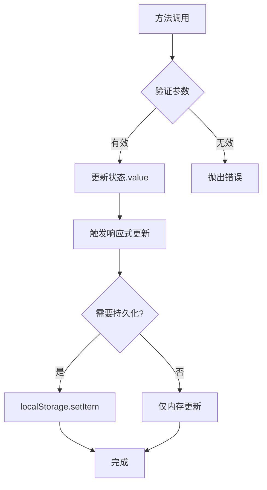
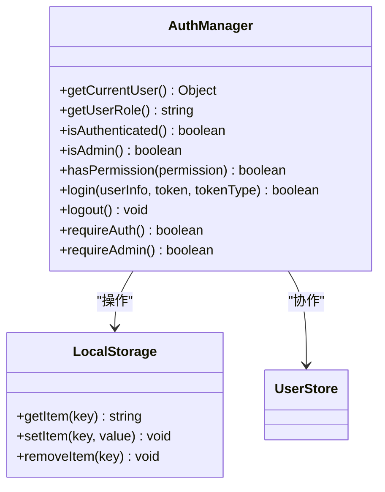
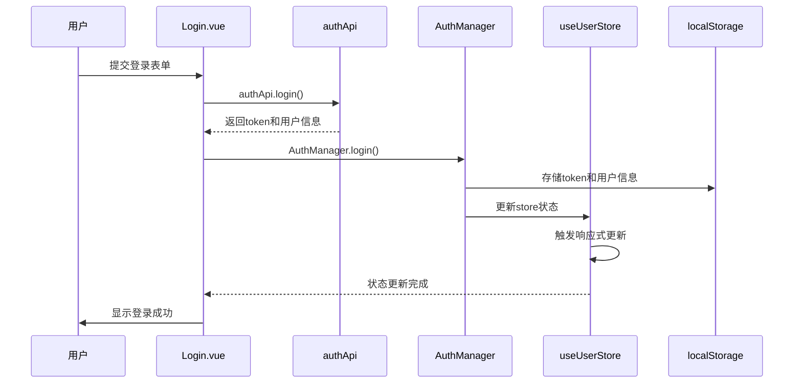
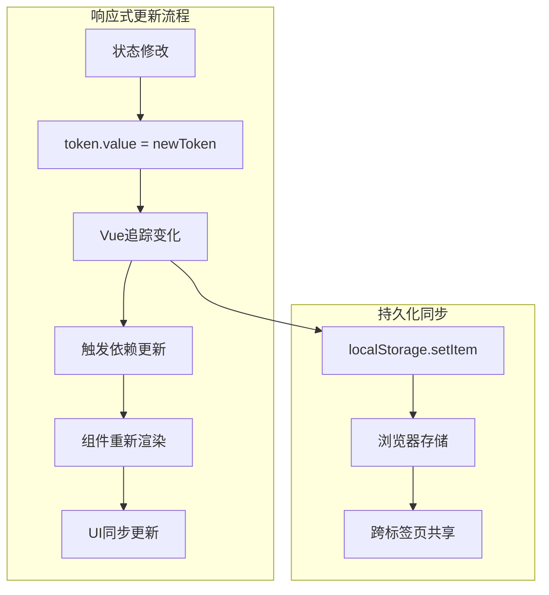
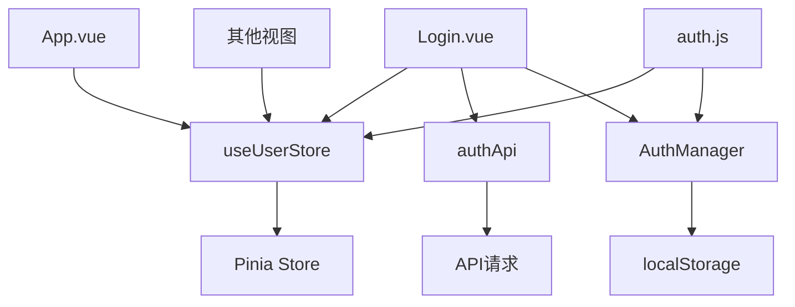

# 前端状态定义

<cite>
**本文档中引用的文件**
- [user.js](file://frontend/src/stores/user.js)
- [auth.js](file://frontend/src/utils/auth.js)
- [main.js](file://frontend/src/main.js)
- [Login.vue](file://frontend/src/views/Login.vue)
- [App.vue](file://frontend/src/App.vue)
- [authApi.js](file://frontend/src/api/auth.js)
</cite>

## 目录
1. [简介](#简介)
2. [项目结构](#项目结构)
3. [核心组件](#核心组件)
4. [架构概览](#架构概览)
5. [详细组件分析](#详细组件分析)
6. [依赖关系分析](#依赖关系分析)
7. [性能考虑](#性能考虑)
8. [故障排除指南](#故障排除指南)
9. [结论](#结论)

## 简介

本文档详细解析了Pinia中userStore的状态定义机制，重点说明userInfo和token两个响应式状态的初始化方式，特别是token从localStorage中恢复的实现逻辑。文档阐述了ref在defineStore中的使用规范，以及如何通过返回对象暴露状态与方法。结合代码实例说明setUserInfo、setToken、clearUserInfo等核心方法的内部实现，强调其响应式更新机制。同时提供在Vue组件中正确使用useUserStore进行状态读取和修改的最佳实践示例，并指出直接修改状态的反模式风险。

## 项目结构

该汽车洗车服务预约系统的前端采用Vue 3 + Pinia的状态管理模式，主要文件组织如下：

**图表来源**
- [user.js](file://frontend/src/stores/user.js#L1-L40)
- [auth.js](file://frontend/src/utils/auth.js#L1-L214)

**章节来源**
- [user.js](file://frontend/src/stores/user.js#L1-L40)
- [main.js](file://frontend/src/main.js#L1-L26)

## 核心组件

### userStore状态定义

userStore是系统的核心状态管理模块，负责管理用户认证状态和相关信息。它使用Pinia的defineStore函数创建，包含以下关键特性：

#### 响应式状态初始化

**图表来源**
- [user.js](file://frontend/src/stores/user.js#L4-L39)

#### 状态初始化机制

状态初始化遵循以下原则：
- **userInfo**: 初始值为null，表示未登录状态
- **token**: 从localStorage恢复，支持持久化登录
- **响应式更新**: 使用Vue的ref创建响应式引用

**章节来源**
- [user.js](file://frontend/src/stores/user.js#L4-L6)

## 架构概览

系统采用分层架构设计，清晰分离关注点：

**图表来源**
- [user.js](file://frontend/src/stores/user.js#L1-L39)
- [auth.js](file://frontend/src/utils/auth.js#L1-L214)

## 详细组件分析

### userStore核心实现

#### 状态定义与初始化

userStore使用defineStore创建，返回一个包含状态和方法的对象：

**图表来源**
- [user.js](file://frontend/src/stores/user.js#L4-L6)

#### 方法实现机制

每个方法都遵循特定的响应式更新模式：

**图表来源**
- [user.js](file://frontend/src/stores/user.js#L9-L24)

#### setToken方法详解

setToken方法展示了最佳实践的响应式更新模式：

1. **状态更新**: `token.value = newToken`
2. **持久化存储**: `localStorage.setItem("token", newToken)`
3. **自动同步**: Vue响应式系统自动传播变化

**章节来源**
- [user.js](file://frontend/src/stores/user.js#L14-L17)

### AuthManager工具类

AuthManager提供了完整的权限管理功能，与userStore协同工作：

**图表来源**
- [auth.js](file://frontend/src/utils/auth.js#L7-L214)

**章节来源**
- [auth.js](file://frontend/src/utils/auth.js#L8-L214)

### 登录流程集成

登录过程展示了状态管理的完整生命周期：

**图表来源**
- [Login.vue](file://frontend/src/views/Login.vue#L135-L150)
- [auth.js](file://frontend/src/utils/auth.js#L86-L119)

**章节来源**
- [Login.vue](file://frontend/src/views/Login.vue#L126-L298)
- [auth.js](file://frontend/src/utils/auth.js#L86-L119)

### 响应式更新机制

系统利用Vue的响应式系统实现状态的自动更新：

**图表来源**
- [user.js](file://frontend/src/stores/user.js#L14-L17)

**章节来源**
- [user.js](file://frontend/src/stores/user.js#L9-L24)

## 依赖关系分析

### 模块间依赖关系

**图表来源**
- [App.vue](file://frontend/src/App.vue#L19-L29)
- [Login.vue](file://frontend/src/views/Login.vue#L352-L368)

### 外部依赖

系统依赖以下外部库和模块：

| 依赖项 | 版本 | 用途 |
|--------|------|------|
| Pinia | ^2.0.0 | 状态管理 |
| Vue | ^3.0.0 | 响应式框架 |
| Element Plus | ^2.0.0 | UI组件库 |

**章节来源**
- [main.js](file://frontend/src/main.js#L1-L26)

## 性能考虑

### 状态更新优化

1. **批量更新**: 避免频繁的状态修改
2. **懒加载**: 仅在需要时初始化状态
3. **内存管理**: 及时清理不需要的状态

### 存储策略

1. **localStorage使用**: 适合持久化少量数据
2. **内存优先**: 敏感信息优先存储在内存中
3. **安全考虑**: 避免在localStorage中存储敏感信息

## 故障排除指南

### 常见问题及解决方案

#### 状态不一致问题

**问题描述**: 用户状态与localStorage不同步

**解决方案**:
1. 检查localStorage中的token格式
2. 验证状态更新的时机
3. 确保响应式更新链完整

#### 类型不一致问题

**问题描述**: 状态类型与预期不符

**解决方案**:
1. 在setUserInfo中添加类型验证
2. 使用TypeScript增强类型安全
3. 添加状态验证中间件

#### 初始值错误

**问题描述**: 应用启动时状态初始化错误

**解决方案**:
1. 检查localStorage中的数据完整性
2. 添加状态恢复的错误处理
3. 实现状态重置机制

### 调试技巧

1. **开发者工具**: 使用Vue DevTools监控状态变化
2. **日志记录**: 在关键位置添加调试日志
3. **状态快照**: 定期保存状态快照用于回溯

**章节来源**
- [user.js](file://frontend/src/stores/user.js#L1-L40)
- [auth.js](file://frontend/src/utils/auth.js#L9-L21)

## 结论

Pinia中的userStore实现了优雅的状态管理解决方案，通过以下特性确保了系统的可靠性和可维护性：

1. **响应式设计**: 利用Vue的响应式系统实现自动更新
2. **持久化支持**: 通过localStorage实现跨会话的状态保持
3. **类型安全**: 使用ref确保类型一致性
4. **模块化架构**: 清晰分离关注点，便于维护
5. **最佳实践**: 遵循Vue和Pinia的推荐模式

该实现为汽车洗车服务预约系统提供了坚实的状态管理基础，支持复杂的用户认证流程和权限管理需求。通过合理的抽象和封装，系统具备良好的扩展性和可测试性，为后续功能开发奠定了良好基础。