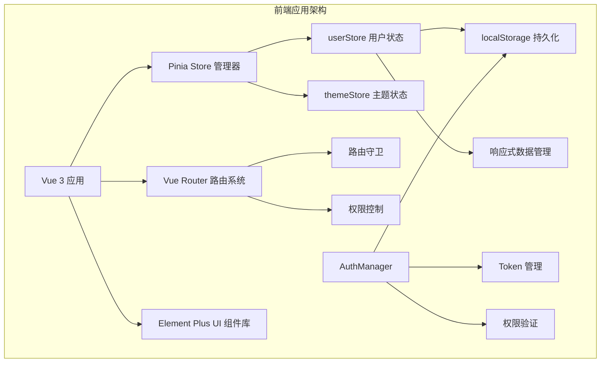
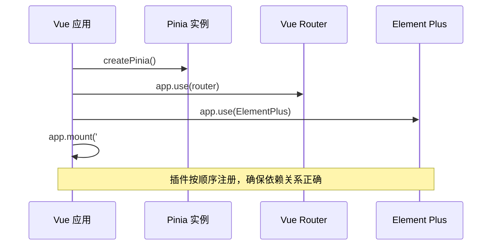
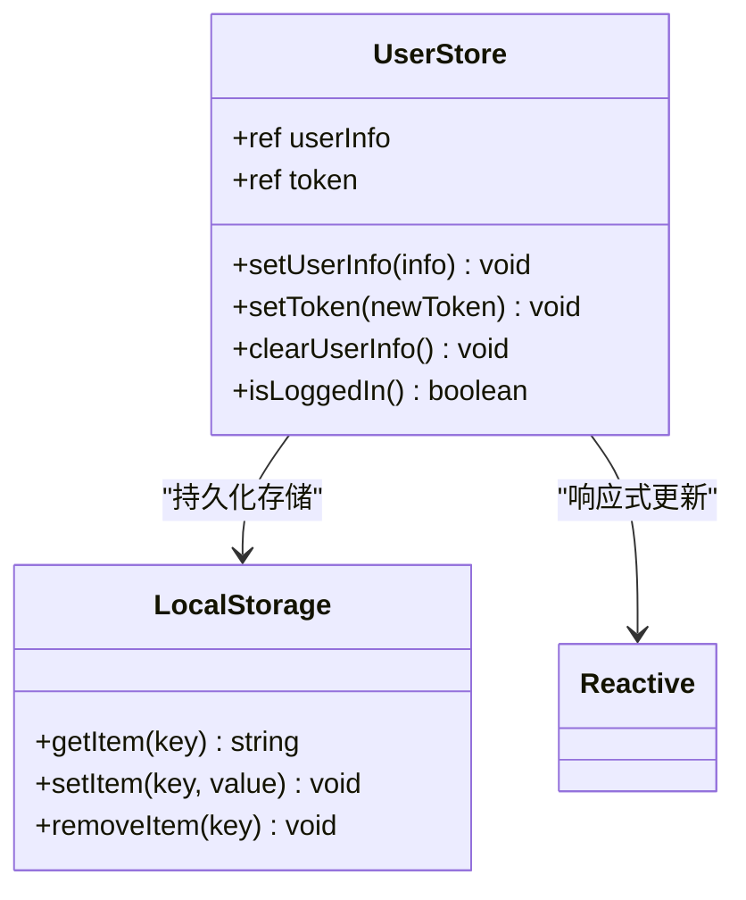
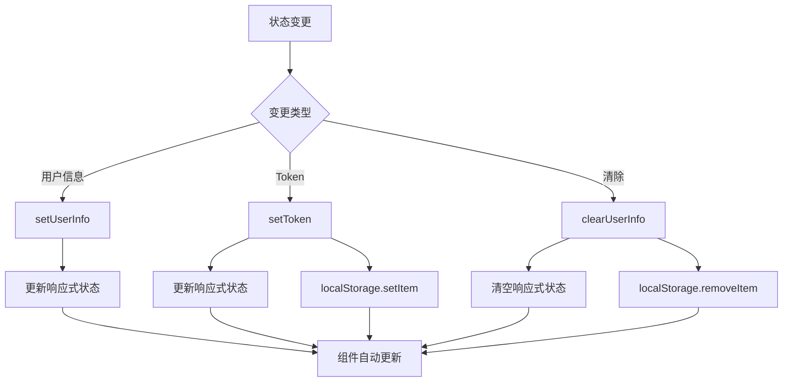
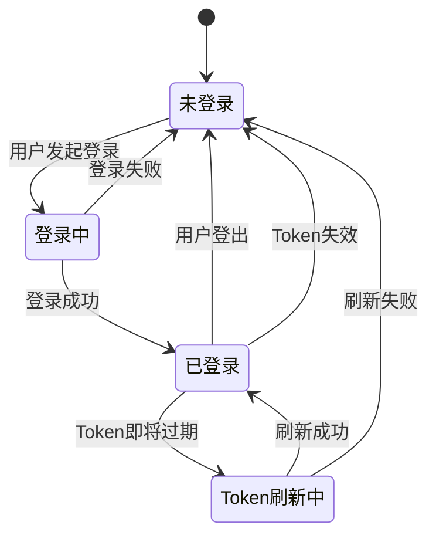
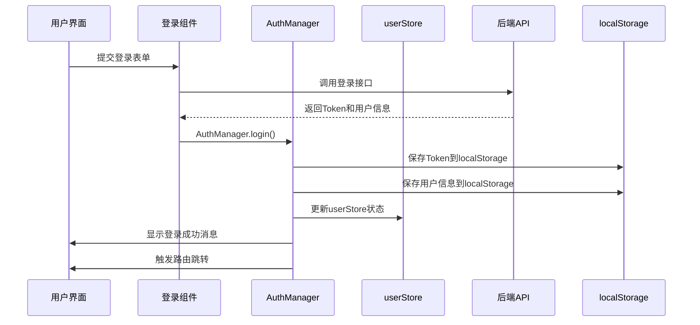
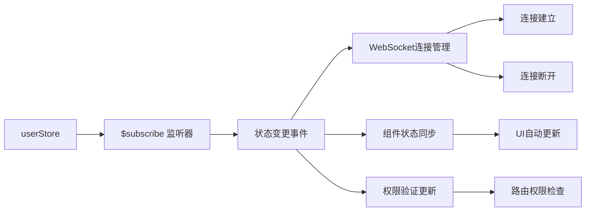
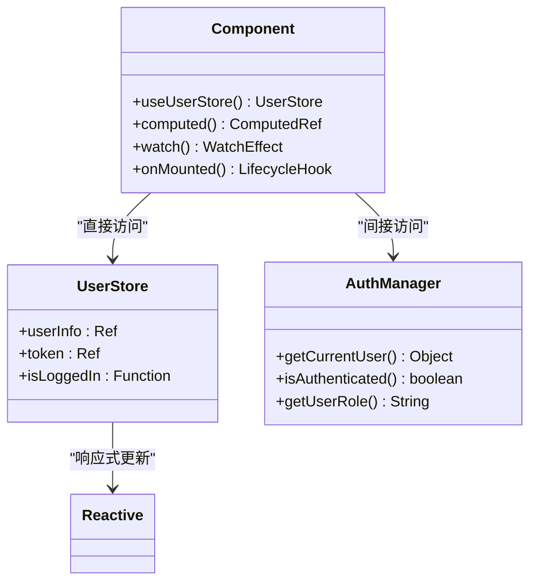
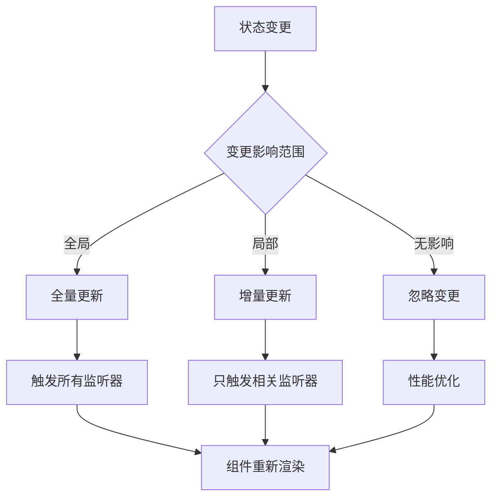
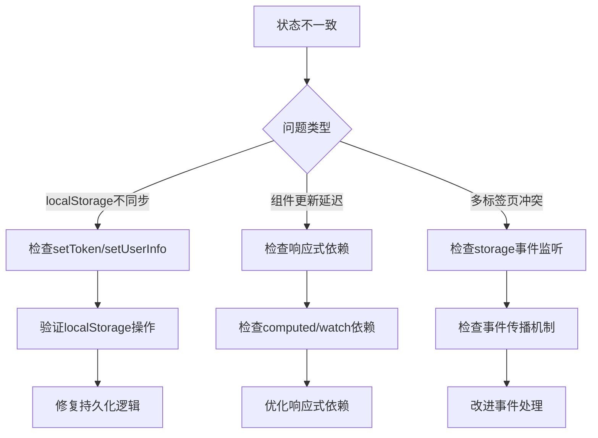

# 前端状态管理

<cite>
**本文档引用的文件**
- [user.js](file://frontend/src/stores/user.js)
- [main.js](file://frontend/src/main.js)
- [auth.js](file://frontend/src/utils/auth.js)
- [Login.vue](file://frontend/src/views/Login.vue)
- [Home.vue](file://frontend/src/views/Home.vue)
- [App.vue](file://frontend/src/App.vue)
- [index.js](file://frontend/src/router/index.js)
- [theme.js](file://frontend/src/stores/theme.js)
- [Navbar.vue](file://frontend/src/components/Layout/Navbar.vue)
- [Orders.vue](file://frontend/src/views/Orders.vue)
</cite>

## 目录
1. [简介](#简介)
2. [项目架构概览](#项目架构概览)
3. [Pinia初始化与配置](#pinia初始化与配置)
4. [userStore核心实现](#userstore核心实现)
5. [持久化存储机制](#持久化存储机制)
6. [用户认证状态管理](#用户认证状态管理)
7. [状态订阅与事件监听](#状态订阅与事件监听)
8. [组件中的状态访问](#组件中的状态访问)
9. [最佳实践与性能优化](#最佳实践与性能优化)
10. [常见问题与调试方案](#常见问题与调试方案)
11. [总结](#总结)

## 简介

本文档深入解析基于Pinia的状态管理系统实现，重点关注`userStore`的定义与响应式数据管理、持久化存储集成、用户认证状态流转以及全局状态同步机制。该系统采用现代化的Vue 3 Composition API和Pinia状态管理库，实现了完整的用户认证生命周期管理和状态持久化。

## 项目架构概览

系统采用分层架构设计，主要包含以下核心模块：

**图表来源**
- [main.js](file://frontend/src/main.js#L1-L26)
- [user.js](file://frontend/src/stores/user.js#L1-L40)
- [auth.js](file://frontend/src/utils/auth.js#L1-L214)

**章节来源**
- [main.js](file://frontend/src/main.js#L1-L26)
- [user.js](file://frontend/src/stores/user.js#L1-L40)

## Pinia初始化与配置

### 应用级Pinia注册

系统在`main.js`中完成了Pinia的初始化配置，确保状态管理器在整个应用生命周期内可用：

**图表来源**
- [main.js](file://frontend/src/main.js#L13-L26)

### 错误处理机制

Pinia实例通过全局事件监听实现了完善的错误处理机制：

- **未处理的Promise拒绝监听**：捕获异步操作中的未处理错误
- **全局错误事件监听**：监控JavaScript运行时错误
- **组件卸载清理**：确保内存泄漏防护

**章节来源**
- [main.js](file://frontend/src/main.js#L1-L26)
- [App.vue](file://frontend/src/App.vue#L40-L70)

## userStore核心实现

### 响应式数据结构

`userStore`采用现代的Composition API模式，定义了核心的响应式状态：

**图表来源**
- [user.js](file://frontend/src/stores/user.js#L4-L39)

### 状态管理方法

系统提供了完整的状态管理方法集合：

| 方法名 | 参数 | 返回值 | 功能描述 |
|--------|------|--------|----------|
| `setUserInfo` | `info: Object` | `void` | 设置用户基本信息，支持动态更新 |
| `setToken` | `newToken: String` | `void` | 更新Token并同步到localStorage |
| `clearUserInfo` | 无 | `void` | 清除用户信息和Token，恢复初始状态 |
| `isLoggedIn` | 无 | `boolean` | 检查用户是否已登录的有效性 |

### 初始化机制

`userStore`在创建时自动从localStorage恢复之前的状态：

- **Token恢复**：从`localStorage.getItem("token")`读取并初始化
- **用户信息恢复**：通过计算属性动态获取
- **响应式绑定**：确保状态变化时自动更新

**章节来源**
- [user.js](file://frontend/src/stores/user.js#L1-L40)

## 持久化存储机制

### localStorage集成策略

系统采用双重持久化策略，确保状态的一致性和可靠性：

**图表来源**
- [user.js](file://frontend/src/stores/user.js#L9-L24)

### 自动同步策略

系统实现了智能的自动同步机制：

- **即时同步**：每次状态变更立即写入localStorage
- **一致性检查**：通过状态订阅确保数据一致性
- **错误恢复**：提供状态重置和恢复机制

### 存储键值管理

| 存储键 | 类型 | 描述 | 用途 |
|--------|------|------|------|
| `"token"` | String | JWT访问令牌 | API认证和授权 |
| `"userInfo"` | JSON String | 用户基本信息 | 显示和权限验证 |
| `"userRole"` | String | 用户角色标识 | 权限分级控制 |
| `"tokenType"` | String | Token类型标识 | 认证协议标识 |

**章节来源**
- [user.js](file://frontend/src/stores/user.js#L5-L17)
- [auth.js](file://frontend/src/utils/auth.js#L87-L92)

## 用户认证状态管理

### 认证状态流转

系统实现了完整的用户认证生命周期管理：

**图表来源**
- [Login.vue](file://frontend/src/views/Login.vue#L135-L150)
- [auth.js](file://frontend/src/utils/auth.js#L86-L144)

### 登录流程实现

登录过程涉及多个层面的状态同步：

**图表来源**
- [Login.vue](file://frontend/src/views/Login.vue#L135-L150)
- [auth.js](file://frontend/src/utils/auth.js#L86-L112)

### Token管理机制

系统实现了多层次的Token管理策略：

- **自动存储**：登录成功后自动保存到localStorage
- **类型标识**：支持多种Token类型（Bearer、JWT等）
- **过期检测**：提供Token过期状态检查
- **刷新机制**：支持Token自动刷新

### 登出处理流程

登出操作确保状态的完全清理：

- **本地清理**：清除localStorage中的认证数据
- **状态重置**：重置userStore到初始状态
- **事件通知**：派发认证状态变更事件
- **路由重定向**：自动跳转到登录页面

**章节来源**
- [Login.vue](file://frontend/src/views/Login.vue#L135-L267)
- [auth.js](file://frontend/src/utils/auth.js#L122-L144)

## 状态订阅与事件监听

### Pinia状态订阅

系统利用Pinia的`$subscribe`方法实现全局状态监听：

**图表来源**
- [App.vue](file://frontend/src/App.vue#L54-L63)

### 全局事件监听机制

系统实现了多层级的事件监听体系：

| 监听器类型 | 监听目标 | 触发条件 | 处理逻辑 |
|------------|----------|----------|----------|
| `auth-state-changed` | window | 认证状态变更 | 组件实时响应 |
| `storage` | localStorage | 存储变化 | 状态同步更新 |
| `visibilitychange` | document | 页面可见性变化 | 状态重新验证 |
| `orderStatusUpdate` | WebSocket | 订单状态更新 | 订单列表刷新 |

### WebSocket连接管理

基于用户认证状态的动态WebSocket连接管理：

- **登录时连接**：用户认证成功后自动建立WebSocket连接
- **登出时断开**：用户登出时及时断开连接
- **状态同步**：通过状态订阅确保连接状态一致性

**章节来源**
- [App.vue](file://frontend/src/App.vue#L54-L63)
- [Navbar.vue](file://frontend/src/components/Layout/Navbar.vue#L207-L258)

## 组件中的状态访问

### 响应式状态访问模式

系统提供了多种状态访问模式，适应不同的使用场景：

**图表来源**
- [Home.vue](file://frontend/src/views/Home.vue#L255-L258)
- [Orders.vue](file://frontend/src/views/Orders.vue#L368-L369)

### 状态访问最佳实践

#### 1. 直接访问模式
适用于简单的状态读取场景：
- 使用`useUserStore()`直接访问store实例
- 通过`.value`访问响应式状态
- 适合在setup函数中使用

#### 2. 计算属性模式
适用于复杂的状态组合和计算：
- 使用`computed()`创建派生状态
- 实现状态间的关联计算
- 提供稳定的响应式接口

#### 3. 间接访问模式
适用于权限控制和业务逻辑：
- 通过`AuthManager`访问统一的认证接口
- 提供标准化的权限检查方法
- 支持向后兼容和功能扩展

### 组件生命周期集成

状态管理与Vue组件生命周期的完美集成：

- **onMounted**：初始化状态监听和数据加载
- **onBeforeUnmount**：清理事件监听器和定时器
- **watch**：监听状态变化并执行副作用
- **computed**：创建派生状态和计算属性

**章节来源**
- [Home.vue](file://frontend/src/views/Home.vue#L255-L258)
- [Orders.vue](file://frontend/src/views/Orders.vue#L368-L369)

## 最佳实践与性能优化

### 状态管理最佳实践

#### 1. 单一职责原则
- 每个store专注于特定的功能领域
- 避免store之间的直接依赖
- 通过事件和API进行跨store通信

#### 2. 响应式状态设计
- 使用`ref`和`reactive`创建响应式状态
- 避免深层嵌套的对象结构
- 合理使用`computed`减少不必要的计算

#### 3. 状态持久化策略
- 选择性持久化关键状态
- 实现状态的版本控制和迁移
- 提供状态重置和恢复机制

### 性能优化策略

#### 1. 状态订阅优化

#### 2. 内存管理优化
- 及时清理事件监听器
- 避免循环引用和内存泄漏
- 合理使用WeakMap和WeakSet

#### 3. 网络请求优化
- 实现请求去重和缓存机制
- 使用防抖和节流技术
- 提供离线状态和数据同步

### 错误处理与容错机制

#### 1. 异常捕获策略
- 全局错误边界处理
- 组件级错误恢复
- 用户友好的错误提示

#### 2. 状态回滚机制
- 提供状态快照和恢复点
- 实现事务性的状态变更
- 支持批量操作的原子性

**章节来源**
- [App.vue](file://frontend/src/App.vue#L40-L70)
- [auth.js](file://frontend/src/utils/auth.js#L114-L143)

## 常见问题与调试方案

### 状态不一致问题

#### 问题表现
- localStorage与store状态不同步
- 组件状态更新延迟或丢失
- 多标签页间状态不一致

#### 调试方案

#### 解决方案
1. **强制状态同步**：在关键节点手动同步状态
2. **事件驱动更新**：通过storage事件触发状态更新
3. **定期状态校验**：实现状态一致性检查机制

### 内存泄漏问题

#### 常见原因
- 未清理的事件监听器
- 循环引用的对象结构
- 长时间运行的定时器

#### 预防措施
- 在组件卸载时清理所有监听器
- 使用弱引用避免循环依赖
- 实现内存使用监控

### 性能问题诊断

#### 性能指标监控
| 指标 | 正常范围 | 监控方法 | 优化策略 |
|------|----------|----------|----------|
| 状态更新频率 | < 10次/秒 | 控制订阅粒度 | 合并状态变更 |
| 组件渲染次数 | < 5次/秒 | 使用Vue DevTools | 优化计算属性 |
| 内存使用量 | < 50MB | 浏览器开发者工具 | 及时清理资源 |

#### 优化建议
1. **减少不必要的状态订阅**
2. **优化计算属性的依赖关系**
3. **实现状态的懒加载和分片**
4. **使用Web Workers处理复杂计算**

**章节来源**
- [Navbar.vue](file://frontend/src/components/Layout/Navbar.vue#L207-L258)
- [App.vue](file://frontend/src/App.vue#L66-L70)

## 总结

本文档全面解析了基于Pinia的状态管理系统实现，涵盖了从基础架构到高级优化的各个方面。系统通过以下核心特性实现了高效、可靠的状态管理：

### 核心优势
1. **响应式状态管理**：基于Vue 3的Composition API，提供直观的状态管理体验
2. **持久化存储集成**：无缝集成localStorage，确保状态的持久性和一致性
3. **自动化状态同步**：通过事件监听和状态订阅实现全局状态同步
4. **完善的错误处理**：多层次的错误捕获和恢复机制
5. **性能优化策略**：针对大型应用的性能优化方案

### 技术特色
- **模块化设计**：清晰的职责分离和模块化架构
- **类型安全**：充分利用TypeScript提供类型安全保障
- **可扩展性**：良好的扩展性设计支持功能迭代
- **开发体验**：优秀的开发工具支持和调试体验

### 应用价值
该状态管理系统不仅满足了当前的功能需求，更为未来的功能扩展奠定了坚实的基础。通过合理的架构设计和最佳实践的应用，系统具备了高可用性、高性能和高可维护性的特点，能够有效支撑业务的持续发展。