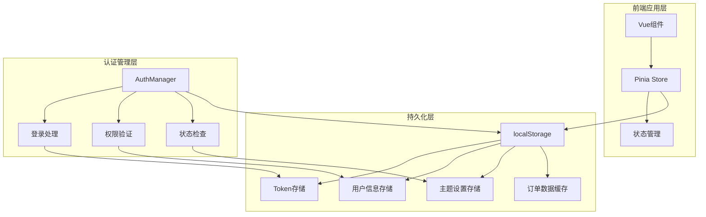
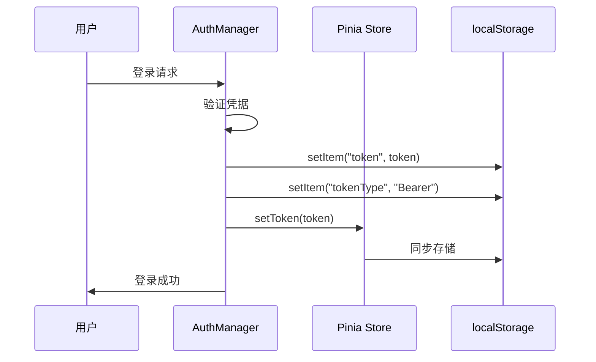
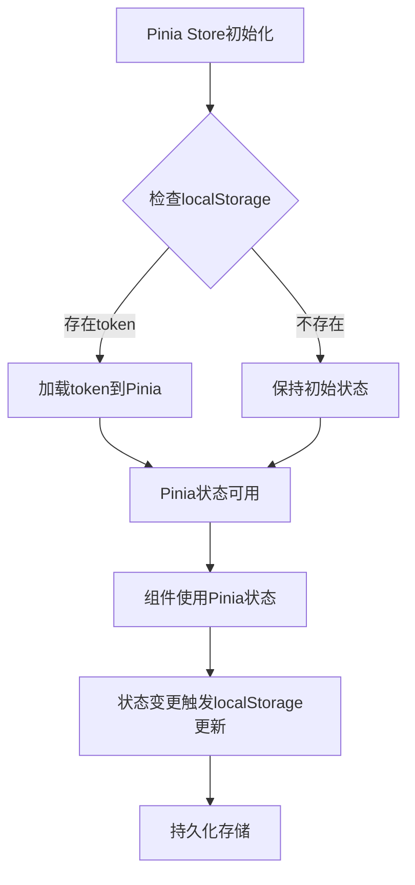
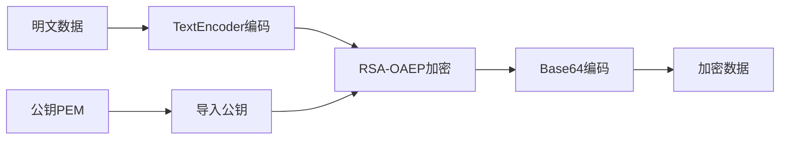
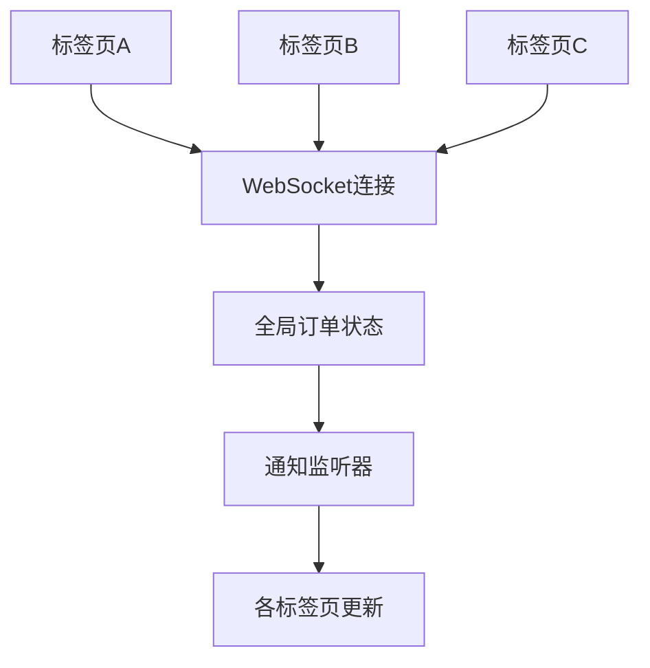
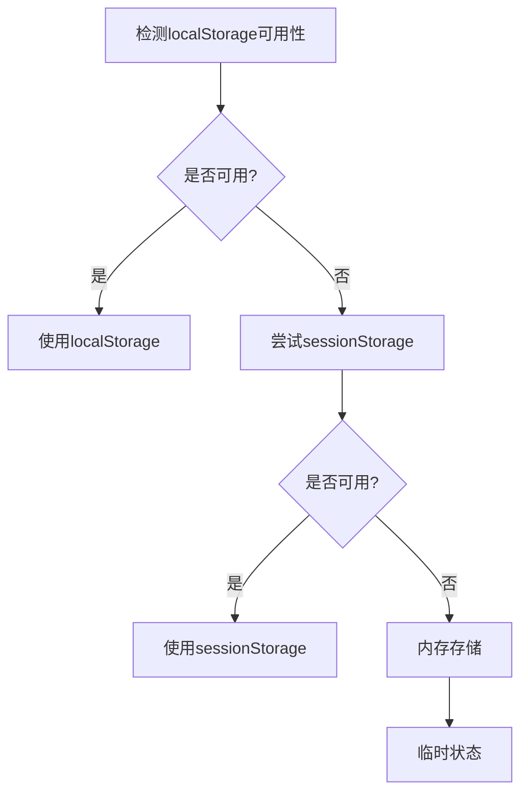

# 状态持久化机制

<cite>
**本文档引用的文件**
- [frontend/src/utils/auth.js](file://frontend/src/utils/auth.js)
- [frontend/src/stores/user.js](file://frontend/src/stores/user.js)
- [frontend/src/api/auth.js](file://frontend/src/api/auth.js)
- [frontend/src/main.js](file://frontend/src/main.js)
- [frontend/src/composables/useTimeSync.js](file://frontend/src/composables/useTimeSync.js)
- [frontend/src/utils/orderSync.js](file://frontend/src/utils/orderSync.js)
- [frontend/src/stores/theme.js](file://frontend/src/stores/theme.js)
</cite>

## 目录
1. [概述](#概述)
2. [核心架构](#核心架构)
3. [Token存储与读取机制](#token存储与读取机制)
4. [Pinia状态与localStorage同步策略](#pinia状态与localstorage同步策略)
5. [认证管理器详解](#认证管理器详解)
6. [持久化数据加密与安全](#持久化数据加密与安全)
7. [跨标签页同步机制](#跨标签页同步机制)
8. [存储空间监控与优化](#存储空间监控与优化)
9. [降级处理方案](#降级处理方案)
10. [最佳实践建议](#最佳实践建议)

## 概述

本系统采用多层次的状态持久化策略，通过localStorage作为主要的客户端存储介质，结合Pinia状态管理库，实现了用户认证状态、主题偏好、订单数据等关键业务状态的持久化存储。系统设计遵循分离关注点原则，将状态管理分为两个层次：底层的localStorage持久化层和上层的Pinia状态管理层。

## 核心架构



**图表来源**
- [frontend/src/utils/auth.js](file://frontend/src/utils/auth.js#L1-L214)
- [frontend/src/stores/user.js](file://frontend/src/stores/user.js#L1-L40)

## Token存储与读取机制

### setToken方法的调用时机

`setToken`方法在多个关键场景中被调用，确保token的及时更新和持久化：

1. **登录成功后**：用户成功认证后，系统立即调用`setToken`保存新的token
2. **自动登录恢复**：当用户刷新页面或重新打开应用时，系统尝试从localStorage恢复token
3. **API请求拦截**：每次API请求都会检查并确保token的有效性



**图表来源**
- [frontend/src/utils/auth.js](file://frontend/src/utils/auth.js#L87-L119)
- [frontend/src/stores/user.js](file://frontend/src/stores/user.js#L14-L16)

### clearUserInfo中的removeItem清理逻辑

`clearUserInfo`方法负责彻底清理用户认证相关的所有持久化数据：

```javascript
// 清理逻辑示例
const clearUserInfo = () => {
    userInfo.value = null;
    token.value = "";
    localStorage.removeItem("token");
};
```

清理顺序和原因：
1. **清空Pinia状态**：首先更新内存中的状态
2. **移除token**：删除认证token，防止后续请求携带无效token
3. **清理用户信息**：移除用户详细信息，确保敏感数据不残留

**章节来源**
- [frontend/src/stores/user.js](file://frontend/src/stores/user.js#L19-L24)

## Pinia状态与localStorage同步策略

### 为什么userInfo未直接在Pinia中持久化

系统设计中，userInfo未直接在Pinia中持久化，而是通过localStorage进行管理，这种设计决策基于以下考虑：

1. **性能优化**：Pinia更适合管理应用状态而非大量持久化数据
2. **内存管理**：避免在内存中保留过多的持久化数据
3. **数据一致性**：通过统一的localStorage接口确保数据一致性

### 同步机制实现



**图表来源**
- [frontend/src/stores/user.js](file://frontend/src/stores/user.js#L5-L6)

**章节来源**
- [frontend/src/stores/user.js](file://frontend/src/stores/user.js#L1-L40)

## 认证管理器详解

### login方法的批量存储逻辑

`login`方法实现了多字段的批量存储，确保用户认证信息的完整性：

```javascript
// login方法核心逻辑
static login(userInfo, token, tokenType = "Bearer") {
    try {
        localStorage.setItem("token", token);
        localStorage.setItem("tokenType", tokenType);
        localStorage.setItem("userRole", userInfo.role);
        localStorage.setItem("userInfo", JSON.stringify(userInfo));
        // ... 其他逻辑
    }
}
```

存储字段及其作用：
- **token**：认证令牌，用于API请求的身份验证
- **tokenType**：令牌类型，默认为"Bearer"
- **userRole**：用户角色，用于权限控制
- **userInfo**：完整的用户信息，JSON序列化存储

### getCurrentUser中的JSON解析异常容错处理

`getCurrentUser`方法实现了robust的JSON解析处理：

```javascript
static getCurrentUser() {
    try {
        const userInfo = localStorage.getItem("userInfo");
        if (!userInfo || userInfo === "undefined" || userInfo === "null") {
            return null;
        }
        return JSON.parse(userInfo);
    } catch (error) {
        console.error("解析用户信息失败:", error);
        // 清除无效的用户信息
        localStorage.removeItem("userInfo");
        return null;
    }
}
```

容错机制包括：
1. **空值检查**：验证数据是否存在且有效
2. **格式验证**：检查字符串是否为有效的JSON格式
3. **异常捕获**：捕获解析过程中的任何异常
4. **数据清理**：自动清理损坏的数据

**章节来源**
- [frontend/src/utils/auth.js](file://frontend/src/utils/auth.js#L8-L21)
- [frontend/src/utils/auth.js](file://frontend/src/utils/auth.js#L86-L119)

## 持久化数据加密与安全

### RSA加密实现

系统提供了基于RSA-OAEP的加密机制，用于保护敏感数据：



**图表来源**
- [frontend/src/views/Payment.vue](file://frontend/src/views/Payment.vue#L834-L882)

### 加密流程详解

1. **公钥导入**：从PEM格式导入RSA公钥
2. **数据编码**：将明文转换为Uint8Array
3. **加密处理**：使用RSA-OAEP算法加密
4. **编码输出**：将加密结果转换为Base64格式

**章节来源**
- [frontend/src/views/Payment.vue](file://frontend/src/views/Payment.vue#L834-L882)

## 跨标签页同步机制

### 订单数据同步

系统实现了复杂的跨标签页数据同步机制：



**图表来源**
- [frontend/src/utils/orderSync.js](file://frontend/src/utils/orderSync.js#L1-L302)

### 实现原理

1. **全局状态管理**：维护统一的全局订单状态
2. **监听器模式**：注册多个监听器处理状态变更
3. **事件分发**：通过CustomEvent实现跨标签页通信
4. **并发控制**：确保数据一致性

**章节来源**
- [frontend/src/utils/orderSync.js](file://frontend/src/utils/orderSync.js#L1-L302)

## 存储空间监控与优化

### 主题存储优化

系统实现了智能的主题存储机制：

```javascript
// 主题初始化逻辑
const initTheme = () => {
    const savedTheme = localStorage.getItem("theme");
    if (savedTheme && themes.value.find((t) => t.name === savedTheme)) {
        currentTheme.value = savedTheme;
    }
    applyTheme(currentTheme.value);
};
```

### 存储空间管理策略

1. **数据压缩**：对大型数据结构进行压缩存储
2. **定期清理**：清理过期或不再需要的数据
3. **容量监控**：监控localStorage使用情况
4. **优先级管理**：根据重要性分配存储空间

**章节来源**
- [frontend/src/stores/theme.js](file://frontend/src/stores/theme.js#L20-L27)

## 降级处理方案

### localStorage被禁用的处理

当localStorage被禁用时，系统提供多种降级方案：



### 容量限制处理

当localStorage达到容量限制时：

1. **数据优先级排序**：优先保留关键数据
2. **渐进式清理**：逐步清理非关键数据
3. **压缩存储**：使用更紧凑的存储格式
4. **分片存储**：将大数据分散存储

### 异常处理机制

```javascript
// 异常处理示例
try {
    localStorage.setItem("key", "value");
} catch (e) {
    if (e.name === 'QuotaExceededError') {
        // 处理容量限制
        cleanupOldData();
    } else if (e.name === 'SecurityError') {
        // 处理安全限制
        useAlternativeStorage();
    }
}
```

## 最佳实践建议

### 数据加密建议

1. **敏感数据加密**：对密码、支付信息等敏感数据进行加密存储
2. **传输安全**：确保数据在传输过程中的安全性
3. **密钥管理**：妥善保管加密密钥，定期轮换

### 性能优化建议

1. **懒加载**：只在需要时加载大型数据
2. **缓存策略**：合理设置缓存过期时间
3. **批量操作**：合并多个存储操作以提高效率

### 安全加固建议

1. **输入验证**：严格验证所有存储的数据
2. **访问控制**：限制对敏感数据的访问
3. **审计日志**：记录重要的数据操作

### 用户体验优化

1. **无缝切换**：确保用户在不同设备间的状态同步
2. **离线支持**：提供离线状态下的基本功能
3. **错误恢复**：提供友好的错误处理和恢复机制

通过以上多层次的持久化机制，系统实现了可靠、安全、高效的用户状态管理，为用户提供了一致且流畅的使用体验。