# 认证状态同步

<cite>
**本文档引用的文件**
- [main.js](file://frontend/src/main.js)
- [user.js](file://frontend/src/stores/user.js)
- [auth.js](file://frontend/src/api/auth.js)
- [auth.js](file://frontend/src/utils/auth.js)
- [index.js](file://frontend/src/router/index.js)
- [Login.vue](file://frontend/src/views/Login.vue)
- [Navbar.vue](file://frontend/src/components/Layout/Navbar.vue)
- [test-auth-status.html](file://frontend/public/test-auth-status.html)
</cite>

## 目录
1. [概述](#概述)
2. [应用启动与状态初始化](#应用启动与状态初始化)
3. [Pinia状态管理架构](#pinia状态管理架构)
4. [认证状态判断机制](#认证状态判断机制)
5. [认证事件驱动同步](#认证事件驱动同步)
6. [跨组件通信机制](#跨组件通信机制)
7. [路由守卫中的状态同步](#路由守卫中的状态同步)
8. [多标签页状态同步](#多标签页状态同步)
9. [Token过期与自动登出](#token过期与自动登出)
10. [最佳实践与故障排除](#最佳实践与故障排除)

## 概述

该汽车洗车服务预约系统的认证状态同步机制采用多层次、事件驱动的设计模式，确保用户认证状态在前端应用中的全局一致性。系统通过Pinia状态管理、自定义事件分发、localStorage同步和路由守卫等技术手段，实现了完整的认证状态生命周期管理。

核心特性包括：
- **全局状态统一管理**：通过Pinia Store集中管理用户认证状态
- **事件驱动同步**：使用CustomEvent实现跨组件通信
- **多层状态验证**：结合localStorage和Pinia双重验证机制
- **自动状态同步**：监听storage事件实现多标签页状态同步
- **智能路由控制**：基于认证状态的动态路由权限管理

## 应用启动与状态初始化

### Pinia实例创建与注册

应用启动时，通过main.js中的配置建立全局状态管理基础：

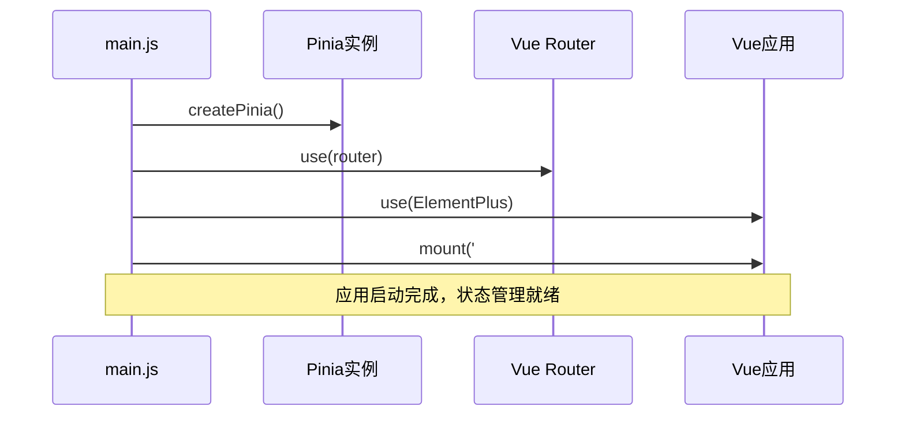

**图表来源**
- [main.js](file://frontend/src/main.js#L20-L24)

### 初始状态加载

应用启动时，系统会自动从localStorage中恢复用户的认证状态：

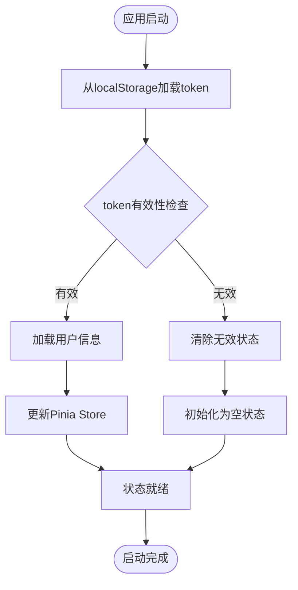

**节来源**
- [main.js](file://frontend/src/main.js#L1-L26)
- [user.js](file://frontend/src/stores/user.js#L1-L40)

## Pinia状态管理架构

### UserStore设计模式

系统采用模块化的Pinia Store设计，专门管理用户认证相关的状态：

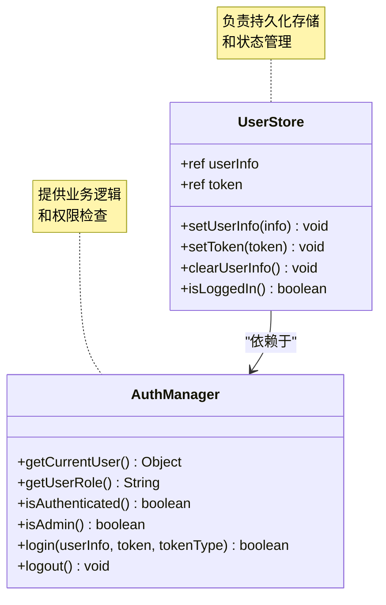

**图表来源**
- [user.js](file://frontend/src/stores/user.js#L4-L39)
- [auth.js](file://frontend/src/utils/auth.js#L7-L214)

### 状态持久化策略

UserStore通过以下机制确保状态的持久化：

| 存储位置 | 数据类型 | 同步方式 | 生命周期 |
|---------|---------|---------|---------|
| Pinia Store | 响应式状态 | 内存管理 | 应用生命周期 |
| localStorage | 字符串数据 | 同步写入 | 浏览器会话 |
| sessionStorage | 临时数据 | 会话级存储 | 浏览器会话 |

**节来源**
- [user.js](file://frontend/src/stores/user.js#L5-L39)

## 认证状态判断机制

### isLoggedIn方法的核心逻辑

UserStore中的isLoggedIn方法提供了统一的认证状态判断依据：

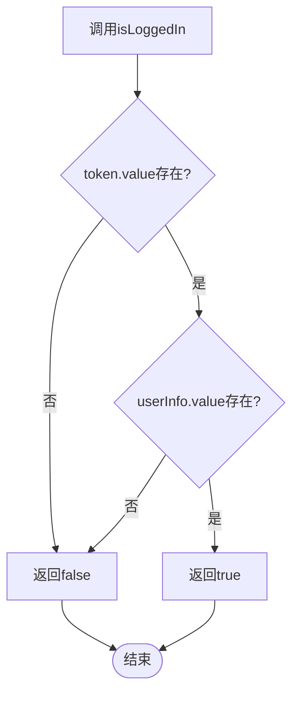

**图表来源**
- [user.js](file://frontend/src/stores/user.js#L27-L29)

### 多层次状态验证

系统采用多层次的认证状态验证机制：

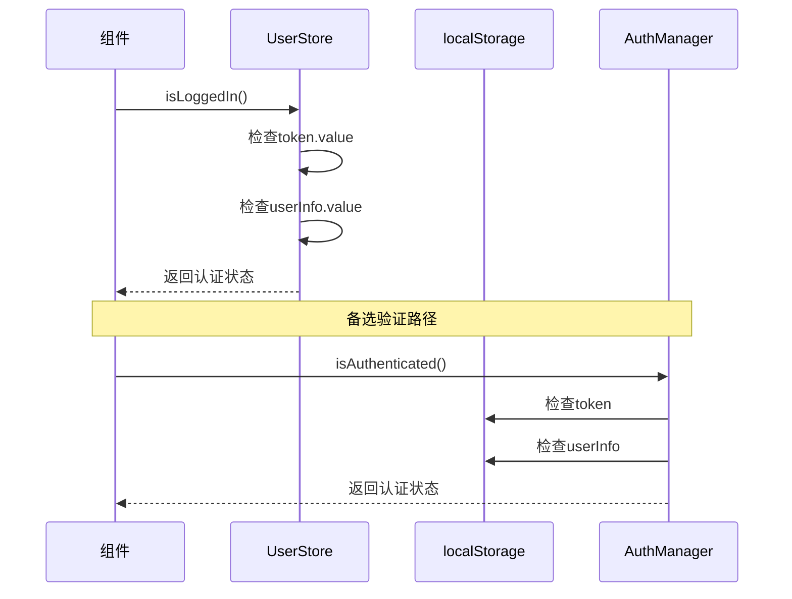

**图表来源**
- [user.js](file://frontend/src/stores/user.js#L27-L29)
- [auth.js](file://frontend/src/utils/auth.js#L34-L38)

**节来源**
- [user.js](file://frontend/src/stores/user.js#L27-L29)
- [auth.js](file://frontend/src/utils/auth.js#L34-L38)

## 认证事件驱动同步

### AuthManager登录方法的同步机制

AuthManager.login方法是认证状态同步的核心入口，它同时更新多个状态源：

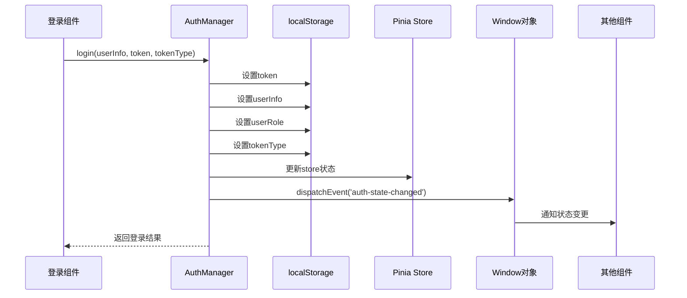

**图表来源**
- [auth.js](file://frontend/src/utils/auth.js#L86-L119)

### logout方法的状态清理

logout方法确保所有状态源的一致性清理：

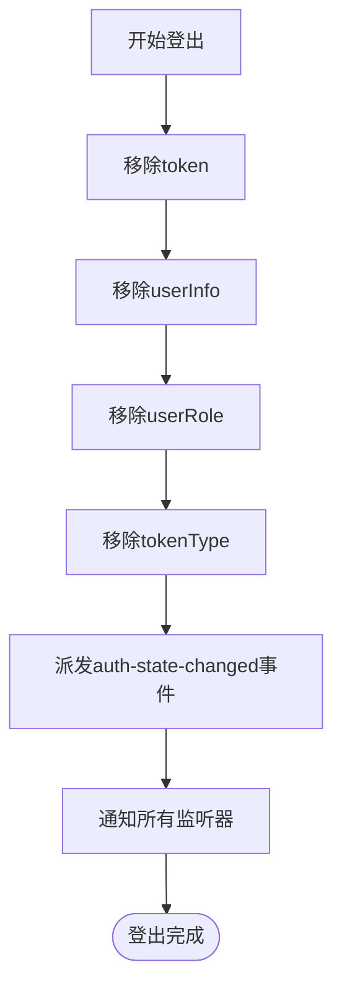

**图表来源**
- [auth.js](file://frontend/src/utils/auth.js#L123-L144)

**节来源**
- [auth.js](file://frontend/src/utils/auth.js#L86-L144)

## 跨组件通信机制

### 自定义事件系统

系统通过window.dispatchEvent创建自定义事件实现跨组件通信：

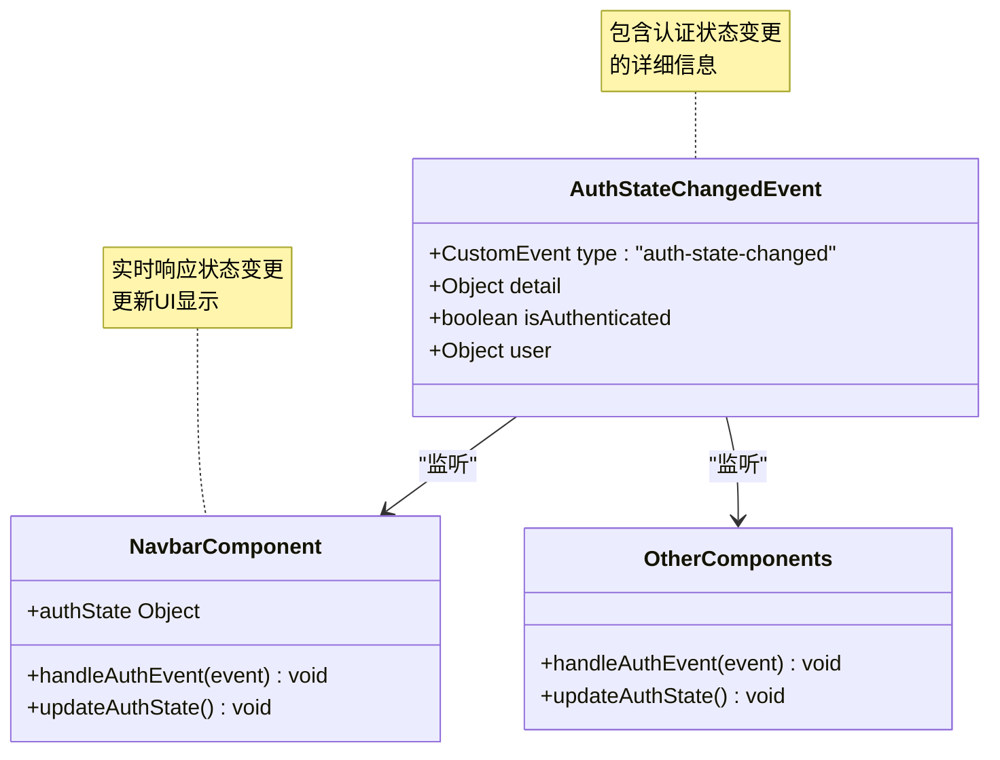

**图表来源**
- [auth.js](file://frontend/src/utils/auth.js#L100-L112)
- [Navbar.vue](file://frontend/src/components/Layout/Navbar.vue#L207-L212)

### 事件监听器的生命周期管理

Navbar组件展示了完整的事件监听器管理模式：

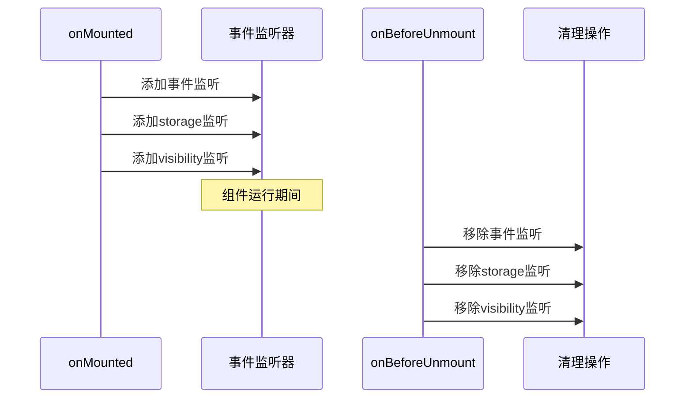

**图表来源**
- [Navbar.vue](file://frontend/src/components/Layout/Navbar.vue#L226-L247)

**节来源**
- [auth.js](file://frontend/src/utils/auth.js#L100-L144)
- [Navbar.vue](file://frontend/src/components/Layout/Navbar.vue#L207-L247)

## 路由守卫中的状态同步

### 路由权限控制流程

路由守卫实现了基于认证状态的智能权限控制：

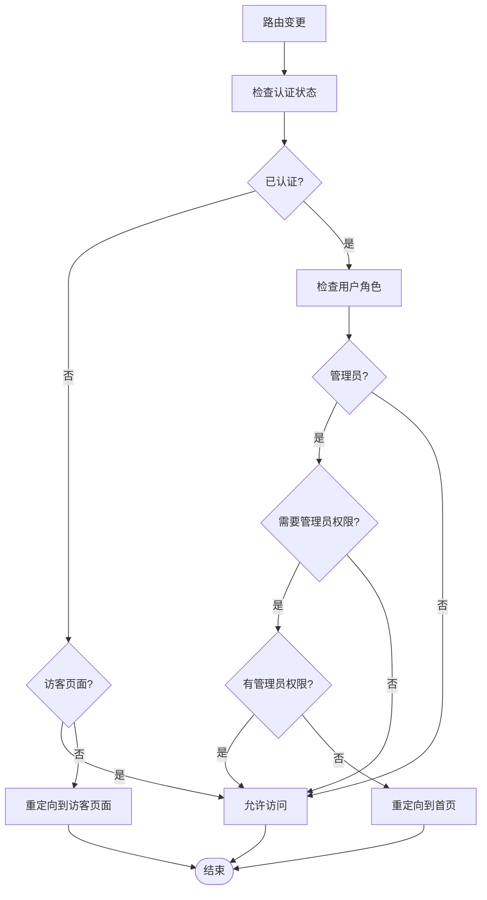

**图表来源**
- [index.js](file://frontend/src/router/index.js#L208-L336)

### Token过期检查机制

路由守卫集成了Token过期检查和自动刷新功能：

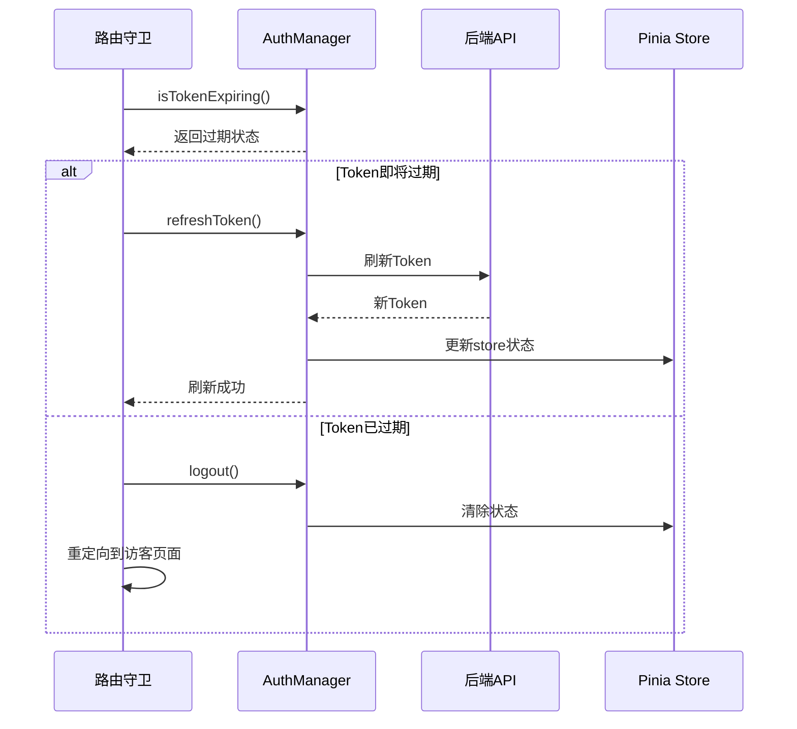

**图表来源**
- [index.js](file://frontend/src/router/index.js#L292-L311)

**节来源**
- [index.js](file://frontend/src/router/index.js#L208-L336)

## 多标签页状态同步

### Storage事件监听

系统通过监听storage事件实现多标签页间的状态同步：

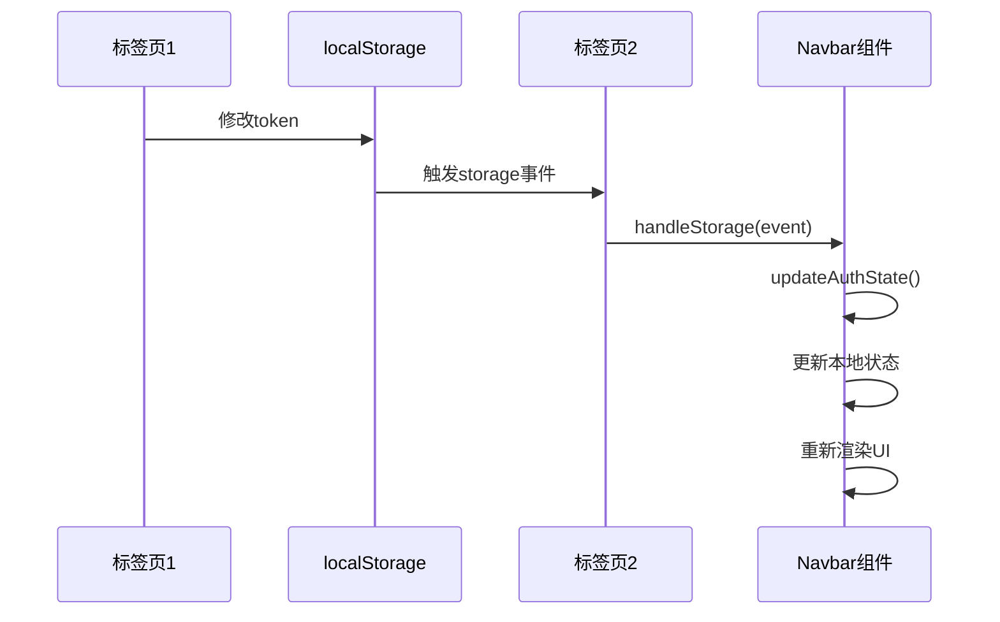

**图表来源**
- [Navbar.vue](file://frontend/src/components/Layout/Navbar.vue#L214-L218)

### 状态同步的关键点

| 同步触发条件 | 涉及的localStorage键 | 同步范围 | 响应时机 |
|-------------|-------------------|---------|---------|
| 登录操作 | token, userInfo, userRole | 所有标签页 | 即时 |
| 登出操作 | token, userInfo, userRole, tokenType | 所有标签页 | 即时 |
| Token刷新 | token, tokenType | 所有标签页 | 即时 |
| 页面可见性 | - | 当前标签页 | 可见时 |

**节来源**
- [Navbar.vue](file://frontend/src/components/Layout/Navbar.vue#L214-L218)

## Token过期与自动登出

### Token过期检测机制

系统实现了智能的Token过期检测和自动处理机制：

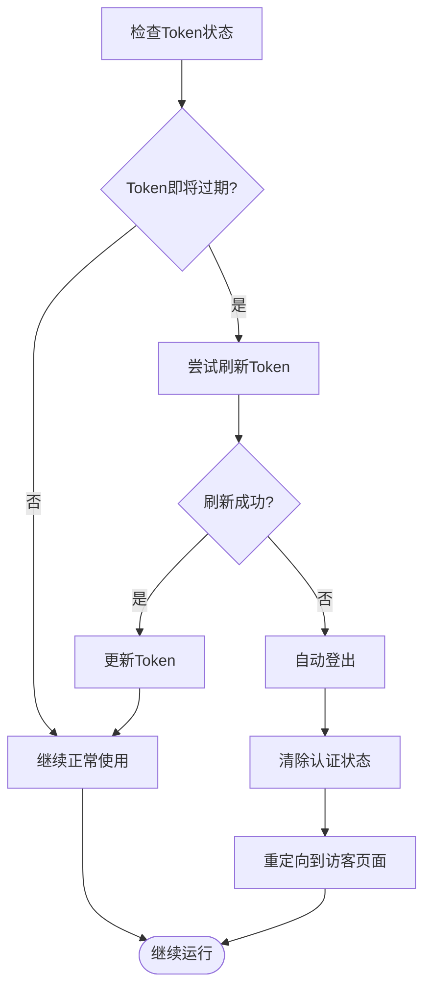

**图表来源**
- [index.js](file://frontend/src/router/index.js#L292-L311)

### 自动登出的用户体验

自动登出过程确保良好的用户体验：

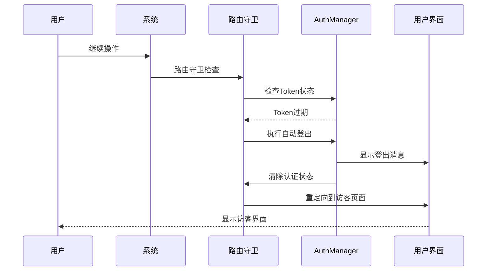

**图表来源**
- [index.js](file://frontend/src/router/index.js#L302-L309)

**节来源**
- [index.js](file://frontend/src/router/index.js#L292-L311)

## 最佳实践与故障排除

### 状态一致性最佳实践

为了确保认证状态的一致性，系统遵循以下最佳实践：

#### 1. 统一的状态更新入口

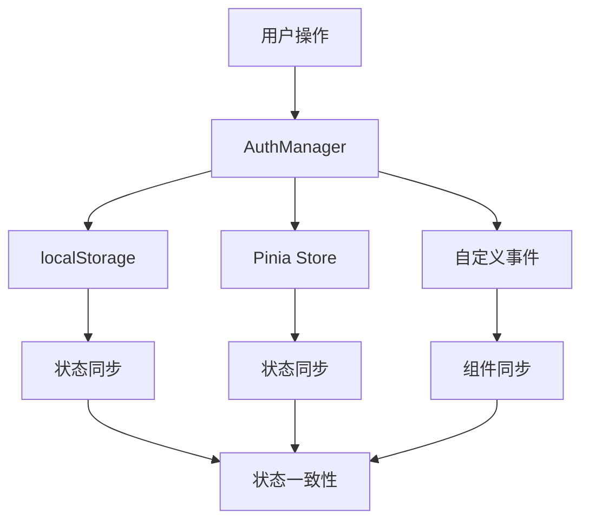

#### 2. 异步操作中的状态保护

对于异步操作，系统采用防重复调用和状态锁定机制：

| 保护措施 | 实现方式 | 适用场景 |
|---------|---------|---------|
| 防重复调用 | 标志位控制 | 认证检查、状态更新 |
| 状态锁定 | Promise链式调用 | Token刷新、批量操作 |
| 错误恢复 | 降级处理 | 网络异常、服务器错误 |
| 状态回滚 | 原子操作 | 关键状态变更 |

#### 3. 多标签页状态同步策略

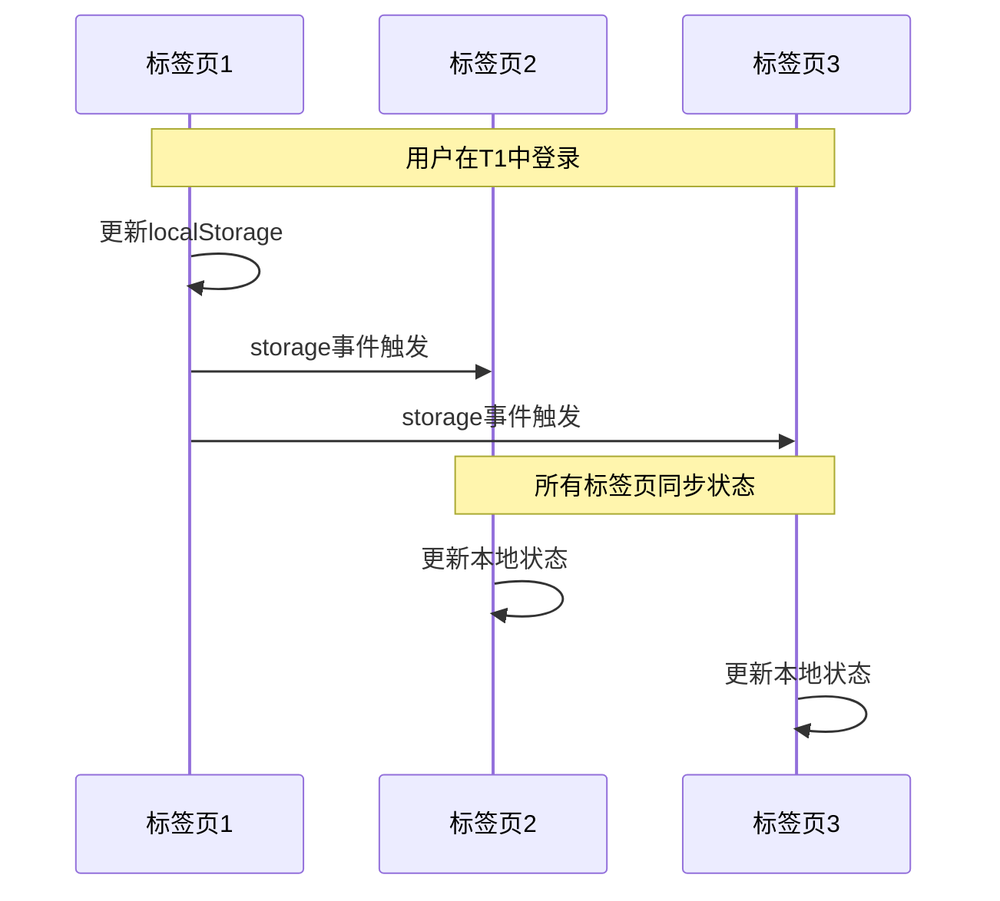

### 常见问题排查步骤

#### 1. 认证状态不同步排查

当遇到认证状态不同步的问题时，按照以下步骤排查：

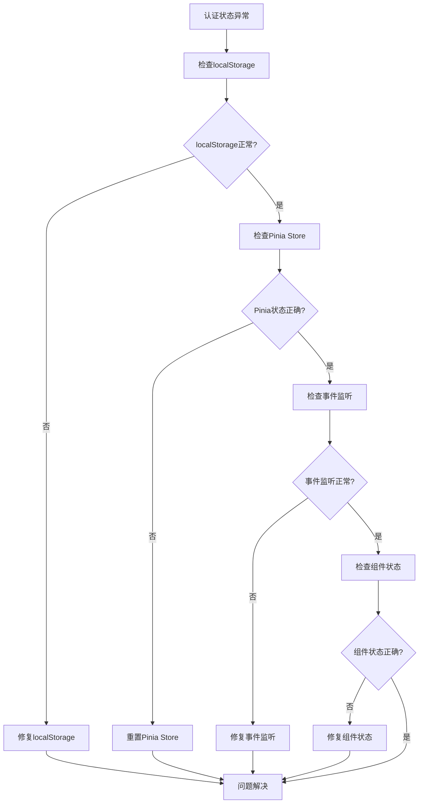

#### 2. 调试工具和方法

系统提供了多种调试工具帮助开发者诊断认证状态问题：

| 工具名称 | 功能描述 | 使用场景 |
|---------|---------|---------|
| test-auth-status.html | 认证状态检查工具 | 快速验证状态 |
| debug-auth.html | 详细认证调试 | 深度问题诊断 |
| RouteLogger | 路由日志记录 | 权限控制调试 |
| Console.log | 控制台输出 | 实时状态监控 |

#### 3. 性能优化建议

为了确保认证状态同步的高性能，建议采用以下优化策略：

- **事件去抖**：对频繁的状态变更事件进行去抖处理
- **批量更新**：将多个状态变更合并为单次更新
- **懒加载监听**：按需添加事件监听器
- **内存管理**：及时清理不再需要的监听器

**节来源**
- [test-auth-status.html](file://frontend/public/test-auth-status.html#L1-L214)
- [index.js](file://frontend/src/router/index.js#L208-L336)

## 总结

该汽车洗车服务预约系统的认证状态同步机制展现了现代前端应用的最佳实践。通过Pinia状态管理、事件驱动架构、多层验证机制和智能路由控制，系统实现了完整的认证状态生命周期管理。

关键优势包括：
- **全局一致性**：通过多层次状态管理和事件驱动确保状态一致性
- **用户体验**：智能的自动登出和状态恢复机制提升用户体验
- **可维护性**：清晰的模块化设计和完善的错误处理机制
- **扩展性**：灵活的事件系统支持未来功能扩展

这套认证状态同步机制为构建安全、可靠的单页应用提供了坚实的基础，值得在类似项目中借鉴和应用。