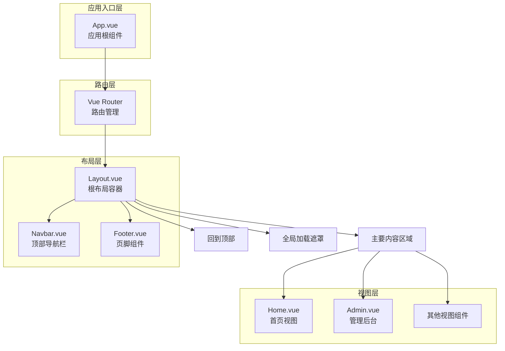
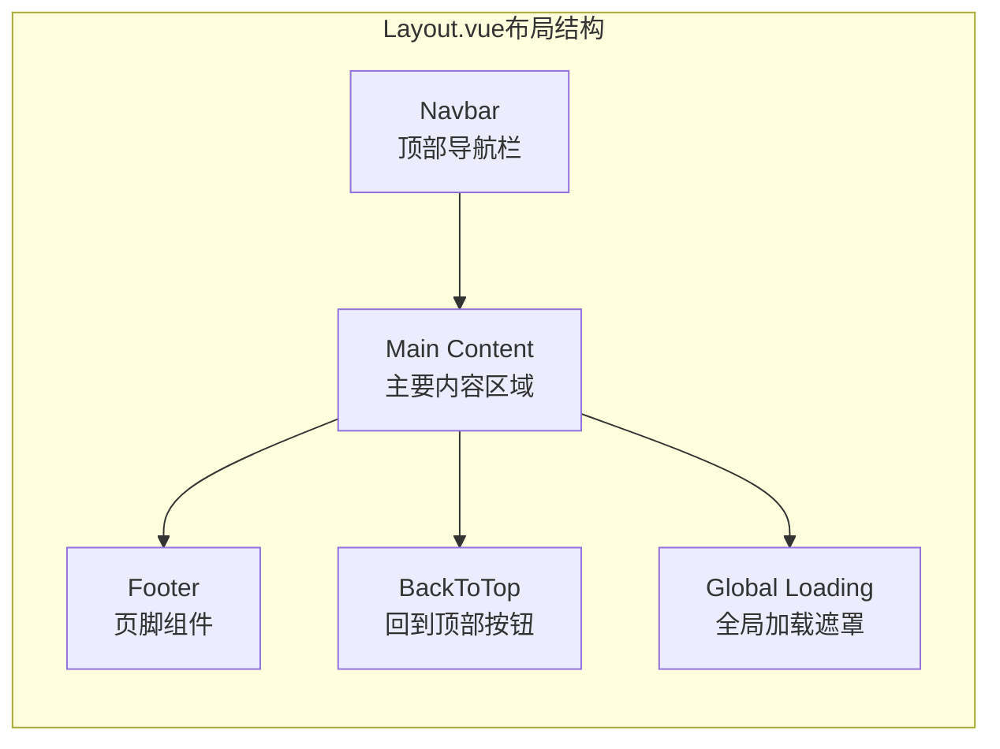
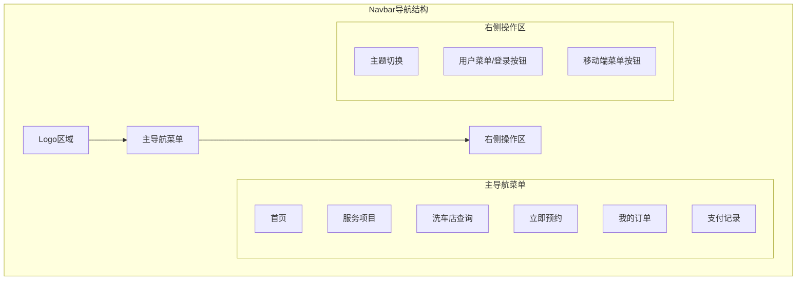
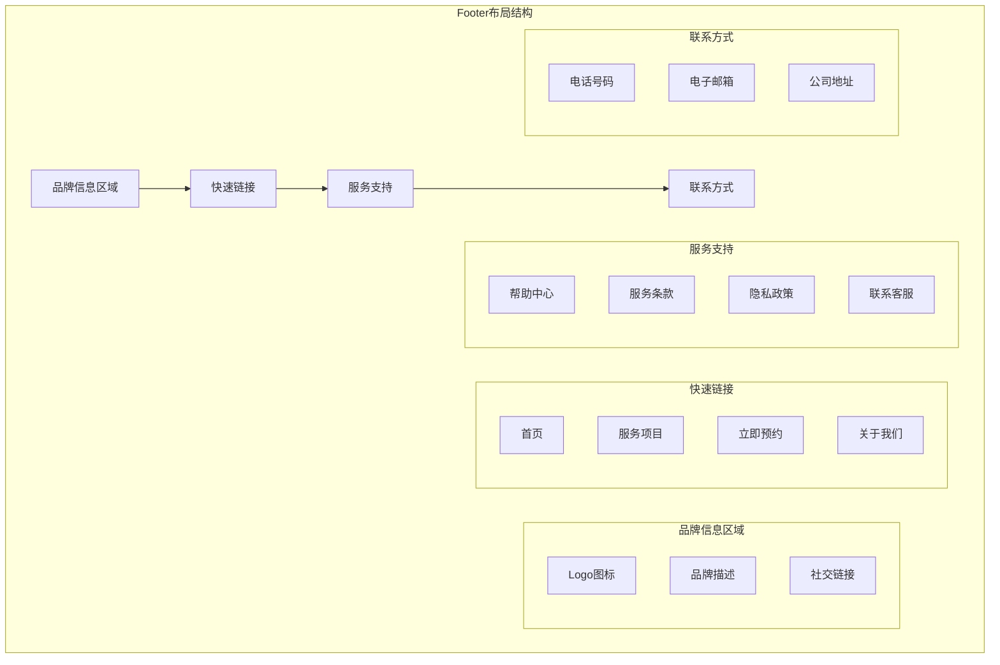
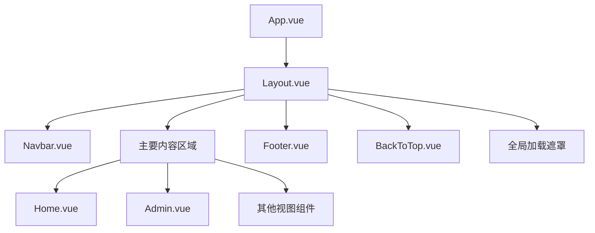
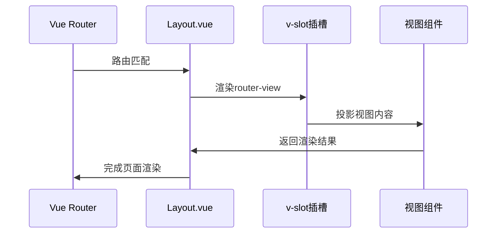
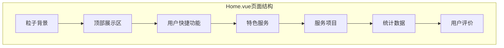

# 前端布局结构

<cite>
**本文档引用的文件**
- [Layout.vue](file://frontend/src/components/Layout/Layout.vue)
- [Navbar.vue](file://frontend/src/components/Layout/Navbar.vue)
- [Footer.vue](file://frontend/src/components/Layout/Footer.vue)
- [Home.vue](file://frontend/src/views/Home.vue)
- [Admin.vue](file://frontend/src/views/Admin.vue)
- [App.vue](file://frontend/src/App.vue)
- [router/index.js](file://frontend/src/router/index.js)
- [global.css](file://frontend/src/assets/css/global.css)
</cite>

## 目录
1. [概述](#概述)
2. [整体架构设计](#整体架构设计)
3. [Layout.vue根布局容器](#layoutvue根布局容器)
4. [Navbar.vue顶部导航栏](#navbarvue顶部导航栏)
5. [Footer.vue页脚组件](#footervue页脚组件)
6. [组件嵌套关系与CSS隔离](#组件嵌套关系与css隔离)
7. [Vue Slot机制与内容投影](#vue-slot机制与内容投影)
8. [视图组件使用示例](#视图组件使用示例)
9. [移动端适配与响应式设计](#移动端适配与响应式设计)
10. [常见布局问题解决方案](#常见布局问题解决方案)
11. [最佳实践总结](#最佳实践总结)

## 概述

该前端项目采用模块化的布局架构设计，以Vue 3为基础框架，通过组件化的方式实现了统一的页面布局结构。整个布局系统围绕三个核心组件展开：Layout.vue作为根布局容器、Navbar.vue负责顶部导航、Footer.vue处理页脚内容，形成了完整的页面骨架结构。

## 整体架构设计

前端布局架构采用分层设计模式，从上至下依次为：

**图表来源**
- [App.vue](file://frontend/src/App.vue#L1-L381)
- [Layout.vue](file://frontend/src/components/Layout/Layout.vue#L1-L151)
- [router/index.js](file://frontend/src/router/index.js#L1-L361)

**章节来源**
- [App.vue](file://frontend/src/App.vue#L1-L381)
- [Layout.vue](file://frontend/src/components/Layout/Layout.vue#L1-L151)
- [router/index.js](file://frontend/src/router/index.js#L1-L361)

## Layout.vue根布局容器

Layout.vue是整个应用的根布局容器，负责协调导航栏、主要内容区域、页脚和全局功能组件的布局。

### 核心结构设计

Layout.vue采用了经典的三段式布局结构：

**图表来源**
- [Layout.vue](file://frontend/src/components/Layout/Layout.vue#L2-L20)

### 主要功能特性

1. **路由视图集成**：通过`<router-view>`实现动态内容渲染
2. **页面切换动画**：使用Vue Transition组件实现平滑的页面过渡效果
3. **全局加载状态管理**：监听窗口事件实现全局加载遮罩控制
4. **响应式布局**：自适应不同屏幕尺寸的内容区域高度计算

### CSS布局策略

Layout.vue采用Flexbox布局模型，确保内容区域能够根据导航栏和页脚的高度自动调整：

- **主容器**：`display: flex; flex-direction: column; min-height: 100vh;`
- **主要内容**：`flex: 1; min-height: calc(100vh - 导航栏高度 - 页脚高度)`
- **背景色**：使用CSS变量`var(--bg-secondary)`实现主题适配

**章节来源**
- [Layout.vue](file://frontend/src/components/Layout/Layout.vue#L78-L151)

## Navbar.vue顶部导航栏

Navbar.vue是应用的核心导航组件，提供了完整的导航功能和用户交互界面。

### 导航菜单结构

Navbar.vue包含了完整的导航菜单系统：

**图表来源**
- [Navbar.vue](file://frontend/src/components/Layout/Navbar.vue#L15-L42)

### 响应式行为设计

Navbar.vue实现了完善的移动端适配：

1. **移动端菜单折叠**：当屏幕宽度小于768px时，导航菜单自动折叠为汉堡菜单
2. **动态菜单显示**：通过`mobileMenuOpen`状态控制菜单的显示/隐藏
3. **渐进式增强**：桌面端保持完整导航，移动端采用抽屉式菜单

### 认证状态管理

Navbar.vue集成了完整的用户认证状态管理：

- **认证状态监听**：通过`auth-state-changed`事件监听认证状态变化
- **本地存储同步**：监听`storage`事件同步本地存储中的认证信息
- **可见性感知**：通过`visibilitychange`事件在页面重新可见时更新状态

### 用户交互功能

1. **用户菜单**：支持头像、用户名显示和下拉菜单操作
2. **主题切换**：集成主题切换功能
3. **退出登录**：提供安全的登出机制

**章节来源**
- [Navbar.vue](file://frontend/src/components/Layout/Navbar.vue#L110-L517)

## Footer.vue页脚组件

Footer.vue负责页面底部的信息展示和辅助功能链接。

### 布局结构设计

Footer.vue采用网格布局实现多列信息展示：

**图表来源**
- [Footer.vue](file://frontend/src/components/Layout/Footer.vue#L2-L69)

### 响应式设计策略

Footer.vue实现了自适应的响应式布局：

1. **桌面端布局**：使用CSS Grid实现四列布局
2. **移动端布局**：转换为单列垂直布局
3. **极简移动端**：进一步简化为紧凑的布局形式

### 信息组织原则

Footer.vue遵循信息层级原则：
- **重要信息优先**：品牌信息和联系方式放在显眼位置
- **功能导向**：快速链接和服务支持按用户需求排序
- **视觉平衡**：各区域保持适当的间距和对齐

**章节来源**
- [Footer.vue](file://frontend/src/components/Layout/Footer.vue#L1-L280)

## 组件嵌套关系与CSS隔离

### 层级关系架构

三个核心布局组件形成了清晰的嵌套层次：

**图表来源**
- [App.vue](file://frontend/src/App.vue#L2-L4)
- [Layout.vue](file://frontend/src/components/Layout/Layout.vue#L2-L16)

### CSS样式隔离策略

1. **Scoped Styles**：所有布局组件都使用scoped样式，防止样式污染
2. **CSS变量系统**：通过CSS自定义属性实现主题一致性
3. **命名空间**：使用`.app-layout`、`.navbar`等明确的类名前缀
4. **组件边界**：每个组件都有独立的样式作用域

### 样式继承与覆盖

- **全局样式重置**：在App.vue中导入全局样式重置
- **组件特定样式**：各组件维护自己的样式规则
- **主题变量**：通过CSS变量实现样式的统一管理

**章节来源**
- [App.vue](file://frontend/src/App.vue#L78-L381)
- [Layout.vue](file://frontend/src/components/Layout/Layout.vue#L78-L151)
- [Navbar.vue](file://frontend/src/components/Layout/Navbar.vue#L260-L517)
- [Footer.vue](file://frontend/src/components/Layout/Footer.vue#L93-L280)

## Vue Slot机制与内容投影

### Slot机制的应用

Layout.vue展示了Vue 3中高级slot用法的典型应用：

**图表来源**
- [Layout.vue](file://frontend/src/components/Layout/Layout.vue#L8-L12)

### 内容投影机制

1. **默认插槽**：用于放置路由匹配的视图组件
2. **具名插槽**：支持更复杂的内容组织
3. **作用域插槽**：传递路由信息给子组件

### 页面级结构复用

通过slot机制实现了以下复用模式：

- **统一布局模板**：所有页面共享相同的导航和页脚
- **内容动态替换**：主要内容区域根据路由动态变化
- **组件生命周期管理**：保持布局组件的稳定，只替换内容部分

**章节来源**
- [Layout.vue](file://frontend/src/components/Layout/Layout.vue#L8-L12)

## 视图组件使用示例

### Home.vue页面布局

Home.vue展示了如何在Layout框架内构建复杂的页面内容：

**图表来源**
- [Home.vue](file://frontend/src/views/Home.vue#L1-L800)

### Admin.vue管理后台

Admin.vue展示了另一种布局模式，适用于管理后台场景：

- **顶部导航**：包含系统名称和用户信息
- **侧边栏菜单**：提供功能导航
- **内容区域**：展示具体的管理功能

### 布局适配策略

不同视图组件采用不同的布局策略：

1. **信息展示型**：如Home.vue，注重内容的层次展示
2. **功能操作型**：如Admin.vue，强调功能的可访问性
3. **混合型**：根据具体需求灵活组合布局元素

**章节来源**
- [Home.vue](file://frontend/src/views/Home.vue#L1-L800)
- [Admin.vue](file://frontend/src/views/Admin.vue#L1-L800)

## 移动端适配与响应式设计

### 断点策略

项目采用移动优先的响应式设计策略：

| 断点 | 屏幕宽度 | 适配目标 | 主要变化 |
|------|----------|----------|----------|
| 默认 | ≥768px | 桌面端体验 | 完整导航菜单、多列布局 |
| 移动端 | <768px | 移动端体验 | 菜单折叠、单列布局 |
| 极简移动端 | <480px | 最小屏幕 | 进一步简化布局 |

### 响应式实现技术

1. **媒体查询**：使用CSS媒体查询实现断点控制
2. **Flexbox布局**：利用Flexbox的弹性特性实现自适应
3. **CSS Grid**：在桌面端使用Grid布局实现复杂布局
4. **JavaScript检测**：在必要时使用JavaScript进行精确控制

### 移动端特殊处理

- **触摸友好**：增大点击区域，优化触摸体验
- **滚动优化**：处理移动端滚动冲突问题
- **性能考虑**：减少移动端的动画和特效

**章节来源**
- [Navbar.vue](file://frontend/src/components/Layout/Navbar.vue#L447-L517)
- [Footer.vue](file://frontend/src/components/Layout/Footer.vue#L248-L279)
- [global.css](file://frontend/src/assets/css/global.css#L191-L235)

## 常见布局问题解决方案

### 高度塌陷问题

**问题描述**：当内容区域没有固定高度时，可能导致布局错乱

**解决方案**：
1. **Flexbox填充**：使用`flex: 1`让内容区域自动填充剩余空间
2. **最小高度**：设置`min-height: 100vh`确保基本高度
3. **CSS变量**：通过计算属性动态计算内容区域高度

### z-index层级冲突

**问题描述**：弹窗、菜单等组件可能被其他元素遮挡

**解决方案**：
1. **合理层级**：导航栏使用`z-index: 1000`，弹窗使用更高层级
2. **定位策略**：使用相对定位和绝对定位配合
3. **CSS变量**：通过CSS变量统一管理层级值

### 全局加载遮罩问题

**问题描述**：加载状态不一致导致用户体验问题

**解决方案**：
1. **事件驱动**：使用`loading-start`和`loading-end`事件
2. **状态同步**：通过window事件确保全局状态一致
3. **防抖处理**：避免频繁的状态切换

### 移动端滚动冲突

**问题描述**：移动端滚动时可能出现意外的页面滚动

**解决方案**：
1. **touch-action**：使用CSS属性控制触摸行为
2. **preventDefault**：在必要时阻止默认滚动行为
3. **滚动容器**：将可滚动内容限制在特定容器内

**章节来源**
- [Layout.vue](file://frontend/src/components/Layout/Layout.vue#L86-L105)
- [Navbar.vue](file://frontend/src/components/Layout/Navbar.vue#L447-L517)
- [App.vue](file://frontend/src/App.vue#L105-L107)

## 最佳实践总结

### 布局设计原则

1. **模块化设计**：每个布局组件职责单一，便于维护
2. **响应式优先**：采用移动优先的设计理念
3. **性能优化**：合理使用CSS和JavaScript，避免过度渲染
4. **用户体验**：注重交互细节和加载状态的处理

### 代码组织规范

1. **组件拆分**：将复杂布局拆分为多个小组件
2. **样式隔离**：使用scoped样式和CSS变量
3. **事件管理**：统一的事件监听和清理机制
4. **状态管理**：合理的状态提升和组件通信

### 性能优化策略

1. **懒加载**：使用Vue Router的懒加载功能
2. **代码分割**：通过动态导入减少初始包大小
3. **内存管理**：及时清理事件监听器和定时器
4. **渲染优化**：避免不必要的重新渲染

### 可维护性考虑

1. **文档注释**：为关键功能添加详细注释
2. **类型安全**：使用TypeScript或JSDoc提高代码质量
3. **测试覆盖**：为关键组件编写单元测试
4. **错误处理**：完善的错误捕获和用户反馈机制

这套布局架构设计体现了现代前端开发的最佳实践，通过组件化、模块化的方式实现了高度可维护和可扩展的页面结构。无论是日常功能页面还是管理后台，都能通过统一的布局框架提供一致的用户体验。