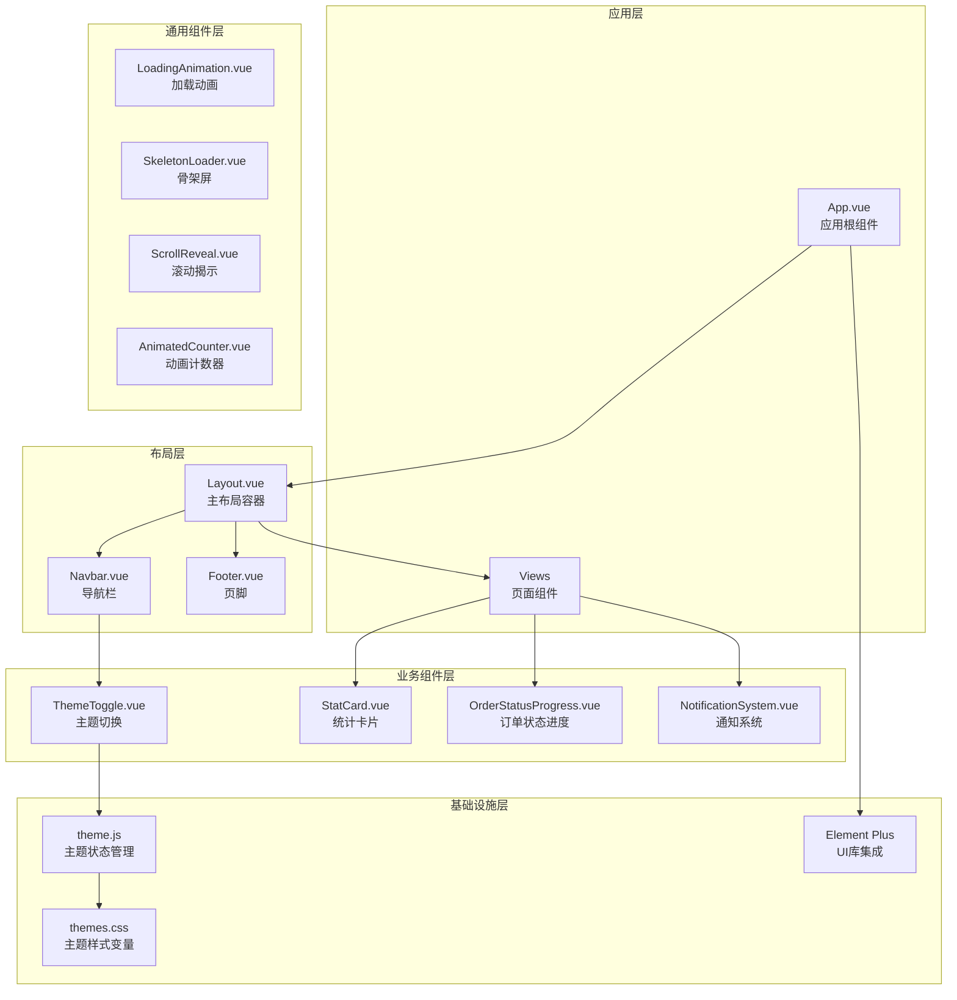
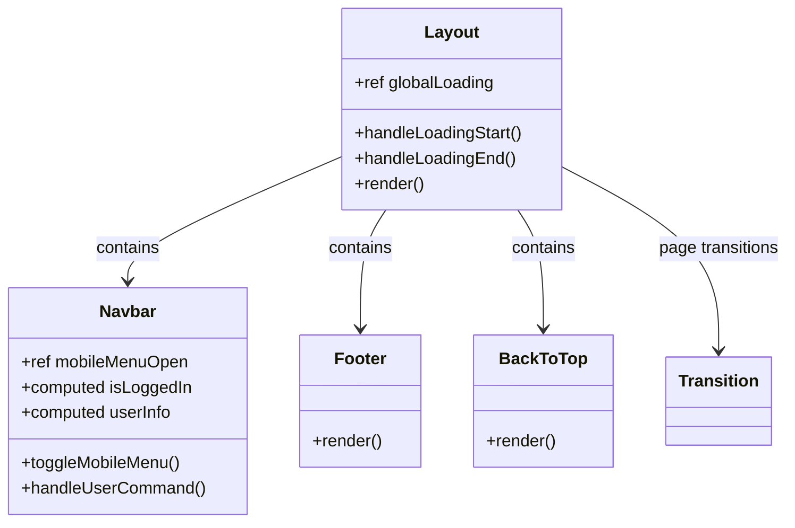
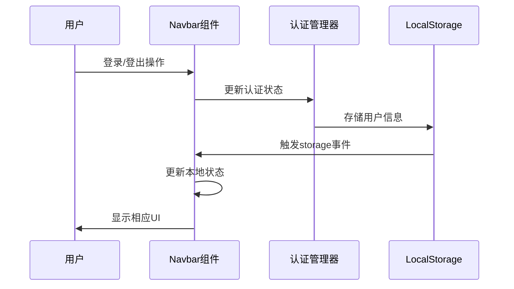
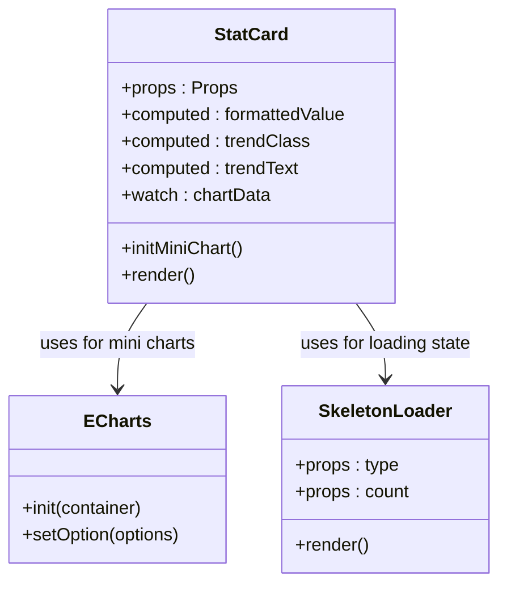
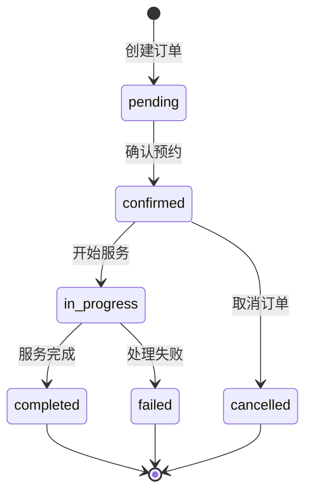
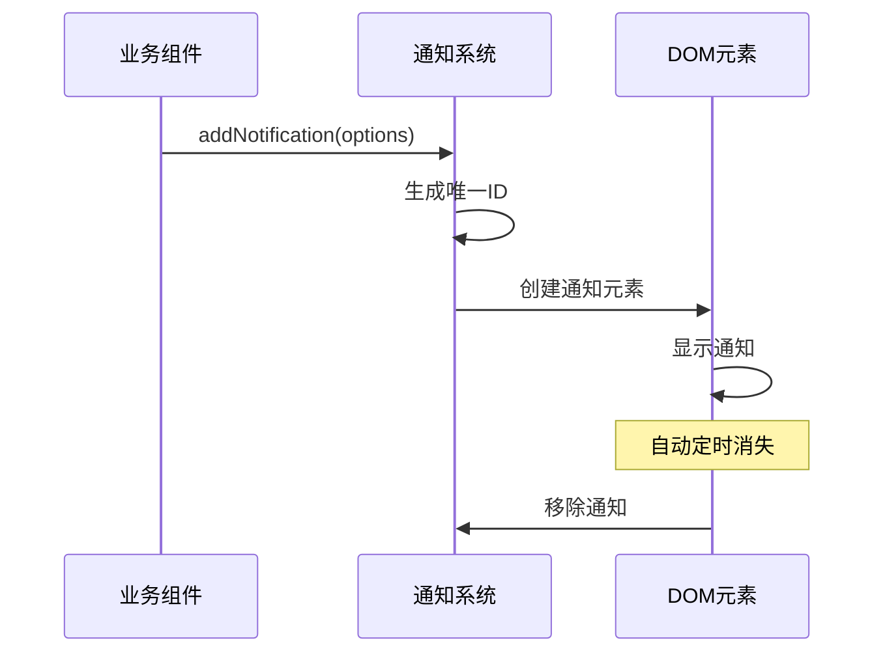
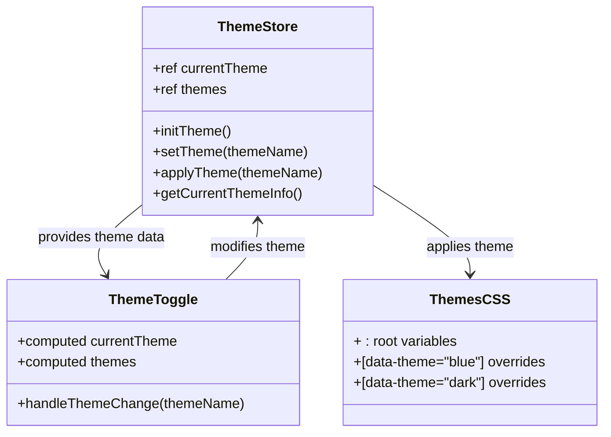
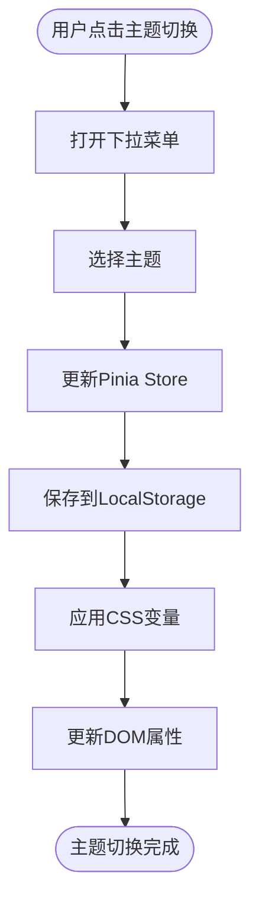
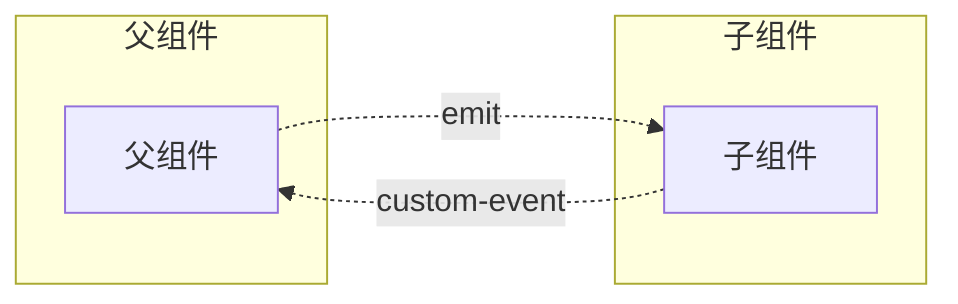
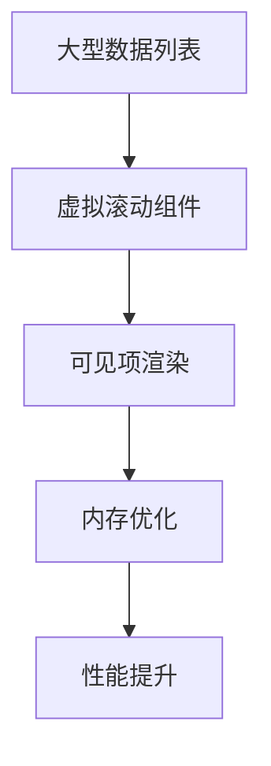

# 前端组件架构设计文档

<cite>
**本文档引用的文件**
- [App.vue](file://frontend/src/App.vue)
- [main.js](file://frontend/src/main.js)
- [Layout.vue](file://frontend/src/components/Layout/Layout.vue)
- [Navbar.vue](file://frontend/src/components/Layout/Navbar.vue)
- [Footer.vue](file://frontend/src/components/Layout/Footer.vue)
- [StatCard.vue](file://frontend/src/components/StatCard.vue)
- [OrderStatusProgress.vue](file://frontend/src/components/OrderStatusProgress.vue)
- [NotificationSystem.vue](file://frontend/src/components/NotificationSystem.vue)
- [ThemeToggle.vue](file://frontend/src/components/ThemeToggle.vue)
- [theme.js](file://frontend/src/stores/theme.js)
- [themes.css](file://frontend/src/assets/css/themes.css)
- [Dashboard.vue](file://frontend/src/views/Dashboard.vue)
- [ScrollReveal.vue](file://frontend/src/components/ScrollReveal.vue)
- [SkeletonLoader.vue](file://frontend/src/components/SkeletonLoader.vue)
- [AnimatedCounter.vue](file://frontend/src/components/AnimatedCounter.vue)
- [LoadingAnimation.vue](file://frontend/src/components/LoadingAnimation.vue)
</cite>

## 目录
1. [项目概述](#项目概述)
2. [整体架构设计](#整体架构设计)
3. [布局组件系统](#布局组件系统)
4. [原子化组件设计](#原子化组件设计)
5. [UI组件库集成](#ui组件库集成)
6. [主题系统架构](#主题系统架构)
7. [组件间通信机制](#组件间通信机制)
8. [插槽使用规范](#插槽使用规范)
9. [性能优化策略](#性能优化策略)
10. [最佳实践与解决方案](#最佳实践与解决方案)

## 项目概述

本项目采用现代化的前端技术栈，基于Vue 3构建了一个完整的汽车洗车服务预约系统。整个前端架构遵循组件化设计理念，通过清晰的层次结构和模块化组织，实现了高度可复用性和可维护性。

### 技术栈特点
- **Vue 3 Composition API**: 提供更灵活的状态管理和组件逻辑组织
- **Element Plus**: 完整的UI组件库，提供丰富的交互组件
- **Pinia**: 现代化的状态管理方案
- **CSS Variables**: 支持动态主题切换和样式定制
- **TypeScript**: 提供类型安全和更好的开发体验

## 整体架构设计

### 架构层次结构



**架构图来源**
- [App.vue](file://frontend/src/App.vue#L1-L381)
- [Layout.vue](file://frontend/src/components/Layout/Layout.vue#L1-L151)
- [Navbar.vue](file://frontend/src/components/Layout/Navbar.vue#L1-L517)

### 模块化组织原则

1. **按功能分组**: 相关功能的组件放在同一目录下
2. **单一职责**: 每个组件只负责一个特定的功能领域
3. **可复用性**: 通用组件设计为可在多个场景中使用
4. **依赖注入**: 通过Props和Events实现组件间的松耦合

**章节来源**
- [main.js](file://frontend/src/main.js#L1-L26)
- [App.vue](file://frontend/src/App.vue#L15-L30)

## 布局组件系统

### Layout组件架构

Layout组件作为应用的主要容器，采用经典的三栏布局结构，提供了统一的页面框架。



**类图来源**
- [Layout.vue](file://frontend/src/components/Layout/Layout.vue#L34-L74)
- [Navbar.vue](file://frontend/src/components/Layout/Navbar.vue#L111-L256)

### Navbar导航栏设计

Navbar组件实现了响应式导航，支持移动端和桌面端的不同交互模式。

#### 核心特性
- **响应式设计**: 自动适应不同屏幕尺寸
- **移动端菜单**: 点击按钮展开/收起导航菜单
- **用户状态管理**: 显示登录状态和用户信息
- **主题切换**: 集成主题切换功能

#### 状态管理模式



**序列图来源**
- [Navbar.vue](file://frontend/src/components/Layout/Navbar.vue#L158-L218)

### Footer页脚组件

Footer组件采用网格布局，提供完整的网站信息展示。

#### 布局结构
- **品牌信息区**: 包含Logo和简短描述
- **快速链接**: 导航到重要页面
- **服务支持**: 法律条款和联系方式
- **联系信息**: 实际的联系方式

**章节来源**
- [Layout.vue](file://frontend/src/components/Layout/Layout.vue#L1-L151)
- [Navbar.vue](file://frontend/src/components/Layout/Navbar.vue#L1-L517)
- [Footer.vue](file://frontend/src/components/Layout/Footer.vue#L1-L280)

## 原子化组件设计

### StatCard统计卡片组件

StatCard是一个高度可配置的统计展示组件，支持多种数据格式和视觉效果。

#### Props接口设计

| 属性名 | 类型 | 默认值 | 描述 |
|--------|------|--------|------|
| icon | String | 必需 | 图标名称 |
| label | String | 必需 | 标签文本 |
| value | String/Number | 必需 | 显示数值 |
| trend | Number | 0 | 趋势百分比 |
| iconColor | String | "--primary-gradient" | 图标背景色 |
| isLoading | Boolean | false | 加载状态 |
| showTrend | Boolean | true | 是否显示趋势 |
| chartData | Array | null | 迷你图表数据 |
| valueType | String | "number" | 数值类型 |

#### 设计模式



**类图来源**
- [StatCard.vue](file://frontend/src/components/StatCard.vue#L32-L188)

#### 功能特性
- **动态数值格式化**: 支持货币、百分比、数字格式
- **趋势指示器**: 显示上升/下降趋势
- **迷你图表**: 内嵌ECharts图表
- **加载状态**: 骨架屏加载效果

### OrderStatusProgress订单状态进度组件

该组件专门用于展示订单处理的完整流程和状态变化。

#### 状态流转图



**状态图来源**
- [OrderStatusProgress.vue](file://frontend/src/components/OrderStatusProgress.vue#L202-L239)

#### 核心功能
- **实时状态更新**: 通过WebSocket接收状态变更
- **自动刷新机制**: 定期检查订单状态
- **进度条展示**: 分步显示处理进度
- **错误处理**: 网络异常时的降级处理

### NotificationSystem通知系统

NotificationSystem提供了全局的通知管理机制，支持多种通知类型和自定义行为。

#### 通知类型映射

| 类型 | 图标 | 颜色 |
|------|------|------|
| success | CircleCheck | --success-color |
| error | CircleClose | --error-color |
| warning | Warning | --warning-color |
| info | InfoFilled | --info-color |

#### 通信机制



**序列图来源**
- [NotificationSystem.vue](file://frontend/src/components/NotificationSystem.vue#L68-L97)

**章节来源**
- [StatCard.vue](file://frontend/src/components/StatCard.vue#L1-L342)
- [OrderStatusProgress.vue](file://frontend/src/components/OrderStatusProgress.vue#L1-L609)
- [NotificationSystem.vue](file://frontend/src/components/NotificationSystem.vue#L1-L331)

## UI组件库集成

### Element Plus集成方案

项目深度集成了Element Plus组件库，通过以下方式实现定制化：

#### 全局配置

```javascript
// main.js中的Element Plus配置
app.use(ElementPlus, {
  locale: zhCn,
})
```

#### 主题变量覆盖

通过CSS自定义属性覆盖Element Plus的默认主题变量：

```css
:root {
  --el-color-primary: var(--primary-color);
  --el-color-success: var(--success-color);
  --el-color-warning: var(--warning-color);
  --el-color-danger: var(--error-color);
  --el-text-color-primary: var(--text-primary);
  --el-bg-color: var(--bg-primary);
}
```

#### 组件样式定制

每个Element Plus组件都进行了精细化的样式定制，包括：
- 按钮圆角和过渡效果
- 卡片阴影和边框
- 输入框聚焦状态
- 表格和分页样式

**章节来源**
- [main.js](file://frontend/src/main.js#L20-L24)
- [App.vue](file://frontend/src/App.vue#L145-L250)

## 主题系统架构

### 动态主题切换机制

主题系统采用了多层次的设计，从CSS变量到状态管理的完整链路。

#### 主题数据结构



**类图来源**
- [theme.js](file://frontend/src/stores/theme.js#L4-L55)
- [ThemeToggle.vue](file://frontend/src/components/ThemeToggle.vue#L38-L57)

### 主题切换流程



**流程图来源**
- [ThemeToggle.vue](file://frontend/src/components/ThemeToggle.vue#L49-L51)
- [theme.js](file://frontend/src/stores/theme.js#L30-L41)

### 主题变量系统

#### 默认主题变量

| 变量类别 | 变量名 | 默认值 |
|----------|--------|--------|
| 主色调 | --primary-color | #10B981 |
| 辅助色 | --success-color | #10B981 |
| 警告色 | --warning-color | #F59E0B |
| 错误色 | --error-color | #EF4444 |
| 文字色 | --text-primary | #374151 |
| 背景色 | --bg-primary | #FFFFFF |
| 边框色 | --border-color | #E5E7EB |

#### 主题继承机制

每个主题都继承基础变量，并通过CSS自定义属性实现动态切换：

```css
[data-theme="blue"] {
  --primary-color: #3B82F6;
  --primary-dark: #2563EB;
  --primary-light: #DBEAFE;
  --primary-gradient: linear-gradient(135deg, #3B82F6 0%, #2563EB 100%);
}
```

**章节来源**
- [theme.js](file://frontend/src/stores/theme.js#L1-L56)
- [ThemeToggle.vue](file://frontend/src/components/ThemeToggle.vue#L1-L142)
- [themes.css](file://frontend/src/assets/css/themes.css#L1-L200)

## 组件间通信机制

### Props传递模式

所有原子化组件都采用Props作为主要的数据输入方式：

```typescript
// StatCard Props示例
interface StatCardProps {
  icon: string;
  label: string;
  value: string | number;
  trend?: number;
  iconColor?: string;
  isLoading?: boolean;
  showTrend?: boolean;
  chartData?: number[];
  valueType?: 'number' | 'currency' | 'percentage';
}
```

### Events事件系统

组件通过自定义事件与父组件通信：



### 插槽（Slots）使用

组件广泛使用插槽来增强灵活性：

#### 默认插槽
```vue
<!-- StatCard中的文本内容 -->
<span class="btn-text" v-if="$slots.default">
  <slot />
</span>
```

#### 具名插槽
```vue
<!-- OrderStatusProgress中的状态详情 -->
<div v-if="showDetails" class="status-details">
  <slot name="details" :order="order" />
</div>
```

**章节来源**
- [StatCard.vue](file://frontend/src/components/StatCard.vue#L71-L73)
- [OrderStatusProgress.vue](file://frontend/src/components/OrderStatusProgress.vue#L98-L111)

## 插槽使用规范

### 插槽分类

1. **默认插槽**: 用于简单的文本或内容替换
2. **具名插槽**: 用于复杂的内容结构
3. **作用域插槽**: 传递数据给插槽内容

### 使用示例

#### 默认插槽
```vue
<template>
  <StatCard icon="Calendar" label="今日预约" :value="count">
    {{ slotContent }}
  </StatCard>
</template>
```

#### 具名插槽
```vue
<template>
  <OrderStatusProgress :order="order">
    <template #details="{ order }">
      <div class="custom-details">
        <!-- 自定义详情内容 -->
      </div>
    </template>
  </OrderStatusProgress>
</template>
```

### 最佳实践

1. **语义化命名**: 使用有意义的插槽名称
2. **类型安全**: 为作用域插槽提供类型定义
3. **默认内容**: 为插槽提供合理的默认内容
4. **文档化**: 在组件文档中说明插槽用途

## 性能优化策略

### 懒加载机制

#### 组件懒加载
```javascript
// 路由级别的懒加载
const routes = [
  {
    path: '/dashboard',
    component: () => import('@/views/Dashboard.vue')
  }
]
```

#### 图表组件懒加载
```javascript
// StatCard中的ECharts懒加载
onMounted(() => {
  if (props.chartData) {
    nextTick(() => {
      initMiniChart();
    });
  }
})
```

### 虚拟滚动应用

虽然当前项目中没有直接使用虚拟滚动，但可以应用于大数据量列表：



### 性能监控指标

| 指标类型 | 监控方法 | 优化目标 |
|----------|----------|----------|
| 首次内容绘制 | FCP | < 1.5s |
| 最大内容绘制 | LCP | < 2.5s |
| 首次输入延迟 | FID | < 100ms |
| 累积布局偏移 | CLS | < 0.1 |

### 内存管理

#### 组件生命周期优化
- **及时清理**: 在组件卸载时清理定时器和事件监听器
- **弱引用**: 对于临时对象使用弱引用
- **垃圾回收**: 合理触发垃圾回收机制

#### 状态管理优化
- **状态分割**: 将大对象拆分为小的独立状态
- **计算属性**: 使用computed缓存计算结果
- **响应式优化**: 避免不必要的响应式转换

**章节来源**
- [Layout.vue](file://frontend/src/components/Layout/Layout.vue#L48-L74)
- [StatCard.vue](file://frontend/src/components/StatCard.vue#L106-L181)

## 最佳实践与解决方案

### 常见问题及解决方案

#### 组件状态管理混乱

**问题**: 多个组件共享状态时出现不一致

**解决方案**: 
1. 使用Pinia进行集中状态管理
2. 遵循单一数据源原则
3. 使用严格模式确保状态变更可追踪

#### 样式冲突问题

**问题**: 不同组件间样式相互影响

**解决方案**:
1. 使用CSS Modules或Scoped CSS
2. 采用BEM命名规范
3. 通过CSS变量实现主题隔离

#### 性能瓶颈识别

**问题**: 大量组件渲染导致性能下降

**解决方案**:
1. 使用`v-show`替代`v-if`进行频繁切换
2. 实现组件缓存机制
3. 优化重绘和回流

### 代码质量保证

#### 类型安全
```typescript
// 推荐的Props定义方式
interface ComponentProps {
  title: string;
  count: number;
  disabled?: boolean;
  onClick?: (event: MouseEvent) => void;
}
```

#### 错误边界
```javascript
// 全局错误处理
onMounted(() => {
  window.addEventListener('unhandledrejection', (event) => {
    console.error('未处理的Promise拒绝:', event.reason);
  });
  
  window.addEventListener('error', (event) => {
    console.error('全局错误:', event.error);
  });
});
```

#### 测试策略
1. **单元测试**: 测试组件的核心逻辑
2. **集成测试**: 测试组件间的交互
3. **端到端测试**: 测试完整的用户流程

### 维护性提升

#### 文档化
- **组件API文档**: 详细的Props和Events说明
- **使用示例**: 常见使用场景的代码示例
- **最佳实践**: 开发指导和注意事项

#### 版本控制
- **语义化版本**: 遵循SemVer规范
- **变更日志**: 记录重大变更和破坏性修改
- **向后兼容**: 保持API的向后兼容性

**章节来源**
- [App.vue](file://frontend/src/App.vue#L38-L70)
- [StatCard.vue](file://frontend/src/components/StatCard.vue#L32-L76)

## 总结

本前端组件架构设计体现了现代Web开发的最佳实践，通过以下核心要素实现了高质量的前端应用：

### 架构优势
1. **模块化设计**: 清晰的组件分层和职责分离
2. **主题系统**: 完善的动态主题切换机制
3. **性能优化**: 多层次的性能优化策略
4. **可维护性**: 良好的代码组织和文档化

### 技术特色
- **Composition API**: 利用Vue 3的新特性提升开发体验
- **TypeScript**: 提供类型安全和更好的开发工具支持
- **状态管理**: Pinia提供的现代化状态管理方案
- **UI库集成**: Element Plus的深度定制和优化

### 发展方向
1. **微前端架构**: 考虑未来可能的微前端改造
2. **PWA支持**: 增强离线能力和原生应用体验
3. **国际化**: 支持多语言和本地化需求
4. **无障碍访问**: 提升应用的可访问性

这套组件架构不仅满足了当前项目的需求，也为未来的功能扩展和技术演进奠定了坚实的基础。