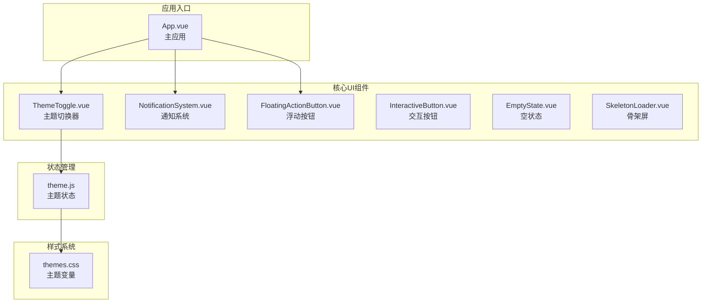
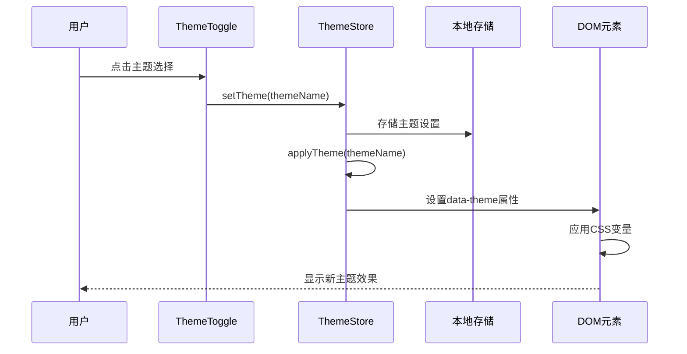
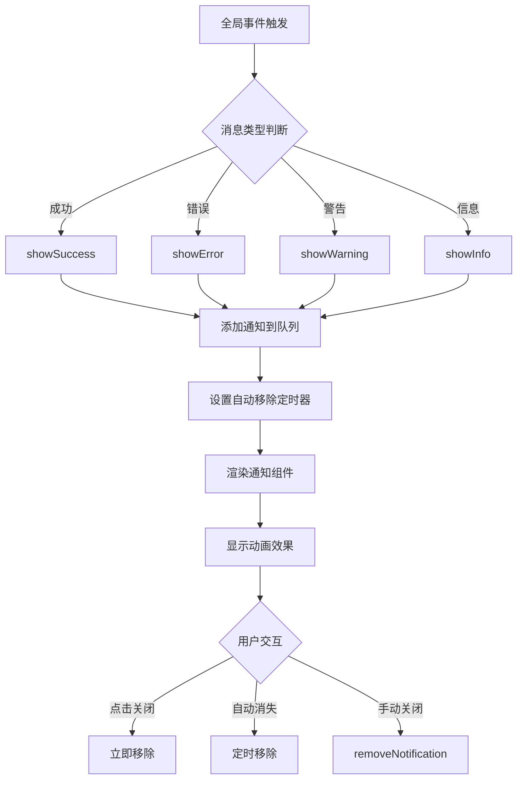
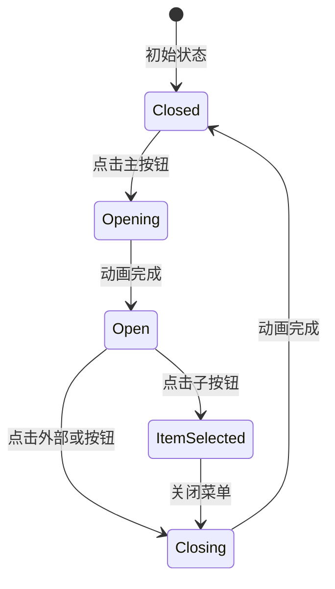
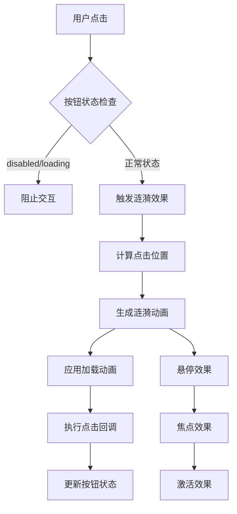
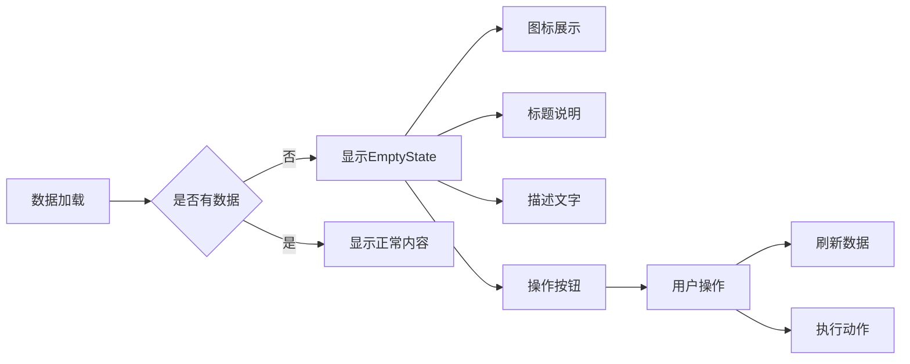
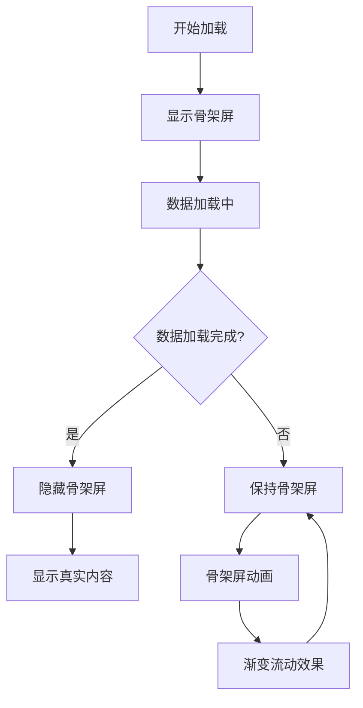
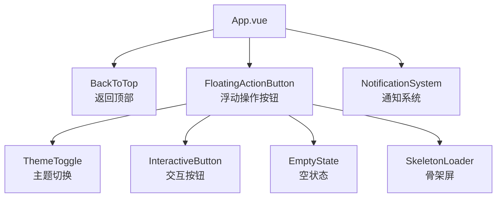

# 核心UI组件

<cite>
**本文档中引用的文件**
- [ThemeToggle.vue](file://frontend/src/components/ThemeToggle.vue)
- [NotificationSystem.vue](file://frontend/src/components/NotificationSystem.vue)
- [FloatingActionButton.vue](file://frontend/src/components/FloatingActionButton.vue)
- [InteractiveButton.vue](file://frontend/src/components/InteractiveButton.vue)
- [EmptyState.vue](file://frontend/src/components/EmptyState.vue)
- [SkeletonLoader.vue](file://frontend/src/components/SkeletonLoader.vue)
- [theme.js](file://frontend/src/stores/theme.js)
- [themes.css](file://frontend/src/assets/css/themes.css)
- [App.vue](file://frontend/src/App.vue)
</cite>

## 目录
1. [简介](#简介)
2. [项目结构](#项目结构)
3. [核心组件概览](#核心组件概览)
4. [ThemeToggle - 动态主题切换组件](#themetoggle---动态主题切换组件)
5. [NotificationSystem - 全局消息通知系统](#notificationsystem---全局消息通知系统)
6. [FloatingActionButton - 浮动操作按钮](#floatingactionbutton---浮动操作按钮)
7. [InteractiveButton - 交互式按钮](#interactivebutton---交互式按钮)
8. [EmptyState - 空状态占位组件](#emptystate---空状态占位组件)
9. [SkeletonLoader - 骨架屏加载器](#skeletonloader---骨架屏加载器)
10. [组件集成与使用](#组件集成与使用)
11. [总结](#总结)

## 简介

本文档深入介绍了汽车洗车服务预约系统前端的核心功能性UI组件。这些组件构成了系统的视觉交互基础，提供了丰富的用户体验和一致的设计语言。主要包含六个核心组件：动态主题切换器、全局消息通知系统、浮动操作按钮、交互式按钮、空状态占位符和骨架屏加载器。

## 项目结构

系统采用模块化的组件架构，所有核心UI组件都位于`frontend/src/components/`目录下：



**图表来源**
- [ThemeToggle.vue](file://frontend/src/components/ThemeToggle.vue#L1-L142)
- [NotificationSystem.vue](file://frontend/src/components/NotificationSystem.vue#L1-L331)
- [theme.js](file://frontend/src/stores/theme.js#L1-L56)
- [themes.css](file://frontend/src/assets/css/themes.css#L1-L200)

## 核心组件概览

六个核心UI组件各自承担不同的功能职责，共同构建了完整的用户界面生态系统：

| 组件名称 | 主要功能 | 技术特点 | 使用场景 |
|---------|---------|---------|---------|
| ThemeToggle | 动态主题切换 | CSS变量注入、本地存储、Pinia状态同步 | 用户个性化设置 |
| NotificationSystem | 全局消息通知 | 事件总线、多种消息类型、可配置时长 | 系统状态反馈 |
| FloatingActionButton | 浮动操作菜单 | CSS动画、Vue过渡效果、响应式设计 | 快速功能访问 |
| InteractiveButton | 交互式按钮 | 涟漪效果、加载动画、悬停反馈 | 用户操作确认 |
| EmptyState | 空状态展示 | 占位内容、引导操作、响应式布局 | 数据为空时的用户体验 |
| SkeletonLoader | 骨架屏加载 | 渐进式加载、多种布局模式、深色适配 | 异步数据加载场景 |

## ThemeToggle - 动态主题切换组件

### 技术架构

ThemeToggle组件实现了完整的动态主题切换系统，通过CSS变量注入、本地存储持久化和Pinia状态同步机制，为用户提供个性化的视觉体验。



**图表来源**
- [ThemeToggle.vue](file://frontend/src/components/ThemeToggle.vue#L49-L51)
- [theme.js](file://frontend/src/stores/theme.js#L30-L36)

### 核心特性

#### CSS变量注入机制
组件通过Pinia状态管理实现CSS变量的动态注入：

- **主题变量定义**：在`themes.css`中定义了完整的颜色变量体系
- **运行时切换**：通过`document.documentElement.setAttribute("data-theme", themeName)`实现主题切换
- **渐进式过渡**：利用CSS过渡动画实现平滑的主题切换效果

#### 本地存储持久化
- **自动保存**：用户选择的主题会自动保存到localStorage
- **恢复机制**：应用启动时从localStorage恢复用户偏好设置
- **兼容性检查**：确保存储的主题值存在于可用主题列表中

#### Pinia状态同步
- **响应式状态**：使用computed计算属性实现响应式主题状态
- **集中管理**：通过useThemeStore统一管理主题相关逻辑
- **全局访问**：主题信息可在整个应用中全局访问

### Props接口定义

| 属性名 | 类型 | 默认值 | 描述 |
|-------|------|--------|------|
| currentTheme | Computed | - | 当前激活的主题名称 |
| themes | Computed | - | 可用主题列表数组 |

### 事件回调机制

- **handleThemeChange**：主题变更事件处理器，触发Pinia状态更新
- **全局监听**：组件自动监听主题状态变化并更新UI

**章节来源**
- [ThemeToggle.vue](file://frontend/src/components/ThemeToggle.vue#L38-L58)
- [theme.js](file://frontend/src/stores/theme.js#L20-L36)

## NotificationSystem - 全局消息通知系统

### 架构设计

NotificationSystem基于事件总线模式构建，提供了完整的全局消息通知解决方案，支持多种消息类型和可配置的显示时长。



**图表来源**
- [NotificationSystem.vue](file://frontend/src/components/NotificationSystem.vue#L110-L124)
- [NotificationSystem.vue](file://frontend/src/components/NotificationSystem.vue#L68-L89)

### 消息类型系统

#### 支持的消息类型
- **success**：成功消息，绿色边框和对勾图标
- **error**：错误消息，红色边框和叉号图标  
- **warning**：警告消息，橙色边框和感叹号图标
- **info**：普通信息，蓝色边框和信息图标

#### 可配置参数
- **duration**：显示时长（毫秒），默认4000ms
- **closable**：是否可关闭，默认true
- **onClick**：点击回调函数
- **title**：消息标题
- **message**：消息内容

### 事件总线机制

#### 全局方法注册
系统在window对象上注册了全局通知方法：
- `$notify.success()`：成功通知
- `$notify.error()`：错误通知  
- `$notify.warning()`：警告通知
- `$notify.info()`：信息通知
- `$notify.add()`：通用添加方法
- `$notify.remove()`：移除指定通知
- `$notify.clear()`：清空所有通知

#### 事件监听机制
- **DOM事件监听**：监听`show-notification`自定义事件
- **生命周期管理**：在组件挂载时注册事件监听，在卸载时清理监听器
- **全局对象管理**：确保全局方法的安全注册和删除

### 动画与过渡效果

#### Vue过渡系统
- **enter-active**：进入动画，300ms缓动
- **leave-active**：离开动画，300ms缓动
- **transform**：水平位移动画
- **opacity**：透明度变化

#### 进度条动画
- **线性动画**：模拟剩余时间进度
- **颜色同步**：根据消息类型自动匹配进度条颜色
- **自动消失**：动画完成后自动移除通知

**章节来源**
- [NotificationSystem.vue](file://frontend/src/components/NotificationSystem.vue#L49-L157)

## FloatingActionButton - 浮动操作按钮

### 交互设计

FloatingActionButton实现了Material Design风格的浮动操作按钮，提供了丰富的交互反馈和流畅的动画效果。



**图表来源**
- [FloatingActionButton.vue](file://frontend/src/components/FloatingActionButton.vue#L63-L76)

### 核心功能特性

#### 主按钮交互
- **旋转动画**：展开时图标旋转45度
- **颜色变化**：悬停时放大效果，激活时缩小效果
- **状态指示**：通过图标变化显示当前状态

#### 子按钮系统
- **层级展开**：子按钮按顺序垂直展开
- **延迟动画**：每个子按钮有50ms的展开延迟
- **位置计算**：动态计算子按钮的位置和偏移量

#### 背景遮罩
- **半透明遮罩**：点击遮罩区域自动关闭菜单
- **焦点管理**：确保遮罩层正确捕获点击事件
- **动画配合**：与主按钮动画同步

### Props接口定义

| 属性名 | 类型 | 默认值 | 描述 |
|-------|------|--------|------|
| mainIcon | String | "Plus" | 主按钮图标名称 |
| mainColor | String | "var(--primary-color)" | 主按钮背景颜色 |
| items | Array | [] | 子按钮配置数组 |

#### 子按钮配置项
```typescript
interface FabItem {
  id: string;           // 唯一标识
  icon: string;         // 图标名称
  label: string;        // 悬停提示文本
  color?: string;       // 按钮背景色
  action?: Function;    // 点击回调
}
```

### 事件回调机制

- **item-click**：子按钮点击事件，传递选中的子按钮对象
- **状态变化**：内部状态变化自动触发组件重新渲染

### CSS动画系统

#### 关键帧动画
- **fab-item-enter**：子按钮进入动画，从底部弹出
- **fab-item-leave**：子按钮离开动画，向底部缩回
- **fadeIn**：背景遮罩淡入效果

#### 响应式设计
- **移动端适配**：小屏幕设备自动调整按钮尺寸
- **触摸友好**：确保按钮大小适合手指操作
- **视觉层次**：通过阴影和颜色区分不同层级

**章节来源**
- [FloatingActionButton.vue](file://frontend/src/components/FloatingActionButton.vue#L42-L85)

## InteractiveButton - 交互式按钮

### 交互反馈设计

InteractiveButton是系统中最复杂的交互组件，集成了多种现代UI反馈机制，提供了丰富的视觉和触觉反馈。



**图表来源**
- [InteractiveButton.vue](file://frontend/src/components/InteractiveButton.vue#L163-L187)

### 核心交互特性

#### 涟漪效果系统
- **位置计算**：精确计算鼠标点击位置
- **动态尺寸**：根据按钮大小动态调整涟漪范围
- **时间控制**：600ms的完整动画周期
- **视觉反馈**：白色半透明涟漪提供清晰的点击反馈

#### 加载动画系统
- **SVG动画**：使用SVG路径动画实现流畅的加载效果
- **循环播放**：无限循环的加载动画
- **状态同步**：加载状态与按钮禁用状态同步

#### 多种按钮类型
- **预设类型**：primary、secondary、success、warning、danger、info、text
- **尺寸变体**：small、medium、large
- **修饰符**：block、rounded、gradient、glow、ripple

### Props接口定义

| 属性名 | 类型 | 默认值 | 描述 |
|-------|------|--------|------|
| type | String | "primary" | 按钮类型 |
| size | String | "medium" | 按钮尺寸 |
| loading | Boolean | false | 加载状态 |
| disabled | Boolean | false | 禁用状态 |
| block | Boolean | false | 块级显示 |
| rounded | Boolean | false | 圆角样式 |
| gradient | Boolean | false | 渐变背景 |
| glow | Boolean | false | 发光效果 |
| ripple | Boolean | true | 涟漪效果 |
| icon | String | "" | 图标名称 |
| iconPosition | String | "left" | 图标位置 |
| iconSize | Number | 16 | 图标尺寸 |
| badge | String/Number | "" | 徽章内容 |
| tooltip | String | "" | 悬停提示 |

### 事件回调机制

- **click**：点击事件，传递原生Event对象
- **状态管理**：内部状态变化自动触发重新渲染

### CSS动画与过渡效果

#### 按钮状态动画
- **hover**：悬停时的放大和阴影变化
- **focus**：键盘焦点的轮廓效果
- **active**：激活状态的微缩效果
- **disabled**：禁用状态的透明度和指针变化

#### 视觉修饰效果
- **渐变背景**：支持多种颜色的渐变效果
- **发光效果**：动态的发光阴影效果
- **徽章系统**：右上角的小型状态指示器

**章节来源**
- [InteractiveButton.vue](file://frontend/src/components/InteractiveButton.vue#L84-L196)

## EmptyState - 空状态占位组件

### 设计理念

EmptyState组件专注于优化数据为空时的用户体验，通过视觉引导和操作按钮帮助用户理解当前状态并采取行动。



**图表来源**
- [EmptyState.vue](file://frontend/src/components/EmptyState.vue#L1-L21)

### 核心功能特性

#### 视觉设计系统
- **图标系统**：支持自定义图标，提供默认的Box图标
- **颜色体系**：使用浅色文字和低对比度图标
- **布局结构**：居中布局，响应式设计适应不同屏幕

#### 内容定制化
- **标题定制**：可自定义空状态标题
- **描述定制**：详细的描述文字说明
- **图标定制**：支持各种图标库的图标

#### 操作引导
- **动作按钮**：可选的操作按钮，支持自定义文本
- **插槽系统**：支持自定义操作内容
- **事件回调**：提供action事件供父组件处理

### Props接口定义

| 属性名 | 类型 | 默认值 | 描述 |
|-------|------|--------|------|
| icon | String | "Box" | 显示图标 |
| iconSize | Number | 80 | 图标尺寸 |
| iconColor | String | "var(--text-light)" | 图标颜色 |
| title | String | "暂无数据" | 标题文字 |
| description | String | "当前没有可显示的内容" | 描述文字 |
| showAction | Boolean | false | 是否显示操作按钮 |
| actionText | String | "刷新" | 操作按钮文本 |

### 事件回调机制

- **action**：当用户点击操作按钮时触发
- **插槽支持**：完全自定义操作区域

### 响应式设计

#### 移动端优化
- **字体调整**：小屏幕设备自动调整字体大小
- **间距优化**：增加内边距确保触摸友好
- **按钮全宽**：操作按钮在小屏幕上占据全宽

#### 视觉层次
- **颜色对比**：使用适当的对比度确保可读性
- **空间关系**：合理的间距创造良好的视觉流
- **焦点引导**：通过布局引导用户的注意力

**章节来源**
- [EmptyState.vue](file://frontend/src/components/EmptyState.vue#L25-L67)

## SkeletonLoader - 骨架屏加载器

### 渐进式加载技术

SkeletonLoader实现了现代Web应用中常用的骨架屏加载模式，通过渐进式加载提升用户体验。



**图表来源**
- [SkeletonLoader.vue](file://frontend/src/components/SkeletonLoader.vue#L1-L39)

### 多样化布局模式

#### 卡片布局
- **图片区域**：矩形形状的图片占位符
- **内容区域**：标题和多行文本的组合
- **边框设计**：真实的边框和圆角效果

#### 列表布局
- **头像占位**：圆形头像图标
- **内容组合**：标题和描述的垂直排列
- **分隔线**：真实的分隔线效果

#### 表格布局
- **表头占位**：多个单元格的表头
- **表格行**：多列数据行的占位
- **边框系统**：完整的表格边框

#### 文本块布局
- **多行文本**：可配置行数的文本块
- **长度变化**：最后一行较短以模拟真实文本
- **一致性**：保持与真实内容相同的行高

### CSS动画系统

#### 渐变流动动画
- **背景动画**：使用CSS渐变实现流动效果
- **速度控制**：1.5秒的完整动画周期
- **方向控制**：从左到右的流动方向

#### 深色主题适配
- **自动检测**：检测当前主题模式
- **颜色适配**：深色主题使用深色骨架色
- **对比度保证**：确保在任何主题下都有合适的对比度

### Props接口定义

| 属性名 | 类型 | 默认值 | 描述 |
|-------|------|--------|------|
| type | String | "text" | 骨架屏类型(card/list/table/text) |
| count | Number | 3 | 文本行数或列表项数 |
| rows | Number | 5 | 表格行数 |
| columns | Number | 4 | 表格列数 |
| dark | Boolean | false | 强制深色主题 |

### 性能优化特性

#### CSS实现
- **硬件加速**：使用CSS动画而非JavaScript动画
- **GPU优化**：利用GPU加速渲染
- **内存效率**：最小的DOM节点和样式复杂度

#### 渐进式体验
- **即时反馈**：立即显示骨架屏而非空白
- **真实感**：模拟真实内容的布局和比例
- **心理预期**：让用户知道内容正在加载中

**章节来源**
- [SkeletonLoader.vue](file://frontend/src/components/SkeletonLoader.vue#L42-L82)

## 组件集成与使用

### 在App.vue中的集成

所有核心组件都在App.vue中进行了全局集成，形成了完整的UI框架：



**图表来源**
- [App.vue](file://frontend/src/App.vue#L2-L11)

### 实际应用场景

#### 主题切换集成
- **Navbar组件**：在导航栏中集成ThemeToggle
- **设置面板**：在用户设置页面提供主题选择
- **响应式设计**：自动适配深色模式

#### 通知系统应用
- **API调用**：所有API请求的成功和错误通知
- **用户操作**：表单提交、数据保存等操作反馈
- **系统状态**：网络状态、权限变更等系统通知

#### 浮动按钮应用
- **快速功能**：在各个页面提供常用功能入口
- **移动端优化**：移动设备上的便捷操作
- **响应式布局**：根据屏幕尺寸调整显示方式

#### 按钮组件应用
- **表单操作**：提交、取消、删除等表单按钮
- **导航控制**：前进、后退、刷新等导航按钮
- **功能入口**：各种业务功能的入口按钮

#### 状态组件应用
- **数据加载**：异步数据加载时的骨架屏
- **空数据**：查询结果为空时的引导页面
- **错误状态**：系统错误或网络错误的处理

### 最佳实践

#### 组件复用策略
- **统一接口**：所有组件遵循一致的Props和事件接口
- **样式一致性**：共享CSS变量和设计规范
- **行为统一**：相似功能的组件提供相似的行为模式

#### 性能优化
- **懒加载**：非关键组件采用懒加载策略
- **条件渲染**：根据状态条件渲染相应组件
- **动画优化**：合理使用CSS动画而非JavaScript动画

#### 可访问性
- **语义化标签**：使用正确的HTML语义标签
- **键盘导航**：支持完整的键盘操作
- **屏幕阅读器**：提供适当的ARIA属性

**章节来源**
- [App.vue](file://frontend/src/App.vue#L14-L76)

## 总结

这六个核心UI组件构成了汽车洗车服务预约系统前端的完整UI框架，每个组件都针对特定的用户体验场景进行了精心设计和优化。

### 技术亮点

1. **ThemeToggle**：实现了完整的主题切换系统，通过CSS变量和状态管理提供无缝的主题切换体验
2. **NotificationSystem**：基于事件总线的全局通知系统，支持多种消息类型和灵活的配置选项
3. **FloatingActionButton**：复杂的浮动操作按钮，结合CSS动画和Vue过渡系统提供流畅的交互体验
4. **InteractiveButton**：最复杂的交互按钮组件，集成了涟漪效果、加载动画和多种视觉修饰
5. **EmptyState**：专门优化的数据为空时的用户体验，提供清晰的状态指示和操作引导
6. **SkeletonLoader**：高质量的骨架屏组件，通过CSS动画提供真实的渐进式加载体验

### 设计原则

- **一致性**：所有组件遵循统一的设计语言和交互模式
- **响应式**：全面的响应式设计确保在各种设备上的良好体验
- **可访问性**：充分考虑残障用户的需求，提供良好的可访问性支持
- **性能优化**：通过合理的架构设计和优化策略确保良好的性能表现

### 扩展性

这套UI组件系统具有良好的扩展性，可以轻松地添加新的组件类型或扩展现有组件的功能。模块化的架构设计使得组件之间的耦合度较低，便于维护和升级。

通过这些核心UI组件的协同工作，系统能够为用户提供一致、流畅、美观的交互体验，同时保持了良好的可维护性和扩展性。