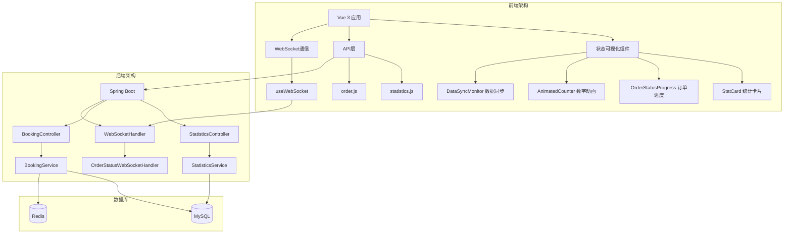
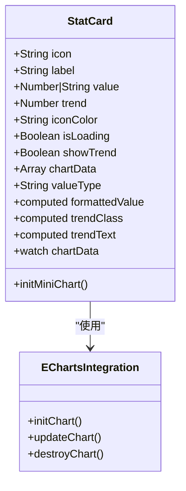
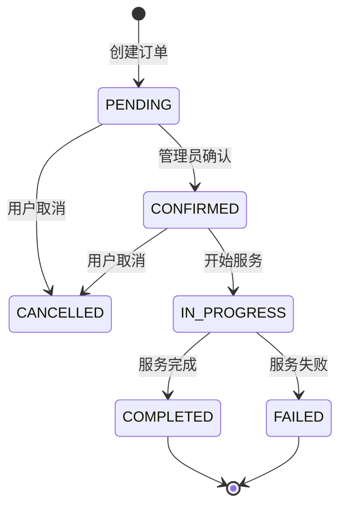
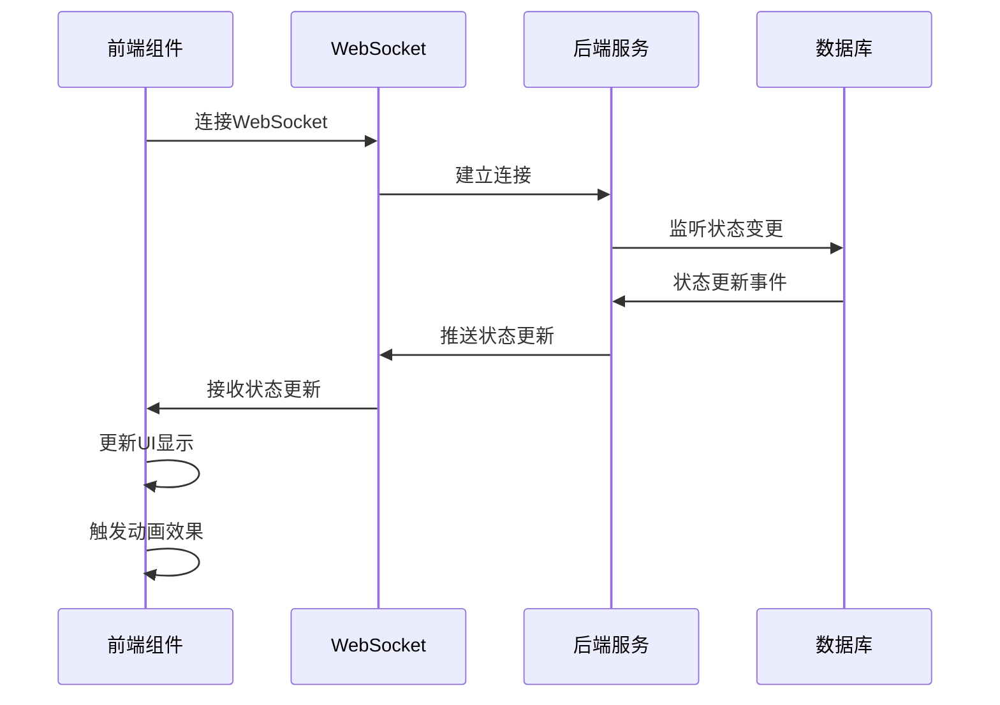
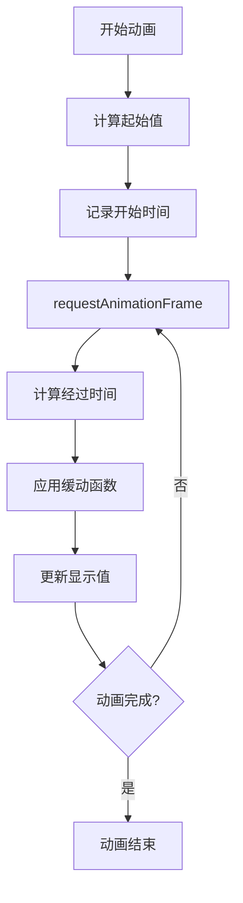
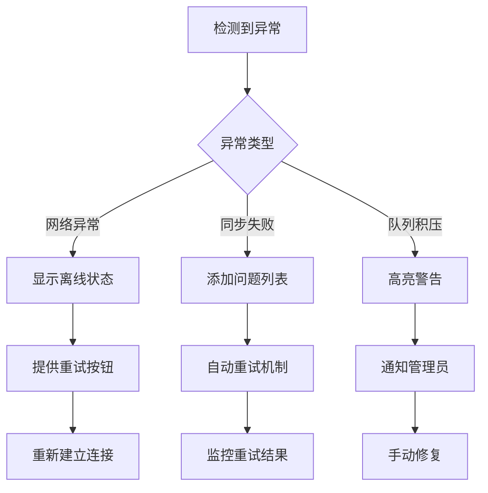
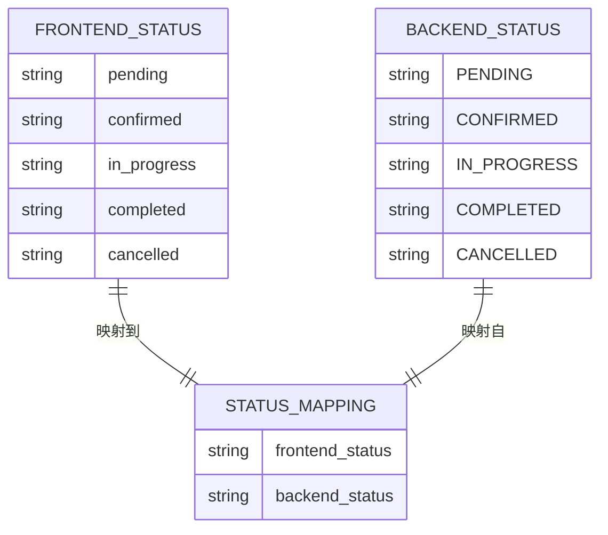
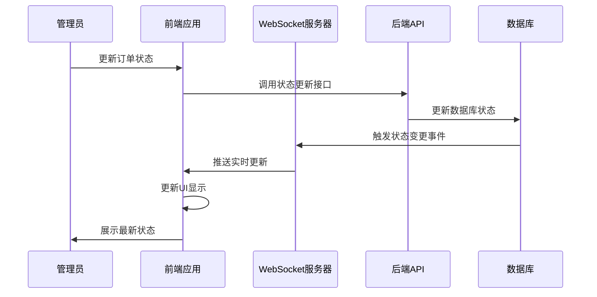
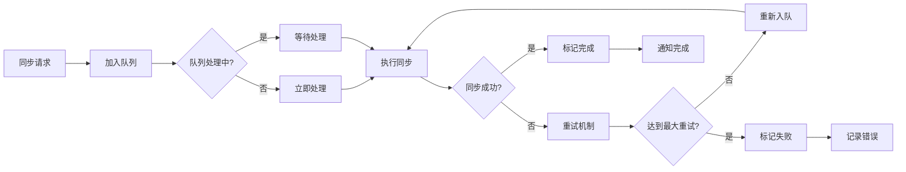

# 状态可视化组件

<cite>
**本文档引用的文件**
- [StatCard.vue](file://frontend/src/components/StatCard.vue)
- [OrderStatusProgress.vue](file://frontend/src/components/OrderStatusProgress.vue)
- [AnimatedCounter.vue](file://frontend/src/components/AnimatedCounter.vue)
- [DataSyncMonitor.vue](file://frontend/src/components/DataSyncMonitor.vue)
- [statistics.js](file://frontend/src/api/statistics.js)
- [order.js](file://frontend/src/api/order.js)
- [dataSync.js](file://frontend/src/utils/dataSync.js)
- [useWebSocket.js](file://frontend/src/composables/useWebSocket.js)
- [Dashboard.vue](file://frontend/src/views/Dashboard.vue)
- [AppointmentStatus.java](file://backend/src/main/java/com/carwash/common/enums/AppointmentStatus.java)
</cite>

## 目录
1. [引言](#引言)
2. [项目架构概述](#项目架构概述)
3. [核心可视化组件](#核心可视化组件)
4. [数据驱动设计](#数据驱动设计)
5. [状态同步机制](#状态同步机制)
6. [性能优化策略](#性能优化策略)
7. [后端API集成](#后端api集成)
8. [故障排除指南](#故障排除指南)
9. [总结](#总结)

## 引言

本系统是一个汽车洗车服务预约管理平台，采用前后端分离架构，前端基于Vue 3构建，后端使用Spring Boot框架。系统的核心价值在于提供直观的状态可视化组件，帮助管理员实时监控业务状态和数据流。

这些可视化组件不仅展示了静态数据，更重要的是实现了动态状态跟踪、实时数据同步和异常状态监控等功能，为业务决策提供了强有力的技术支撑。

## 项目架构概述

系统采用现代化的前后端分离架构，前端使用Vue 3 Composition API构建响应式界面，后端提供RESTful API接口。

**图表来源**
- [Dashboard.vue](file://frontend/src/views/Dashboard.vue#L1-L50)
- [useWebSocket.js](file://frontend/src/composables/useWebSocket.js#L1-L30)
- [statistics.js](file://frontend/src/api/statistics.js#L1-L20)

## 核心可视化组件

### StatCard - 数据统计卡片

StatCard组件是系统中最基础的统计展示组件，采用数据驱动的设计理念，支持多种数据类型的展示和动态更新。

#### 核心特性

- **数据驱动渲染**：通过props接收数据，自动格式化和展示
- **多类型支持**：支持数值、货币、百分比等多种数据格式
- **趋势分析**：内置趋势箭头和百分比变化显示
- **迷你图表**：集成ECharts实现数据趋势可视化
- **加载状态**：完整的加载骨架屏和旋转动画

#### 数据绑定方式

**图表来源**
- [StatCard.vue](file://frontend/src/components/StatCard.vue#L32-L188)

#### 动画性能优化

组件采用了多层次的性能优化策略：

1. **懒加载图表**：只有在需要时才初始化ECharts实例
2. **防抖更新**：使用nextTick确保DOM更新完成后再渲染图表
3. **内存管理**：及时清理不再使用的图表实例
4. **条件渲染**：根据数据状态决定是否渲染图表部分

**章节来源**
- [StatCard.vue](file://frontend/src/components/StatCard.vue#L1-L342)

### OrderStatusProgress - 订单状态进度条

OrderStatusProgress组件实现了预约订单生命周期的完整可视化，通过状态机模型精确展示订单从创建到完成的各个阶段。

#### 状态机模型

**图表来源**
- [AppointmentStatus.java](file://backend/src/main/java/com/carwash/common/enums/AppointmentStatus.java#L10-L15)
- [OrderStatusProgress.vue](file://frontend/src/components/OrderStatusProgress.vue#L242-L258)

#### 实时状态同步

组件集成了WebSocket通信机制，实现订单状态的实时更新：

**图表来源**
- [OrderStatusProgress.vue](file://frontend/src/components/OrderStatusProgress.vue#L385-L400)
- [useWebSocket.js](file://frontend/src/composables/useWebSocket.js#L54-L56)

#### 自动刷新机制

组件实现了智能的自动刷新策略：

- **处理中状态**：每8秒自动刷新一次
- **其他状态**：停止自动刷新以节省资源
- **网络状态感知**：在线时启用，离线时暂停
- **错误恢复**：自动重试机制

**章节来源**
- [OrderStatusProgress.vue](file://frontend/src/components/OrderStatusProgress.vue#L1-L609)

### AnimatedCounter - 高性能数字动画

AnimatedCounter组件专为仪表板场景设计，提供流畅的数字滚动动画效果，特别适用于实时数据展示。

#### 动画实现原理

组件采用requestAnimationFrame API实现高性能动画：

**图表来源**
- [AnimatedCounter.vue](file://frontend/src/components/AnimatedCounter.vue#L32-L57)

#### 性能优化策略

1. **硬件加速**：利用GPU进行动画渲染
2. **帧率控制**：使用requestAnimationFrame确保60fps
3. **内存优化**：避免频繁的DOM操作
4. **类型安全**：支持数字和字符串类型的灵活转换

**章节来源**
- [AnimatedCounter.vue](file://frontend/src/components/AnimatedCounter.vue#L1-L94)

### DataSyncMonitor - 数据同步监控

DataSyncMonitor组件负责监控前后端数据同步状态，提供实时的同步状态反馈和异常提示。

#### 监控指标

| 指标类型 | 描述 | 更新频率 |
|---------|------|----------|
| 同步状态 | 整体同步健康状况 | 实时 |
| 队列长度 | 待处理同步任务数量 | 5秒 |
| 最后同步 | 上次同步时间戳 | 实时 |
| 连接状态 | 后端API连接状态 | 实时 |

#### 异常处理机制

**图表来源**
- [DataSyncMonitor.vue](file://frontend/src/components/DataSyncMonitor.vue#L226-L280)
- [dataSync.js](file://frontend/src/utils/dataSync.js#L77-L112)

**章节来源**
- [DataSyncMonitor.vue](file://frontend/src/components/DataSyncMonitor.vue#L1-L520)

## 数据驱动设计

### 统一状态映射

系统实现了前后端状态的一致性映射，确保数据在传输过程中不会出现歧义：

**图表来源**
- [dataSync.js](file://frontend/src/utils/dataSync.js#L8-L27)

### 数据标准化流程

系统通过多个层次确保数据的一致性和准确性：

1. **前端标准化**：统一状态名称和格式
2. **API传输**：使用标准的JSON格式
3. **后端验证**：严格的输入验证和转换
4. **数据库存储**：规范化存储格式

**章节来源**
- [dataSync.js](file://frontend/src/utils/dataSync.js#L1-L326)

## 状态同步机制

### WebSocket实时通信

系统采用WebSocket技术实现实时状态更新：

**图表来源**
- [useWebSocket.js](file://frontend/src/composables/useWebSocket.js#L54-L56)
- [OrderStatusProgress.vue](file://frontend/src/components/OrderStatusProgress.vue#L385-L400)

### 数据同步队列

对于批量操作和复杂同步场景，系统提供了异步队列机制：

**图表来源**
- [dataSync.js](file://frontend/src/utils/dataSync.js#L58-L112)

**章节来源**
- [useWebSocket.js](file://frontend/src/composables/useWebSocket.js#L1-L100)
- [dataSync.js](file://frontend/src/utils/dataSync.js#L1-L326)

## 性能优化策略

### 组件级优化

1. **懒加载**：非关键组件按需加载
2. **虚拟滚动**：大数据量列表的高效渲染
3. **防抖节流**：减少不必要的API调用
4. **缓存机制**：合理使用浏览器缓存

### 网络层优化

1. **请求合并**：减少HTTP请求数量
2. **压缩传输**：启用Gzip压缩
3. **CDN加速**：静态资源CDN分发
4. **长连接复用**：WebSocket连接复用

### 内存管理

1. **及时清理**：组件卸载时清理事件监听
2. **弱引用**：避免循环引用导致的内存泄漏
3. **对象池**：重用频繁创建的对象
4. **垃圾回收**：主动触发垃圾回收

## 后端API集成

### 统计数据API

系统提供了完整的统计数据API接口：

| API端点 | 功能描述 | 返回格式 |
|---------|----------|----------|
| `/api/statistics/overview` | 获取概览统计 | JSON对象 |
| `/api/statistics/trend` | 获取趋势数据 | 时间序列数组 |
| `/api/statistics/revenue` | 获取收入统计 | 收入明细数组 |
| `/api/statistics/services` | 获取服务分布 | 服务类型数组 |

### 订单管理API

订单相关的API提供了完整的CRUD操作：

| API端点 | HTTP方法 | 功能描述 |
|---------|----------|----------|
| `/api/bookings` | GET | 获取订单列表 |
| `/api/bookings/{id}` | GET | 获取订单详情 |
| `/api/bookings/{id}/status` | PUT | 更新订单状态 |
| `/api/bookings/{id}` | DELETE | 删除订单 |

**章节来源**
- [statistics.js](file://frontend/src/api/statistics.js#L1-L77)
- [order.js](file://frontend/src/api/order.js#L1-L222)

## 故障排除指南

### 常见问题及解决方案

#### 数据同步失败

**症状**：订单状态更新后前端未及时反映
**原因**：WebSocket连接中断或后端状态更新失败
**解决方案**：
1. 检查网络连接状态
2. 重启WebSocket连接
3. 手动刷新订单数据
4. 查看同步队列状态

#### 统计数据显示异常

**症状**：统计数据不准确或显示空白
**原因**：API接口调用失败或数据格式错误
**解决方案**：
1. 检查API接口可用性
2. 验证数据格式正确性
3. 查看浏览器控制台错误信息
4. 使用模拟数据进行测试

#### 动画性能问题

**症状**：数字动画卡顿或不流畅
**原因**：CPU占用过高或内存不足
**解决方案**：
1. 降低动画复杂度
2. 减少同时运行的动画数量
3. 优化CSS选择器
4. 使用硬件加速

### 监控和调试

系统提供了完善的监控和调试工具：

1. **开发者工具**：内置的调试面板
2. **网络监控**：实时网络状态显示
3. **错误追踪**：详细的错误日志记录
4. **性能分析**：动画性能监控

## 总结

本系统的状态可视化组件展现了现代Web应用的最佳实践，通过以下核心特性实现了高效的业务状态监控：

### 技术亮点

1. **数据驱动设计**：所有组件都基于统一的数据模型，确保一致性和可维护性
2. **实时状态同步**：结合WebSocket和轮询机制，实现毫秒级状态更新
3. **智能性能优化**：多层次的性能优化策略，确保流畅的用户体验
4. **完善的错误处理**：健壮的异常处理和恢复机制

### 应用价值

- **提升运营效率**：实时监控业务状态，快速响应异常情况
- **改善用户体验**：直观的可视化界面，降低理解成本
- **保障数据质量**：完善的同步机制，确保数据一致性
- **支持业务决策**：丰富的统计分析，为战略制定提供依据

这套状态可视化组件不仅满足了当前的业务需求，更为未来的功能扩展奠定了坚实的基础。通过模块化的设计和标准化的接口，系统具备了良好的可扩展性和可维护性，能够适应不断变化的业务需求。