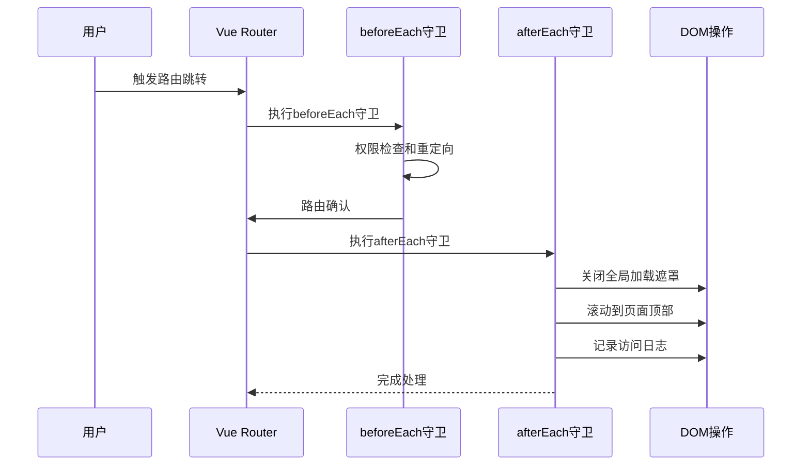
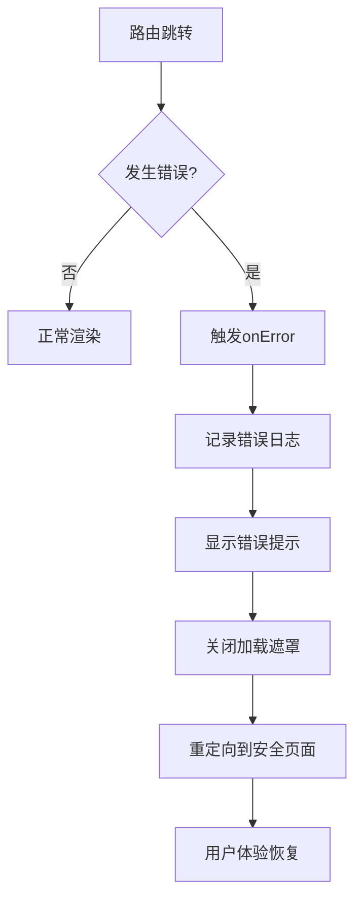
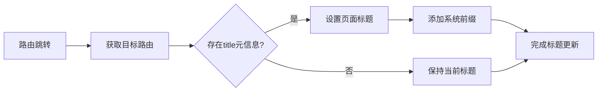
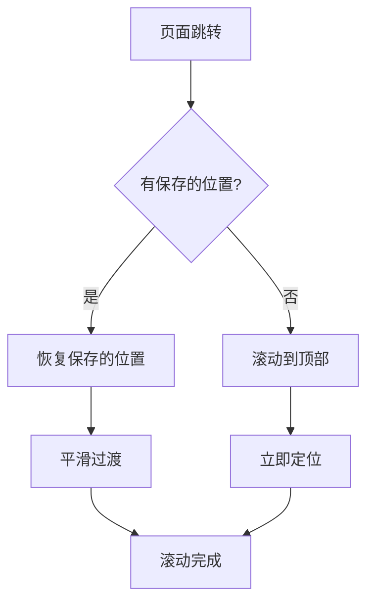
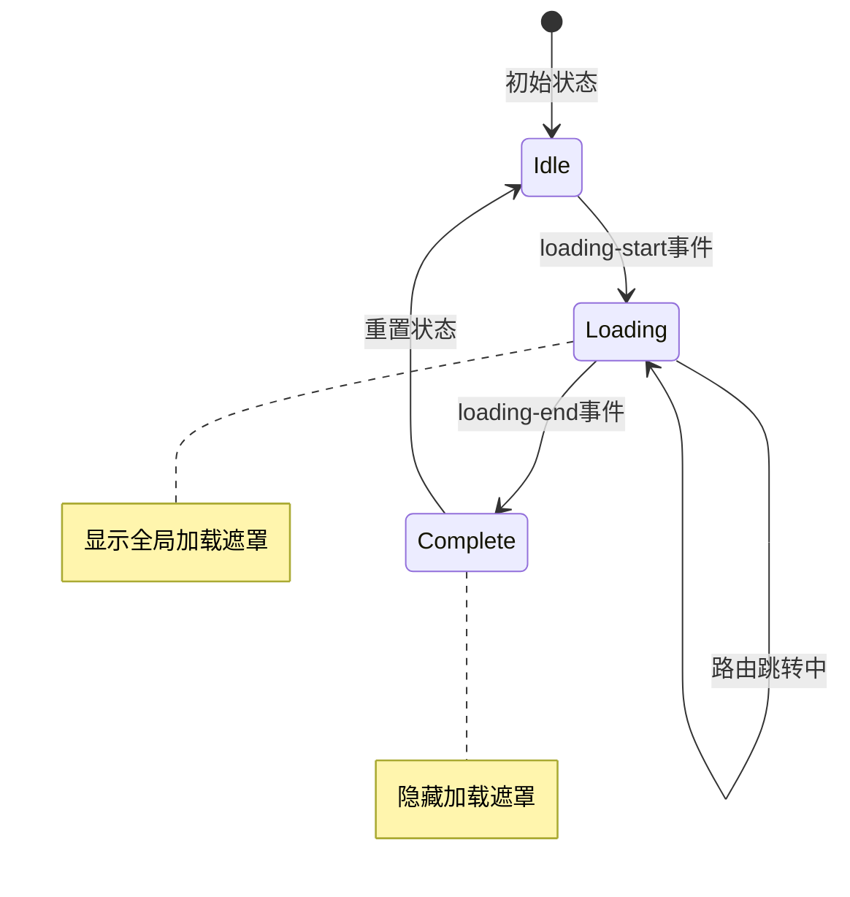
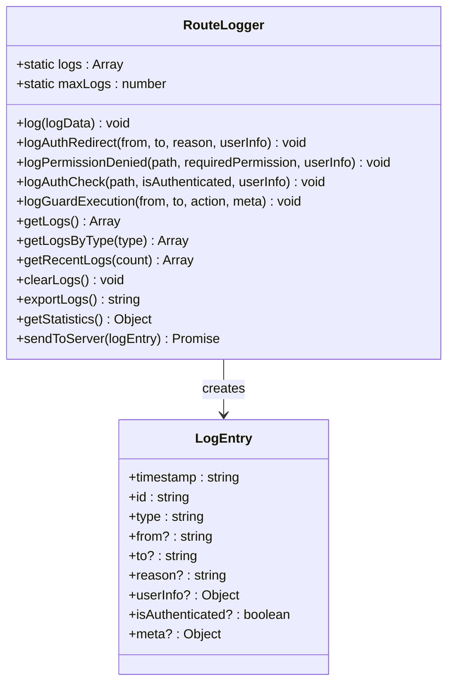
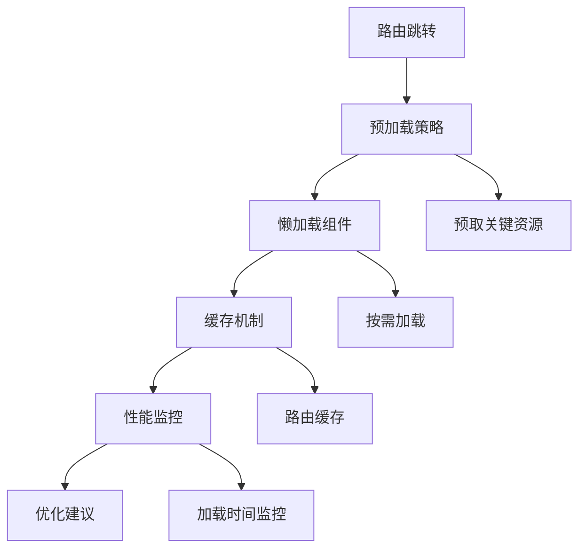

# 前端导航行为

<cite>
**本文档引用的文件**
- [routeLogger.js](file://frontend/src/utils/routeLogger.js)
- [router/index.js](file://frontend/src/router/index.js)
- [main.js](file://frontend/src/main.js)
- [auth.js](file://frontend/src/utils/auth.js)
- [Loading.vue](file://frontend/src/components/Loading.vue)
- [NotFound.vue](file://frontend/src/views/NotFound.vue)
- [themes.css](file://frontend/src/assets/css/themes.css)
- [theme.js](file://frontend/src/stores/theme.js)
- [ThemeToggle.vue](file://frontend/src/components/ThemeToggle.vue)
</cite>

## 目录
1. [概述](#概述)
2. [路由后置守卫（afterEach）机制](#路由后置守卫aftereach机制)
3. [错误处理（onError）机制](#错误处理onerror机制)
4. [页面标题动态更新](#页面标题动态更新)
5. [滚动行为控制（scrollBehavior）](#滚动行为控制scrollbehavior)
6. [全局加载状态管理](#全局加载状态管理)
7. [RouteLogger日志功能](#routelogger日志功能)
8. [用户体验问题分析与解决方案](#用户体验问题分析与解决方案)
9. [开发环境调试方法](#开发环境调试方法)
10. [总结](#总结)

## 概述

前端导航行为是现代单页应用（SPA）的核心组成部分，它负责管理页面间的跳转、状态维护、用户体验优化以及错误处理。本系统采用Vue Router作为核心导航框架，实现了完整的路由守卫机制、全局状态管理和详细的日志记录功能。

## 路由后置守卫（afterEach）机制

### 核心实现原理

路由后置守卫（afterEach）是在路由跳转完成后执行的钩子函数，主要用于页面加载完成后的处理工作。



**图表来源**
- [router/index.js](file://frontend/src/router/index.js#L338-L351)

### 核心功能实现

afterEach守卫主要执行以下三个核心功能：

1. **全局加载状态结束**：确保页面加载遮罩能够正确关闭
2. **页面滚动控制**：自动滚动到页面顶部，提供一致的用户体验
3. **用户行为记录**：记录用户的页面访问行为

**章节来源**
- [router/index.js](file://frontend/src/router/index.js#L338-L351)

## 错误处理（onError）机制

### 错误捕获与处理流程

路由错误处理机制负责捕获和处理路由过程中的各种异常情况。



**图表来源**
- [router/index.js](file://frontend/src/router/index.js#L353-L359)

### 错误处理策略

1. **错误信息展示**：使用Element Plus的消息组件显示友好的错误提示
2. **加载状态恢复**：确保即使发生错误，全局加载遮罩也能正确关闭
3. **用户体验保护**：重定向到安全的页面，避免应用处于不可用状态

**章节来源**
- [router/index.js](file://frontend/src/router/index.js#L353-L359)

## 页面标题动态更新

### 标题更新机制

页面标题的动态更新是通过beforeEach守卫实现的，利用路由元信息（meta）来设置每个页面的标题。



**图表来源**
- [router/index.js](file://frontend/src/router/index.js#L211-L214)

### 实现细节

标题更新遵循以下规则：
- 从路由配置的meta.title字段获取页面标题
- 添加统一的系统前缀："汽车洗车服务预约系统"
- 支持多语言和动态标题内容

**章节来源**
- [router/index.js](file://frontend/src/router/index.js#L211-L214)

## 滚动行为控制（scrollBehavior）

### 滚动控制策略

滚动行为控制通过Vue Router的scrollBehavior配置实现，提供了智能的页面滚动体验。



**图表来源**
- [router/index.js](file://frontend/src/router/index.js#L194-L200)

### 滚动行为特性

1. **位置记忆**：支持浏览器原生的滚动位置记忆功能
2. **页面顶部**：默认情况下滚动到页面顶部
3. **用户体验**：提供流畅的滚动过渡效果

**章节来源**
- [router/index.js](file://frontend/src/router/index.js#L194-L200)

## 全局加载状态管理

### 加载状态生命周期

全局加载状态管理通过自定义事件系统实现，确保加载状态的一致性和可靠性。



**图表来源**
- [router/index.js](file://frontend/src/router/index.js#L209-L210)
- [router/index.js](file://frontend/src/router/index.js#L340-L341)
- [router/index.js](file://frontend/src/router/index.js#L358-L359)

### 加载状态管理机制

1. **事件驱动**：使用CustomEvent API派发加载状态事件
2. **前后守卫配合**：beforeEach触发开始，afterEach触发结束
3. **错误处理**：onError确保即使发生错误也能正确关闭加载状态

**章节来源**
- [router/index.js](file://frontend/src/router/index.js#L209-L210)
- [router/index.js](file://frontend/src/router/index.js#L340-L341)
- [router/index.js](file://frontend/src/router/index.js#L358-L359)

## RouteLogger日志功能

### 日志记录架构

RouteLogger是一个功能完整的路由日志记录工具，提供了全面的路由行为监控能力。



**图表来源**
- [routeLogger.js](file://frontend/src/utils/routeLogger.js#L4-L233)

### 日志类型与用途

RouteLogger支持多种类型的日志记录：

| 日志类型 | 用途 | 关键字段 |
|---------|------|----------|
| auth_redirect | 认证重定向记录 | from, to, reason, userInfo |
| permission_denied | 权限拒绝记录 | path, requiredPermission, userInfo |
| auth_check | 认证状态检查 | path, isAuthenticated, userInfo |
| guard_execution | 守卫执行记录 | from, to, action, meta |
| token_refresh | Token刷新记录 | path, success |
| guard_error | 守卫错误记录 | from, to, error |

**章节来源**
- [routeLogger.js](file://frontend/src/utils/routeLogger.js#L12-L233)

### 日志存储与管理

1. **内存存储**：日志存储在静态数组中，支持最大100条记录
2. **自动清理**：超出限制时自动删除最旧的日志
3. **导出功能**：支持导出为JSON格式
4. **统计分析**：提供详细的统计信息和分析功能

**章节来源**
- [routeLogger.js](file://frontend/src/utils/routeLogger.js#L5-L25)
- [routeLogger.js](file://frontend/src/utils/routeLogger.js#L123-L226)

## 用户体验问题分析与解决方案

### 常见用户体验问题

#### 1. 页面闪烁问题

**问题描述**：路由跳转时可能出现短暂的页面空白或闪烁现象。

**解决方案**：
- 使用全局加载遮罩确保视觉连续性
- 实现正确的加载状态生命周期管理
- 优化组件渲染性能

#### 2. 加载遮罩未关闭问题

**问题描述**：路由跳转过程中发生错误时，加载遮罩可能无法正确关闭。

**解决方案**：
- onError守卫确保加载状态的正确恢复
- 使用finally块保证资源释放
- 实现超时机制防止无限等待

#### 3. 滚动位置异常

**问题描述**：页面跳转后滚动位置不符合预期。

**解决方案**：
- 实现智能的滚动行为控制
- 支持位置记忆和手动重置
- 提供用户可控的滚动选项

### 性能优化策略



**章节来源**
- [router/index.js](file://frontend/src/router/index.js#L209-L210)
- [router/index.js](file://frontend/src/router/index.js#L347-L351)

## 开发环境调试方法

### RouteLogger调试功能

RouteLogger在开发环境中提供了强大的调试功能，可以通过浏览器控制台直接访问和操作。

```javascript
// 开发环境下的调试方法
// 1. 查看所有日志
console.log(RouteLogger.getLogs());

// 2. 查看特定类型的日志
console.log(RouteLogger.getLogsByType('auth_redirect'));

// 3. 获取最近的10条日志
console.log(RouteLogger.getRecentLogs(10));

// 4. 清除日志
RouteLogger.clearLogs();

// 5. 导出日志为JSON
console.log(RouteLogger.exportLogs());

// 6. 获取统计信息
console.log(RouteLogger.getStatistics());
```

### 调试技巧与最佳实践

1. **实时监控**：在开发过程中实时查看路由日志
2. **条件断点**：根据日志类型设置条件断点
3. **性能分析**：利用统计信息分析路由性能
4. **错误追踪**：快速定位和解决路由相关问题

**章节来源**
- [routeLogger.js](file://frontend/src/utils/routeLogger.js#L228-L233)

## 总结

本系统的前端导航行为设计体现了以下核心特点：

### 技术优势

1. **完整的生命周期管理**：从前置守卫到后置守卫，再到错误处理，形成了完整的路由生命周期
2. **用户体验优先**：通过全局加载状态、智能滚动控制等机制确保良好的用户体验
3. **完善的监控体系**：RouteLogger提供了全面的路由行为监控和分析能力
4. **开发友好**：丰富的调试功能和清晰的日志记录便于开发和维护

### 架构特点

1. **模块化设计**：各个功能模块职责明确，易于维护和扩展
2. **事件驱动**：使用事件系统实现松耦合的状态管理
3. **错误容错**：完善的错误处理机制确保应用稳定性
4. **性能优化**：通过多种策略优化路由跳转性能

### 应用价值

该导航行为系统不仅满足了基本的路由功能需求，更通过精心的设计提升了整体的用户体验和开发效率，为构建高质量的单页应用奠定了坚实的基础。