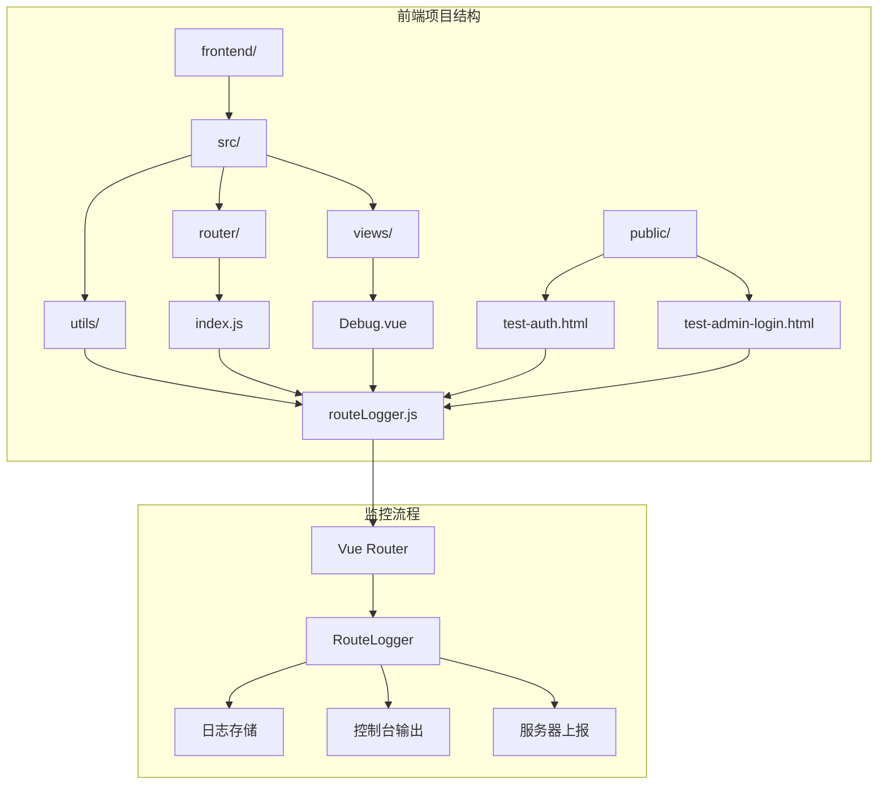
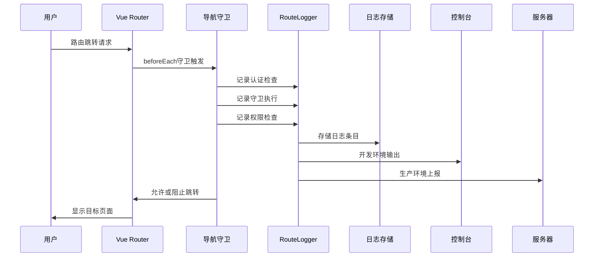
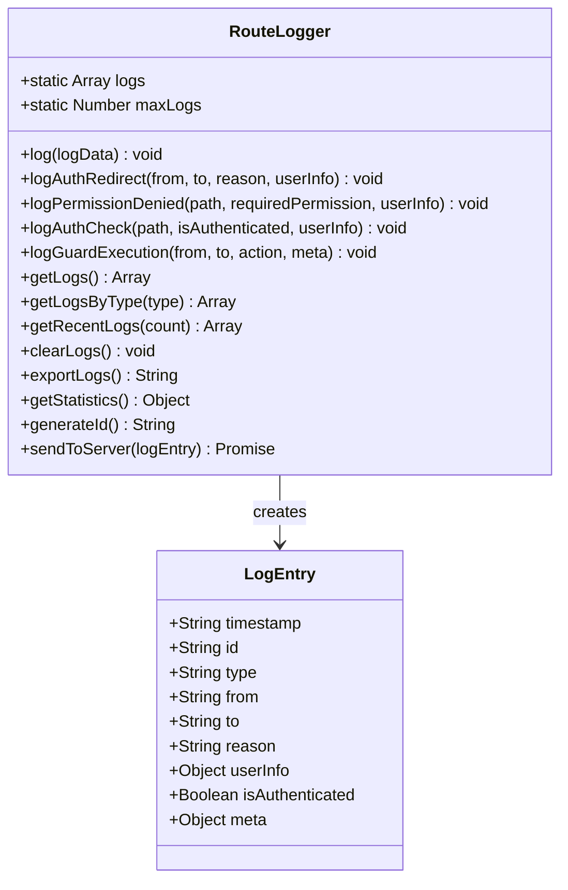
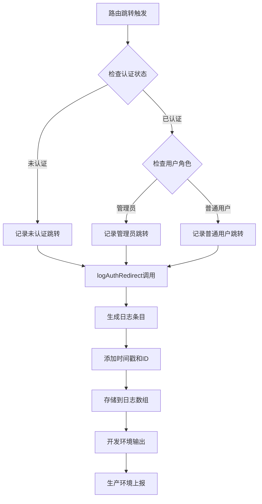
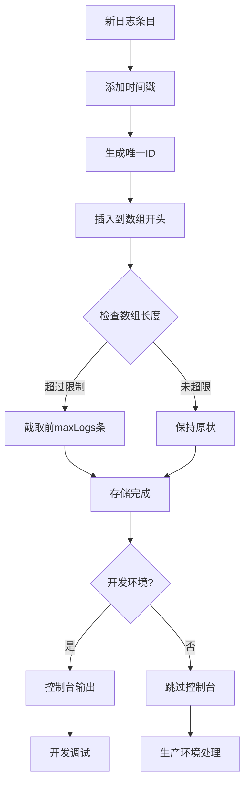
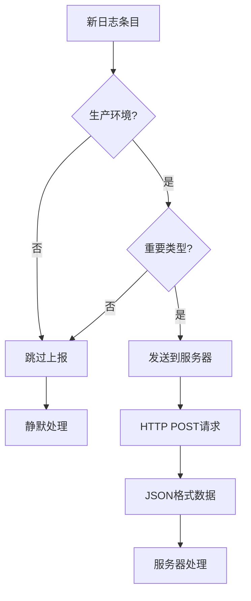
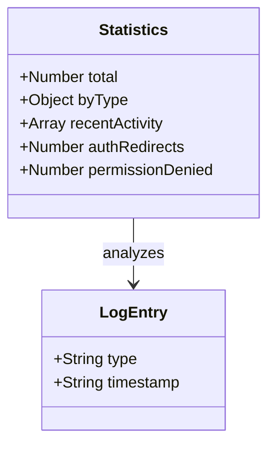
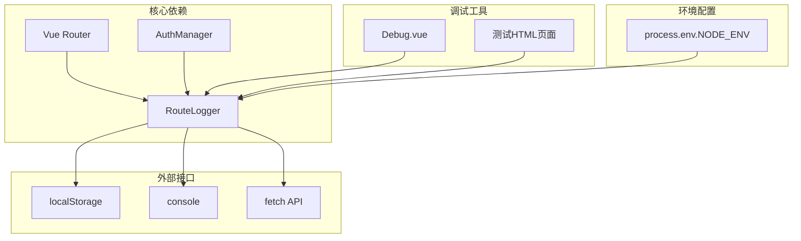

# 用户行为追踪与调试支持

<cite>
**本文档引用的文件**
- [routeLogger.js](file://frontend/src/utils/routeLogger.js)
- [index.js](file://frontend/src/router/index.js)
- [Debug.vue](file://frontend/src/views/Debug.vue)
- [test-auth.html](file://frontend/public/test-auth.html)
- [test-admin-login.html](file://frontend/public/test-admin-login.html)
</cite>

## 目录
1. [简介](#简介)
2. [项目结构](#项目结构)
3. [核心组件](#核心组件)
4. [架构概览](#架构概览)
5. [详细组件分析](#详细组件分析)
6. [依赖关系分析](#依赖关系分析)
7. [性能考虑](#性能考虑)
8. [故障排除指南](#故障排除指南)
9. [结论](#结论)

## 简介

RouteLogger是汽车洗车服务预约系统中的核心前端导航行为监控工具，专门负责记录和分析用户的路由跳转行为。该工具提供了完整的日志记录体系，包括认证跳转、权限拒绝、认证检查和守卫执行等关键事件的结构化日志输出，为系统监控、用户行为分析和调试支持提供了强大的数据基础。

RouteLogger的设计理念是"透明监控、智能分析、便捷调试"，它不仅在开发环境中提供实时的调试能力，还在生产环境中实现了关键日志的可选上报策略，为系统的稳定运行和用户体验优化提供了重要保障。

## 项目结构

RouteLogger位于前端项目的工具模块中，作为独立的监控组件与其他核心模块协同工作：



**图表来源**
- [routeLogger.js](file://frontend/src/utils/routeLogger.js#L1-L233)
- [index.js](file://frontend/src/router/index.js#L204-L335)

**章节来源**
- [routeLogger.js](file://frontend/src/utils/routeLogger.js#L1-L233)
- [index.js](file://frontend/src/router/index.js#L1-L361)

## 核心组件

RouteLogger类是一个静态工具类，提供了完整的路由监控功能。其核心特性包括：

### 主要功能模块

1. **日志记录系统** - 支持多种类型的路由事件记录
2. **本地管理机制** - 实现日志的本地存储和管理
3. **开发调试支持** - 提供全局访问接口和实时调试能力
4. **生产环境上报** - 实现关键日志的可选服务器上报
5. **统计分析功能** - 提供丰富的统计数据和分析接口

### 关键配置参数

| 参数名称 | 类型 | 默认值 | 描述 |
|---------|------|--------|------|
| maxLogs | Number | 100 | 最大日志存储数量 |
| process.env.NODE_ENV | String | development | 环境标识符 |

**章节来源**
- [routeLogger.js](file://frontend/src/utils/routeLogger.js#L5-L6)

## 架构概览

RouteLogger采用事件驱动的架构模式，在Vue Router的导航守卫中集成监控逻辑：



**图表来源**
- [index.js](file://frontend/src/router/index.js#L208-L335)
- [routeLogger.js](file://frontend/src/utils/routeLogger.js#L12-L33)

## 详细组件分析

### RouteLogger类核心实现

RouteLogger类采用了单例模式和静态方法设计，确保在整个应用生命周期中保持一致的日志记录能力：



**图表来源**
- [routeLogger.js](file://frontend/src/utils/routeLogger.js#L3-L226)

### 日志记录体系详解

#### 1. 认证跳转日志 (logAuthRedirect)

认证跳转日志记录了所有涉及用户认证状态变化的路由跳转事件：



**图表来源**
- [index.js](file://frontend/src/router/index.js#L238-L246)
- [routeLogger.js](file://frontend/src/utils/routeLogger.js#L43-L55)

#### 2. 权限拒绝日志 (logPermissionDenied)

权限拒绝日志专门记录用户尝试访问受限资源被拒绝的情况：

| 字段名称 | 类型 | 描述 |
|---------|------|------|
| path | String | 尝试访问的路径 |
| requiredPermission | String | 需要的权限级别 |
| userInfo | Object | 用户信息（包含id、role、username） |
| isAuthenticated | Boolean | 认证状态 |

#### 3. 认证检查日志 (logAuthCheck)

认证检查日志记录每次路由导航时的认证状态检测：


**图表来源**
- [index.js](file://frontend/src/router/index.js#L220-L221)
- [routeLogger.js](file://frontend/src/utils/routeLogger.js#L84-L95)

#### 4. 守卫执行日志 (logGuardExecution)

守卫执行日志记录Vue Router导航守卫的执行情况：

| 元信息字段 | 类型 | 描述 |
|-----------|------|------|
| requiresAuth | Boolean | 是否需要认证 |
| requiresAdmin | Boolean | 是否需要管理员权限 |
| hideForAuth | Boolean | 已认证用户隐藏 |
| guestOnly | Boolean | 仅访客可用 |

**章节来源**
- [routeLogger.js](file://frontend/src/utils/routeLogger.js#L36-L117)
- [index.js](file://frontend/src/router/index.js#L220-L335)

### 本地管理机制

#### 日志存储与管理

RouteLogger实现了高效的本地日志管理系统：



**图表来源**
- [routeLogger.js](file://frontend/src/utils/routeLogger.js#L12-L26)

#### 查询与操作功能

RouteLogger提供了丰富的日志查询和操作接口：

| 方法名称 | 参数 | 返回值 | 功能描述 |
|---------|------|--------|----------|
| getLogs() | 无 | Array | 获取所有日志 |
| getLogsByType(type) | String | Array | 获取指定类型的日志 |
| getRecentLogs(count) | Number | Array | 获取最近的日志 |
| clearLogs() | 无 | void | 清除所有日志 |
| exportLogs() | 无 | String | 导出为JSON格式 |

**章节来源**
- [routeLogger.js](file://frontend/src/utils/routeLogger.js#L120-L159)

### 开发环境调试能力

#### 全局对象暴露

在开发环境下，RouteLogger会自动暴露到window对象，提供实时调试能力：

```javascript
// 开发环境下自动暴露
if (process.env.NODE_ENV === 'development') {
  window.RouteLogger = RouteLogger
}
```

#### 调试功能示例

开发者可以通过以下方式访问和使用RouteLogger：

```javascript
// 查看所有日志
console.log(RouteLogger.getLogs())

// 查看特定类型的日志
console.log(RouteLogger.getLogsByType('auth_redirect'))

// 获取统计信息
console.log(RouteLogger.getStatistics())

// 导出日志
const logsJson = RouteLogger.exportLogs()

// 清除日志
RouteLogger.clearLogs()
```

**章节来源**
- [routeLogger.js](file://frontend/src/utils/routeLogger.js#L228-L231)

### 生产环境上报策略

#### 关键日志筛选

RouteLogger在生产环境中实现了智能的日志上报策略：



**图表来源**
- [routeLogger.js](file://frontend/src/utils/routeLogger.js#L173-L196)

#### 上报配置

| 配置项 | 值 | 说明 |
|-------|-----|------|
| 环境检查 | process.env.NODE_ENV === 'production' | 仅在生产环境启用 |
| 重要类型 | ['auth_redirect', 'permission_denied'] | 仅上报关键事件 |
| 请求方法 | POST | 使用HTTP POST方法 |
| 内容类型 | application/json | JSON格式数据 |

**章节来源**
- [routeLogger.js](file://frontend/src/utils/routeLogger.js#L173-L196)

### 统计分析功能

#### 统计信息结构

RouteLogger提供了全面的统计分析功能：



**图表来源**
- [routeLogger.js](file://frontend/src/utils/routeLogger.js#L203-L225)

#### 统计指标说明

| 指标名称 | 类型 | 描述 |
|---------|------|------|
| total | Number | 总日志数量 |
| byType | Object | 按类型统计的数量分布 |
| recentActivity | Array | 最近5条活动记录 |
| authRedirects | Number | 认证跳转次数 |
| permissionDenied | Number | 权限拒绝次数 |

**章节来源**
- [routeLogger.js](file://frontend/src/utils/routeLogger.js#L203-L225)

## 依赖关系分析

RouteLogger与系统其他模块形成了清晰的依赖关系：



**图表来源**
- [index.js](file://frontend/src/router/index.js#L204-L205)
- [routeLogger.js](file://frontend/src/utils/routeLogger.js#L228-L231)

**章节来源**
- [index.js](file://frontend/src/router/index.js#L204-L205)
- [routeLogger.js](file://frontend/src/utils/routeLogger.js#L1-L233)

## 性能考虑

### 内存管理

RouteLogger通过以下机制确保良好的性能表现：

1. **容量限制** - 最大存储100条日志，防止内存泄漏
2. **时间倒序排列** - 新日志插入到数组开头，便于快速访问
3. **懒加载机制** - 仅在需要时才进行复杂的统计计算

### 环境优化

不同环境下的性能优化策略：

| 环境 | 控制台输出 | 服务器上报 | 统计计算 |
|------|-----------|-----------|----------|
| development | 是 | 否 | 快速计算 |
| production | 否 | 仅关键日志 | 延迟计算 |

### 异步处理

RouteLogger的服务器上报采用异步处理，不会阻塞主线程：

```javascript
static async sendToServer(logEntry) {
  // 异步发送，不影响主流程
  try {
    await fetch('/api/logs/route', {
      method: 'POST',
      headers: {'Content-Type': 'application/json'},
      body: JSON.stringify(logEntry)
    })
  } catch (error) {
    console.error('发送路由日志失败:', error)
  }
}
```

## 故障排除指南

### 常见问题及解决方案

#### 1. 日志未显示

**问题描述**: 在开发环境中看不到路由日志输出

**解决方案**:
- 检查浏览器控制台是否有错误信息
- 确认NODE_ENV设置为development
- 验证RouteLogger是否正确暴露到window对象

#### 2. 日志丢失

**问题描述**: 日志数量超过预期或突然消失

**解决方案**:
- 检查maxLogs配置是否被修改
- 确认没有手动调用clearLogs()
- 验证浏览器localStorage是否正常工作

#### 3. 生产环境上报失败

**问题描述**: 生产环境日志没有发送到服务器

**解决方案**:
- 确认NODE_ENV设置为production
- 检查网络连接和CORS配置
- 验证服务器端点是否可用

### 调试技巧

#### 实时监控

```javascript
// 监控日志变化
setInterval(() => {
  console.log('当前日志数量:', RouteLogger.getLogs().length)
  console.log('最近5条日志:', RouteLogger.getRecentLogs(5))
}, 5000)
```

#### 条件断点

```javascript
// 在特定条件下暂停执行
if (RouteLogger.getLogsByType('permission_denied').length > 0) {
  debugger
}
```

**章节来源**
- [routeLogger.js](file://frontend/src/utils/routeLogger.js#L28-L30)
- [routeLogger.js](file://frontend/src/utils/routeLogger.js#L173-L196)

## 结论

RouteLogger作为汽车洗车服务预约系统的核心监控工具，成功实现了以下目标：

### 技术成就

1. **全面覆盖** - 涵盖了路由导航的所有关键环节
2. **高效执行** - 优化的内存管理和异步处理机制
3. **易于使用** - 简洁的API设计和丰富的调试功能
4. **环境适配** - 智能的开发/生产环境差异化处理

### 应用价值

- **开发调试** - 提供了强大的实时调试能力，显著提升开发效率
- **系统监控** - 为系统稳定性分析和性能优化提供了数据支持
- **用户体验** - 通过权限控制和认证管理，保障了系统的安全性
- **运维支持** - 生产环境的日志上报为问题排查和系统监控提供了便利

### 未来展望

RouteLogger的设计为未来的功能扩展奠定了良好基础，可以考虑：
- 增加更多的日志类型和监控维度
- 实现日志的持久化存储和远程管理
- 添加可视化仪表板和实时监控功能
- 集成机器学习算法进行异常检测和预测

通过持续的优化和完善，RouteLogger将继续为系统的稳定运行和用户体验提升发挥重要作用。