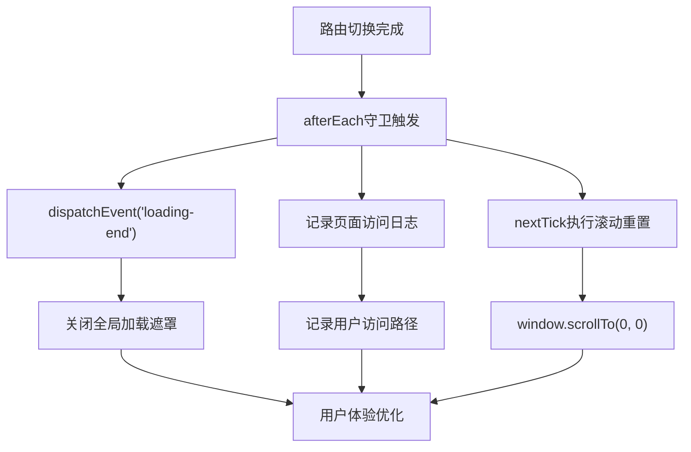
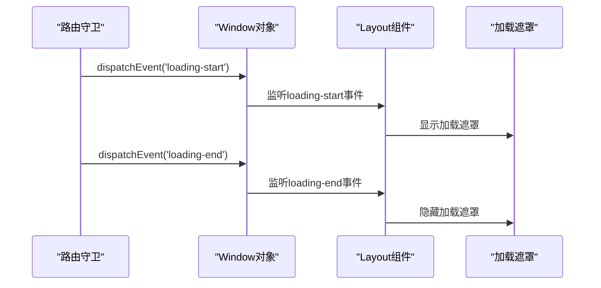
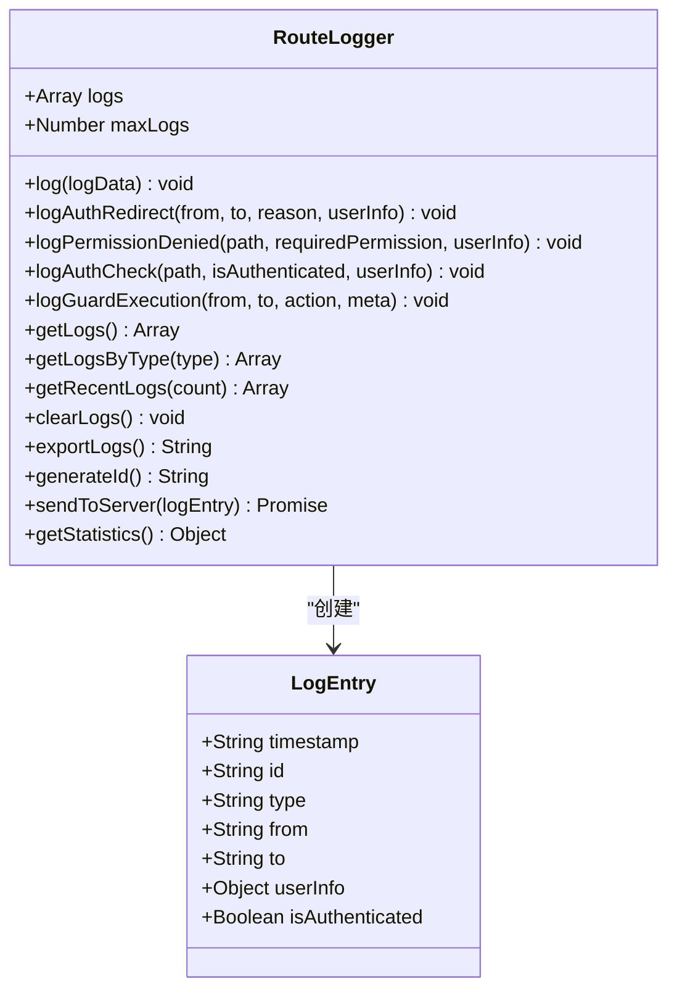
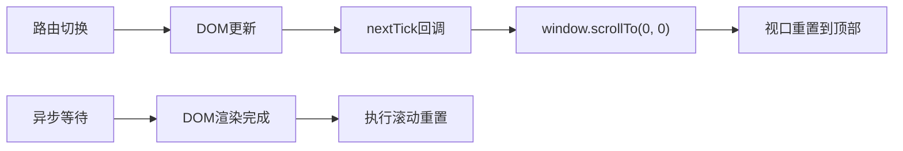
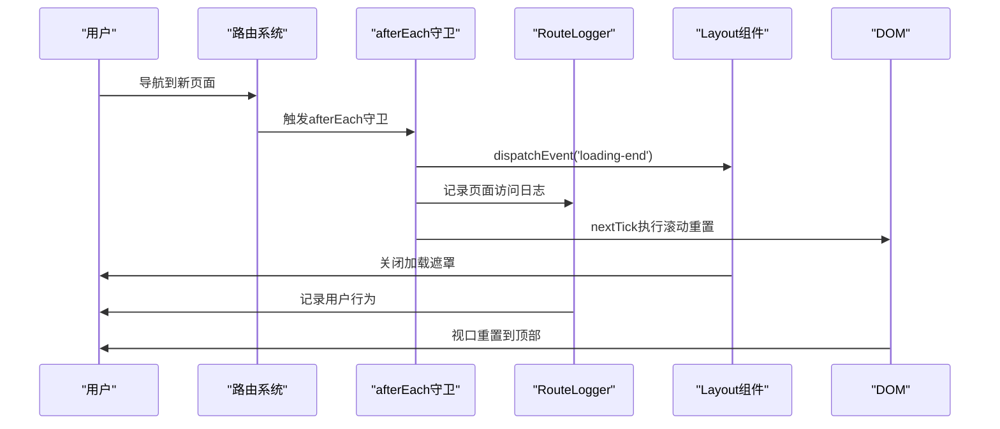
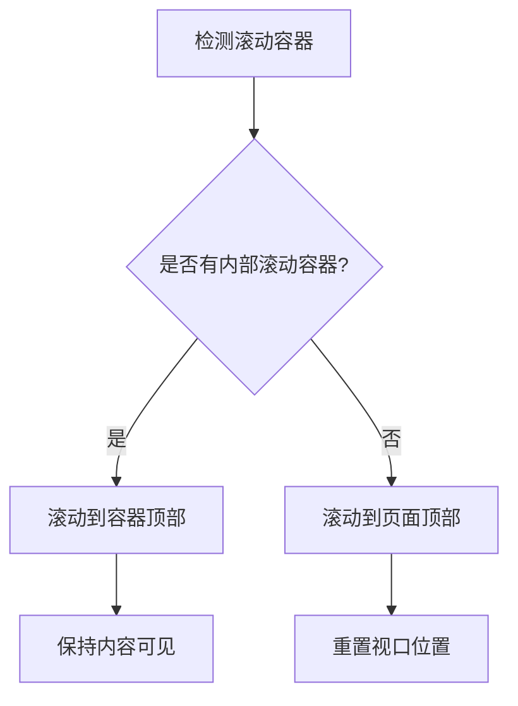

# 路由后置守卫与页面状态管理

<cite>
**本文档引用的文件**
- [frontend/src/router/index.js](file://frontend/src/router/index.js)
- [frontend/src/utils/routeLogger.js](file://frontend/src/utils/routeLogger.js)
- [frontend/src/components/Loading.vue](file://frontend/src/components/Loading.vue)
- [frontend/src/components/LoadingAnimation.vue](file://frontend/src/components/LoadingAnimation.vue)
- [frontend/src/components/Layout/Layout.vue](file://frontend/src/components/Layout/Layout.vue)
- [frontend/src/assets/css/global.css](file://frontend/src/assets/css/global.css)
- [frontend/src/main.js](file://frontend/src/main.js)
</cite>

## 目录
1. [概述](#概述)
2. [路由后置守卫架构](#路由后置守卫架构)
3. [全局加载状态管理](#全局加载状态管理)
4. [页面访问日志记录](#页面访问日志记录)
5. [滚动行为控制](#滚动行为控制)
6. [协同工作机制](#协同工作机制)
7. [复杂布局中的滚动问题解决方案](#复杂布局中的滚动问题解决方案)
8. [最佳实践与优化建议](#最佳实践与优化建议)

## 概述

Vue Router 的 `afterEach` 守卫是页面导航流程中的重要环节，它在路由切换完成后执行，负责处理页面状态的最终调整。本项目中的路由后置守卫实现了三个核心功能：全局加载状态的关闭、用户行为追踪的日志记录，以及页面滚动位置的统一重置。

这些功能协同工作，确保了用户在页面间切换时获得一致且流畅的体验，避免了加载遮罩未正确关闭、用户行为无法追踪以及页面滚动位置异常等问题。

## 路由后置守卫架构

### 核心实现机制

路由后置守卫的实现位于路由配置文件中，通过 `router.afterEach` 方法注册：

**图表来源**
- [frontend/src/router/index.js](file://frontend/src/router/index.js#L338-L361)

### 实现细节分析

路由后置守卫包含三个关键步骤：

1. **全局加载状态关闭**：通过 `window.dispatchEvent(new Event('loading-end'))` 触发全局加载遮罩的关闭
2. **用户行为记录**：记录已认证用户的页面访问路径
3. **滚动位置重置**：使用 `nextTick` 确保 DOM 更新完成后再执行滚动重置

**章节来源**
- [frontend/src/router/index.js](file://frontend/src/router/index.js#L338-L361)

## 全局加载状态管理

### 加载状态触发机制

项目采用事件驱动的方式管理全局加载状态，通过自定义事件实现组件间的解耦通信：

**图表来源**
- [frontend/src/router/index.js](file://frontend/src/router/index.js#L339-L341)
- [frontend/src/components/Layout/Layout.vue](file://frontend/src/components/Layout/Layout.vue#L52-L68)

### 加载遮罩组件实现

加载遮罩通过 Vue 组件实现，支持全屏显示和固定定位两种模式：

| 属性 | 类型 | 默认值 | 描述 |
|------|------|--------|------|
| fullscreen | Boolean | false | 是否全屏显示 |
| title | String | "加载中..." | 加载标题 |
| description | String | "" | 加载描述信息 |
| showProgress | Boolean | false | 是否显示进度条 |
| progress | Number | 0 | 加载进度百分比 |

**章节来源**
- [frontend/src/components/Loading.vue](file://frontend/src/components/Loading.vue#L1-L180)
- [frontend/src/components/LoadingAnimation.vue](file://frontend/src/components/LoadingAnimation.vue#L1-L450)

### 错误处理中的状态管理

路由错误处理同样遵循相同的加载状态管理原则，确保即使在页面加载失败的情况下也能正确关闭加载遮罩：

**章节来源**
- [frontend/src/router/index.js](file://frontend/src/router/index.js#L353-L359)

## 页面访问日志记录

### RouteLogger 类设计

RouteLogger 是一个专门的日志记录工具类，提供了完整的用户行为追踪功能：

**图表来源**
- [frontend/src/utils/routeLogger.js](file://frontend/src/utils/routeLogger.js#L1-L233)

### 日志记录功能详解

#### 认证相关日志
- **认证重定向日志**：记录因认证状态导致的页面跳转
- **权限检查日志**：记录权限验证过程
- **认证状态检查**：记录每次路由导航时的认证状态

#### 守卫执行日志
- **守卫执行记录**：记录路由守卫的执行情况
- **元信息记录**：记录路由的元信息和执行动作

#### 性能监控日志
- **统计数据**：提供日志统计和分析功能
- **导出功能**：支持日志导出为 JSON 格式

**章节来源**
- [frontend/src/utils/routeLogger.js](file://frontend/src/utils/routeLogger.js#L37-L226)

### 用户行为追踪实现

系统会记录已认证用户的页面访问路径，这对于分析用户行为模式和优化用户体验具有重要意义：

**章节来源**
- [frontend/src/router/index.js](file://frontend/src/router/index.js#L343-L345)

## 滚动行为控制

### nextTick 滚动重置机制

滚动行为控制通过 Vue 的 `nextTick` API 确保 DOM 更新完成后再执行滚动操作：

**图表来源**
- [frontend/src/router/index.js](file://frontend/src/router/index.js#L347-L350)

### 滚动行为配置

项目在路由配置中设置了全局的滚动行为：

| 参数 | 类型 | 描述 |
|------|------|------|
| savedPosition | Object \| null | 保存的位置信息 |
| to | Route | 目标路由对象 |
| from | Route | 来源路由对象 |

当存在保存的位置时恢复该位置，否则滚动到顶部。

**章节来源**
- [frontend/src/router/index.js](file://frontend/src/router/index.js#L194-L200)

### 滚动动画效果

项目还提供了平滑滚动的回到底部功能：

**章节来源**
- [frontend/src/components/BackToTop.vue](file://frontend/src/components/BackToTop.vue#L23-L28)

## 协同工作机制

### 整体工作流程

路由后置守卫的三个功能模块协同工作，形成完整的页面状态管理流程：

**图表来源**
- [frontend/src/router/index.js](file://frontend/src/router/index.js#L338-L361)
- [frontend/src/utils/routeLogger.js](file://frontend/src/utils/routeLogger.js#L12-L34)

### 状态一致性保证

通过路由后置守卫的统一处理，系统确保了以下状态的一致性：

1. **加载状态**：无论页面加载成功或失败，都能正确关闭加载遮罩
2. **用户行为**：准确记录用户的页面访问路径和行为模式
3. **滚动位置**：每次页面切换后视口都重置到顶部，提供一致的导航体验

**章节来源**
- [frontend/src/router/index.js](file://frontend/src/router/index.js#L338-L361)

## 复杂布局中的滚动问题解决方案

### 常见滚动问题场景

在复杂的布局结构中，可能会遇到以下滚动相关的问题：

#### 1. 内容容器滚动
某些页面可能有内部滚动容器，需要特殊处理：

#### 2. 动态内容加载
异步加载的内容可能导致滚动位置计算不准确：

**解决方案**：使用 `nextTick` 确保 DOM 更新完成

#### 3. 固定布局影响
固定定位的导航栏可能影响滚动计算：

**解决方案**：考虑导航栏高度的影响

### 解决方案实现

针对复杂布局的滚动问题，可以采用以下策略：

1. **智能滚动检测**：检测是否存在内部滚动容器
2. **延迟滚动执行**：使用 `nextTick` 确保 DOM 更新完成
3. **滚动位置记忆**：对于支持保存位置的页面，正确恢复滚动位置

**章节来源**
- [frontend/src/router/index.js](file://frontend/src/router/index.js#L194-L200)

## 最佳实践与优化建议

### 性能优化建议

#### 1. 日志记录优化
- **批量发送**：将多个日志条目批量发送到服务器
- **采样记录**：在生产环境中只记录关键日志
- **本地缓存**：在本地缓存日志，防止网络问题丢失数据

#### 2. 加载状态优化
- **防抖处理**：避免频繁的加载状态切换
- **超时处理**：设置加载超时机制，防止加载状态卡住
- **渐进式加载**：优先加载关键内容，非关键内容延迟加载

#### 3. 滚动行为优化
- **智能判断**：根据页面内容动态决定是否需要滚动重置
- **动画优化**：使用 CSS 动画而非 JavaScript 动画提高性能
- **内存管理**：及时清理滚动相关的事件监听器

### 错误处理与监控

#### 1. 异常捕获
- **全局异常处理**：捕获路由守卫中的异常
- **日志记录**：记录异常信息便于问题排查
- **降级处理**：在异常情况下提供基本的功能保障

#### 2. 性能监控
- **加载时间监控**：监控页面加载时间
- **用户行为分析**：分析用户访问路径和行为模式
- **错误率统计**：统计路由相关的错误发生率

### 可维护性建议

#### 1. 代码组织
- **模块化设计**：将不同功能分离到独立的模块
- **配置外置**：将配置信息从代码中分离出来
- **接口抽象**：提供清晰的接口定义

#### 2. 文档维护
- **API 文档**：完善各个工具类的 API 文档
- **使用示例**：提供详细的使用示例
- **最佳实践**：总结项目中的最佳实践

通过合理的设计和实现，路由后置守卫能够为用户提供流畅、一致的页面导航体验，同时为开发者提供完善的监控和调试能力。这种设计模式值得在类似的项目中推广和应用。