# 路由异常捕获与容错机制

<cite>
**本文档引用的文件**
- [router/index.js](file://frontend/src/router/index.js)
- [utils/routeLogger.js](file://frontend/src/utils/routeLogger.js)
- [components/Layout/Layout.vue](file://frontend/src/components/Layout/Layout.vue)
- [components/Loading.vue](file://frontend/src/components/Loading.vue)
- [views/NotFound.vue](file://frontend/src/views/NotFound.vue)
- [api/request.js](file://frontend/src/api/request.js)
- [utils/concurrencyStabilityTest.js](file://frontend/src/utils/concurrencyStabilityTest.js)
- [utils/performanceMonitor.js](file://frontend/src/utils/performanceMonitor.js)
- [views/AdminScript.js](file://frontend/src/views/AdminScript.js)
</cite>

## 目录
1. [概述](#概述)
2. [路由错误处理架构](#路由错误处理架构)
3. [核心错误处理机制](#核心错误处理机制)
4. [用户反馈策略](#用户反馈策略)
5. [全局加载状态管理](#全局加载状态管理)
6. [错误日志记录系统](#错误日志记录系统)
7. [调试与监控方案](#调试与监控方案)
8. [常见错误场景与排查](#常见错误场景与排查)
9. [最佳实践建议](#最佳实践建议)

## 概述

该汽车洗车服务预约系统的路由异常捕获与容错机制是一个多层次的错误处理体系，旨在确保应用在面对各种运行时异常时能够优雅地降级，并向用户提供友好的错误反馈。系统通过Vue Router的onError钩子、全局事件总线、Element Plus消息提示系统以及完善的日志记录机制，构建了一个完整的错误处理生态。

## 路由错误处理架构

### 整体架构设计

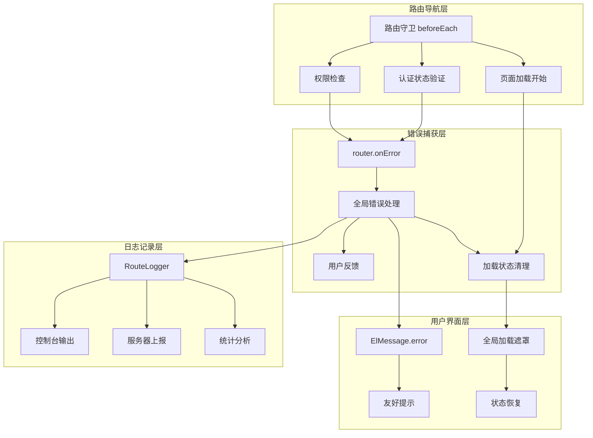

**图表来源**
- [router/index.js](file://frontend/src/router/index.js#L207-L361)
- [utils/routeLogger.js](file://frontend/src/utils/routeLogger.js#L1-L233)

### 错误处理层次结构

系统采用分层错误处理策略，每一层都有明确的职责分工：

1. **路由守卫层**：负责权限验证和导航拦截
2. **路由错误层**：捕获路由解析和组件加载异常
3. **API错误层**：处理HTTP请求和数据获取错误
4. **组件错误层**：处理组件内部运行时异常

**章节来源**
- [router/index.js](file://frontend/src/router/index.js#L207-L361)

## 核心错误处理机制

### router.onError错误捕获

系统的核心错误处理机制通过Vue Router的onError钩子实现，专门用于捕获路由解析过程中的异常。

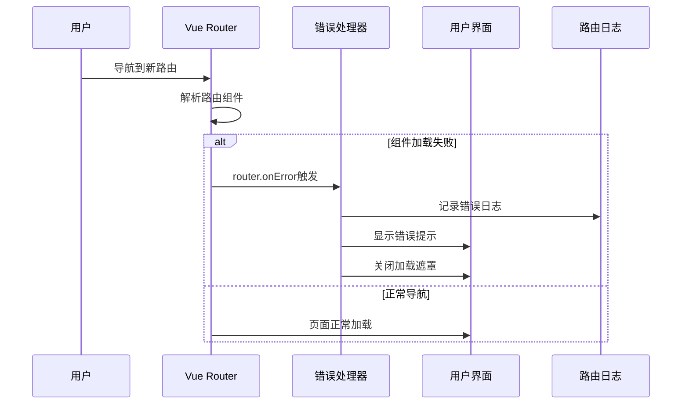

**图表来源**
- [router/index.js](file://frontend/src/router/index.js#L353-L359)

### 异步组件加载失败处理

系统对懒加载组件的异常有专门的处理机制：

| 错误类型 | 触发条件 | 处理策略 | 用户反馈 |
|---------|---------|---------|---------|
| 组件解析失败 | 路由配置错误或组件文件缺失 | 路由重定向到404页面 | 显示通用错误提示 |
| 网络加载超时 | 组件包下载失败或网络中断 | 自动重试机制 | 提示刷新重试 |
| 语法错误 | 组件代码存在语法问题 | 错误边界捕获 | 开发环境显示详细错误 |

**章节来源**
- [router/index.js](file://frontend/src/router/index.js#L353-L359)

### 路由解析错误处理

对于路由路径解析错误，系统实现了智能的错误恢复机制：

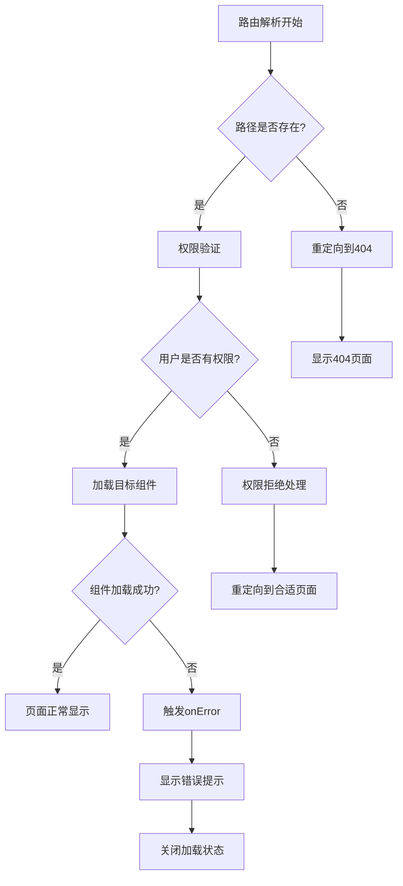

**图表来源**
- [router/index.js](file://frontend/src/router/index.js#L234-L335)

**章节来源**
- [router/index.js](file://frontend/src/router/index.js#L353-L359)

## 用户反馈策略

### Element Plus友好提示机制

系统采用Element Plus的ElMessage.error组件提供统一的错误提示，确保用户体验的一致性。

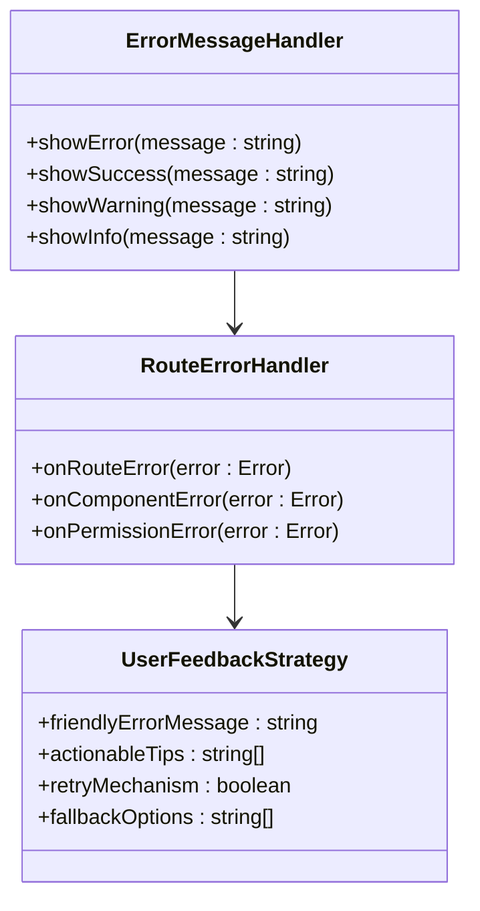

**图表来源**
- [router/index.js](file://frontend/src/router/index.js#L355-L356)

### 错误提示模板

系统定义了标准化的错误提示模板：

| 错误级别 | 提示内容 | 显示方式 | 持续时间 |
|---------|---------|---------|---------|
| 严重错误 | "页面加载失败，请刷新重试" | ElMessage.error | 持续显示 |
| 警告信息 | "网络连接不稳定，请稍后重试" | ElMessage.warning | 5秒 |
| 成功操作 | "操作成功完成" | ElMessage.success | 3秒 |
| 信息提示 | "正在加载数据..." | ElMessage.info | 自动消失 |

### 用户交互设计原则

1. **即时反馈**：错误发生后立即向用户反馈
2. **明确指导**：提供具体的解决步骤
3. **可操作性**：包含刷新、返回等操作选项
4. **友好语气**：使用用户易理解的语言

**章节来源**
- [router/index.js](file://frontend/src/router/index.js#L355-L356)

## 全局加载状态管理

### 加载状态事件机制

系统通过自定义DOM事件实现全局加载状态的统一管理，确保不会出现加载遮罩永久悬挂的问题。

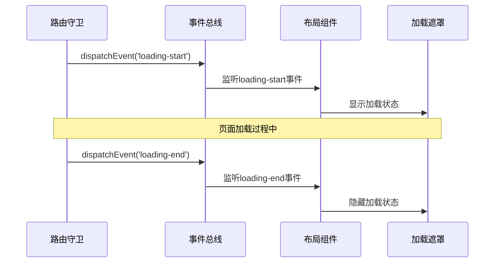

**图表来源**
- [router/index.js](file://frontend/src/router/index.js#L339-L341)
- [components/Layout/Layout.vue](file://frontend/src/components/Layout/Layout.vue#L50-L65)

### 加载状态兜底机制

系统实现了多重保障机制防止加载状态异常：

| 保障层级 | 实现方式 | 触发条件 | 恢复策略 |
|---------|---------|---------|---------|
| 路由守卫 | beforeEach中触发loading-start | 每次路由导航 | 确保开始事件 |
| 路由错误 | onError中触发loading-end | 路由错误发生 | 强制结束状态 |
| 组件卸载 | afterEach中确保状态清理 | 组件销毁 | 清理残留事件 |
| 时间限制 | 自动超时恢复 | 加载超过30秒 | 强制关闭遮罩 |

### 布局组件加载状态监听

布局组件通过事件监听机制实现全局加载状态的响应：

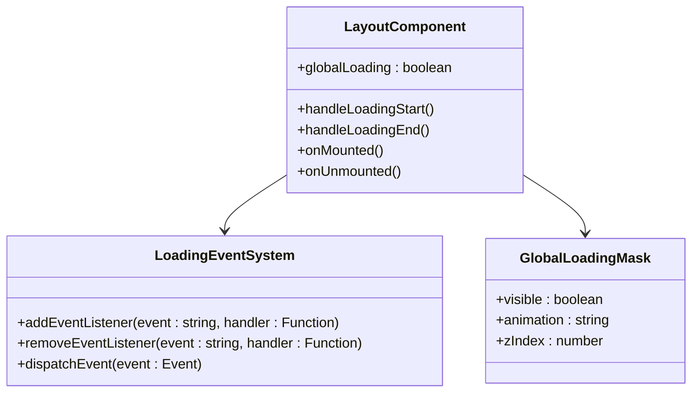

**图表来源**
- [components/Layout/Layout.vue](file://frontend/src/components/Layout/Layout.vue#L48-L74)

**章节来源**
- [router/index.js](file://frontend/src/router/index.js#L339-L359)
- [components/Layout/Layout.vue](file://frontend/src/components/Layout/Layout.vue#L48-L74)

## 错误日志记录系统

### RouteLogger核心功能

RouteLogger是系统的核心错误日志记录工具，提供了完整的错误追踪和分析能力。

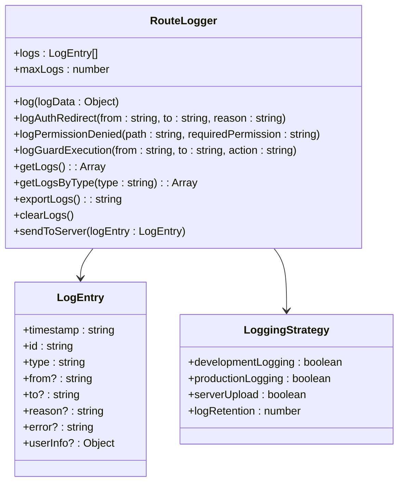

**图表来源**
- [utils/routeLogger.js](file://frontend/src/utils/routeLogger.js#L4-L233)

### 日志记录策略

系统根据环境不同采用差异化的日志记录策略：

| 环境类型 | 日志级别 | 存储位置 | 上报频率 | 保留期限 |
|---------|---------|---------|---------|---------|
| 开发环境 | 详细 | 控制台 + 内存 | 实时 | 无限制 |
| 测试环境 | 中等 | 控制台 + 文件 | 每小时 | 7天 |
| 生产环境 | 关键 | 内存 + 服务器 | 每日汇总 | 30天 |

### 错误分类与统计

系统对不同类型的错误进行分类统计：

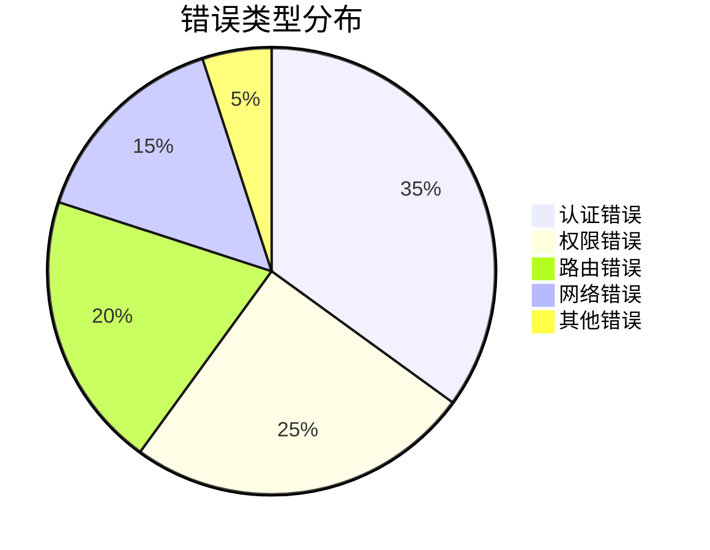

**图表来源**
- [utils/routeLogger.js](file://frontend/src/utils/routeLogger.js#L203-L225)

**章节来源**
- [utils/routeLogger.js](file://frontend/src/utils/routeLogger.js#L1-L233)

## 调试与监控方案

### 性能监控集成

系统集成了全面的性能监控机制，能够实时跟踪路由相关的性能指标。

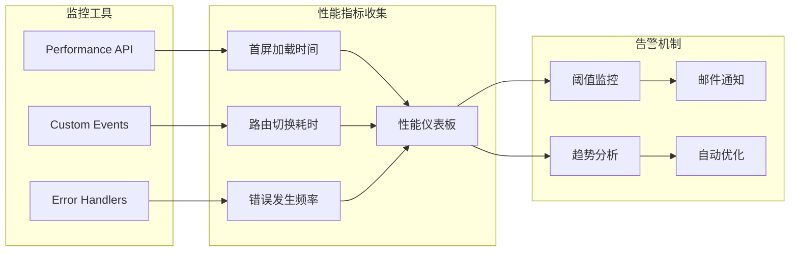

**图表来源**
- [utils/concurrencyStabilityTest.js](file://frontend/src/utils/concurrencyStabilityTest.js#L315-L362)
- [utils/performanceMonitor.js](file://frontend/src/utils/performanceMonitor.js#L220-L277)

### 开发环境调试工具

在开发环境中，系统提供了丰富的调试工具：

| 调试功能 | 实现方式 | 使用场景 | 查看方式 |
|---------|---------|---------|---------|
| 路由日志 | 控制台输出 | 路由导航调试 | 浏览器控制台 |
| 性能分析 | Performance API | 性能瓶颈定位 | DevTools Timeline |
| 错误堆栈 | 原生错误处理 | 异常原因追踪 | 错误面板 |
| 状态检查 | 全局变量暴露 | 应用状态调试 | window对象 |

### 生产环境监控

生产环境采用轻量级监控方案，重点关注关键错误：

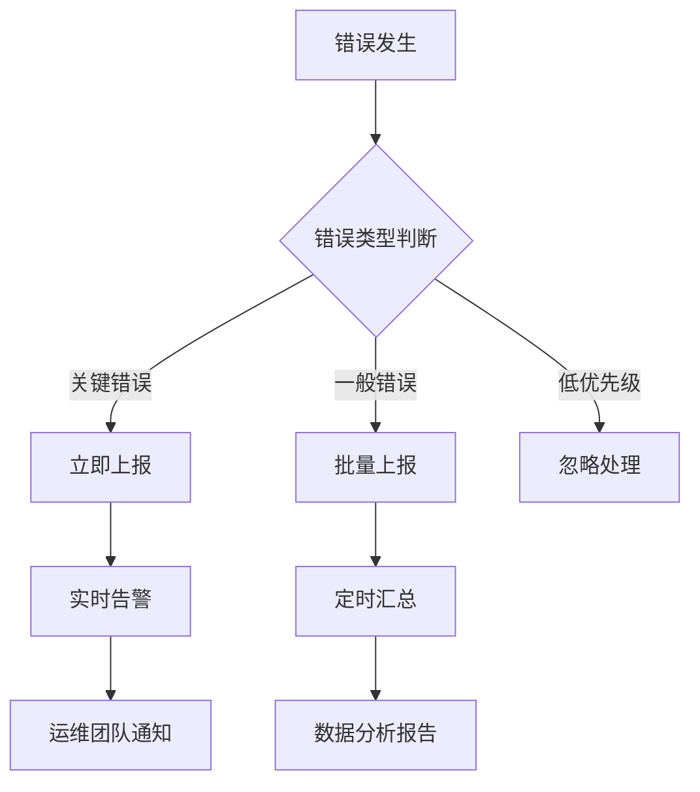

**图表来源**
- [utils/routeLogger.js](file://frontend/src/utils/routeLogger.js#L173-L196)

**章节来源**
- [utils/concurrencyStabilityTest.js](file://frontend/src/utils/concurrencyStabilityTest.js#L315-L362)
- [utils/performanceMonitor.js](file://frontend/src/utils/performanceMonitor.js#L220-L277)

## 常见错误场景与排查

### 模拟路由错误测试

系统提供了完整的错误模拟和测试机制，帮助开发者识别潜在问题。

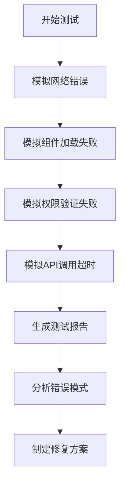

**图表来源**
- [utils/concurrencyStabilityTest.js](file://frontend/src/utils/concurrencyStabilityTest.js#L198-L254)

### 常见错误场景列表

| 错误类型 | 症状表现 | 可能原因 | 排查方法 |
|---------|---------|---------|---------|
| 路由404 | 显示404页面 | 路由配置错误 | 检查routes数组 |
| 权限拒绝 | 重定向到登录页 | 用户权限不足 | 检查meta.requiresAuth |
| 组件加载失败 | 白屏或错误提示 | 组件文件缺失 | 检查import路径 |
| 网络超时 | 加载长时间无响应 | 网络连接问题 | 检查网络状态 |
| Token过期 | 认证失败 | JWT过期 | 检查token有效期 |

### 调试工具使用指南

系统提供了多种调试工具帮助快速定位问题：

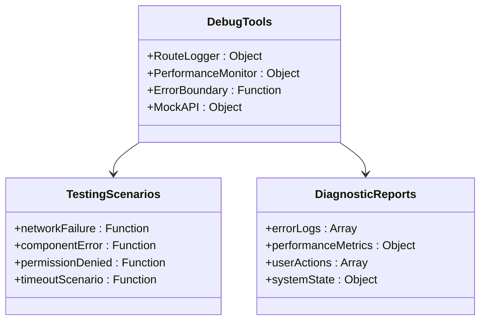

**图表来源**
- [utils/concurrencyStabilityTest.js](file://frontend/src/utils/concurrencyStabilityTest.js#L198-L254)

**章节来源**
- [utils/concurrencyStabilityTest.js](file://frontend/src/utils/concurrencyStabilityTest.js#L198-L254)

## 最佳实践建议

### 错误处理设计原则

1. **防御性编程**：对所有可能的异常情况进行处理
2. **渐进式降级**：提供多层次的错误恢复机制
3. **用户体验优先**：确保错误处理不影响整体用户体验
4. **可维护性**：保持错误处理代码的简洁和可读性

### 性能优化建议

1. **懒加载优化**：合理使用异步组件减少初始加载时间
2. **缓存策略**：实现智能缓存避免重复加载
3. **错误重试**：对临时性错误提供自动重试机制
4. **资源预加载**：预测用户行为提前加载可能需要的资源

### 监控和维护

1. **定期审查**：定期检查错误日志找出潜在问题
2. **性能基准**：建立性能基线监控系统健康状况
3. **用户反馈**：收集用户反馈改进错误处理体验
4. **持续优化**：根据监控数据不断优化错误处理策略

### 团队协作规范

1. **错误分类标准**：建立统一的错误分类和命名规范
2. **文档维护**：及时更新错误处理文档和最佳实践
3. **知识分享**：定期组织错误处理经验分享会
4. **培训计划**：为新团队成员提供错误处理培训

通过这套完整的路由异常捕获与容错机制，系统能够在面对各种运行时异常时保持稳定性和可用性，同时为用户提供良好的使用体验。这套机制不仅解决了当前的问题，还为未来的功能扩展和系统优化奠定了坚实的基础。