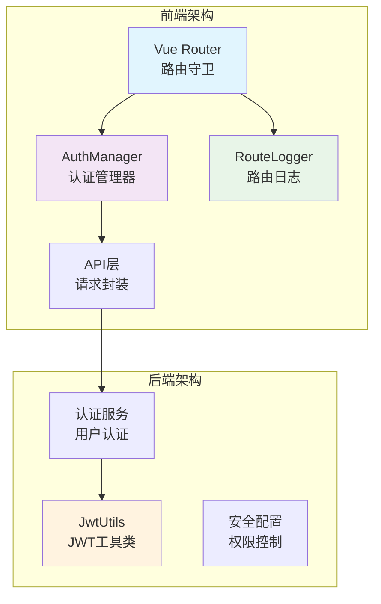
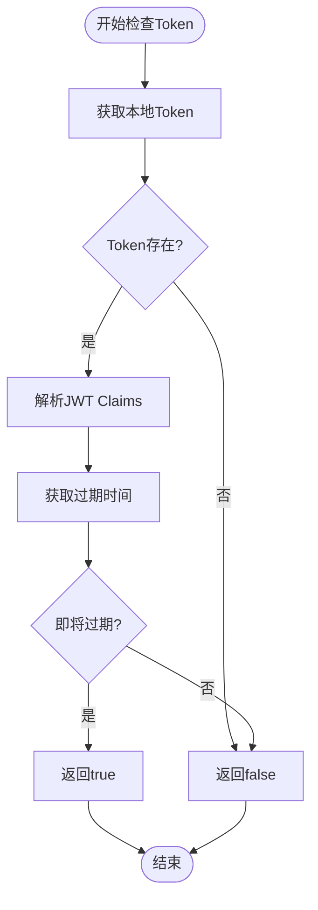
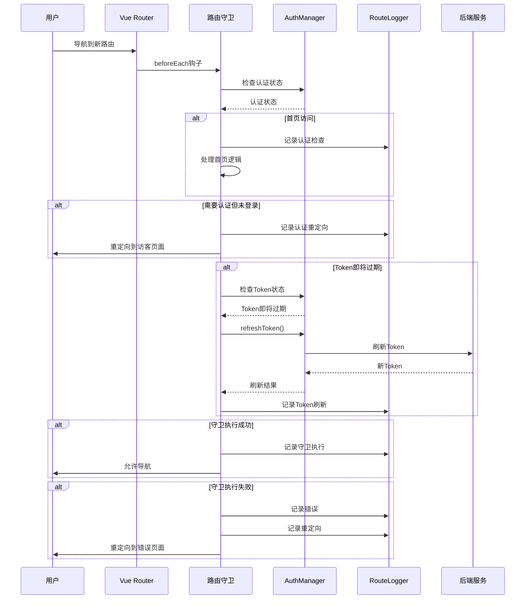
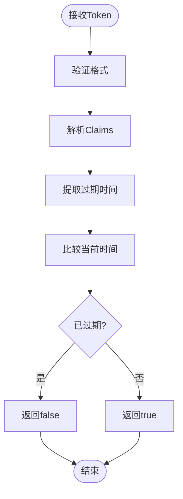
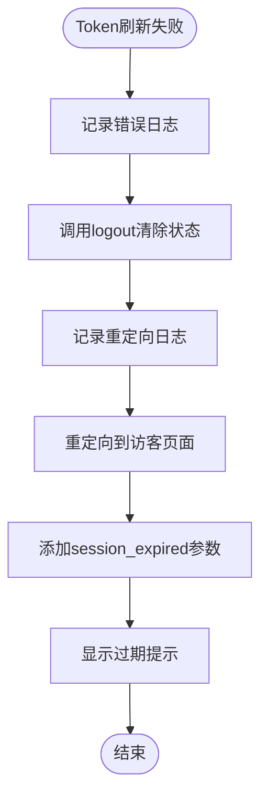
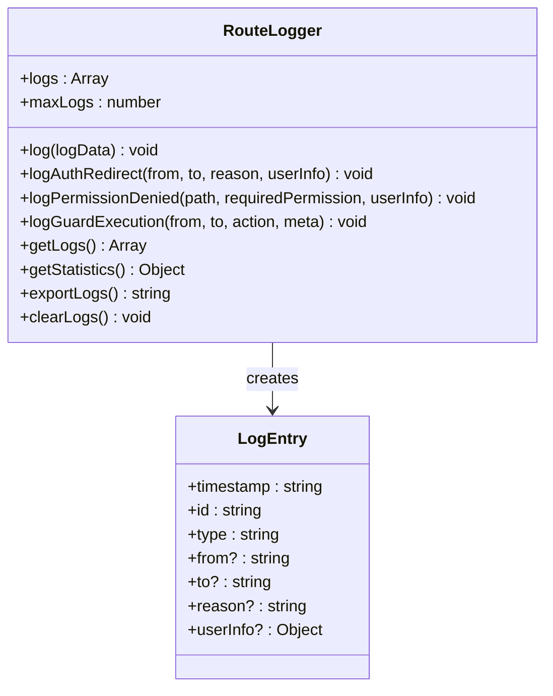

# Token刷新与异常处理

<cite>
**本文档引用的文件**
- [auth.js](file://frontend/src/utils/auth.js)
- [router/index.js](file://frontend/src/router/index.js)
- [routeLogger.js](file://frontend/src/utils/routeLogger.js)
- [auth.js](file://frontend/src/api/auth.js)
- [realApi.js](file://frontend/src/api/realApi.js)
- [JwtUtils.java](file://backend/src/main/java/com/carwash/utils/JwtUtils.java)
- [loginDiagnostic.js](file://backup/test-files-backup/loginDiagnostic.js)
</cite>

## 目录
1. [引言](#引言)
2. [系统架构概述](#系统架构概述)
3. [AuthManager核心组件](#authmanager核心组件)
4. [路由守卫机制](#路由守卫机制)
5. [Token生命周期管理](#token生命周期管理)
6. [异常处理机制](#异常处理机制)
7. [日志记录系统](#日志记录系统)
8. [性能考虑](#性能考虑)
9. [故障排除指南](#故障排除指南)
10. [总结](#总结)

## 引言

本文档详细解析了汽车洗车服务预约系统中的Token生命周期管理机制，重点关注AuthManager的isTokenExpiring()和refreshToken()方法的设计意图与实现框架。系统采用JWT（JSON Web Token）作为认证令牌，通过路由守卫在每次路由导航时检查Token状态，并提供完善的异常处理和日志记录机制。

## 系统架构概述

系统采用前后端分离架构，前端使用Vue.js构建单页应用，后端基于Spring Boot提供RESTful API服务。认证机制的核心组件包括：

**图表来源**
- [router/index.js](file://frontend/src/router/index.js#L208-L336)
- [auth.js](file://frontend/src/utils/auth.js#L7-L214)
- [JwtUtils.java](file://backend/src/main/java/com/carwash/utils/JwtUtils.java#L1-L134)

## AuthManager核心组件

### 设计意图

AuthManager作为认证管理器，负责维护用户的认证状态和提供权限检查功能。其设计遵循单一职责原则，专注于认证相关的业务逻辑。

### 核心方法分析

#### isTokenExpiring()方法

该方法目前采用占位实现，返回false值。实际实现应该检查JWT的过期时间：

**图表来源**
- [auth.js](file://frontend/src/utils/auth.js#L165-L169)

#### refreshToken()方法

该方法同样采用占位实现，直接返回true。实际实现应该：

1. 调用后端刷新Token接口
2. 验证新Token的有效性
3. 更新本地存储的Token信息
4. 返回刷新结果

**节段来源**
- [auth.js](file://frontend/src/utils/auth.js#L171-L175)

### 权限检查机制

AuthManager提供了多层次的权限检查功能：

| 方法 | 功能 | 返回值 |
|------|------|--------|
| isAuthenticated() | 检查是否已登录 | boolean |
| getUserRole() | 获取用户角色 | string \| null |
| isAdmin() | 检查是否为管理员 | boolean |
| hasPermission(permission) | 检查具体权限 | boolean |

**节段来源**
- [auth.js](file://frontend/src/utils/auth.js#L34-L72)

## 路由守卫机制

### 守卫执行流程

路由守卫在每次路由导航时执行，按照严格的顺序检查各种条件：

**图表来源**
- [router/index.js](file://frontend/src/router/index.js#L208-L336)

### Token刷新时机选择

系统在以下情况下触发Token刷新：

1. **每次路由导航时**：在路由守卫中检查Token状态
2. **认证状态下**：只有在用户已登录的情况下才进行检查
3. **即将过期时**：通过isTokenExpiring()判断

这种设计确保了：
- Token始终处于有效状态
- 用户体验的连续性
- 后端资源的合理利用

**节段来源**
- [router/index.js](file://frontend/src/router/index.js#L292-L311)

## Token生命周期管理

### JWT Token结构

系统使用标准的JWT Token，包含以下部分：

| 部分 | 内容 | 用途 |
|------|------|------|
| Header | 算法标识、Token类型 | 指定签名算法 |
| Payload | 用户信息、过期时间、签发时间 | 存储用户身份和有效期 |
| Signature | 签名验证 | 确保Token完整性 |

### 过期时间检查

后端JwtUtils提供了完整的Token过期检查功能：

**图表来源**
- [JwtUtils.java](file://backend/src/main/java/com/carwash/utils/JwtUtils.java#L119-L125)

### 刷新策略

虽然当前实现为占位逻辑，但理想的刷新策略应包括：

1. **静默刷新**：在后台自动刷新Token
2. **重试机制**：刷新失败时的重试逻辑
3. **降级处理**：刷新服务不可用时的处理方案

**节段来源**
- [auth.js](file://frontend/src/utils/auth.js#L171-L175)

## 异常处理机制

### 刷新失败处理流程

当Token刷新失败时，系统执行以下步骤：

**图表来源**
- [router/index.js](file://frontend/src/router/index.js#L302-L309)

### 全局错误捕获

系统实现了全面的错误捕获机制：

| 错误类型 | 处理方式 | 影响范围 |
|----------|----------|----------|
| 守卫执行错误 | 记录guard_error日志 | 整个路由系统 |
| Token刷新失败 | 清除状态并重定向 | 当前导航 |
| API调用失败 | 显示错误提示 | 具体功能模块 |
| 网络连接错误 | 提供离线提示 | 所有网络操作 |

### 异常恢复机制

1. **状态清理**：调用AuthManager.logout()清除所有认证信息
2. **用户引导**：重定向到访客页面并传递错误原因
3. **日志记录**：详细记录错误信息便于调试
4. **用户体验**：提供友好的错误提示

**节段来源**
- [router/index.js](file://frontend/src/router/index.js#L317-L335)

## 日志记录系统

### RouteLogger设计

RouteLogger提供了完整的路由日志记录功能：

**图表来源**
- [routeLogger.js](file://frontend/src/utils/routeLogger.js#L4-L226)

### 日志类型与用途

| 日志类型 | 记录内容 | 用途 |
|----------|----------|------|
| auth_redirect | 路由重定向原因 | 分析权限问题 |
| permission_denied | 权限检查失败 | 监控权限配置 |
| guard_execution | 守卫执行情况 | 性能监控 |
| token_refresh | Token刷新结果 | 认证状态跟踪 |
| guard_error | 守卫执行错误 | 故障诊断 |

### 日志存储与管理

1. **内存存储**：最多保留100条日志
2. **自动清理**：超出限制时移除最旧日志
3. **导出功能**：支持JSON格式导出
4. **统计分析**：提供日志统计信息

**节段来源**
- [routeLogger.js](file://frontend/src/utils/routeLogger.js#L1-L233)

## 性能考虑

### 异步处理优化

1. **非阻塞设计**：路由守卫使用async/await，不影响用户体验
2. **并发控制**：防止多个刷新请求同时执行
3. **缓存策略**：避免频繁的Token检查

### 内存管理

1. **日志限制**：控制日志数量防止内存泄漏
2. **状态清理**：及时清理无效的认证状态
3. **事件监听**：正确管理DOM事件监听器

### 网络优化

1. **请求合并**：减少不必要的API调用
2. **超时设置**：合理的请求超时时间
3. **错误重试**：智能的重试机制

## 故障排除指南

### 常见问题诊断

#### Token刷新失败

**症状**：用户看到"会话已过期"提示
**诊断步骤**：
1. 检查网络连接状态
2. 验证后端认证服务可用性
3. 查看浏览器控制台错误信息
4. 检查Token格式和有效性

**解决方案**：
- 清除浏览器缓存和Cookie
- 重新登录系统
- 联系技术支持

#### 路由守卫异常

**症状**：页面无法正常导航
**诊断步骤**：
1. 检查路由配置是否正确
2. 验证权限配置
3. 查看RouteLogger日志
4. 检查浏览器兼容性

**解决方案**：
- 重启应用
- 清除认证状态
- 检查权限配置

### 调试工具

系统提供了多种调试工具：

| 工具 | 用途 | 访问方式 |
|------|------|----------|
| RouteLogger | 路由日志查看 | 控制台输入RouteLogger |
| AuthManager | 认证状态检查 | 控制台输入AuthManager |
| LoginDiagnostic | 登录问题诊断 | 专用诊断页面 |

**节段来源**
- [loginDiagnostic.js](file://backup/test-files-backup/loginDiagnostic.js#L1-L420)

## 总结

汽车洗车服务预约系统的Token生命周期管理机制体现了现代Web应用的安全性和用户体验平衡。通过AuthManager的统一认证管理、路由守卫的严格权限控制、以及完善的异常处理和日志记录系统，确保了系统的安全性、可靠性和可维护性。

### 关键特性

1. **自动化Token管理**：无需用户手动干预的Token刷新机制
2. **全面的异常处理**：多层次的错误捕获和恢复机制
3. **详细的日志记录**：完整的审计跟踪和故障诊断能力
4. **灵活的权限控制**：基于角色的细粒度权限管理
5. **优秀的用户体验**：平滑的认证状态转换和错误提示

### 改进建议

1. **实现真正的Token刷新逻辑**：集成JWT过期检查和自动刷新
2. **增强错误恢复能力**：提供更多的自动恢复选项
3. **优化性能监控**：增加更多性能指标的收集和分析
4. **完善测试覆盖**：增加单元测试和集成测试

这套Token生命周期管理机制为系统的安全运行提供了坚实的基础，同时也为未来的功能扩展和性能优化留下了充足的空间。