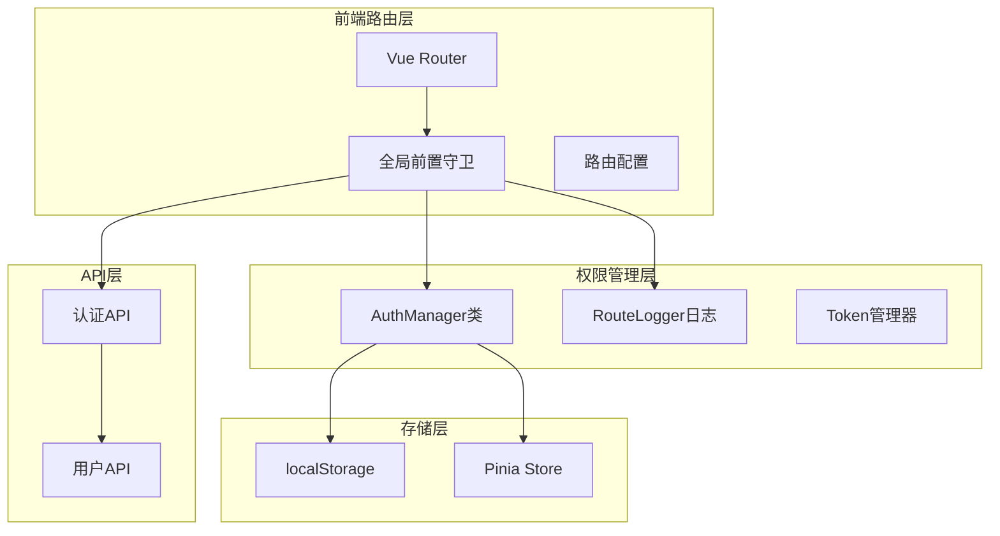
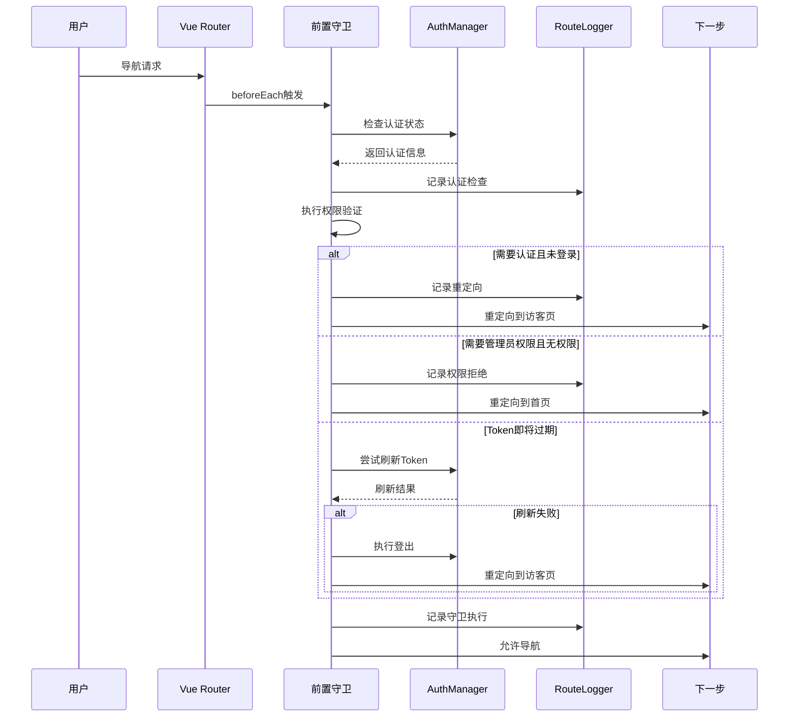
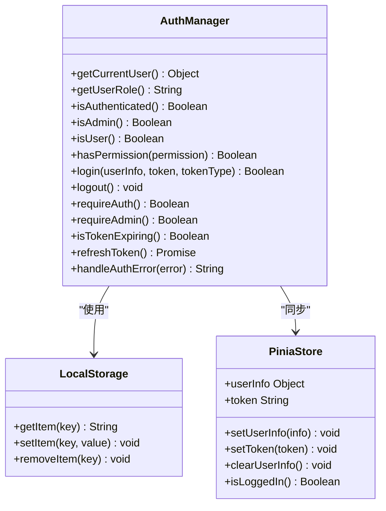
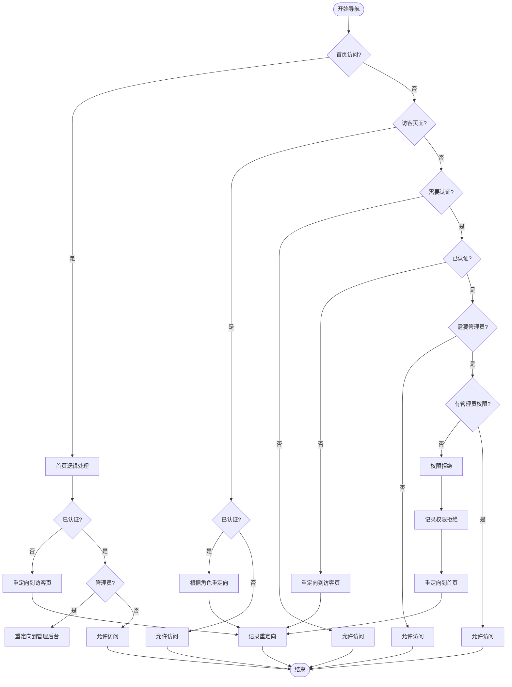
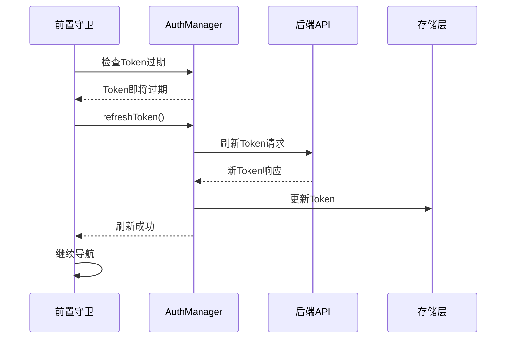
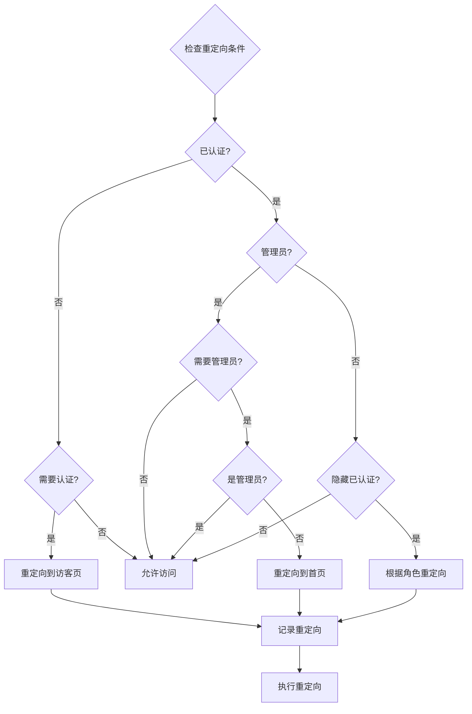
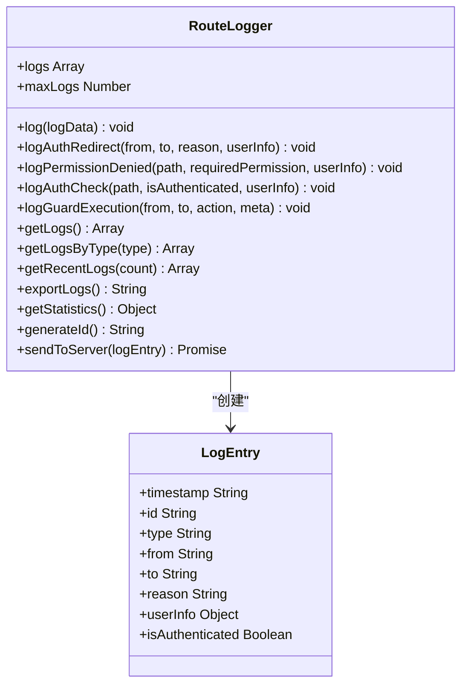
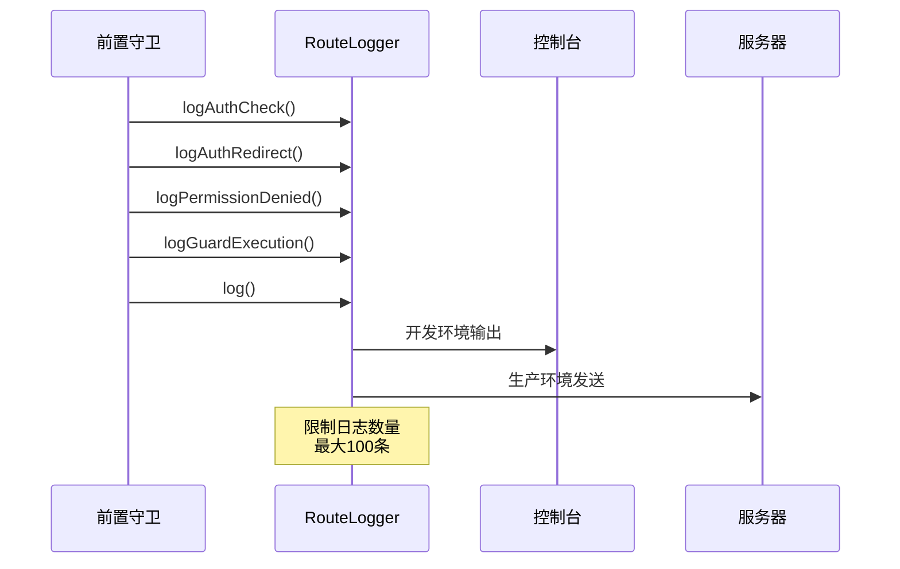

# Vue Router全局前置守卫深度分析

<cite>
**本文档引用的文件**
- [router/index.js](file://frontend/src/router/index.js)
- [auth.js](file://frontend/src/utils/auth.js)
- [routeLogger.js](file://frontend/src/utils/routeLogger.js)
- [auth.js](file://frontend/src/api/auth.js)
- [user.js](file://frontend/src/stores/user.js)
- [Login.vue](file://frontend/src/views/Login.vue)
- [AdminTest.vue](file://frontend/src/views/AdminTest.vue)
- [Admin.vue](file://frontend/src/views/Admin.vue)
</cite>

## 目录
1. [引言](#引言)
2. [系统架构概览](#系统架构概览)
3. [核心组件分析](#核心组件分析)
4. [守卫执行流程详解](#守卫执行流程详解)
5. [权限控制逻辑](#权限控制逻辑)
6. [Token刷新机制](#token刷新机制)
7. [自动重定向策略](#自动重定向策略)
8. [日志记录系统](#日志记录系统)
9. [性能优化与最佳实践](#性能优化与最佳实践)
10. [故障排除指南](#故障排除指南)
11. [总结](#总结)

## 引言

Vue Router全局前置守卫是汽车洗车服务预约系统权限控制的核心组件，负责在每个路由导航过程中执行认证状态检查、权限验证和自动重定向。本文档深入分析守卫的执行流程、权限控制逻辑、Token刷新机制以及日志记录系统的协同工作机制。

## 系统架构概览

系统采用分层架构设计，包含路由层、权限管理层、存储层和API层：



**图表来源**
- [router/index.js](file://frontend/src/router/index.js#L203-L205)
- [auth.js](file://frontend/src/utils/auth.js#L1-L214)
- [routeLogger.js](file://frontend/src/utils/routeLogger.js#L1-L233)

## 核心组件分析

### Vue Router前置守卫

前置守卫是整个权限控制系统的核心入口，负责拦截所有路由导航请求：



**图表来源**
- [router/index.js](file://frontend/src/router/index.js#L208-L336)

### AuthManager权限管理器

AuthManager类提供了完整的权限管理功能，包括认证状态检查、角色验证和权限控制：



**图表来源**
- [auth.js](file://frontend/src/utils/auth.js#L7-L214)
- [user.js](file://frontend/src/stores/user.js#L1-L40)

**章节来源**
- [router/index.js](file://frontend/src/router/index.js#L208-L336)
- [auth.js](file://frontend/src/utils/auth.js#L1-L214)

## 守卫执行流程详解

### 1. 初始化阶段

守卫执行的第一步是收集必要的认证和权限信息：

| 检查项 | 方法 | 用途 | 返回值 |
|--------|------|------|--------|
| 认证状态 | `AuthManager.isAuthenticated()` | 检查用户是否已登录 | `Boolean` |
| 用户角色 | `AuthManager.getUserRole()` | 获取用户角色信息 | `'admin' \| 'user' \| null` |
| 用户信息 | `AuthManager.getCurrentUser()` | 获取完整用户信息 | `Object \| null` |

### 2. 路由元信息解析

系统通过路由元信息定义权限要求：

| 元信息字段 | 类型 | 说明 | 示例 |
|------------|------|------|------|
| `requiresAuth` | `Boolean` | 是否需要登录 | `true` |
| `requiresAdmin` | `Boolean` | 是否需要管理员权限 | `true` |
| `guestOnly` | `Boolean` | 仅访客可访问 | `true` |
| `hideForAuth` | `Boolean` | 已登录用户隐藏 | `true` |

### 3. 权限验证顺序

守卫按照以下优先级执行权限验证：



**图表来源**
- [router/index.js](file://frontend/src/router/index.js#L235-L290)

**章节来源**
- [router/index.js](file://frontend/src/router/index.js#L208-L336)

## 权限控制逻辑

### 认证状态检查（isAuthenticated）

认证状态检查是权限控制的基础，通过组合Token和用户信息来判断：

```javascript
static isAuthenticated() {
  const token = localStorage.getItem("token");
  const user = this.getCurrentUser();
  return !!(token && user);
}
```

### 角色权限验证（isAdmin）

管理员权限验证通过比较用户角色来实现：

```javascript
static isAdmin() {
  const role = this.getUserRole();
  return role === "admin";
}
```

### 权限矩阵

系统支持基于角色的访问控制（RBAC），定义了详细的权限矩阵：

| 角色 | 权限类型 | 允许的操作 |
|------|----------|------------|
| 管理员 | 系统管理 | 所有操作 |
| 普通用户 | 个人中心 | 查看个人信息 |
| 普通用户 | 预约管理 | 创建、查看预约 |
| 普通用户 | 服务浏览 | 查看服务项目 |

### 权限检查装饰器

系统提供了便捷的权限检查装饰器：

```javascript
// 要求认证
static requireAuth() {
  if (!this.isAuthenticated()) {
    throw new Error("REQUIRE_AUTH");
  }
  return true;
}

// 要求管理员权限
static requireAdmin() {
  if (!this.isAuthenticated()) {
    throw new Error("REQUIRE_AUTH");
  }
  if (!this.isAdmin()) {
    throw new Error("REQUIRE_ADMIN");
  }
  return true;
}
```

**章节来源**
- [auth.js](file://frontend/src/utils/auth.js#L34-L163)

## Token刷新机制

### Token过期检测

系统实现了智能的Token过期检测机制：

```javascript
static isTokenExpiring() {
  // 这里可以添加JWT Token过期检查逻辑
  return false;
}
```

### Token刷新流程

当检测到Token即将过期时，系统会自动尝试刷新：



**图表来源**
- [router/index.js](file://frontend/src/router/index.js#L293-L311)

### Token刷新错误处理

如果Token刷新失败，系统会执行安全的登出操作：

```javascript
try {
  await AuthManager.refreshToken()
  RouteLogger.log({
    type: 'token_refresh',
    path: to.path,
    success: true
  })
} catch (error) {
  console.error('Token刷新失败:', error)
  AuthManager.logout()
  RouteLogger.logAuthRedirect(to.path, 'guest', 'token_refresh_failed')
  next({
    path: 'guest',
    query: { redirect: to.fullPath, reason: 'session_expired' }
  })
}
```

**章节来源**
- [router/index.js](file://frontend/src/router/index.js#L293-L311)
- [auth.js](file://frontend/src/utils/auth.js#L166-L175)

## 自动重定向策略

### 重定向规则矩阵

系统根据不同的场景实现了智能的重定向策略：

| 场景 | 条件 | 目标路径 | 说明 |
|------|------|----------|------|
| 未认证访问受保护页面 | `requiresAuth && !isAuthenticated` | `/guest` | 重定向到访客页面 |
| 已认证访问登录页面 | `meta.hideForAuth && isAuthenticated` | 根据角色重定向 | 防止已登录用户访问登录页 |
| 管理员访问受保护页面 | `requiresAdmin && !isAdmin` | `/` | 权限不足时重定向到首页 |
| 未认证访问管理员页面 | `requiresAdmin && !isAuthenticated` | `/guest` | 未认证时重定向到访客页 |

### 智能重定向逻辑



**图表来源**
- [router/index.js](file://frontend/src/router/index.js#L235-L290)

### 重定向参数传递

系统通过查询参数传递重定向信息：

```javascript
next({
  path: 'guest',
  query: { 
    redirect: to.fullPath,  // 原始访问路径
    reason: 'login_required'  // 重定向原因
  }
})
```

**章节来源**
- [router/index.js](file://frontend/src/router/index.js#L235-L290)

## 日志记录系统

### RouteLogger功能架构

RouteLogger提供了完整的路由日志记录功能，支持多种日志类型：



**图表来源**
- [routeLogger.js](file://frontend/src/utils/routeLogger.js#L4-L233)

### 日志类型与用途

| 日志类型 | 用途 | 关键字段 |
|----------|------|----------|
| `auth_redirect` | 认证重定向 | `from`, `to`, `reason`, `userInfo` |
| `permission_denied` | 权限拒绝 | `path`, `requiredPermission`, `userInfo` |
| `auth_check` | 认证状态检查 | `path`, `isAuthenticated`, `userInfo` |
| `guard_execution` | 守卫执行 | `from`, `to`, `action`, `meta` |
| `token_refresh` | Token刷新 | `path`, `success` |
| `guard_error` | 守卫错误 | `from`, `to`, `error` |

### 日志记录时机

系统在关键节点记录详细的日志信息：



**图表来源**
- [routeLogger.js](file://frontend/src/utils/routeLogger.js#L12-L34)

### 日志统计与分析

RouteLogger提供了丰富的统计功能：

```javascript
static getStatistics() {
  const stats = {
    total: this.logs.length,
    byType: {},
    recentActivity: this.logs.slice(0, 5),
    authRedirects: 0,
    permissionDenied: 0
  }
  
  this.logs.forEach(log => {
    // 按类型统计
    stats.byType[log.type] = (stats.byType[log.type] || 0) + 1
    
    // 特殊统计
    if (log.type === 'auth_redirect') {
      stats.authRedirects++
    } else if (log.type === 'permission_denied') {
      stats.permissionDenied++
    }
  })
  
  return stats
}
```

**章节来源**
- [routeLogger.js](file://frontend/src/utils/routeLogger.js#L1-L233)

## 性能优化与最佳实践

### 异步操作处理

守卫中的异步操作需要特别注意避免死循环和阻塞：

```javascript
// 正确的异步处理方式
try {
  if (isAuthenticated && AuthManager.isTokenExpiring()) {
    await AuthManager.refreshToken()
    // 继续导航
    next()
  }
} catch (error) {
  // 错误处理
  AuthManager.logout()
  next({ path: 'guest' })
}

// 避免的死循环写法
let retryCount = 0
while (retryCount < 3) {
  try {
    await AuthManager.refreshToken()
    break
  } catch (error) {
    retryCount++
    // 可能导致无限循环
  }
}
```

### 性能优化建议

1. **缓存认证状态检查结果**
   ```javascript
   // 在组件中缓存认证状态
   const isAuthenticated = computed(() => AuthManager.isAuthenticated())
   ```

2. **延迟加载组件**
   ```javascript
   const Admin = () => import('../views/Admin.vue')
   ```

3. **优化日志记录**
   ```javascript
   // 生产环境减少日志输出
   if (process.env.NODE_ENV === 'production') {
     // 只记录重要日志
     if (['auth_redirect', 'permission_denied'].includes(logType)) {
       this.sendToServer(logEntry)
     }
   }
   ```

4. **批量处理权限检查**
   ```javascript
   // 批量检查多个权限
   const permissions = ['profile.view', 'bookings.create']
   const hasAllPermissions = permissions.every(p => AuthManager.hasPermission(p))
   ```

### 内存管理

系统实现了智能的内存管理策略：

```javascript
// 限制日志数量，防止内存泄漏
static maxLogs = 100
if (this.logs.length > this.maxLogs) {
  this.logs = this.logs.slice(0, this.maxLogs)
}
```

**章节来源**
- [router/index.js](file://frontend/src/router/index.js#L234-L336)
- [routeLogger.js](file://frontend/src/utils/routeLogger.js#L6-L25)

## 故障排除指南

### 常见问题与解决方案

#### 1. Token刷新失败

**症状**: 用户Token过期后无法自动刷新

**排查步骤**:
1. 检查网络连接和API可用性
2. 验证后端Token刷新接口
3. 检查Token格式和有效期

**解决方案**:
```javascript
// 添加重试机制
async function refreshTokenWithRetry(maxRetries = 3) {
  for (let i = 0; i < maxRetries; i++) {
    try {
      return await AuthManager.refreshToken()
    } catch (error) {
      if (i === maxRetries - 1) throw error
      await new Promise(resolve => setTimeout(resolve, 1000 * (i + 1)))
    }
  }
}
```

#### 2. 权限验证错误

**症状**: 管理员无法访问管理页面

**排查步骤**:
1. 检查用户角色是否正确设置
2. 验证权限矩阵配置
3. 检查路由元信息设置

**解决方案**:
```javascript
// 添加权限调试信息
console.log('权限检查:', {
  isAuthenticated: AuthManager.isAuthenticated(),
  isAdmin: AuthManager.isAdmin(),
  userRole: AuthManager.getUserRole(),
  requiredAdmin: to.meta.requiresAdmin
})
```

#### 3. 日志记录异常

**症状**: RouteLogger记录失败

**排查步骤**:
1. 检查日志对象结构
2. 验证存储空间
3. 检查网络连接

**解决方案**:
```javascript
// 添加日志记录保护
static log(logData) {
  try {
    // 日志记录逻辑
  } catch (error) {
    console.error('日志记录失败:', error)
    // 降级处理
    this.fallbackLog(logData)
  }
}
```

### 调试工具

系统提供了丰富的调试工具：

```javascript
// 开发环境下的全局调试工具
if (process.env.NODE_ENV === 'development') {
  window.RouteLogger = RouteLogger
  window.AuthManager = AuthManager
}

// 路由状态监控
console.log('路由导航:', {
  to: to.path,
  from: from.path,
  isAuth: isAuthenticated,
  role: userRole,
  requiresAuth: to.meta.requiresAuth,
  requiresAdmin: to.meta.requiresAdmin
})
```

**章节来源**
- [router/index.js](file://frontend/src/router/index.js#L223-L232)
- [routeLogger.js](file://frontend/src/utils/routeLogger.js#L229-L233)

## 总结

Vue Router全局前置守卫作为汽车洗车服务预约系统权限控制的核心组件，实现了完整的认证状态检查、权限验证和自动重定向功能。通过AuthManager类的统一权限管理、RouteLogger的详细日志记录以及智能的Token刷新机制，系统确保了良好的用户体验和严格的安全控制。

### 关键特性

1. **多层次权限控制**: 基于角色的访问控制（RBAC）和细粒度权限验证
2. **智能重定向**: 根据用户状态和权限需求自动重定向到合适页面
3. **Token生命周期管理**: 自动检测和刷新Token，确保会话连续性
4. **完整日志记录**: 详细的路由日志帮助调试和监控系统行为
5. **性能优化**: 异步操作处理和内存管理确保系统高效运行

### 最佳实践

1. **遵循单一职责原则**: 每个守卫逻辑清晰，职责明确
2. **错误处理完善**: 全面的错误捕获和降级处理
3. **日志驱动开发**: 通过日志记录追踪系统行为
4. **性能优先**: 异步操作和缓存策略提升用户体验
5. **安全第一**: 多层次权限验证确保系统安全

这套权限守卫系统为汽车洗车服务预约系统提供了可靠的安全保障，同时保持了良好的用户体验和开发可维护性。