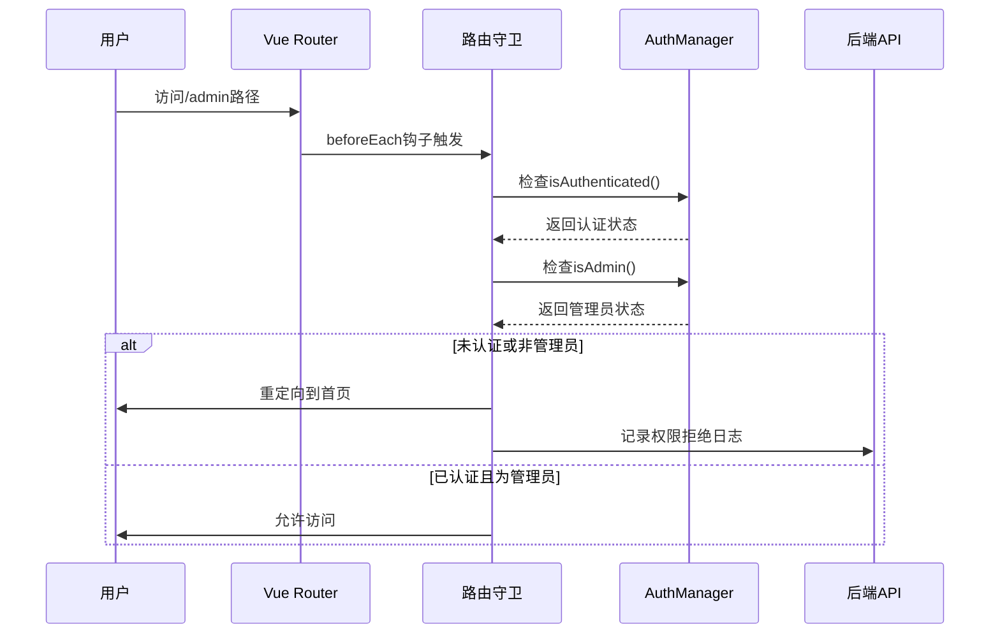
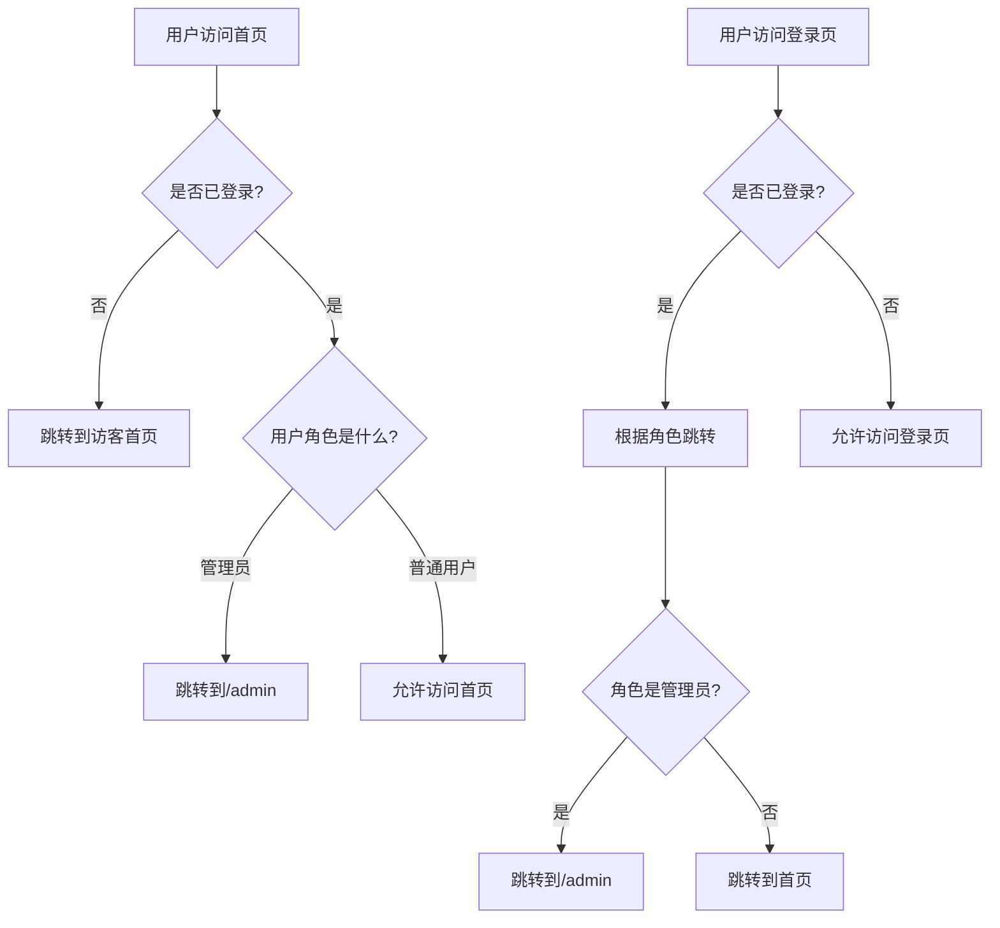
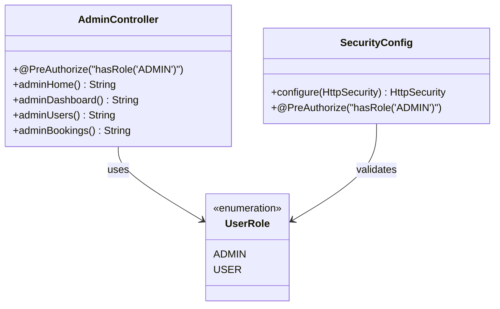
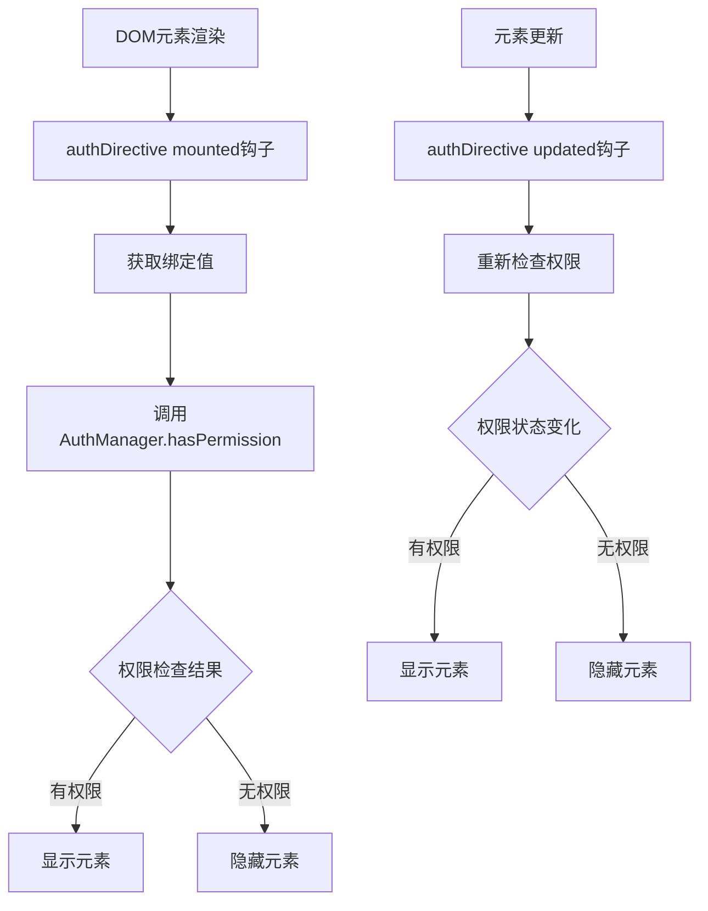
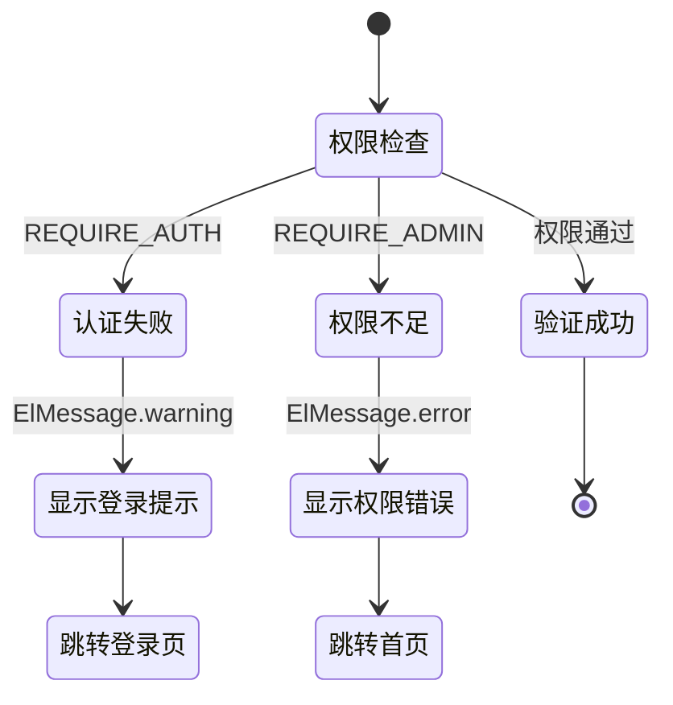
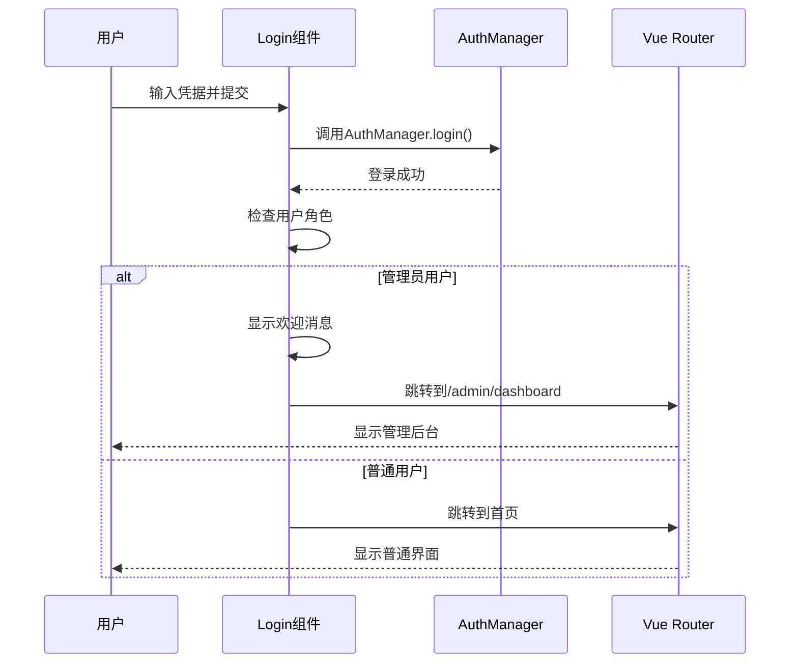
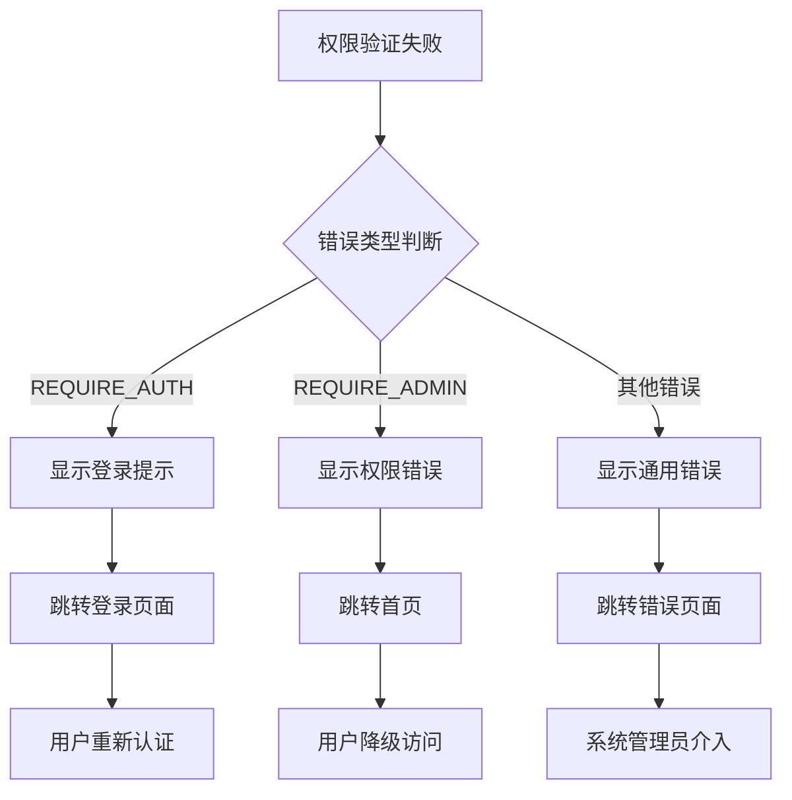
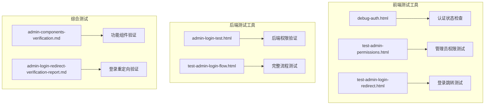

# 角色权限控制

<cite>
**本文档引用的文件**
- [auth.js](file://frontend/src/utils/auth.js)
- [Login.vue](file://frontend/src/views/Login.vue)
- [router/index.js](file://frontend/src/router/index.js)
- [Admin.vue](file://frontend/src/views/Admin.vue)
- [AdminController.java](file://backend/src/main/java/com/carwash/controller/AdminController.java)
- [SecurityConfig.java](file://backend/src/main/java/com/carwash/config/SecurityConfig.java)
- [test-admin-login-flow.html](file://frontend/public/test-admin-login-flow.html)
- [admin-login-test.html](file://frontend/public/admin-login-test.html)
- [test-admin-permissions.html](file://frontend/public/test-admin-permissions.html)
</cite>

## 目录
1. [引言](#引言)
2. [系统架构概览](#系统架构概览)
3. [AuthManager核心实现](#authmanager核心实现)
4. [路由守卫权限控制](#路由守卫权限控制)
5. [管理员专属页面权限验证](#管理员专属页面权限验证)
6. [前端权限指令实现](#前端权限指令实现)
7. [用户体验设计](#用户体验设计)
8. [安全策略与最佳实践](#安全策略与最佳实践)
9. [故障排除指南](#故障排除指南)
10. [总结](#总结)

## 引言

本系统采用基于角色的访问控制（RBAC）模型，实现了细粒度的权限管理机制。通过多层次的权限验证体系，确保不同角色的用户只能访问其权限范围内的资源，同时提供优秀的用户体验和强大的安全保障。

## 系统架构概览

系统采用前后端分离架构，权限控制贯穿整个应用栈：

```mermaid
graph TB
subgraph "前端层"
A[Vue Router] --> B[路由守卫]
B --> C[AuthManager]
C --> D[权限指令]
D --> E[DOM元素控制]
end
subgraph "后端层"
F[Spring Security] --> G[@PreAuthorize注解]
G --> H[角色验证]
H --> I[API权限控制]
end
subgraph "存储层"
J[JWT Token] --> K[用户信息]
K --> L[角色数据]
end
A --> F
C --> J
I --> M[数据库]
```

**图表来源**
- [router/index.js](file://frontend/src/router/index.js#L203-L336)
- [auth.js](file://frontend/src/utils/auth.js#L1-L214)
- [SecurityConfig.java](file://backend/src/main/java/com/carwash/config/SecurityConfig.java#L69-L133)

## AuthManager核心实现

### isAdmin()方法角色判断逻辑

AuthManager类是权限控制的核心工具，其中isAdmin()方法提供了简洁而高效的角色判断逻辑：

```mermaid
flowchart TD
A[isAdmin方法调用] --> B[获取用户角色]
B --> C{角色是否为"admin"?}
C --> |是| D[返回true]
C --> |否| E[返回false]
B --> F[getUserRole方法]
F --> G[从localStorage获取userRole]
F --> H[从用户信息中提取role]
G --> I[优先使用localStorage中的角色]
H --> J[回退到用户信息中的角色]
I --> K[最终角色值]
J --> K
```

**图表来源**
- [auth.js](file://frontend/src/utils/auth.js#L40-L44)

### 权限检查方法体系

系统提供了完整的权限检查方法体系：

| 方法名 | 功能描述 | 返回值 | 应用场景 |
|--------|----------|--------|----------|
| `isAuthenticated()` | 检查用户是否已登录 | boolean | 基础认证验证 |
| `isAdmin()` | 检查是否为管理员 | boolean | 管理员权限验证 |
| `isUser()` | 检查是否为普通用户 | boolean | 用户权限验证 |
| `hasPermission(permission)` | 检查特定权限 | boolean | 细粒度权限控制 |

**章节来源**
- [auth.js](file://frontend/src/utils/auth.js#L34-L71)

## 路由守卫权限控制

### requiresAdmin元信息验证流程

系统通过Vue Router的全局前置守卫实现统一的权限控制：



**图表来源**
- [router/index.js](file://frontend/src/router/index.js#L269-L281)

### 管理员访问非管理页面的自动跳转机制

系统实现了智能的跳转逻辑，根据用户角色自动重定向到合适的页面：



**图表来源**
- [router/index.js](file://frontend/src/router/index.js#L236-L246)

**章节来源**
- [router/index.js](file://frontend/src/router/index.js#L235-L249)

## 管理员专属页面权限验证

### 后端权限验证机制

后端采用Spring Security框架实现严格的权限控制：



**图表来源**
- [AdminController.java](file://backend/src/main/java/com/carwash/controller/AdminController.java#L16-L53)
- [SecurityConfig.java](file://backend/src/main/java/com/carwash/config/SecurityConfig.java#L92-L94)

### 前后端权限验证对比

| 验证层级 | 前端实现 | 后端实现 | 安全级别 | 性能影响 |
|----------|----------|----------|----------|----------|
| 路由级权限 | requiresAdmin元信息 | @PreAuthorize注解 | 高 | 低 |
| API级权限 | AuthManager.requireAdmin() | @PreAuthorize注解 | 极高 | 中等 |
| 组件级权限 | authDirective指令 | 权限检查逻辑 | 中等 | 低 |
| 数据级权限 | 前端过滤 | 后端查询限制 | 中等 | 低 |

**章节来源**
- [SecurityConfig.java](file://backend/src/main/java/com/carwash/config/SecurityConfig.java#L69-L133)

## 前端权限指令实现

### authDirective DOM元素级权限控制

系统提供了Vue指令级别的权限控制，用于动态隐藏或显示DOM元素：



**图表来源**
- [auth.js](file://frontend/src/utils/auth.js#L194-L211)

### 权限指令使用示例

权限指令可以在模板中直接使用，提供声明式的权限控制：

```html
<!-- 基于权限值的元素控制 -->
<div v-auth="'admin.overview'">数据总览</div>
<div v-auth="'admin.bookings'">预约管理</div>
<div v-auth="'admin.users'">用户管理</div>

<!-- 基于角色的元素控制 -->
<div v-if="AuthManager.isAdmin()">管理员专用内容</div>
```

**章节来源**
- [auth.js](file://frontend/src/utils/auth.js#L194-L211)

## 用户体验设计

### 权限拒绝时的ElMessage提示

系统在权限验证失败时提供友好的用户反馈：



**图表来源**
- [auth.js](file://frontend/src/utils/auth.js#L178-L189)

### 管理员登录后跳转逻辑

Login.vue组件实现了智能的登录后跳转逻辑：



**图表来源**
- [Login.vue](file://frontend/src/views/Login.vue#L159-L228)

### 权限指令的DOM元素级控制

权限指令提供了细粒度的DOM元素控制能力：

| 控制类型 | 实现方式 | 效果 | 适用场景 |
|----------|----------|------|----------|
| 元素显示/隐藏 | `el.style.display = "none"` | 完全隐藏元素 | 敏感功能按钮 |
| 权限提示 | `ElMessage.warning` | 显示权限不足提示 | 功能入口点 |
| 状态同步 | `window.dispatchEvent` | 组件实时响应 | 权限状态变更 |

**章节来源**
- [auth.js](file://frontend/src/utils/auth.js#L194-L211)

## 安全策略与最佳实践

### 多层安全防护机制

系统实现了七层安全防护体系：

```mermaid
graph LR
subgraph "第一层：前端路由控制"
A1[路由守卫] --> A2[requiresAuth]
A2 --> A3[requiresAdmin]
end
subgraph "第二层：组件级权限"
B1[authDirective] --> B2[hasPermission]
end
subgraph "第三层：API请求拦截"
C1[Axios拦截器] --> C2[Token验证]
end
subgraph "第四层：后端权限注解"
D1[@PreAuthorize] --> D2[角色验证]
end
subgraph "第五层：数据库访问控制"
E1[MyBatis Plus] --> E2[权限过滤]
end
subgraph "第六层：会话安全管理"
F1[JWT Token] --> F2[过期检查]
F2 --> F3[自动刷新]
end
subgraph "第七层：审计日志"
G1[RouteLogger] --> G2[权限事件记录]
end
```

**图表来源**
- [router/index.js](file://frontend/src/router/index.js#L208-L336)
- [auth.js](file://frontend/src/utils/auth.js#L178-L189)

### JWT Token安全策略

系统采用JWT（JSON Web Token）实现安全的会话管理：

| 安全特性 | 实现方式 | 安全价值 | 配置参数 |
|----------|----------|----------|----------|
| 加密算法 | HS512 | 高强度加密 | 256位密钥 |
| 过期时间 | 24小时 | 限制会话有效期 | 自动过期 |
| 自动刷新 | Token轮换 | 平滑用户体验 | 后端支持 |
| 安全存储 | localStorage | 客户端存储 | 加密传输 |

### 权限验证失败处理

系统提供了完善的权限验证失败处理机制：



**图表来源**
- [auth.js](file://frontend/src/utils/auth.js#L178-L189)

**章节来源**
- [auth.js](file://frontend/src/utils/auth.js#L178-L189)

## 故障排除指南

### 常见权限问题诊断

| 问题症状 | 可能原因 | 诊断方法 | 解决方案 |
|----------|----------|----------|----------|
| 管理员无法访问后台 | Token过期或无效 | 检查localStorage中的token | 重新登录获取新Token |
| 权限指令失效 | 权限值配置错误 | 检查hasPermission方法 | 验证权限配置 |
| 路由跳转异常 | 路由配置缺失 | 检查router/index.js | 补充requiresAdmin配置 |
| 后端API拒绝访问 | 角色验证失败 | 检查后端日志 | 验证用户角色信息 |

### 权限测试工具

系统提供了完整的权限测试工具集：



**图表来源**
- [test-admin-login-flow.html](file://frontend/public/test-admin-login-flow.html#L400-L432)
- [admin-login-test.html](file://frontend/public/admin-login-test.html#L148-L177)

**章节来源**
- [test-admin-login-flow.html](file://frontend/public/test-admin-login-flow.html#L400-L432)
- [admin-login-test.html](file://frontend/public/admin-login-test.html#L148-L177)

## 总结

本系统通过多层次、全方位的权限控制机制，实现了安全可靠的基于角色的访问控制系统。主要特点包括：

1. **完整的权限体系**：从前端路由到后端API，从粗粒度到细粒度的全方位权限控制
2. **优秀的用户体验**：智能的权限提示和自动跳转机制，提供流畅的用户交互
3. **强大的安全防护**：多层安全验证和完善的错误处理机制
4. **灵活的扩展性**：模块化的设计便于功能扩展和维护

通过AuthManager.isAdmin()方法为核心的角色判断逻辑，配合路由守卫、权限指令和后端注解，系统构建了一个健壮而灵活的权限控制体系，为汽车洗车服务预约系统提供了坚实的安全保障。