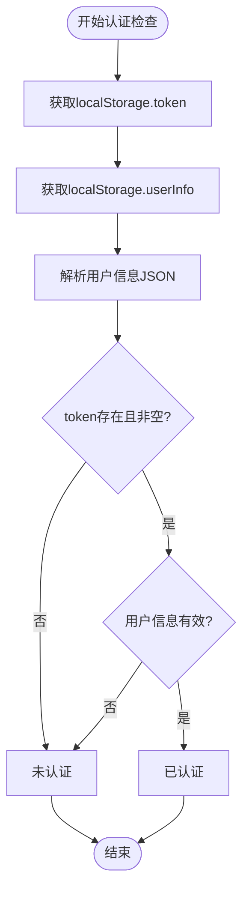
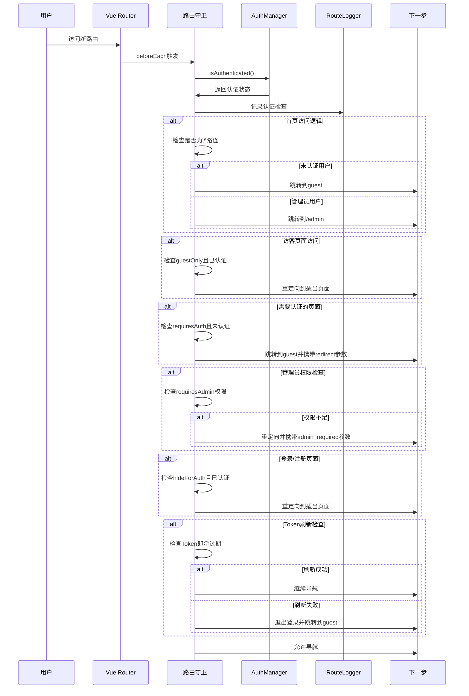
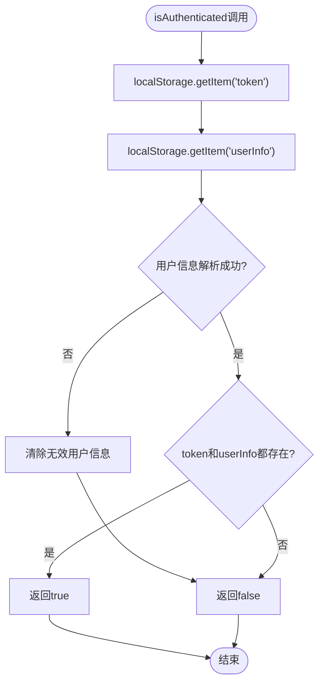
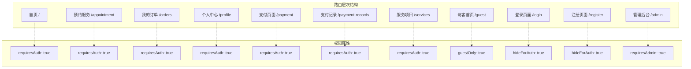
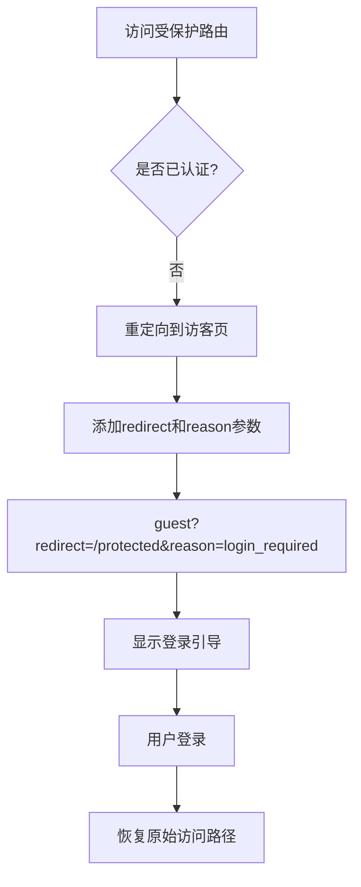
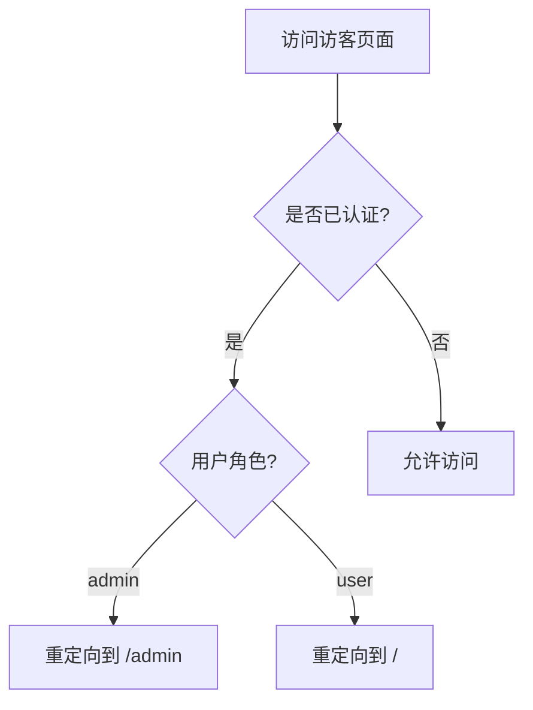
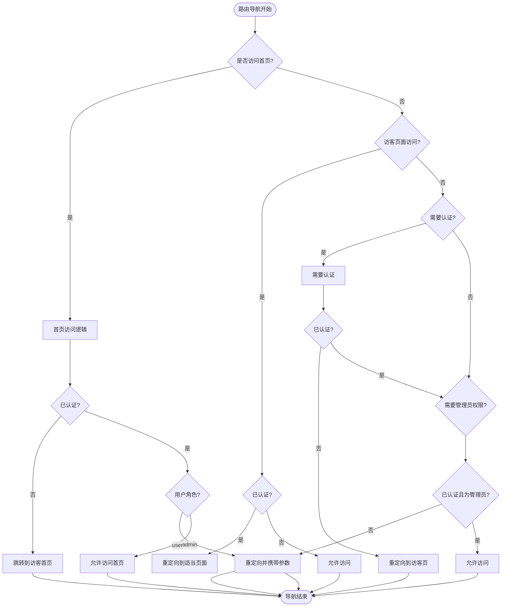
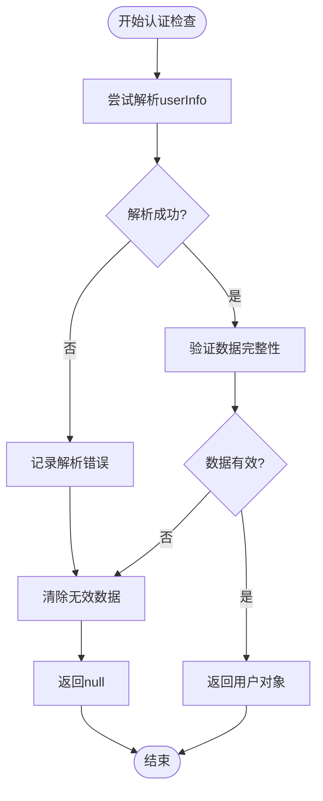
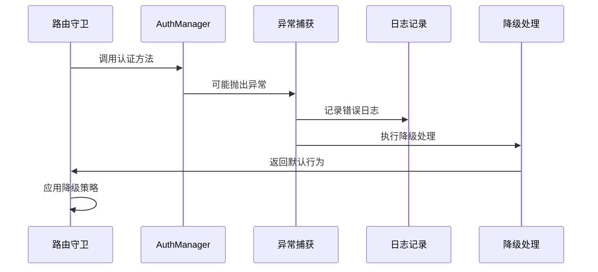
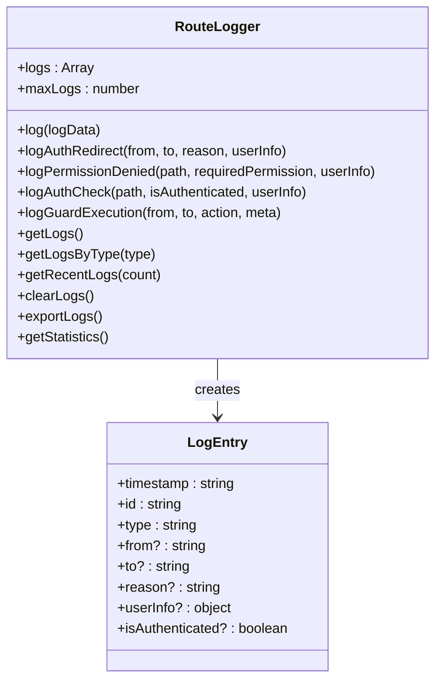

# 认证检查

<cite>
**本文档中引用的文件**
- [router/index.js](file://frontend/src/router/index.js)
- [utils/auth.js](file://frontend/src/utils/auth.js)
- [stores/user.js](file://frontend/src/stores/user.js)
- [utils/routeLogger.js](file://frontend/src/utils/routeLogger.js)
- [views/Login.vue](file://frontend/src/views/Login.vue)
- [views/GuestHome.vue](file://frontend/src/views/GuestHome.vue)
- [views/Orders.vue](file://frontend/src/views/Orders.vue)
- [public/test-auth.html](file://frontend/public/test-auth.html)
- [public/test-auth-status.html](file://frontend/public/test-auth-status.html)
</cite>

## 目录
1. [概述](#概述)
2. [认证状态检查机制](#认证状态检查机制)
3. [路由守卫架构](#路由守卫架构)
4. [AuthManager核心方法](#authmanager核心方法)
5. [路由元信息处理](#路由元信息处理)
6. [重定向策略](#重定向策略)
7. [权限控制逻辑](#权限控制逻辑)
8. [异常处理机制](#异常处理机制)
9. [性能优化与监控](#性能优化与监控)
10. [故障排除指南](#故障排除指南)

## 概述

前端路由守卫中的认证状态检查是汽车洗车服务预约系统的核心安全机制。该系统通过Vue Router的全局前置守卫`router.beforeEach`实现多层次的权限控制，确保用户只能访问其权限范围内的页面，并提供流畅的用户体验。

系统采用基于localStorage的无状态认证机制，通过`AuthManager.isAuthenticated()`方法检查用户的登录状态，结合路由元信息实现细粒度的权限控制。

## 认证状态检查机制

### localStorage数据结构

系统依赖以下localStorage键值对来维护用户认证状态：

| 键名 | 类型 | 描述 | 必需性 |
|------|------|------|--------|
| `token` | String | JWT访问令牌 | 必需 |
| `tokenType` | String | 令牌类型（默认Bearer） | 可选 |
| `userInfo` | String(JSON) | 用户基本信息（JSON字符串） | 必需 |
| `userRole` | String | 用户角色标识（admin/user） | 必需 |

### 认证状态判断逻辑



**图表来源**
- [utils/auth.js](file://frontend/src/utils/auth.js#L33-L38)

**章节来源**
- [utils/auth.js](file://frontend/src/utils/auth.js#L33-L38)
- [public/test-auth-status.html](file://frontend/public/test-auth-status.html#L85-L143)

## 路由守卫架构

### 全局前置守卫流程

系统在`router.beforeEach`中实现了七层认证检查流程：



**图表来源**
- [router/index.js](file://frontend/src/router/index.js#L207-L336)

**章节来源**
- [router/index.js](file://frontend/src/router/index.js#L207-L336)

## AuthManager核心方法

### isAuthenticated()方法实现

`AuthManager.isAuthenticated()`是认证检查的核心方法，其实现逻辑如下：



**图表来源**
- [utils/auth.js](file://frontend/src/utils/auth.js#L33-L38)

### 其他核心方法

| 方法名 | 功能 | 返回值 | 用途 |
|--------|------|--------|------|
| `getCurrentUser()` | 获取当前用户信息 | Object/null | 用户信息获取 |
| `getUserRole()` | 获取用户角色 | String/null | 权限判断 |
| `isAdmin()` | 检查是否为管理员 | Boolean | 管理员权限 |
| `isUser()` | 检查是否为普通用户 | Boolean | 用户权限 |
| `hasPermission()` | 检查具体权限 | Boolean | 细粒度权限控制 |
| `login()` | 用户登录 | Boolean | 登录处理 |
| `logout()` | 用户登出 | void | 登出处理 |

**章节来源**
- [utils/auth.js](file://frontend/src/utils/auth.js#L8-L214)

## 路由元信息处理

### 元信息定义与作用

系统使用以下路由元信息实现不同级别的权限控制：

| 元信息 | 类型 | 作用 | 示例 |
|--------|------|------|------|
| `requiresAuth` | Boolean | 是否需要登录 | `{ requiresAuth: true }` |
| `requiresAdmin` | Boolean | 是否需要管理员权限 | `{ requiresAdmin: true }` |
| `guestOnly` | Boolean | 仅访客可访问 | `{ guestOnly: true }` |
| `hideForAuth` | Boolean | 已登录用户隐藏 | `{ hideForAuth: true }` |

### 路由配置示例



**图表来源**
- [router/index.js](file://frontend/src/router/index.js#L25-L188)

**章节来源**
- [router/index.js](file://frontend/src/router/index.js#L25-L188)

## 重定向策略

### 未认证用户访问受保护路由

当未认证用户尝试访问需要认证的路由时，系统采用智能重定向策略：



**图表来源**
- [router/index.js](file://frontend/src/router/index.js#L260-L266)

### 重定向参数说明

| 参数名 | 值 | 用途 |
|--------|-----|------|
| `redirect` | 原始路径 | 登录后恢复用户访问意图 |
| `reason` | `login_required` | 提供上下文信息 |

### 访客页面访问策略



**图表来源**
- [router/index.js](file://frontend/src/router/index.js#L251-L257)

**章节来源**
- [router/index.js](file://frontend/src/router/index.js#L251-L266)

## 权限控制逻辑

### 多层次权限检查

系统实现了七层权限控制逻辑，每层都有特定的检查条件：



**图表来源**
- [router/index.js](file://frontend/src/router/index.js#L235-L290)

### 权限级别说明

| 权限级别 | 检查条件 | 重定向目标 | 适用场景 |
|----------|----------|------------|----------|
| 基础认证 | `requiresAuth && !isAuthenticated` | `guest?redirect=path&reason=login_required` | 所有受保护页面 |
| 管理员权限 | `requiresAdmin && (!isAuthenticated \| !isAdmin)` | `/?redirect=path&reason=admin_required` | 管理后台页面 |
| 访客独占 | `guestOnly && isAuthenticated` | `/admin` 或 `/` | 登录后的访客页面 |
| 登录隐藏 | `hideForAuth && isAuthenticated` | `/admin` 或 `/` | 登录后的特殊页面 |

**章节来源**
- [router/index.js](file://frontend/src/router/index.js#L235-L290)

## 异常处理机制

### localStorage数据损坏处理

系统实现了多层容错机制来处理localStorage数据损坏的情况：



**图表来源**
- [utils/auth.js](file://frontend/src/utils/auth.js#L10-L21)

### 异常情况分类处理

| 异常类型 | 处理策略 | 影响范围 | 恢复机制 |
|----------|----------|----------|----------|
| Token缺失 | 清除所有认证信息 | 全局 | 重新登录 |
| 用户信息损坏 | 清除用户信息，保留Token | 局部 | 重新获取用户信息 |
| Token格式错误 | 清除Token和用户信息 | 全局 | 重新登录 |
| 网络异常 | 显示错误提示，保持当前状态 | 单次操作 | 用户手动重试 |

### 错误边界保护



**图表来源**
- [router/index.js](file://frontend/src/router/index.js#L317-L335)

**章节来源**
- [utils/auth.js](file://frontend/src/utils/auth.js#L10-L21)
- [router/index.js](file://frontend/src/router/index.js#L317-L335)

## 性能优化与监控

### RouteLogger监控系统

系统集成了完整的路由日志记录功能，用于监控认证状态和权限检查：



**图表来源**
- [utils/routeLogger.js](file://frontend/src/utils/routeLogger.js#L4-L233)

### 性能监控指标

| 指标类别 | 监控内容 | 用途 |
|----------|----------|------|
| 认证状态 | `auth_check` | 监控认证状态变化 |
| 重定向行为 | `auth_redirect` | 分析权限控制效果 |
| 权限拒绝 | `permission_denied` | 识别权限配置问题 |
| 守卫执行 | `guard_execution` | 监控路由守卫性能 |

### 日志管理策略

- **容量控制**：最多保存100条日志
- **环境区分**：开发环境输出到控制台，生产环境仅发送重要日志
- **统计分析**：提供日志统计和导出功能

**章节来源**
- [utils/routeLogger.js](file://frontend/src/utils/routeLogger.js#L4-L233)

## 故障排除指南

### 常见认证问题诊断

#### 问题1：Token丢失或失效

**症状**：用户已登录但被重定向到访客页面

**诊断步骤**：
1. 检查localStorage中的token是否存在
2. 验证token格式是否正确
3. 检查token是否过期

**解决方案**：
```javascript
// 清除本地存储的认证信息
localStorage.removeItem('token');
localStorage.removeItem('userInfo');
localStorage.removeItem('userRole');

// 重新登录
window.location.reload();
```

#### 问题2：用户信息解析失败

**症状**：认证状态正常但用户信息为空

**诊断步骤**：
1. 检查localStorage.userInfo格式
2. 验证JSON解析是否成功
3. 检查用户信息字段完整性

**解决方案**：
```javascript
try {
    const userInfo = JSON.parse(localStorage.getItem('userInfo'));
    // 验证必需字段
    if (!userInfo.id || !userInfo.username) {
        localStorage.removeItem('userInfo');
    }
} catch (e) {
    localStorage.removeItem('userInfo');
}
```

#### 问题3：路由权限配置错误

**症状**：用户被错误地重定向或无法访问页面

**诊断步骤**：
1. 检查路由配置中的元信息
2. 验证AuthManager的权限检查逻辑
3. 查看RouteLogger的权限拒绝日志

**解决方案**：
```javascript
// 检查路由配置
{
    path: '/protected',
    meta: {
        requiresAuth: true,  // 确保配置正确
        requiresAdmin: false // 根据实际需求调整
    }
}
```

### 调试工具使用

系统提供了多个调试页面来帮助诊断认证问题：

| 调试页面 | 功能 | URL |
|----------|------|-----|
| `test-auth.html` | 基础认证状态测试 | `/test-auth.html` |
| `test-auth-status.html` | 详细认证状态检查 | `/test-auth-status.html` |
| `debug-auth.html` | 综合认证调试 | `/debug-auth.html` |
| `test-login.html` | 登录功能测试 | `/test-login.html` |

**章节来源**
- [public/test-auth.html](file://frontend/public/test-auth.html#L1-L218)
- [public/test-auth-status.html](file://frontend/public/test-auth-status.html#L77-L143)

### 性能优化建议

1. **减少不必要的认证检查**：对于公开页面，避免重复检查认证状态
2. **缓存用户信息**：在内存中缓存用户信息以减少localStorage访问
3. **异步加载组件**：使用懒加载减少初始包大小
4. **优化路由守卫逻辑**：提前返回减少嵌套层级

通过以上机制，系统实现了安全、高效、用户体验良好的前端认证控制体系，为汽车洗车服务预约系统提供了可靠的权限保障。