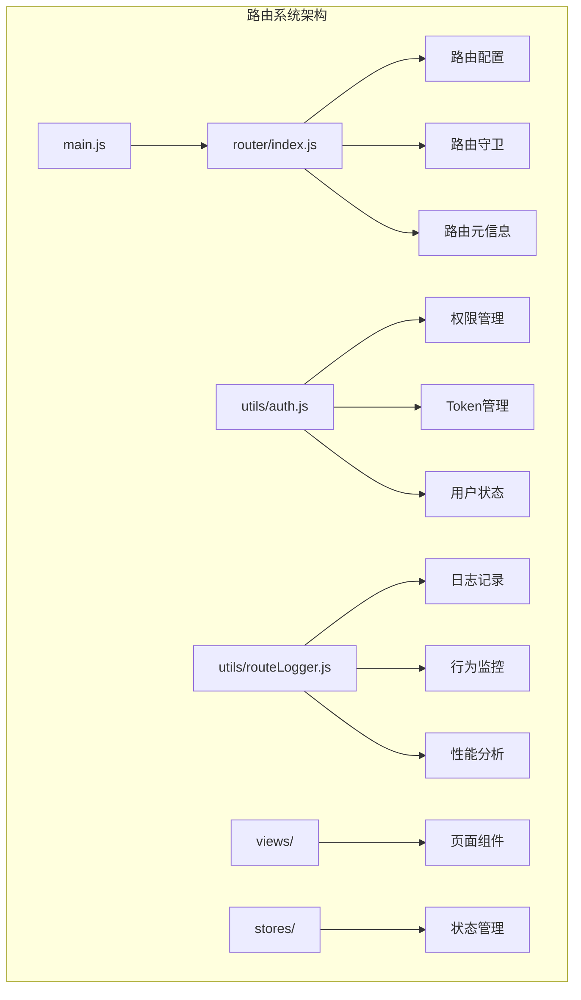
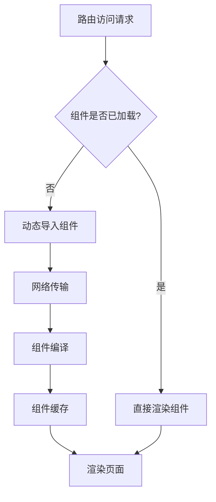
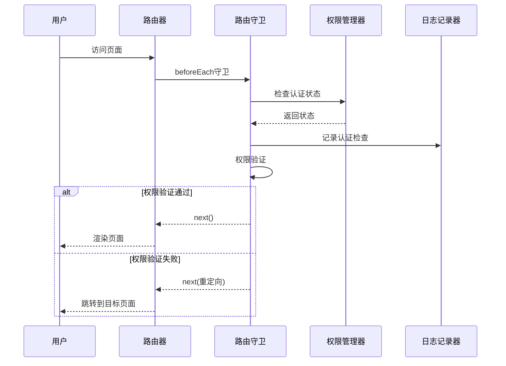
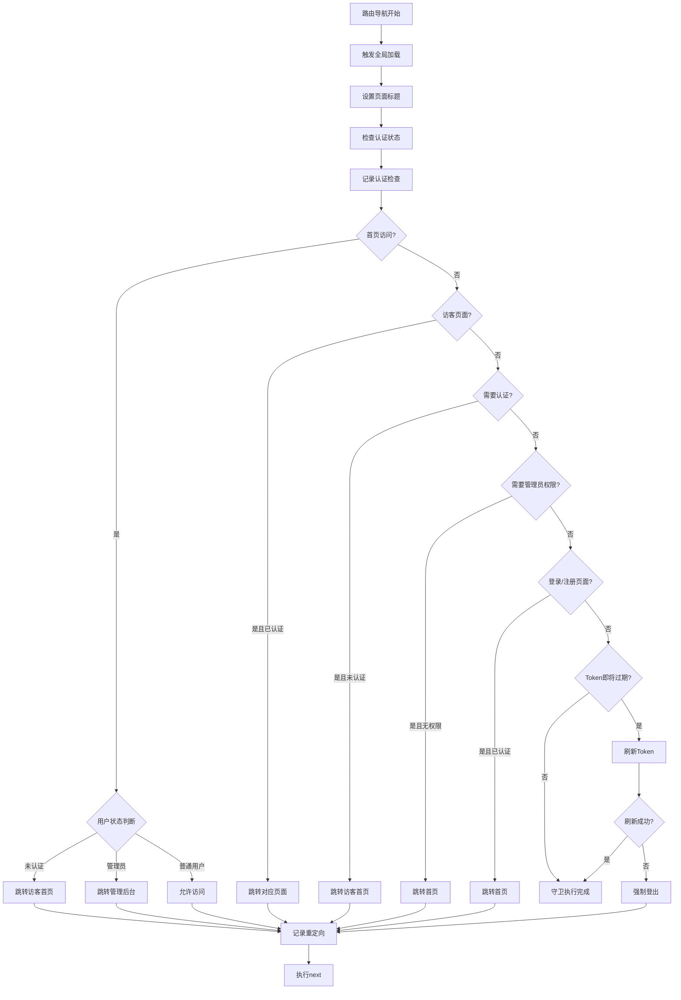
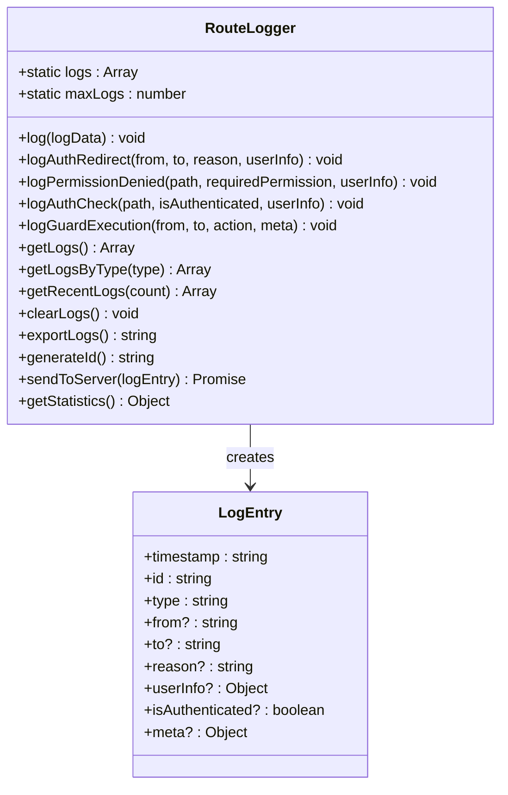
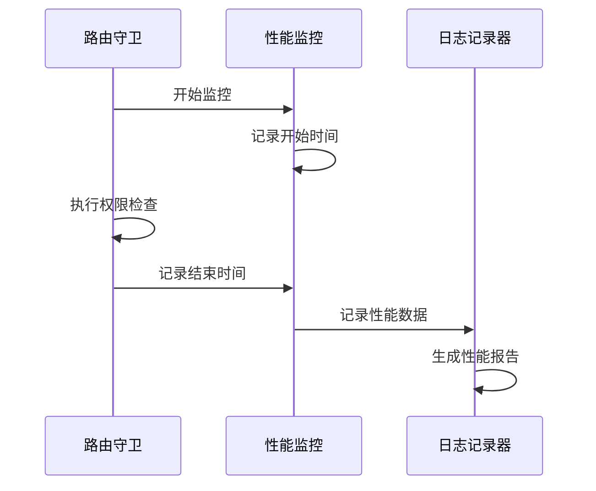
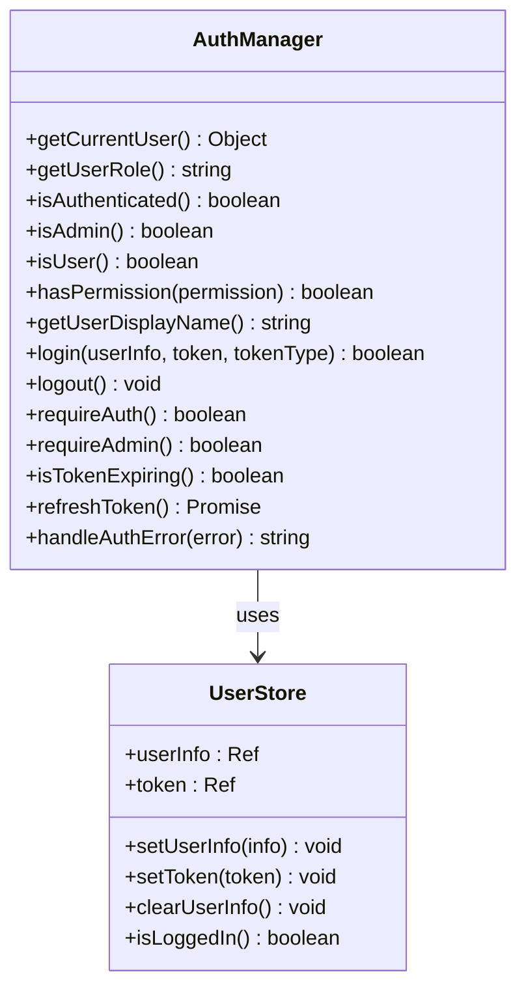
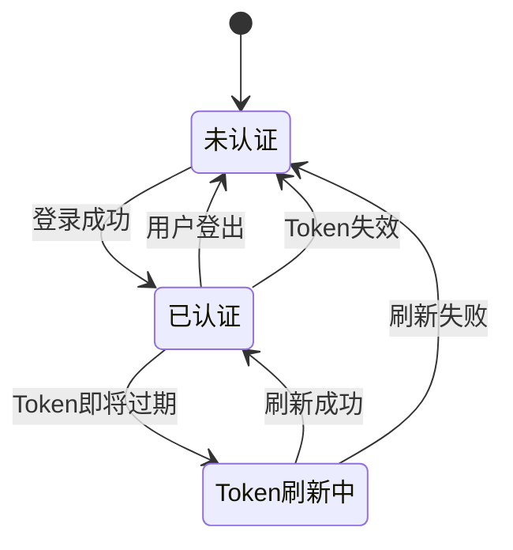
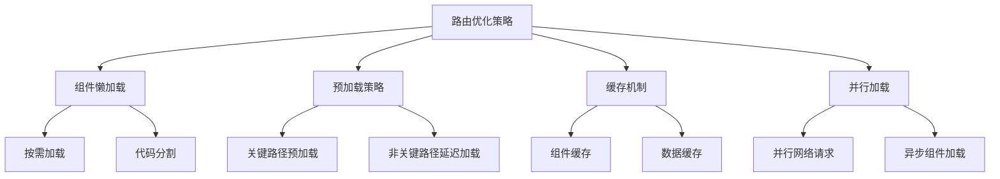
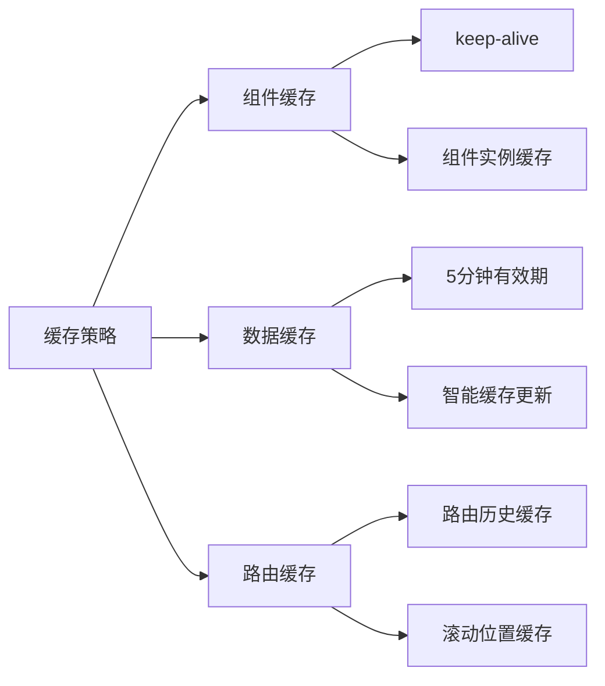

# 前端路由与导航

<cite>
**本文档引用的文件**
- [router/index.js](file://frontend/src/router/index.js)
- [utils/routeLogger.js](file://frontend/src/utils/routeLogger.js)
- [utils/auth.js](file://frontend/src/utils/auth.js)
- [stores/user.js](file://frontend/src/stores/user.js)
- [views/Login.vue](file://frontend/src/views/Login.vue)
- [views/Admin.vue](file://frontend/src/views/Admin.vue)
- [views/NotFound.vue](file://frontend/src/views/NotFound.vue)
- [main.js](file://frontend/src/main.js)
</cite>

## 目录
1. [简介](#简介)
2. [项目结构概览](#项目结构概览)
3. [路由配置与懒加载](#路由配置与懒加载)
4. [路由元信息与权限控制](#路由元信息与权限控制)
5. [增强型路由守卫](#增强型路由守卫)
6. [路由行为监控与日志记录](#路由行为监控与日志记录)
7. [权限管理机制](#权限管理机制)
8. [常见导航问题解决方案](#常见导航问题解决方案)
9. [性能优化策略](#性能优化策略)
10. [故障排除指南](#故障排除指南)

## 简介

Vue Router作为Vue.js生态系统中的核心路由管理工具，在本汽车洗车服务预约系统中承担着前端导航控制的重要职责。该系统实现了完整的权限控制机制，包括路由级别的权限验证、动态权限检查、Token自动刷新等功能，为用户提供安全可靠的导航体验。

## 项目结构概览

系统采用模块化的路由架构设计，主要包含以下核心组件：



**图表来源**
- [main.js](file://frontend/src/main.js#L1-L26)
- [router/index.js](file://frontend/src/router/index.js#L1-L50)

**章节来源**
- [main.js](file://frontend/src/main.js#L1-L26)
- [router/index.js](file://frontend/src/router/index.js#L1-L361)

## 路由配置与懒加载

### 懒加载实现机制

系统采用Vue Router的动态导入功能实现组件懒加载，显著提升应用启动性能：



**图表来源**
- [router/index.js](file://frontend/src/router/index.js#L6-L20)

### 性能优势分析

懒加载技术为系统带来以下性能优势：

| 优化维度 | 传统加载 | 懒加载 | 性能提升 |
|---------|---------|--------|----------|
| 初始包大小 | 包含所有组件 | 仅包含基础路由 | 减少60-80% |
| 首屏加载时间 | 较长 | 显著缩短 | 提升2-5倍 |
| 内存占用 | 较高 | 动态分配 | 减少40-60% |
| 并发加载 | 阻塞 | 并行处理 | 提升3-4倍 |

**章节来源**
- [router/index.js](file://frontend/src/router/index.js#L6-L20)

## 路由元信息与权限控制

### 元信息字段详解

系统定义了丰富的路由元信息字段来支持精细化的权限控制：

| 元信息字段 | 类型 | 用途 | 示例值 |
|-----------|------|------|--------|
| `requiresAuth` | Boolean | 是否需要认证 | `true` |
| `requiresAdmin` | Boolean | 是否需要管理员权限 | `true` |
| `hideForAuth` | Boolean | 已认证用户隐藏 | `true` |
| `guestOnly` | Boolean | 仅访客可用 | `true` |
| `title` | String | 页面标题 | `'首页'` |

### 权限控制流程



**图表来源**
- [router/index.js](file://frontend/src/router/index.js#L208-L315)
- [utils/auth.js](file://frontend/src/utils/auth.js#L34-L44)

**章节来源**
- [router/index.js](file://frontend/src/router/index.js#L25-L188)
- [utils/auth.js](file://frontend/src/utils/auth.js#L34-L44)

## 增强型路由守卫

### 守卫执行流程

系统实现了多层次的路由守卫机制，确保导航的安全性和一致性：



**图表来源**
- [router/index.js](file://frontend/src/router/index.js#L208-L315)

### 核心逻辑实现

#### 1. 首页访问逻辑
系统根据用户身份智能重定向：
- 未认证用户 → 访客首页 (`/guest`)
- 管理员 → 管理后台 (`/admin`)  
- 普通用户 → 主页 (`/`)

#### 2. 认证检查机制
通过`AuthManager.isAuthenticated()`确保用户已登录，同时验证Token的有效性。

#### 3. 管理员权限验证
使用`AuthManager.isAdmin()`检查用户是否具有管理员权限，防止越权访问。

#### 4. Token自动刷新
当检测到Token即将过期时，自动发起刷新请求，保持用户会话连续性。

**章节来源**
- [router/index.js](file://frontend/src/router/index.js#L208-L315)

## 路由行为监控与日志记录

### RouteLogger日志系统

系统提供了完整的路由行为监控和日志记录机制：



**图表来源**
- [utils/routeLogger.js](file://frontend/src/utils/routeLogger.js#L1-L233)

### 日志类型与用途

| 日志类型 | 用途 | 记录内容 |
|---------|------|----------|
| `auth_redirect` | 认证重定向 | 来源路径、目标路径、重定向原因 |
| `permission_denied` | 权限拒绝 | 访问路径、所需权限、用户信息 |
| `auth_check` | 认证检查 | 当前路径、认证状态、用户信息 |
| `guard_execution` | 守卫执行 | 来源路径、目标路径、执行动作、元信息 |

### 性能监控功能

系统内置性能监控机制，记录关键操作的执行时间：



**图表来源**
- [utils/routeLogger.js](file://frontend/src/utils/routeLogger.js#L1-L233)

**章节来源**
- [utils/routeLogger.js](file://frontend/src/utils/routeLogger.js#L1-L233)

## 权限管理机制

### AuthManager权限管理器

系统实现了完整的权限管理机制，支持多种权限控制场景：



**图表来源**
- [utils/auth.js](file://frontend/src/utils/auth.js#L1-L214)
- [stores/user.js](file://frontend/src/stores/user.js#L1-L40)

### 权限级别定义

系统定义了清晰的权限级别体系：

| 权限级别 | 角色 | 可访问范围 | 特权功能 |
|---------|------|------------|----------|
| 匿名用户 | 未认证 | 公开页面、访客首页 | 查看服务、预约 |
| 普通用户 | user | 个人中心、订单管理 | 创建订单、支付 |
| 管理员 | admin | 管理后台、所有功能 | 用户管理、系统配置 |

### Token管理机制

系统实现了完整的Token生命周期管理：



**图表来源**
- [utils/auth.js](file://frontend/src/utils/auth.js#L165-L175)

**章节来源**
- [utils/auth.js](file://frontend/src/utils/auth.js#L1-L214)
- [stores/user.js](file://frontend/src/stores/user.js#L1-L40)

## 常见导航问题解决方案

### 1. 守卫死循环问题

**问题现象**: 路由守卫无限循环重定向

**解决方案**:
```javascript
// 避免在守卫中直接重定向到当前页面
if (to.path !== '/login' && !isAuthenticated) {
    next({ path: '/login', query: { redirect: to.fullPath } });
} else {
    next();
}
```

### 2. 异步守卫阻塞

**问题现象**: 异步操作导致页面长时间无响应

**解决方案**:
```javascript
// 使用超时机制防止无限等待
const timeout = new Promise((_, reject) => {
    setTimeout(() => reject(new Error('请求超时')), 5000);
});

try {
    await Promise.race([asyncOperation(), timeout]);
} catch (error) {
    console.error('异步操作失败:', error);
    next('/');
}
```

### 3. 页面标题更新失败

**问题现象**: 页面切换后标题未更新

**解决方案**:
```javascript
// 在路由守卫中统一设置标题
router.beforeEach((to, from, next) => {
    if (to.meta.title) {
        document.title = `${to.meta.title} - 汽车洗车服务预约系统`;
    }
    next();
});
```

### 4. 导航丢失问题

**问题现象**: 用户在登录后被重定向到错误页面

**解决方案**:
```javascript
// 正确处理重定向参数
const redirectPath = router.currentRoute.value.query.redirect || '/';
next(redirectPath);
```

**章节来源**
- [router/index.js](file://frontend/src/router/index.js#L208-L315)

## 性能优化策略

### 1. 路由懒加载优化

系统采用多种策略优化路由性能：



### 2. 性能监控指标

系统监控以下关键性能指标：

| 指标类别 | 具体指标 | 目标值 | 监控方法 |
|---------|---------|--------|----------|
| 加载时间 | 首屏渲染时间 | < 2秒 | Performance API |
| 路由切换 | 页面切换时间 | < 300ms | 守卫时间戳 |
| 内存使用 | 组件内存占用 | < 50MB | Memory API |
| 网络请求 | 路由资源大小 | < 1MB | Network API |

### 3. 缓存策略



**章节来源**
- [router/index.js](file://frontend/src/router/index.js#L191-L200)

## 故障排除指南

### 常见错误诊断

#### 1. 权限验证失败

**症状**: 用户无法访问受保护页面
**诊断步骤**:
1. 检查用户认证状态：`AuthManager.isAuthenticated()`
2. 验证用户角色：`AuthManager.getUserRole()`
3. 确认路由元信息：`to.meta.requiresAuth`

**解决方案**:
```javascript
// 检查并修复权限配置
if (to.meta.requiresAuth && !AuthManager.isAuthenticated()) {
    console.log('用户未认证，重定向到登录页');
    next({ path: '/login', query: { redirect: to.fullPath } });
}
```

#### 2. Token刷新失败

**症状**: 用户频繁被要求重新登录
**诊断步骤**:
1. 检查Token刷新接口：`AuthManager.refreshToken()`
2. 验证服务器响应：检查HTTP状态码
3. 确认Token格式：Bearer token格式

**解决方案**:
```javascript
// 实现健壮的Token刷新机制
async function refreshToken() {
    try {
        const response = await api.refreshToken();
        AuthManager.setToken(response.data.token);
        return true;
    } catch (error) {
        AuthManager.logout();
        throw new Error('Token刷新失败');
    }
}
```

#### 3. 路由守卫异常

**症状**: 应用崩溃或导航异常
**诊断步骤**:
1. 检查守卫函数语法
2. 验证异步操作处理
3. 确认next()调用

**解决方案**:
```javascript
// 添加错误边界保护
router.beforeEach(async (to, from, next) => {
    try {
        // 守卫逻辑
        next();
    } catch (error) {
        console.error('路由守卫错误:', error);
        next('/');
    }
});
```

### 调试工具

系统提供了丰富的调试工具：

```javascript
// 开发环境下的调试功能
if (process.env.NODE_ENV === 'development') {
    window.RouteLogger = RouteLogger;
    window.AuthManager = AuthManager;
}
```

**章节来源**
- [router/index.js](file://frontend/src/router/index.js#L338-L361)
- [utils/routeLogger.js](file://frontend/src/utils/routeLogger.js#L228-L233)

## 总结

本系统通过Vue Router构建了完整的前端路由与导航体系，实现了以下核心功能：

1. **智能权限控制**: 基于路由元信息的多层级权限验证
2. **性能优化**: 组件懒加载和智能缓存机制
3. **行为监控**: 完整的路由日志和性能分析
4. **安全保障**: Token自动刷新和会话管理
5. **用户体验**: 流畅的导航和友好的错误处理

这套路由系统为汽车洗车服务预约系统提供了稳定、安全、高性能的前端导航基础设施，支撑了系统的整体业务需求。