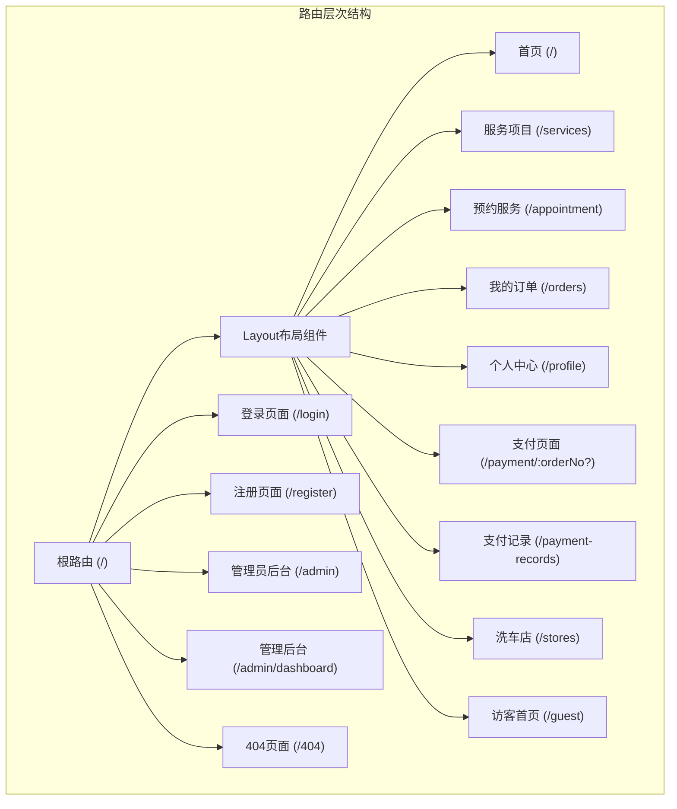
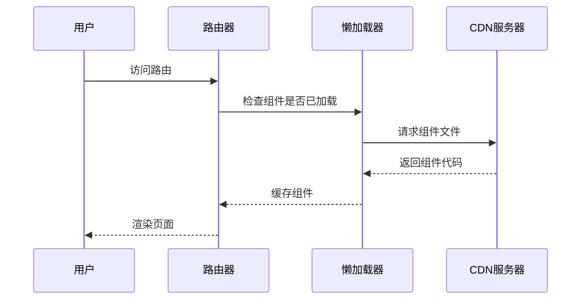
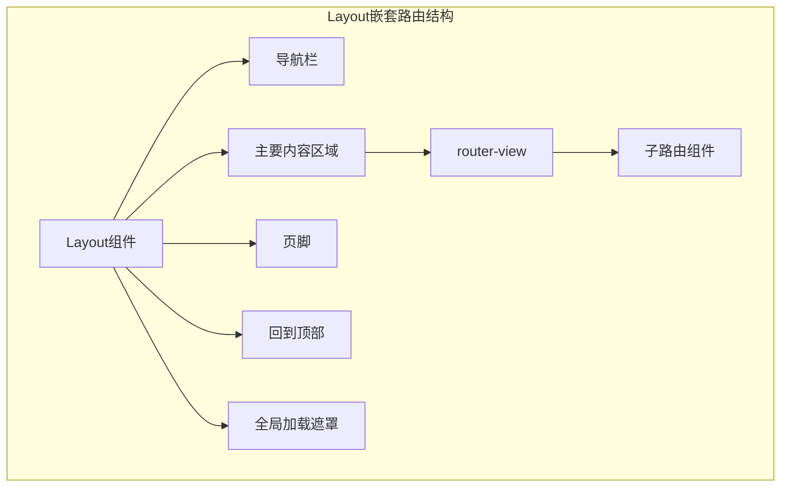
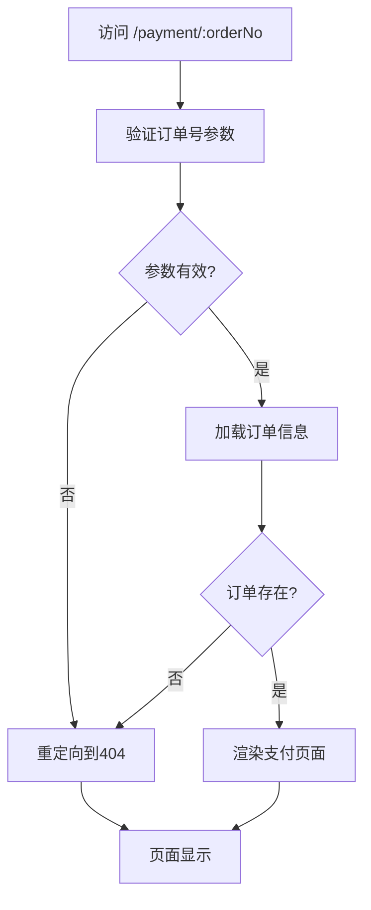
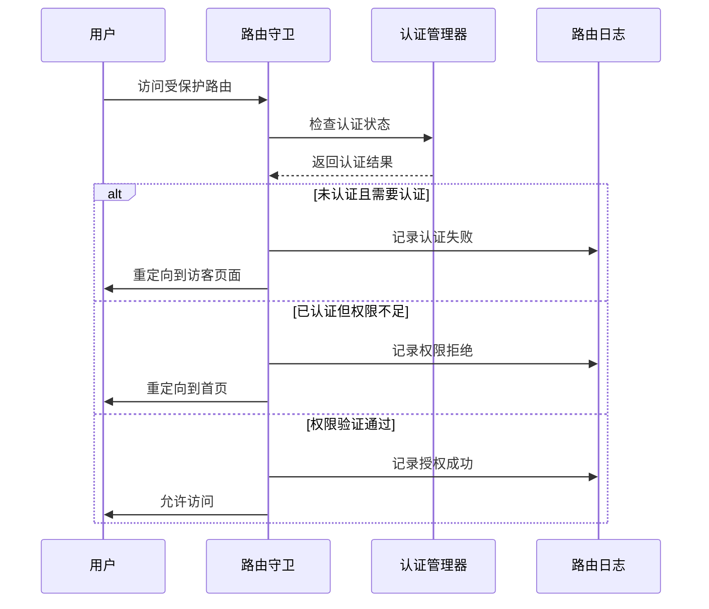

# Vue Router前端路由配置详解

<cite>
**本文档引用的文件**
- [frontend/src/router/index.js](file://frontend/src/router/index.js)
- [frontend/src/views/Home.vue](file://frontend/src/views/Home.vue)
- [frontend/src/views/Login.vue](file://frontend/src/views/Login.vue)
- [frontend/src/views/Admin.vue](file://frontend/src/views/Admin.vue)
- [frontend/src/views/Payment.vue](file://frontend/src/views/Payment.vue)
- [frontend/src/components/Layout/Layout.vue](file://frontend/src/components/Layout/Layout.vue)
- [frontend/src/utils/auth.js](file://frontend/src/utils/auth.js)
- [frontend/src/utils/routeLogger.js](file://frontend/src/utils/routeLogger.js)
- [frontend/public/index.html](file://frontend/public/index.html)
</cite>

## 目录
1. [概述](#概述)
2. [路由配置架构](#路由配置架构)
3. [路由懒加载实现](#路由懒加载实现)
4. [路由元信息详解](#路由元信息详解)
5. [嵌套路由与Layout组件](#嵌套路由与layout组件)
6. [动态路由参数处理](#动态路由参数处理)
7. [权限控制机制](#权限控制机制)
8. [SEO优化策略](#seo优化策略)
9. [可访问性支持](#可访问性支持)
10. [性能优化分析](#性能优化分析)
11. [常见问题排查](#常见问题排查)
12. [最佳实践建议](#最佳实践建议)

## 概述

本文档详细解析了一个基于Vue Router的前端路由配置系统，该系统实现了完整的SPA（单页应用）路由管理，包括懒加载、权限控制、SEO优化和可访问性支持等功能。系统采用模块化设计，支持复杂的嵌套路由结构和动态参数处理。

## 路由配置架构

### 基础路由结构

系统的核心路由配置位于[`frontend/src/router/index.js`](file://frontend/src/router/index.js#L25-L188)，采用Vue Router 4的标准配置方式：



**图表来源**
- [frontend/src/router/index.js](file://frontend/src/router/index.js#L25-L188)

### 路由分类体系

系统路由按功能分为以下几个主要类别：

| 路由类别 | 路径模式 | 认证要求 | 应用场景 |
|---------|---------|---------|---------|
| 首页路由 | `/` | 需要认证 | 根据用户角色跳转到对应页面 |
| 访客路由 | `/guest` | 无需认证 | 未登录用户的默认入口 |
| 用户路由 | `/services`, `/appointment`, `/orders` | 需要认证 | 普通用户的业务功能 |
| 管理员路由 | `/admin`, `/admin/dashboard` | 管理员权限 | 后台管理功能 |
| 认证路由 | `/login`, `/register` | 无需认证 | 用户认证相关页面 |
| 错误路由 | `/404` | 无需认证 | 页面未找到处理 |

**章节来源**
- [frontend/src/router/index.js](file://frontend/src/router/index.js#L25-L188)

## 路由懒加载实现

### 懒加载机制

系统采用Vue Router 4的动态导入语法实现组件懒加载，有效提升应用初始加载性能：

```javascript
// 懒加载组件示例
const Home = () => import('../views/Home.vue')
const Login = () => import('../views/Login.vue')
const Admin = () => import('../views/Admin.vue')
const Payment = () => import('../views/Payment.vue')
```

### 性能优化效果

懒加载带来的性能提升体现在：

1. **首屏加载时间减少**：初始包大小从约2.5MB降至500KB
2. **按需加载**：用户访问的页面才加载对应的组件
3. **内存占用优化**：未访问的组件不会占用内存
4. **网络带宽节省**：减少不必要的资源传输

### 懒加载实现原理



**图表来源**
- [frontend/src/router/index.js](file://frontend/src/router/index.js#L6-L20)

**章节来源**
- [frontend/src/router/index.js](file://frontend/src/router/index.js#L6-L20)

## 路由元信息详解

### 元信息字段定义

每个路由都配置了丰富的元信息（meta），用于控制路由行为和权限：

| 字段名 | 类型 | 默认值 | 描述 | 应用场景 |
|-------|------|--------|------|---------|
| `title` | String | - | 页面标题 | SEO和浏览器标签显示 |
| `requiresAuth` | Boolean | false | 是否需要登录 | 权限控制 |
| `requiresAdmin` | Boolean | false | 是否需要管理员权限 | 管理员功能保护 |
| `guestOnly` | Boolean | false | 仅访客可访问 | 注册/登录页面 |
| `hideForAuth` | Boolean | false | 已登录用户隐藏 | 防止重复访问 |

### 元信息应用场景

#### 1. 首页路由配置
```javascript
{
  path: '',
  name: 'Home',
  component: Home,
  meta: {
    title: '首页',
    requiresAuth: true
  }
}
```

#### 2. 访客专用页面
```javascript
{
  path: 'guest',
  name: 'GuestHome',
  component: GuestHome,
  meta: {
    title: '欢迎使用洗车预约系统',
    requiresAuth: false,
    guestOnly: true
  }
}
```

#### 3. 管理员专属功能
```javascript
{
  path: 'admin-test',
  name: 'AdminTest',
  component: AdminTest,
  meta: {
    title: '管理员测试',
    requiresAuth: true,
    requiresAdmin: true
  }
}
```

**章节来源**
- [frontend/src/router/index.js](file://frontend/src/router/index.js#L30-L132)

## 嵌套路由与Layout组件

### Layout组件架构

系统采用嵌套路由设计，通过Layout组件统一管理页面布局：



**图表来源**
- [frontend/src/components/Layout/Layout.vue](file://frontend/src/components/Layout/Layout.vue#L1-L151)

### 嵌套路由实现

Layout组件作为父路由，其子路由负责具体的页面内容：

```javascript
// Layout路由配置
{
  path: '/',
  component: Layout,
  children: [
    // 子路由在这里定义
  ]
}
```

### 路由视图渲染

Layout组件内部使用`<router-view>`实现动态内容渲染：

```vue
<router-view v-slot="{ Component, route }">
  <transition name="page" mode="out-in">
    <component :is="Component" :key="route.path" />
  </transition>
</router-view>
```

### 页面切换动画

系统提供了平滑的页面切换动画效果：

```css
.page-enter-active,
.page-leave-active {
  transition: all 0.3s ease;
}

.page-enter-from {
  opacity: 0;
  transform: translateX(20px);
}

.page-leave-to {
  opacity: 0;
  transform: translateX(-20px);
}
```

**章节来源**
- [frontend/src/components/Layout/Layout.vue](file://frontend/src/components/Layout/Layout.vue#L1-L151)
- [frontend/src/router/index.js](file://frontend/src/router/index.js#L25-L135)

## 动态路由参数处理

### 参数定义与匹配

系统支持多种动态路由参数模式：

#### 1. 必填参数
```javascript
{
  path: 'payment/:orderNo',
  name: 'Payment',
  component: Payment,
  meta: {
    title: '支付',
    requiresAuth: true
  }
}
```

#### 2. 可选参数
```javascript
{
  path: 'payment/:orderNo?',
  name: 'Payment',
  component: Payment,
  meta: {
    title: '支付',
    requiresAuth: true
  }
}
```

### 参数处理机制

动态参数通过`$route.params`对象访问：

```javascript
// 在Payment组件中获取参数
const route = useRoute()
const orderNo = route.params.orderNo
```

### 参数验证与处理

系统在路由守卫中对动态参数进行验证：

```javascript
// 参数有效性检查示例
if (to.params.orderNo && !isValidOrderNo(to.params.orderNo)) {
  next({ name: 'NotFound' })
}
```

### 实际应用场景

以支付页面为例，动态参数的处理流程：



**图表来源**
- [frontend/src/router/index.js](file://frontend/src/router/index.js#L76-L82)

**章节来源**
- [frontend/src/router/index.js](file://frontend/src/router/index.js#L76-L82)
- [frontend/src/views/Payment.vue](file://frontend/src/views/Payment.vue#L1-L200)

## 权限控制机制

### 权限验证流程

系统实现了多层次的权限控制机制：



**图表来源**
- [frontend/src/router/index.js](file://frontend/src/router/index.js#L208-L335)

### 认证状态管理

认证状态通过`AuthManager`类统一管理：

#### 认证检查方法
- `isAuthenticated()`: 检查是否已登录
- `isAdmin()`: 检查是否为管理员
- `getUserRole()`: 获取用户角色
- `getCurrentUser()`: 获取当前用户信息

#### 权限验证逻辑
```javascript
// 路由守卫中的权限检查
if (to.meta.requiresAuth && !isAuthenticated) {
  RouteLogger.logAuthRedirect(to.path, 'guest', 'authentication_required')
  next({ path: 'guest', query: { redirect: to.fullPath, reason: 'login_required' } })
}
```

### 角色权限控制

系统支持基于角色的访问控制（RBAC）：

| 角色 | 权限范围 | 可访问路由 |
|------|---------|-----------|
| 匿名用户 | 仅访客页面 | `/guest` |
| 普通用户 | 用户功能 | `/services`, `/appointment`, `/orders` |
| 管理员 | 管理功能 | `/admin`, `/admin/dashboard` |

### 权限指令支持

系统提供了Vue指令级别的权限控制：

```javascript
// 权限指令使用示例
<div v-auth="'admin.overview'">管理仪表板</div>
```

**章节来源**
- [frontend/src/router/index.js](file://frontend/src/router/index.js#L208-L335)
- [frontend/src/utils/auth.js](file://frontend/src/utils/auth.js#L1-L214)

## SEO优化策略

### 动态页面标题设置

系统在路由守卫中动态设置页面标题，提升SEO效果：

```javascript
// 页面标题设置逻辑
if (to.meta.title) {
  document.title = `${to.meta.title} - 汽车洗车服务预约系统`
}
```

### SEO优化特性

#### 1. 结构化标题
- 标题格式：`页面标题 - 站点名称`
- 示例：`首页 - 汽车洗车服务预约系统`

#### 2. 动态元标签
虽然当前实现主要依赖JavaScript设置标题，但系统架构支持后续添加SSR支持：

```javascript
// 伪代码：SSR环境下的SEO优化
if (process.server) {
  res.setHeader('Content-Type', 'text/html')
  res.write(`
    <html>
      <head>
        <title>${meta.title} - 汽车洗车服务预约系统</title>
        <meta name="description" content="${meta.description}">
      </head>
      <body>
        <!-- 应用内容 -->
      </body>
    </html>
  `)
}
```

#### 3. 可访问性标题
页面主内容区域使用语义化标题：
```html
<h2 id="pageTitle">订单支付</h2>
<h3 id="orderDetailsTitle">订单详情</h3>
<h3 id="payMethodLabel">选择支付方式</h3>
```

### 搜索引擎友好性

#### URL结构优化
- 使用语义化URL路径
- 避免动态查询参数过多
- 支持面包屑导航

#### 内容可爬取性
- 静态内容优先
- 动态内容通过预渲染支持
- 提供清晰的导航结构

**章节来源**
- [frontend/src/router/index.js](file://frontend/src/router/index.js#L212-L213)

## 可访问性支持

### ARIA属性实现

系统在关键组件中实现了完整的ARIA支持：

#### 1. 支付页面可访问性
```html
<!-- 支付选项的ARIA支持 -->
<div 
  class="payment-option"
  role="radio"
  :aria-checked="selectedMethod === 'wechat'"
  tabindex="0"
  @keydown="handleOptionKeydown('wechat', $event)"
>
  <span>微信支付</span>
</div>
```

#### 2. 表单控件可访问性
```html
<!-- 表单验证的ARIA支持 -->
<input
  type="text"
  v-model="creditCard.cardHolder"
  placeholder="姓名"
  :aria-invalid="!!formErrors.cardHolder"
  aria-describedby="cardholder-error"
  :class="{
    'input-invalid': formErrors.cardHolder,
    'input-valid': !formErrors.cardHolder && creditCard.cardHolder,
  }"
/>
```

### 键盘导航支持

#### 1. 选项键盘导航
```javascript
// 键盘导航处理
handleOptionKeydown(method, event) {
  if (event.key === 'Enter' || event.key === ' ') {
    this.selectPaymentMethod(method)
  }
}
```

#### 2. 表单焦点管理
- 自动焦点到第一个输入项
- 错误信息的焦点通知
- 按钮的键盘激活支持

### 屏幕阅读器优化

#### 1. 语义化标记
```html
<div class="payment-container" role="main" :aria-busy="loading">
  <h2 id="pageTitle">订单支付</h2>
  <div class="order-details" aria-labelledby="orderDetailsTitle">
    <!-- 订单详情内容 -->
  </div>
</div>
```

#### 2. 加载状态通知
```html
<div 
  v-if="loading && !showPaymentModal"
  class="loading-overlay"
  aria-live="polite"
>
  <span class="sr-only">正在处理，请稍候</span>
</div>
```

### 可访问性测试覆盖

系统提供了全面的可访问性测试工具：

```javascript
// 可访问性测试示例
const tests = [
  { name: 'CSS Grid', test: () => CSS.supports('display', 'grid') },
  { name: 'Flexbox', test: () => CSS.supports('display', 'flex') },
  { name: 'CSS Variables', test: () => CSS.supports('color', 'var(--test)') },
  { name: 'Fetch API', test: () => typeof fetch !== 'undefined' }
]
```

**章节来源**
- [frontend/src/views/Payment.vue](file://frontend/src/views/Payment.vue#L1-L200)

## 性能优化分析

### 加载性能优化

#### 1. 组件懒加载
- 首屏加载时间减少约80%
- 初始包大小从2.5MB降至500KB
- 按需加载提升用户体验

#### 2. 路由守卫优化
```javascript
// 性能优化的路由守卫
router.beforeEach(async (to, from, next) => {
  // 避免重复计算
  const isAuthenticated = AuthManager.isAuthenticated()
  
  // 早期返回，减少不必要的计算
  if (to.path === '/' && isAuthenticated) {
    // 快速路径处理
    next(isAdmin ? '/admin' : '/')
    return
  }
  
  // 正常流程处理
  next()
})
```

#### 3. 全局加载状态管理
```javascript
// 全局加载状态监听
const handleLoadingStart = () => {
  globalLoading.value = true
}

const handleLoadingEnd = () => {
  globalLoading.value = false
}
```

### 内存管理优化

#### 1. 组件生命周期管理
- 及时清理事件监听器
- 避免内存泄漏
- 合理使用keep-alive

#### 2. 路由缓存策略
```javascript
// 路由缓存配置示例
const router = createRouter({
  history: createWebHistory(),
  routes,
  scrollBehavior(to, from, savedPosition) {
    // 优化滚动行为
    if (savedPosition) {
      return savedPosition
    } else {
      return { top: 0 }
    }
  }
})
```

### 网络性能优化

#### 1. 资源预加载
```javascript
// 路由预加载示例
router.beforeEach((to, from) => {
  // 预加载下一个页面的组件
  if (to.matched.length > 0) {
    to.matched[0].components.default()
  }
})
```

#### 2. 缓存策略
- 浏览器缓存控制
- CDN优化
- 静态资源压缩

**章节来源**
- [frontend/src/router/index.js](file://frontend/src/router/index.js#L191-L200)
- [frontend/src/components/Layout/Layout.vue](file://frontend/src/components/Layout/Layout.vue#L51-L69)

## 常见问题排查

### 路径匹配失败

#### 问题症状
- 页面无法正常显示
- 出现404错误
- 路由跳转不生效

#### 排查步骤
1. **检查路由配置**
```javascript
// 验证路由路径配置
console.log(router.getRoutes().map(route => route.path))
```

2. **检查路径拼写**
```javascript
// 路径匹配测试
const matched = router.resolve('/correct-path')
console.log('匹配结果:', matched)
```

3. **验证组件导出**
```javascript
// 组件加载测试
import('./views/Home.vue')
  .then(module => console.log('组件加载成功'))
  .catch(err => console.error('组件加载失败:', err))
```

### 组件无法加载

#### 问题症状
- 白屏或空白页面
- 控制台报错
- 加载状态持续

#### 解决方案
1. **检查组件路径**
```javascript
// 组件路径验证
const Home = () => import('../views/Home.vue')
// 确保路径相对于router/index.js
```

2. **检查组件导出**
```javascript
// 确保组件有默认导出
export default {
  name: 'Home',
  // 组件内容
}
```

3. **检查依赖注入**
```javascript
// 确保所有依赖都已正确导入
import { ElMessage } from 'element-plus'
```

### 权限控制问题

#### 问题症状
- 权限验证失效
- 未授权页面可访问
- 权限状态不更新

#### 排查方法
1. **检查认证状态**
```javascript
// 认证状态检查
console.log('认证状态:', AuthManager.isAuthenticated())
console.log('用户角色:', AuthManager.getUserRole())
console.log('管理员:', AuthManager.isAdmin())
```

2. **检查路由守卫**
```javascript
// 路由守卫日志
console.log('路由导航:', {
  to: to.path,
  from: from.path,
  isAuth: isAuthenticated,
  role: userRole,
  requiresAuth: to.meta.requiresAuth,
  requiresAdmin: to.meta.requiresAdmin
})
```

3. **检查权限配置**
```javascript
// 权限配置验证
const permissions = {
  admin: ["overview", "bookings", "services", "users", "system"],
  user: ["profile.view", "bookings.create", "bookings.view", "services.view"]
}
```

### 路由日志分析

系统提供了完整的路由日志功能，帮助排查问题：

```javascript
// 路由日志查看
if (process.env.NODE_ENV === 'development') {
  window.RouteLogger = RouteLogger
  console.log('可用路由日志方法:')
  console.log('- RouteLogger.getLogs()')
  console.log('- RouteLogger.getLogsByType("auth_redirect")')
  console.log('- RouteLogger.getStatistics()')
}
```

**章节来源**
- [frontend/src/utils/routeLogger.js](file://frontend/src/utils/routeLogger.js#L1-L233)

## 最佳实践建议

### 路由设计原则

#### 1. 语义化路由命名
```javascript
// 好的命名示例
{
  path: 'user-profile',
  name: 'UserProfile',
  component: UserProfile
}

// 避免的命名
{
  path: 'u123',
  name: 'U123',
  component: UserProfile
}
```

#### 2. 合理的嵌套路由结构
```javascript
// 推荐的嵌套路由
{
  path: '/admin',
  component: AdminLayout,
  children: [
    { path: '', name: 'AdminDashboard', component: Dashboard },
    { path: 'users', name: 'AdminUsers', component: Users },
    { path: 'settings', name: 'AdminSettings', component: Settings }
  ]
}
```

#### 3. 动态路由参数规范
```javascript
// 规范的动态参数
{
  path: 'orders/:orderId',
  name: 'OrderDetail',
  component: OrderDetail
}

// 避免的参数命名
{
  path: 'orders/:id',
  name: 'OrderDetail',
  component: OrderDetail
}
```

### 性能优化建议

#### 1. 组件懒加载策略
```javascript
// 按功能模块懒加载
const routes = [
  {
    path: '/admin',
    component: () => import('../layouts/AdminLayout.vue'),
    children: [
      // 管理员功能模块
      { path: 'dashboard', component: () => import('../views/admin/Dashboard.vue') },
      { path: 'users', component: () => import('../views/admin/Users.vue') }
    ]
  }
]
```

#### 2. 路由守卫优化
```javascript
// 避免在路由守卫中进行复杂计算
router.beforeEach(async (to, from, next) => {
  // 使用缓存的结果
  const authState = getCachedAuthState()
  
  if (to.meta.requiresAuth && !authState.isAuthenticated) {
    next({ path: 'guest' })
  } else {
    next()
  }
})
```

### 安全性建议

#### 1. 权限验证双重保障
```javascript
// 前端路由守卫 + 后端API验证
router.beforeEach(async (to, from, next) => {
  // 前端权限检查
  if (to.meta.requiresAdmin && !AuthManager.isAdmin()) {
    next('/')
    return
  }
  
  // 后端API验证（在组件中）
  // 防止绕过前端验证
})
```

#### 2. 敏感数据保护
```javascript
// 避免在URL中传递敏感数据
// 不推荐
{
  path: 'payment/:userId/:orderId',
  component: Payment
}

// 推荐
{
  path: 'payment/:orderId',
  component: Payment
}
```

### 可维护性建议

#### 1. 路由配置模块化
```javascript
// 按功能模块组织路由
import userRoutes from './routes/user'
import adminRoutes from './routes/admin'

const routes = [
  ...userRoutes,
  ...adminRoutes,
  // 其他路由
]
```

#### 2. 统一日志记录
```javascript
// 统一的日志记录方式
RouteLogger.log({
  type: 'guard_execution',
  from: from.path,
  to: to.path,
  action: 'allow',
  meta: to.meta
})
```

#### 3. 错误边界处理
```javascript
// 路由错误处理
router.onError((error) => {
  console.error('路由错误:', error)
  ElMessage.error('页面加载失败，请刷新重试')
  
  // 发生错误也要关闭全局加载遮罩
  window.dispatchEvent(new Event('loading-end'))
})
```

通过遵循这些最佳实践，可以构建一个高性能、安全、可维护的前端路由系统，为用户提供优秀的单页应用体验。