# 后端架构

<cite>
**本文档引用的文件**
- [AuthController.java](file://backend/src/main/java/com/carwash/controller/AuthController.java)
- [UserService.java](file://backend/src/main/java/com/carwash/service/UserService.java)
- [UserServiceImpl.java](file://backend/src/main/java/com/carwash/service/impl/UserServiceImpl.java)
- [UserMapper.java](file://backend/src/main/java/com/carwash/mapper/UserMapper.java)
- [SecurityConfig.java](file://backend/src/main/java/com/carwash/config/SecurityConfig.java)
- [JwtAuthenticationFilter.java](file://backend/src/main/java/com/carwash/common/JwtAuthenticationFilter.java)
- [JwtUtils.java](file://backend/src/main/java/com/carwash/utils/JwtUtils.java)
- [Result.java](file://backend/src/main/java/com/carwash/common/result/Result.java)
- [GlobalExceptionHandler.java](file://backend/src/main/java/com/carwash/common/GlobalExceptionHandler.java)
- [MybatisPlusConfig.java](file://backend/src/main/java/com/carwash/config/MybatisPlusConfig.java)
- [User.java](file://backend/src/main/java/com/carwash/entity/User.java)
- [LoginResponse.java](file://backend/src/main/java/com/carwash/dto/LoginResponse.java)
- [BusinessException.java](file://backend/src/main/java/com/carwash/common/BusinessException.java)
</cite>

## 目录
1. [引言](#引言)
2. [项目结构概览](#项目结构概览)
3. [分层架构设计](#分层架构设计)
4. [Controller层详解](#controller层详解)
5. [Service层详解](#service层详解)
6. [Mapper层详解](#mapper层详解)
7. [Spring Security与JWT认证机制](#spring-security与jwt认证机制)
8. [MyBatis Plus数据访问层](#mybatis-plus数据访问层)
9. [统一响应与异常处理](#统一响应与异常处理)
10. [架构优势与最佳实践](#架构优势与最佳实践)
11. [总结](#总结)

## 引言

本文档全面解析汽车洗车服务预约系统的后端架构设计，重点阐述基于Spring Boot的三层分层架构（Controller-Service-Mapper）、Spring Security与JWT结合的无状态认证机制、以及MyBatis Plus在数据访问层的应用。该架构采用现代化的设计模式，实现了高内聚低耦合的代码组织结构，为构建可扩展的企业级应用奠定了坚实基础。

## 项目结构概览

系统采用标准的Maven项目结构，按照功能模块和层次架构进行组织：

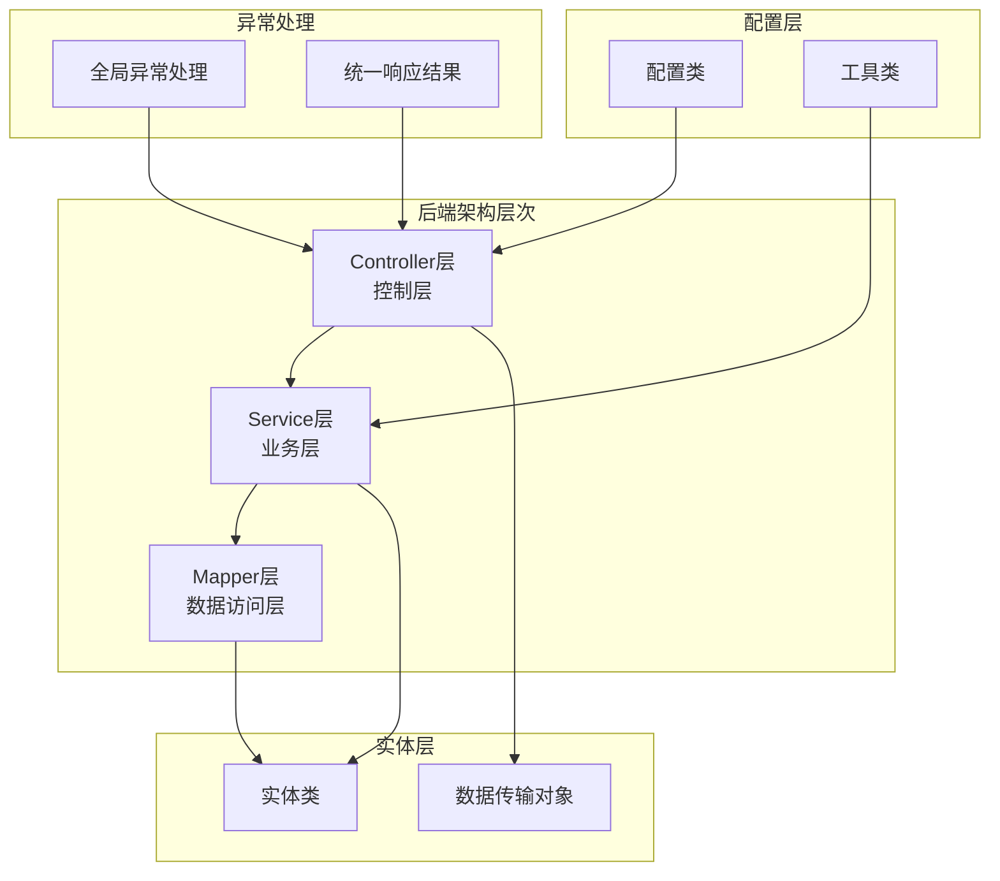

**图表来源**
- [AuthController.java](file://backend/src/main/java/com/carwash/controller/AuthController.java#L1-L130)
- [UserService.java](file://backend/src/main/java/com/carwash/service/UserService.java#L1-L102)
- [UserMapper.java](file://backend/src/main/java/com/carwash/mapper/UserMapper.java#L1-L73)

## 分层架构设计

### 设计原则

系统严格遵循分层架构设计原则，每层职责明确，边界清晰：

1. **关注点分离**：各层专注于特定职责，避免交叉污染
2. **依赖倒置**：高层不依赖低层，都依赖于抽象
3. **开闭原则**：对扩展开放，对修改关闭
4. **单一职责**：每个类和方法都有唯一职责

### 层次关系

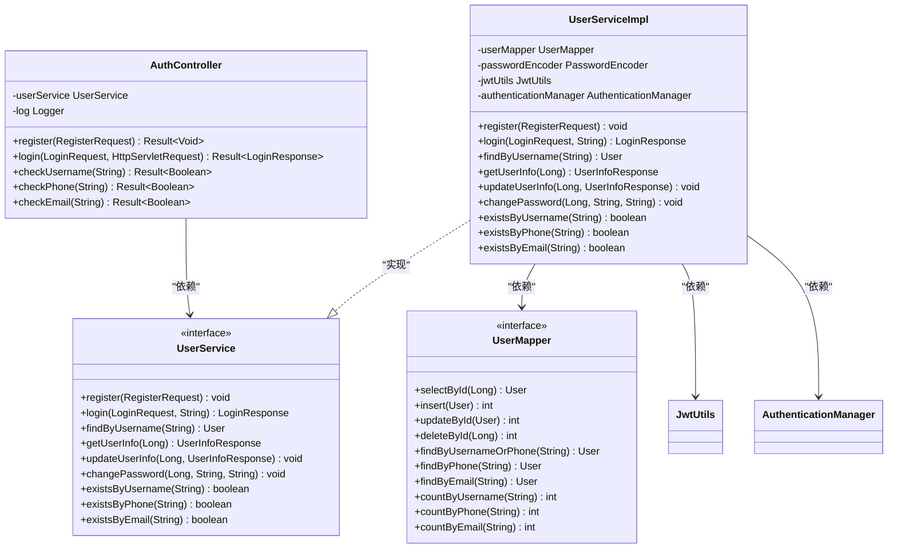

**图表来源**
- [AuthController.java](file://backend/src/main/java/com/carwash/controller/AuthController.java#L28-L130)
- [UserService.java](file://backend/src/main/java/com/carwash/service/UserService.java#L15-L102)
- [UserServiceImpl.java](file://backend/src/main/java/com/carwash/service/impl/UserServiceImpl.java#L41-L412)
- [UserMapper.java](file://backend/src/main/java/com/carwash/mapper/UserMapper.java#L15-L73)

**章节来源**
- [AuthController.java](file://backend/src/main/java/com/carwash/controller/AuthController.java#L1-L130)
- [UserService.java](file://backend/src/main/java/com/carwash/service/UserService.java#L1-L102)
- [UserServiceImpl.java](file://backend/src/main/java/com/carwash/service/impl/UserServiceImpl.java#L1-L412)
- [UserMapper.java](file://backend/src/main/java/com/carwash/mapper/UserMapper.java#L1-L73)

## Controller层详解

### 架构特点

Controller层作为系统的入口，负责：
- 接收HTTP请求并解析参数
- 调用Service层处理业务逻辑
- 返回标准化的响应结果
- 处理基本的参数验证

### 核心组件分析

#### AuthController设计

AuthController是认证模块的核心控制器，提供用户注册、登录、账户验证等功能：

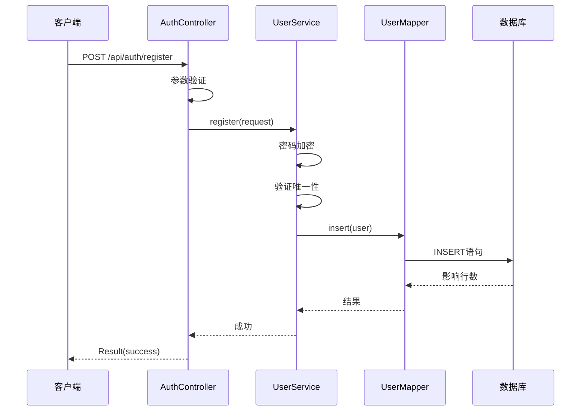

**图表来源**
- [AuthController.java](file://backend/src/main/java/com/carwash/controller/AuthController.java#L37-L42)
- [UserServiceImpl.java](file://backend/src/main/java/com/carwash/service/impl/UserServiceImpl.java#L68-L114)

#### 请求处理流程

Controller层采用以下处理流程：
1. **参数接收**：使用`@RequestBody`和`@RequestParam`接收请求参数
2. **参数验证**：通过`@Valid`注解触发Bean Validation
3. **业务调用**：调用对应的Service方法
4. **结果封装**：使用统一的Result类封装响应
5. **异常处理**：交由全局异常处理器处理

**章节来源**
- [AuthController.java](file://backend/src/main/java/com/carwash/controller/AuthController.java#L1-L130)

## Service层详解

### 业务逻辑封装

Service层是系统的核心，负责：
- 实现具体的业务规则和流程
- 协调多个Mapper的操作
- 处理事务管理
- 提供业务层面的异常处理

### UserService接口设计

UserService接口定义了用户相关的所有业务操作，体现了良好的接口设计原则：

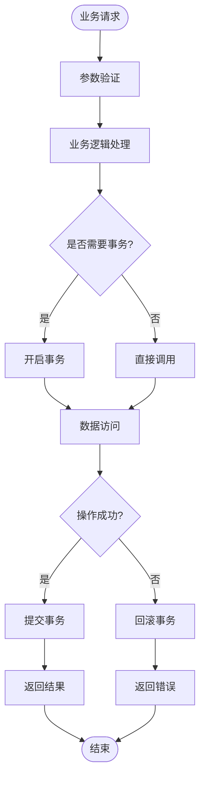

**图表来源**
- [UserServiceImpl.java](file://backend/src/main/java/com/carwash/service/impl/UserServiceImpl.java#L68-L154)

### 关键业务方法实现

#### 用户注册流程

用户注册是一个典型的业务流程，展示了Service层的复杂业务逻辑：

1. **密码验证**：确认两次输入的密码一致
2. **验证码验证**：验证短信验证码的有效性
3. **唯一性检查**：检查用户名、手机号、邮箱的唯一性
4. **密码加密**：使用PasswordEncoder加密密码
5. **用户创建**：创建User实体并保存到数据库

#### 登录认证流程

登录过程涉及Spring Security认证和JWT生成：

1. **身份验证**：使用AuthenticationManager验证用户名密码
2. **JWT生成**：生成包含用户信息的JWT Token
3. **用户信息获取**：查询用户详细信息
4. **响应构建**：构建包含Token和用户信息的响应

**章节来源**
- [UserService.java](file://backend/src/main/java/com/carwash/service/UserService.java#L1-L102)
- [UserServiceImpl.java](file://backend/src/main/java/com/carwash/service/impl/UserServiceImpl.java#L1-L412)

## Mapper层详解

### 数据访问抽象

Mapper层通过MyBatis Plus提供数据访问能力，主要特点：
- **继承BaseMapper**：获得通用CRUD操作
- **自定义SQL**：支持复杂的查询需求
- **逻辑删除**：内置软删除支持
- **自动填充**：自动处理创建和更新时间

### UserMapper设计

UserMapper展示了Mapper层的最佳实践：

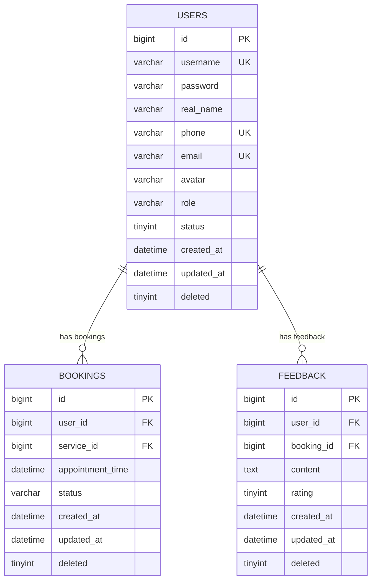

**图表来源**
- [User.java](file://backend/src/main/java/com/carwash/entity/User.java#L1-L190)
- [UserMapper.java](file://backend/src/main/java/com/carwash/mapper/UserMapper.java#L1-L73)

### SQL实现策略

Mapper层采用多种SQL实现策略：

1. **注解SQL**：简单的查询使用`@Select`注解
2. **XML映射**：复杂的查询使用XML配置
3. **条件构造器**：动态查询使用QueryWrapper
4. **自定义方法**：特殊业务需求的自定义方法

**章节来源**
- [UserMapper.java](file://backend/src/main/java/com/carwash/mapper/UserMapper.java#L1-L73)

## Spring Security与JWT认证机制

### 无状态认证架构

系统采用JWT（JSON Web Token）实现无状态认证，结合Spring Security提供完整的安全解决方案。

### SecurityConfig配置

SecurityConfig类配置了系统的安全策略：

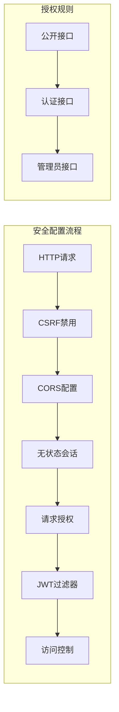

**图表来源**
- [SecurityConfig.java](file://backend/src/main/java/com/carwash/config/SecurityConfig.java#L61-L104)

### JWT认证流程

#### 登录认证流程

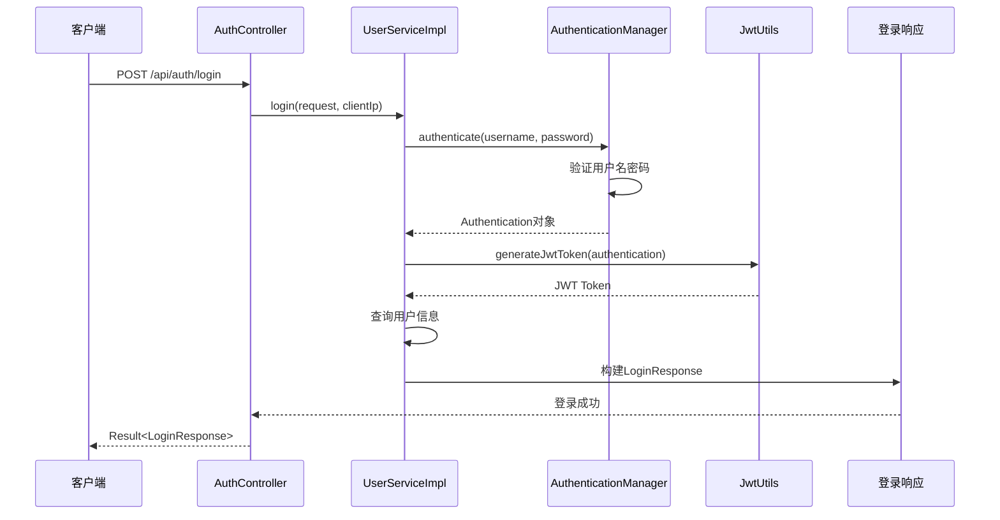

**图表来源**
- [UserServiceImpl.java](file://backend/src/main/java/com/carwash/service/impl/UserServiceImpl.java#L117-L154)
- [JwtUtils.java](file://backend/src/main/java/com/carwash/utils/JwtUtils.java#L36-L52)

#### JWT过滤器工作流程

JwtAuthenticationFilter负责验证每个请求的JWT Token：

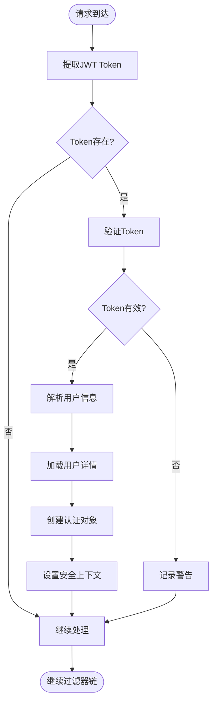

**图表来源**
- [JwtAuthenticationFilter.java](file://backend/src/main/java/com/carwash/common/JwtAuthenticationFilter.java#L40-L85)

### JWT工具类设计

JwtUtils类提供了JWT相关的核心功能：

1. **Token生成**：根据Authentication对象生成JWT
2. **Token验证**：验证JWT的签名和有效期
3. **用户信息提取**：从Token中提取用户名
4. **过期时间管理**：处理Token过期逻辑

**章节来源**
- [SecurityConfig.java](file://backend/src/main/java/com/carwash/config/SecurityConfig.java#L1-L133)
- [JwtAuthenticationFilter.java](file://backend/src/main/java/com/carwash/common/JwtAuthenticationFilter.java#L1-L107)
- [JwtUtils.java](file://backend/src/main/java/com/carwash/utils/JwtUtils.java#L1-L134)

## MyBatis Plus数据访问层

### 核心特性

MyBatis Plus为数据访问层提供了强大的功能支持：

1. **通用CRUD**：继承BaseMapper即可获得完整的CRUD操作
2. **分页插件**：内置分页功能，支持多数据库
3. **乐观锁**：自动处理并发冲突
4. **自动填充**：自动处理创建和更新时间
5. **逻辑删除**：支持软删除功能

### 配置详解

MybatisPlusConfig类配置了MyBatis Plus的各项功能：

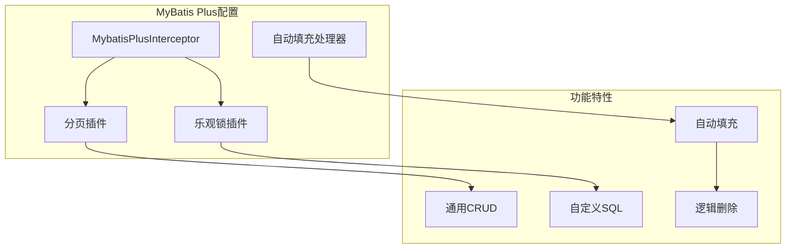

**图表来源**
- [MybatisPlusConfig.java](file://backend/src/main/java/com/carwash/config/MybatisPlusConfig.java#L29-L70)

### 实体类设计

User实体类展示了MyBatis Plus的注解使用：

1. **@TableId**：指定主键字段和生成策略
2. **@TableField**：配置普通字段映射
3. **@TableName**：指定数据库表名
4. **@TableLogic**：配置逻辑删除字段

### 自动填充机制

MyBatis Plus提供了自动填充功能，通过MetaObjectHandler接口实现：

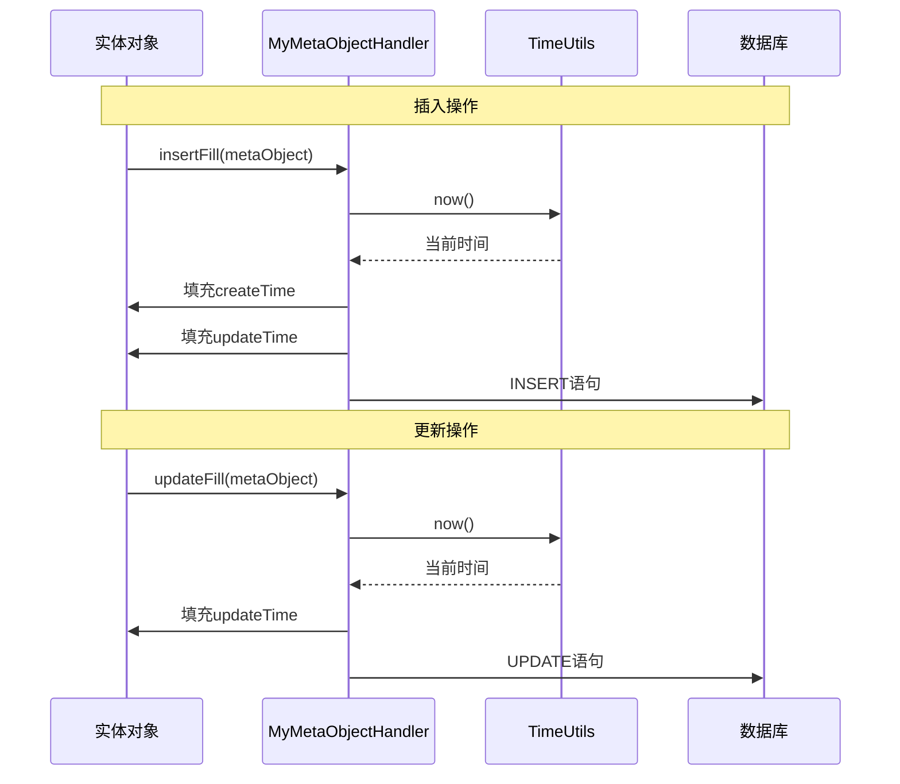

**图表来源**
- [MybatisPlusConfig.java](file://backend/src/main/java/com/carwash/config/MybatisPlusConfig.java#L49-L69)

**章节来源**
- [MybatisPlusConfig.java](file://backend/src/main/java/com/carwash/config/MybatisPlusConfig.java#L1-L70)

## 统一响应与异常处理

### 统一响应设计

Result类提供了统一的响应格式，确保前后端交互的一致性：

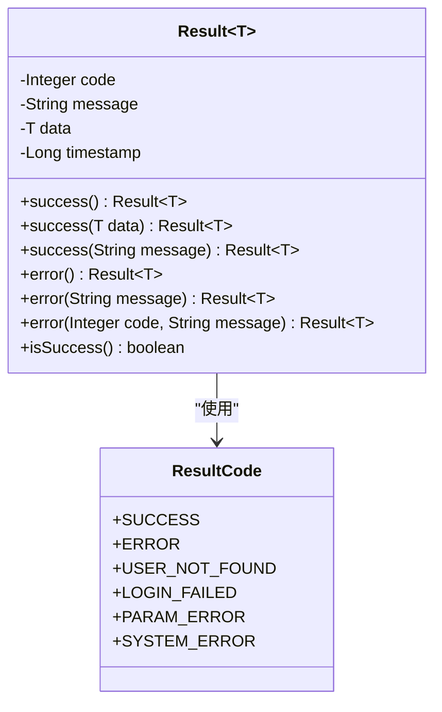

**图表来源**
- [Result.java](file://backend/src/main/java/com/carwash/common/result/Result.java#L13-L174)

### 全局异常处理

GlobalExceptionHandler类统一处理系统中的各种异常：

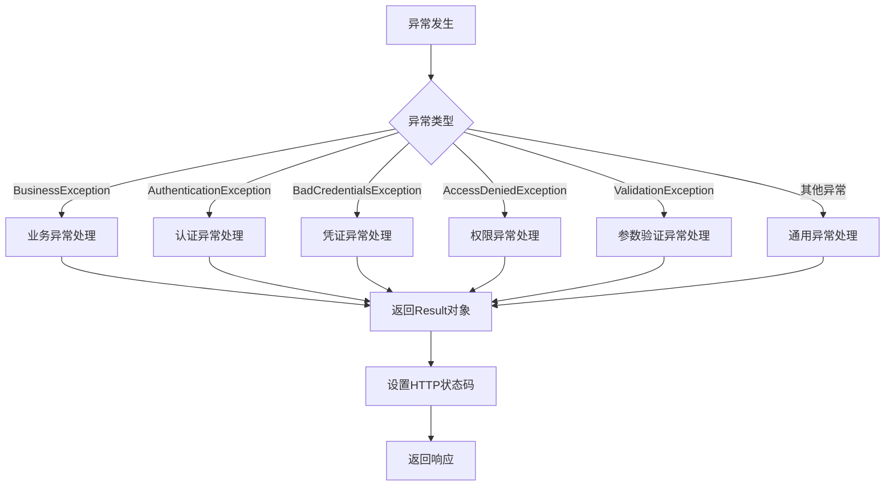

**图表来源**
- [GlobalExceptionHandler.java](file://backend/src/main/java/com/carwash/common/GlobalExceptionHandler.java#L37-L152)

### 异常处理策略

系统采用分层异常处理策略：

1. **业务异常**：通过BusinessException抛出，包含业务码和消息
2. **系统异常**：通过RuntimeException处理，提供默认错误信息
3. **参数异常**：通过Validation框架处理，提供详细的参数错误信息
4. **安全异常**：通过Spring Security处理，提供安全相关的错误信息

**章节来源**
- [Result.java](file://backend/src/main/java/com/carwash/common/result/Result.java#L1-L174)
- [GlobalExceptionHandler.java](file://backend/src/main/java/com/carwash/common/GlobalExceptionHandler.java#L1-L152)
- [BusinessException.java](file://backend/src/main/java/com/carwash/common/BusinessException.java#L1-L85)

## 架构优势与最佳实践

### 设计优势

1. **分层清晰**：严格的分层架构确保了代码的可维护性和可扩展性
2. **职责明确**：每层都有明确的职责边界，避免了职责混乱
3. **依赖可控**：通过接口隔离，降低了模块间的耦合度
4. **安全性强**：JWT无状态认证提供了良好的安全性保障
5. **性能优异**：MyBatis Plus的优化提升了数据访问效率

### 最佳实践

1. **统一响应格式**：Result类确保了前后端交互的一致性
2. **异常处理规范化**：全局异常处理器提供了统一的错误处理机制
3. **参数验证**：使用Bean Validation确保参数的合法性
4. **事务管理**：Service层的@Transactional注解确保了数据一致性
5. **日志记录**：完善的日志记录帮助快速定位问题

### 扩展性考虑

1. **微服务友好**：当前架构易于拆分为微服务
2. **缓存集成**：可以轻松集成Redis等缓存技术
3. **监控集成**：可以添加健康检查和性能监控
4. **国际化支持**：可以添加多语言支持
5. **审计功能**：可以添加操作审计功能

## 总结

本文档全面解析了汽车洗车服务预约系统的后端架构设计，展现了现代Java Web应用的最佳实践。该架构具有以下特点：

1. **架构清晰**：三层分层架构设计合理，职责分明
2. **安全可靠**：JWT无状态认证提供了良好的安全保障
3. **性能优秀**：MyBatis Plus优化了数据访问性能
4. **易于维护**：统一的响应格式和异常处理机制
5. **扩展性强**：良好的设计便于后续功能扩展

这套架构不仅满足了当前的功能需求，也为未来的系统演进奠定了坚实的基础。通过遵循这些设计原则和最佳实践，可以构建出高质量、可维护的企业级应用系统。