# 安全认证机制

<cite>
**本文档引用的文件**
- [JwtAuthenticationFilter.java](file://backend/src/main/java/com/carwash/common/JwtAuthenticationFilter.java)
- [JwtAuthenticationEntryPoint.java](file://backend/src/main/java/com/carwash/common/JwtAuthenticationEntryPoint.java)
- [SecurityConfig.java](file://backend/src/main/java/com/carwash/config/SecurityConfig.java)
- [UserDetailsServiceImpl.java](file://backend/src/main/java/com/carwash/service/impl/UserDetailsServiceImpl.java)
- [AuthController.java](file://backend/src/main/java/com/carwash/controller/AuthController.java)
- [JwtUtils.java](file://backend/src/main/java/com/carwash/utils/JwtUtils.java)
- [PasswordUtils.java](file://backend/src/main/java/com/carwash/utils/PasswordUtils.java)
- [UserService.java](file://backend/src/main/java/com/carwash/service/UserService.java)
- [User.java](file://backend/src/main/java/com/carwash/entity/User.java)
- [LoginRequest.java](file://backend/src/main/java/com/carwash/dto/LoginRequest.java)
- [RegisterRequest.java](file://backend/src/main/java/com/carwash/dto/RegisterRequest.java)
- [UserServiceImpl.java](file://backend/src/main/java/com/carwash/service/impl/UserServiceImpl.java)
</cite>

## 目录
1. [概述](#概述)
2. [系统架构](#系统架构)
3. [核心组件分析](#核心组件分析)
4. [安全配置详解](#安全配置详解)
5. [JWT认证机制](#jwt认证机制)
6. [用户身份验证](#用户身份验证)
7. [认证接口流程](#认证接口流程)
8. [安全工具类](#安全工具类)
9. [常见安全漏洞防范](#常见安全漏洞防范)
10. [调试与监控](#调试与监控)
11. [最佳实践建议](#最佳实践建议)

## 概述

本系统采用基于Spring Security与JWT（JSON Web Token）的无状态认证机制，为汽车洗车服务平台提供完整的用户认证和授权解决方案。该机制具有以下特点：

- **无状态设计**：服务器不保存会话信息，所有认证信息都包含在JWT中
- **安全性高**：采用BCrypt密码加密、HMAC-SHA512签名算法
- **可扩展性强**：支持角色权限控制和细粒度访问管理
- **性能优异**：避免了服务器端会话存储的开销

## 系统架构

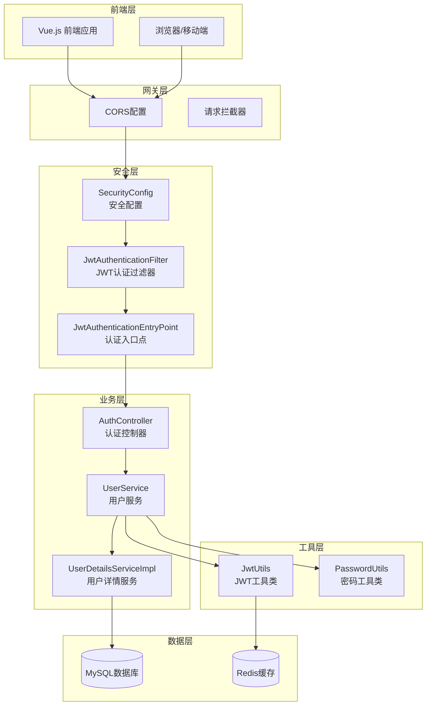

**图表来源**
- [SecurityConfig.java](file://backend/src/main/java/com/carwash/config/SecurityConfig.java#L30-L133)
- [JwtAuthenticationFilter.java](file://backend/src/main/java/com/carwash/common/JwtAuthenticationFilter.java#L30-L107)
- [AuthController.java](file://backend/src/main/java/com/carwash/controller/AuthController.java#L24-L130)

## 核心组件分析

### 安全配置组件

系统的核心安全配置由`SecurityConfig`类负责，它定义了整个认证体系的安全策略。

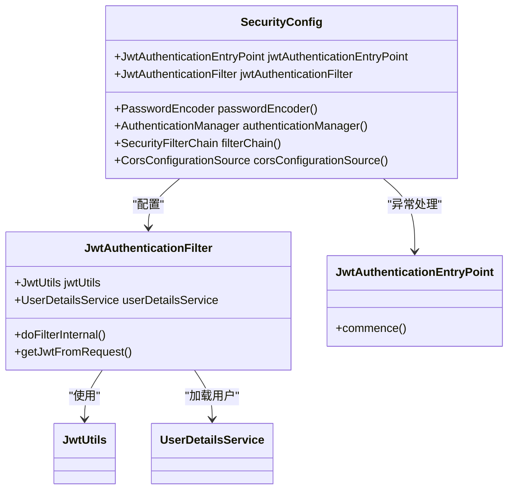

**图表来源**
- [SecurityConfig.java](file://backend/src/main/java/com/carwash/config/SecurityConfig.java#L30-L133)
- [JwtAuthenticationFilter.java](file://backend/src/main/java/com/carwash/common/JwtAuthenticationFilter.java#L30-L107)
- [JwtAuthenticationEntryPoint.java](file://backend/src/main/java/com/carwash/common/JwtAuthenticationEntryPoint.java#L22-L41)

### JWT认证过滤器

`JwtAuthenticationFilter`是整个认证机制的核心组件，负责拦截请求并验证JWT令牌。

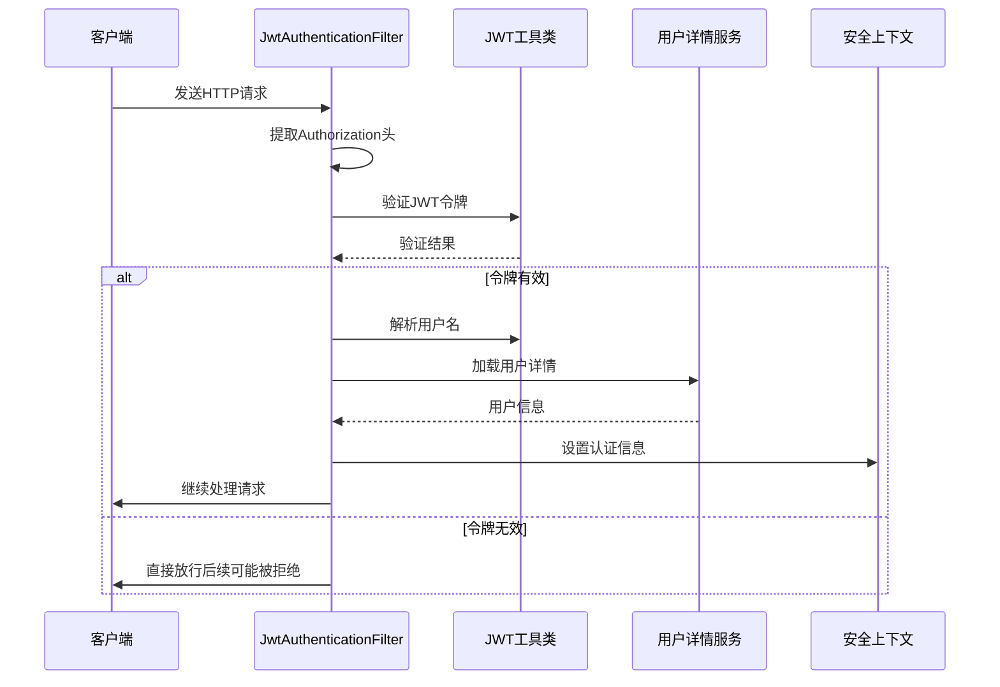

**图表来源**
- [JwtAuthenticationFilter.java](file://backend/src/main/java/com/carwash/common/JwtAuthenticationFilter.java#L40-L85)
- [JwtUtils.java](file://backend/src/main/java/com/carwash/utils/JwtUtils.java#L69-L103)

**节来源**
- [JwtAuthenticationFilter.java](file://backend/src/main/java/com/carwash/common/JwtAuthenticationFilter.java#L1-107)
- [SecurityConfig.java](file://backend/src/main/java/com/carwash/config/SecurityConfig.java#L60-L102)

## 安全配置详解

### 路径权限控制策略

系统采用细粒度的路径权限控制，根据不同的业务场景设置相应的访问权限：

| 请求路径模式 | 权限要求 | 说明 |
|-------------|----------|------|
| `/api/auth/**` | 无限制 | 认证相关接口，允许匿名访问 |
| `/api/public/**` | 无限制 | 公共接口，允许匿名访问 |
| `/api/services/list` | 无限制 | 服务列表接口 |
| `/api/time-slots/available` | 无限制 | 可用时间段查询 |
| `/api/bookings` | 无限制 | 预约相关接口 |
| `/api/admin/**` | ADMIN角色 | 管理员专用接口 |
| `/backend-admin/**` | ADMIN角色 | 管理后台页面 |
| `/api/payment/callback/**` | 无限制 | 第三方支付回调 |
| `/api/debug/**` | 无限制 | 调试接口 |
| `/api/test/**` | 无限制 | 测试接口 |
| `/doc.html` | 无限制 | Swagger文档 |
| `/webjars/**` | 无限制 | Swagger资源 |
| `/swagger-resources/**` | 无限制 | Swagger配置 |
| `/v3/api-docs/**` | 无限制 | API文档 |

### CSRF禁用策略

系统完全禁用了CSRF保护，适用于SPA（单页应用）和移动应用：

```java
// 禁用CSRF保护
http.csrf(csrf -> csrf.disable())
```

这种设计基于以下考虑：
- 前端应用通过JWT进行认证，不需要CSRF保护
- 移动应用不涉及Cookie认证
- 无状态设计天然抵御CSRF攻击

### 会话管理策略

系统配置为无状态会话管理：

```java
// 设置会话管理为无状态
.sessionManagement(session -> session.sessionCreationPolicy(SessionCreationPolicy.STATELESS))
```

无状态设计的优势：
- 服务器无需维护会话状态
- 易于水平扩展
- 减少内存消耗
- 提高系统吞吐量

**节来源**
- [SecurityConfig.java](file://backend/src/main/java/com/carwash/config/SecurityConfig.java#L60-L102)

## JWT认证机制

### JWT令牌结构

JWT（JSON Web Token）由三部分组成：Header、Payload和Signature。

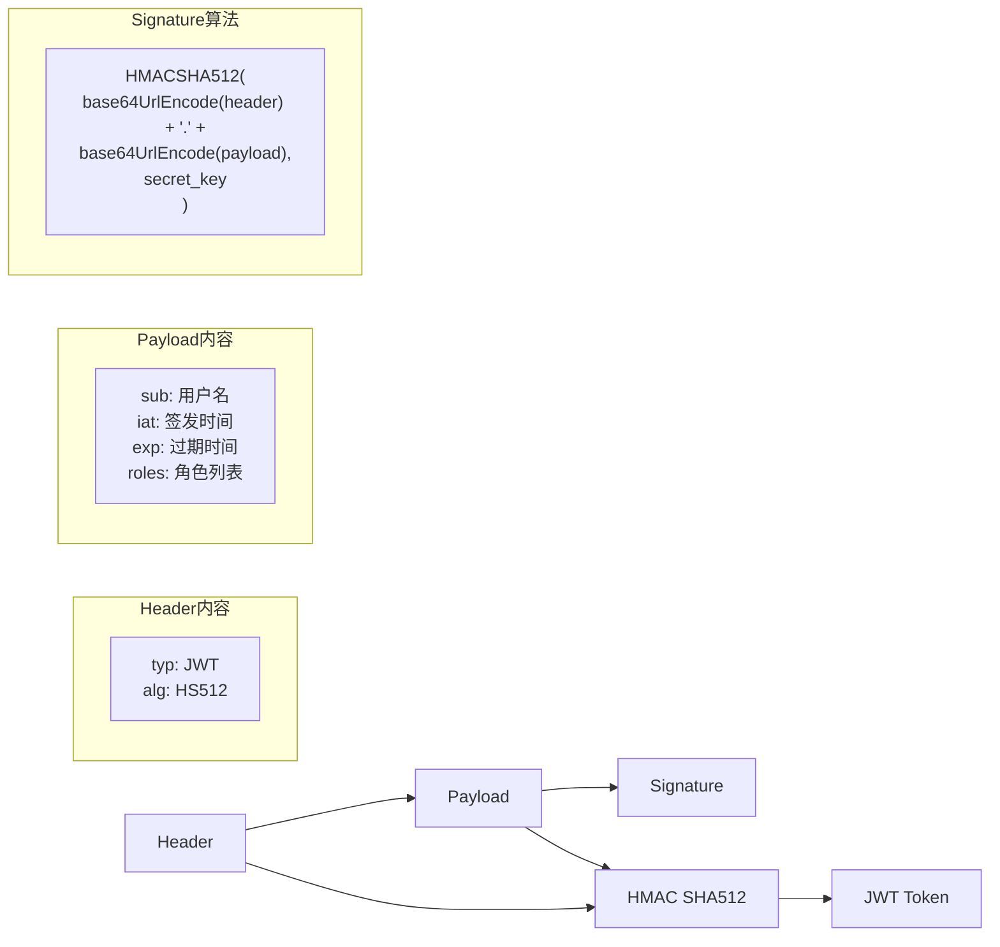

### JWT生成流程

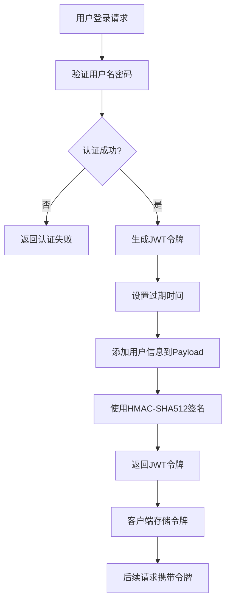

**图表来源**
- [JwtUtils.java](file://backend/src/main/java/com/carwash/utils/JwtUtils.java#L36-L52)
- [UserServiceImpl.java](file://backend/src/main/java/com/carwash/service/impl/UserServiceImpl.java#L128-L129)

### JWT验证机制

JWT验证过程包含多个层次的安全检查：

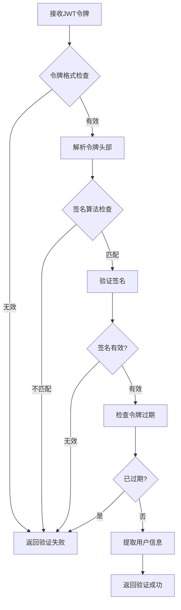

**图表来源**
- [JwtUtils.java](file://backend/src/main/java/com/carwash/utils/JwtUtils.java#L69-L103)

### JWT工具类实现

`JwtUtils`类提供了完整的JWT操作功能：

| 方法名称 | 功能描述 | 输入参数 | 返回值 |
|---------|----------|----------|--------|
| `generateJwtToken` | 生成JWT令牌 | Authentication对象 | String |
| `generateTokenFromUsername` | 根据用户名生成令牌 | 用户名 | String |
| `getUsernameFromToken` | 从令牌中提取用户名 | JWT令牌 | String |
| `validateToken` | 验证令牌有效性 | JWT令牌 | boolean |
| `getExpirationDateFromToken` | 获取过期时间 | JWT令牌 | Date |
| `isTokenExpired` | 检查是否过期 | JWT令牌 | boolean |

**节来源**
- [JwtUtils.java](file://backend/src/main/java/com/carwash/utils/JwtUtils.java#L1-134)

## 用户身份验证

### 用户详情服务

`UserDetailsServiceImpl`实现了Spring Security的`UserDetailsService`接口，负责加载用户身份信息。

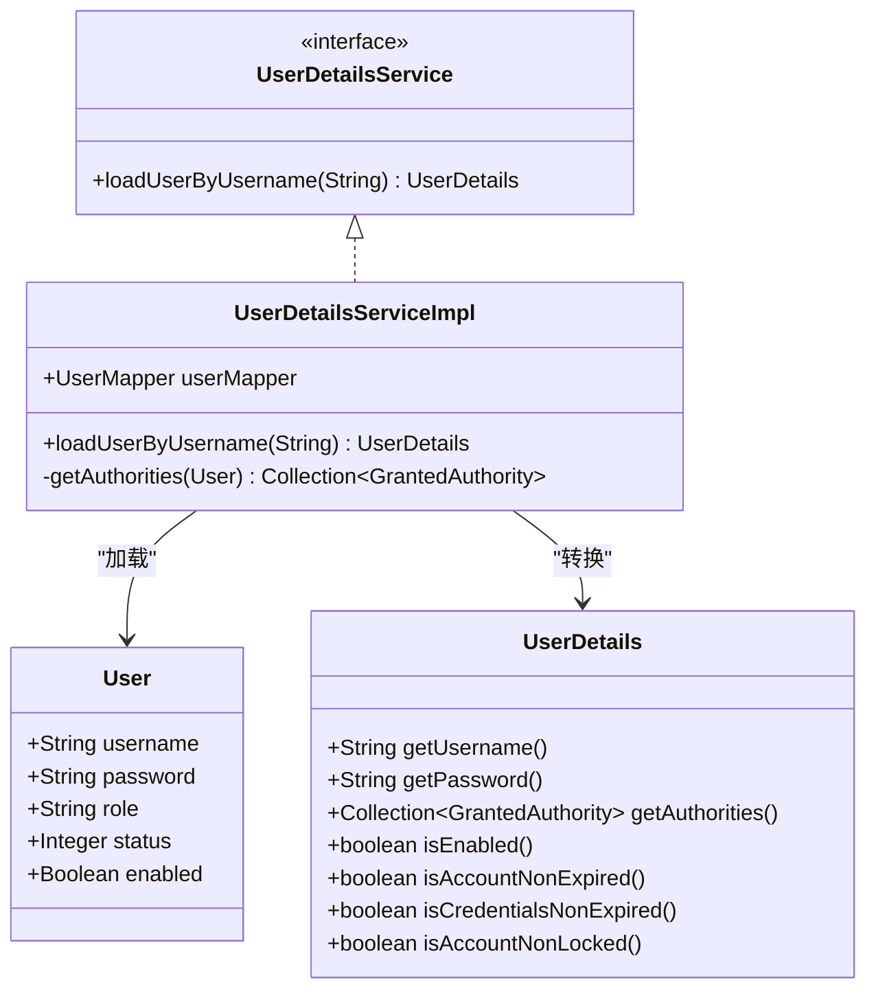

**图表来源**
- [UserDetailsServiceImpl.java](file://backend/src/main/java/com/carwash/service/impl/UserDetailsServiceImpl.java#L25-L82)
- [User.java](file://backend/src/main/java/com/carwash/entity/User.java#L18-L91)

### 用户状态检查

系统在加载用户信息时会进行多层状态检查：

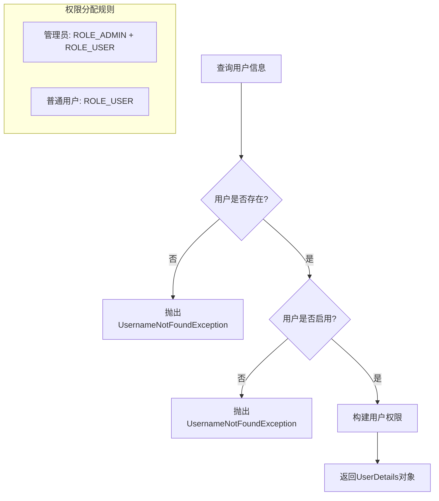

**图表来源**
- [UserDetailsServiceImpl.java](file://backend/src/main/java/com/carwash/service/impl/UserDetailsServiceImpl.java#L32-L81)

### 密码加密存储

系统采用BCrypt算法对用户密码进行加密存储：

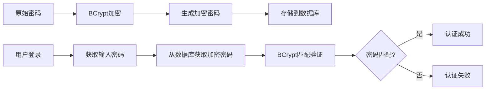

**图表来源**
- [PasswordUtils.java](file://backend/src/main/java/com/carwash/utils/PasswordUtils.java#L17-L37)

**节来源**
- [UserDetailsServiceImpl.java](file://backend/src/main/java/com/carwash/service/impl/UserDetailsServiceImpl.java#L1-82)
- [PasswordUtils.java](file://backend/src/main/java/com/carwash/utils/PasswordUtils.java#L1-83)

## 认证接口流程

### 登录接口流程

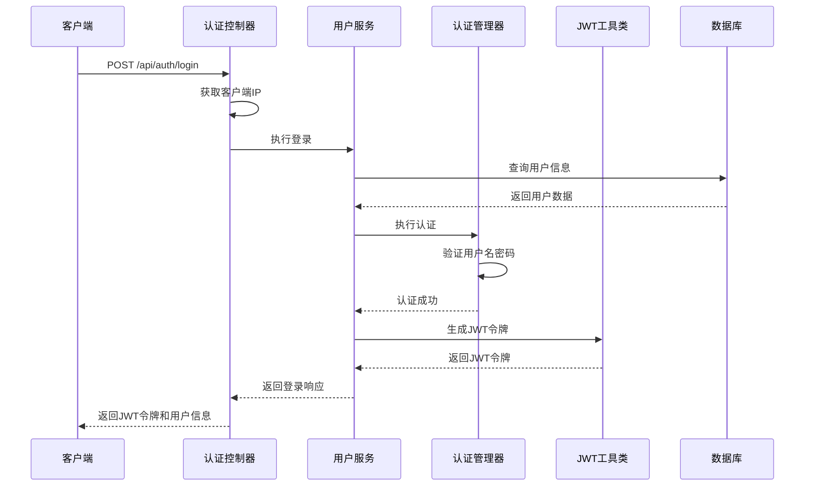

**图表来源**
- [AuthController.java](file://backend/src/main/java/com/carwash/controller/AuthController.java#L48-L57)
- [UserServiceImpl.java](file://backend/src/main/java/com/carwash/service/impl/UserServiceImpl.java#L117-L158)

### 注册接口流程

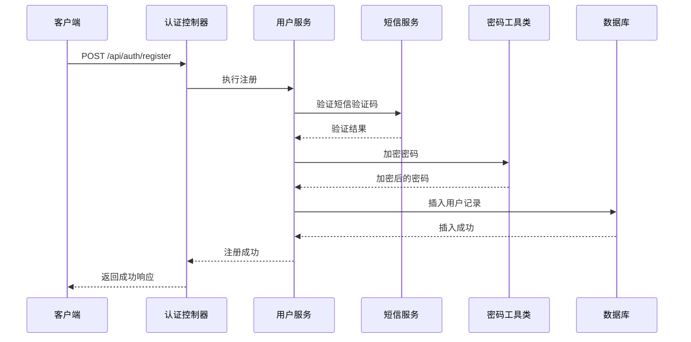

**图表来源**
- [AuthController.java](file://backend/src/main/java/com/carwash/controller/AuthController.java#L37-L42)
- [UserServiceImpl.java](file://backend/src/main/java/com/carwash/service/impl/UserServiceImpl.java#L68-L114)

### 客户端IP获取机制

系统实现了智能的客户端IP获取机制，支持多种代理环境：

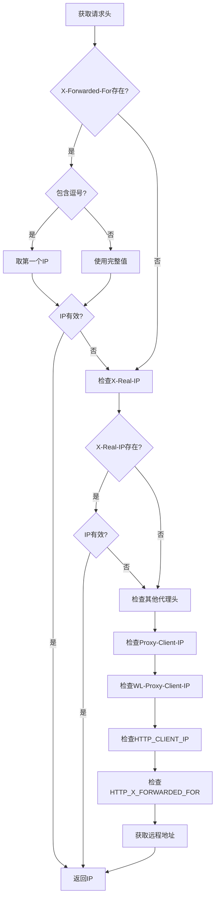

**图表来源**
- [AuthController.java](file://backend/src/main/java/com/carwash/controller/AuthController.java#L90-L129)

**节来源**
- [AuthController.java](file://backend/src/main/java/com/carwash/controller/AuthController.java#L1-130)
- [UserServiceImpl.java](file://backend/src/main/java/com/carwash/service/impl/UserServiceImpl.java#L117-L158)

## 安全工具类

### JWT工具类功能

`JwtUtils`提供了完整的JWT操作功能，包括生成、解析和验证：

| 功能模块 | 主要方法 | 安全特性 |
|---------|----------|----------|
| 令牌生成 | `generateJwtToken()` | HMAC-SHA512签名，随机密钥 |
| 令牌解析 | `getUsernameFromToken()` | 签名验证，防止篡改 |
| 令牌验证 | `validateToken()` | 多层次异常处理，安全检查 |
| 过期检查 | `isTokenExpired()` | 时间戳验证 |
| 密钥管理 | `getSigningKey()` | Base64编码密钥 |

### 密码工具类功能

`PasswordUtils`提供了密码相关的安全功能：

| 功能 | 方法 | 安全特性 |
|------|------|----------|
| 密码加密 | `encode()` | BCrypt算法，加盐处理 |
| 密码验证 | `matches()` | 安全比较算法 |
| 强度检查 | `checkPasswordStrength()` | 正则表达式验证 |
| 格式验证 | `isValidPassword()` | 长度和复杂度检查 |
| 随机密码生成 | `generateRandomPassword()` | 密码学安全随机数 |

### 密码安全策略

系统采用多层次的密码安全策略：

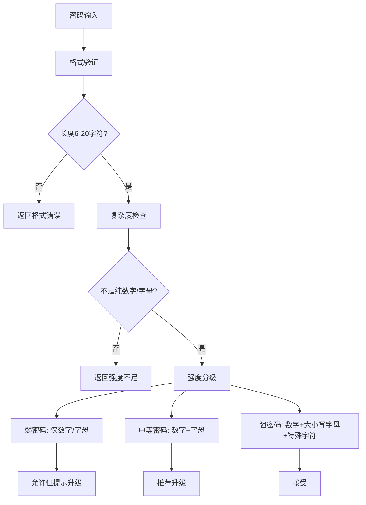

**图表来源**
- [PasswordUtils.java](file://backend/src/main/java/com/carwash/utils/PasswordUtils.java#L20-L24)
- [PasswordUtils.java](file://backend/src/main/java/com/carwash/utils/PasswordUtils.java#L58-L70)

**节来源**
- [JwtUtils.java](file://backend/src/main/java/com/carwash/utils/JwtUtils.java#L1-134)
- [PasswordUtils.java](file://backend/src/main/java/com/carwash/utils/PasswordUtils.java#L1-83)

## 常见安全漏洞防范

### XSS防护

系统通过以下措施防范跨站脚本攻击：

1. **输入验证**：所有用户输入都经过严格验证
2. **输出编码**：敏感数据在前端显示时进行HTML编码
3. **CORS配置**：严格的跨域资源共享配置

### CSRF防护

虽然禁用了CSRF保护，但系统通过以下方式确保安全性：

1. **JWT认证**：基于令牌的认证天然抵御CSRF
2. **无状态设计**：服务器不维护会话状态
3. **HTTPS强制**：所有通信都通过HTTPS加密

### SQL注入防护

系统采用MyBatis Plus框架，自动防止SQL注入：

```java
// 使用MyBatis Plus的QueryWrapper
QueryWrapper<User> queryWrapper = new QueryWrapper<>();
queryWrapper.eq("username", username).or().eq("phone", username);
User user = userMapper.selectOne(queryWrapper);
```

### 敏感信息保护

1. **密码加密**：使用BCrypt算法加密存储
2. **日志脱敏**：敏感信息在日志中进行脱敏处理
3. **令牌安全**：JWT令牌包含过期时间，定期刷新

### 异常处理机制

系统实现了完善的异常处理机制：

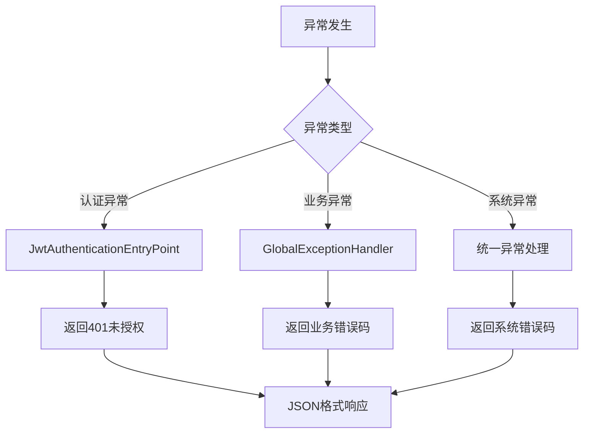

**图表来源**
- [JwtAuthenticationEntryPoint.java](file://backend/src/main/java/com/carwash/common/JwtAuthenticationEntryPoint.java#L25-L40)

## 调试与监控

### 日志记录策略

系统采用分层的日志记录策略：

| 日志级别 | 记录内容 | 示例 |
|---------|----------|------|
| DEBUG | 详细执行流程 | JWT令牌提取、验证过程 |
| INFO | 关键业务操作 | 用户登录、注册成功 |
| WARN | 异常情况 | JWT验证失败、用户不存在 |
| ERROR | 错误异常 | 认证失败、数据库异常 |

### 性能监控指标

系统监控以下关键性能指标：

1. **认证响应时间**：平均认证处理时间
2. **JWT验证成功率**：令牌验证的成功率
3. **用户认证频率**：每分钟认证请求数
4. **异常率统计**：各类异常的发生频率

### 调试工具

系统提供了多种调试工具：

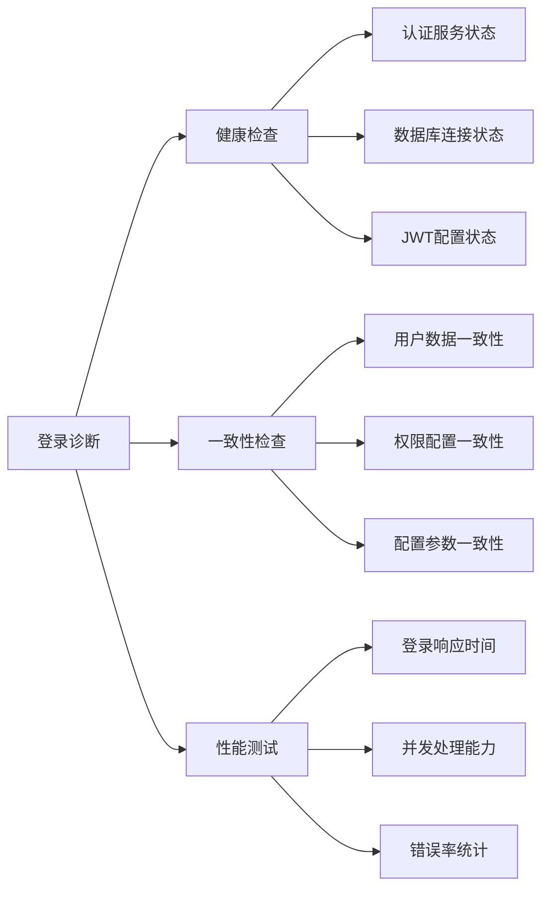

**节来源**
- [JwtAuthenticationFilter.java](file://backend/src/main/java/com/carwash/common/JwtAuthenticationFilter.java#L45-L85)
- [JwtAuthenticationEntryPoint.java](file://backend/src/main/java/com/carwash/common/JwtAuthenticationEntryPoint.java#L25-L40)

## 最佳实践建议

### 生产环境部署建议

1. **密钥管理**
   - 使用环境变量存储JWT密钥
   - 定期轮换密钥
   - 使用硬件安全模块（HSM）保护密钥

2. **HTTPS配置**
   - 强制使用HTTPS协议
   - 配置HSTS头
   - 使用强加密套件

3. **CORS配置**
   - 限制允许的域名
   - 避免使用通配符
   - 配置预检请求缓存时间

### 性能优化建议

1. **JWT令牌优化**
   - 合理设置令牌过期时间
   - 使用适当的签名算法
   - 考虑令牌刷新机制

2. **数据库优化**
   - 为用户名和手机号建立索引
   - 使用连接池管理数据库连接
   - 定期清理过期数据

3. **缓存策略**
   - 缓存用户权限信息
   - 缓存频繁查询的数据
   - 使用Redis提高性能

### 安全加固建议

1. **输入验证**
   - 对所有用户输入进行严格验证
   - 使用白名单验证机制
   - 防止注入攻击

2. **速率限制**
   - 实施登录频率限制
   - 防止暴力破解攻击
   - 监控异常访问模式

3. **审计日志**
   - 记录所有认证相关操作
   - 包含用户IP和时间戳
   - 定期审查日志文件

### 监控告警配置

建议配置以下监控告警：

1. **认证失败告警**：连续多次认证失败
2. **异常流量告警**：异常的请求模式
3. **性能告警**：响应时间超过阈值
4. **安全事件告警**：可疑的访问行为

通过以上全面的安全认证机制，系统能够为汽车洗车服务平台提供可靠、高效、安全的用户认证服务，确保系统的稳定运行和用户数据的安全性。