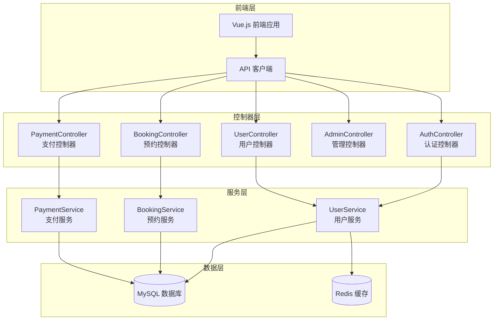
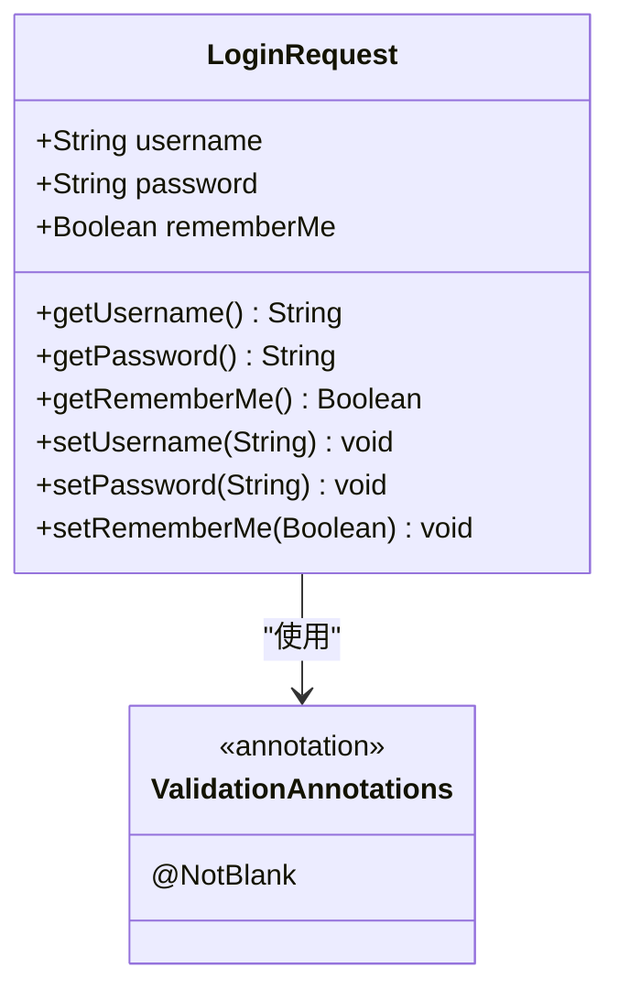
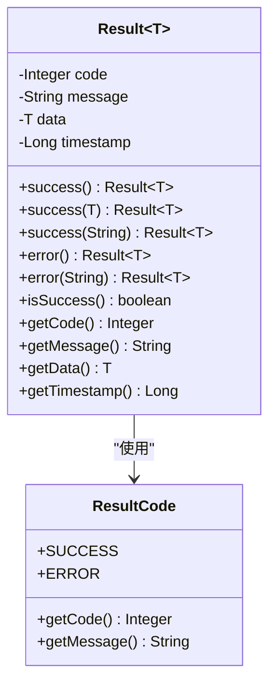
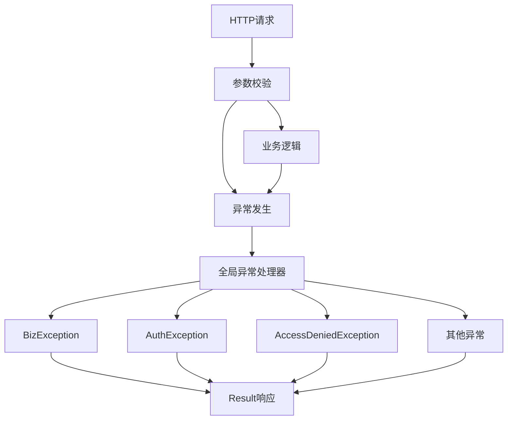

# 控制器层设计

<cite>
**本文档引用的文件**
- [AuthController.java](file://backend/src/main/java/com/carwash/controller/AuthController.java)
- [BookingController.java](file://backend/src/main/java/com/carwash/controller/BookingController.java)
- [UserController.java](file://backend/src/main/java/com/carwash/controller/UserController.java)
- [AdminController.java](file://backend/src/main/java/com/carwash/controller/AdminController.java)
- [LoginRequest.java](file://backend/src/main/java/com/carwash/dto/LoginRequest.java)
- [RegisterRequest.java](file://backend/src/main/java/com/carwash/dto/RegisterRequest.java)
- [BookingRequest.java](file://backend/src/main/java/com/carwash/dto/BookingRequest.java)
- [BookingResponse.java](file://backend/src/main/java/com/carwash/dto/BookingResponse.java)
- [Result.java](file://backend/src/main/java/com/carwash/common/result/Result.java)
- [SwaggerConfig.java](file://backend/src/main/java/com/carwash/config/SwaggerConfig.java)
- [GlobalExceptionHandler.java](file://backend/src/main/java/com/carwash/common/GlobalExceptionHandler.java)
- [SecurityConfig.java](file://backend/src/main/java/com/carwash/config/SecurityConfig.java)
- [SecurityUtils.java](file://backend/src/main/java/com/carwash/utils/SecurityUtils.java)
</cite>

## 目录
1. [引言](#引言)
2. [项目架构概览](#项目架构概览)
3. [核心控制器组件](#核心控制器组件)
4. [DTO对象设计](#dto对象设计)
5. [统一响应结构](#统一响应结构)
6. [API文档自动生成](#api文档自动生成)
7. [权限控制机制](#权限控制机制)
8. [异常处理体系](#异常处理体系)
9. [最佳实践指南](#最佳实践指南)
10. [总结](#总结)

## 引言

Spring MVC控制器层是汽车洗车服务预约系统的核心业务逻辑处理模块，负责接收HTTP请求、处理业务逻辑、返回标准化响应。本系统采用分层架构设计，控制器层作为表现层的重要组成部分，承担着RESTful API设计、参数校验、权限控制、异常处理等关键职责。

## 项目架构概览

系统采用标准的三层架构模式，控制器层位于最上层，直接与前端交互：



**图表来源**
- [AuthController.java](file://backend/src/main/java/com/carwash/controller/AuthController.java#L24-L27)
- [BookingController.java](file://backend/src/main/java/com/carwash/controller/BookingController.java#L26-L28)
- [UserController.java](file://backend/src/main/java/com/carwash/controller/UserController.java#L23-L26)

## 核心控制器组件

### 认证控制器 (AuthController)

认证控制器负责用户身份验证相关的所有API接口，包括注册、登录、用户名检查等功能。

#### 主要职责
- 用户注册管理
- 用户登录认证
- 用户名/手机号/邮箱唯一性验证
- IP地址获取与安全记录

#### 接口设计特点
- 使用`@RestController`注解提供RESTful风格接口
- 采用`@RequestMapping("/api/auth")`统一路径前缀
- 使用`@Tag`注解进行API分类标记
- 集成Swagger文档生成

**章节来源**
- [AuthController.java](file://backend/src/main/java/com/carwash/controller/AuthController.java#L24-L27)

### 预约控制器 (BookingController)

预约控制器是系统的核心业务控制器，处理所有与预约相关的CRUD操作。

#### 功能模块
- **订单创建**: 处理用户预约请求
- **订单查询**: 支持多种查询条件
- **订单管理**: 包括取消、删除、状态更新
- **管理员功能**: 提供完整的订单管理接口

#### 权限控制
- 用户级接口: `@PreAuthorize("hasRole('USER') or hasRole('ADMIN')")`
- 管理员接口: `@PreAuthorize("hasRole('ADMIN')")`

**章节来源**
- [BookingController.java](file://backend/src/main/java/com/carwash/controller/BookingController.java#L26-L28)

### 用户控制器 (UserController)

用户控制器专注于用户信息管理和个人相关操作。

#### 核心功能
- 当前用户信息获取与更新
- 密码修改功能
- 用户信息管理（管理员专用）

**章节来源**
- [UserController.java](file://backend/src/main/java/com/carwash/controller/UserController.java#L23-L26)

### 管理控制器 (AdminController)

管理控制器提供后端管理界面，采用传统的MVC模式而非RESTful API。

#### 特点
- 使用`@Controller`而非`@RestController`
- 返回视图模板而非JSON响应
- 路径前缀为`/backend-admin`避免与前端路由冲突

**章节来源**
- [AdminController.java](file://backend/src/main/java/com/carwash/controller/AdminController.java#L14-L16)

## DTO对象设计

### 请求DTO设计原则

系统采用专门的DTO（Data Transfer Object）对象来封装请求和响应数据，确保数据传输的安全性和可维护性。

#### LoginRequest - 登录请求DTO



**图表来源**
- [LoginRequest.java](file://backend/src/main/java/com/carwash/dto/LoginRequest.java#L13-L58)

#### RegisterRequest - 注册请求DTO

注册DTO包含了完整的用户注册信息，并实现了严格的参数校验规则：

- **用户名校验**: 非空、长度限制、字符限制
- **密码校验**: 非空、长度限制
- **确认密码**: 必须与密码一致
- **手机号校验**: 符合中国大陆手机号格式
- **邮箱校验**: 标准邮箱格式
- **验证码校验**: 6位数字

**章节来源**
- [RegisterRequest.java](file://backend/src/main/java/com/carwash/dto/RegisterRequest.java#L16-L124)

#### BookingRequest - 预约请求DTO

预约请求DTO封装了完整的预约信息：

- **用户信息**: 用户ID、联系方式
- **服务信息**: 服务ID、时间段ID
- **车辆信息**: 车牌号、车型
- **预约信息**: 预约日期、备注

**章节来源**
- [BookingRequest.java](file://backend/src/main/java/com/carwash/dto/BookingRequest.java#L12-L120)

### 响应DTO设计

#### BookingResponse - 预约响应DTO

响应DTO不仅包含基础的预约信息，还包含了完整的订单生命周期状态：

- **订单基本信息**: ID、订单号、状态
- **服务信息**: 服务名称、价格
- **时间信息**: 创建时间、支付时间、完成时间
- **状态信息**: 支付状态、取消原因

**章节来源**
- [BookingResponse.java](file://backend/src/main/java/com/carwash/dto/BookingResponse.java#L14-L129)

## 统一响应结构

### Result类设计原理

系统采用统一的响应结构`Result<T>`来标准化所有API的返回格式，确保前后端交互的一致性。



**图表来源**
- [Result.java](file://backend/src/main/java/com/carwash/common/result/Result.java#L13-L174)

### 响应结构特性

#### 标准化字段
- **code**: 响应码，0表示成功，非0表示失败
- **message**: 响应消息，描述操作结果
- **data**: 响应数据，泛型支持任意类型
- **timestamp**: 时间戳，自动添加

#### 静态工厂方法
系统提供了丰富的静态方法来创建不同类型的响应：
- `Result.success()`: 成功响应
- `Result.error()`: 错误响应
- 支持自定义消息和数据

**章节来源**
- [Result.java](file://backend/src/main/java/com/carwash/common/result/Result.java#L58-L123)

## API文档自动生成

### Swagger集成配置

系统集成了Swagger 3.0来自动生成API文档，提供交互式的API测试界面。

#### 配置特点
- **标题配置**: "汽车洗车服务预约系统 API文档"
- **安全性配置**: JWT Bearer Token认证
- **版本管理**: API版本信息明确标注

**章节来源**
- [SwaggerConfig.java](file://backend/src/main/java/com/carwash/config/SwaggerConfig.java#L25-L47)

### 文档注解使用

#### 方法级别注解
- `@Operation`: 描述接口功能和用途
- `@Tag`: 对接口进行分类标记

#### 参数级别注解
- `@RequestBody`: 标记请求体参数
- `@RequestParam`: 标记查询参数
- `@PathVariable`: 标记路径参数

## 权限控制机制

### Spring Security集成

系统采用Spring Security框架实现细粒度的权限控制。

#### 安全配置
- **JWT认证**: 使用JWT令牌进行无状态认证
- **CORS配置**: 支持跨域资源共享
- **CSRF禁用**: 由于使用JWT，禁用CSRF保护

**章节来源**
- [SecurityConfig.java](file://backend/src/main/java/com/carwash/config/SecurityConfig.java#L30-L71)

### @PreAuthorize注解使用

#### 角色权限控制
- `hasRole('USER')`: 用户角色权限
- `hasRole('ADMIN')`: 管理员角色权限

#### 权限验证流程
1. JWT令牌解析
2. 用户身份验证
3. 角色权限检查
4. 访问授权

**章节来源**
- [BookingController.java](file://backend/src/main/java/com/carwash/controller/BookingController.java#L69-L70)
- [UserController.java](file://backend/src/main/java/com/carwash/controller/UserController.java#L106-L107)

### 安全工具类

系统提供了`SecurityUtils`工具类来简化安全相关的操作：

#### 功能特性
- 获取当前用户信息
- 检查用户认证状态
- 获取用户权限信息
- 用户ID获取

**章节来源**
- [SecurityUtils.java](file://backend/src/main/java/com/carwash/utils/SecurityUtils.java#L17-L124)

## 异常处理体系

### 全局异常处理器

系统实现了统一的异常处理机制，将各种异常转换为标准化的响应格式。



**图表来源**
- [GlobalExceptionHandler.java](file://backend/src/main/java/com/carwash/common/GlobalExceptionHandler.java#L30-L152)

### 异常类型处理

#### 业务异常 (BusinessException)
- 业务逻辑错误
- 返回HTTP 200状态码
- 包含具体的错误代码和消息

#### 认证异常 (AuthenticationException)
- 身份验证失败
- 返回HTTP 401状态码

#### 权限异常 (AccessDeniedException)
- 权限不足
- 返回HTTP 403状态码

#### 参数校验异常
- `MethodArgumentNotValidException`: @RequestBody参数校验
- `BindException`: @ModelAttribute参数校验
- `ConstraintViolationException`: @RequestParam参数校验

**章节来源**
- [GlobalExceptionHandler.java](file://backend/src/main/java/com/carwash/common/GlobalExceptionHandler.java#L37-L151)

## 最佳实践指南

### 接口设计规范

#### RESTful设计原则
1. **资源命名**: 使用名词表示资源，复数形式
2. **HTTP方法**: 正确使用GET、POST、PUT、DELETE
3. **状态码**: 返回适当的HTTP状态码
4. **幂等性**: DELETE和PUT操作应该是幂等的

#### 请求映射示例
```java
// 创建预约 - POST /api/bookings
@PostMapping
public Result<BookingResponse> createBooking(@RequestBody BookingRequest request);

// 获取用户订单 - GET /api/bookings/user/{userId}
@GetMapping("/user/{userId}")
public Result<List<BookingResponse>> getUserBookings(@PathVariable Long userId);
```

### 参数绑定最佳实践

#### 类型安全
- 使用强类型DTO对象
- 利用注解进行参数校验
- 避免使用原始类型

#### 校验策略
- `@Valid`: 触发嵌套对象校验
- `@NotNull`: 必填字段校验
- `@Size`: 字符串长度校验
- `@Pattern`: 正则表达式校验

### 权限注解使用指南

#### 角色级别控制
```java
// 用户级操作
@PreAuthorize("hasRole('USER') or hasRole('ADMIN')")

// 管理员级操作  
@PreAuthorize("hasRole('ADMIN')")
```

#### 细粒度权限控制
- 基于角色的访问控制 (RBAC)
- 支持多角色组合
- 动态权限检查

### 请求日志记录

#### 日志记录策略
1. **请求开始**: 记录请求参数和用户信息
2. **业务处理**: 记录关键业务步骤
3. **请求结束**: 记录响应结果和耗时

#### 日志内容示例
```java
log.info("用户登录请求，用户名: {}", request.getUsername());
log.info("创建预约订单请求: {}", request);
log.info("订单状态更新成功，订单ID: {}, 新状态: {}", bookingId, updatedBooking.getStatus());
```

### 性能监控最佳实践

#### 接口性能指标
- **响应时间**: 记录每个接口的处理时间
- **吞吐量**: 监控每秒处理的请求数
- **错误率**: 统计各类错误的发生频率

#### 监控实现建议
1. **AOP切面**: 统一记录接口调用信息
2. **定时任务**: 定期检查系统健康状态
3. **告警机制**: 异常情况及时通知

### 接口版本控制

#### 版本控制策略
- **URL版本**: `/api/v1/bookings`
- **Header版本**: `Accept: application/vnd.carwash.v1+json`
- **参数版本**: `?version=v1`

#### 迁移策略
- 渐进式废弃旧版本
- 提供迁移指南
- 保持向后兼容

## 总结

汽车洗车服务预约系统的控制器层设计体现了现代Spring Boot应用的最佳实践。通过合理的分层架构、标准化的DTO设计、统一的响应结构、完善的异常处理机制和细粒度的权限控制，系统实现了高内聚、低耦合的架构目标。

### 设计亮点

1. **RESTful API设计**: 符合REST架构原则，接口语义清晰
2. **DTO模式**: 确保数据传输的安全性和可维护性
3. **统一响应结构**: 提供一致的API体验
4. **Swagger集成**: 自动生成API文档，提升开发效率
5. **权限控制**: 基于Spring Security的细粒度权限管理
6. **异常处理**: 全局异常处理，保证系统稳定性

### 技术优势

- **可扩展性**: 模块化设计便于功能扩展
- **可维护性**: 标准化的代码结构和注释
- **可测试性**: 清晰的职责分离便于单元测试
- **可观测性**: 完善的日志记录和监控机制

这套控制器层设计方案为构建高质量的企业级应用提供了良好的参考范例，展现了Spring MVC框架的强大功能和灵活性。