# 数据访问层

<cite>
**本文档引用的文件**
- [MybatisPlusConfig.java](file://backend/src/main/java/com/carwash/config/MybatisPlusConfig.java)
- [PaymentMapper.xml](file://backend/src/main/resources/mapper/PaymentMapper.xml)
- [User.java](file://backend/src/main/java/com/carwash/entity/User.java)
- [Booking.java](file://backend/src/main/java/com/carwash/entity/Booking.java)
- [Payment.java](file://backend/src/main/java/com/carwash/entity/Payment.java)
- [UserMapper.java](file://backend/src/main/java/com/carwash/mapper/UserMapper.java)
- [BookingMapper.java](file://backend/src/main/java/com/carwash/mapper/BookingMapper.java)
- [PaymentMapper.java](file://backend/src/main/java/com/carwash/mapper/PaymentMapper.java)
- [UserServiceImpl.java](file://backend/src/main/java/com/carwash/service/impl/UserServiceImpl.java)
- [BookingServiceImpl.java](file://backend/src/main/java/com/carwash/service/impl/BookingServiceImpl.java)
- [application-payment.yml](file://backend/src/main/resources/application-payment.yml)
- [DbResetRunner.java](file://backend/src/main/java/com/carwash/config/DbResetRunner.java)
</cite>

## 目录
1. [概述](#概述)
2. [项目架构](#项目架构)
3. [Entity实体类映射](#entity实体类映射)
4. [Mapper接口设计](#mapper接口设计)
5. [MyBatis Plus配置](#mybatis-plus配置)
6. [XML映射文件](#xml映射文件)
7. [条件构造器高级查询](#条件构造器高级查询)
8. [分页查询实现](#分页查询实现)
9. [性能优化与监控](#性能优化与监控)
10. [数据库连接池配置](#数据库连接池配置)
11. [最佳实践](#最佳实践)

## 概述

本系统采用MyBatis Plus作为数据访问层框架，提供了完整的CRUD操作能力和强大的查询功能。数据访问层主要包含以下核心组件：
- **Entity实体类**：与数据库表建立映射关系
- **Mapper接口**：继承BaseMapper提供通用CRUD操作
- **XML映射文件**：定义复杂SQL查询和自定义操作
- **条件构造器**：实现动态查询和高级过滤

## 项目架构

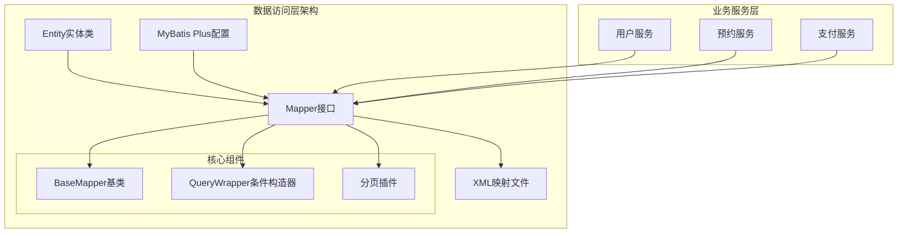
```mermaid
graph TB
subgraph "数据访问层架构"
Entity[Entity实体类]
Mapper[Mapper接口]
XML[XML映射文件]
Config[MyBatis Plus配置]
Entity --> Mapper
Mapper --> XML
Config --> Mapper
subgraph "核心组件"
BaseMapper[BaseMapper基类]
QueryWrapper[QueryWrapper条件构造器]
Page[分页插件]
end
Mapper --> BaseMapper
Mapper --> QueryWrapper
Mapper --> Page
end
subgraph "业务服务层"
UserService[用户服务]
BookingService[预约服务]
PaymentService[支付服务]
end
UserService --> Mapper
BookingService --> Mapper
PaymentService --> Mapper
```

**图表来源**
- [MybatisPlusConfig.java](file://backend/src/main/java/com/carwash/config/MybatisPlusConfig.java#L22-L70)
- [UserMapper.java](file://backend/src/main/java/com/carwash/mapper/UserMapper.java#L15-L73)

## Entity实体类映射

### 实体类设计原则

系统中的实体类遵循以下设计原则：

1. **注解驱动映射**：使用MyBatis Plus注解建立实体与数据库表的映射关系
2. **字段命名规范**：采用驼峰命名法，自动映射下划线字段
3. **逻辑删除支持**：内置软删除机制
4. **自动填充功能**：支持创建时间和更新时间自动填充

### User实体类分析

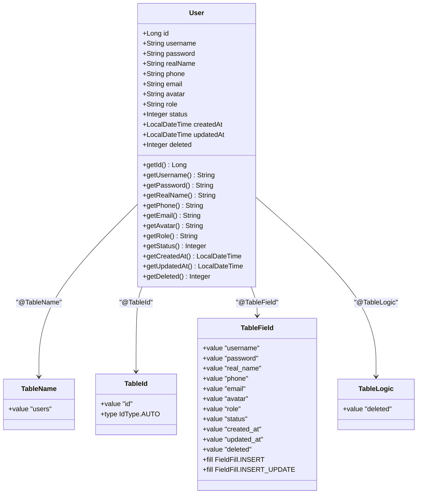
```mermaid
classDiagram
class User {
+Long id
+String username
+String password
+String realName
+String phone
+String email
+String avatar
+String role
+Integer status
+LocalDateTime createdAt
+LocalDateTime updatedAt
+Integer deleted
+getId() Long
+getUsername() String
+getPassword() String
+getRealName() String
+getPhone() String
+getEmail() String
+getAvatar() String
+getRole() String
+getStatus() Integer
+getCreatedAt() LocalDateTime
+getUpdatedAt() LocalDateTime
+getDeleted() Integer
}
class TableName {
+value "users"
}
class TableId {
+value "id"
+type IdType.AUTO
}
class TableField {
+value "username"
+value "password"
+value "real_name"
+value "phone"
+value "email"
+value "avatar"
+value "role"
+value "status"
+value "created_at"
+value "updated_at"
+value "deleted"
+fill FieldFill.INSERT
+fill FieldFill.INSERT_UPDATE
}
class TableLogic {
+value "deleted"
}
User --> TableName : "@TableName"
User --> TableId : "@TableId"
User --> TableField : "@TableField"
User --> TableLogic : "@TableLogic"
```

**图表来源**
- [User.java](file://backend/src/main/java/com/carwash/entity/User.java#L15-L190)

### Booking实体类分析

Booking实体类展示了复杂的业务关联关系：

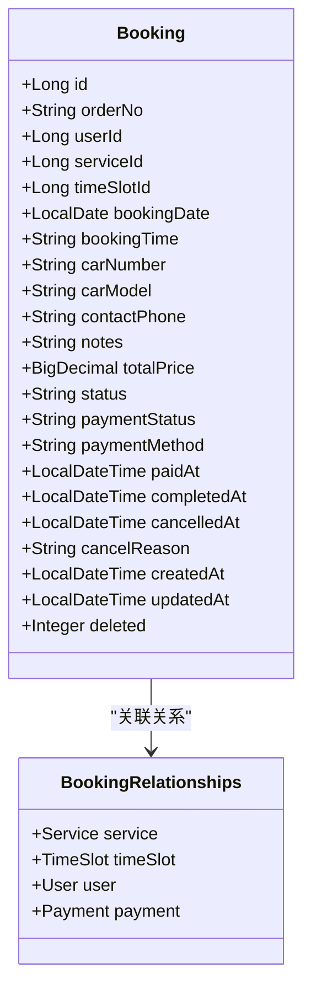
```mermaid
classDiagram
class Booking {
+Long id
+String orderNo
+Long userId
+Long serviceId
+Long timeSlotId
+LocalDate bookingDate
+String bookingTime
+String carNumber
+String carModel
+String contactPhone
+String notes
+BigDecimal totalPrice
+String status
+String paymentStatus
+String paymentMethod
+LocalDateTime paidAt
+LocalDateTime completedAt
+LocalDateTime cancelledAt
+String cancelReason
+LocalDateTime createdAt
+LocalDateTime updatedAt
+Integer deleted
}
class BookingRelationships {
+Service service
+TimeSlot timeSlot
+User user
+Payment payment
}
Booking --> BookingRelationships : "关联关系"
```

**图表来源**
- [Booking.java](file://backend/src/main/java/com/carwash/entity/Booking.java#L17-L333)

### Payment实体类分析

Payment实体类体现了支付系统的完整性：

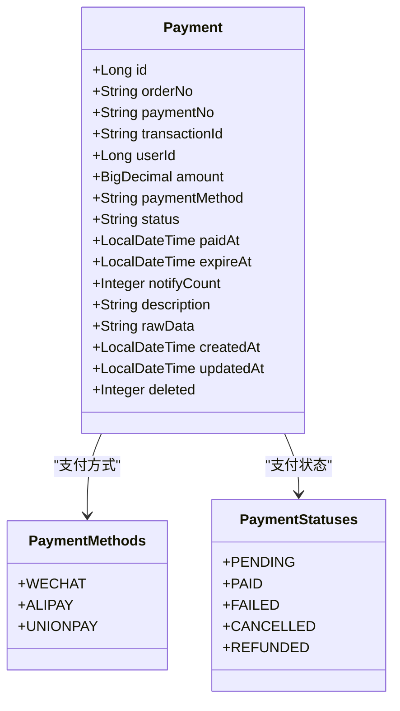
```mermaid
classDiagram
class Payment {
+Long id
+String orderNo
+String paymentNo
+String transactionId
+Long userId
+BigDecimal amount
+String paymentMethod
+String status
+LocalDateTime paidAt
+LocalDateTime expireAt
+Integer notifyCount
+String description
+String rawData
+LocalDateTime createdAt
+LocalDateTime updatedAt
+Integer deleted
}
class PaymentMethods {
+WECHAT
+ALIPAY
+UNIONPAY
}
class PaymentStatuses {
+PENDING
+PAID
+FAILED
+CANCELLED
+REFUNDED
}
Payment --> PaymentMethods : "支付方式"
Payment --> PaymentStatuses : "支付状态"
```

**图表来源**
- [Payment.java](file://backend/src/main/java/com/carwash/entity/Payment.java#L15-L199)

**章节来源**
- [User.java](file://backend/src/main/java/com/carwash/entity/User.java#L15-L190)
- [Booking.java](file://backend/src/main/java/com/carwash/entity/Booking.java#L17-L333)
- [Payment.java](file://backend/src/main/java/com/carwash/entity/Payment.java#L15-L199)

## Mapper接口设计

### BaseMapper继承机制

所有Mapper接口都继承自MyBatis Plus的BaseMapper，获得以下通用CRUD功能：

| 方法名称 | 功能描述 | 参数类型 | 返回类型 |
|---------|---------|---------|---------|
| insert | 插入记录 | T entity | int |
| deleteById | 根据主键删除 | Serializable id | int |
| updateById | 根据主键更新 | T entity | int |
| selectById | 根据主键查询 | Serializable id | T |
| selectList | 查询列表 | Wrapper<T> queryWrapper | List<T> |
| selectCount | 查询数量 | Wrapper<T> queryWrapper | int |
| selectPage | 分页查询 | IPage<T> page, Wrapper<T> queryWrapper | IPage<T> |

### UserMapper接口实现

UserMapper展示了多种查询方式的结合：

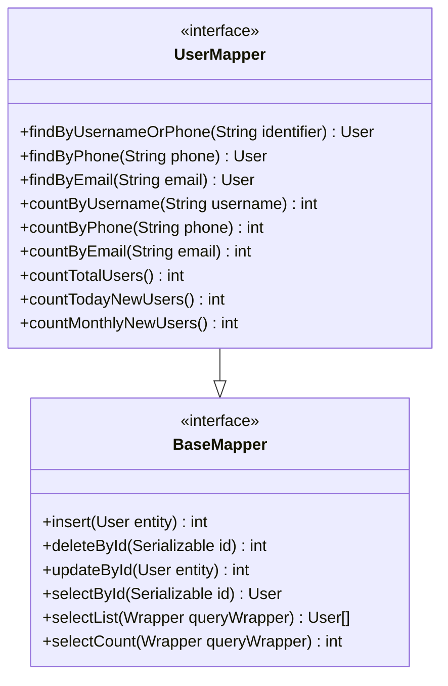
```mermaid
classDiagram
class UserMapper {
<<interface>>
+findByUsernameOrPhone(String identifier) User
+findByPhone(String phone) User
+findByEmail(String email) User
+countByUsername(String username) int
+countByPhone(String phone) int
+countByEmail(String email) int
+countTotalUsers() int
+countTodayNewUsers() int
+countMonthlyNewUsers() int
}
class BaseMapper {
<<interface>>
+insert(User entity) int
+deleteById(Serializable id) int
+updateById(User entity) int
+selectById(Serializable id) User
+selectList(Wrapper queryWrapper) User[]
+selectCount(Wrapper queryWrapper) int
}
UserMapper --|> BaseMapper
```

**图表来源**
- [UserMapper.java](file://backend/src/main/java/com/carwash/mapper/UserMapper.java#L15-L73)

### BookingMapper接口实现

BookingMapper展示了分页查询和统计功能的结合：

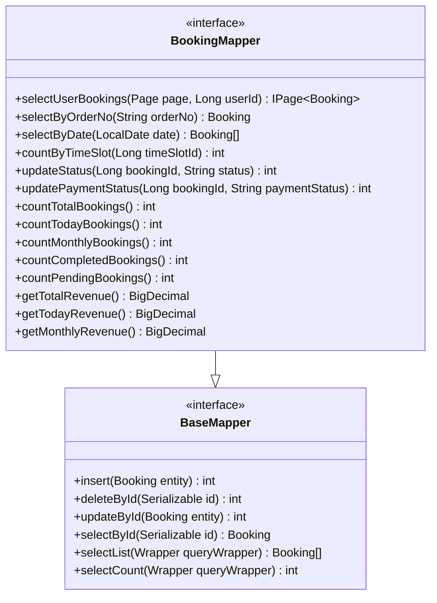
```mermaid
classDiagram
class BookingMapper {
<<interface>>
+selectUserBookings(Page page, Long userId) IPage~Booking~
+selectByOrderNo(String orderNo) Booking
+selectByDate(LocalDate date) Booking[]
+countByTimeSlot(Long timeSlotId) int
+updateStatus(Long bookingId, String status) int
+updatePaymentStatus(Long bookingId, String paymentStatus) int
+countTotalBookings() int
+countTodayBookings() int
+countMonthlyBookings() int
+countCompletedBookings() int
+countPendingBookings() int
+getTotalRevenue() BigDecimal
+getTodayRevenue() BigDecimal
+getMonthlyRevenue() BigDecimal
}
class BaseMapper {
<<interface>>
+insert(Booking entity) int
+deleteById(Serializable id) int
+updateById(Booking entity) int
+selectById(Serializable id) Booking
+selectList(Wrapper queryWrapper) Booking[]
+selectCount(Wrapper queryWrapper) int
}
BookingMapper --|> BaseMapper
```

**图表来源**
- [BookingMapper.java](file://backend/src/main/java/com/carwash/mapper/BookingMapper.java#L22-L108)

### PaymentMapper接口实现

PaymentMapper专注于支付相关的查询操作：

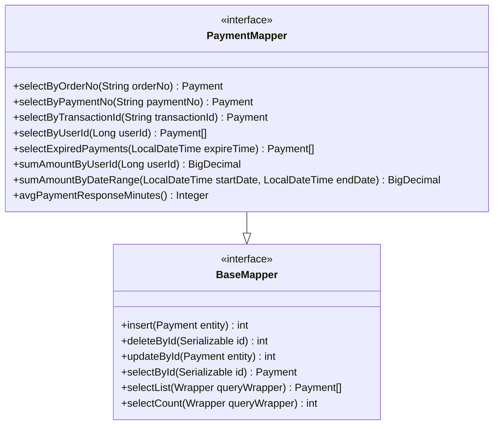
```mermaid
classDiagram
class PaymentMapper {
<<interface>>
+selectByOrderNo(String orderNo) Payment
+selectByPaymentNo(String paymentNo) Payment
+selectByTransactionId(String transactionId) Payment
+selectByUserId(Long userId) Payment[]
+selectExpiredPayments(LocalDateTime expireTime) Payment[]
+sumAmountByUserId(Long userId) BigDecimal
+sumAmountByDateRange(LocalDateTime startDate, LocalDateTime endDate) BigDecimal
+avgPaymentResponseMinutes() Integer
}
class BaseMapper {
<<interface>>
+insert(Payment entity) int
+deleteById(Serializable id) int
+updateById(Payment entity) int
+selectById(Serializable id) Payment
+selectList(Wrapper queryWrapper) Payment[]
+selectCount(Wrapper queryWrapper) int
}
PaymentMapper --|> BaseMapper
```

**图表来源**
- [PaymentMapper.java](file://backend/src/main/java/com/carwash/mapper/PaymentMapper.java#L15-L56)

**章节来源**
- [UserMapper.java](file://backend/src/main/java/com/carwash/mapper/UserMapper.java#L15-L73)
- [BookingMapper.java](file://backend/src/main/java/com/carwash/mapper/BookingMapper.java#L22-L108)
- [PaymentMapper.java](file://backend/src/main/java/com/carwash/mapper/PaymentMapper.java#L15-L56)

## MyBatis Plus配置

### 配置类结构

MybatisPlusConfig类负责整个MyBatis Plus框架的配置：

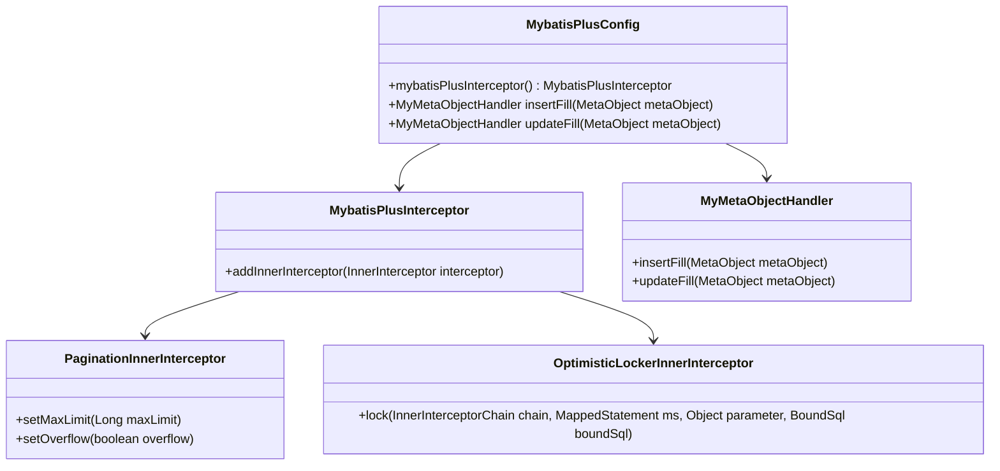
```mermaid
classDiagram
class MybatisPlusConfig {
+mybatisPlusInterceptor() MybatisPlusInterceptor
+MyMetaObjectHandler insertFill(MetaObject metaObject)
+MyMetaObjectHandler updateFill(MetaObject metaObject)
}
class MybatisPlusInterceptor {
+addInnerInterceptor(InnerInterceptor interceptor)
}
class PaginationInnerInterceptor {
+setMaxLimit(Long maxLimit)
+setOverflow(boolean overflow)
}
class OptimisticLockerInnerInterceptor {
+lock(InnerInterceptorChain chain, MappedStatement ms, Object parameter, BoundSql boundSql)
}
class MyMetaObjectHandler {
+insertFill(MetaObject metaObject)
+updateFill(MetaObject metaObject)
}
MybatisPlusConfig --> MybatisPlusInterceptor
MybatisPlusConfig --> MyMetaObjectHandler
MybatisPlusInterceptor --> PaginationInnerInterceptor
MybatisPlusInterceptor --> OptimisticLockerInnerInterceptor
```

**图表来源**
- [MybatisPlusConfig.java](file://backend/src/main/java/com/carwash/config/MybatisPlusConfig.java#L22-L70)

### 分页插件配置

分页插件提供了强大的分页功能：

| 配置项 | 默认值 | 说明 |
|-------|-------|------|
| maxLimit | 500 | 单页最大记录数限制 |
| overflow | false | 溢出总页数后的处理策略 |
| DbType | MYSQL | 数据库类型 |

### 乐观锁插件配置

乐观锁插件用于处理并发更新问题，通过版本号控制实现：

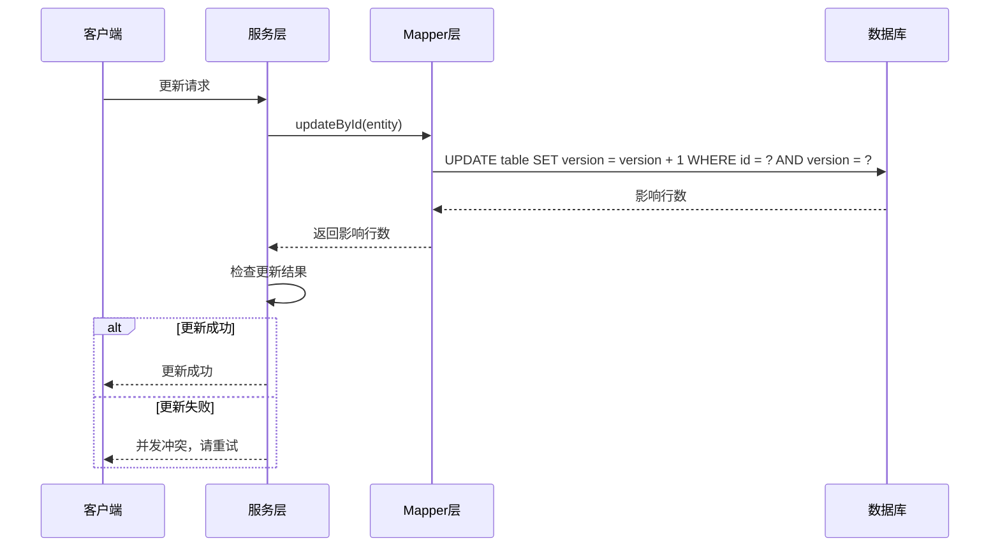
```mermaid
sequenceDiagram
participant Client as 客户端
participant Service as 服务层
participant Mapper as Mapper层
participant DB as 数据库
Client->>Service : 更新请求
Service->>Mapper : updateById(entity)
Mapper->>DB : UPDATE table SET version = version + 1 WHERE id = ? AND version = ?
DB-->>Mapper : 影响行数
Mapper-->>Service : 返回影响行数
Service->>Service : 检查更新结果
alt 更新成功
Service-->>Client : 更新成功
else 更新失败
Service-->>Client : 并发冲突，请重试
end
```

**图表来源**
- [MybatisPlusConfig.java](file://backend/src/main/java/com/carwash/config/MybatisPlusConfig.java#L39-L41)

### 自动填充功能

系统实现了自动填充功能，统一管理创建时间和更新时间：

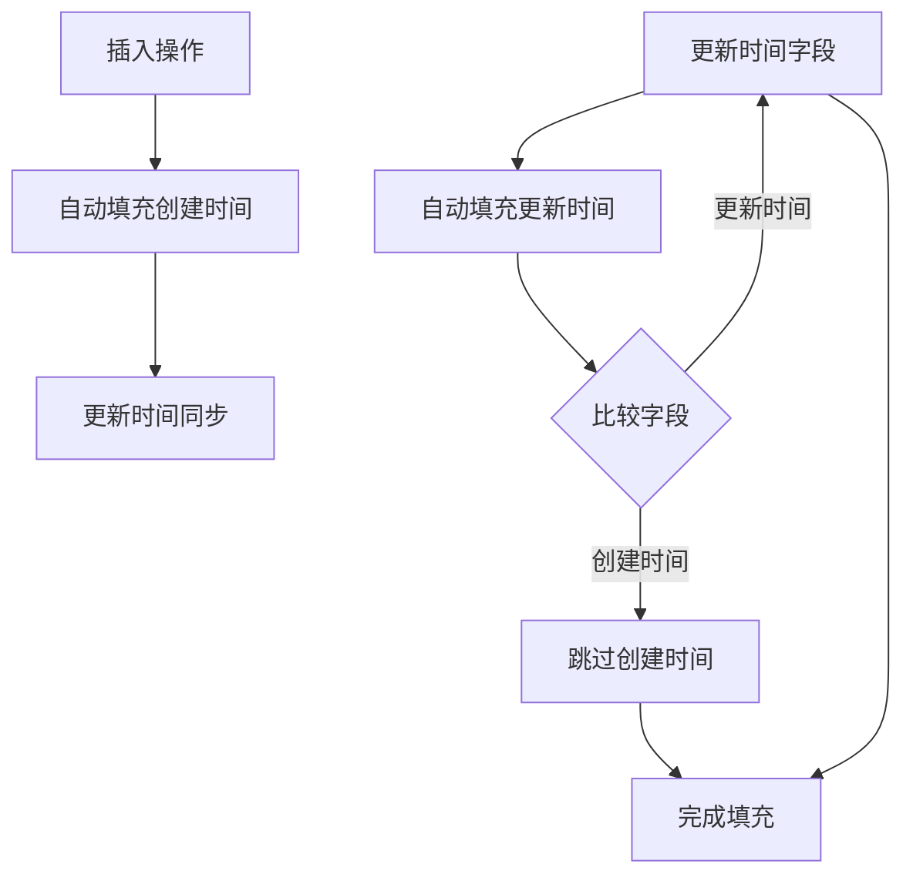
```mermaid
flowchart TD
Insert[插入操作] --> InsertFill[自动填充创建时间]
InsertFill --> UpdateTime[更新时间同步]
Update[更新操作] --> UpdateFill[自动填充更新时间]
UpdateFill --> Compare{比较字段}
Compare --> |创建时间| Skip[跳过创建时间]
Compare --> |更新时间| Update[更新时间字段]
Skip --> Complete[完成填充]
Update --> Complete
```

**图表来源**
- [MybatisPlusConfig.java](file://backend/src/main/java/com/carwash/config/MybatisPlusConfig.java#L49-L69)

**章节来源**
- [MybatisPlusConfig.java](file://backend/src/main/java/com/carwash/config/MybatisPlusConfig.java#L22-L70)

## XML映射文件

### PaymentMapper.xml分析

PaymentMapper.xml展示了XML映射文件的强大功能：

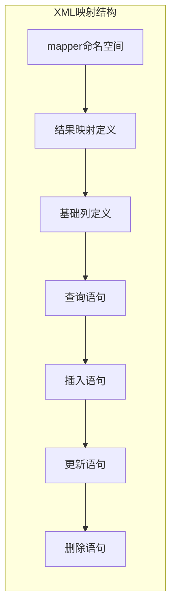
```mermaid
graph LR
subgraph "XML映射结构"
Namespace[mapper命名空间]
ResultMap[结果映射定义]
Sql[基础列定义]
Select[查询语句]
Insert[插入语句]
Update[更新语句]
Delete[删除语句]
end
Namespace --> ResultMap
ResultMap --> Sql
Sql --> Select
Select --> Insert
Insert --> Update
Update --> Delete
```

**图表来源**
- [PaymentMapper.xml](file://backend/src/main/resources/mapper/PaymentMapper.xml#L1-L106)

### XML映射文件特点

1. **结果映射**：定义数据库字段与Java属性的映射关系
2. **SQL复用**：通过`<sql>`标签定义可复用的SQL片段
3. **复杂查询**：支持复杂的SQL查询逻辑
4. **参数绑定**：灵活的参数绑定机制

### 自定义SQL查询示例

以支付查询为例，展示XML映射文件的功能：

| 查询类型 | SQL特点 | 使用场景 |
|---------|---------|---------|
| 单字段查询 | LIMIT 1优化 | 快速查询特定记录 |
| 多条件查询 | AND条件组合 | 复杂业务查询 |
| 统计查询 | 聚合函数 | 数据统计分析 |
| 时间范围查询 | BETWEEN操作 | 时间区间查询 |

**章节来源**
- [PaymentMapper.xml](file://backend/src/main/resources/mapper/PaymentMapper.xml#L1-L106)

## 条件构造器高级查询

### QueryWrapper使用模式

系统广泛使用QueryWrapper实现动态查询：

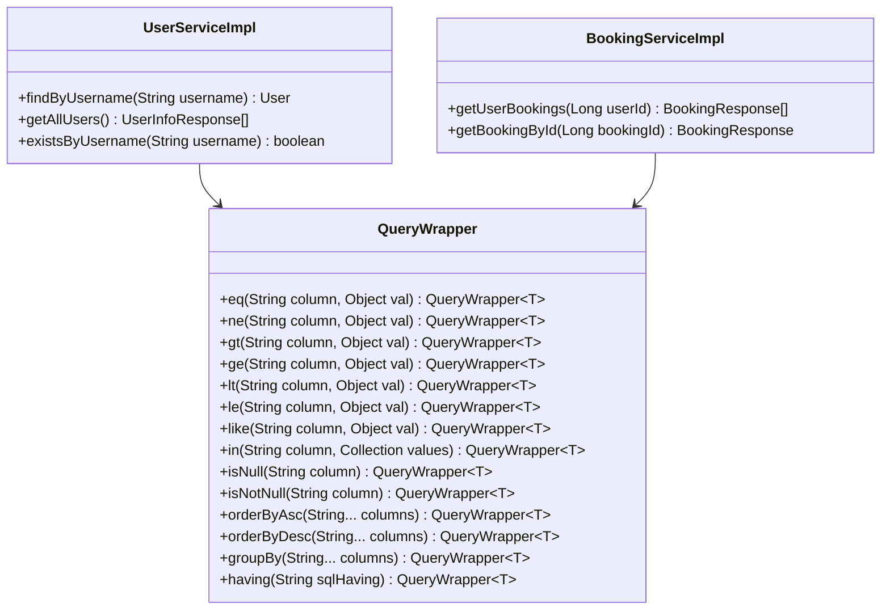
```mermaid
classDiagram
class QueryWrapper {
+eq(String column, Object val) QueryWrapper~T~
+ne(String column, Object val) QueryWrapper~T~
+gt(String column, Object val) QueryWrapper~T~
+ge(String column, Object val) QueryWrapper~T~
+lt(String column, Object val) QueryWrapper~T~
+le(String column, Object val) QueryWrapper~T~
+like(String column, Object val) QueryWrapper~T~
+in(String column, Collection values) QueryWrapper~T~
+isNull(String column) QueryWrapper~T~
+isNotNull(String column) QueryWrapper~T~
+orderByAsc(String... columns) QueryWrapper~T~
+orderByDesc(String... columns) QueryWrapper~T~
+groupBy(String... columns) QueryWrapper~T~
+having(String sqlHaving) QueryWrapper~T~
}
class UserServiceImpl {
+findByUsername(String username) User
+getAllUsers() UserInfoResponse[]
+existsByUsername(String username) boolean
}
class BookingServiceImpl {
+getUserBookings(Long userId) BookingResponse[]
+getBookingById(Long bookingId) BookingResponse
}
UserServiceImpl --> QueryWrapper
BookingServiceImpl --> QueryWrapper
```

**图表来源**
- [UserServiceImpl.java](file://backend/src/main/java/com/carwash/service/impl/UserServiceImpl.java#L161-L260)
- [BookingServiceImpl.java](file://backend/src/main/java/com/carwash/service/impl/BookingServiceImpl.java#L177-L200)

### 高级查询模式

#### 1. 条件组合查询

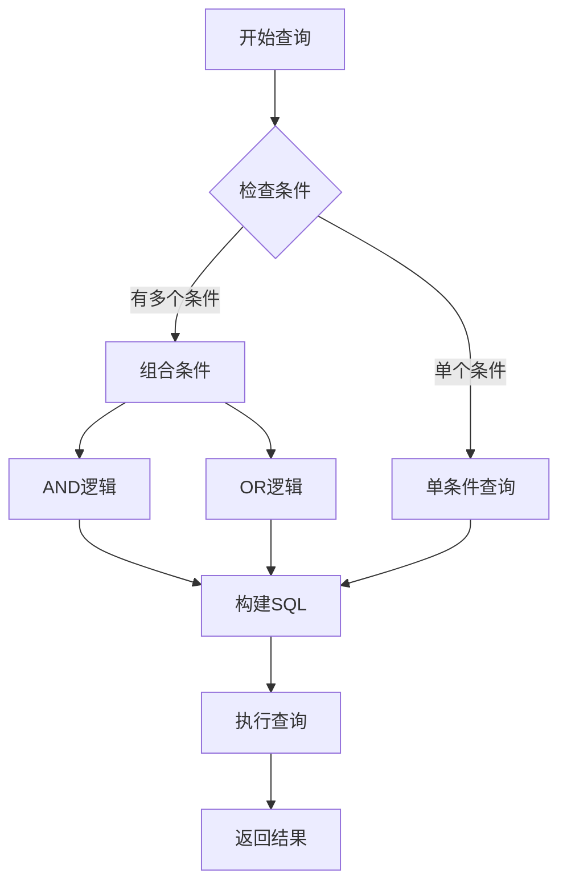
```mermaid
flowchart TD
Start[开始查询] --> CheckCondition{检查条件}
CheckCondition --> |有多个条件| Combine[组合条件]
CheckCondition --> |单个条件| Single[单条件查询]
Combine --> AndLogic[AND逻辑]
Combine --> OrLogic[OR逻辑]
AndLogic --> BuildSQL[构建SQL]
OrLogic --> BuildSQL
Single --> BuildSQL
BuildSQL --> Execute[执行查询]
Execute --> Result[返回结果]
```

#### 2. 动态查询构建

系统根据业务需求动态构建查询条件：

| 查询场景 | 条件组合 | 性能优化 |
|---------|---------|---------|
| 用户搜索 | 用户名模糊匹配 + 状态过滤 | 索引优化 |
| 订单查询 | 时间范围 + 状态筛选 | 分区表 |
| 支付统计 | 时间聚合 + 类型分组 | 聚合索引 |

### 实际应用案例

#### 用户查询示例

在UserServiceImpl中展示了多种查询模式：

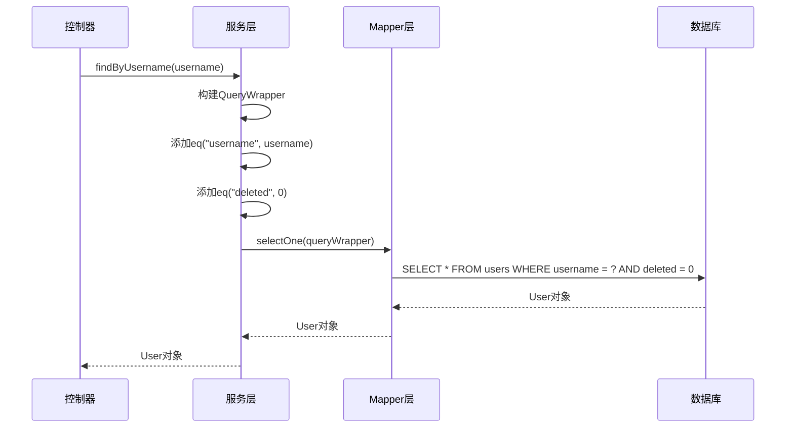
```mermaid
sequenceDiagram
participant Controller as 控制器
participant Service as 服务层
participant Mapper as Mapper层
participant DB as 数据库
Controller->>Service : findByUsername(username)
Service->>Service : 构建QueryWrapper
Service->>Service : 添加eq("username", username)
Service->>Service : 添加eq("deleted", 0)
Service->>Mapper : selectOne(queryWrapper)
Mapper->>DB : SELECT * FROM users WHERE username = ? AND deleted = 0
DB-->>Mapper : User对象
Mapper-->>Service : User对象
Service-->>Controller : User对象
```

**图表来源**
- [UserServiceImpl.java](file://backend/src/main/java/com/carwash/service/impl/UserServiceImpl.java#L161-L168)

**章节来源**
- [UserServiceImpl.java](file://backend/src/main/java/com/carwash/service/impl/UserServiceImpl.java#L161-L260)
- [BookingServiceImpl.java](file://backend/src/main/java/com/carwash/service/impl/BookingServiceImpl.java#L177-L200)

## 分页查询实现

### 分页插件工作机制

分页插件通过拦截器实现透明分页：

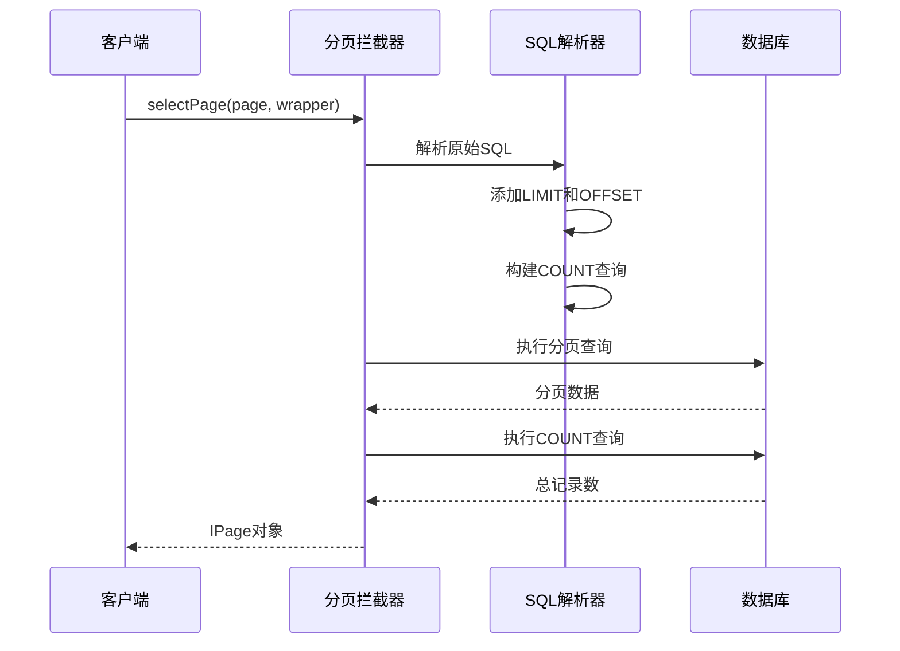
```mermaid
sequenceDiagram
participant Client as 客户端
participant Interceptor as 分页拦截器
participant SQL as SQL解析器
participant DB as 数据库
Client->>Interceptor : selectPage(page, wrapper)
Interceptor->>SQL : 解析原始SQL
SQL->>SQL : 添加LIMIT和OFFSET
SQL->>SQL : 构建COUNT查询
Interceptor->>DB : 执行分页查询
DB-->>Interceptor : 分页数据
Interceptor->>DB : 执行COUNT查询
DB-->>Interceptor : 总记录数
Interceptor-->>Client : IPage对象
```

**图表来源**
- [MybatisPlusConfig.java](file://backend/src/main/java/com/carwash/config/MybatisPlusConfig.java#L34-L37)

### 分页查询实现

#### BookingMapper分页查询

BookingMapper展示了分页查询的实际应用：

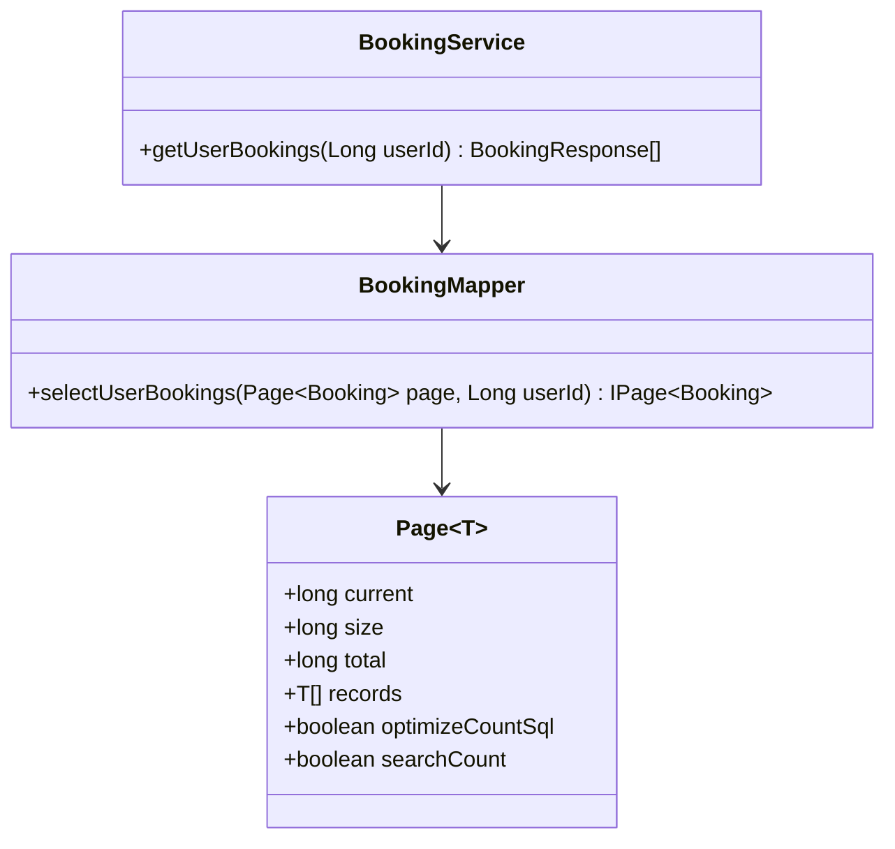
```mermaid
classDiagram
class Page~T~ {
+long current
+long size
+long total
+T[] records
+boolean optimizeCountSql
+boolean searchCount
}
class BookingMapper {
+selectUserBookings(Page~Booking~ page, Long userId) IPage~Booking~
}
class BookingService {
+getUserBookings(Long userId) BookingResponse[]
}
BookingService --> BookingMapper
BookingMapper --> Page
```

**图表来源**
- [BookingMapper.java](file://backend/src/main/java/com/carwash/mapper/BookingMapper.java#L28-L29)

#### 分页查询最佳实践

| 实践要点 | 说明 | 性能影响 |
|---------|------|---------|
| 合理设置pageSize | 避免过大或过小的分页大小 | 直接影响查询性能 |
| 启用count优化 | 对大数据量表启用优化计数 | 显著提升性能 |
| 索引优化 | 确保分页字段有适当索引 | 关键性能因素 |
| 结果集限制 | 设置合理的最大记录数 | 防止资源耗尽 |

**章节来源**
- [BookingMapper.java](file://backend/src/main/java/com/carwash/mapper/BookingMapper.java#L28-L29)
- [MybatisPlusConfig.java](file://backend/src/main/java/com/carwash/config/MybatisPlusConfig.java#L34-L37)

## 性能优化与监控

### SQL性能监控

系统通过多种方式监控和优化SQL性能：

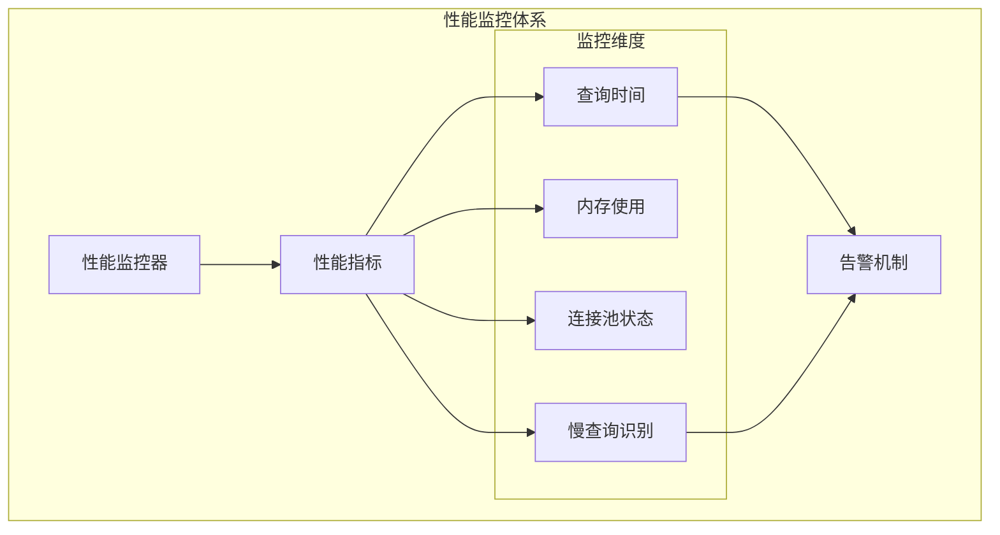
```mermaid
graph TB
subgraph "性能监控体系"
Monitor[性能监控器]
Metrics[性能指标]
Alert[告警机制]
subgraph "监控维度"
QueryTime[查询时间]
MemoryUsage[内存使用]
ConnectionPool[连接池状态]
SlowQuery[慢查询识别]
end
Monitor --> Metrics
Metrics --> QueryTime
Metrics --> MemoryUsage
Metrics --> ConnectionPool
Metrics --> SlowQuery
QueryTime --> Alert
SlowQuery --> Alert
end
```

### 慢查询诊断

#### 慢查询识别机制

系统通过以下方式识别和处理慢查询：

| 识别方式 | 实现原理 | 处理策略 |
|---------|---------|---------|
| 时间阈值 | 超过设定时间的查询 | 记录日志，发送告警 |
| 执行计划分析 | 分析SQL执行计划 | 优化索引，重构查询 |
| 连接池监控 | 监控连接池状态 | 调整连接池参数 |
| 内存使用监控 | 监控JVM内存使用 | 优化内存分配 |

### 性能优化策略

#### 1. 查询优化

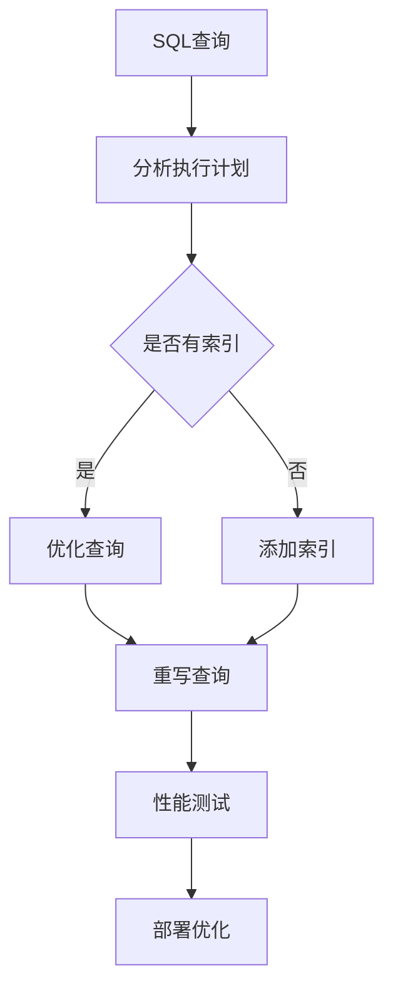
```mermaid
flowchart TD
Query[SQL查询] --> Analyze[分析执行计划]
Analyze --> Index{是否有索引}
Index --> |是| Optimize[优化查询]
Index --> |否| AddIndex[添加索引]
Optimize --> Rewrite[重写查询]
AddIndex --> Rewrite
Rewrite --> Test[性能测试]
Test --> Deploy[部署优化]
```

#### 2. 缓存策略

系统采用多层次缓存策略：

| 缓存层级 | 缓存内容 | 生命周期 | 更新策略 |
|---------|---------|---------|---------|
| 一级缓存 | MyBatis会话缓存 | 会话级别 | 自动失效 |
| 二级缓存 | Mapper级别缓存 | 应用级别 | 手动刷新 |
| Redis缓存 | 热点数据缓存 | 可配置 | 过期策略 |

### 数据库监控组件

系统实现了专门的支付监控组件：

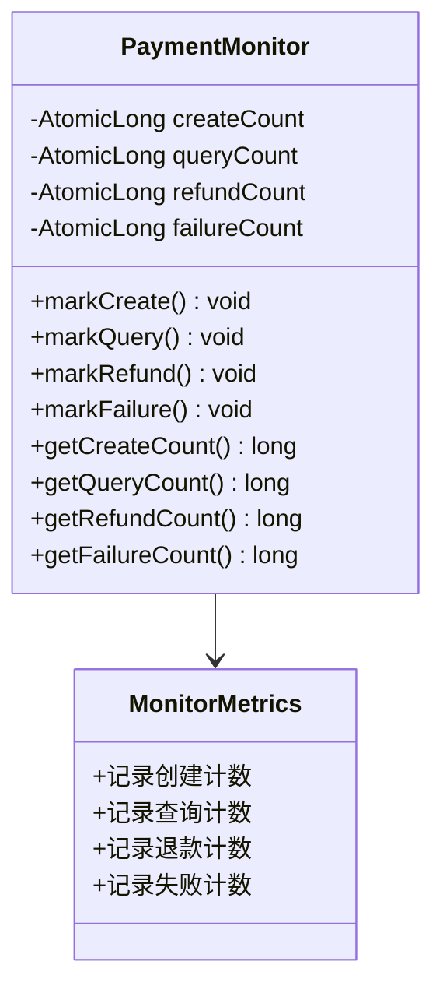
```mermaid
classDiagram
class PaymentMonitor {
-AtomicLong createCount
-AtomicLong queryCount
-AtomicLong refundCount
-AtomicLong failureCount
+markCreate() void
+markQuery() void
+markRefund() void
+markFailure() void
+getCreateCount() long
+getQueryCount() long
+getRefundCount() long
+getFailureCount() long
}
class MonitorMetrics {
+记录创建计数
+记录查询计数
+记录退款计数
+记录失败计数
}
PaymentMonitor --> MonitorMetrics
```

**图表来源**
- [PaymentMonitor.java](file://backend/src/main/java/com/carwash/monitor/PaymentMonitor.java#L11-L27)

**章节来源**
- [PaymentMonitor.java](file://backend/src/main/java/com/carwash/monitor/PaymentMonitor.java#L11-L27)

## 数据库连接池配置

### HikariCP连接池

系统使用HikariCP作为默认数据库连接池：

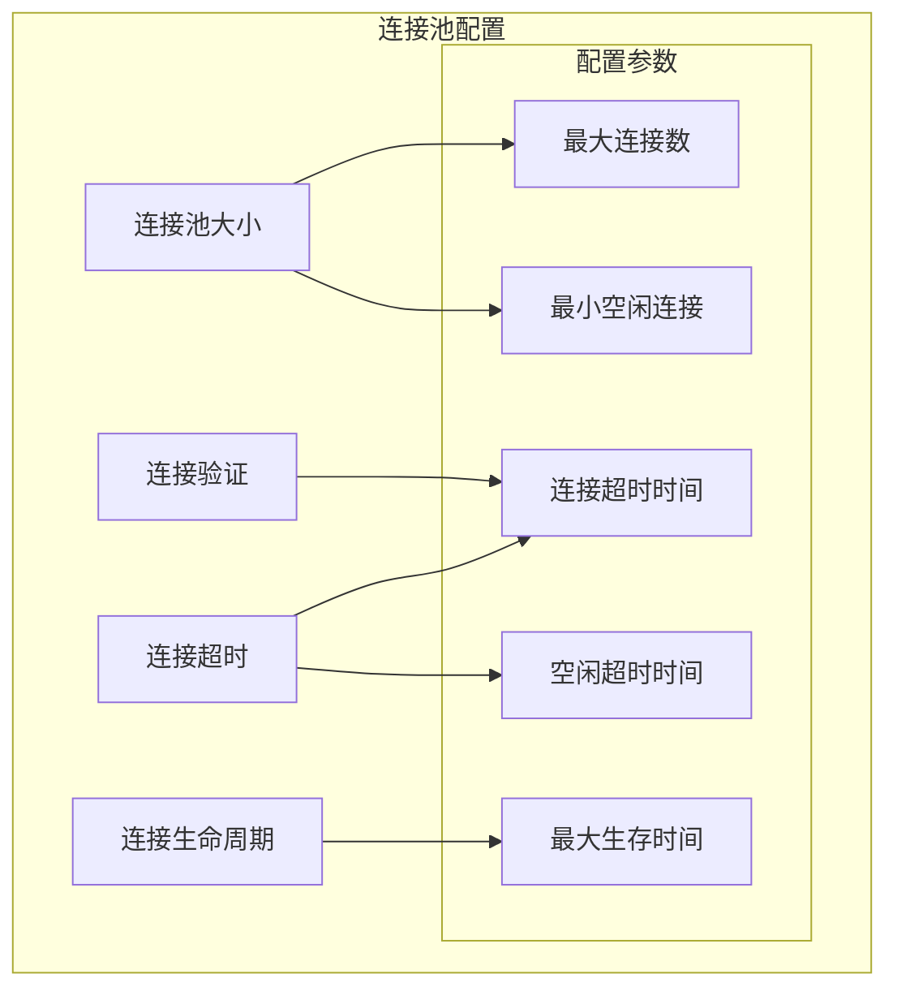
```mermaid
graph TB
subgraph "连接池配置"
PoolSize[连接池大小]
Timeout[连接超时]
Lifetime[连接生命周期]
Validation[连接验证]
subgraph "配置参数"
MaximumPoolSize[最大连接数]
MinimumIdle[最小空闲连接]
ConnectionTimeout[连接超时时间]
IdleTimeout[空闲超时时间]
MaxLifetime[最大生存时间]
end
PoolSize --> MaximumPoolSize
PoolSize --> MinimumIdle
Timeout --> ConnectionTimeout
Timeout --> IdleTimeout
Lifetime --> MaxLifetime
Validation --> ConnectionTimeout
end
```

### 连接池优化配置

#### 核心配置参数

| 参数名称 | 推荐值 | 说明 | 影响因素 |
|---------|-------|------|---------|
| maximumPoolSize | CPU核数 × 2 | 最大连接数 | CPU密集型还是IO密集型 |
| minimumIdle | 10 | 最小空闲连接 | 平均并发量 |
| connectionTimeout | 30000ms | 连接超时时间 | 网络延迟 |
| idleTimeout | 600000ms | 空闲连接超时 | 系统活跃时间 |
| maxLifetime | 1800000ms | 连接最大生存时间 | 数据库重启周期 |

### 连接池监控

#### 连接池状态监控

```mermaid
sequenceDiagram
participant App as 应用程序
participant Pool as 连接池
participant Monitor as 监控器
participant Alert as 告警系统
loop 每秒监控
App->>Pool : getConnection()
Pool->>Pool : 检查可用连接
Pool-->>App : 返回连接
Pool->>Monitor : 报告连接池状态
Monitor->>Monitor : 分析使用率
alt 连接使用率过高
Monitor->>Alert : 发送告警
end
end
```

### 数据库配置最佳实践

#### 1. 字符集配置

系统采用UTF-8字符集配置：

```yaml
# 数据库连接配置
spring:
  datasource:
    url: jdbc:mysql://localhost:3306/carwash?useUnicode=true&characterEncoding=utf8&serverTimezone=Asia/Shanghai
    username: ${DB_USERNAME:root}
    password: ${DB_PASSWORD:password}
    driver-class-name: com.mysql.cj.jdbc.Driver
```

#### 2. 时区配置

统一使用Asia/Shanghai时区：

```mermaid
flowchart LR
System[System Timezone] --> AsiaShanghai[Asia/Shanghai]
AsiaShanghai --> Database[(MySQL Database)]
Database --> Application[Application]
Application --> BusinessLogic[Business Logic]
```

**章节来源**
- [DbResetRunner.java](file://backend/src/main/java/com/carwash/config/DbResetRunner.java#L20-L51)

## 最佳实践

### 代码组织最佳实践

#### 1. Mapper接口设计原则

```mermaid
graph TB
subgraph "Mapper设计原则"
SingleResponsibility[单一职责原则]
InterfaceSeparation[接口分离原则]
DependencyInversion[依赖倒置原则]
OpenClosed[开闭原则]
end
subgraph "具体实践"
BaseMapper[继承BaseMapper]
CustomMethod[自定义方法]
Annotation[注解使用]
XMLMapping[XML映射]
end
SingleResponsibility --> BaseMapper
InterfaceSeparation --> CustomMethod
DependencyInversion --> Annotation
OpenClosed --> XMLMapping
```

#### 2. 实体类设计原则

| 设计原则 | 具体要求 | 实现方式 |
|---------|---------|---------|
| 数据一致性 | 字段类型对应 | 注解映射 |
| 业务逻辑分离 | 避免复杂逻辑 | 交由Service层处理 |
| 版本兼容性 | 字段变更谨慎 | 使用nullable字段 |
| 性能考虑 | 避免过度设计 | 按需添加字段 |

### 查询优化最佳实践

#### 1. 索引优化策略

```mermaid
flowchart TD
Analysis[查询分析] --> Index{需要索引?}
Index --> |是| Type{索引类型}
Index --> |否| Optimize[优化查询]
Type --> |单列索引| SingleColumn[单列索引]
Type --> |复合索引| CompositeIndex[复合索引]
Type --> |唯一索引| UniqueIndex[唯一索引]
SingleColumn --> Implementation[实现索引]
CompositeIndex --> Implementation
UniqueIndex --> Implementation
Implementation --> Test[性能测试]
Optimize --> Test
Test --> Deploy[部署上线]
```

#### 2. 查询语句优化

| 优化方向 | 具体措施 | 效果评估 |
|---------|---------|---------|
| 减少字段选择 | 只查询需要的字段 | 减少网络传输 |
| 限制结果集 | 使用LIMIT限制 | 避免全表扫描 |
| 索引利用 | 合理使用索引 | 提升查询速度 |
| 避免子查询 | 使用JOIN替代 | 减少嵌套查询 |

### 异常处理最佳实践

#### 1. 事务管理

```mermaid
sequenceDiagram
participant Service as 服务层
participant Transaction as 事务管理器
participant Mapper as 数据访问层
participant DB as 数据库
Service->>Transaction : 开始事务
Transaction->>DB : BEGIN
Service->>Mapper : 执行多个操作
Mapper->>DB : INSERT/UPDATE/DELETE
DB-->>Mapper : 操作结果
alt 所有操作成功
Service->>Transaction : 提交事务
Transaction->>DB : COMMIT
else 任意操作失败
Service->>Transaction : 回滚事务
Transaction->>DB : ROLLBACK
end
```

#### 2. 异常分类处理

| 异常类型 | 处理策略 | 示例场景 |
|---------|---------|---------|
| 业务异常 | 记录日志，返回友好提示 | 用户不存在、密码错误 |
| 系统异常 | 记录详细日志，返回通用错误 | 数据库连接失败 |
| 参数异常 | 验证参数，返回具体错误 | 必填参数为空 |
| 并发异常 | 重试机制，乐观锁处理 | 数据更新冲突 |

### 安全最佳实践

#### 1. SQL注入防护

系统通过以下方式防止SQL注入：

```mermaid
flowchart LR
Input[用户输入] --> Validation[参数验证]
Validation --> ParameterBinding[参数绑定]
ParameterBinding --> PreparedStmt[预编译语句]
PreparedStmt --> SafeExecution[安全执行]
subgraph "防护措施"
Escape[转义处理]
Whitelist[白名单验证]
Sanitize[数据清理]
end
Validation --> Escape
Validation --> Whitelist
Validation --> Sanitize
```

#### 2. 数据加密

| 加密对象 | 加密算法 | 存储位置 | 使用场景 |
|---------|---------|---------|---------|
| 用户密码 | MD5/SHA256 | 数据库 | 登录认证 |
| 敏感数据 | AES对称加密 | 数据库 | 个人隐私信息 |
| 传输数据 | HTTPS/TLS | 网络传输 | API通信 |

### 监控与运维最佳实践

#### 1. 日志记录策略

```mermaid
graph TB
subgraph "日志层次"
Info[信息日志]
Warning[警告日志]
Error[错误日志]
Debug[调试日志]
end
subgraph "日志内容"
Request[请求信息]
Response[响应信息]
Exception[异常信息]
Performance[性能信息]
end
Info --> Request
Warning --> Exception
Error --> Exception
Debug --> Performance
```

#### 2. 性能监控指标

| 监控指标 | 监控频率 | 告警阈值 | 处理策略 |
|---------|---------|---------|---------|
| 查询响应时间 | 实时 | >1000ms | 优化查询，检查索引 |
| 连接池使用率 | 实时 | >80% | 调整连接池参数 |
| 数据库CPU使用率 | 实时 | >80% | 检查慢查询，优化配置 |
| 内存使用率 | 实时 | >85% | 清理缓存，调整JVM参数 |

**章节来源**
- [UserServiceImpl.java](file://backend/src/main/java/com/carwash/service/impl/UserServiceImpl.java#L161-L412)
- [BookingServiceImpl.java](file://backend/src/main/java/com/carwash/service/impl/BookingServiceImpl.java#L177-L200)

## 总结

本系统通过MyBatis Plus构建了高效、可维护的数据访问层，具有以下特点：

1. **完善的ORM映射**：通过注解和XML配置实现精确的实体映射
2. **强大的查询能力**：QueryWrapper提供灵活的动态查询功能
3. **优秀的性能表现**：分页插件、乐观锁、自动填充等功能优化性能
4. **全面的监控体系**：SQL监控、连接池监控、性能分析等全方位监控
5. **良好的扩展性**：清晰的分层架构便于功能扩展和维护

通过遵循这些最佳实践，系统能够稳定高效地处理各种业务场景，为上层业务提供可靠的数据支撑。