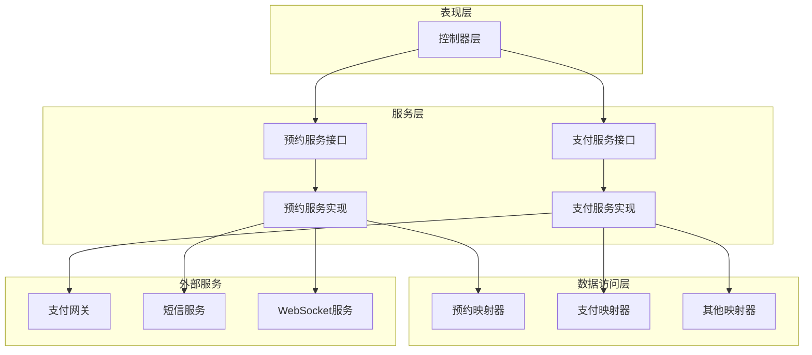
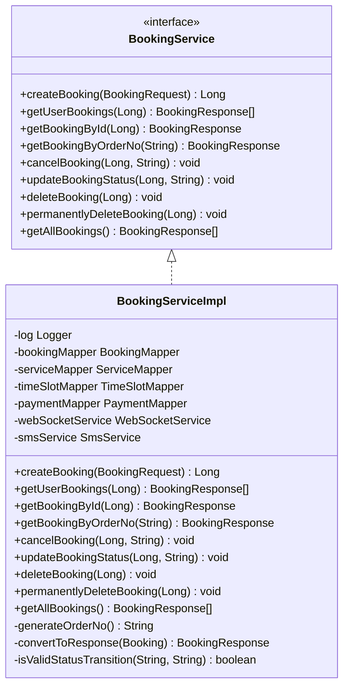
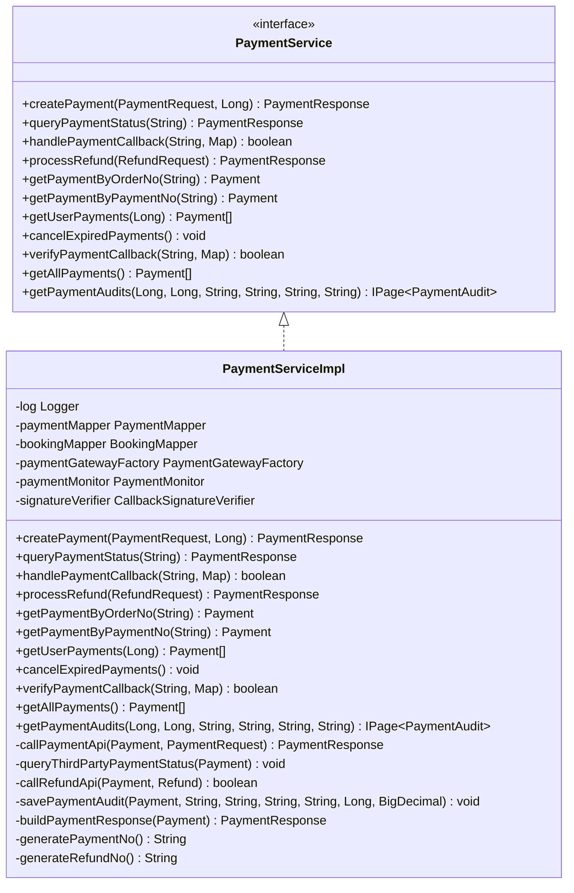
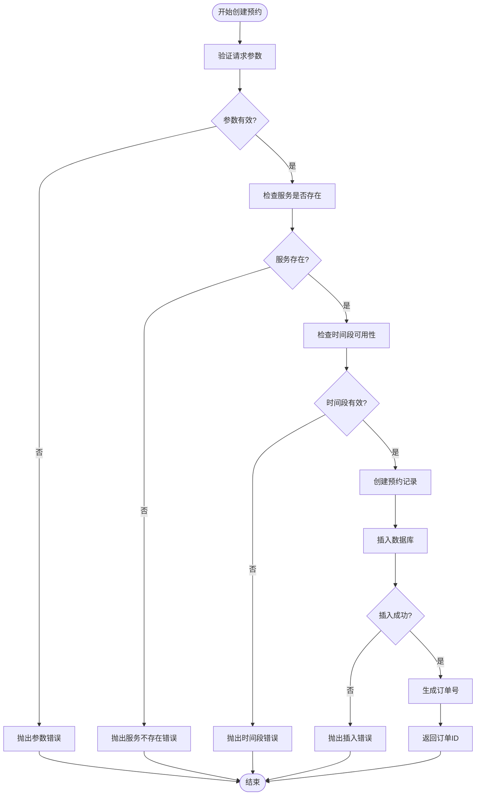
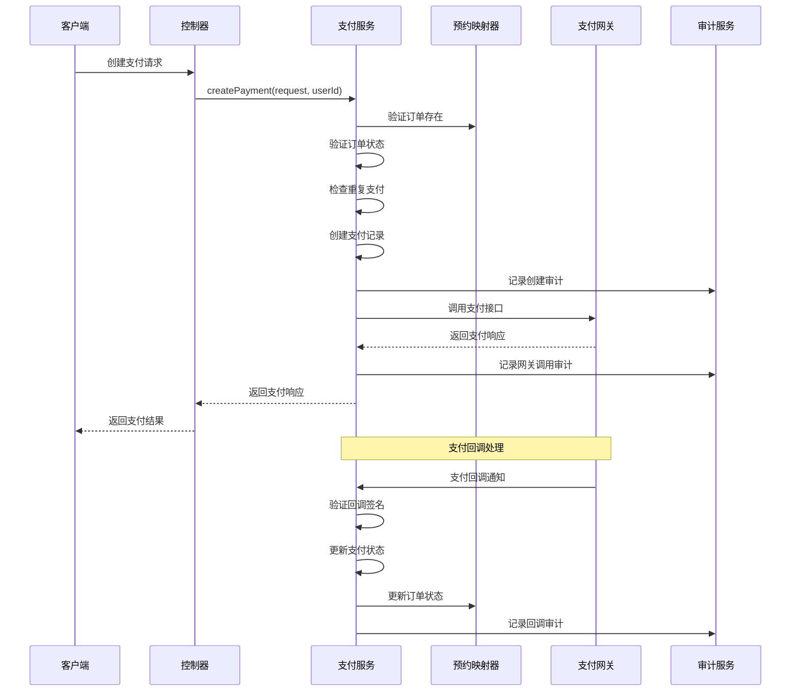
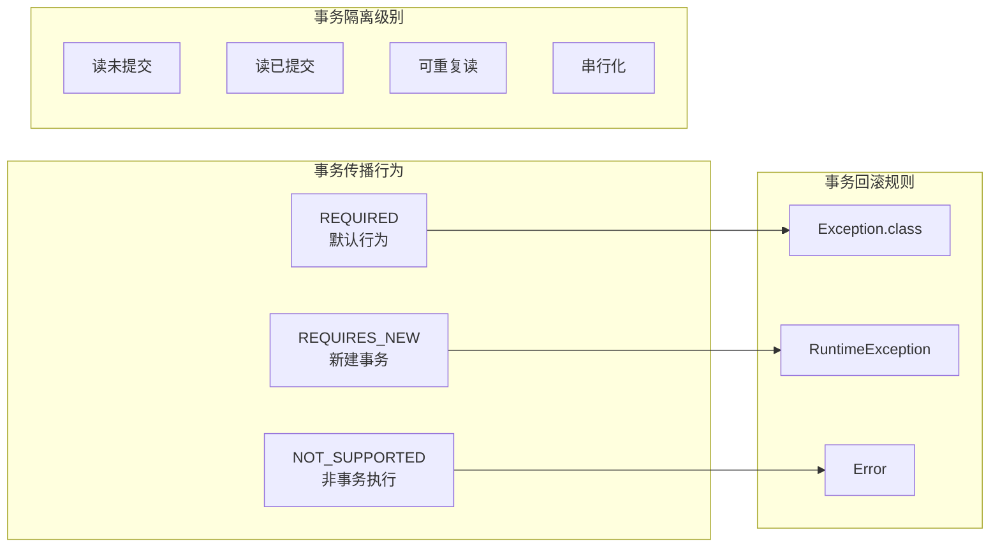
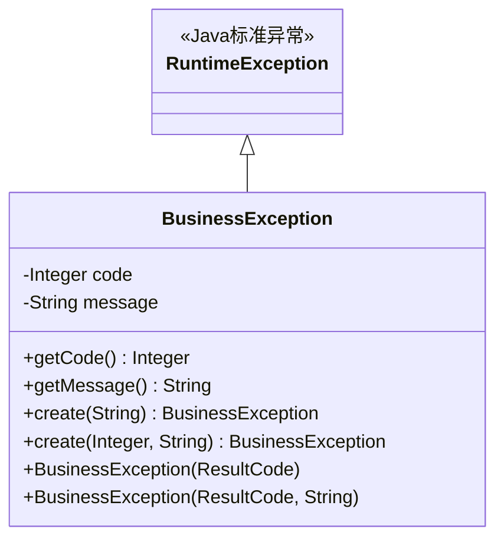
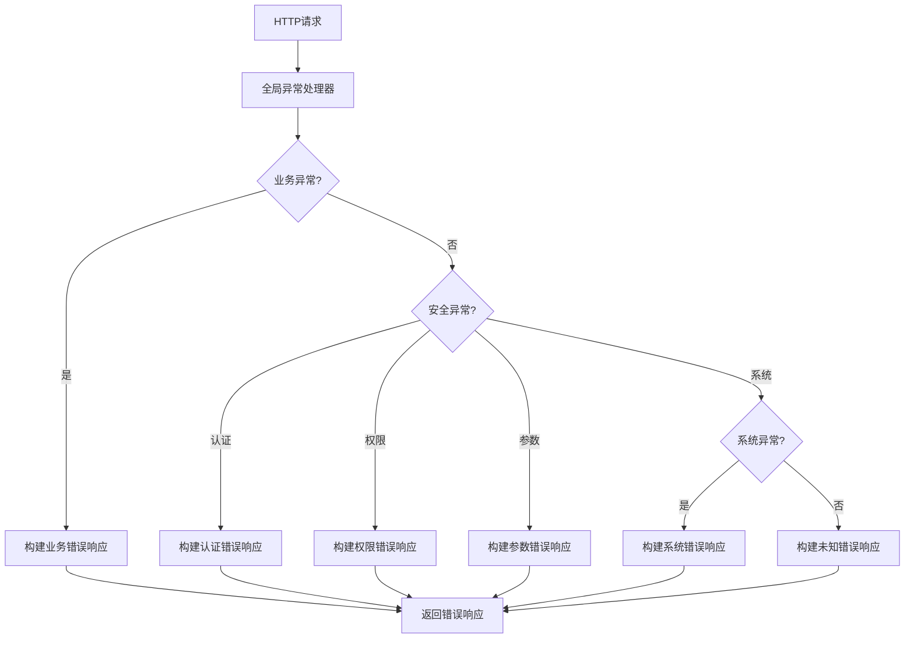
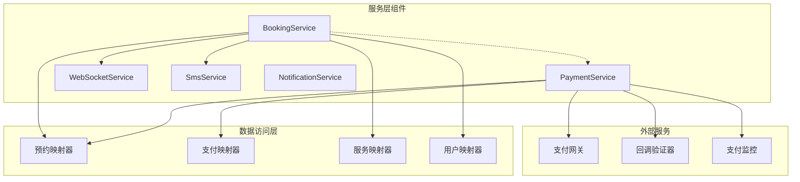
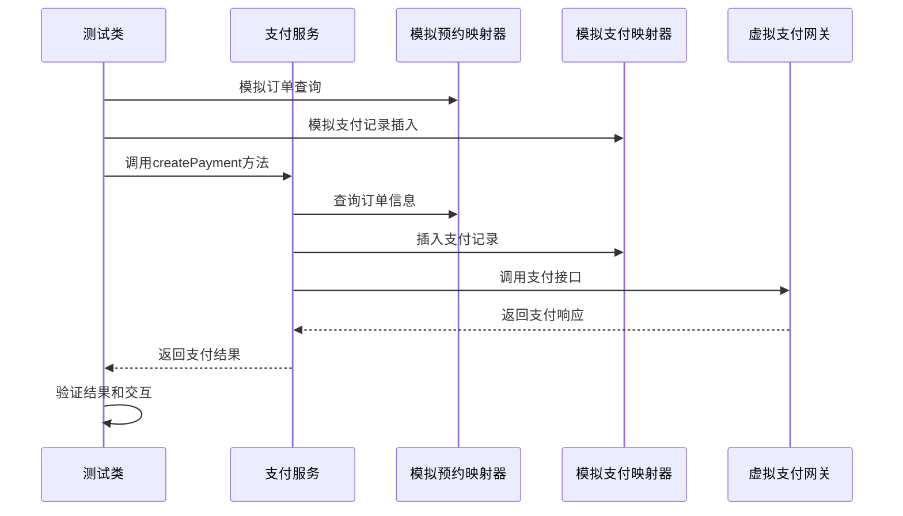

# 服务层实现

<cite>
**本文档引用的文件**
- [BookingServiceImpl.java](file://backend/src/main/java/com/carwash/service/impl/BookingServiceImpl.java)
- [PaymentServiceImpl.java](file://backend/src/main/java/com/carwash/service/impl/PaymentServiceImpl.java)
- [BookingService.java](file://backend/src/main/java/com/carwash/service/BookingService.java)
- [PaymentService.java](file://backend/src/main/java/com/carwash/service/PaymentService.java)
- [GlobalExceptionHandler.java](file://backend/src/main/java/com/carwash/common/GlobalExceptionHandler.java)
- [BusinessException.java](file://backend/src/main/java/com/carwash/common/BusinessException.java)
- [TransactionConfig.java](file://backend/src/main/java/com/carwash/config/TransactionConfig.java)
- [BookingRequest.java](file://backend/src/main/java/com/carwash/dto/BookingRequest.java)
- [PaymentRequest.java](file://backend/src/main/java/com/carwash/dto/PaymentRequest.java)
- [Booking.java](file://backend/src/main/java/com/carwash/entity/Booking.java)
- [Payment.java](file://backend/src/main/java/com/carwash/entity/Payment.java)
- [PaymentServiceImplVirtualGatewayTest.java](file://backend/src/test/java/com/carwash/service/payment/PaymentServiceImplVirtualGatewayTest.java)
</cite>

## 目录
1. [引言](#引言)
2. [服务层架构概述](#服务层架构概述)
3. [服务接口与实现类分离设计](#服务接口与实现类分离设计)
4. [核心业务服务实现](#核心业务服务实现)
5. [事务管理机制](#事务管理机制)
6. [全局异常处理机制](#全局异常处理机制)
7. [服务间调用与依赖注入](#服务间调用与依赖注入)
8. [单元测试策略](#单元测试策略)
9. [性能优化建议](#性能优化建议)
10. [最佳实践总结](#最佳实践总结)

## 引言

汽车洗车服务预约系统采用分层架构设计，其中服务层作为业务逻辑的核心组件，负责协调各个子系统之间的交互，实现复杂的业务流程编排。本文档深入解析服务层的实现机制，重点分析BookingServiceImpl和PaymentServiceImpl两个核心服务的实现原理。

服务层在整个架构中扮演着承上启下的关键角色：
- **业务逻辑封装**：将复杂的业务规则封装在服务层中
- **事务管理**：确保业务操作的原子性和一致性
- **异常处理**：统一处理业务异常和系统异常
- **服务编排**：协调多个子系统的协作

## 服务层架构概述

服务层采用典型的分层架构设计，遵循单一职责原则和依赖倒置原则：

**图表来源**
- [BookingServiceImpl.java](file://backend/src/main/java/com/carwash/service/impl/BookingServiceImpl.java#L45-L598)
- [PaymentServiceImpl.java](file://backend/src/main/java/com/carwash/service/impl/PaymentServiceImpl.java#L45-L550)

**章节来源**
- [BookingServiceImpl.java](file://backend/src/main/java/com/carwash/service/impl/BookingServiceImpl.java#L1-L50)
- [PaymentServiceImpl.java](file://backend/src/main/java/com/carwash/service/impl/PaymentServiceImpl.java#L1-L50)

## 服务接口与实现类分离设计

### 接口设计原则

服务层采用接口与实现类分离的设计模式，这种设计带来了以下优势：

1. **解耦合**：接口定义业务契约，实现类负责具体逻辑
2. **可测试性**：便于单元测试和集成测试
3. **可扩展性**：支持多种实现策略
4. **可维护性**：修改实现不影响调用方

### BookingService接口设计

BookingService接口定义了预约相关的核心业务方法：

**图表来源**
- [BookingService.java](file://backend/src/main/java/com/carwash/service/BookingService.java#L14-L60)
- [BookingServiceImpl.java](file://backend/src/main/java/com/carwash/service/impl/BookingServiceImpl.java#L45-L598)

### PaymentService接口设计

PaymentService接口实现了支付相关的完整业务流程：

**图表来源**
- [PaymentService.java](file://backend/src/main/java/com/carwash/service/PaymentService.java#L16-L83)
- [PaymentServiceImpl.java](file://backend/src/main/java/com/carwash/service/impl/PaymentServiceImpl.java#L45-L550)

**章节来源**
- [BookingService.java](file://backend/src/main/java/com/carwash/service/BookingService.java#L1-L60)
- [PaymentService.java](file://backend/src/main/java/com/carwash/service/PaymentService.java#L1-L83)

## 核心业务服务实现

### BookingServiceImpl复杂业务流程编排

BookingServiceImpl展示了复杂业务流程的编排能力，特别是在预约创建过程中：

**图表来源**
- [BookingServiceImpl.java](file://backend/src/main/java/com/carwash/service/impl/BookingServiceImpl.java#L77-L174)

#### 关键业务逻辑分析

1. **参数验证**：确保用户ID和服务ID不为空
2. **服务验证**：检查服务是否存在且有效
3. **时间段验证**：验证时间段的可用性和预订限制
4. **订单创建**：设置默认值和业务属性
5. **数据库操作**：原子性地创建预约记录

### PaymentServiceImpl支付流程管理

PaymentServiceImpl实现了完整的支付生命周期管理：

**图表来源**
- [PaymentServiceImpl.java](file://backend/src/main/java/com/carwash/service/impl/PaymentServiceImpl.java#L73-L146)
- [PaymentServiceImpl.java](file://backend/src/main/java/com/carwash/service/impl/PaymentServiceImpl.java#L172-L228)

**章节来源**
- [BookingServiceImpl.java](file://backend/src/main/java/com/carwash/service/impl/BookingServiceImpl.java#L77-L174)
- [PaymentServiceImpl.java](file://backend/src/main/java/com/carwash/service/impl/PaymentServiceImpl.java#L73-L146)

## 事务管理机制

### @Transactional注解的应用

Spring框架的@Transactional注解在服务层发挥着关键作用，确保业务操作的原子性：

**图表来源**
- [BookingServiceImpl.java](file://backend/src/main/java/com/carwash/service/impl/BookingServiceImpl.java#L77-L78)
- [PaymentServiceImpl.java](file://backend/src/main/java/com/carwash/service/impl/PaymentServiceImpl.java#L73-L74)

### 事务传播行为配置

在BookingServiceImpl中，所有涉及数据库修改的方法都使用了`@Transactional(rollbackFor = Exception.class)`配置：

- **传播行为**：默认REQUIRED，如果当前存在事务则加入，否则创建新事务
- **回滚规则**：对Exception及其子类进行回滚
- **只读属性**：对于查询操作保持只读特性

### 事务边界设计原则

1. **业务边界**：每个业务方法作为一个事务边界
2. **原子性保证**：确保业务操作的完整性
3. **一致性维护**：保持数据的一致状态
4. **隔离性控制**：避免并发访问冲突
5. **持久性保证**：确保操作结果的持久化

**章节来源**
- [BookingServiceImpl.java](file://backend/src/main/java/com/carwash/service/impl/BookingServiceImpl.java#L77-L78)
- [PaymentServiceImpl.java](file://backend/src/main/java/com/carwash/service/impl/PaymentServiceImpl.java#L73-L74)
- [TransactionConfig.java](file://backend/src/main/java/com/carwash/config/TransactionConfig.java#L1-L17)

## 全局异常处理机制

### BusinessException业务异常体系

系统定义了专门的业务异常类来处理业务逻辑中的异常情况：

**图表来源**
- [BusinessException.java](file://backend/src/main/java/com/carwash/common/BusinessException.java#L10-L85)

### GlobalExceptionHandler异常处理策略

全局异常处理器提供了统一的异常处理机制：

**图表来源**
- [GlobalExceptionHandler.java](file://backend/src/main/java/com/carwash/common/GlobalExceptionHandler.java#L37-L152)

### 异常处理最佳实践

1. **业务异常分类**：区分业务逻辑异常和系统异常
2. **标准化响应格式**：统一的错误码和错误消息格式
3. **日志记录**：详细记录异常信息用于问题追踪
4. **用户体验**：提供友好的错误提示信息

**章节来源**
- [GlobalExceptionHandler.java](file://backend/src/main/java/com/carwash/common/GlobalExceptionHandler.java#L1-L152)
- [BusinessException.java](file://backend/src/main/java/com/carwash/common/BusinessException.java#L1-L85)

## 服务间调用与依赖注入

### Spring依赖注入机制

服务层充分利用Spring的依赖注入容器来管理组件间的依赖关系：

**图表来源**
- [BookingServiceImpl.java](file://backend/src/main/java/com/carwash/service/impl/BookingServiceImpl.java#L49-L74)
- [PaymentServiceImpl.java](file://backend/src/main/java/com/carwash/service/impl/PaymentServiceImpl.java#L51-L70)

### 服务间协作模式

1. **直接调用**：服务之间直接方法调用
2. **事件驱动**：通过消息队列或事件总线
3. **轮询机制**：定期检查外部状态
4. **回调机制**：外部系统主动通知

### 循环依赖处理

系统通过以下策略避免循环依赖：

- **接口分离**：通过接口定义避免直接依赖
- **延迟初始化**：使用@Lazy注解延迟加载
- **事件解耦**：通过事件机制解耦服务间关系

**章节来源**
- [BookingServiceImpl.java](file://backend/src/main/java/com/carwash/service/impl/BookingServiceImpl.java#L49-L74)
- [PaymentServiceImpl.java](file://backend/src/main/java/com/carwash/service/impl/PaymentServiceImpl.java#L51-L70)

## 单元测试策略

### Mock测试框架应用

PaymentServiceImpl的单元测试展示了完整的Mock测试策略：

**图表来源**
- [PaymentServiceImplVirtualGatewayTest.java](file://backend/src/test/java/com/carwash/service/payment/PaymentServiceImplVirtualGatewayTest.java#L67-L106)

### 测试策略要点

1. **隔离测试**：使用Mock隔离外部依赖
2. **边界测试**：测试各种边界条件和异常情况
3. **集成测试**：验证服务间的协作
4. **性能测试**：测试关键路径的性能表现

### 测试覆盖率要求

- **业务逻辑**：达到80%以上的覆盖率
- **异常处理**：覆盖所有异常分支
- **边界条件**：测试输入边界和状态边界
- **并发场景**：验证多线程环境下的正确性

**章节来源**
- [PaymentServiceImplVirtualGatewayTest.java](file://backend/src/test/java/com/carwash/service/payment/PaymentServiceImplVirtualGatewayTest.java#L1-L106)

## 性能优化建议

### 数据库访问优化

1. **批量操作**：对于大量数据的操作使用批量处理
2. **索引优化**：为常用查询字段建立适当的索引
3. **查询优化**：避免N+1查询问题
4. **连接池配置**：合理配置数据库连接池参数

### 缓存策略

1. **服务缓存**：缓存频繁访问的服务信息
2. **结果缓存**：缓存计算密集型操作的结果
3. **分布式缓存**：使用Redis等分布式缓存
4. **缓存失效**：设计合理的缓存失效策略

### 异步处理

1. **消息队列**：使用消息队列处理耗时操作
2. **异步调用**：对于非关键路径使用异步处理
3. **定时任务**：将定时任务从主线程分离
4. **流式处理**：对于大数据量使用流式处理

### 监控指标

1. **响应时间**：监控关键业务操作的响应时间
2. **吞吐量**：监控系统的处理能力
3. **错误率**：监控业务异常的发生频率
4. **资源使用**：监控CPU、内存、数据库连接等资源使用情况

## 最佳实践总结

### 设计原则

1. **单一职责**：每个服务专注于特定的业务领域
2. **开闭原则**：对扩展开放，对修改关闭
3. **依赖倒置**：依赖抽象而非具体实现
4. **接口隔离**：提供细粒度的接口定义

### 代码质量

1. **清晰命名**：使用有意义的变量和方法名
2. **适当注释**：为复杂逻辑添加必要的注释
3. **异常处理**：合理处理各种异常情况
4. **日志记录**：记录关键操作和异常信息

### 安全考虑

1. **参数验证**：严格验证所有输入参数
2. **权限控制**：实现细粒度的权限控制
3. **数据加密**：对敏感数据进行加密存储
4. **审计跟踪**：记录重要的业务操作

### 可维护性

1. **模块化设计**：将功能分解为独立的模块
2. **版本控制**：合理使用版本控制策略
3. **文档维护**：及时更新技术文档
4. **重构策略**：定期进行代码重构

通过以上分析可以看出，汽车洗车服务预约系统的服务层实现体现了现代Java企业应用的最佳实践，通过合理的架构设计、完善的异常处理机制和严格的测试策略，确保了系统的稳定性、可维护性和可扩展性。