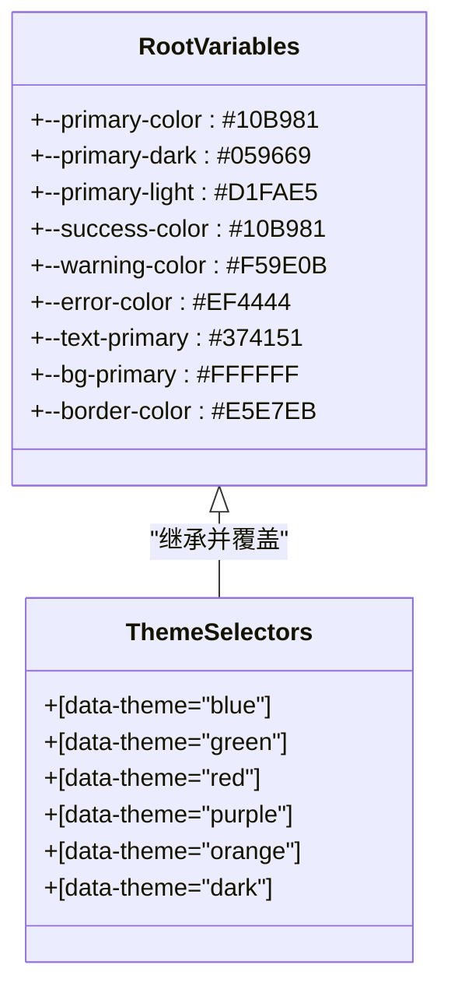
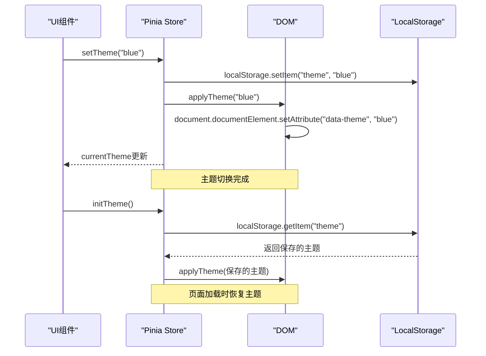
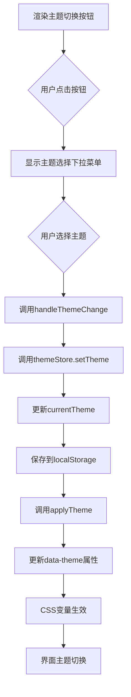

# UI主题定制

<cite>
**本文档引用文件**   
- [themes.css](file://frontend/src/assets/css/themes.css)
- [theme.js](file://frontend/src/stores/theme.js)
- [ThemeToggle.vue](file://frontend/src/components/ThemeToggle.vue)
- [App.vue](file://frontend/src/App.vue)
- [可扩展功能方案建议书.md](file://可扩展功能方案建议书.md)
</cite>

## 目录
1. [主题系统概述](#主题系统概述)
2. [CSS变量体系与主题定义](#css变量体系与主题定义)
3. [主题状态管理与持久化](#主题状态管理与持久化)
4. [主题切换组件实现](#主题切换组件实现)
5. [添加新主题的完整步骤](#添加新主题的完整步骤)
6. [多品牌定制支持方案](#多品牌定制支持方案)

## 主题系统概述

本系统采用基于CSS自定义属性（CSS Variables）的现代化主题切换方案，通过`data-theme`属性控制主题的激活与切换。该方案具有高性能、易维护和良好的可扩展性。系统支持多种预设主题，包括蓝色、绿色、红色、紫色、橙色、青色、粉色和金色，并通过Pinia状态管理库实现主题选择的持久化存储。

**Section sources**
- [themes.css](file://frontend/src/assets/css/themes.css#L1-L200)
- [theme.js](file://frontend/src/stores/theme.js#L1-L55)
- [ThemeToggle.vue](file://frontend/src/components/ThemeToggle.vue#L1-L141)

## CSS变量体系与主题定义

主题系统的核心是`themes.css`文件中定义的CSS变量体系。系统使用`:root`伪类定义默认的CSS变量，并通过`[data-theme="theme-name"]`属性选择器为每个主题定义特定的变量值。



**Diagram sources**
- [themes.css](file://frontend/src/assets/css/themes.css#L2-L200)

### 根变量定义

在`:root`选择器中，系统定义了所有主题共享的基础变量，包括主色调、辅助色彩、文字色彩、背景色彩、边框色彩、阴影效果和圆角等：

```css
:root {
  /* 默认绿色主题 */
  --primary-color: #10B981;
  --primary-dark: #059669;
  --primary-light: #D1FAE5;
  --primary-gradient: linear-gradient(135deg, #10B981 0%, #059669 100%);
  
  /* 辅助色彩 */
  --secondary-color: #6B7280;
  --success-color: #10B981;
  --warning-color: #F59E0B;
  --error-color: #EF4444;
  --info-color: #3B82F6;
  
  /* 文字色彩 */
  --text-primary: #374151;
  --text-secondary: #6B7280;
  --text-light: #9CA3AF;
  --text-white: #FFFFFF;
  
  /* 背景色彩 */
  --bg-primary: #FFFFFF;
  --bg-secondary: #F9FAFB;
  --bg-light: #F3F4F6;
  --bg-dark: #374151;
}
```

### 主题选择器

每个主题通过`[data-theme="theme-name"]`选择器定义其特定的变量值。当某个主题被激活时，这些变量值会覆盖根变量中的默认值：

```css
/* 蓝色主题 */
[data-theme="blue"] {
  --primary-color: #3B82F6;
  --primary-dark: #2563EB;
  --primary-light: #DBEAFE;
  --primary-gradient: linear-gradient(135deg, #3B82F6 0%, #2563EB 100%);
}

/* 绿色主题 */
[data-theme="green"] {
  --primary-color: #10B981;
  --primary-dark: #059669;
  --primary-light: #D1FAE5;
  --primary-gradient: linear-gradient(135deg, #10B981 0%, #059669 100%);
}

/* 深色主题 */
[data-theme="dark"] {
  --primary-color: #6366F1;
  --primary-dark: #4F46E5;
  --primary-light: #E0E7FF;
  --bg-primary: #1F2937;
  --bg-secondary: #111827;
  --text-primary: #F9FAFB;
  --text-secondary: #D1D5DB;
  --border-color: #374151;
}
```

**Section sources**
- [themes.css](file://frontend/src/assets/css/themes.css#L2-L200)

## 主题状态管理与持久化

主题系统的状态管理由Pinia store实现，位于`theme.js`文件中。该store负责管理当前主题、可用主题列表以及主题的持久化存储。



**Diagram sources**
- [theme.js](file://frontend/src/stores/theme.js#L1-L55)

### 主题Store实现

`useThemeStore`定义了主题管理的核心逻辑：

```javascript
export const useThemeStore = defineStore("theme", () => {
  // 当前主题
  const currentTheme = ref("blue");

  // 可用主题列表
  const themes = ref([
    { name: "blue", label: "经典蓝", color: "#1890ff" },
    { name: "green", label: "自然绿", color: "#52c41a" },
    { name: "purple", label: "优雅紫", color: "#722ed1" },
    { name: "orange", label: "活力橙", color: "#fa8c16" },
    { name: "red", label: "热情红", color: "#f5222d" },
    { name: "cyan", label: "清新青", color: "#13c2c2" },
    { name: "pink", label: "温馨粉", color: "#eb2f96" },
    { name: "gold", label: "尊贵金", color: "#faad14" },
  ]);

  // 初始化主题
  const initTheme = () => {
    const savedTheme = localStorage.getItem("theme");
    if (savedTheme && themes.value.find((t) => t.name === savedTheme)) {
      currentTheme.value = savedTheme;
    }
    applyTheme(currentTheme.value);
  };

  // 切换主题
  const setTheme = (themeName) => {
    if (themes.value.find((t) => t.name === themeName)) {
      currentTheme.value = themeName;
      localStorage.setItem("theme", themeName);
      applyTheme(themeName);
    }
  };

  // 应用主题到DOM
  const applyTheme = (themeName) => {
    document.documentElement.setAttribute("data-theme", themeName);
  };

  return {
    currentTheme,
    themes,
    initTheme,
    setTheme,
  };
});
```

### 主题持久化机制

系统通过`localStorage`实现主题的持久化存储。当用户切换主题时，新的主题名称会被保存到`localStorage`中。当页面重新加载时，`initTheme`方法会从`localStorage`中读取保存的主题并应用：

```javascript
// 初始化主题
const initTheme = () => {
  const savedTheme = localStorage.getItem("theme");
  if (savedTheme && themes.value.find((t) => t.name === savedTheme)) {
    currentTheme.value = savedTheme;
  }
  applyTheme(currentTheme.value);
};
```

**Section sources**
- [theme.js](file://frontend/src/stores/theme.js#L1-L55)

## 主题切换组件实现

`ThemeToggle.vue`组件实现了用户界面的主题切换功能，允许用户通过下拉菜单选择不同的主题。



**Diagram sources**
- [ThemeToggle.vue](file://frontend/src/components/ThemeToggle.vue#L1-L141)

### 组件结构

组件使用Element Plus的`el-dropdown`和`el-button`组件构建下拉菜单：

```vue
<template>
  <div class="theme-toggle">
    <el-dropdown @command="handleThemeChange" placement="bottom-end">
      <el-button class="theme-button" circle>
        <el-icon><Brush /></el-icon>
      </el-button>

      <template #dropdown>
        <el-dropdown-menu class="theme-menu">
          <div class="theme-header">
            <h4>选择主题</h4>
          </div>
          <div class="theme-grid">
            <div
              v-for="theme in themes"
              :key="theme.name"
              class="theme-item"
              :class="{ active: currentTheme === theme.name }"
              @click="handleThemeChange(theme.name)"
            >
              <div
                class="theme-color"
                :style="{ backgroundColor: theme.color }"
              ></div>
              <span class="theme-label">{{ theme.label }}</span>
              <el-icon v-if="currentTheme === theme.name" class="theme-check">
                <Check />
              </el-icon>
            </div>
          </div>
        </el-dropdown-menu>
      </template>
    </el-dropdown>
  </div>
</template>
```

### 组件逻辑

组件通过Composition API与Pinia store集成：

```javascript
<script>
import { computed } from "vue";
import { useThemeStore } from "../stores/theme";

export default {
  name: "ThemeToggle",
  setup() {
    const themeStore = useThemeStore();

    const currentTheme = computed(() => themeStore.currentTheme);
    const themes = computed(() => themeStore.themes);

    const handleThemeChange = (themeName) => {
      themeStore.setTheme(themeName);
    };

    return {
      currentTheme,
      themes,
      handleThemeChange,
    };
  },
};
</script>
```

**Section sources**
- [ThemeToggle.vue](file://frontend/src/components/ThemeToggle.vue#L1-L141)

## 添加新主题的完整步骤

### 1. 定义CSS变量

在`themes.css`文件中，为新主题添加`[data-theme="theme-name"]`选择器，并定义相应的CSS变量：

```css
/* 深蓝主题 */
[data-theme="deep-blue"] {
  --primary-color: #1E40AF;
  --primary-dark: #1E3A8A;
  --primary-light: #EFF6FF;
  --primary-gradient: linear-gradient(135deg, #1E40AF 0%, #1E3A8A 100%);
  --success-color: #10B981;
  --shadow-primary: 0 4px 12px rgba(30, 64, 175, 0.4);
}

/* 暗黑模式 */
[data-theme="dark-mode"] {
  --primary-color: #8B5CF6;
  --primary-dark: #7C3AED;
  --primary-light: #EDE9FE;
  --bg-primary: #111827;
  --bg-secondary: #1F2937;
  --bg-light: #374151;
  --text-primary: #F9FAFB;
  --text-secondary: #D1D5DB;
  --text-light: #9CA3AF;
  --border-color: #374151;
  --border-light: #4B5563;
}
```

### 2. 注册主题选项

在`theme.js`的`themes`数组中添加新主题的配置：

```javascript
const themes = ref([
  { name: "blue", label: "经典蓝", color: "#1890ff" },
  { name: "green", label: "自然绿", color: "#52c41a" },
  { name: "deep-blue", label: "深蓝", color: "#1E40AF" },
  { name: "dark-mode", label: "暗黑模式", color: "#8B5CF6" },
  // ... 其他主题
]);
```

### 3. 更新状态管理

确保`setTheme`和`initTheme`方法能够正确处理新主题：

```javascript
// 切换主题
const setTheme = (themeName) => {
  if (themes.value.find((t) => t.name === themeName)) {
    currentTheme.value = themeName;
    localStorage.setItem("theme", themeName);
    applyTheme(themeName);
  }
};

// 初始化主题
const initTheme = () => {
  const savedTheme = localStorage.getItem("theme");
  if (savedTheme && themes.value.find((t) => t.name === savedTheme)) {
    currentTheme.value = savedTheme;
  }
  applyTheme(currentTheme.value);
};
```

### 4. 测试响应式效果

在浏览器中测试新主题的切换效果：
1. 打开开发者工具
2. 在`<html>`元素上手动添加`data-theme="deep-blue"`属性
3. 验证界面颜色是否正确应用
4. 通过主题切换组件选择新主题，验证持久化功能

**Section sources**
- [themes.css](file://frontend/src/assets/css/themes.css#L2-L200)
- [theme.js](file://frontend/src/stores/theme.js#L1-L55)
- [ThemeToggle.vue](file://frontend/src/components/ThemeToggle.vue#L1-L141)

## 多品牌定制支持方案

根据《可扩展功能方案建议书.md》中的建议，主题系统可以支持未来多品牌定制需求。以下是具体的实现方案：

### 品牌主题配置

为每个品牌创建独立的主题配置文件，例如`brand-themes.css`：

```css
/* 品牌A主题 */
[data-theme="brand-a"] {
  --primary-color: #FF6B6B;
  --primary-dark: #EE5253;
  --primary-light: #FFEAA7;
  --logo-url: url('/brands/brand-a/logo.png');
  --brand-name: "品牌A";
}

/* 品牌B主题 */
[data-theme="brand-b"] {
  --primary-color: #4ECDC4;
  --primary-dark: #45B7D1;
  --primary-light: #A8E6CF;
  --logo-url: url('/brands/brand-b/logo.png');
  --brand-name: "品牌B";
}
```

### 动态主题加载

实现动态加载品牌主题的机制：

```javascript
// 动态加载品牌主题
const loadBrandTheme = async (brandId) => {
  try {
    const response = await fetch(`/api/brands/${brandId}/theme`);
    const themeConfig = await response.json();
    
    // 动态创建样式标签
    const style = document.createElement('style');
    style.id = `brand-theme-${brandId}`;
    style.textContent = generateThemeCSS(themeConfig);
    document.head.appendChild(style);
    
    // 应用品牌主题
    useThemeStore().setTheme(`brand-${brandId}`);
  } catch (error) {
    console.error('加载品牌主题失败:', error);
  }
};
```

### API接口设计

为多品牌定制提供RESTful API接口：

```javascript
// 获取品牌主题配置
GET /api/brands/{brandId}/theme

// 更新品牌主题配置
PUT /api/brands/{brandId}/theme

// 获取所有可用主题
GET /api/themes
```

### 配置管理界面

为管理员提供主题配置管理界面，支持：
- 主题变量的可视化编辑
- 实时预览效果
- 主题版本管理
- 品牌主题的批量导入导出

这种架构设计确保了主题系统的高度可扩展性，能够轻松支持未来多品牌定制的需求。

**Section sources**
- [可扩展功能方案建议书.md](file://可扩展功能方案建议书.md#L1-L733)
- [themes.css](file://frontend/src/assets/css/themes.css#L2-L200)
- [theme.js](file://frontend/src/stores/theme.js#L1-L55)