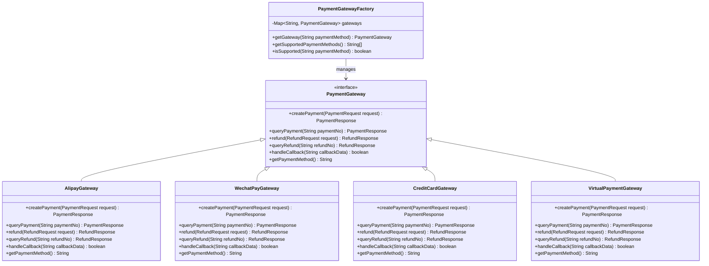
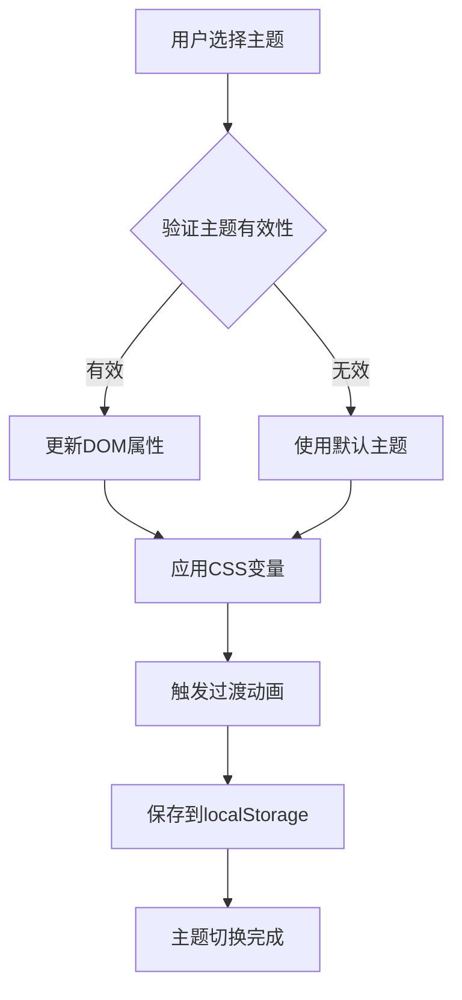
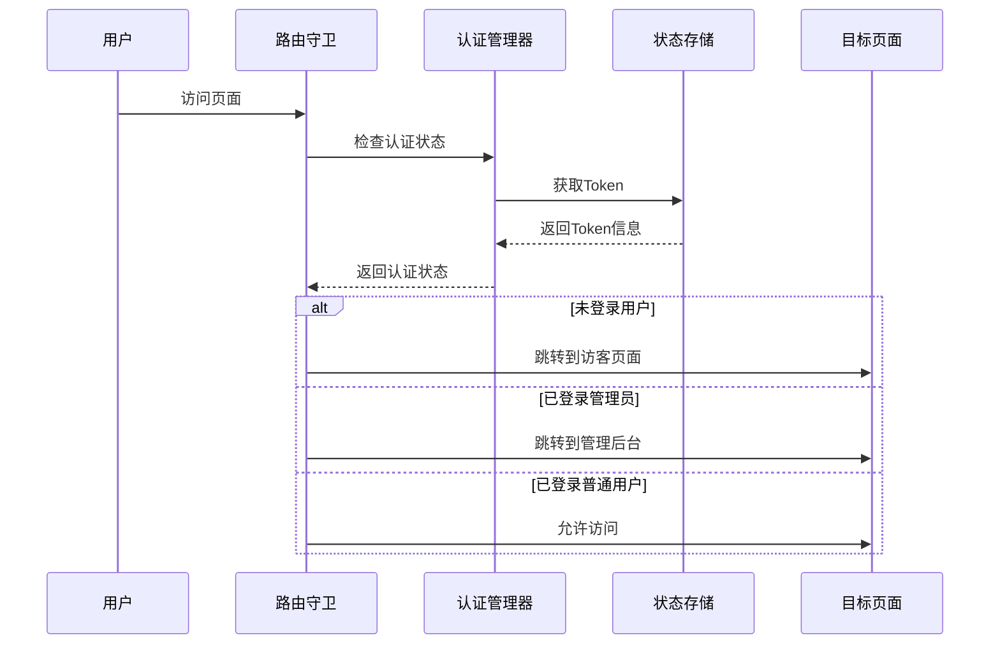
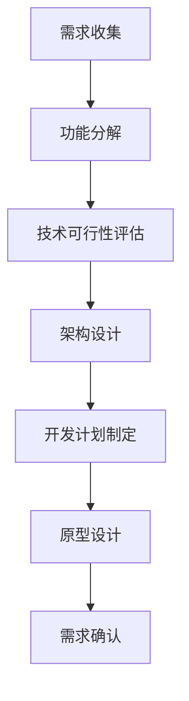
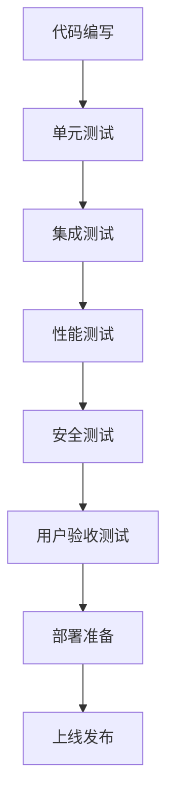
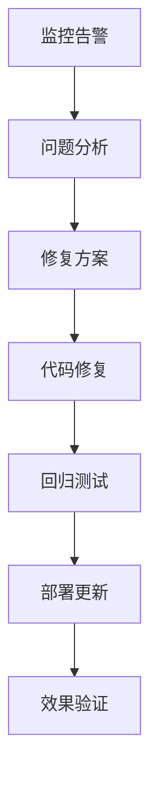
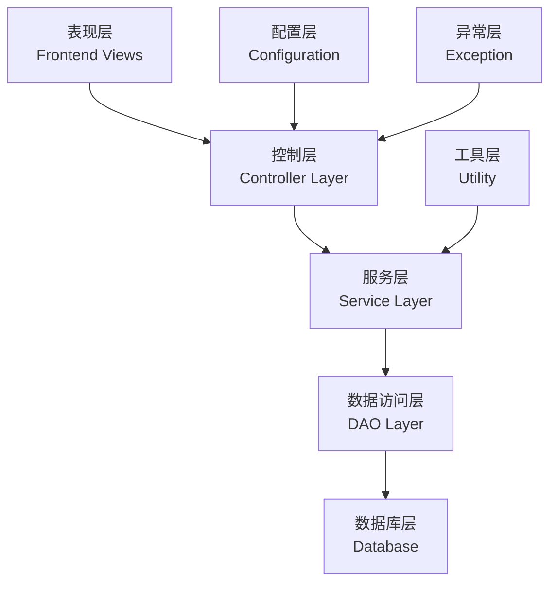

# 扩展与定制

<cite>
**本文档引用的文件**
- [PaymentGatewayFactory.java](file://backend/src/main/java/com/carwash/service/payment/PaymentGatewayFactory.java)
- [PaymentGateway.java](file://backend/src/main/java/com/carwash/service/payment/PaymentGateway.java)
- [AlipayGateway.java](file://backend/src/main/java/com/carwash/service/payment/AlipayGateway.java)
- [WechatPayGateway.java](file://backend/src/main/java/com/carwash/service/payment/WechatPayGateway.java)
- [CreditCardGateway.java](file://backend/src/main/java/com/carwash/service/payment/CreditCardGateway.java)
- [VirtualPaymentGateway.java](file://backend/src/main/java/com/carwash/service/payment/VirtualPaymentGateway.java)
- [application-payment.yml](file://backend/src/main/resources/application-payment.yml)
- [themes.css](file://frontend/src/assets/css/themes.css)
- [theme.js](file://frontend/src/stores/theme.js)
- [ThemeToggle.vue](file://frontend/src/components/ThemeToggle.vue)
- [可扩展功能方案建议书.md](file://可扩展功能方案建议书.md)
- [自动登录状态检测功能文档.md](file://自动登录状态检测功能文档.md)
</cite>

## 目录
1. [概述](#概述)
2. [支付网关扩展机制](#支付网关扩展机制)
3. [前端主题系统扩展](#前端主题系统扩展)
4. [新功能开发通用模式](#新功能开发通用模式)
5. [最佳实践指南](#最佳实践指南)
6. [扩展性架构分析](#扩展性架构分析)
7. [总结与建议](#总结与建议)

## 概述

汽车洗车服务预约系统采用高度模块化的架构设计，具备强大的扩展性和定制能力。系统通过工厂模式、接口抽象、配置驱动等设计模式，为支付方式集成、主题切换、功能扩展等提供了标准化的扩展机制。

### 系统扩展能力评估

| 架构层次 | 扩展能力 | 预留接口 | 扩展难度 |
|----------|----------|----------|----------|
| 前端架构 | ⭐⭐⭐⭐⭐ | Vue3组件化 | 🟢 低 |
| 后端架构 | ⭐⭐⭐⭐⭐ | Spring Boot微服务 | 🟢 低 |
| 数据库架构 | ⭐⭐⭐⭐ | MySQL关系型 | 🟡 中等 |
| 部署架构 | ⭐⭐⭐ | 传统部署 | 🟡 中等 |

## 支付网关扩展机制

### 工厂模式架构设计

系统采用工厂模式管理多种支付网关，通过PaymentGatewayFactory实现支付方式的动态选择和管理。



**图表来源**
- [PaymentGatewayFactory.java](file://backend/src/main/java/com/carwash/service/payment/PaymentGatewayFactory.java#L15-L55)
- [PaymentGateway.java](file://backend/src/main/java/com/carwash/service/payment/PaymentGateway.java#L12-L54)

### 支付网关扩展步骤

#### 步骤1：实现PaymentGateway接口

创建新的支付网关类，实现PaymentGateway接口的所有方法：

```java
@Service
public class UnionPayGateway implements PaymentGateway {
    
    @Override
    public PaymentResponse createPayment(PaymentRequest request) {
        // 实现银联支付创建逻辑
        // 包括参数验证、签名生成、API调用等
    }
    
    @Override
    public PaymentResponse queryPayment(String paymentNo) {
        // 实现银联支付状态查询
    }
    
    @Override
    public RefundResponse refund(RefundRequest request) {
        // 实现银联退款处理
    }
    
    @Override
    public RefundResponse queryRefund(String refundNo) {
        // 实现银联退款状态查询
    }
    
    @Override
    public boolean handleCallback(String callbackData) {
        // 实现银联支付回调处理
    }
    
    @Override
    public String getPaymentMethod() {
        return "unionpay"; // 返回唯一的支付方式标识
    }
}
```

#### 步骤2：配置支付网关参数

在`application-payment.yml`文件中添加银联支付配置：

```yaml
payment:
  # 银联支付配置
  unionpay:
    mer-id: 600000000000001  # 商户号
    cert-path: /path/to/unionpay/cert.pfx  # 证书路径
    cert-password: your-cert-password  # 证书密码
    sign-type: RSA2  # 签名类型
    charset: UTF-8  # 字符集
    gateway-url: https://gateway.unionpay.com/gateway/api  # 银联网关地址
    notify-url: http://localhost:8080/api/payment/callback/unionpay  # 支付回调地址
    return-url: http://localhost:3000/payment/result  # 支付完成跳转地址
```

#### 步骤3：注册到工厂

Spring Boot会自动扫描并注册所有实现了PaymentGateway接口的类到PaymentGatewayFactory中，无需额外配置。

#### 步骤4：测试新支付方式

```java
@SpringBootTest
public class UnionPayGatewayTest {
    
    @Autowired
    private PaymentGatewayFactory gatewayFactory;
    
    @Test
    public void testUnionPayGateway() {
        // 验证银联支付网关可用性
        assertTrue(gatewayFactory.isSupported("unionpay"));
        
        PaymentGateway gateway = gatewayFactory.getGateway("unionpay");
        assertNotNull(gateway);
        assertEquals("unionpay", gateway.getPaymentMethod());
    }
}
```

**章节来源**
- [PaymentGatewayFactory.java](file://backend/src/main/java/com/carwash/service/payment/PaymentGatewayFactory.java#L17-L55)
- [PaymentGateway.java](file://backend/src/main/java/com/carwash/service/payment/PaymentGateway.java#L12-L54)
- [application-payment.yml](file://backend/src/main/resources/application-payment.yml#L1-L34)

### 支付网关扩展示例：PayPal集成

#### PayPal网关实现

```java
@Service
public class PayPalGateway implements PaymentGateway {
    
    @Autowired
    private PayPalConfig payPalConfig;
    
    @Override
    public PaymentResponse createPayment(PaymentRequest request) {
        try {
            // 构建PayPal API请求
            Map<String, Object> requestBody = new HashMap<>();
            requestBody.put("intent", "CAPTURE");
            requestBody.put("purchase_units", Arrays.asList(
                Map.of(
                    "reference_id", request.getOrderNo(),
                    "amount", Map.of(
                        "value", request.getAmount().toString(),
                        "currency_code", "USD"
                    )
                )
            ));
            
            // 调用PayPal API
            String accessToken = getAccessToken();
            HttpHeaders headers = new HttpHeaders();
            headers.setBearerAuth(accessToken);
            headers.setContentType(MediaType.APPLICATION_JSON);
            
            HttpEntity<Map<String, Object>> entity = new HttpEntity<>(requestBody, headers);
            ResponseEntity<Map> response = restTemplate.postForEntity(
                payPalConfig.getApiUrl() + "/v2/checkout/orders", 
                entity, 
                Map.class
            );
            
            // 处理响应
            Map<String, Object> responseBody = response.getBody();
            String approvalUrl = extractApprovalUrl(responseBody);
            
            PaymentResponse resp = new PaymentResponse();
            resp.setSuccess(true);
            resp.setPaymentNo(request.getOrderNo());
            resp.setPaymentUrl(approvalUrl);
            resp.setMessage("PayPal支付订单创建成功");
            
            return resp;
            
        } catch (Exception e) {
            log.error("PayPal支付创建失败", e);
            PaymentResponse resp = new PaymentResponse();
            resp.setSuccess(false);
            resp.setMessage("PayPal支付创建失败: " + e.getMessage());
            return resp;
        }
    }
    
    @Override
    public PaymentResponse queryPayment(String paymentNo) {
        // 实现PayPal支付状态查询
    }
    
    @Override
    public RefundResponse refund(RefundRequest request) {
        // 实现PayPal退款处理
    }
    
    @Override
    public RefundResponse queryRefund(String refundNo) {
        // 实现PayPal退款状态查询
    }
    
    @Override
    public boolean handleCallback(String callbackData) {
        // 实现PayPal回调验证和处理
    }
    
    @Override
    public String getPaymentMethod() {
        return "paypal";
    }
    
    private String getAccessToken() {
        // 实现OAuth2令牌获取
    }
    
    private String extractApprovalUrl(Map<String, Object> response) {
        // 从PayPal响应中提取授权URL
    }
}
```

#### PayPal配置添加

```yaml
payment:
  # PayPal配置
  paypal:
    client-id: YOUR_PAYPAL_CLIENT_ID
    client-secret: YOUR_PAYPAL_CLIENT_SECRET
    mode: sandbox  # 或 production
    api-url: https://api.sandbox.paypal.com  # 沙箱环境
    webhook-url: http://localhost:8080/api/payment/callback/paypal
```

## 前端主题系统扩展

### 主题系统架构

系统采用CSS变量和数据属性的主题切换机制，支持动态主题切换和持久化存储。



**图表来源**
- [theme.js](file://frontend/src/stores/theme.js#L29-L56)
- [themes.css](file://frontend/src/assets/css/themes.css#L1-L200)

### 主题扩展步骤

#### 步骤1：修改themes.css文件

在`themes.css`中添加新的主题变量：

```css
/* 新增紫色主题 */
[data-theme="purple"] {
    --primary-color: #8B5CF6;
    --primary-dark: #7C3AED;
    --primary-light: #EDE9FE;
    --primary-gradient: linear-gradient(135deg, #8B5CF6 0%, #7C3AED 100%);
    --success-color: #10B981;
    --shadow-primary: 0 4px 12px rgba(139, 92, 246, 0.4);
}

/* Element Plus主题变量覆盖 */
:root {
    --el-color-primary: var(--primary-color);
    --el-color-primary-light-3: var(--primary-light);
    --el-color-primary-light-5: var(--primary-light);
    --el-color-primary-light-7: var(--primary-light);
    --el-color-primary-light-8: var(--primary-light);
    --el-color-primary-light-9: var(--primary-light);
    --el-color-primary-dark-2: var(--primary-dark);
}
```

#### 步骤2：更新主题存储

在`theme.js`中添加新主题配置：

```javascript
export const useThemeStore = defineStore("theme", () => {
    // 可用主题列表
    const themes = ref([
        { name: "blue", label: "经典蓝", color: "#1890ff" },
        { name: "green", label: "自然绿", color: "#52c41a" },
        { name: "purple", label: "优雅紫", color: "#722ed1" },  // 新增紫色主题
        { name: "orange", label: "活力橙", color: "#fa8c16" },
        { name: "red", label: "热情红", color: "#f5222d" },
        { name: "cyan", label: "清新青", color: "#13c2c2" },
        { name: "pink", label: "温馨粉", color: "#eb2f96" },
        { name: "gold", label: "尊贵金", color: "#faad14" },
    ]);
    
    // 主题切换逻辑保持不变
});
```

#### 步骤3：更新主题切换组件

`ThemeToggle.vue`组件会自动识别新添加的主题，无需修改组件代码。

#### 步骤4：测试主题切换

```javascript
// 主题切换测试
describe('主题切换功能', () => {
    it('应该支持新添加的紫色主题', () => {
        const { result } = render(ThemeToggle);
        const themeStore = useThemeStore();
        
        // 切换到紫色主题
        themeStore.setTheme('purple');
        
        // 验证DOM属性
        expect(document.documentElement.getAttribute('data-theme')).toBe('purple');
        
        // 验证CSS变量
        const primaryColor = getComputedStyle(document.documentElement)
            .getPropertyValue('--primary-color')
            .trim();
        expect(primaryColor).toBe('#8B5CF6');
    });
});
```

**章节来源**
- [themes.css](file://frontend/src/assets/css/themes.css#L1-L200)
- [theme.js](file://frontend/src/stores/theme.js#L1-L56)
- [ThemeToggle.vue](file://frontend/src/components/ThemeToggle.vue#L1-L142)

### 自定义主题开发指南

#### 主题变量规范

| 变量类别 | CSS变量名称 | 用途说明 | 示例值 |
|----------|-------------|----------|--------|
| 主色调 | `--primary-color` | 主要品牌颜色 | `#10B981` |
| 辅助色 | `--secondary-color` | 次要辅助颜色 | `#6B7280` |
| 成功色 | `--success-color` | 成功状态颜色 | `#10B981` |
| 警告色 | `--warning-color` | 警告状态颜色 | `#F59E0B` |
| 错误色 | `--error-color` | 错误状态颜色 | `#EF4444` |
| 文字色 | `--text-primary` | 主要文字颜色 | `#374151` |
| 背景色 | `--bg-primary` | 主要背景颜色 | `#FFFFFF` |
| 边框色 | `--border-color` | 边框颜色 | `#E5E7EB` |

#### 主题开发最佳实践

1. **保持一致性**：新主题的颜色变量应与现有主题保持一致的命名规范
2. **响应式设计**：深色主题需要特别注意对比度和可读性
3. **动画过渡**：为主题切换添加平滑的过渡效果
4. **无障碍支持**：确保新主题满足WCAG 2.1 AA级可访问性标准

## 新功能开发通用模式

### 自动登录状态检测功能模式

系统采用路由守卫模式实现智能的用户状态检测和页面跳转，为新功能开发提供了标准化的模式。



**图表来源**
- [自动登录状态检测功能文档.md](file://自动登录状态检测功能文档.md#L34-L71)

### 功能开发模板

#### 1. 路由配置模板

```javascript
// 新功能路由配置
const routes = [
    {
        path: '/new-feature',
        component: NewFeatureLayout,
        meta: { 
            requiresAuth: true,  // 需要登录
            requiresAdmin: false, // 不需要管理员权限
            guestOnly: false,     // 不是访客页面
            hideForAuth: false    // 对已登录用户可见
        },
        children: [
            {
                path: '',
                name: 'NewFeature',
                component: NewFeatureMain,
                meta: { breadcrumb: '新功能' }
            },
            {
                path: 'settings',
                name: 'NewFeatureSettings',
                component: NewFeatureSettings,
                meta: { breadcrumb: '设置' }
            }
        ]
    }
];
```

#### 2. 组件开发模板

```vue
<template>
    <div class="new-feature-container">
        <!-- 功能主界面 -->
        <FeatureHeader />
        <FeatureContent />
        <FeatureFooter />
    </div>
</template>

<script>
import { defineComponent, onMounted } from 'vue';
import { useRoute, useRouter } from 'vue-router';
import { useAuthStore } from '@/stores/auth';

export default defineComponent({
    name: 'NewFeature',
    setup() {
        const route = useRoute();
        const router = useRouter();
        const authStore = useAuthStore();
        
        // 权限检查
        onMounted(() => {
            if (!authStore.isAuthenticated) {
                router.push({ 
                    path: '/login', 
                    query: { redirect: route.fullPath } 
                });
            }
            
            // 功能初始化
            initializeFeature();
        });
        
        const initializeFeature = async () => {
            // 功能初始化逻辑
        };
        
        return {
            initializeFeature
        };
    }
});
</script>
```

#### 3. 状态管理模板

```javascript
// 新功能状态管理
export const useNewFeatureStore = defineStore('newFeature', () => {
    // 状态
    const isLoading = ref(false);
    const data = ref(null);
    const error = ref(null);
    
    // 动作
    const fetchData = async (params) => {
        isLoading.value = true;
        error.value = null;
        
        try {
            const response = await api.newFeature.getData(params);
            data.value = response.data;
        } catch (err) {
            error.value = err.message;
        } finally {
            isLoading.value = false;
        }
    };
    
    const resetState = () => {
        isLoading.value = false;
        data.value = null;
        error.value = null;
    };
    
    return {
        isLoading,
        data,
        error,
        fetchData,
        resetState
    };
});
```

**章节来源**
- [自动登录状态检测功能文档.md](file://自动登录状态检测功能文档.md#L29-L71)

### 功能扩展开发流程

#### 1. 需求分析阶段



#### 2. 开发实施阶段



#### 3. 维护优化阶段



## 最佳实践指南

### 后端扩展最佳实践

#### 1. 接口设计原则

- **单一职责**：每个接口只负责一个核心功能
- **开闭原则**：对扩展开放，对修改关闭
- **依赖倒置**：依赖抽象而非具体实现

```java
// 推荐：接口抽象
public interface NotificationService {
    void sendNotification(NotificationRequest request);
    List<Notification> getUserNotifications(String userId);
    void markAsRead(String notificationId);
}

// 不推荐：具体实现暴露
public class EmailNotificationService {
    public void sendEmail(String to, String subject, String content) {}
    public void sendSMS(String phone, String message) {}
}
```

#### 2. 配置管理最佳实践

```yaml
# 推荐：环境隔离配置
spring:
  profiles:
    active: ${ENVIRONMENT:dev}

payment:
  timeout: ${PAYMENT_TIMEOUT:30s}
  retry:
    max-attempts: ${PAYMENT_RETRY_ATTEMPTS:3}
    delay: ${PAYMENT_RETRY_DELAY:1s}
    
logging:
  level:
    com.carwash: ${LOG_LEVEL:INFO}
```

#### 3. 错误处理最佳实践

```java
@Service
public class ExtendedPaymentService {
    
    @Autowired
    private PaymentGatewayFactory gatewayFactory;
    
    public PaymentResponse processPayment(PaymentRequest request) {
        try {
            // 参数验证
            validatePaymentRequest(request);
            
            // 获取支付网关
            PaymentGateway gateway = gatewayFactory.getGateway(request.getPaymentMethod());
            
            // 执行支付
            return gateway.createPayment(request);
            
        } catch (IllegalArgumentException e) {
            log.warn("支付方式不支持: {}", request.getPaymentMethod(), e);
            throw new BusinessLogicException("不支持的支付方式", ErrorCode.INVALID_PAYMENT_METHOD);
            
        } catch (ValidationException e) {
            log.warn("支付请求验证失败: {}", e.getMessage());
            throw new BusinessLogicException("支付请求验证失败", ErrorCode.INVALID_REQUEST, e);
            
        } catch (Exception e) {
            log.error("支付处理异常", e);
            throw new SystemException("支付处理失败", ErrorCode.PAYMENT_PROCESSING_ERROR, e);
        }
    }
}
```

### 前端扩展最佳实践

#### 1. 组件设计原则

- **组合优于继承**：使用组合模式构建复杂组件
- **单一数据源**：避免状态分散在多个地方
- **响应式设计**：确保组件在不同设备上正常工作

```vue
<!-- 推荐：组合式组件 -->
<template>
    <div class="feature-card">
        <FeatureHeader :title="title" :icon="icon" />
        <FeatureContent :data="data" />
        <FeatureActions :actions="actions" />
    </div>
</template>

<script>
import { defineComponent } from 'vue';
import FeatureHeader from './FeatureHeader.vue';
import FeatureContent from './FeatureContent.vue';
import FeatureActions from './FeatureActions.vue';

export default defineComponent({
    name: 'FeatureCard',
    components: {
        FeatureHeader,
        FeatureContent,
        FeatureActions
    },
    props: {
        title: { type: String, required: true },
        icon: { type: String, default: 'default-icon' },
        data: { type: Object, required: true },
        actions: { type: Array, default: () => [] }
    }
});
</script>
```

#### 2. 状态管理最佳实践

```javascript
// 推荐：模块化状态管理
export const useFeatureStore = defineStore('feature', () => {
    // 私有状态
    const _isLoading = ref(false);
    const _data = ref(null);
    const _error = ref(null);
    
    // 公共状态
    const isLoading = computed(() => _isLoading.value);
    const data = computed(() => _data.value);
    const error = computed(() => _error.value);
    
    // 动作
    const fetchData = async (params) => {
        _isLoading.value = true;
        _error.value = null;
        
        try {
            const response = await api.feature.getData(params);
            _data.value = response.data;
        } catch (err) {
            _error.value = err.message;
        } finally {
            _isLoading.value = false;
        }
    };
    
    const reset = () => {
        _isLoading.value = false;
        _data.value = null;
        _error.value = null;
    };
    
    return {
        isLoading,
        data,
        error,
        fetchData,
        reset
    };
});
```

#### 3. 性能优化最佳实践

```javascript
// 推荐：懒加载和虚拟滚动
export default defineComponent({
    setup() {
        const { data, loading, error } = useAsyncData(async () => {
            // 异步数据加载
            return await api.feature.getList();
        });
        
        const virtualList = useVirtualList(data, {
            itemHeight: 80,  // 每项高度
            overscan: 5,     // 预渲染项数
            buffer: 10       // 缓冲区大小
        });
        
        return {
            data,
            loading,
            error,
            virtualList
        };
    }
});
```

**章节来源**
- [可扩展功能方案建议书.md](file://可扩展功能方案建议书.md#L1-L733)

## 扩展性架构分析

### 系统架构扩展能力评估

基于现有架构，系统在以下方面展现出优秀的扩展能力：

#### 1. 前端架构扩展能力

- **Vue3 Composition API**：提供强大的逻辑复用和组合能力
- **组件化设计**：支持功能模块的插拔式开发
- **状态管理**：Pinia提供轻量级的状态管理解决方案
- **路由系统**：支持动态路由和权限控制

#### 2. 后端架构扩展能力

- **Spring Boot微服务**：模块化架构便于功能扩展
- **依赖注入**：支持接口抽象和多实现
- **配置驱动**：支持环境隔离和功能开关
- **异常处理**：统一的异常处理机制

#### 3. 数据库架构扩展能力

- **MySQL关系型数据库**：成熟的事务处理能力
- **软删除设计**：支持数据恢复和审计
- **索引优化**：支持性能扩展
- **JSON字段**：支持灵活的数据结构扩展

### 扩展性设计原则

#### 1. 分层架构原则



#### 2. 接口隔离原则

```java
// 推荐：细粒度接口
public interface PaymentProcessor {
    PaymentResponse processPayment(PaymentRequest request);
    void cancelPayment(String paymentNo);
}

public interface RefundProcessor {
    RefundResponse processRefund(RefundRequest request);
    void queryRefundStatus(String refundNo);
}

// 不推荐：胖接口
public interface PaymentManager {
    PaymentResponse processPayment(PaymentRequest request);
    void cancelPayment(String paymentNo);
    RefundResponse processRefund(RefundRequest request);
    void queryRefundStatus(String refundNo);
    // 更多不相关的功能...
}
```

#### 3. 开放封闭原则

```java
// 对扩展开放
public class AdvancedPaymentGateway implements PaymentGateway {
    @Override
    public PaymentResponse createPayment(PaymentRequest request) {
        // 增强的支付处理逻辑
        return enhancedPaymentProcessing(request);
    }
}

// 对修改关闭
@Service
public class PaymentService {
    @Autowired
    private PaymentGatewayFactory gatewayFactory;
    
    public PaymentResponse processPayment(String paymentMethod, PaymentRequest request) {
        PaymentGateway gateway = gatewayFactory.getGateway(paymentMethod);
        return gateway.createPayment(request);
    }
}
```

**章节来源**
- [可扩展功能方案建议书.md](file://可扩展功能方案建议书.md#L9-L18)

## 总结与建议

### 核心扩展能力总结

1. **支付网关工厂模式**：通过PaymentGateway接口和工厂模式，系统能够轻松集成新的支付方式，如银联、PayPal等。

2. **主题系统灵活性**：基于CSS变量和数据属性的主题切换机制，支持动态主题定制和持久化存储。

3. **路由守卫模式**：智能的用户状态检测和页面跳转功能，为新功能开发提供了标准化的安全控制模式。

4. **模块化架构设计**：前后端均采用模块化设计，支持功能的独立开发和部署。

### 扩展开发建议

#### 短期优先级（1-2个月）

1. **微信小程序开发**：快速占领移动端市场
2. **智能推荐系统**：提升用户体验和转化率
3. **访客首页优化**：改善新用户注册体验

#### 中期优先级（2-3个月）

1. **API开放平台**：构建生态系统
2. **智能客服系统**：降低运营成本
3. **移动端APP开发**：完善移动端覆盖

#### 长期优先级（3-6个月）

1. **多租户架构**：支持SaaS化运营
2. **微服务架构**：支持大规模业务扩展
3. **容器化部署**：提升运维效率

### 技术风险控制

1. **渐进式升级**：避免大规模重构风险
2. **技术选型谨慎**：选择成熟稳定的技术栈
3. **性能监控**：确保扩展不影响现有功能
4. **团队能力匹配**：确保技术团队能力匹配

### 成功关键因素

1. **明确的技术路线图**：制定清晰的扩展计划
2. **充足的开发资源**：确保项目顺利推进
3. **完善的测试体系**：保证功能质量和稳定性
4. **持续的性能优化**：保持系统高性能运行

通过遵循本文档提供的扩展与定制指导，开发团队可以高效地扩展系统功能，同时保持代码质量和系统稳定性，为业务发展提供强有力的技术支撑。