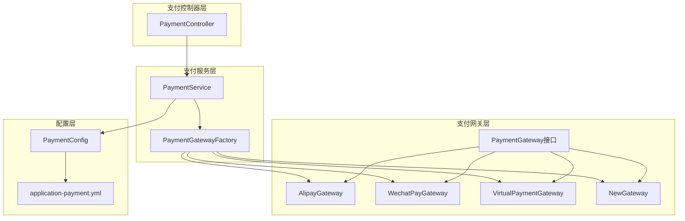
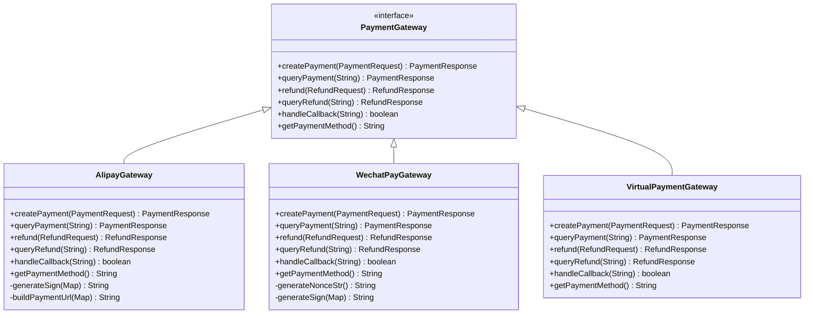
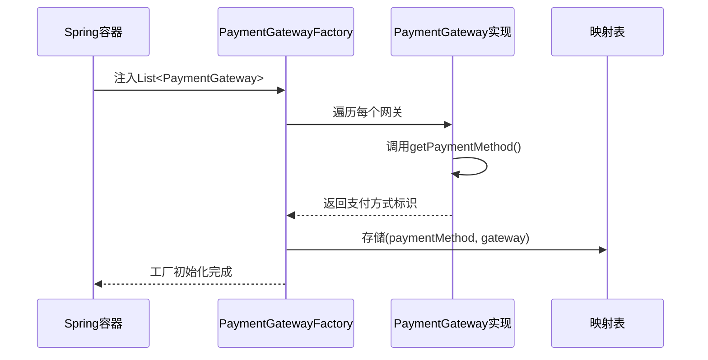

# 支付网关扩展

<cite>
**本文档引用的文件**
- [PaymentGateway.java](file://backend/src/main/java/com/carwash/service/payment/PaymentGateway.java)
- [PaymentGatewayFactory.java](file://backend/src/main/java/com/carwash/service/payment/PaymentGatewayFactory.java)
- [AlipayGateway.java](file://backend/src/main/java/com/carwash/service/payment/AlipayGateway.java)
- [WechatPayGateway.java](file://backend/src/main/java/com/carwash/service/payment/WechatPayGateway.java)
- [VirtualPaymentGateway.java](file://backend/src/main/java/com/carwash/service/payment/VirtualPaymentGateway.java)
- [PaymentConfig.java](file://backend/src/main/java/com/carwash/config/PaymentConfig.java)
- [PaymentController.java](file://backend/src/main/java/com/carwash/controller/PaymentController.java)
- [PaymentServiceImpl.java](file://backend/src/main/java/com/carwash/service/impl/PaymentServiceImpl.java)
- [VirtualPaymentSDK.java](file://backend/src/main/java/com/carwash/service/payment/virtual/VirtualPaymentSDK.java)
- [application-payment.yml](file://backend/src/main/resources/application-payment.yml)
- [payment-gateway.md](file://backend/docs/payment-gateway.md)
</cite>

## 目录
1. [概述](#概述)
2. [系统架构](#系统架构)
3. [PaymentGateway接口详解](#paymentgateway接口详解)
4. [工厂模式实现](#工厂模式实现)
5. [现有支付网关分析](#现有支付网关分析)
6. [扩展新支付方式](#扩展新支付方式)
7. [配置文件设置](#配置文件设置)
8. [测试验证流程](#测试验证流程)
9. [最佳实践](#最佳实践)
10. [故障排除](#故障排除)

## 概述

本系统采用工厂模式和策略模式相结合的方式实现支付网关的统一管理和扩展。通过`PaymentGatewayFactory`工厂类自动收集所有实现了`PaymentGateway`接口的支付网关实现，并建立支付方式与网关的映射关系。这种设计使得添加新的支付方式变得简单而标准化。

## 系统架构



**图表来源**
- [PaymentController.java](file://backend/src/main/java/com/carwash/controller/PaymentController.java#L1-L303)
- [PaymentServiceImpl.java](file://backend/src/main/java/com/carwash/service/impl/PaymentServiceImpl.java#L1-L550)
- [PaymentGatewayFactory.java](file://backend/src/main/java/com/carwash/service/payment/PaymentGatewayFactory.java#L1-L55)

## PaymentGateway接口详解

`PaymentGateway`接口定义了所有支付网关必须实现的核心方法：



**图表来源**
- [PaymentGateway.java](file://backend/src/main/java/com/carwash/service/payment/PaymentGateway.java#L12-L54)
- [AlipayGateway.java](file://backend/src/main/java/com/carwash/service/payment/AlipayGateway.java#L25-L317)
- [WechatPayGateway.java](file://backend/src/main/java/com/carwash/service/payment/WechatPayGateway.java#L25-L251)
- [VirtualPaymentGateway.java](file://backend/src/main/java/com/carwash/service/payment/VirtualPaymentGateway.java#L19-L92)

### 核心方法说明

| 方法 | 功能 | 参数 | 返回值 |
|------|------|------|--------|
| `createPayment` | 创建支付订单 | `PaymentRequest` 请求对象 | `PaymentResponse` 响应对象 |
| `queryPayment` | 查询支付状态 | `String` 支付单号 | `PaymentResponse` 响应对象 |
| `refund` | 申请退款 | `RefundRequest` 退款请求 | `RefundResponse` 退款响应 |
| `queryRefund` | 查询退款状态 | `String` 退款单号 | `RefundResponse` 退款响应 |
| `handleCallback` | 处理支付回调 | `String` 回调数据 | `boolean` 处理结果 |
| `getPaymentMethod` | 获取支付方式标识 | 无 | `String` 支付方式 |

**节来源**
- [PaymentGateway.java](file://backend/src/main/java/com/carwash/service/payment/PaymentGateway.java#L12-L54)

## 工厂模式实现

`PaymentGatewayFactory`采用构造函数注入的方式自动收集所有支付网关实现：



**图表来源**
- [PaymentGatewayFactory.java](file://backend/src/main/java/com/carwash/service/payment/PaymentGatewayFactory.java#L19-L24)

### 工厂类核心功能

| 方法 | 功能 | 实现细节 |
|------|------|----------|
| `getGateway` | 根据支付方式获取网关 | 从映射表中查找，找不到抛出异常 |
| `getSupportedPaymentMethods` | 获取所有支持的支付方式 | 返回映射表的键集合 |
| `isSupported` | 检查是否支持指定支付方式 | 检查映射表是否包含该键 |

**节来源**
- [PaymentGatewayFactory.java](file://backend/src/main/java/com/carwash/service/payment/PaymentGatewayFactory.java#L26-L55)

## 现有支付网关分析

### 支付宝网关 (AlipayGateway)

支付宝网关实现了完整的支付功能，包括：
- 支付订单创建和查询
- 退款申请和状态查询
- 回调处理
- 签名生成和验证

**核心特性：**
- 使用RSA2签名算法
- 支持二维码支付
- 完整的API调用模拟
- 异常处理机制

**节来源**
- [AlipayGateway.java](file://backend/src/main/java/com/carwash/service/payment/AlipayGateway.java#L25-L317)

### 微信支付网关 (WechatPayGateway)

微信支付网关具有以下特点：
- 使用MD5签名算法
- 支持扫码支付
- 完整的商户配置支持
- 签名验证机制

**核心特性：**
- 商户号和应用ID配置
- API密钥验证
- 随机字符串生成
- 签名算法实现

**节来源**
- [WechatPayGateway.java](file://backend/src/main/java/com/carwash/service/payment/WechatPayGateway.java#L25-L251)

### 虚拟支付网关 (VirtualPaymentGateway)

虚拟支付网关主要用于开发和测试：
- 支持多种支付渠道（qr/app/h5）
- 内存状态管理
- 模拟支付流程
- 开发环境友好

**节来源**
- [VirtualPaymentGateway.java](file://backend/src/main/java/com/carwash/service/payment/VirtualPaymentGateway.java#L19-L92)

## 扩展新支付方式

### 步骤1：实现PaymentGateway接口

创建新的支付网关类并实现PaymentGateway接口：

```java
@Service
public class UnionPayGateway implements PaymentGateway {
    
    @Autowired
    private PaymentConfig paymentConfig;
    
    @Override
    public PaymentResponse createPayment(PaymentRequest request) {
        // 实现银联支付订单创建逻辑
        // 包括参数构建、签名生成、API调用等
    }
    
    @Override
    public PaymentResponse queryPayment(String paymentNo) {
        // 实现银联支付状态查询逻辑
    }
    
    @Override
    public RefundResponse refund(RefundRequest request) {
        // 实现银联退款申请逻辑
    }
    
    @Override
    public RefundResponse queryRefund(String refundNo) {
        // 实现银联退款状态查询逻辑
    }
    
    @Override
    public boolean handleCallback(String callbackData) {
        // 实现银联回调处理逻辑
        // 包括签名验证、订单状态更新等
    }
    
    @Override
    public String getPaymentMethod() {
        return "unionpay"; // 必须返回唯一的支付方式标识
    }
}
```

### 步骤2：实现PayPal网关

```java
@Service
public class PayPalGateway implements PaymentGateway {
    
    @Autowired
    private PaymentConfig paymentConfig;
    
    @Override
    public PaymentResponse createPayment(PaymentRequest request) {
        // PayPal支付实现
        // 包括REST API调用、OAuth认证等
    }
    
    @Override
    public PaymentResponse queryPayment(String paymentNo) {
        // PayPal支付状态查询
    }
    
    @Override
    public RefundResponse refund(RefundRequest request) {
        // PayPal退款实现
    }
    
    @Override
    public RefundResponse queryRefund(String refundNo) {
        // PayPal退款状态查询
    }
    
    @Override
    public boolean handleCallback(String callbackData) {
        // PayPal IPN回调处理
        // 包括消息验证、订单更新等
    }
    
    @Override
    public String getPaymentMethod() {
        return "paypal";
    }
}
```

### 步骤3：配置回调端点

在PaymentController中添加新的回调处理方法：

```java
@PostMapping("/callback/unionpay")
@Operation(summary = "银联支付回调")
public String unionPayCallback(HttpServletRequest request) {
    try {
        Map<String, String> params = getRequestParams(request);
        boolean success = paymentService.handlePaymentCallback("unionpay", params);
        return success ? "success" : "fail";
    } catch (Exception e) {
        log.error("银联支付回调处理失败", e);
        return "fail";
    }
}

@PostMapping("/callback/paypal")
@Operation(summary = "PayPal支付回调")
public ResponseEntity<?> paypalCallback(HttpServletRequest request) {
    try {
        Map<String, String> params = getRequestParams(request);
        boolean success = paymentService.handlePaymentCallback("paypal", params);
        if (success) {
            return ResponseEntity.ok().build();
        } else {
            return ResponseEntity.badRequest().build();
        }
    } catch (Exception e) {
        log.error("PayPal支付回调处理失败", e);
        return ResponseEntity.internalServerError().build();
    }
}
```

**节来源**
- [PaymentController.java](file://backend/src/main/java/com/carwash/controller/PaymentController.java#L130-L180)

## 配置文件设置

### 修改application-payment.yml

在配置文件中添加新支付方式的配置：

```yaml
payment:
  # 现有的配置...
  
  # 银联支付配置
  unionpay:
    merchant-id: "${UNIONPAY_MERCHANT_ID}"
    api-key: "${UNIONPAY_API_KEY}"
    gateway-url: "${UNIONPAY_GATEWAY_URL}"
    notify-url: "${BASE_URL}/api/payment/callback/unionpay"
    sign-type: "RSA2"
    charset: "UTF-8"
  
  # PayPal配置
  paypal:
    client-id: "${PAYPAL_CLIENT_ID}"
    client-secret: "${PAYPAL_CLIENT_SECRET}"
    mode: "${PAYPAL_MODE:test}" # test或live
    base-url: "${PAYPAL_BASE_URL}"
    webhook-url: "${BASE_URL}/api/payment/callback/paypal"
```

### PaymentConfig类扩展

修改PaymentConfig类以支持新支付方式：

```java
@Data
@Component
@ConfigurationProperties(prefix = "payment")
public class PaymentConfig {
    
    // 现有的配置字段...
    
    /**
     * 银联支付配置
     */
    public static class UnionPay {
        private String merchantId;
        private String apiKey;
        private String gatewayUrl;
        private String notifyUrl;
        private String signType;
        private String charset;
        
        // Getter和Setter方法
    }
    
    /**
     * PayPal配置
     */
    public static class PayPal {
        private String clientId;
        private String clientSecret;
        private String mode;
        private String baseUrl;
        private String webhookUrl;
        
        // Getter和Setter方法
    }
    
    private UnionPay unionPay = new UnionPay();
    private PayPal paypal = new PayPal();
    
    // Getter方法
    public UnionPay getUnionPay() {
        return unionPay;
    }
    
    public PayPal getPayPal() {
        return paypal;
    }
}
```

**节来源**
- [PaymentConfig.java](file://backend/src/main/java/com/carwash/config/PaymentConfig.java#L1-L225)

## 测试验证流程

### 单元测试

为新支付网关编写单元测试：

```java
@SpringBootTest
@TestPropertySource(properties = {
    "payment.unionpay.merchant-id=test_merchant",
    "payment.unionpay.api-key=test_key",
    "payment.unionpay.gateway-url=http://test.unionpay.com"
})
class UnionPayGatewayTest {
    
    @Autowired
    private UnionPayGateway gateway;
    
    @Autowired
    private PaymentConfig paymentConfig;
    
    @Test
    void testCreatePayment() {
        PaymentRequest request = new PaymentRequest();
        request.setOrderNo("TEST-ORDER-001");
        request.setAmount(new BigDecimal("100.00"));
        request.setPaymentMethod("unionpay");
        
        PaymentResponse response = gateway.createPayment(request);
        
        assertThat(response).isNotNull();
        assertThat(response.isSuccess()).isTrue();
        assertThat(response.getPaymentNo()).isNotNull();
        assertThat(response.getPaymentUrl()).isNotNull();
    }
    
    @Test
    void testHandleCallback() {
        String callbackData = "{\"merchantId\":\"test_merchant\",\"orderId\":\"TEST-ORDER-001\",\"amount\":\"100.00\",\"status\":\"SUCCESS\"}";
        boolean result = gateway.handleCallback(callbackData);
        
        assertThat(result).isTrue();
    }
}
```

### 集成测试

创建支付流程的集成测试：

```java
@SpringBootTest(webEnvironment = SpringBootTest.WebEnvironment.RANDOM_PORT)
class PaymentIntegrationTest {
    
    @Autowired
    private TestRestTemplate restTemplate;
    
    @Test
    void testUnionPayPaymentFlow() {
        // 创建支付请求
        PaymentRequest request = new PaymentRequest();
        request.setOrderNo("INTEGRATION-TEST-" + System.currentTimeMillis());
        request.setAmount(new BigDecimal("50.00"));
        request.setPaymentMethod("unionpay");
        
        // 调用支付创建接口
        ResponseEntity<Result<PaymentResponse>> response = restTemplate.postForEntity(
            "/api/payment/create",
            request,
            new ParameterizedTypeReference<Result<PaymentResponse>>() {}
        );
        
        // 验证响应
        assertThat(response.getBody()).isNotNull();
        assertThat(response.getBody().getCode()).isEqualTo(200);
        assertThat(response.getBody().getData()).isNotNull();
        assertThat(response.getBody().getData().getPaymentNo()).isNotNull();
    }
}
```

### 回调测试

测试支付回调处理：

```java
@Test
void testUnionPayCallbackValidation() {
    // 准备回调数据
    Map<String, String> callbackData = new HashMap<>();
    callbackData.put("merchantId", "test_merchant");
    callbackData.put("orderId", "TEST-ORDER-001");
    callbackData.put("amount", "100.00");
    callbackData.put("status", "SUCCESS");
    
    // 调用回调处理
    boolean result = paymentService.handlePaymentCallback("unionpay", callbackData);
    
    // 验证结果
    assertThat(result).isTrue();
    
    // 验证支付状态已更新
    Payment payment = paymentMapper.selectByOrderNo("TEST-ORDER-001");
    assertThat(payment).isNotNull();
    assertThat(payment.getStatus()).isEqualTo("paid");
}
```

## 最佳实践

### 1. 异常处理

```java
@Override
public PaymentResponse createPayment(PaymentRequest request) {
    try {
        // 支付逻辑实现
        
        PaymentResponse response = new PaymentResponse();
        response.setSuccess(true);
        response.setPaymentNo(generatePaymentNo());
        response.setMessage("支付订单创建成功");
        return response;
        
    } catch (IllegalArgumentException e) {
        log.error("参数验证失败: {}", e.getMessage());
        return createErrorResponse("参数错误: " + e.getMessage());
    } catch (NetworkException e) {
        log.error("网络请求失败: {}", e.getMessage());
        return createErrorResponse("网络连接失败，请稍后重试");
    } catch (Exception e) {
        log.error("支付创建失败", e);
        return createErrorResponse("系统错误: " + e.getMessage());
    }
}
```

### 2. 日志记录

```java
private static final Logger logger = LoggerFactory.getLogger(UnionPayGateway.class);

@Override
public boolean handleCallback(String callbackData) {
    logger.info("开始处理银联支付回调: {}", callbackData);
    
    try {
        // 回调处理逻辑
        
        logger.info("银联支付回调处理成功");
        return true;
    } catch (Exception e) {
        logger.error("银联支付回调处理失败", e);
        return false;
    }
}
```

### 3. 配置验证

```java
@PostConstruct
public void validateConfig() {
    if (StringUtils.isEmpty(paymentConfig.getUnionPay().getMerchantId())) {
        throw new IllegalStateException("银联商户号未配置");
    }
    if (StringUtils.isEmpty(paymentConfig.getUnionPay().getApiKey())) {
        throw new IllegalStateException("银联API密钥未配置");
    }
    if (StringUtils.isEmpty(paymentConfig.getUnionPay().getGatewayUrl())) {
        throw new IllegalStateException("银联网关地址未配置");
    }
}
```

### 4. 签名验证

```java
private boolean verifySignature(Map<String, String> params, String signature) {
    try {
        // 构建待签名字符串
        StringBuilder sb = new StringBuilder();
        params.entrySet().stream()
            .filter(entry -> !"sign".equals(entry.getKey()))
            .sorted(Map.Entry.comparingByKey())
            .forEach(entry -> sb.append(entry.getKey()).append("=").append(entry.getValue()).append("&"));
        sb.append("key=").append(paymentConfig.getUnionPay().getApiKey());
        
        // 计算签名
        String calculatedSignature = calculateSignature(sb.toString());
        
        // 验证签名
        return calculatedSignature.equals(signature);
    } catch (Exception e) {
        log.error("签名验证失败", e);
        return false;
    }
}
```

## 故障排除

### 常见问题及解决方案

#### 1. 支付方式未识别

**问题症状：**
```
IllegalArgumentException: 不支持的支付方式: unionpay
```

**解决方案：**
- 确保新网关类上有`@Service`注解
- 检查`getPaymentMethod()`方法返回正确的支付方式标识
- 确认Spring容器已扫描到该类

#### 2. 回调处理失败

**问题症状：**
- 支付成功但订单状态未更新
- 回调日志显示处理失败

**解决方案：**
- 检查回调签名验证逻辑
- 确认回调URL配置正确
- 验证回调参数解析逻辑

#### 3. 配置加载失败

**问题症状：**
- 支付网关初始化失败
- 配置属性为空

**解决方案：**
- 检查application-payment.yml格式
- 确认环境变量或配置中心正确设置
- 添加配置验证逻辑

#### 4. 网络连接问题

**问题症状：**
- 支付API调用超时
- 网络异常

**解决方案：**
- 添加重试机制
- 设置合理的超时时间
- 实现降级策略

### 调试工具

```java
@Component
public class PaymentDebugInfo {
    
    @Autowired
    private PaymentGatewayFactory factory;
    
    @Autowired
    private PaymentConfig paymentConfig;
    
    public Map<String, Object> getDebugInfo() {
        Map<String, Object> debugInfo = new HashMap<>();
        
        // 支付网关信息
        debugInfo.put("supportedMethods", factory.getSupportedPaymentMethods());
        
        // 配置信息
        debugInfo.put("unionPayConfig", paymentConfig.getUnionPay());
        debugInfo.put("paypalConfig", paymentConfig.getPayPal());
        
        return debugInfo;
    }
}
```

通过以上详细的扩展指南，开发者可以轻松地为系统添加新的支付方式，同时保持代码的一致性和可维护性。每种支付方式都遵循相同的接口规范，确保了系统的稳定性和扩展性。