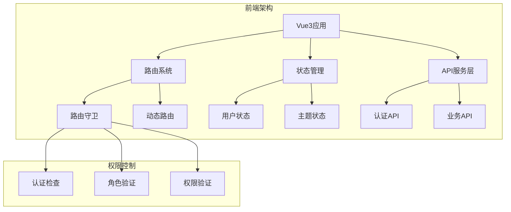
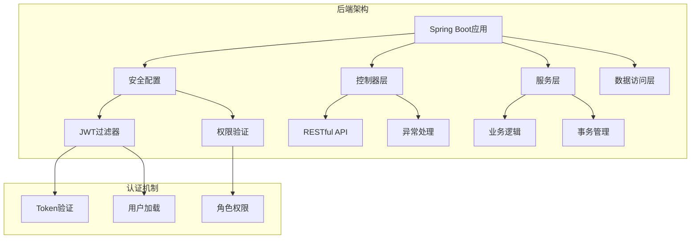
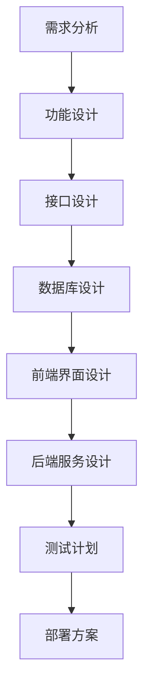
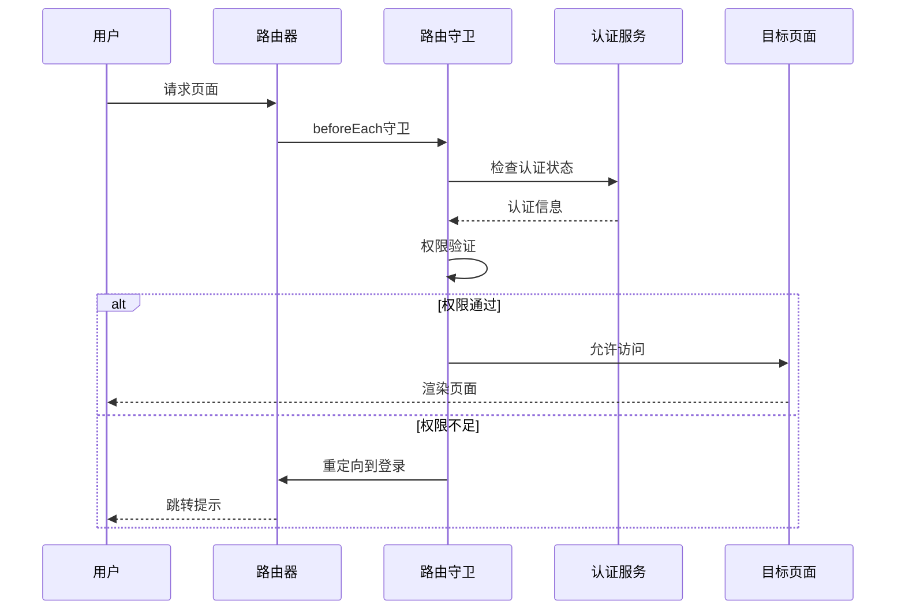
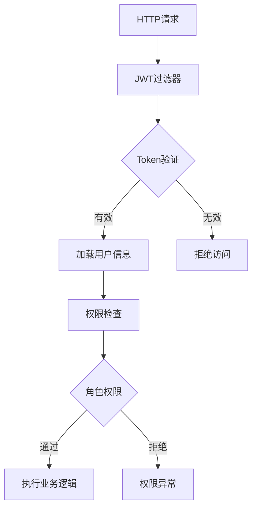
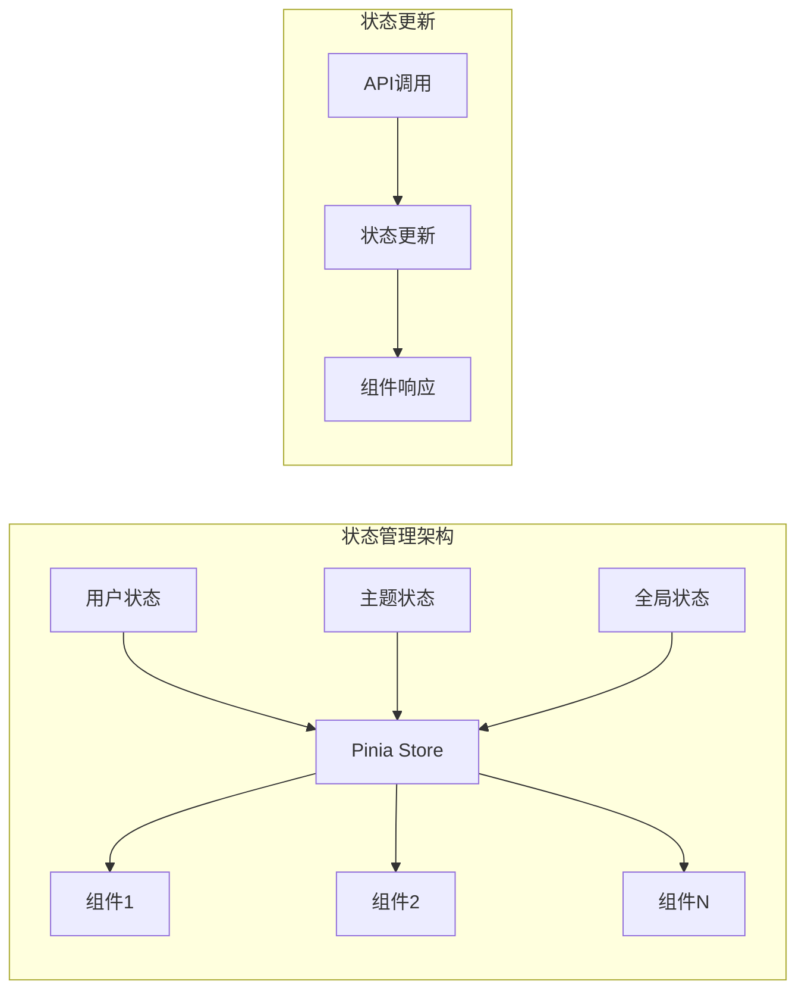
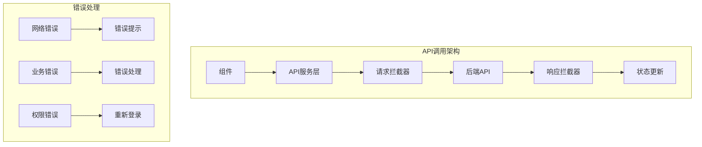

# 新功能开发指南

<cite>
**本文档引用的文件**
- [frontend/src/router/index.js](file://frontend/src/router/index.js)
- [frontend/src/utils/auth.js](file://frontend/src/utils/auth.js)
- [frontend/src/stores/user.js](file://frontend/src/stores/user.js)
- [frontend/src/api/auth.js](file://frontend/src/api/auth.js)
- [frontend/src/views/Login.vue](file://frontend/src/views/Login.vue)
- [frontend/src/views/Admin.vue](file://frontend/src/views/Admin.vue)
- [frontend/src/views/Services.vue](file://frontend/src/views/Services.vue)
- [frontend/src/utils/routeLogger.js](file://frontend/src/utils/routeLogger.js)
- [backend/src/main/java/com/carwash/controller/AuthController.java](file://backend/src/main/java/com/carwash/controller/AuthController.java)
- [backend/src/main/java/com/carwash/service/UserService.java](file://backend/src/main/java/com/carwash/service/UserService.java)
- [backend/src/main/java/com/carwash/common/JwtAuthenticationFilter.java](file://backend/src/main/java/com/carwash/common/JwtAuthenticationFilter.java)
- [backend/src/main/java/com/carwash/config/SecurityConfig.java](file://backend/src/main/java/com/carwash/config/SecurityConfig.java)
- [可扩展功能方案建议书.md](file://可扩展功能方案建议书.md)
</cite>

## 目录
1. [概述](#概述)
2. [系统架构分析](#系统架构分析)
3. [新功能开发流程](#新功能开发流程)
4. [路由守卫与权限控制](#路由守卫与权限控制)
5. [状态管理集成](#状态管理集成)
6. [前后端接口联调](#前后端接口联调)
7. [实际案例：添加新功能模块](#实际案例添加新功能模块)
8. [最佳实践与规范](#最佳实践与规范)
9. [扩展功能规划](#扩展功能规划)
10. [总结](#总结)

## 概述

本指南基于汽车洗车服务预约系统的实际架构，详细阐述新功能开发的完整流程。系统采用前后端分离架构，前端使用Vue3+Element Plus，后端使用Spring Boot+JWT认证，具备完善的权限控制和状态管理机制。

通过参考自动登录状态检测功能的实现，我们将深入讲解从需求分析到功能上线的各个环节，确保新功能能够与现有系统无缝集成。

## 系统架构分析

### 前端架构

系统前端采用Vue3 Composition API，具有以下特点：



**图表来源**
- [frontend/src/router/index.js](file://frontend/src/router/index.js#L207-L336)
- [frontend/src/utils/auth.js](file://frontend/src/utils/auth.js#L1-L214)

### 后端架构

后端采用Spring Boot微服务架构，集成了JWT认证和权限控制：



**图表来源**
- [backend/src/main/java/com/carwash/config/SecurityConfig.java](file://backend/src/main/java/com/carwash/config/SecurityConfig.java#L60-L98)
- [backend/src/main/java/com/carwash/common/JwtAuthenticationFilter.java](file://backend/src/main/java/com/carwash/common/JwtAuthenticationFilter.java#L40-L85)

**章节来源**
- [frontend/src/router/index.js](file://frontend/src/router/index.js#L1-L361)
- [backend/src/main/java/com/carwash/config/SecurityConfig.java](file://backend/src/main/java/com/carwash/config/SecurityConfig.java#L1-L133)

## 新功能开发流程

### 1. 需求分析与设计阶段

#### 需求分析要点

- **功能定位**：明确新功能在整个系统中的作用和价值
- **用户群体**：确定目标用户和使用场景
- **技术可行性**：评估现有架构是否支持新功能
- **业务影响**：分析对现有业务流程的影响

#### 设计文档要求



### 2. 技术设计阶段

#### 前端技术设计

- **组件设计**：基于现有组件库进行扩展
- **状态管理**：合理使用Pinia状态管理
- **路由配置**：新增路由和权限配置
- **API集成**：定义新的API接口规范

#### 后端技术设计

- **接口设计**：RESTful API设计原则
- **服务层设计**：业务逻辑封装
- **数据访问设计**：DAO层和实体映射
- **安全设计**：权限验证和异常处理

### 3. 编码实现阶段

#### 前端实现步骤

1. **创建组件**：基于现有组件模板
2. **配置路由**：添加新路由和权限配置
3. **实现API调用**：封装API请求
4. **集成状态管理**：更新全局状态
5. **权限控制**：添加路由守卫

#### 后端实现步骤

1. **创建控制器**：定义API接口
2. **实现服务**：编写业务逻辑
3. **数据访问**：创建DAO和实体
4. **配置安全**：添加权限验证
5. **异常处理**：统一异常处理机制

### 4. 测试与部署阶段

#### 测试策略

- **单元测试**：测试核心业务逻辑
- **集成测试**：测试前后端接口
- **端到端测试**：模拟用户操作流程
- **性能测试**：验证系统性能指标

#### 部署方案

- **环境配置**：开发、测试、生产环境
- **数据库迁移**：数据结构变更
- **配置管理**：环境变量和配置文件
- **监控告警**：系统健康监控

## 路由守卫与权限控制

### 路由守卫机制

系统实现了完善的路由守卫机制，确保用户只能访问有权限的页面：



**图表来源**
- [frontend/src/router/index.js](file://frontend/src/router/index.js#L207-L336)

### 权限控制实现

#### 前端权限控制

系统提供了多层次的权限控制：

1. **路由级别权限**：通过路由元信息控制
2. **组件级别权限**：通过权限指令控制
3. **API级别权限**：通过认证拦截器控制

#### 后端权限控制

后端通过Spring Security实现细粒度权限控制：



**图表来源**
- [backend/src/main/java/com/carwash/common/JwtAuthenticationFilter.java](file://backend/src/main/java/com/carwash/common/JwtAuthenticationFilter.java#L40-L85)
- [backend/src/main/java/com/carwash/config/SecurityConfig.java](file://backend/src/main/java/com/carwash/config/SecurityConfig.java#L76-L97)

**章节来源**
- [frontend/src/router/index.js](file://frontend/src/router/index.js#L207-L336)
- [frontend/src/utils/auth.js](file://frontend/src/utils/auth.js#L1-L214)
- [backend/src/main/java/com/carwash/config/SecurityConfig.java](file://backend/src/main/java/com/carwash/config/SecurityConfig.java#L60-L98)

## 状态管理集成

### Pinia状态管理

系统使用Pinia作为状态管理工具，提供集中式的状态管理：



**图表来源**
- [frontend/src/stores/user.js](file://frontend/src/stores/user.js#L1-L40)

### 状态管理最佳实践

#### 1. 状态划分原则

- **用户状态**：用户基本信息和认证状态
- **应用状态**：主题、语言、布局等
- **业务状态**：具体业务相关的状态数据

#### 2. 状态更新机制

- **同步更新**：直接修改状态
- **异步更新**：通过API调用更新状态
- **批量更新**：一次性更新多个状态

#### 3. 状态持久化

- **本地存储**：敏感信息不持久化
- **内存管理**：及时清理不需要的状态
- **状态恢复**：页面刷新后状态恢复

**章节来源**
- [frontend/src/stores/user.js](file://frontend/src/stores/user.js#L1-L40)

## 前后端接口联调

### API设计规范

#### 前端API设计

系统提供了统一的API调用层：



**图表来源**
- [frontend/src/api/auth.js](file://frontend/src/api/auth.js#L1-L63)

#### 后端API设计

后端采用RESTful API设计原则：

- **统一响应格式**：所有API返回统一格式
- **状态码规范**：使用标准HTTP状态码
- **错误信息标准化**：提供详细的错误信息
- **版本控制**：支持API版本管理

### 接口联调流程

#### 1. 接口文档制定

- **接口规范**：定义请求方法、URL、参数
- **响应格式**：定义返回数据结构
- **错误码定义**：定义各种错误情况

#### 2. 接口测试

- **单元测试**：测试单个接口功能
- **集成测试**：测试接口间的协作
- **端到端测试**：测试完整业务流程

#### 3. 接口优化

- **性能优化**：减少不必要的数据传输
- **安全性优化**：加强接口安全防护
- **兼容性优化**：保证向前兼容

**章节来源**
- [frontend/src/api/auth.js](file://frontend/src/api/auth.js#L1-L63)
- [backend/src/main/java/com/carwash/controller/AuthController.java](file://backend/src/main/java/com/carwash/controller/AuthController.java#L1-L130)

## 实际案例：添加新功能模块

### 案例背景

假设我们需要添加一个"优惠券管理"功能，包括以下子功能：
- 优惠券列表查看
- 优惠券领取
- 优惠券使用
- 优惠券管理（管理员）

### 功能开发流程

#### 1. 需求分析

**功能描述**：
- 用户可以查看可用优惠券
- 用户可以领取优惠券
- 用户可以在下单时使用优惠券
- 管理员可以管理优惠券

**技术可行性**：
- 现有架构支持新功能开发
- 需要新增数据库表和API接口
- 需要前端新增页面和组件

#### 2. 技术设计

##### 数据库设计

```sql
-- 优惠券表
CREATE TABLE coupons (
    id BIGINT PRIMARY KEY AUTO_INCREMENT,
    name VARCHAR(100) NOT NULL COMMENT '优惠券名称',
    description TEXT COMMENT '优惠券描述',
    type ENUM('FIXED', 'PERCENT') NOT NULL COMMENT '优惠券类型',
    value DECIMAL(10, 2) NOT NULL COMMENT '优惠券面值',
    min_order_amount DECIMAL(10, 2) DEFAULT 0 COMMENT '最低使用金额',
    start_time DATETIME NOT NULL COMMENT '有效期开始时间',
    end_time DATETIME NOT NULL COMMENT '有效期结束时间',
    total_quantity INT NOT NULL COMMENT '总数量',
    remaining_quantity INT NOT NULL COMMENT '剩余数量',
    status ENUM('ACTIVE', 'INACTIVE') DEFAULT 'ACTIVE' COMMENT '状态',
    created_at TIMESTAMP DEFAULT CURRENT_TIMESTAMP,
    updated_at TIMESTAMP DEFAULT CURRENT_TIMESTAMP ON UPDATE CURRENT_TIMESTAMP
);

-- 用户优惠券关联表
CREATE TABLE user_coupons (
    id BIGINT PRIMARY KEY AUTO_INCREMENT,
    user_id BIGINT NOT NULL COMMENT '用户ID',
    coupon_id BIGINT NOT NULL COMMENT '优惠券ID',
    status ENUM('AVAILABLE', 'USED', 'EXPIRED') DEFAULT 'AVAILABLE' COMMENT '使用状态',
    used_at DATETIME COMMENT '使用时间',
    created_at TIMESTAMP DEFAULT CURRENT_TIMESTAMP,
    FOREIGN KEY (user_id) REFERENCES users(id),
    FOREIGN KEY (coupon_id) REFERENCES coupons(id)
);
```

##### 前端设计

###### 路由配置

```javascript
// 新增优惠券相关路由
const routes = [
  {
    path: '/coupons',
    component: Layout,
    meta: { requiresAuth: true },
    children: [
      {
        path: '',
        name: 'CouponsList',
        component: CouponsList,
        meta: { title: '优惠券列表' }
      },
      {
        path: 'my',
        name: 'MyCoupons',
        component: MyCoupons,
        meta: { title: '我的优惠券' }
      }
    ]
  },
  {
    path: '/admin/coupons',
    component: Admin,
    meta: { requiresAuth: true, requiresAdmin: true },
    children: [
      {
        path: '',
        name: 'CouponManagement',
        component: CouponManagement,
        meta: { title: '优惠券管理' }
      }
    ]
  }
];
```

###### 组件设计

```vue
<!-- 优惠券列表组件 -->
<template>
  <div class="coupons-list">
    <div class="page-header">
      <h1>优惠券列表</h1>
      <el-button type="primary" @click="fetchCoupons">
        <el-icon><Refresh /></el-icon>刷新
      </el-button>
    </div>
    
    <div class="coupons-grid">
      <div 
        v-for="coupon in coupons" 
        :key="coupon.id"
        class="coupon-card"
        @click="showCouponDetail(coupon)"
      >
        <div class="coupon-header">
          <div class="coupon-type">{{ getCouponTypeText(coupon) }}</div>
          <div class="coupon-value">
            <span class="amount">{{ coupon.value }}</span>
            <span class="unit">{{ getCouponUnit(coupon) }}</span>
          </div>
        </div>
        
        <div class="coupon-info">
          <div class="coupon-desc">{{ coupon.description }}</div>
          <div class="coupon-validity">
            有效期：{{ formatDate(coupon.start_time) }} - {{ formatDate(coupon.end_time) }}
          </div>
        </div>
        
        <div class="coupon-actions">
          <el-button 
            type="primary" 
            size="small" 
            :disabled="!canReceive(coupon)"
            @click.stop="receiveCoupon(coupon)"
          >
            {{ getReceiveButtonText(coupon) }}
          </el-button>
        </div>
      </div>
    </div>
  </div>
</template>
```

##### 后端设计

###### 控制器设计

```java
@RestController
@RequestMapping("/api/coupons")
@Tag(name = "优惠券管理", description = "优惠券相关接口")
public class CouponController {
    
    @Autowired
    private CouponService couponService;
    
    @GetMapping
    @Operation(summary = "获取优惠券列表", description = "获取可用的优惠券列表")
    public Result<List<CouponDTO>> listCoupons() {
        return Result.success("获取优惠券列表成功", 
            couponService.listAvailableCoupons());
    }
    
    @PostMapping("/{id}/receive")
    @Operation(summary = "领取优惠券", description = "用户领取指定优惠券")
    public Result<Void> receiveCoupon(@PathVariable Long id) {
        couponService.receiveCoupon(id);
        return Result.success("领取优惠券成功");
    }
    
    @GetMapping("/my")
    @Operation(summary = "获取我的优惠券", description = "获取用户拥有的优惠券")
    public Result<List<UserCouponDTO>> getUserCoupons() {
        return Result.success("获取我的优惠券成功", 
            couponService.getUserCoupons());
    }
}
```

###### 服务层设计

```java
@Service
public class CouponServiceImpl implements CouponService {
    
    @Autowired
    private CouponRepository couponRepository;
    
    @Autowired
    private UserCouponRepository userCouponRepository;
    
    @Override
    public List<CouponDTO> listAvailableCoupons() {
        return couponRepository.findAvailableCoupons()
            .stream()
            .map(this::convertToDTO)
            .collect(Collectors.toList());
    }
    
    @Override
    @Transactional
    public void receiveCoupon(Long couponId) {
        User currentUser = authService.getCurrentUser();
        Coupon coupon = couponRepository.findById(couponId)
            .orElseThrow(() -> new BusinessException("优惠券不存在"));
            
        // 检查领取条件
        checkReceiveConditions(coupon, currentUser);
        
        // 创建用户优惠券
        UserCoupon userCoupon = new UserCoupon();
        userCoupon.setUser(currentUser);
        userCoupon.setCoupon(coupon);
        userCoupon.setStatus(CouponStatus.AVAILABLE);
        
        userCouponRepository.save(userCoupon);
    }
    
    @Override
    public List<UserCouponDTO> getUserCoupons() {
        User currentUser = authService.getCurrentUser();
        return userCouponRepository.findByUserId(currentUser.getId())
            .stream()
            .map(this::convertToUserCouponDTO)
            .collect(Collectors.toList());
    }
}
```

#### 3. 编码实现

##### 前端实现

###### API服务

```javascript
// coupon.js
import realApi from './realApi.js';

export const couponApi = {
  // 获取优惠券列表
  async getCoupons() {
    try {
      const response = await realApi.get('/api/coupons');
      return response;
    } catch (error) {
      throw error;
    }
  },
  
  // 领取优惠券
  async receiveCoupon(couponId) {
    try {
      const response = await realApi.post(`/api/coupons/${couponId}/receive`);
      return response;
    } catch (error) {
      throw error;
    }
  },
  
  // 获取我的优惠券
  async getMyCoupons() {
    try {
      const response = await realApi.get('/api/coupons/my');
      return response;
    } catch (error) {
      throw error;
    }
  }
};
```

###### 状态管理

```javascript
// coupon.js (Pinia Store)
import { defineStore } from 'pinia';
import { ref } from 'vue';
import { couponApi } from '../api/coupon';

export const useCouponStore = defineStore('coupon', () => {
  const coupons = ref([]);
  const myCoupons = ref([]);
  
  const fetchCoupons = async () => {
    try {
      const response = await couponApi.getCoupons();
      coupons.value = response.data;
      return response;
    } catch (error) {
      console.error('获取优惠券列表失败:', error);
      throw error;
    }
  };
  
  const fetchMyCoupons = async () => {
    try {
      const response = await couponApi.getMyCoupons();
      myCoupons.value = response.data;
      return response;
    } catch (error) {
      console.error('获取我的优惠券失败:', error);
      throw error;
    }
  };
  
  const receiveCoupon = async (couponId) => {
    try {
      const response = await couponApi.receiveCoupon(couponId);
      // 更新我的优惠券列表
      await fetchMyCoupons();
      return response;
    } catch (error) {
      console.error('领取优惠券失败:', error);
      throw error;
    }
  };
  
  return {
    coupons,
    myCoupons,
    fetchCoupons,
    fetchMyCoupons,
    receiveCoupon
  };
});
```

##### 后端实现

###### 实体类

```java
@Entity
@Table(name = "coupons")
@Data
@NoArgsConstructor
@AllArgsConstructor
@Builder
public class Coupon {
    
    @Id
    @GeneratedValue(strategy = GenerationType.IDENTITY)
    private Long id;
    
    @Column(nullable = false)
    private String name;
    
    @Column(length = 1000)
    private String description;
    
    @Enumerated(EnumType.STRING)
    @Column(nullable = false)
    private CouponType type;
    
    @Column(nullable = false, precision = 10, scale = 2)
    private BigDecimal value;
    
    @Column(name = "min_order_amount", precision = 10, scale = 2)
    private BigDecimal minOrderAmount;
    
    @Column(name = "start_time", nullable = false)
    private LocalDateTime startTime;
    
    @Column(name = "end_time", nullable = false)
    private LocalDateTime endTime;
    
    @Column(name = "total_quantity", nullable = false)
    private Integer totalQuantity;
    
    @Column(name = "remaining_quantity", nullable = false)
    private Integer remainingQuantity;
    
    @Enumerated(EnumType.STRING)
    private CouponStatus status;
    
    @CreatedDate
    @Column(nullable = false, updatable = false)
    private LocalDateTime createdAt;
    
    @LastModifiedDate
    private LocalDateTime updatedAt;
}
```

###### 数据访问层

```java
@Repository
public interface CouponRepository extends JpaRepository<Coupon, Long> {
    
    @Query("""
        SELECT c FROM Coupon c 
        WHERE c.status = 'ACTIVE' 
        AND c.remainingQuantity > 0
        AND :now BETWEEN c.startTime AND c.endTime
    """)
    List<Coupon> findAvailableCoupons(@Param("now") LocalDateTime now);
    
    @Query("""
        SELECT uc FROM UserCoupon uc 
        JOIN uc.coupon c 
        WHERE uc.user.id = :userId 
        AND uc.status = 'AVAILABLE'
        AND :now BETWEEN c.startTime AND c.endTime
    """)
    List<UserCoupon> findAvailableUserCoupons(
        @Param("userId") Long userId, 
        @Param("now") LocalDateTime now
    );
}
```

#### 4. 测试与部署

##### 单元测试

```java
@SpringBootTest
@Transactional
@TestPropertySource(properties = {
    "spring.jpa.properties.hibernate.dialect=org.hibernate.dialect.H2Dialect"
})
class CouponServiceTest {
    
    @Autowired
    private CouponService couponService;
    
    @Autowired
    private CouponRepository couponRepository;
    
    @Autowired
    private UserCouponRepository userCouponRepository;
    
    @Test
    void testReceiveCoupon() {
        // 准备测试数据
        Coupon coupon = createTestCoupon();
        User user = createUser();
        
        // 执行测试
        couponService.receiveCoupon(coupon.getId());
        
        // 验证结果
        List<UserCoupon> userCoupons = userCouponRepository.findByUserId(user.getId());
        assertThat(userCoupons).hasSize(1);
        assertThat(userCoupons.get(0).getCoupon()).isEqualTo(coupon);
    }
}
```

##### 集成测试

```javascript
describe('优惠券功能集成测试', () => {
  it('应该能够正确领取优惠券', async () => {
    // 登录
    await loginAsUser();
    
    // 获取优惠券列表
    const coupons = await getCoupons();
    expect(coupons).toBeDefined();
    
    // 领取第一个优惠券
    const coupon = coupons[0];
    await receiveCoupon(coupon.id);
    
    // 验证是否领取成功
    const myCoupons = await getMyCoupons();
    expect(myCoupons).toContainEqual(expect.objectContaining({
      couponId: coupon.id
    }));
  });
});
```

**章节来源**
- [frontend/src/router/index.js](file://frontend/src/router/index.js#L25-L120)
- [frontend/src/api/auth.js](file://frontend/src/api/auth.js#L1-L63)
- [backend/src/main/java/com/carwash/controller/AuthController.java](file://backend/src/main/java/com/carwash/controller/AuthController.java#L40-L80)

## 最佳实践与规范

### 代码规范

#### 前端代码规范

1. **命名规范**
   - 组件名：PascalCase
   - 变量名：camelCase
   - 常量名：UPPER_SNAKE_CASE

2. **文件组织**
   - 组件按功能分组
   - API服务集中管理
   - 工具函数分类存放

3. **代码风格**
   - 使用TypeScript提高类型安全
   - 遵循ESLint规则
   - 适当的注释和文档

#### 后端代码规范

1. **包结构**
   - controller：控制器层
   - service：服务层
   - dao：数据访问层
   - entity：实体类
   - config：配置类

2. **命名规范**
   - 类名：PascalCase
   - 方法名：camelCase
   - 常量：UPPER_SNAKE_CASE

3. **代码质量**
   - 使用Lombok简化代码
   - 遵循Spring Boot约定
   - 适当的异常处理

### 安全规范

#### 前端安全

1. **输入验证**
   - 表单数据验证
   - URL参数验证
   - 文件上传验证

2. **数据保护**
   - 敏感数据加密
   - Cookie安全设置
   - XSS防护

#### 后端安全

1. **认证授权**
   - JWT Token管理
   - 权限验证
   - 会话管理

2. **数据安全**
   - SQL注入防护
   - 参数化查询
   - 数据加密

### 性能优化

#### 前端性能

1. **资源优化**
   - 代码分割
   - 图片压缩
   - 缓存策略

2. **交互优化**
   - 防抖节流
   - 虚拟滚动
   - 懒加载

#### 后端性能

1. **数据库优化**
   - 索引优化
   - 查询优化
   - 连接池配置

2. **缓存策略**
   - Redis缓存
   - 本地缓存
   - CDN加速

### 监控与日志

#### 前端监控

1. **错误监控**
   - JavaScript错误捕获
   - 性能监控
   - 用户行为分析

2. **日志记录**
   - 用户操作日志
   - 系统错误日志
   - 性能指标日志

#### 后端监控

1. **系统监控**
   - CPU/内存使用率
   - 数据库连接数
   - API响应时间

2. **业务监控**
   - 用户活跃度
   - 功能使用率
   - 异常统计

**章节来源**
- [frontend/src/utils/routeLogger.js](file://frontend/src/utils/routeLogger.js#L1-L233)
- [backend/src/main/java/com/carwash/config/SecurityConfig.java](file://backend/src/main/java/com/carwash/config/SecurityConfig.java#L60-L98)

## 扩展功能规划

基于《可扩展功能方案建议书》的规划，以下是系统未来扩展功能的建议：

### AI智能化扩展

#### 智能推荐系统

**技术可行性**：⭐⭐⭐⭐⭐  
**业务价值**：⭐⭐⭐⭐⭐  
**开发周期**：3-4周

**功能描述**：基于用户行为和偏好的智能服务推荐系统。

**技术方案**：
- 用户行为分析
- 协同过滤算法
- 机器学习模型集成
- 实时推荐系统

**数据库设计**：
```sql
-- 用户行为表
CREATE TABLE user_behaviors (
    id BIGINT PRIMARY KEY AUTO_INCREMENT,
    user_id BIGINT NOT NULL,
    action_type VARCHAR(50) NOT NULL,
    service_id BIGINT,
    session_id VARCHAR(100),
    device_info JSON,
    created_at TIMESTAMP DEFAULT CURRENT_TIMESTAMP,
    INDEX idx_user_time (user_id, created_at)
);

-- 推荐结果表
CREATE TABLE recommendations (
    id BIGINT PRIMARY KEY AUTO_INCREMENT,
    user_id BIGINT NOT NULL,
    service_id BIGINT NOT NULL,
    score DECIMAL(5,4) NOT NULL,
    reason VARCHAR(200),
    created_at TIMESTAMP DEFAULT CURRENT_TIMESTAMP,
    INDEX idx_user_score (user_id, score DESC)
);
```

#### 智能客服机器人

**技术可行性**：⭐⭐⭐⭐  
**业务价值**：⭐⭐⭐⭐  
**开发周期**：4-5周

**功能描述**：基于大语言模型的智能客服系统。

**技术方案**：
- 阿里云通义千问集成
- 意图识别
- 知识库检索
- 情感分析

### 移动端生态扩展

#### 微信小程序

**技术可行性**：⭐⭐⭐⭐⭐  
**业务价值**：⭐⭐⭐⭐⭐  
**开发周期**：3-4周

**功能描述**：基于微信生态的小程序应用。

**特色功能**：
- 微信一键登录
- 微信支付集成
- 位置服务集成
- 微信分享功能

#### 移动APP (uni-app)

**技术可行性**：⭐⭐⭐⭐  
**业务价值**：⭐⭐⭐⭐  
**开发周期**：5-6周

**功能描述**：跨平台移动应用。

**原生功能集成**：
- 推送通知
- 地理位置服务
- 相机调用
- 本地存储

### 企业级功能扩展

#### 多租户SaaS架构

**技术可行性**：⭐⭐⭐  
**业务价值**：⭐⭐⭐⭐⭐  
**开发周期**：8-10周

**功能描述**：支持多商户入驻的SaaS平台架构。

**架构优势**：
- 数据隔离安全
- 资源共享高效
- 快速部署新租户
- 统一运维管理

#### API开放平台

**技术可行性**：⭐⭐⭐⭐  
**业务价值**：⭐⭐⭐⭐  
**开发周期**：4-5周

**功能描述**：开放API平台，支持第三方系统集成。

**开放API列表**：
- 服务查询API
- 预约创建API
- 订单查询API
- 支付状态API
- 用户信息API

**章节来源**
- [可扩展功能方案建议书.md](file://可扩展功能方案建议书.md#L130-L733)

## 总结

本指南详细阐述了汽车洗车服务预约系统中新功能开发的完整流程，涵盖了从需求分析到功能上线的各个环节。通过参考系统现有的自动登录状态检测功能，我们深入讲解了：

1. **系统架构理解**：前端Vue3+Element Plus，后端Spring Boot+JWT认证的架构特点
2. **开发流程规范**：需求分析、技术设计、编码实现、测试部署的标准流程
3. **权限控制机制**：路由守卫、JWT认证、角色权限的实现原理
4. **状态管理集成**：Pinia状态管理的最佳实践
5. **前后端接口联调**：API设计规范和联调流程
6. **实际案例演示**：通过优惠券管理功能展示完整开发过程
7. **扩展功能规划**：基于AI智能化、移动端生态、企业级功能的扩展建议

通过遵循本指南的规范和最佳实践，开发者可以确保新功能与现有系统无缝集成，同时保持系统的可维护性和扩展性。系统的模块化设计和完善的权限控制机制为未来的功能扩展奠定了坚实的基础。

随着技术的不断发展，系统将继续演进，通过AI智能化、移动端生态扩展、企业级功能增强等方向，为用户提供更加智能、便捷、安全的服务体验。