# API通信层

<cite>
**本文档引用的文件**
- [request.js](file://frontend/src/api/request.js)
- [payment.js](file://frontend/src/api/payment.js)
- [paymentFlow.js](file://frontend/src/utils/paymentFlow.js)
- [api.js](file://frontend/src/config/api.js)
- [auth.js](file://frontend/src/api/auth.js)
- [realApi.js](file://frontend/src/api/realApi.js)
- [order.js](file://frontend/src/api/order.js)
- [user.js](file://frontend/src/api/user.js)
- [mockOrderApi.js](file://frontend/src/api/mockOrderApi.js)
- [Payment.vue](file://frontend/src/views/Payment.vue)
- [dataSync.js](file://frontend/src/utils/dataSync.js)
</cite>

## 目录
1. [概述](#概述)
2. [项目架构](#项目架构)
3. [核心请求封装](#核心请求封装)
4. [API模块组织](#api模块组织)
5. [支付系统集成](#支付系统集成)
6. [安全机制](#安全机制)
7. [错误处理与调试](#错误处理与调试)
8. [性能优化](#性能优化)
9. [最佳实践](#最佳实践)
10. [故障排除](#故障排除)

## 概述

前端API通信层采用基于Axios的现代化架构设计，提供了统一的请求管理、响应处理、错误管理和安全控制机制。该系统支持多种支付方式、完整的订单生命周期管理以及实时的数据同步功能。

### 主要特性

- **统一请求封装**：基于Axios的请求实例，内置拦截器和错误处理
- **模块化API设计**：按业务领域划分的API模块，职责清晰
- **多环境支持**：开发、测试、生产环境的灵活配置
- **安全防护**：JWT自动注入、CSRF防护、请求签名验证
- **实时同步**：数据一致性保障机制
- **错误恢复**：完善的错误处理和重试机制

## 项目架构

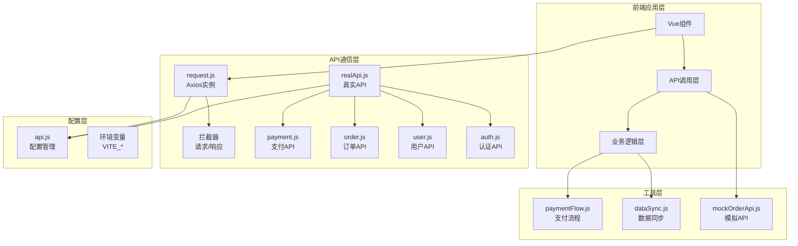

**图表来源**
- [request.js](file://frontend/src/api/request.js#L1-L143)
- [realApi.js](file://frontend/src/api/realApi.js#L1-L336)
- [api.js](file://frontend/src/config/api.js#L1-L92)

**章节来源**
- [request.js](file://frontend/src/api/request.js#L1-L143)
- [realApi.js](file://frontend/src/api/realApi.js#L1-L336)
- [api.js](file://frontend/src/config/api.js#L1-L92)

## 核心请求封装

### Axios实例配置

系统基于Axios创建了专门的请求实例，集成了统一的配置和拦截器机制。

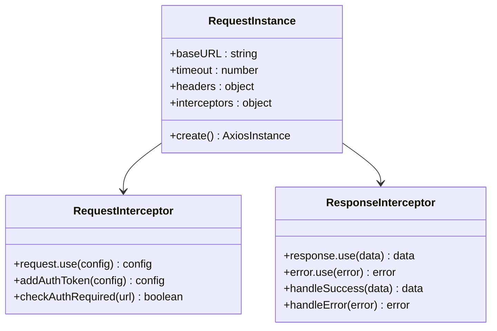

**图表来源**
- [request.js](file://frontend/src/api/request.js#L6-L12)
- [request.js](file://frontend/src/api/request.js#L15-L62)
- [request.js](file://frontend/src/api/request.js#L69-L141)

### 请求拦截器实现

请求拦截器负责JWT自动注入和请求预处理：

| 功能 | 实现细节 | 安全考虑 |
|------|----------|----------|
| JWT自动注入 | 检查localStorage中的token，自动添加Authorization头 | Token类型可配置，支持Bearer或其他格式 |
| 接口权限控制 | 基于NO_AUTH_URLS白名单判断是否需要认证 | 防止敏感接口泄露 |
| 请求日志记录 | 详细的请求配置输出，便于调试 | 敏感信息脱敏显示 |
| 空白字符处理 | 自动清理token中的空白字符 | 防止认证失败 |

### 响应拦截器机制

响应拦截器提供统一的成功/失败处理和错误提示：

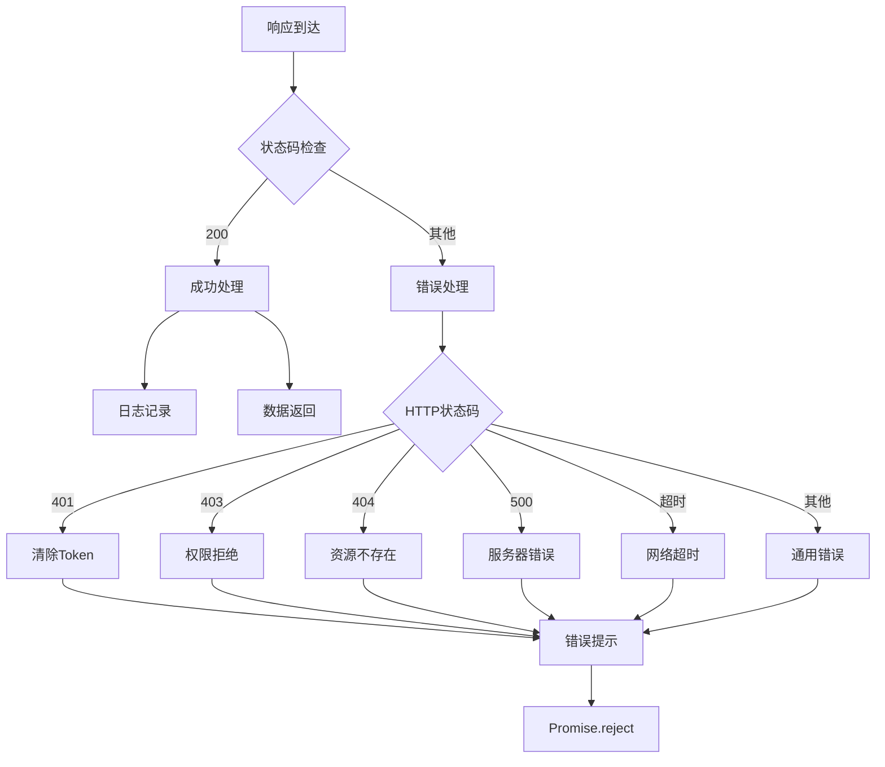

**图表来源**
- [request.js](file://frontend/src/api/request.js#L70-L141)

**章节来源**
- [request.js](file://frontend/src/api/request.js#L1-L143)

## API模块组织

### 模块化设计原则

API模块采用领域驱动的设计方式，每个模块专注于特定的业务领域：

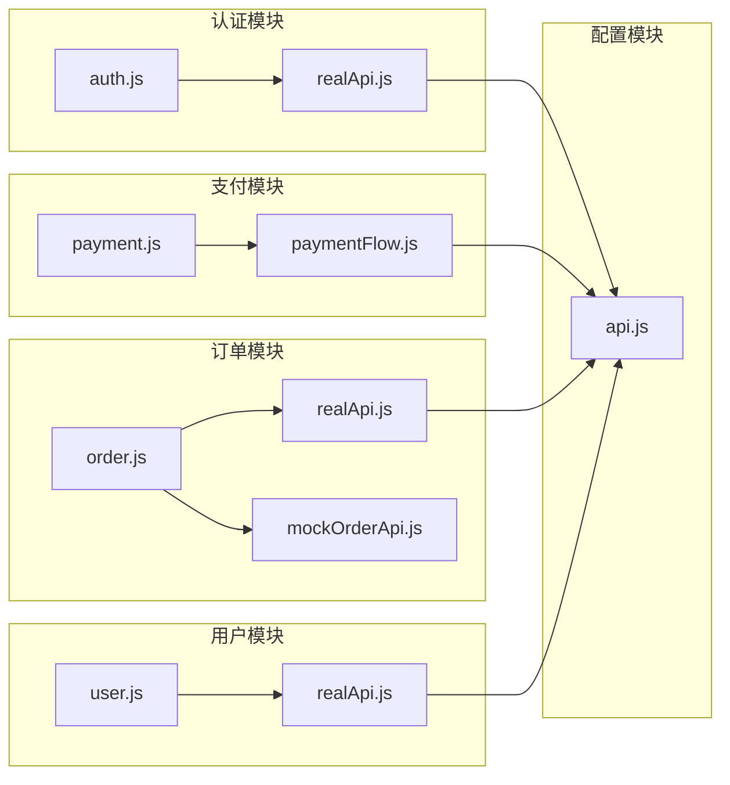

**图表来源**
- [auth.js](file://frontend/src/api/auth.js#L1-L63)
- [payment.js](file://frontend/src/api/payment.js#L1-L139)
- [order.js](file://frontend/src/api/order.js#L1-L222)
- [user.js](file://frontend/src/api/user.js#L1-L134)

### API配置管理

配置文件集中管理所有API端点和环境设置：

| 配置类别 | 配置项 | 默认值 | 说明 |
|----------|--------|--------|------|
| 基础配置 | BASE_URL | http://localhost:8080/api | 后端API基础地址 |
| 超时配置 | TIMEOUT | 10000ms | 请求超时时间 |
| 认证配置 | NO_AUTH_URLS | [] | 无需认证的接口列表 |
| 环境配置 | USE_REAL_API | true | 是否使用真实API |

**章节来源**
- [api.js](file://frontend/src/config/api.js#L1-L92)
- [realApi.js](file://frontend/src/api/realApi.js#L1-L336)

## 支付系统集成

### 支付API设计

支付模块提供了完整的支付生命周期管理：

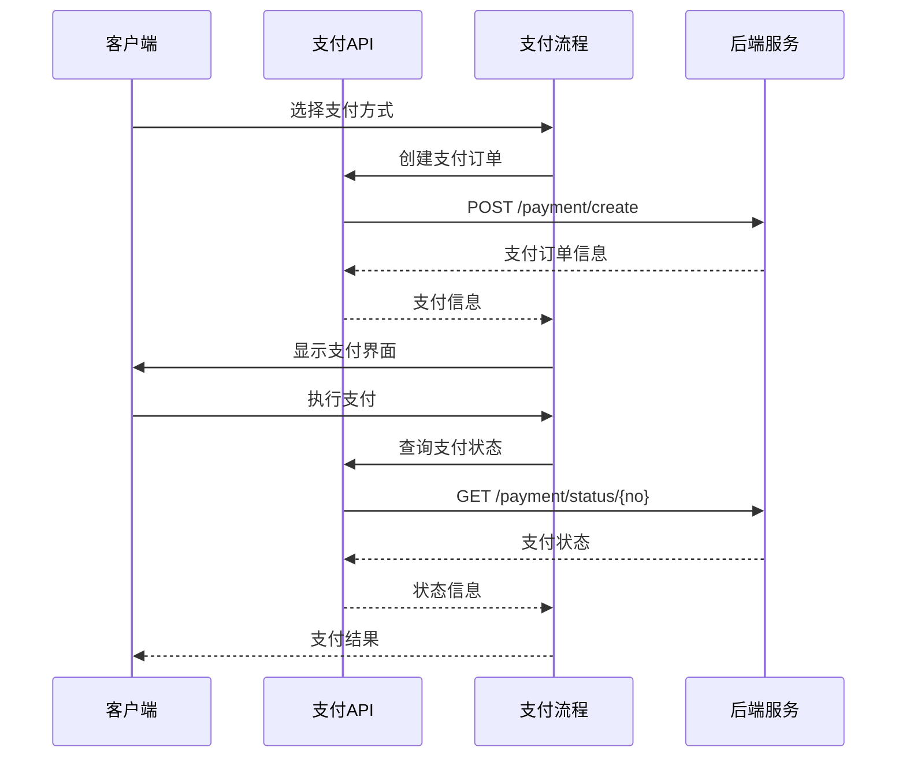

**图表来源**
- [payment.js](file://frontend/src/api/payment.js#L16-L84)
- [paymentFlow.js](file://frontend/src/utils/paymentFlow.js#L1-L29)

### 支付流程编排

支付流程工具提供了统一的支付按钮显示逻辑和导航构建：

| 功能 | 实现逻辑 | 业务规则 |
|------|----------|----------|
| 支付按钮显示 | 订单状态为pending/confirmed且未支付 | 防止重复支付 |
| 无障碍支持 | 构建ARIA标签文本 | 提升可访问性 |
| 路由导航 | 从订单信息构建支付页面路由 | 确保正确跳转 |

### 支付接口详解

支付模块包含以下核心接口：

| 接口名称 | 方法 | 参数 | 返回值 | 用途 |
|----------|------|------|--------|------|
| 创建支付 | POST /payment/create | paymentData | 支付订单信息 | 初始化支付流程 |
| 获取公钥 | GET /payment/security/public-key | 无 | RSA公钥 | 加密敏感支付信息 |
| 查询状态 | GET /payment/status/{no} | paymentNo | 支付状态 | 检查支付结果 |
| 申请退款 | POST /payment/refund | refundData | 退款申请结果 | 处理退款请求 |
| 取消订单 | POST /payment/cancel/{no} | paymentNo | 取消结果 | 处理过期订单 |

**章节来源**
- [payment.js](file://frontend/src/api/payment.js#L1-L139)
- [paymentFlow.js](file://frontend/src/utils/paymentFlow.js#L1-L29)

## 安全机制

### JWT认证体系

系统实现了完整的JWT认证机制：

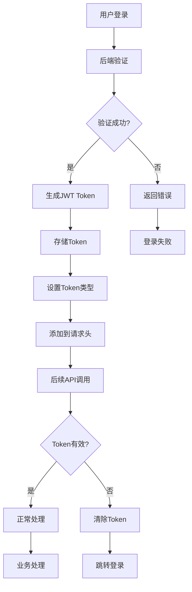

**图表来源**
- [request.js](file://frontend/src/api/request.js#L30-L48)
- [auth.js](file://frontend/src/api/auth.js#L8-L30)

### CSRF防护

虽然代码中没有显式的CSRF令牌处理，但系统通过以下方式确保安全性：

| 安全措施 | 实现方式 | 防护目标 |
|----------|----------|----------|
| HTTPS强制 | 生产环境强制使用HTTPS | 防止中间人攻击 |
| Token验证 | JWT自动注入验证 | 防止非法请求 |
| 接口权限 | 白名单机制控制 | 限制敏感接口访问 |
| 请求签名 | 后端验证请求完整性 | 防止请求篡改 |

### 数据加密

对于敏感支付信息，系统提供了RSA加密机制：

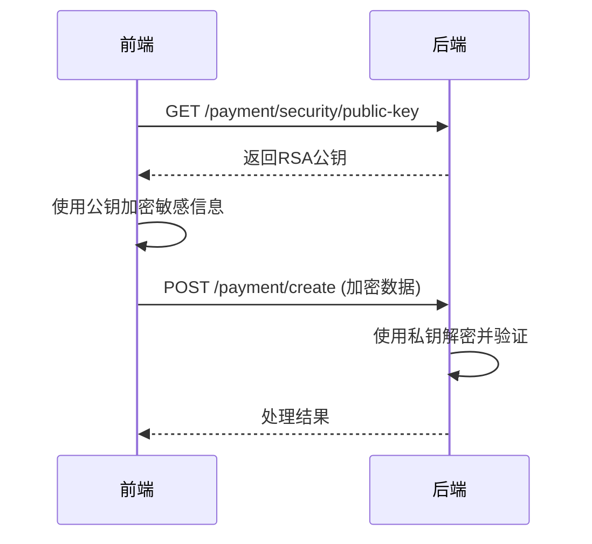

**章节来源**
- [payment.js](file://frontend/src/api/payment.js#L24-L26)
- [request.js](file://frontend/src/api/request.js#L30-L48)

## 错误处理与调试

### 统一错误处理

系统实现了多层次的错误处理机制：

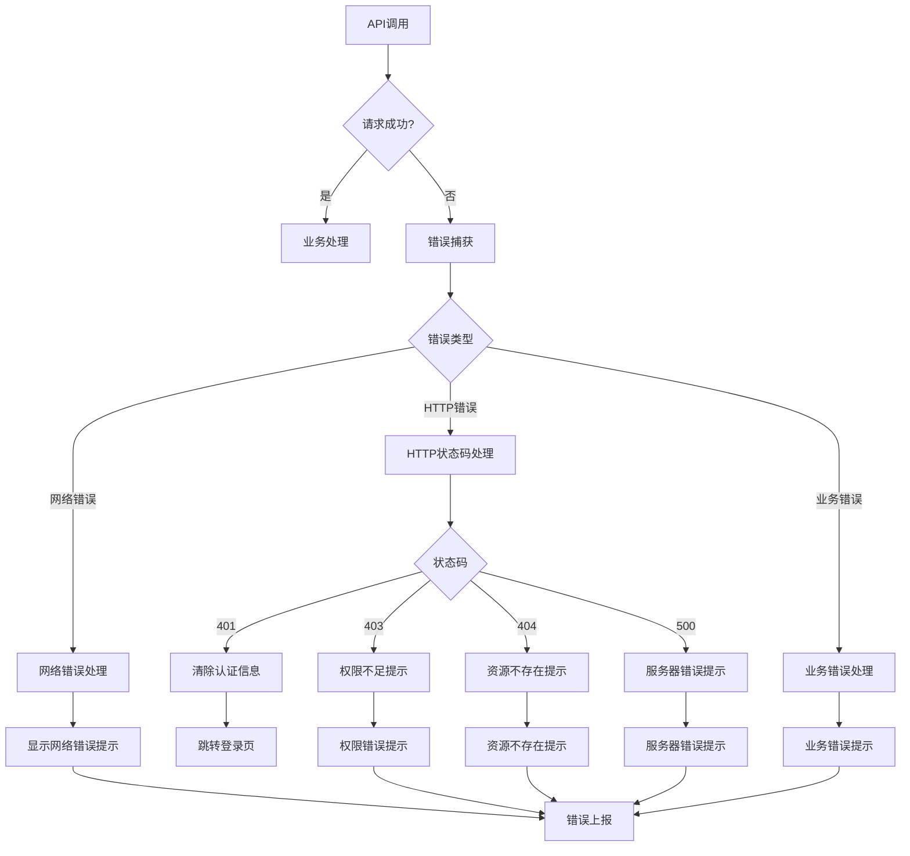

**图表来源**
- [request.js](file://frontend/src/api/request.js#L70-L141)

### 调试工具

系统提供了丰富的调试功能：

| 调试功能 | 实现位置 | 用途 |
|----------|----------|------|
| 请求日志 | 请求拦截器 | 记录请求详情 |
| 响应日志 | 响应拦截器 | 记录响应结果 |
| Token状态 | 请求拦截器 | 显示Token状态 |
| 错误追踪 | 响应拦截器 | 记录错误详情 |
| 模拟API | mockOrderApi.js | 测试环境数据 |

### 性能监控

系统内置了性能监控机制：

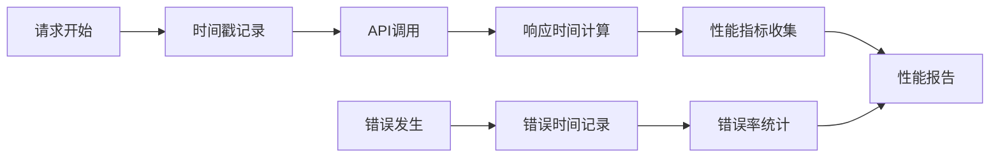

**章节来源**
- [request.js](file://frontend/src/api/request.js#L70-L141)
- [mockOrderApi.js](file://frontend/src/api/mockOrderApi.js#L1-L219)

## 性能优化

### 请求优化策略

系统采用了多种性能优化技术：

| 优化策略 | 实现方式 | 性能收益 |
|----------|----------|----------|
| 请求合并 | 批量处理API调用 | 减少网络请求次数 |
| 缓存机制 | localStorage缓存Token | 避免重复认证 |
| 超时控制 | 统一超时配置 | 防止长时间等待 |
| 错误重试 | 自动重试机制 | 提高成功率 |
| 并发控制 | 请求队列管理 | 避免并发冲突 |

### 内存管理

系统实现了智能的内存管理：

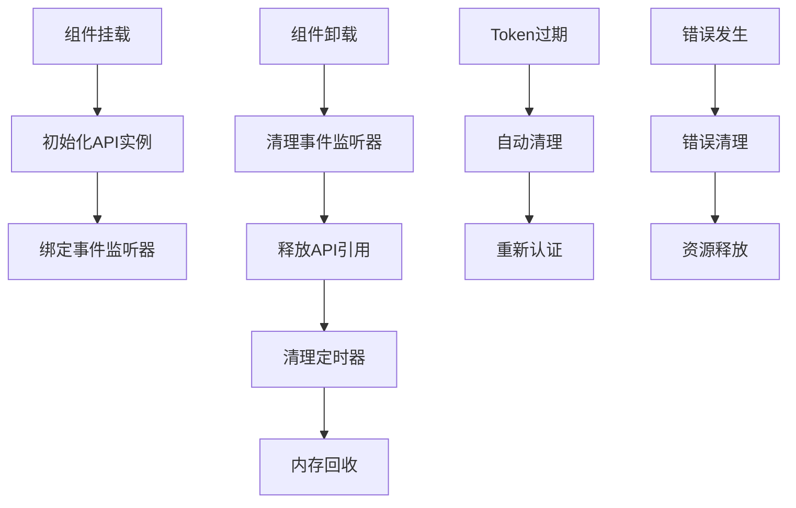

**章节来源**
- [request.js](file://frontend/src/api/request.js#L1-L143)
- [dataSync.js](file://frontend/src/utils/dataSync.js#L1-L326)

## 最佳实践

### 接口设计规范

1. **统一的错误响应格式**
   ```
   {
     "code": 200,
     "message": "操作成功",
     "data": {}
   }
   ```

2. **参数验证**
   - 必填参数明确标注
   - 参数类型严格校验
   - 默认值合理设置

3. **版本管理**
   - URL中包含版本号
   - 向后兼容性保证
   - 废弃接口明确标记

### 调用示例

以下是典型的API调用模式：

```javascript
// 支付流程调用示例
try {
  // 1. 创建支付订单
  const paymentResult = await paymentApi.createPayment({
    orderNo: 'ORDER123456',
    amount: 100.00,
    paymentMethod: 'wechat'
  });
  
  // 2. 显示支付界面
  showPaymentInterface(paymentResult);
  
  // 3. 轮询支付状态
  const status = await pollPaymentStatus(paymentResult.paymentNo);
  
} catch (error) {
  handleError(error);
}
```

### 测试策略

系统提供了完整的测试支持：

| 测试类型 | 实现方式 | 适用场景 |
|----------|----------|----------|
| 单元测试 | Jest测试框架 | 单个API方法测试 |
| 集成测试 | 模拟API调用 | 端到端流程测试 |
| 性能测试 | 性能监控工具 | 响应时间测试 |
| 安全测试 | 模拟攻击测试 | 安全漏洞检测 |

**章节来源**
- [payment.js](file://frontend/src/api/payment.js#L1-L139)
- [order.js](file://frontend/src/api/order.js#L1-L222)

## 故障排除

### 常见问题及解决方案

| 问题类型 | 症状 | 可能原因 | 解决方案 |
|----------|------|----------|----------|
| 认证失败 | 401错误 | Token过期或无效 | 清除Token重新登录 |
| 网络超时 | 请求超时 | 网络连接问题 | 检查网络连接，增加超时时间 |
| 数据不一致 | 前后端数据不符 | 状态映射错误 | 使用数据同步工具 |
| 支付失败 | 支付接口报错 | 参数格式错误 | 检查参数格式和必填项 |

### 调试技巧

1. **启用详细日志**
   ```javascript
   // 在开发环境中启用详细日志
   console.log('请求详情:', config);
   console.log('响应详情:', response);
   ```

2. **使用浏览器开发者工具**
   - Network面板查看请求详情
   - Console面板查看错误信息
   - Application面板查看存储状态

3. **模拟环境测试**
   ```javascript
   // 切换到模拟API进行测试
   orderApi.setMockMode(true);
   ```

### 监控指标

系统监控以下关键指标：

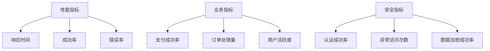

**章节来源**
- [request.js](file://frontend/src/api/request.js#L70-L141)
- [dataSync.js](file://frontend/src/utils/dataSync.js#L1-L326)

## 结论

前端API通信层通过模块化设计、统一的安全机制和完善的错误处理，为整个应用提供了稳定可靠的API通信基础。系统的可扩展性和维护性得到了很好的平衡，能够适应不断变化的业务需求。

通过合理的架构设计和最佳实践的应用，该API通信层不仅满足了当前的功能需求，还为未来的功能扩展和技术升级奠定了坚实的基础。