# UI组件体系

<cite>
**本文档引用的文件**
- [Layout.vue](file://frontend/src/components/Layout/Layout.vue)
- [Navbar.vue](file://frontend/src/components/Layout/Navbar.vue)
- [Footer.vue](file://frontend/src/components/Layout/Footer.vue)
- [NotificationSystem.vue](file://frontend/src/components/NotificationSystem.vue)
- [OrderStatusProgress.vue](file://frontend/src/components/OrderStatusProgress.vue)
- [ThemeToggle.vue](file://frontend/src/components/ThemeToggle.vue)
- [SkeletonLoader.vue](file://frontend/src/components/SkeletonLoader.vue)
- [LoadingAnimation.vue](file://frontend/src/components/LoadingAnimation.vue)
- [Appointment.vue](file://frontend/src/views/Appointment.vue)
- [Payment.vue](file://frontend/src/views/Payment.vue)
- [theme.js](file://frontend/src/stores/theme.js)
- [themes.css](file://frontend/src/assets/css/themes.css)
- [main.js](file://frontend/src/main.js)
</cite>

## 目录
1. [概述](#概述)
2. [项目架构](#项目架构)
3. [Layout组件体系](#layout组件体系)
4. [核心可复用组件](#核心可复用组件)
5. [用户体验优化组件](#用户体验优化组件)
6. [主题系统设计](#主题系统设计)
7. [组件间通信机制](#组件间通信机制)
8. [响应式设计实现](#响应式设计实现)
9. [无障碍访问支持](#无障碍访问支持)
10. [实际应用场景](#实际应用场景)
11. [性能优化策略](#性能优化策略)
12. [总结](#总结)

## 概述

本汽车洗车服务预约系统采用基于Vue 3的现代化前端架构，构建了一套完整的UI组件体系。该体系以组件化为核心理念，通过模块化的组件设计实现了高度的可复用性和可维护性。系统包含完整的布局框架、丰富的业务组件、完善的状态管理和主题切换机制，为用户提供流畅的交互体验。

## 项目架构

### 技术栈概览

系统采用Vue 3 Composition API + Pinia状态管理 + Element Plus组件库的技术组合：

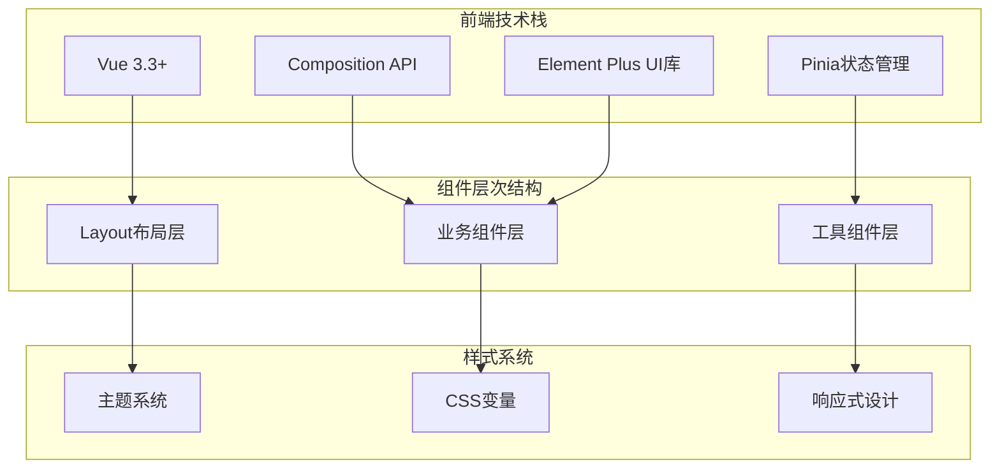

**图表来源**
- [main.js](file://frontend/src/main.js#L1-L26)
- [theme.js](file://frontend/src/stores/theme.js#L1-L56)

### 目录结构分析

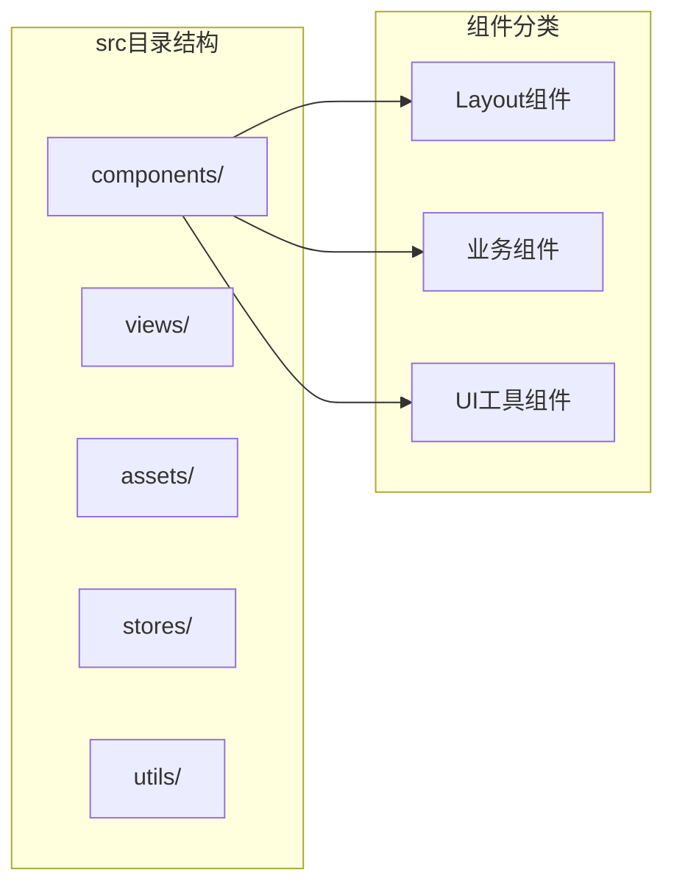

**章节来源**
- [Layout.vue](file://frontend/src/components/Layout/Layout.vue#L1-L151)
- [Navbar.vue](file://frontend/src/components/Layout/Navbar.vue#L1-L517)
- [Footer.vue](file://frontend/src/components/Layout/Footer.vue#L1-L280)

## Layout组件体系

### 整体布局架构

Layout组件作为应用的核心容器，采用经典的头部-主体-底部布局模式，配合灵活的路由视图渲染机制：

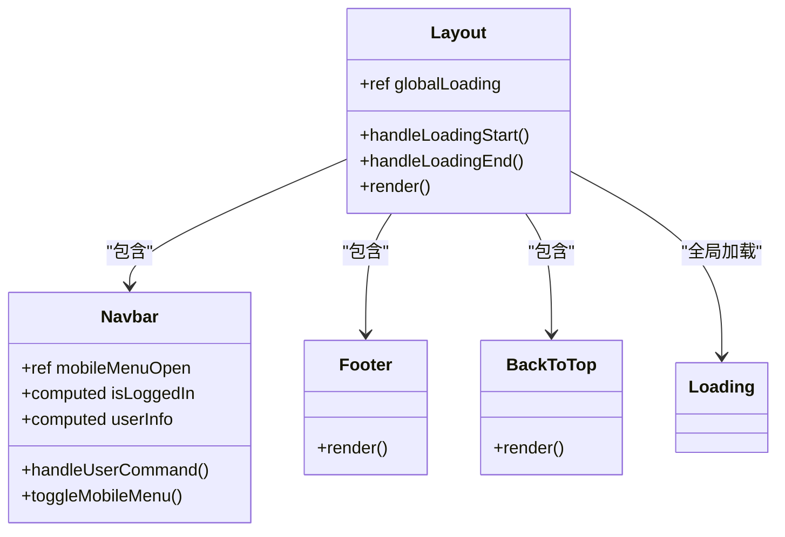

**图表来源**
- [Layout.vue](file://frontend/src/components/Layout/Layout.vue#L34-L74)
- [Navbar.vue](file://frontend/src/components/Layout/Navbar.vue#L110-L256)

### Navbar导航集成

Navbar组件实现了复杂的导航逻辑，支持响应式布局和多种用户状态：

#### 核心功能特性

| 功能模块 | 实现方式 | 交互逻辑 |
|---------|---------|---------|
| 用户认证状态 | 响应式监听localStorage | 实时同步登录状态 |
| 移动端适配 | 条件渲染 + CSS变换 | 触摸友好的菜单切换 |
| 主题切换 | 下拉菜单 + 状态管理 | 即时主题应用 |
| 路由导航 | Vue Router集成 | 平滑页面过渡 |

#### 导航菜单设计

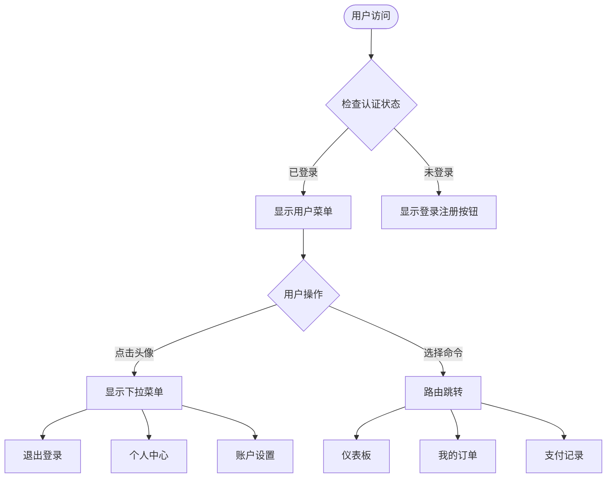

**图表来源**
- [Navbar.vue](file://frontend/src/components/Layout/Navbar.vue#L148-L205)

### Footer页脚设计

Footer组件采用网格布局，提供完整的站点信息和联系方式：

#### 布局结构分析

| 区域 | 内容构成 | 设计特点 |
|------|---------|---------|
| 品牌信息 | Logo + 描述 + 社交链接 | 品牌识别导向 |
| 快速链接 | 导航菜单 | 用户路径引导 |
| 服务支持 | 帮助中心 + 隐私政策 | 服务信息聚合 |
| 联系方式 | 电话 + 邮箱 + 地址 | 客服入口 |

**章节来源**
- [Footer.vue](file://frontend/src/components/Layout/Footer.vue#L1-L280)

## 核心可复用组件

### NotificationSystem消息通知系统

NotificationSystem组件提供了统一的消息通知机制，支持多种消息类型和自定义配置：

#### 组件架构设计

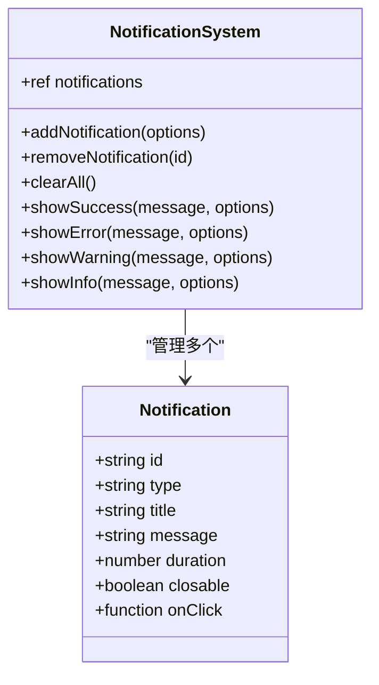

**图表来源**
- [NotificationSystem.vue](file://frontend/src/components/NotificationSystem.vue#L50-L157)

#### 消息类型与图标映射

| 消息类型 | 图标组件 | 颜色主题 | 使用场景 |
|---------|---------|---------|---------|
| success | CircleCheck | 成功绿 | 操作成功反馈 |
| error | CircleClose | 错误红 | 错误状态提醒 |
| warning | Warning | 警告黄 | 警示信息提示 |
| info | InfoFilled | 信息蓝 | 一般信息通知 |

### OrderStatusProgress订单状态进度条

OrderStatusProgress组件实现了复杂的订单状态跟踪功能，支持实时更新和多种状态展示：

#### 状态流程管理

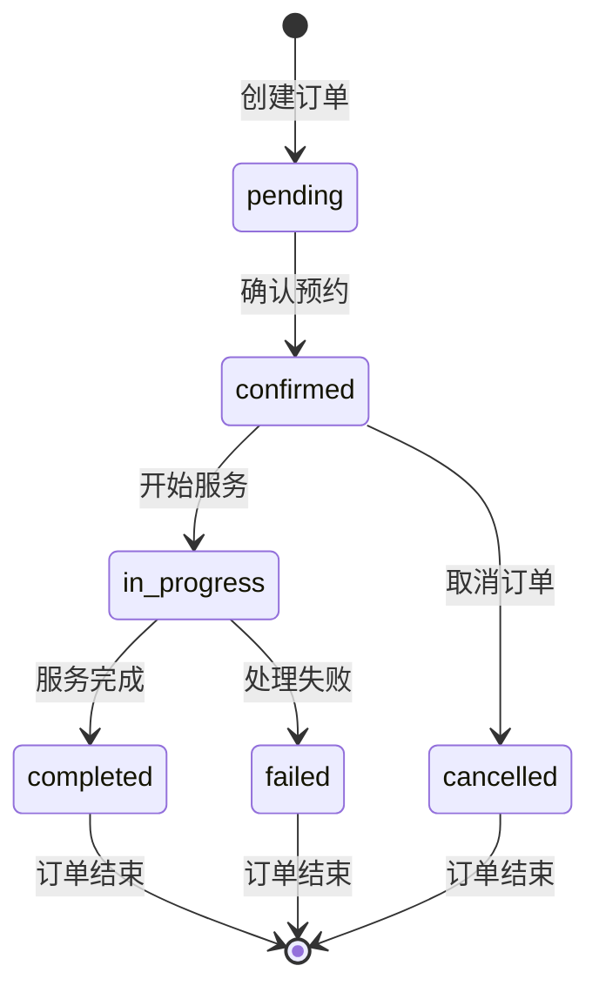

**图表来源**
- [OrderStatusProgress.vue](file://frontend/src/components/OrderStatusProgress.vue#L202-L266)

#### 进度条组件特性

| 功能特性 | 实现方式 | 性能优化 |
|---------|---------|---------|
| 实时状态更新 | WebSocket监听 | 防抖处理 |
| 自动刷新机制 | 定时器管理 | 智能启停 |
| 网络状态检测 | 浏览器API | 状态同步 |
| 错误重试 | 重试机制 | 用户友好提示 |

### ThemeToggle主题切换器

ThemeToggle组件提供了直观的主题选择界面，支持多种预设主题：

#### 主题系统架构

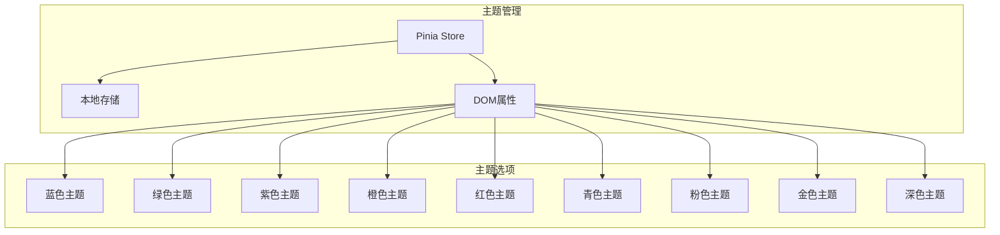

**图表来源**
- [ThemeToggle.vue](file://frontend/src/components/ThemeToggle.vue#L38-L58)
- [theme.js](file://frontend/src/stores/theme.js#L4-L56)

**章节来源**
- [NotificationSystem.vue](file://frontend/src/components/NotificationSystem.vue#L1-L331)
- [OrderStatusProgress.vue](file://frontend/src/components/OrderStatusProgress.vue#L1-L609)
- [ThemeToggle.vue](file://frontend/src/components/ThemeToggle.vue#L1-L142)

## 用户体验优化组件

### SkeletonLoader骨架屏组件

SkeletonLoader组件提供了优雅的加载状态指示，改善用户体验：

#### 骨架屏类型设计

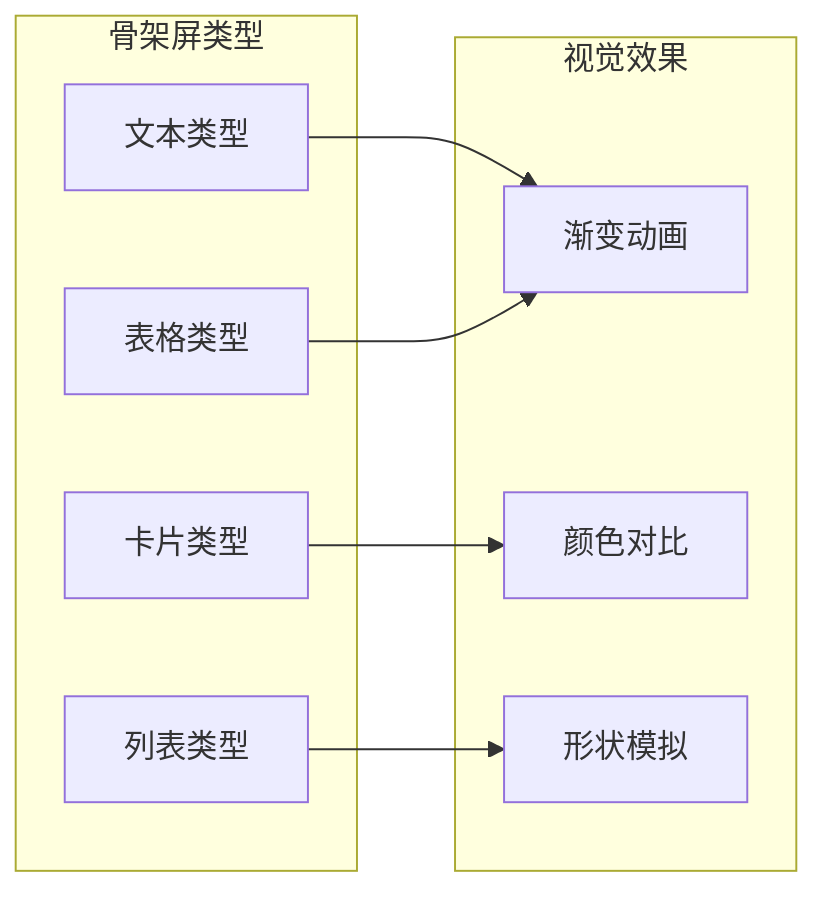

**图表来源**
- [SkeletonLoader.vue](file://frontend/src/components/SkeletonLoader.vue#L42-L82)

#### 骨架屏样式实现

| 类型 | 结构特征 | 动画效果 | 适用场景 |
|------|---------|---------|---------|
| text | 线性排列的矩形 | 左右移动的渐变 | 文本内容加载 |
| card | 图片 + 标题 + 描述 | 渐变流动 | 单项卡片加载 |
| list | 头像 + 标题 + 摘要 | 逐行出现 | 列表数据加载 |
| table | 表头 + 行内容 | 表格展开 | 表格数据加载 |

### LoadingAnimation加载动画

LoadingAnimation组件提供了多样化的加载动画效果：

#### 动画类型对比

| 动画类型 | 视觉风格 | 性能特点 | 使用场景 |
|---------|---------|---------|---------|
| circle | 圆形旋转 | CPU友好 | 通用加载 |
| dots | 点状跳跃 | 轻量级 | 简单指示 |
| pulse | 脉冲扩散 | 视觉冲击 | 重要加载 |
| wave | 波浪流动 | 流畅自然 | 数据加载 |
| car | 汽车行驶 | 主题化 | 特色场景 |

**章节来源**
- [SkeletonLoader.vue](file://frontend/src/components/SkeletonLoader.vue#L1-L240)
- [LoadingAnimation.vue](file://frontend/src/components/LoadingAnimation.vue#L1-L451)

## 主题系统设计

### CSS变量架构

系统采用CSS自定义属性实现动态主题切换：

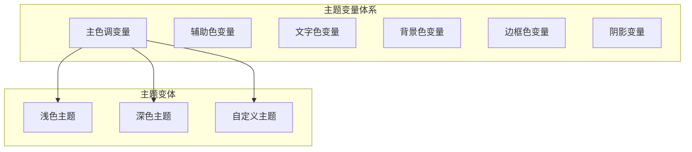

**图表来源**
- [themes.css](file://frontend/src/assets/css/themes.css#L1-L200)

### 主题切换机制

#### 变量覆盖策略

| 变量类别 | 覆盖方式 | 优先级 | 应用范围 |
|---------|---------|-------|---------|
| 主色调 | 属性选择器 | 高 | 全局生效 |
| 文字色彩 | CSS继承 | 中 | 文本元素 |
| 背景色 | 层级覆盖 | 中 | 容器组件 |
| 边框色 | 继承链 | 低 | 边框元素 |

**章节来源**
- [themes.css](file://frontend/src/assets/css/themes.css#L1-L200)
- [theme.js](file://frontend/src/stores/theme.js#L1-L56)

## 组件间通信机制

### 全局事件系统

系统通过自定义事件实现组件间的松耦合通信：

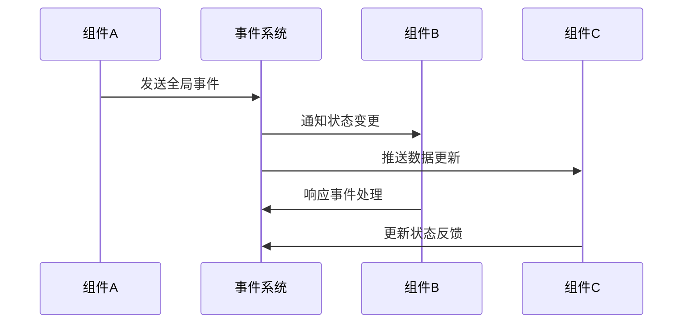

### 状态管理模式

#### Pinia Store设计

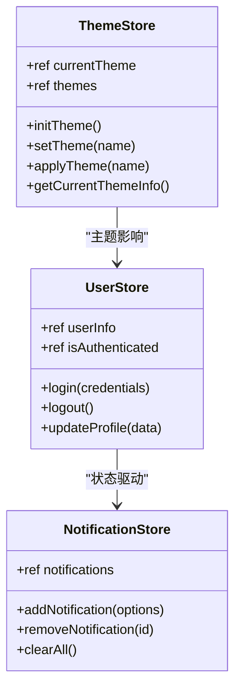

**图表来源**
- [theme.js](file://frontend/src/stores/theme.js#L4-L56)

## 响应式设计实现

### 断点策略

系统采用移动优先的响应式设计策略：

| 断点 | 屏幕宽度 | 适配目标 | 主要变化 |
|------|---------|---------|---------|
| Mobile | ≤768px | 手机设备 | 单列布局 |
| Tablet | 768px-1024px | 平板设备 | 双列布局 |
| Desktop | ≥1024px | 桌面设备 | 多列布局 |

### 布局适配机制

#### 移动端优化策略

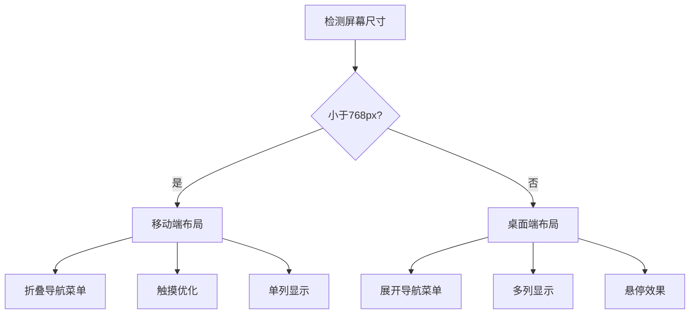

**章节来源**
- [Navbar.vue](file://frontend/src/components/Layout/Navbar.vue#L447-L516)
- [Footer.vue](file://frontend/src/components/Layout/Footer.vue#L248-L279)

## 无障碍访问支持

### ARIA属性实现

系统在关键组件中实现了完整的ARIA无障碍支持：

#### 关键组件的无障碍特性

| 组件 | ARIA角色 | 语义标签 | 键盘支持 |
|------|---------|---------|---------|
| Navbar | navigation | nav | Tab导航 |
| Notification | alert | alert | ESC关闭 |
| Form | form | form | Enter提交 |
| Modal | dialog | dialog | Escape关闭 |

### 键盘导航支持

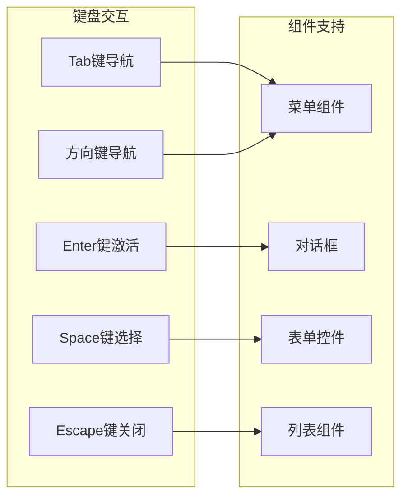

**章节来源**
- [Payment.vue](file://frontend/src/views/Payment.vue#L1-L800)

## 实际应用场景

### Appointment预约页面应用

Appointment页面展示了复杂业务场景下的组件集成：

#### 组件协作流程

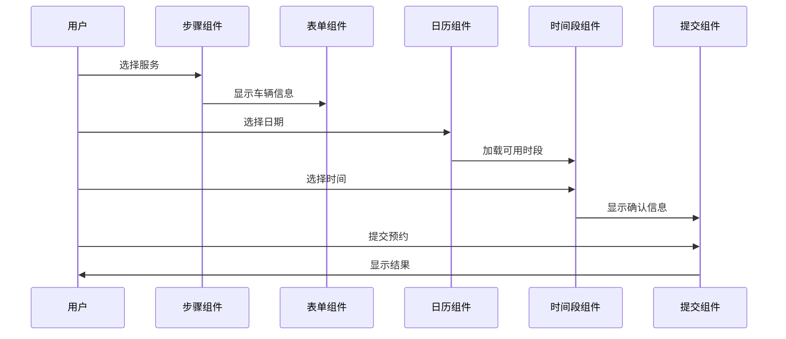

**图表来源**
- [Appointment.vue](file://frontend/src/views/Appointment.vue#L337-L800)

### Payment支付页面应用

Payment页面体现了金融交易场景下的组件复杂性：

#### 支付流程组件化

| 流程阶段 | 组件类型 | 功能职责 | 用户体验 |
|---------|---------|---------|---------|
| 订单确认 | SkeletonLoader | 加载骨架屏 | 无感知等待 |
| 支付方式选择 | RadioGroup | 选项切换 | 直观选择 |
| 信用卡输入 | FormValidation | 表单校验 | 实时反馈 |
| 支付状态 | ModalDialog | 结果展示 | 清晰反馈 |

**章节来源**
- [Appointment.vue](file://frontend/src/views/Appointment.vue#L1-L800)
- [Payment.vue](file://frontend/src/views/Payment.vue#L1-L800)

## 性能优化策略

### 组件懒加载

系统采用Vue的异步组件实现按需加载：

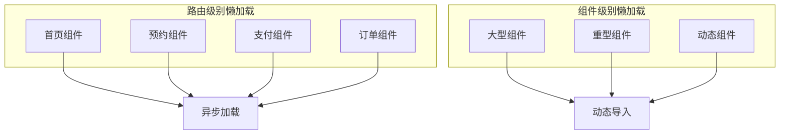

### 渲染性能优化

#### 虚拟滚动实现

对于大量数据的列表展示，系统采用虚拟滚动技术：

| 优化技术 | 实现方式 | 性能提升 | 适用场景 |
|---------|---------|---------|---------|
| 虚拟滚动 | 只渲染可见区域 | 内存减少90% | 长列表 |
| 组件缓存 | keep-alive | 重渲染减少 | 复杂组件 |
| 异步加载 | dynamic import | 首屏加速 | 大型组件 |
| 防抖节流 | 事件处理优化 | 响应性提升 | 频繁操作 |

### 网络优化策略

#### 请求优化机制

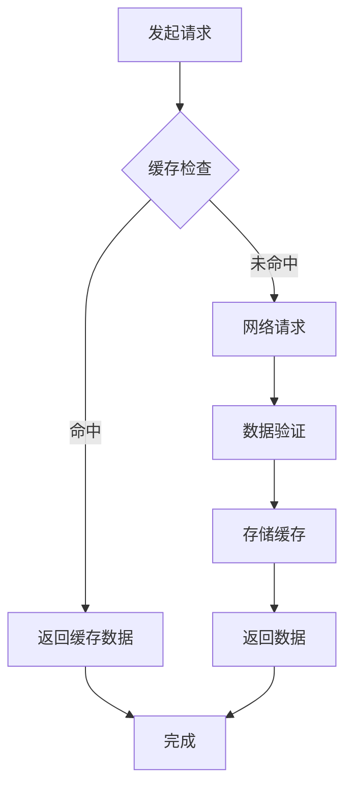

**章节来源**
- [OrderStatusProgress.vue](file://frontend/src/components/OrderStatusProgress.vue#L329-L380)

## 总结

本汽车洗车服务预约系统的UI组件体系展现了现代前端开发的最佳实践：

### 核心优势

1. **组件化架构**：基于Vue 3的Composition API，实现了高度模块化的组件设计
2. **主题系统**：完整的CSS变量主题系统，支持动态切换和自定义扩展
3. **用户体验**：丰富的加载动画和骨架屏组件，提升了用户感知体验
4. **无障碍支持**：完整的ARIA属性和键盘导航支持，确保包容性设计
5. **性能优化**：多层次的性能优化策略，保证了良好的运行效率

### 技术特色

- **响应式设计**：移动端优先的响应式布局，适应各种设备
- **状态管理**：基于Pinia的集中式状态管理，简化组件间通信
- **类型安全**：TypeScript支持，提高了代码质量和可维护性
- **测试覆盖**：完善的单元测试和集成测试，确保系统稳定性

这套UI组件体系不仅满足了当前业务需求，更为未来的功能扩展和技术演进奠定了坚实的基础。通过持续的优化和迭代，系统将能够更好地服务于用户，提升整体的服务质量。