# 前端架构设计文档

<cite>
**本文档引用的文件**
- [main.js](file://frontend/src/main.js)
- [vite.config.js](file://frontend/vite.config.js)
- [router/index.js](file://frontend/src/router/index.js)
- [stores/user.js](file://frontend/src/stores/user.js)
- [stores/theme.js](file://frontend/src/stores/theme.js)
- [views/Appointment.vue](file://frontend/src/views/Appointment.vue)
- [views/Payment.vue](file://frontend/src/views/Payment.vue)
- [api/request.js](file://frontend/src/api/request.js)
- [utils/auth.js](file://frontend/src/utils/auth.js)
- [components/Layout/Layout.vue](file://frontend/src/components/Layout/Layout.vue)
- [components/NotificationSystem.vue](file://frontend/src/components/NotificationSystem.vue)
- [components/OrderStatusProgress.vue](file://frontend/src/components/OrderStatusProgress.vue)
- [api/auth.js](file://frontend/src/api/auth.js)
- [api/payment.js](file://frontend/src/api/payment.js)
</cite>

## 目录
1. [项目概述](#项目概述)
2. [技术栈架构](#技术栈架构)
3. [Vue.js 3 Composition API 应用](#vuejs-3-composition-api-应用)
4. [Pinia 状态管理](#pinia-状态管理)
5. [Element Plus 组件库集成](#element-plus-组件库集成)
6. [Vite 构建工具配置](#vite-构建工具配置)
7. [前端路由与权限控制](#前端路由与权限控制)
8. [组件化开发模式](#组件化开发模式)
9. [API 请求层设计](#api-请求层设计)
10. [总结](#总结)

## 项目概述

本汽车洗车服务预约系统采用现代化的前端技术栈，构建了一个功能完善的SPA（单页面应用程序）。系统支持用户预约、支付、订单管理等功能，具备完整的权限控制和实时状态更新能力。

## 技术栈架构

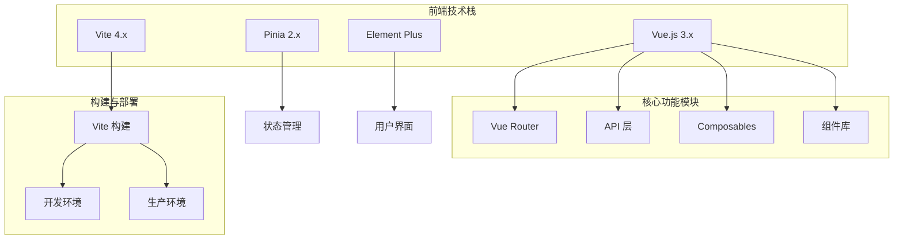

**图表来源**
- [main.js](file://frontend/src/main.js#L1-L26)
- [vite.config.js](file://frontend/vite.config.js#L1-L46)

## Vue.js 3 Composition API 应用

### Appointment.vue 中的 Composition API 实践

Appointment.vue 是系统中最复杂的组件之一，展示了 Vue 3 Composition API 的最佳实践：

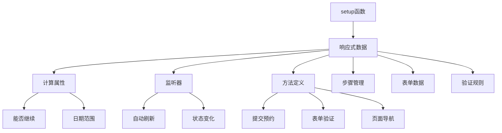

**图表来源**
- [views/Appointment.vue](file://frontend/src/views/Appointment.vue#L347-L800)

#### 核心特性分析

1. **多步骤表单管理**：使用 `currentStep` 状态管理复杂的多步骤表单流程
2. **实时数据验证**：通过 `computed` 属性动态计算表单验证状态
3. **异步数据加载**：集成时间槽API和用户认证系统
4. **状态持久化**：利用 Pinia store 和本地存储保持用户状态

**章节来源**
- [views/Appointment.vue](file://frontend/src/views/Appointment.vue#L347-L800)

### Payment.vue 中的状态管理

Payment.vue 展示了支付流程的复杂状态管理：

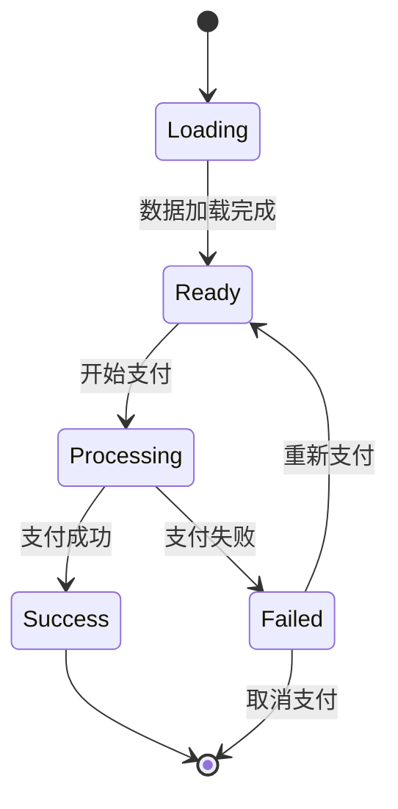

**图表来源**
- [views/Payment.vue](file://frontend/src/views/Payment.vue#L353-L800)

**章节来源**
- [views/Payment.vue](file://frontend/src/views/Payment.vue#L353-L800)

## Pinia 状态管理

### 用户认证状态管理（user.js）

Pinia store 提供了集中化的状态管理：

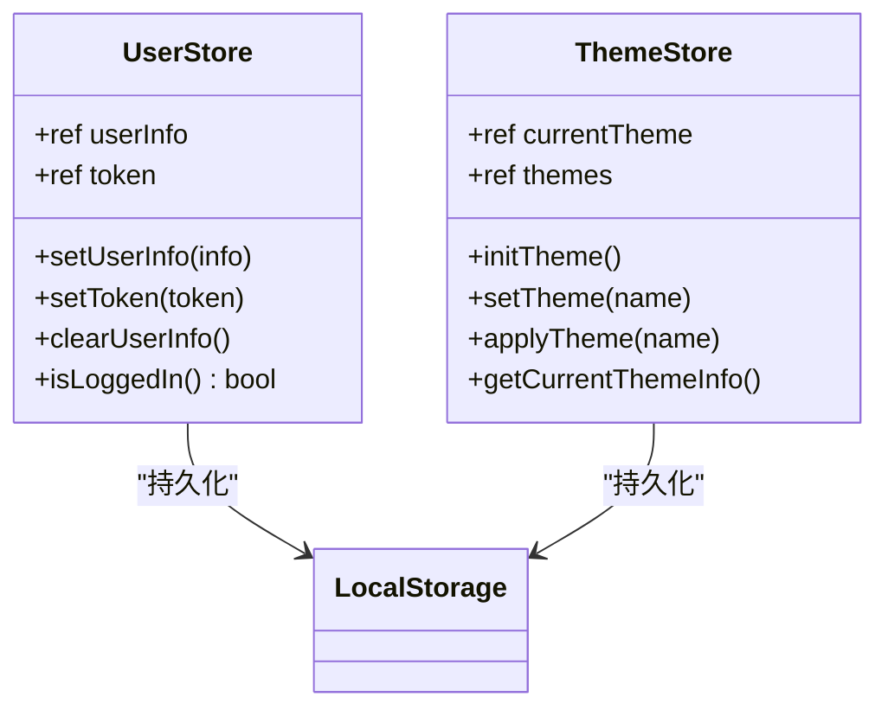

**图表来源**
- [stores/user.js](file://frontend/src/stores/user.js#L1-L40)
- [stores/theme.js](file://frontend/src/stores/theme.js#L1-L56)

#### 用户状态管理特性

1. **自动持久化**：Token 和用户信息自动保存到 localStorage
2. **状态验证**：提供 `isLoggedIn()` 方法进行状态检查
3. **安全清理**：`clearUserInfo()` 方法确保敏感信息被清除

#### 主题管理机制

1. **主题配置**：支持多种预设主题（蓝色、绿色、紫色等）
2. **动态切换**：运行时切换主题并应用到 DOM
3. **持久化存储**：用户选择的主题会保存到 localStorage

**章节来源**
- [stores/user.js](file://frontend/src/stores/user.js#L1-L40)
- [stores/theme.js](file://frontend/src/stores/theme.js#L1-L56)

## Element Plus 组件库集成

### 国际化配置

系统集成了 Element Plus 组件库，并配置了中文国际化：

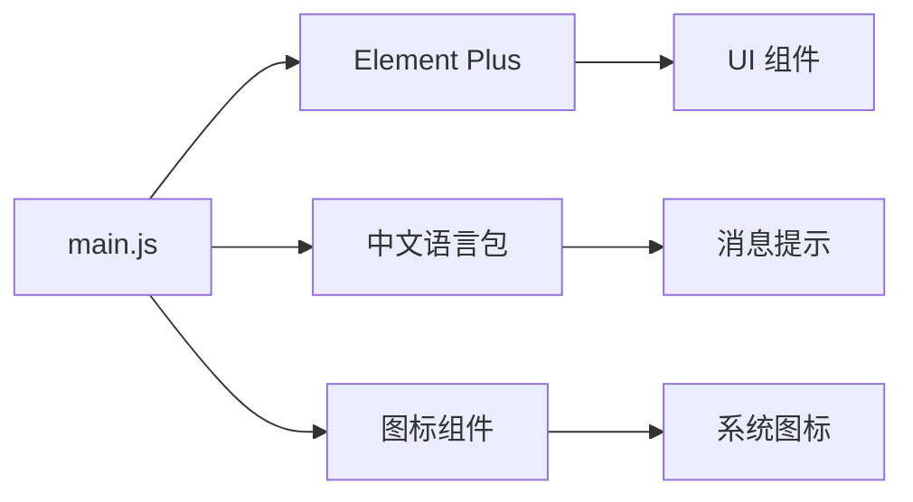

**图表来源**
- [main.js](file://frontend/src/main.js#L1-L26)

#### 集成特性

1. **完整组件库**：包含所有 Element Plus 组件
2. **图标系统**：自动注册所有 Element Plus 图标
3. **国际化支持**：完整的中文语言包配置
4. **样式统一**：全局 CSS 变量和主题定制

**章节来源**
- [main.js](file://frontend/src/main.js#L1-L26)

## Vite 构建工具配置

### 开发环境优化

Vite 配置提供了高效的开发体验：

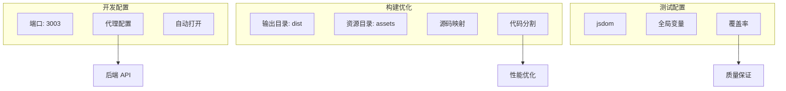

**图表来源**
- [vite.config.js](file://frontend/vite.config.js#L1-L46)

#### 关键配置特性

1. **开发服务器**：端口 3003，自动代理后端 API
2. **路径别名**：`@` 指向 `src` 目录，简化导入路径
3. **构建优化**：代码分割和资源优化
4. **测试支持**：完整的单元测试配置

**章节来源**
- [vite.config.js](file://frontend/vite.config.js#L1-L46)

## 前端路由与权限控制

### 路由权限系统

系统实现了完整的权限控制机制：

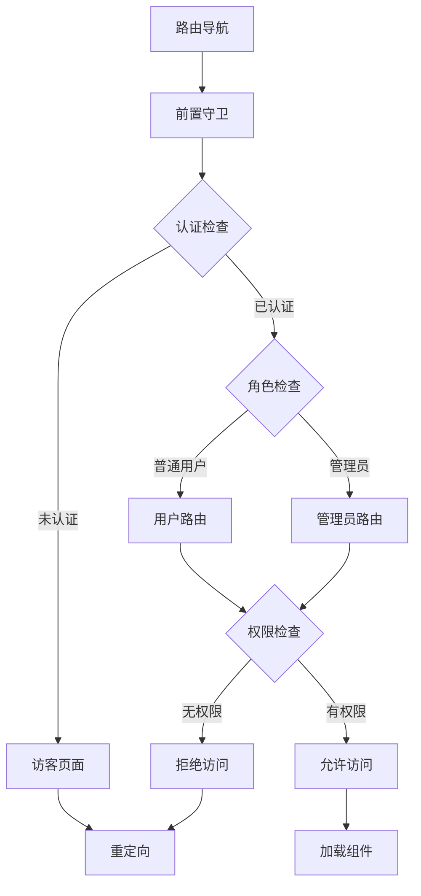

**图表来源**
- [router/index.js](file://frontend/src/router/index.js#L207-L361)

#### 权限控制特性

1. **多层级权限**：支持访客、普通用户、管理员三级权限
2. **动态路由**：根据用户权限动态显示/隐藏路由
3. **细粒度控制**：支持具体功能权限检查
4. **自动重定向**：权限不足时自动重定向到合适页面

#### 路由元信息

每个路由都包含丰富的元信息：
- `requiresAuth`: 是否需要认证
- `requiresAdmin`: 是否需要管理员权限
- `hideForAuth`: 已认证用户是否隐藏
- `guestOnly`: 是否仅访客可见

**章节来源**
- [router/index.js](file://frontend/src/router/index.js#L207-L361)

## 组件化开发模式

### Layout 组件设计

Layout 组件作为应用的基础布局容器：

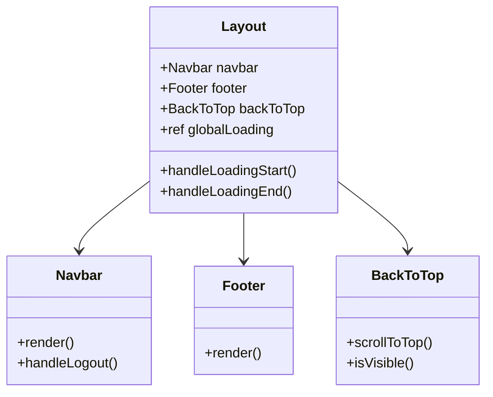

**图表来源**
- [components/Layout/Layout.vue](file://frontend/src/components/Layout/Layout.vue#L1-L151)

#### 设计理念

1. **模块化设计**：每个子组件独立负责特定功能
2. **状态提升**：全局加载状态在 Layout 中统一管理
3. **动画效果**：页面切换时的平滑过渡动画
4. **响应式布局**：适应不同屏幕尺寸的布局

**章节来源**
- [components/Layout/Layout.vue](file://frontend/src/components/Layout/Layout.vue#L1-L151)

### NotificationSystem 组件

全局通知系统提供了统一的消息管理：

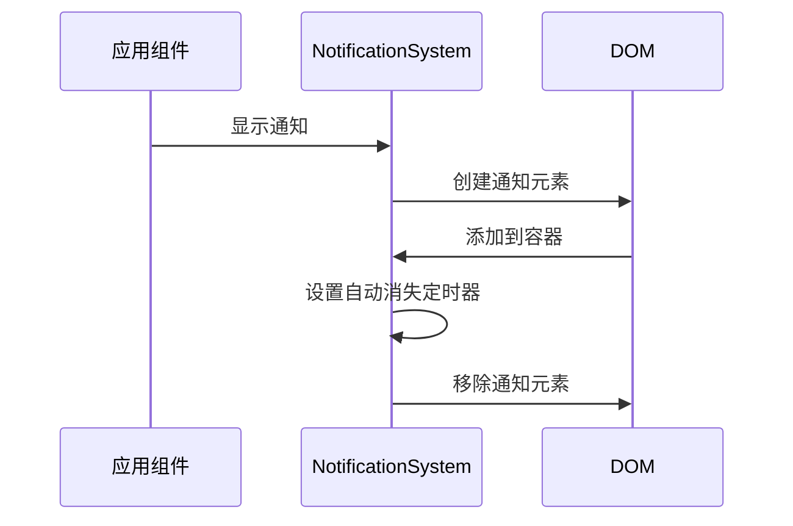

**图表来源**
- [components/NotificationSystem.vue](file://frontend/src/components/NotificationSystem.vue#L1-L331)

#### 核心功能

1. **多种通知类型**：支持成功、错误、警告、信息四种类型
2. **自动消失**：可配置的显示时长
3. **手动关闭**：可点击关闭的通知
4. **全局访问**：通过 `window.$notify` 全局调用

**章节来源**
- [components/NotificationSystem.vue](file://frontend/src/components/NotificationSystem.vue#L1-L331)

### OrderStatusProgress 组件

订单状态跟踪组件：

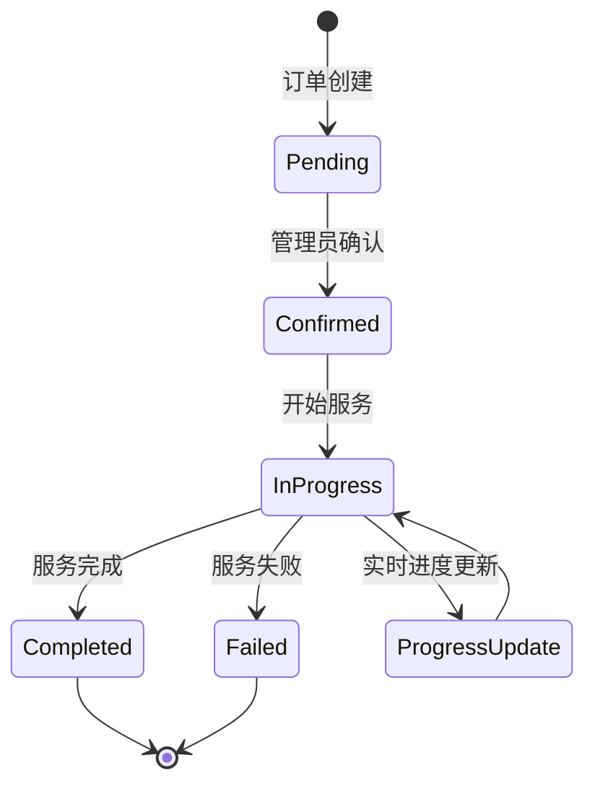

**图表来源**
- [components/OrderStatusProgress.vue](file://frontend/src/components/OrderStatusProgress.vue#L1-L609)

#### 实时更新机制

1. **WebSocket 集成**：实时接收订单状态更新
2. **自动刷新**：处理中状态的定期刷新
3. **离线支持**：网络断开时的离线模式
4. **状态可视化**：清晰的状态进度条展示

**章节来源**
- [components/OrderStatusProgress.vue](file://frontend/src/components/OrderStatusProgress.vue#L1-L609)

## API 请求层设计

### 请求拦截器机制

API 请求层提供了完整的请求/响应拦截机制：

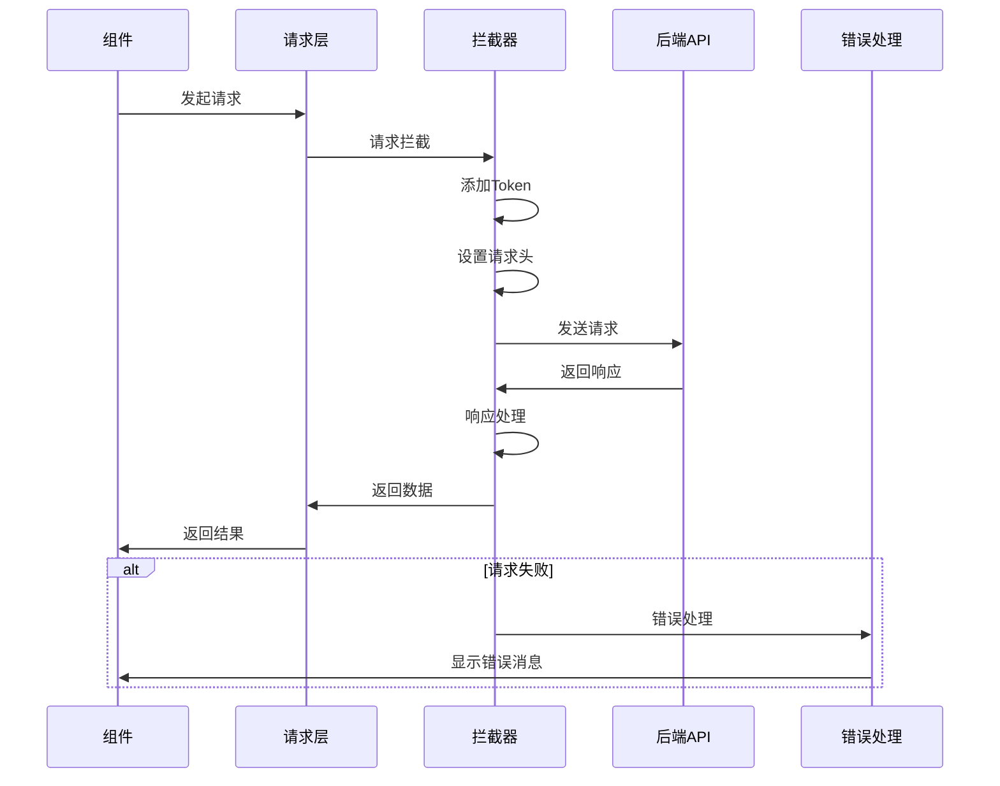

**图表来源**
- [api/request.js](file://frontend/src/api/request.js#L1-L143)

#### 拦截器功能

1. **自动认证**：为需要认证的请求自动添加 JWT Token
2. **错误处理**：统一的错误消息显示和处理
3. **状态管理**：401 错误时的自动登出处理
4. **调试支持**：详细的请求/响应日志

**章节来源**
- [api/request.js](file://frontend/src/api/request.js#L1-L143)

### API 模块化设计

系统采用模块化的 API 设计：

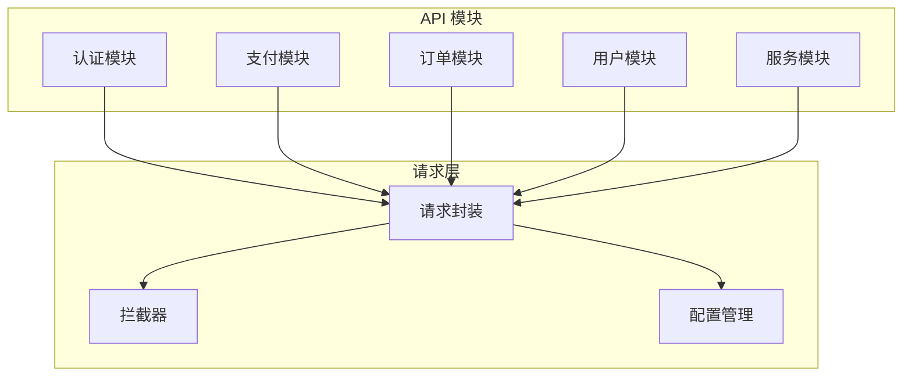

**图表来源**
- [api/auth.js](file://frontend/src/api/auth.js#L1-L63)
- [api/payment.js](file://frontend/src/api/payment.js#L1-L139)

#### 模块特点

1. **职责分离**：每个模块专注于特定业务领域
2. **统一接口**：所有 API 都通过相同的请求层处理
3. **错误统一**：模块内部的错误会被统一处理
4. **易于维护**：模块化结构便于功能扩展和维护

**章节来源**
- [api/auth.js](file://frontend/src/api/auth.js#L1-L63)
- [api/payment.js](file://frontend/src/api/payment.js#L1-L139)

## 总结

本汽车洗车服务预约系统的前端架构展现了现代 Web 应用的最佳实践：

### 技术优势

1. **现代化技术栈**：Vue 3 + Vite + Pinia + Element Plus 的组合提供了优秀的开发体验
2. **组件化设计**：高度模块化的组件体系，便于维护和复用
3. **状态管理**：Pinia 提供了简洁而强大的状态管理方案
4. **权限控制**：完整的路由级和功能级权限控制系统
5. **用户体验**：丰富的交互效果和实时状态更新

### 架构特色

1. **响应式设计**：完全响应式的界面设计
2. **实时通信**：WebSocket 实现实时订单状态更新
3. **错误处理**：完善的错误处理和用户反馈机制
4. **性能优化**：代码分割和懒加载优化应用性能

这套架构不仅满足了当前的功能需求，还为未来的功能扩展和性能优化奠定了坚实的基础。