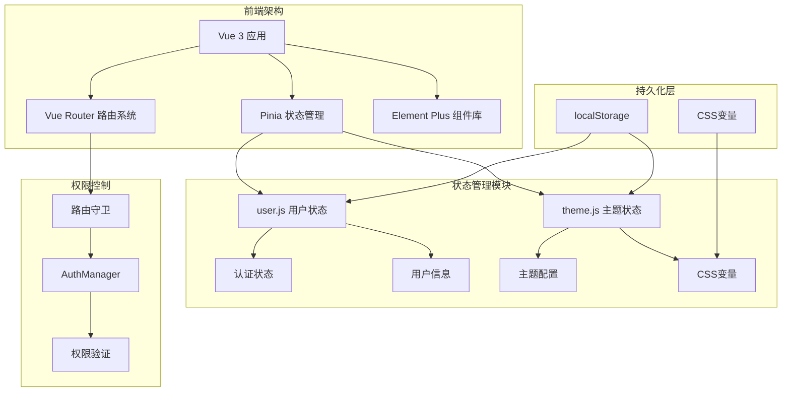
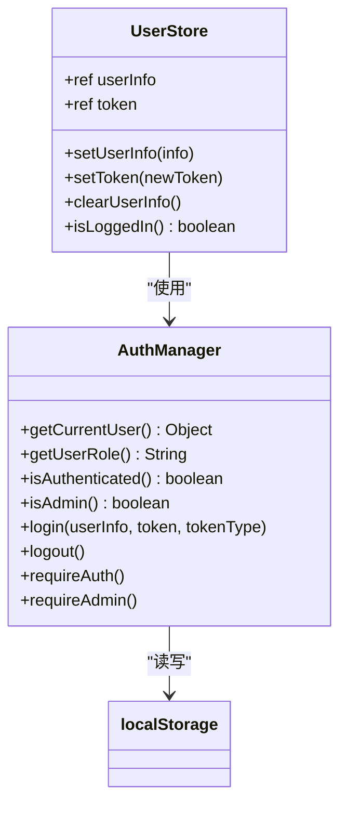
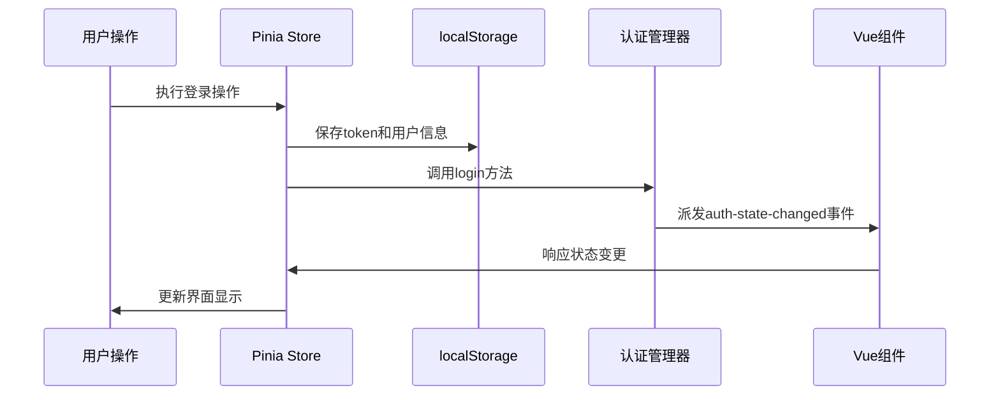
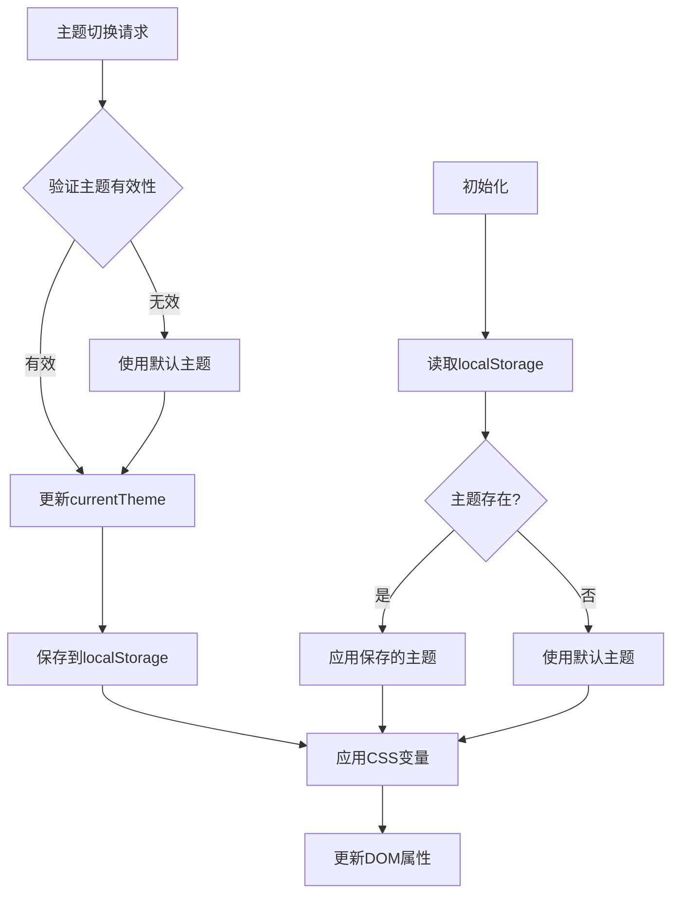
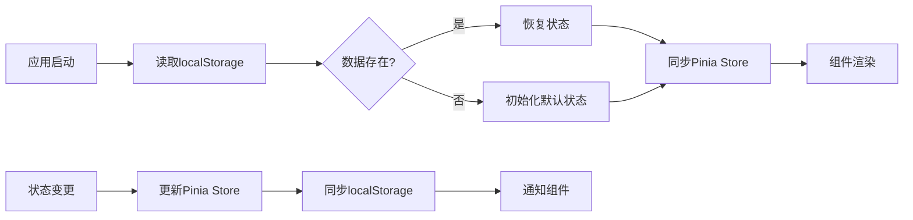
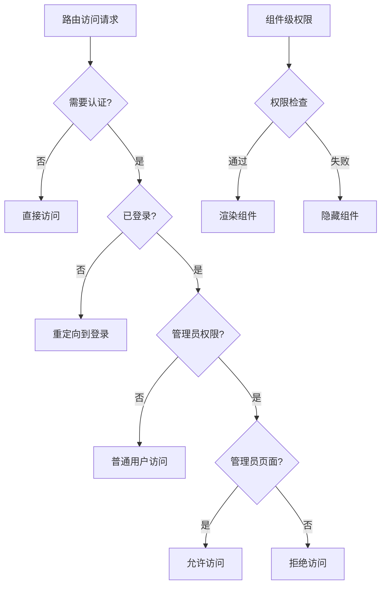
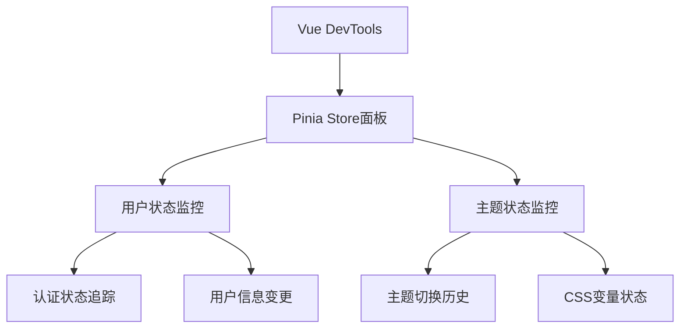
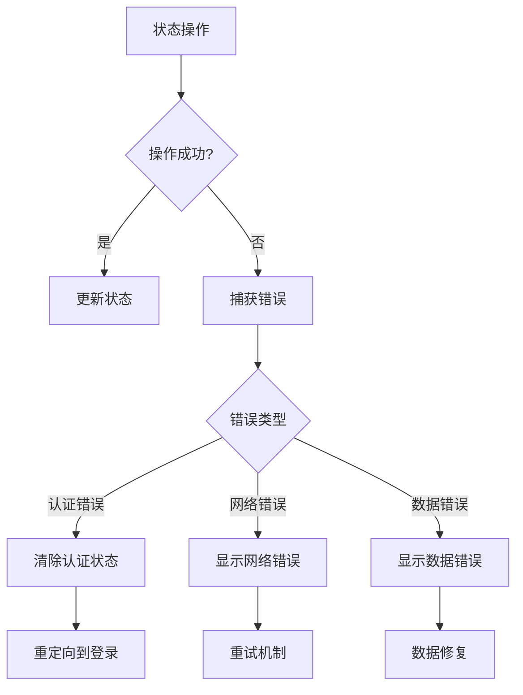

# 状态管理机制

<cite>
**本文档引用的文件**
- [user.js](file://frontend/src/stores/user.js)
- [theme.js](file://frontend/src/stores/theme.js)
- [auth.js](file://frontend/src/utils/auth.js)
- [main.js](file://frontend/src/main.js)
- [Login.vue](file://frontend/src/views/Login.vue)
- [Profile.vue](file://frontend/src/views/Profile.vue)
- [router/index.js](file://frontend/src/router/index.js)
- [themes.css](file://frontend/src/assets/css/themes.css)
</cite>

## 目录
1. [简介](#简介)
2. [项目架构概览](#项目架构概览)
3. [用户状态管理](#用户状态管理)
4. [主题状态管理](#主题状态管理)
5. [状态持久化机制](#状态持久化机制)
6. [权限控制系统](#权限控制系统)
7. [状态调试与监控](#状态调试与监控)
8. [最佳实践与优化](#最佳实践与优化)
9. [总结](#总结)

## 简介

本项目采用Pinia作为状态管理核心，实现了完整的用户认证状态管理和主题切换功能。通过响应式状态管理，提供了统一的认证状态维护、主题切换响应式设计、以及完善的权限控制机制。

## 项目架构概览



**图表来源**
- [main.js](file://frontend/src/main.js#L1-L26)
- [user.js](file://frontend/src/stores/user.js#L1-L40)
- [theme.js](file://frontend/src/stores/theme.js#L1-L56)

## 用户状态管理

### 核心状态结构

用户状态管理通过Pinia Store实现，包含以下核心状态：



**图表来源**
- [user.js](file://frontend/src/stores/user.js#L4-L39)
- [auth.js](file://frontend/src/utils/auth.js#L7-L214)

### 认证状态管理逻辑

#### 登录流程

登录过程涉及多个层面的状态同步：

1. **前端状态更新**：通过Pinia Store更新用户信息和token
2. **本地存储持久化**：将认证信息保存到localStorage
3. **事件通知**：派发认证状态变更事件

#### 登出流程

登出操作确保状态的一致性：

1. 清除Pinia Store中的用户状态
2. 从localStorage移除认证信息
3. 派发登出事件通知组件更新

#### Token管理

系统实现了完整的Token生命周期管理：

- **Token存储**：自动保存到localStorage
- **Token验证**：提供状态检查方法
- **自动清理**：登出时自动清除

**章节来源**
- [user.js](file://frontend/src/stores/user.js#L1-L40)
- [auth.js](file://frontend/src/utils/auth.js#L86-L144)

### 状态同步机制



**图表来源**
- [auth.js](file://frontend/src/utils/auth.js#L100-L112)
- [user.js](file://frontend/src/stores/user.js#L14-L17)

## 主题状态管理

### 主题系统架构

主题状态管理提供了完整的响应式主题切换机制：



**图表来源**
- [theme.js](file://frontend/src/stores/theme.js#L20-L41)
- [themes.css](file://frontend/src/assets/css/themes.css#L1-L200)

### 主题配置系统

系统支持多种预设主题，每种主题包含完整的CSS变量定义：

| 主题名称 | 颜色代码 | 主要用途 |
|---------|---------|---------|
| blue | #1890ff | 经典蓝，系统默认 |
| green | #52c41a | 自然绿，环保主题 |
| purple | #722ed1 | 优雅紫，高端定制 |
| orange | #fa8c16 | 活力橙，年轻风格 |
| red | #f5222d | 热情红，警示主题 |
| cyan | #13c2c2 | 清新青，科技感 |
| pink | #eb2f96 | 温馨粉，女性友好 |
| gold | #faad14 | 尊贵金，奢华体验 |

### CSS变量联动方案

主题切换通过CSS自定义属性实现动态样式更新：

```css
[data-theme="blue"] {
  --primary-color: #3B82F6;
  --primary-dark: #2563EB;
  --primary-light: #DBEAFE;
  --primary-gradient: linear-gradient(135deg, #3B82F6 0%, #2563EB 100%);
}
```

**章节来源**
- [theme.js](file://frontend/src/stores/theme.js#L1-L56)
- [themes.css](file://frontend/src/assets/css/themes.css#L51-L132)

## 状态持久化机制

### localStorage集成

系统通过多层次的持久化策略确保状态的可靠性：



**图表来源**
- [user.js](file://frontend/src/stores/user.js#L6)
- [theme.js](file://frontend/src/stores/theme.js#L22-L25)

### 状态重置策略

系统提供了完整的状态重置机制：

1. **用户信息重置**：清除用户详细信息
2. **认证状态重置**：清除token和认证信息
3. **主题状态重置**：恢复默认主题设置

**章节来源**
- [user.js](file://frontend/src/stores/user.js#L20-L24)
- [theme.js](file://frontend/src/stores/theme.js#L21-L27)

## 权限控制系统

### 权限验证层次

系统实现了多层级的权限控制：



**图表来源**
- [router/index.js](file://frontend/src/router/index.js#L208-L336)
- [auth.js](file://frontend/src/utils/auth.js#L40-L72)

### 路由守卫实现

路由守卫提供了完整的权限验证流程：

1. **认证状态检查**：验证用户是否已登录
2. **角色权限验证**：检查管理员权限
3. **Token过期处理**：自动刷新Token
4. **错误处理**：统一的错误响应

### 权限指令系统

系统提供了Vue指令级别的权限控制：

```javascript
// 权限指令使用示例
<div v-auth="'admin.overview'">管理员仪表板</div>
```

**章节来源**
- [router/index.js](file://frontend/src/router/index.js#L208-L336)
- [auth.js](file://frontend/src/utils/auth.js#L194-L213)

## 状态调试与监控

### DevTools集成

系统集成了Vue DevTools，提供完整的状态调试功能：



### 状态变更监听

系统提供了完善的状态变更监听机制：

1. **Pinia订阅**：监听store状态变化
2. **事件派发**：通过CustomEvent通知组件
3. **日志记录**：记录重要的状态变更

### 错误处理策略

系统实现了全面的错误处理机制：



**章节来源**
- [auth.js](file://frontend/src/utils/auth.js#L178-L190)
- [router/index.js](file://frontend/src/router/index.js#L317-L336)

## 最佳实践与优化

### 性能优化策略

1. **状态分割**：将不同功能的状态分离到独立的store
2. **懒加载**：按需加载状态模块
3. **缓存策略**：合理使用localStorage缓存

### 安全考虑

1. **Token保护**：敏感信息加密存储
2. **权限验证**：前后端双重验证
3. **状态隔离**：避免敏感状态泄露

### 可维护性设计

1. **模块化**：清晰的状态管理模块划分
2. **类型安全**：使用TypeScript增强类型检查
3. **文档完善**：完整的API文档和使用示例

**章节来源**
- [main.js](file://frontend/src/main.js#L20)
- [auth.js](file://frontend/src/utils/auth.js#L1-L214)

## 总结

本项目的状态管理机制通过Pinia实现了完整的用户认证和主题切换功能。系统具有以下特点：

1. **统一的状态管理**：通过Pinia提供集中式的状态管理
2. **完善的持久化**：多层次的本地存储策略
3. **灵活的权限控制**：多层级的权限验证机制
4. **良好的用户体验**：自动化的状态同步和错误处理
5. **强大的调试能力**：完整的DevTools集成和状态监控

这套状态管理机制为项目的稳定运行提供了坚实的基础，同时也为后续的功能扩展提供了良好的架构支持。