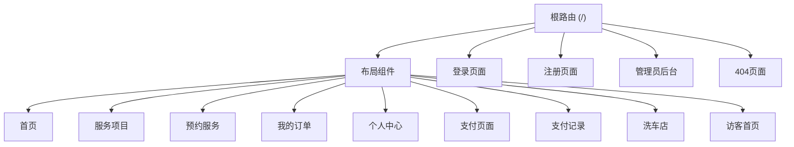
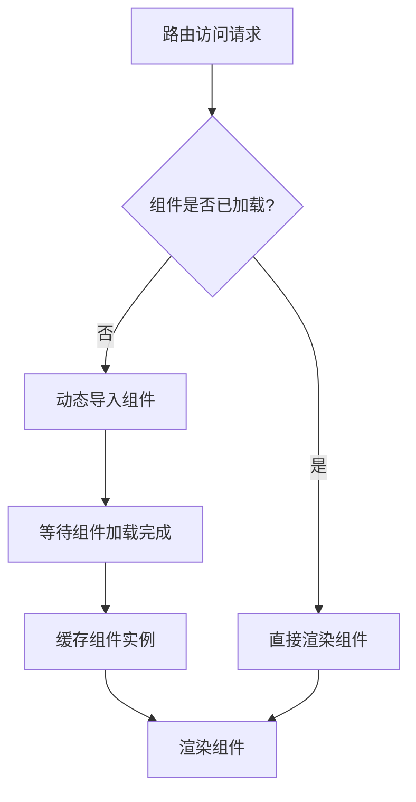
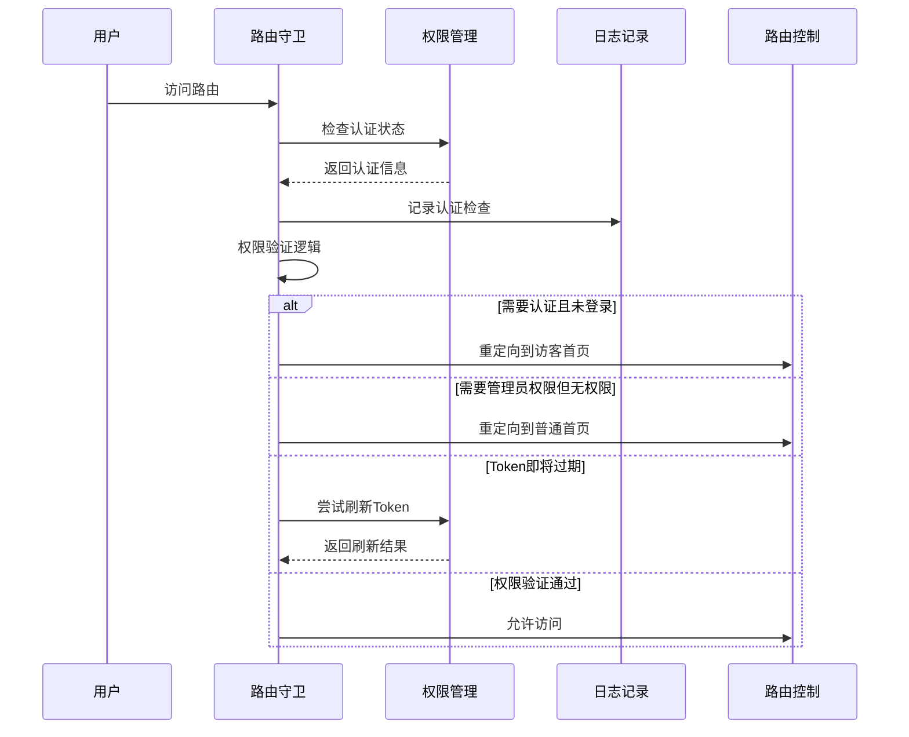
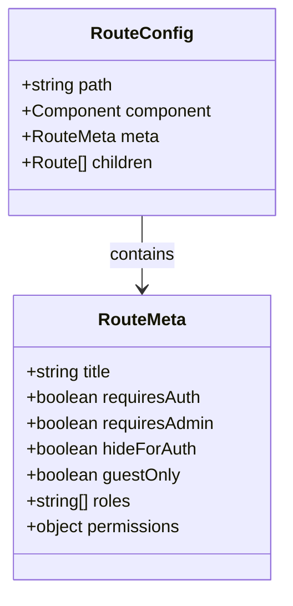
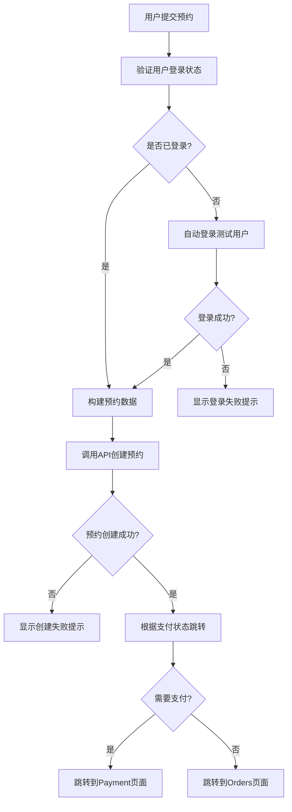
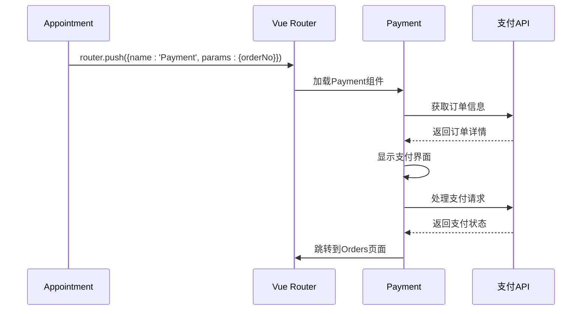
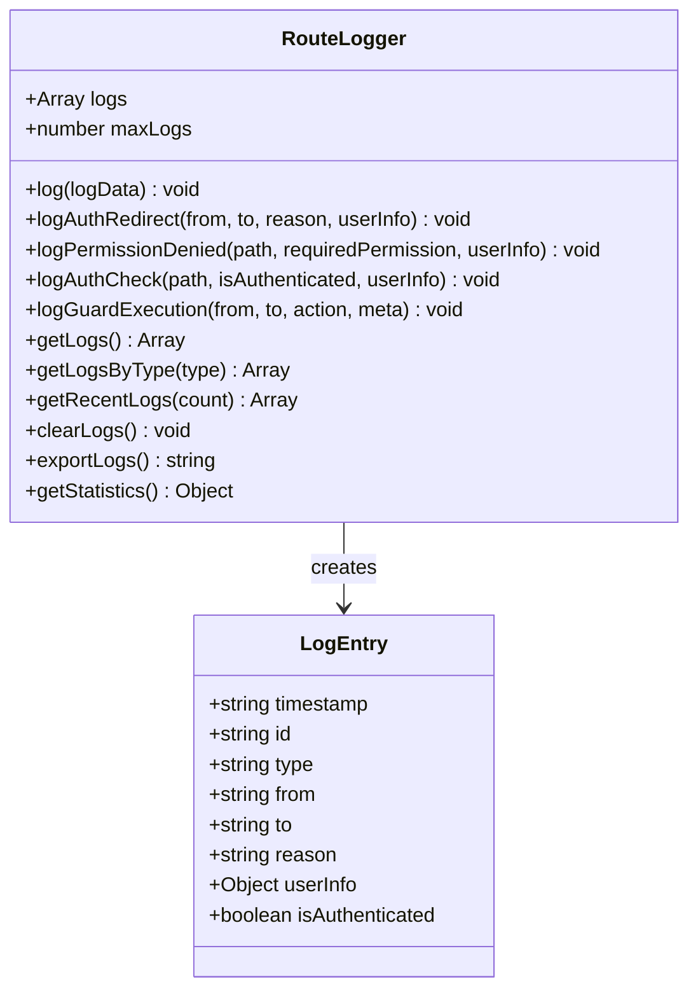
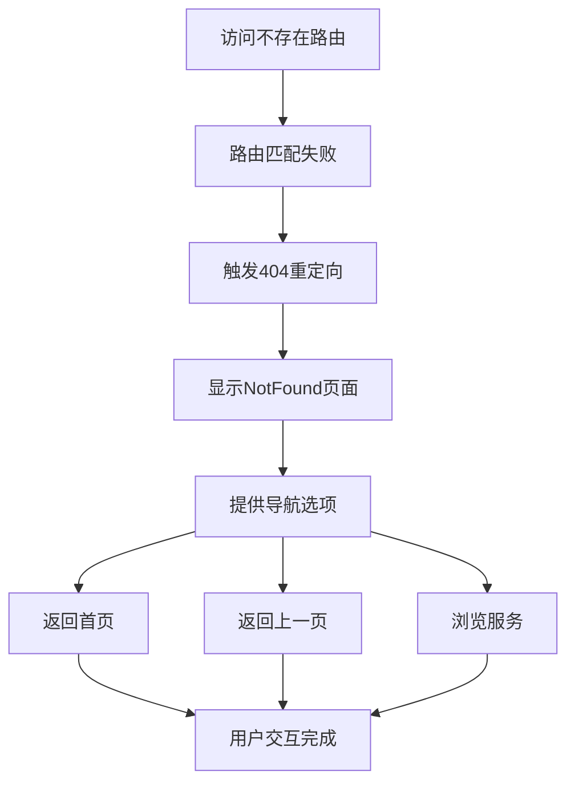
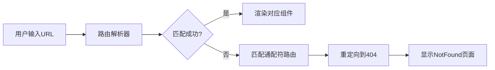

# Vue Router配置与导航控制机制

<cite>
**本文档引用的文件**
- [frontend/src/router/index.js](file://frontend/src/router/index.js)
- [frontend/src/views/Appointment.vue](file://frontend/src/views/Appointment.vue)
- [frontend/src/views/Payment.vue](file://frontend/src/views/Payment.vue)
- [frontend/src/utils/routeLogger.js](file://frontend/src/utils/routeLogger.js)
- [frontend/src/views/NotFound.vue](file://frontend/src/views/NotFound.vue)
- [frontend/src/utils/auth.js](file://frontend/src/utils/auth.js)
- [frontend/src/main.js](file://frontend/src/main.js)
</cite>

## 目录
1. [概述](#概述)
2. [路由配置架构](#路由配置架构)
3. [懒加载机制](#懒加载机制)
4. [路由守卫与权限控制](#路由守卫与权限控制)
5. [路由元信息应用](#路由元信息应用)
6. [编程式导航实现](#编程式导航实现)
7. [路由日志记录系统](#路由日志记录系统)
8. [错误处理与404页面](#错误处理与404页面)
9. [最佳实践与优化](#最佳实践与优化)

## 概述

Vue Router作为汽车洗车服务预约系统的核心导航控制组件，实现了完整的路由管理、权限控制和用户行为追踪功能。系统采用模块化的路由配置，支持动态导入、多层级权限验证和详细的日志记录，为用户提供安全、流畅的导航体验。

## 路由配置架构

### 路由结构设计

系统采用嵌套路由结构，主路由包含布局组件，子路由负责具体页面内容展示：

**图表来源**
- [frontend/src/router/index.js](file://frontend/src/router/index.js#L25-L188)

### 路由定义详解

路由配置包含以下核心特性：

| 路由路径 | 组件名称 | 权限要求 | 元信息 |
|---------|---------|---------|--------|
| `/` | Home | 需要认证 | title: "首页" |
| `/services` | Services | 无限制 | title: "服务项目" |
| `/appointment` | Appointment | 需要认证 | title: "预约服务" |
| `/orders` | Orders | 需要认证 | title: "我的订单" |
| `/profile` | Profile | 需要认证 | title: "个人中心" |
| `/payment/:orderNo?` | Payment | 需要认证 | title: "支付" |
| `/admin` | Admin | 管理员权限 | title: "管理员后台" |
| `/404` | NotFound | 无限制 | title: "页面未找到" |

**章节来源**
- [frontend/src/router/index.js](file://frontend/src/router/index.js#L25-L188)

## 懒加载机制

### 动态导入实现

系统采用ES6动态导入语法实现组件懒加载，显著提升应用启动性能：

**图表来源**
- [frontend/src/router/index.js](file://frontend/src/router/index.js#L6-L20)

### 懒加载优势

1. **首屏加载优化**：只加载当前页面所需的组件
2. **内存使用优化**：按需加载减少内存占用
3. **网络传输优化**：减少初始包体积
4. **开发维护便利**：模块化组织代码结构

**章节来源**
- [frontend/src/router/index.js](file://frontend/src/router/index.js#L6-L20)

## 路由守卫与权限控制

### 全局前置守卫实现

系统实现了增强型路由守卫，提供全面的权限验证和用户状态管理：

**图表来源**
- [frontend/src/router/index.js](file://frontend/src/router/index.js#L208-L335)

### 权限控制逻辑

系统实现了多层次的权限控制机制：

| 控制类型 | 实现方式 | 应用场景 |
|---------|---------|---------|
| 认证检查 | `requiresAuth: true` | 需要登录才能访问的页面 |
| 管理员权限 | `requiresAdmin: true` | 后台管理功能 |
| 访客专用 | `guestOnly: true` | 登录后的访客页面 |
| 登录隐藏 | `hideForAuth: true` | 已登录用户的登录/注册页面 |
| 角色权限 | `AuthManager.hasPermission()` | 细粒度功能权限 |

**章节来源**
- [frontend/src/router/index.js](file://frontend/src/router/index.js#L235-L290)
- [frontend/src/utils/auth.js](file://frontend/src/utils/auth.js#L52-L72)

## 路由元信息应用

### 元信息字段设计

路由元信息提供了丰富的配置选项，支持页面标题设置、权限控制和特殊行为定义：

**图表来源**
- [frontend/src/router/index.js](file://frontend/src/router/index.js#L34-L130)

### 元信息应用场景

1. **页面标题管理**：自动设置浏览器标题
2. **权限验证**：控制页面访问权限
3. **导航控制**：管理菜单显示逻辑
4. **用户体验**：提供友好的访问提示

**章节来源**
- [frontend/src/router/index.js](file://frontend/src/router/index.js#L212-L214)

## 编程式导航实现

### Appointment组件导航流程

Appointment组件展示了完整的编程式导航实现，包括预约流程的多步骤跳转：

**图表来源**
- [frontend/src/views/Appointment.vue](file://frontend/src/views/Appointment.vue#L667-L769)

### Payment组件参数传递

Payment组件演示了带参数的路由导航，支持订单号传递和状态保持：

**图表来源**
- [frontend/src/views/Appointment.vue](file://frontend/src/views/Appointment.vue#L758-L762)
- [frontend/src/views/Payment.vue](file://frontend/src/views/Payment.vue#L495-L510)

### 参数传递机制

系统支持多种参数传递方式：

| 传递方式 | 使用场景 | 示例 |
|---------|---------|------|
| 路径参数 | 必需参数传递 | `/payment/:orderNo` |
| 查询参数 | 可选参数传递 | `/orders?status=pending` |
| 路由状态 | 临时数据传递 | `router.push({path: '/payment', state: {...}})` |

**章节来源**
- [frontend/src/views/Payment.vue](file://frontend/src/views/Payment.vue#L495-L510)

## 路由日志记录系统

### RouteLogger实现架构

RouteLogger提供了完整的路由行为追踪功能，支持多种日志类型和统计分析：

**图表来源**
- [frontend/src/utils/routeLogger.js](file://frontend/src/utils/routeLogger.js#L4-L226)

### 日志记录类型

系统记录以下关键日志类型：

| 日志类型 | 记录内容 | 应用场景 |
|---------|---------|---------|
| `auth_redirect` | 认证重定向记录 | 权限不足时的跳转 |
| `permission_denied` | 权限拒绝记录 | 访问被拒绝的情况 |
| `auth_check` | 认证状态检查 | 用户状态验证过程 |
| `guard_execution` | 守卫执行记录 | 路由守卫运行状态 |

**章节来源**
- [frontend/src/utils/routeLogger.js](file://frontend/src/utils/routeLogger.js#L43-L117)

### 用户行为分析作用

路由日志系统在用户行为分析中发挥重要作用：

1. **访问路径追踪**：记录用户浏览路径
2. **权限问题诊断**：识别权限配置问题
3. **性能监控**：分析路由加载时间
4. **安全审计**：追踪异常访问行为

**章节来源**
- [frontend/src/utils/routeLogger.js](file://frontend/src/utils/routeLogger.js#L199-L226)

## 错误处理与404页面

### NotFound页面设计

系统提供了完整的404页面处理机制，包括优雅的错误展示和智能的导航引导：

**图表来源**
- [frontend/src/views/NotFound.vue](file://frontend/src/views/NotFound.vue#L23-L65)

### 动态路由匹配

系统实现了灵活的动态路由匹配机制：

**图表来源**
- [frontend/src/router/index.js](file://frontend/src/router/index.js#L186-L188)

### 错误处理策略

系统采用多层次的错误处理策略：

1. **路由级别错误**：捕获路由解析错误
2. **组件级别错误**：处理组件渲染错误
3. **API级别错误**：处理数据获取错误
4. **用户友好提示**：提供清晰的错误信息

**章节来源**
- [frontend/src/router/index.js](file://frontend/src/router/index.js#L354-L359)

## 最佳实践与优化

### 性能优化策略

1. **懒加载优化**：合理使用动态导入
2. **路由缓存**：利用keep-alive组件
3. **预加载策略**：对高频访问页面进行预加载
4. **代码分割**：按功能模块分割代码

### 安全最佳实践

1. **权限验证**：双重验证机制
2. **敏感信息保护**：避免在URL中传递敏感数据
3. **CSRF防护**：配合后端进行跨站请求伪造防护
4. **XSS防护**：对用户输入进行严格验证

### 开发维护建议

1. **模块化设计**：保持路由配置的模块化
2. **文档维护**：及时更新路由配置文档
3. **测试覆盖**：编写路由相关的单元测试
4. **监控告警**：建立路由访问监控机制

**章节来源**
- [frontend/src/router/index.js](file://frontend/src/router/index.js#L191-L200)

## 总结

Vue Router在汽车洗车服务预约系统中发挥了核心作用，通过完善的配置机制、严格的权限控制和详尽的日志记录，为用户提供了安全、流畅的导航体验。系统的模块化设计和良好的扩展性，为未来的功能扩展和性能优化奠定了坚实基础。