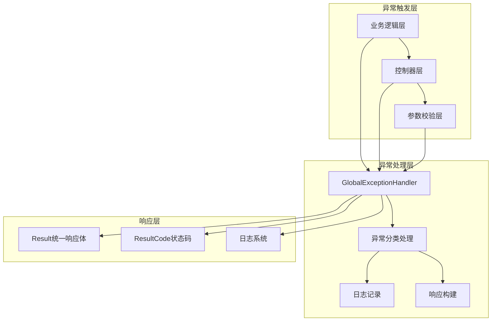
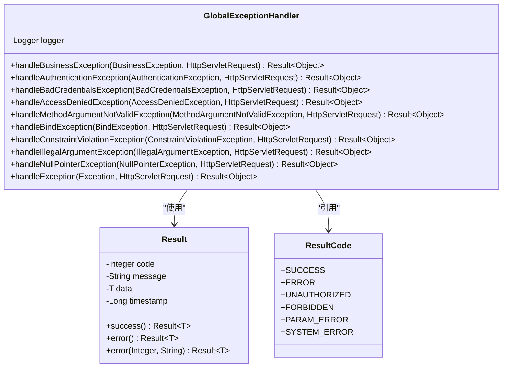
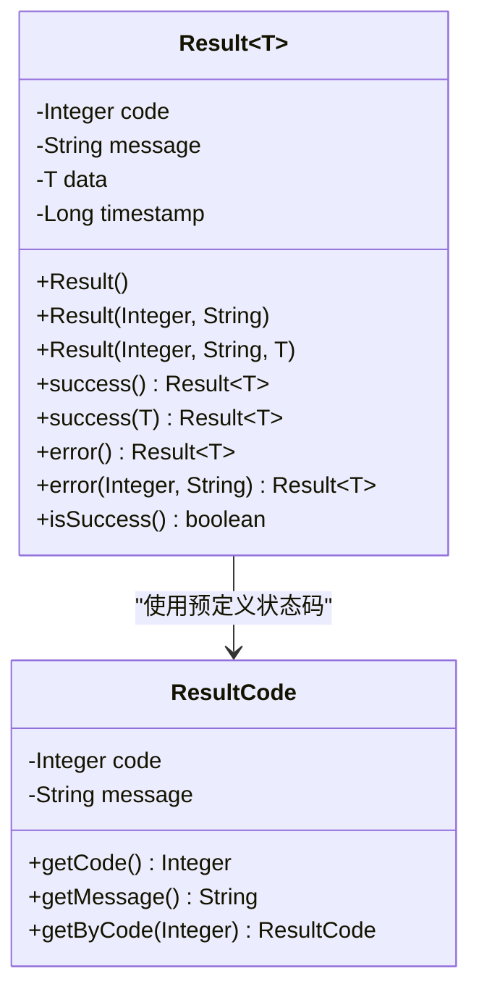
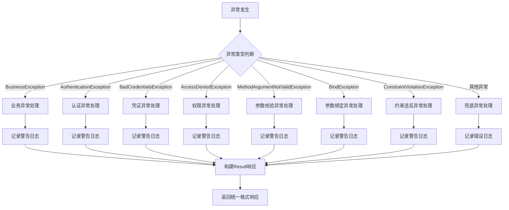
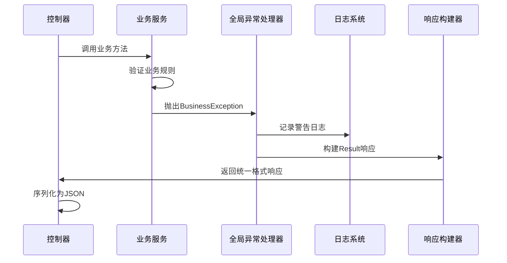
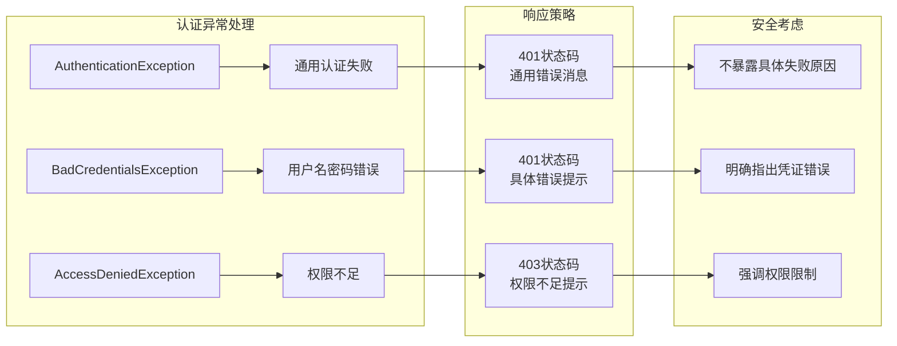
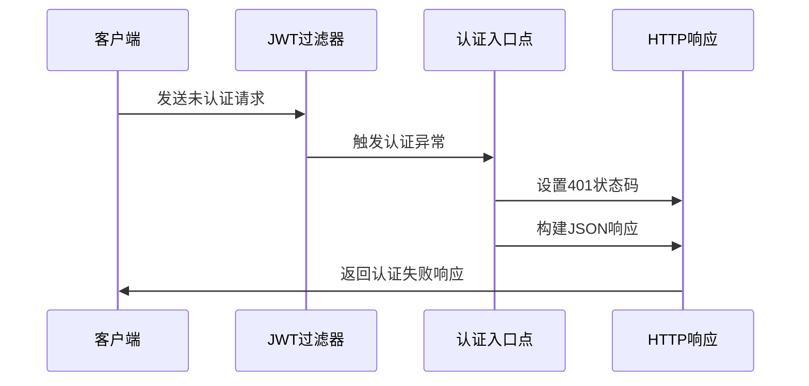
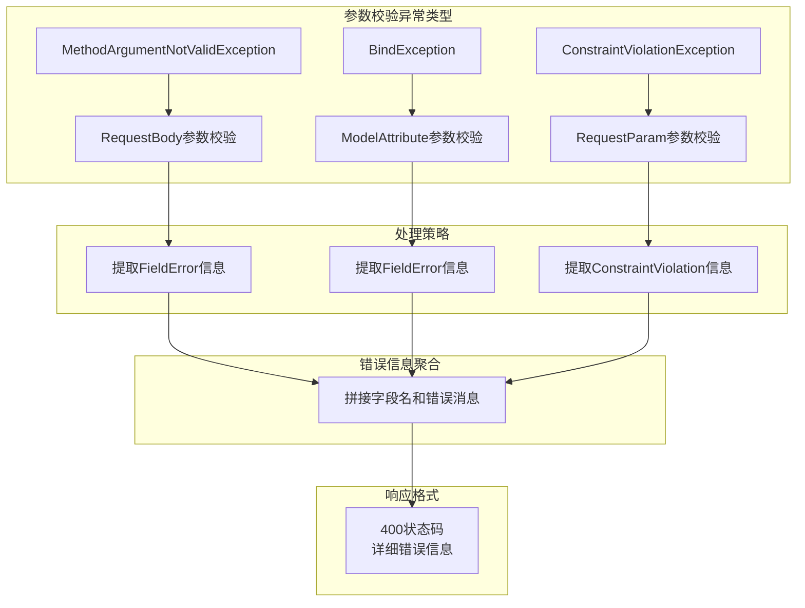
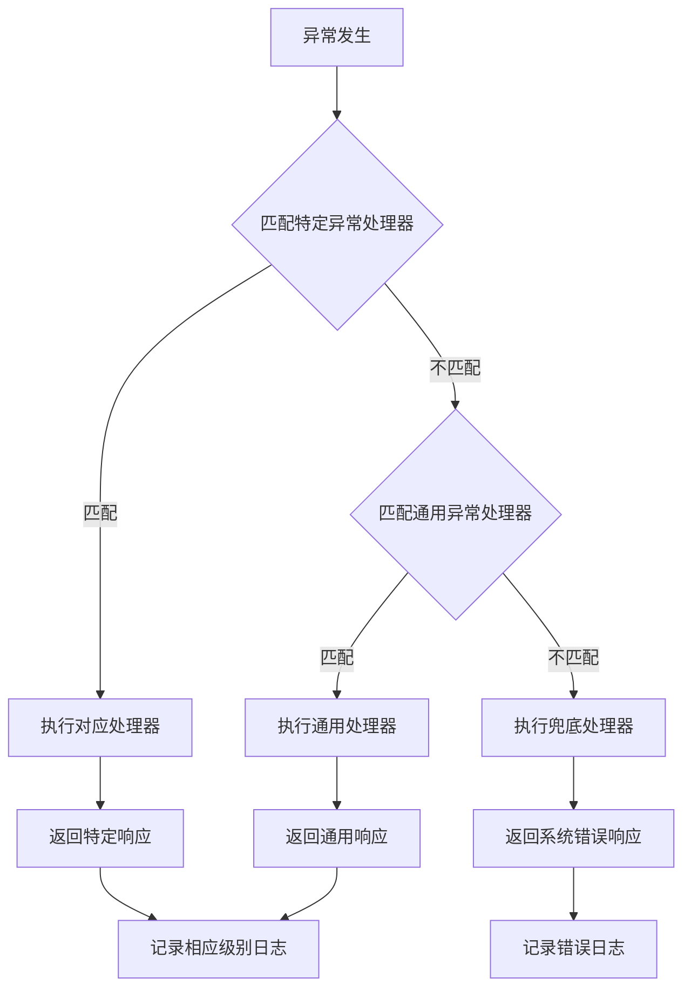
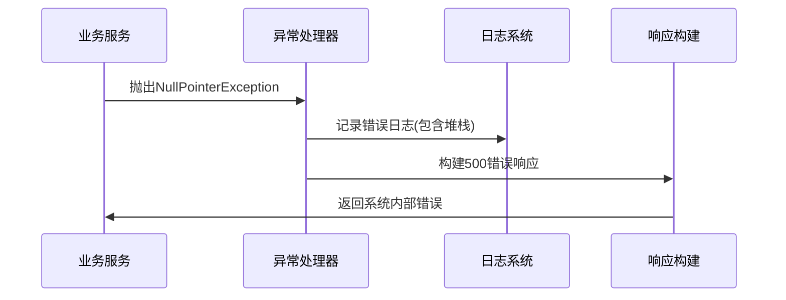

# 全局异常处理机制深度解析

<cite>
**本文档引用的文件**
- [GlobalExceptionHandler.java](file://backend/src/main/java/com/carwash/common/GlobalExceptionHandler.java)
- [Result.java](file://backend/src/main/java/com/carwash/common/result/Result.java)
- [ResultCode.java](file://backend/src/main/java/com/carwash/common/result/ResultCode.java)
- [BusinessException.java](file://backend/src/main/java/com/carwash/common/BusinessException.java)
- [JwtAuthenticationEntryPoint.java](file://backend/src/main/java/com/carwash/common/JwtAuthenticationEntryPoint.java)
- [AuthController.java](file://backend/src/main/java/com/carwash/controller/AuthController.java)
- [UserServiceImpl.java](file://backend/src/main/java/com/carwash/service/impl/UserServiceImpl.java)
- [BookingServiceImpl.java](file://backend/src/main/java/com/carwash/service/impl/BookingServiceImpl.java)
- [LoginRequest.java](file://backend/src/main/java/com/carwash/dto/LoginRequest.java)
- [RegisterRequest.java](file://backend/src/main/java/com/carwash/dto/RegisterRequest.java)
</cite>

## 目录
1. [概述](#概述)
2. [架构设计](#架构设计)
3. [核心组件分析](#核心组件分析)
4. [异常处理流程](#异常处理流程)
5. [业务异常处理](#业务异常处理)
6. [安全异常处理](#安全异常处理)
7. [参数校验异常处理](#参数校验异常处理)
8. [兜底异常处理](#兜底异常处理)
9. [最佳实践](#最佳实践)
10. [总结](#总结)

## 概述

基于@RestControllerAdvice的全局异常处理机制是汽车洗车预约系统的核心基础设施，通过统一的异常处理策略确保系统稳定性和用户体验的一致性。该机制采用分层处理模式，针对不同类型的异常提供专门的处理逻辑，同时保证响应格式的统一性和可读性。

## 架构设计

全局异常处理机制采用Spring Boot的@RestControllerAdvice注解实现，形成了一个完整的异常处理生态系统：



**图表来源**
- [GlobalExceptionHandler.java](file://backend/src/main/java/com/carwash/common/GlobalExceptionHandler.java#L29-L152)

## 核心组件分析

### GlobalExceptionHandler类结构

GlobalExceptionHandler作为全局异常处理器的核心，采用了@RestControllerAdvice注解标记，使其能够拦截所有控制器抛出的异常：



**图表来源**
- [GlobalExceptionHandler.java](file://backend/src/main/java/com/carwash/common/GlobalExceptionHandler.java#L29-L152)
- [Result.java](file://backend/src/main/java/com/carwash/common/result/Result.java#L13-L174)
- [ResultCode.java](file://backend/src/main/java/com/carwash/common/result/ResultCode.java#L9-L105)

**章节来源**
- [GlobalExceptionHandler.java](file://backend/src/main/java/com/carwash/common/GlobalExceptionHandler.java#L1-L152)

### Result统一响应体设计

Result类采用泛型设计，提供了灵活的响应体构建能力：



**图表来源**
- [Result.java](file://backend/src/main/java/com/carwash/common/result/Result.java#L13-L174)
- [ResultCode.java](file://backend/src/main/java/com/carwash/common/result/ResultCode.java#L9-L105)

**章节来源**
- [Result.java](file://backend/src/main/java/com/carwash/common/result/Result.java#L1-L174)
- [ResultCode.java](file://backend/src/main/java/com/carwash/common/result/ResultCode.java#L1-L105)

## 异常处理流程

### 异常处理执行流程



**图表来源**
- [GlobalExceptionHandler.java](file://backend/src/main/java/com/carwash/common/GlobalExceptionHandler.java#L37-L151)

## 业务异常处理

### BusinessException处理机制

BusinessException是系统中最常用的业务异常类型，支持自定义错误码和消息：



**图表来源**
- [GlobalExceptionHandler.java](file://backend/src/main/java/com/carwash/common/GlobalExceptionHandler.java#L37-L42)
- [BusinessException.java](file://backend/src/main/java/com/carwash/common/BusinessException.java#L10-L85)

### 业务异常的最佳实践

系统中业务异常的抛出遵循以下模式：

| 异常类型 | 使用场景 | 错误码范围 | 示例 |
|---------|---------|-----------|------|
| 参数验证异常 | 请求参数不符合要求 | 400系列 | PARAM_ERROR |
| 业务规则异常 | 违反业务逻辑规则 | 1000+系列 | USER_NOT_FOUND, SERVICE_NOT_FOUND |
| 系统异常 | 数据库操作失败等 | 6000+系列 | SYSTEM_ERROR, DATABASE_ERROR |

**章节来源**
- [BusinessException.java](file://backend/src/main/java/com/carwash/common/BusinessException.java#L1-L85)
- [GlobalExceptionHandler.java](file://backend/src/main/java/com/carwash/common/GlobalExceptionHandler.java#L37-L42)

## 安全异常处理

### 认证异常处理差异

系统对不同类型的认证异常提供了差异化处理策略：



**图表来源**
- [GlobalExceptionHandler.java](file://backend/src/main/java/com/carwash/common/GlobalExceptionHandler.java#L47-L72)
- [JwtAuthenticationEntryPoint.java](file://backend/src/main/java/com/carwash/common/JwtAuthenticationEntryPoint.java#L25-L40)

### AuthenticationEntryPoint集成

JwtAuthenticationEntryPoint提供了独立的认证入口点处理：



**图表来源**
- [JwtAuthenticationEntryPoint.java](file://backend/src/main/java/com/carwash/common/JwtAuthenticationEntryPoint.java#L25-L40)

**章节来源**
- [GlobalExceptionHandler.java](file://backend/src/main/java/com/carwash/common/GlobalExceptionHandler.java#L47-L72)
- [JwtAuthenticationEntryPoint.java](file://backend/src/main/java/com/carwash/common/JwtAuthenticationEntryPoint.java#L1-L41)

## 参数校验异常处理

### 三种参数校验异常处理

系统针对不同的参数校验场景提供了专门的异常处理器：



**图表来源**
- [GlobalExceptionHandler.java](file://backend/src/main/java/com/carwash/common/GlobalExceptionHandler.java#L77-L121)

### DTO验证约束示例

系统使用Jakarta Validation API进行参数验证：

| 验证注解 | 使用场景 | 错误消息模板 |
|---------|---------|------------|
| @NotBlank | 必填字段非空验证 | "{fieldName}不能为空" |
| @Size | 字符串长度验证 | "{fieldName}长度必须在{min}-{max}个字符之间" |
| @Pattern | 正则表达式验证 | "{fieldName}格式不正确" |
| @Email | 邮箱格式验证 | "邮箱格式不正确" |
| @NotNull | 对象非空验证 | "{fieldName}不能为空" |

**章节来源**
- [GlobalExceptionHandler.java](file://backend/src/main/java/com/carwash/common/GlobalExceptionHandler.java#L77-L121)
- [LoginRequest.java](file://backend/src/main/java/com/carwash/dto/LoginRequest.java#L1-L58)
- [RegisterRequest.java](file://backend/src/main/java/com/carwash/dto/RegisterRequest.java#L1-L124)

## 兜底异常处理

### 异常处理优先级



**图表来源**
- [GlobalExceptionHandler.java](file://backend/src/main/java/com/carwash/common/GlobalExceptionHandler.java#L126-L151)

### 空指针异常处理

NullPointerException作为最严重的运行时异常，采用特殊的处理策略：



**图表来源**
- [GlobalExceptionHandler.java](file://backend/src/main/java/com/carwash/common/GlobalExceptionHandler.java#L136-L141)

**章节来源**
- [GlobalExceptionHandler.java](file://backend/src/main/java/com/carwash/common/GlobalExceptionHandler.java#L126-L151)

## 最佳实践

### 业务异常抛出规范

系统中业务异常的抛出遵循以下最佳实践：

1. **使用ResultCode枚举**：优先使用预定义的ResultCode枚举，确保错误码的一致性
2. **提供详细错误消息**：异常消息应该清晰描述问题原因和解决建议
3. **保持错误码唯一性**：每个业务场景对应唯一的错误码
4. **区分业务异常和系统异常**：业务异常由业务逻辑产生，系统异常由框架或底层问题引起

### 异常处理代码示例

以下是业务异常处理的最佳实践示例：

```java
// 业务异常抛出示例
throw new BusinessException(ResultCode.USER_NOT_FOUND, "用户不存在，请检查用户ID");
throw new BusinessException(ResultCode.PARAM_ERROR, "参数格式不正确：" + e.getMessage());
```

### 参数校验异常处理

对于参数校验异常，系统提供了自动化的错误信息聚合：

```java
// 参数校验异常处理示例
StringBuilder errorMsg = new StringBuilder();
for (FieldError fieldError : e.getBindingResult().getFieldErrors()) {
    errorMsg.append(fieldError.getField())
           .append(": ")
           .append(fieldError.getDefaultMessage())
           .append("; ");
}
return Result.error(400, "参数校验失败：" + errorMsg.toString());
```

**章节来源**
- [UserServiceImpl.java](file://backend/src/main/java/com/carwash/service/impl/UserServiceImpl.java#L72-L111)
- [BookingServiceImpl.java](file://backend/src/main/java/com/carwash/service/impl/BookingServiceImpl.java#L82-L174)

## 总结

基于@RestControllerAdvice的全局异常处理机制为汽车洗车预约系统提供了完整、统一的异常处理解决方案。通过分层处理策略，系统能够：

1. **统一响应格式**：所有异常都返回标准化的Result格式响应
2. **分级处理策略**：针对不同类型的异常采用专门的处理逻辑
3. **详细错误信息**：提供准确的错误原因和解决建议
4. **良好的用户体验**：避免暴露系统内部细节，保护系统安全
5. **完善的日志记录**：为问题排查和系统监控提供支持

这种设计不仅提高了系统的稳定性和可维护性，还为前端开发者提供了清晰、一致的错误处理体验，是现代Web应用架构中不可或缺的重要组成部分。