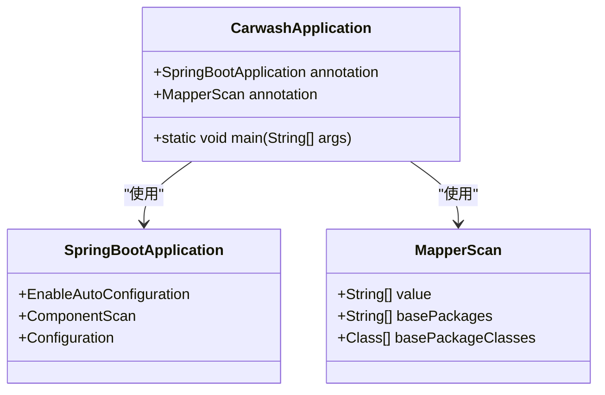
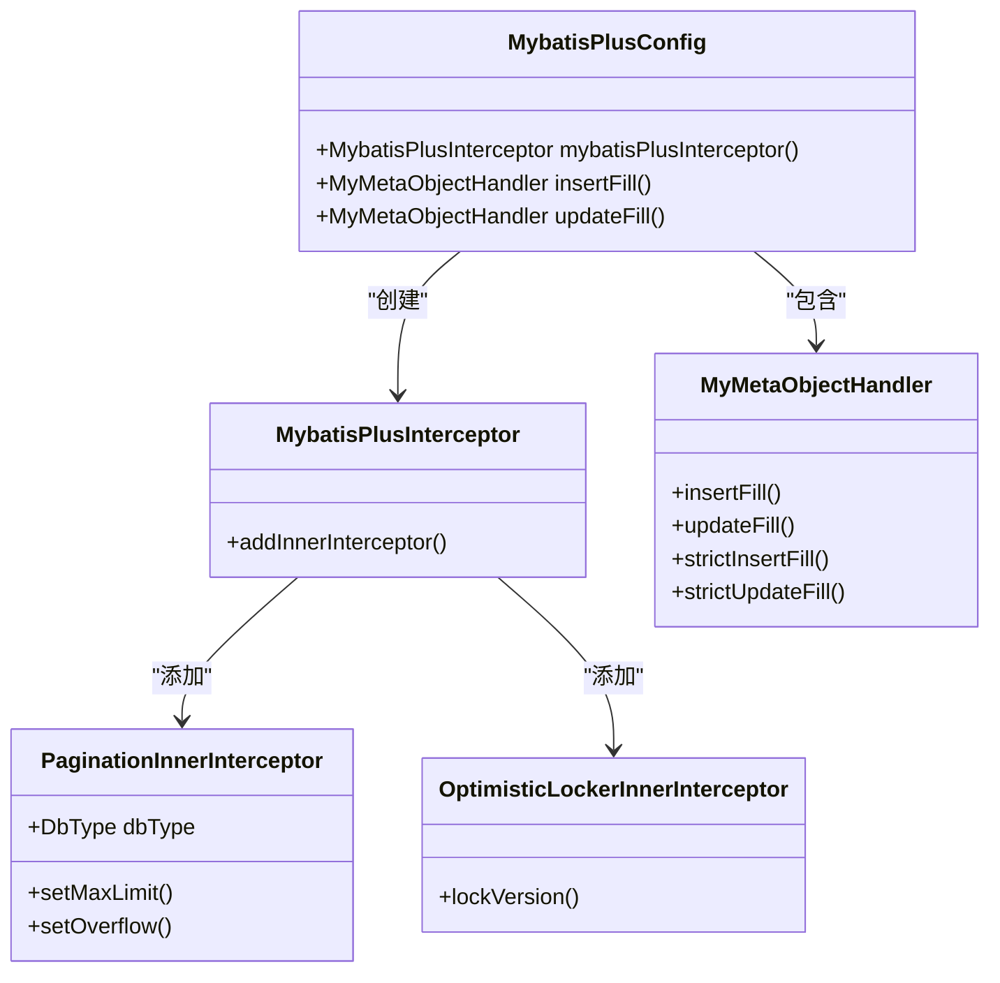
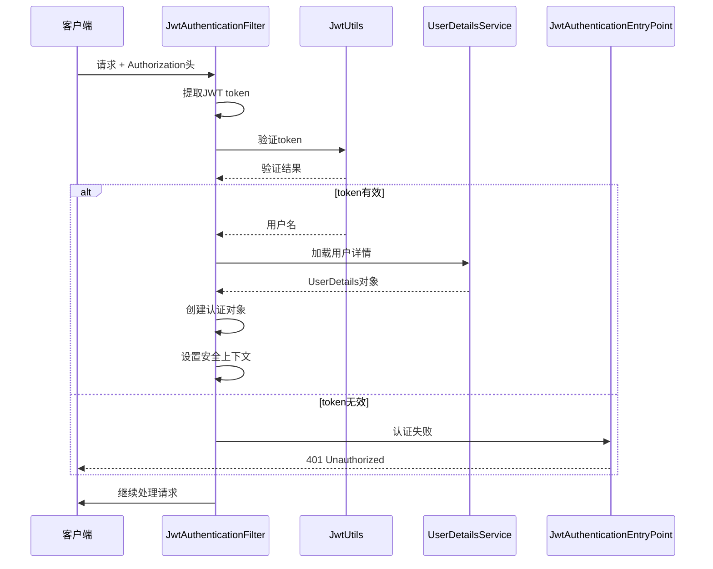
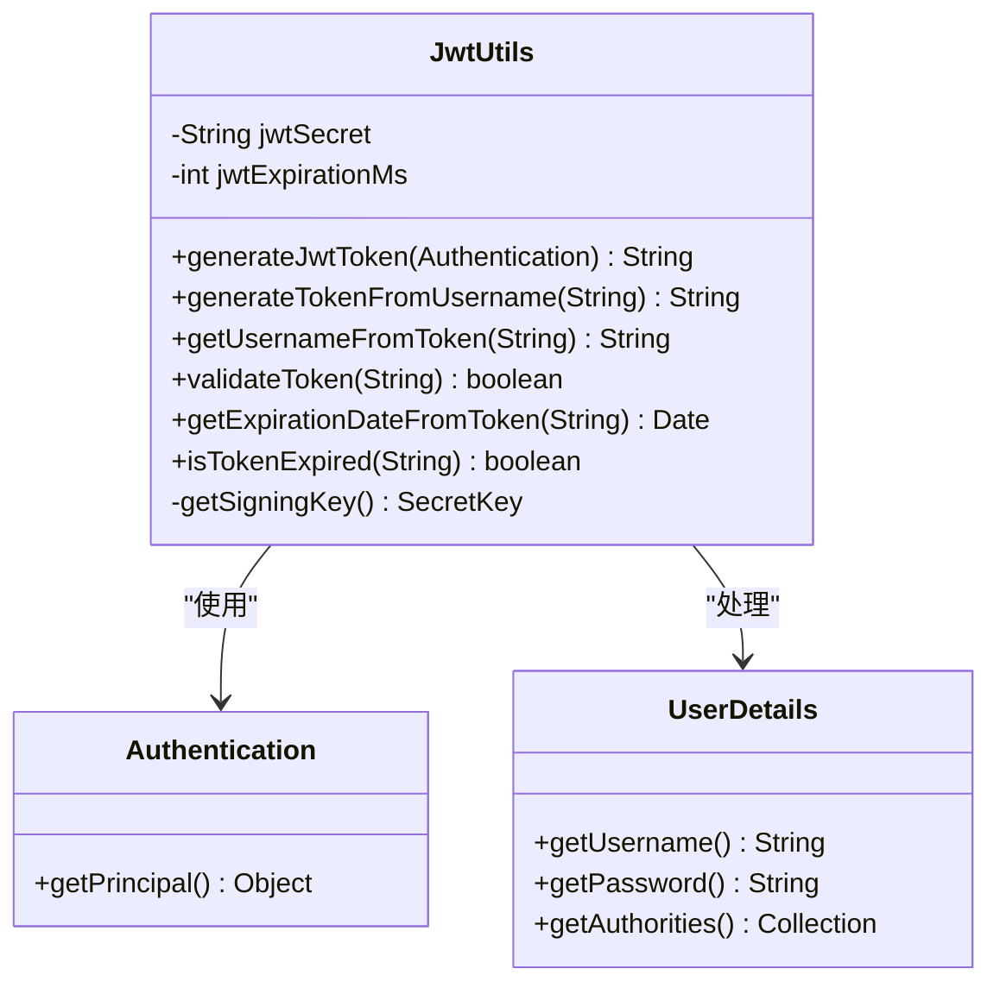
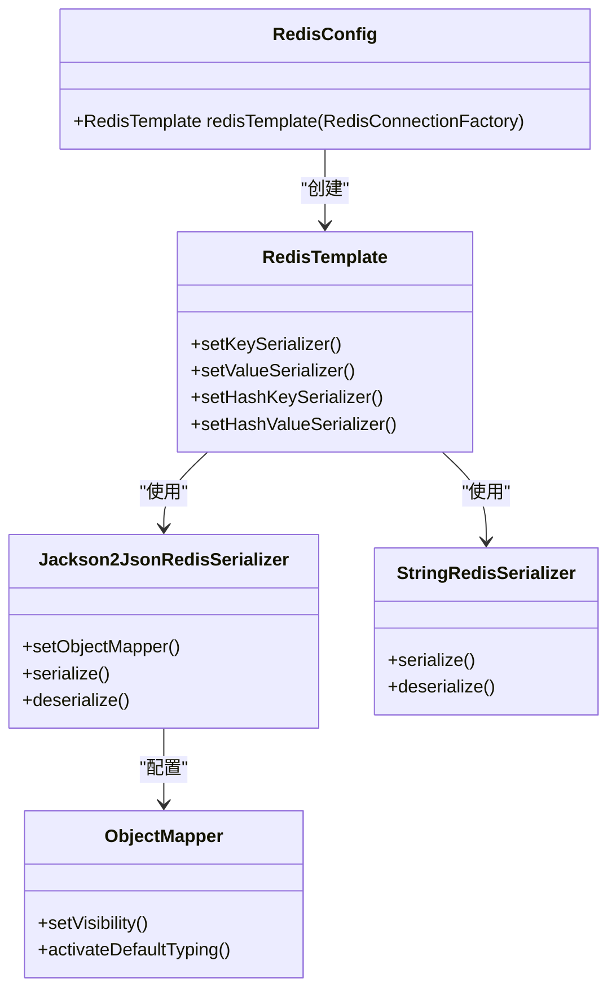
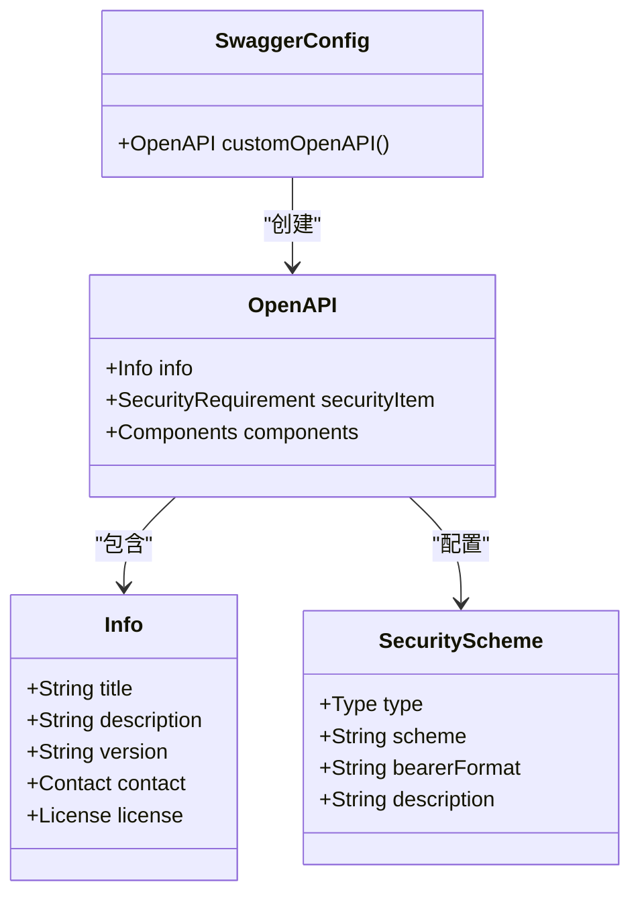
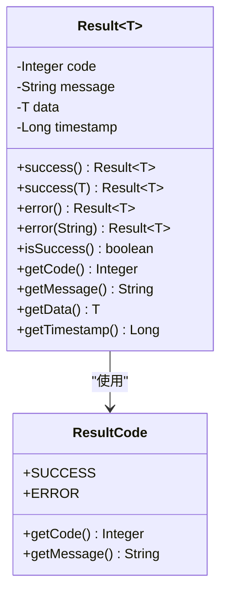
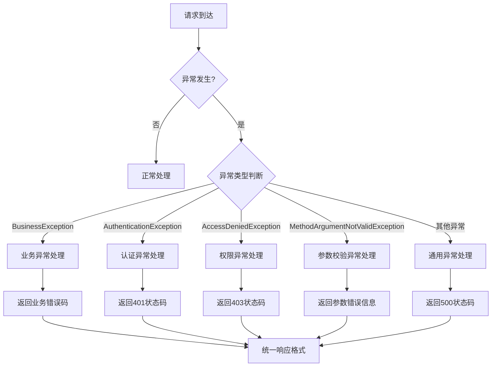
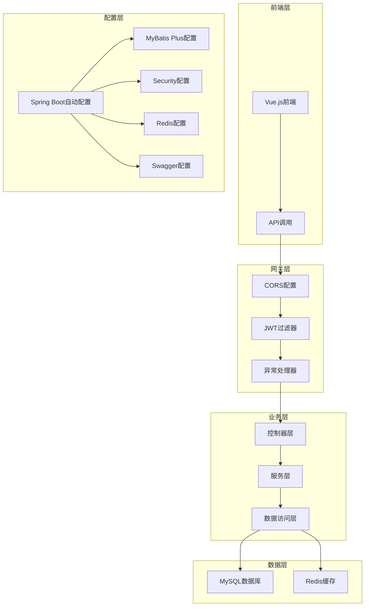

# 后端架构设计深度解析

<cite>
**本文档引用的文件**
- [CarwashApplication.java](file://backend/src/main/java/com/carwash/CarwashApplication.java)
- [SecurityConfig.java](file://backend/src/main/java/com/carwash/config/SecurityConfig.java)
- [MybatisPlusConfig.java](file://backend/src/main/java/com/carwash/config/MybatisPlusConfig.java)
- [RedisConfig.java](file://backend/src/main/java/com/carwash/config/RedisConfig.java)
- [SwaggerConfig.java](file://backend/src/main/java/com/carwash/config/SwaggerConfig.java)
- [JwtAuthenticationFilter.java](file://backend/src/main/java/com/carwash/common/JwtAuthenticationFilter.java)
- [JwtAuthenticationEntryPoint.java](file://backend/src/main/java/com/carwash/common/JwtAuthenticationEntryPoint.java)
- [Result.java](file://backend/src/main/java/com/carwash/common/result/Result.java)
- [GlobalExceptionHandler.java](file://backend/src/main/java/com/carwash/common/GlobalExceptionHandler.java)
- [JwtUtils.java](file://backend/src/main/java/com/carwash/utils/JwtUtils.java)
- [AuthController.java](file://backend/src/main/java/com/carwash/controller/AuthController.java)
- [UserDetailsServiceImpl.java](file://backend/src/main/java/com/carwash/service/impl/UserDetailsServiceImpl.java)
- [UserMapper.java](file://backend/src/main/java/com/carwash/mapper/UserMapper.java)
- [Constants.java](file://backend/src/main/java/com/carwash/common/constants/Constants.java)
- [UserRole.java](file://backend/src/main/java/com/carwash/common/enums/UserRole.java)
- [AppointmentStatus.java](file://backend/src/main/java/com/carwash/common/enums/AppointmentStatus.java)
</cite>

## 目录
1. [引言](#引言)
2. [Spring Boot自动配置机制](#spring-boot自动配置机制)
3. [MyBatis Plus集成与配置](#mybatis-plus集成与配置)
4. [安全架构设计](#安全架构设计)
5. [缓存策略实现](#缓存策略实现)
6. [API文档生成机制](#api文档生成机制)
7. [统一响应设计](#统一响应设计)
8. [全局异常处理](#全局异常处理)
9. [架构总结](#架构总结)

## 引言

本文档深入解析汽车洗车服务预约系统的后端架构设计，重点阐述Spring Boot自动配置机制在主类中的体现，以及各个核心组件的集成与协作关系。系统采用现代化的微服务架构理念，通过模块化设计实现了高内聚、低耦合的架构目标。

## Spring Boot自动配置机制

### 主类配置分析

系统的核心启动类`CarwashApplication`展示了Spring Boot自动配置机制的典型应用：

**图表来源**
- [CarwashApplication.java](file://backend/src/main/java/com/carwash/CarwashApplication.java#L13-L14)

### 自动配置特性

1. **组件扫描范围**：`@SpringBootApplication`注解自动扫描当前包及其子包下的所有组件
2. **MyBatis Mapper扫描**：`@MapperScan("com.carwash.mapper")`明确指定Mapper接口扫描路径
3. **条件装配**：根据classpath中的依赖自动配置相应的组件

**章节来源**
- [CarwashApplication.java](file://backend/src/main/java/com/carwash/CarwashApplication.java#L13-L23)

## MyBatis Plus集成与配置

### 配置类设计

`MybatisPlusConfig`类展示了MyBatis Plus的完整配置方案：

**图表来源**
- [MybatisPlusConfig.java](file://backend/src/main/java/com/carwash/config/MybatisPlusConfig.java#L29-L42)

### 核心插件功能

1. **分页插件**：
   - 支持MySQL数据库
   - 最大单页限制500条记录
   - 溢出处理机制

2. **乐观锁插件**：
   - 自动处理并发更新冲突
   - 减少数据库死锁风险

3. **自动填充功能**：
   - 创建时间自动填充
   - 更新时间自动更新
   - 统一时间工具集成

**章节来源**
- [MybatisPlusConfig.java](file://backend/src/main/java/com/carwash/config/MybatisPlusConfig.java#L29-L70)

## 安全架构设计

### JWT认证授权流程

系统采用基于JWT的无状态认证机制，通过`SecurityConfig`类实现完整的安全配置：

**图表来源**
- [JwtAuthenticationFilter.java](file://backend/src/main/java/com/carwash/common/JwtAuthenticationFilter.java#L40-L85)
- [JwtUtils.java](file://backend/src/main/java/com/carwash/utils/JwtUtils.java#L71-L104)

### 安全配置详解

1. **过滤器链配置**：
   - 禁用CSRF保护
   - 配置CORS策略
   - 设置无状态会话管理

2. **请求授权规则**：
   - 公开接口：认证前可访问
   - 管理员接口：需要ADMIN角色
   - 其他接口：必须认证

3. **异常处理机制**：
   - `JwtAuthenticationEntryPoint`处理未认证请求
   - 统一返回401状态码和错误信息

**章节来源**
- [SecurityConfig.java](file://backend/src/main/java/com/carwash/config/SecurityConfig.java#L60-L104)
- [JwtAuthenticationEntryPoint.java](file://backend/src/main/java/com/carwash/common/JwtAuthenticationEntryPoint.java#L25-L40)

### JWT工具类功能

`JwtUtils`提供了完整的JWT操作功能：

**图表来源**
- [JwtUtils.java](file://backend/src/main/java/com/carwash/utils/JwtUtils.java#L36-L133)

**章节来源**
- [JwtUtils.java](file://backend/src/main/java/com/carwash/utils/JwtUtils.java#L36-L133)

## 缓存策略实现

### Redis配置设计

`RedisConfig`类实现了高效的缓存策略配置：

**图表来源**
- [RedisConfig.java](file://backend/src/main/java/com/carwash/config/RedisConfig.java#L28-L54)

### 序列化策略

1. **键序列化**：使用`StringRedisSerializer`确保键的可读性
2. **值序列化**：使用`Jackson2JsonRedisSerializer`支持复杂对象序列化
3. **类型信息保留**：启用默认类型配置以支持多态序列化

### 缓存过期策略

系统定义了多种缓存过期时间：
- 默认缓存：1小时
- 用户信息：2小时
- 服务信息：30分钟

**章节来源**
- [RedisConfig.java](file://backend/src/main/java/com/carwash/config/RedisConfig.java#L28-L56)
- [Constants.java](file://backend/src/main/java/com/carwash/common/constants/Constants.java#L69-L78)

## API文档生成机制

### Swagger配置实现

`SwaggerConfig`类提供了完整的API文档自动化生成机制：

**图表来源**
- [SwaggerConfig.java](file://backend/src/main/java/com/carwash/config/SwaggerConfig.java#L25-L47)

### 文档特性

1. **API信息配置**：标题、描述、版本、联系人信息
2. **安全认证**：Bearer Token认证配置
3. **交互式文档**：支持在线测试API接口

**章节来源**
- [SwaggerConfig.java](file://backend/src/main/java/com/carwash/config/SwaggerConfig.java#L25-L47)

## 统一响应设计

### Result类架构

`Result`类实现了统一的响应结果设计模式：

**图表来源**
- [Result.java](file://backend/src/main/java/com/carwash/common/result/Result.java#L13-L174)

### 设计模式特点

1. **泛型设计**：支持任意类型的响应数据
2. **静态工厂方法**：提供多种便捷的构造方式
3. **JSON序列化控制**：排除null字段，减少传输体积
4. **时间戳自动填充**：记录响应生成时间

**章节来源**
- [Result.java](file://backend/src/main/java/com/carwash/common/result/Result.java#L13-L174)

## 全局异常处理

### 异常处理架构

`GlobalExceptionHandler`类实现了全面的异常处理机制：

**图表来源**
- [GlobalExceptionHandler.java](file://backend/src/main/java/com/carwash/common/GlobalExceptionHandler.java#L37-L151)

### 异常分类处理

1. **业务异常**：自定义错误码和消息
2. **认证异常**：统一401状态码
3. **权限异常**：统一403状态码
4. **参数校验异常**：提取具体错误信息
5. **系统异常**：统一500状态码

**章节来源**
- [GlobalExceptionHandler.java](file://backend/src/main/java/com/carwash/common/GlobalExceptionHandler.java#L37-L151)

## 架构总结

### 整体架构图

### 核心设计原则

1. **单一职责**：每个组件专注于特定功能领域
2. **开闭原则**：对扩展开放，对修改封闭
3. **依赖倒置**：高层模块不依赖低层模块
4. **接口隔离**：提供细粒度的接口定义

### 技术栈优势

1. **Spring Boot**：简化配置，快速开发
2. **MyBatis Plus**：增强版ORM，提高开发效率
3. **Spring Security**：企业级安全框架
4. **JWT**：无状态认证，适合分布式系统
5. **Redis**：高性能缓存，提升系统响应速度

这套架构设计充分体现了现代Java Web开发的最佳实践，通过合理的分层设计和模块化配置，实现了高可用、高性能、易维护的后端系统。