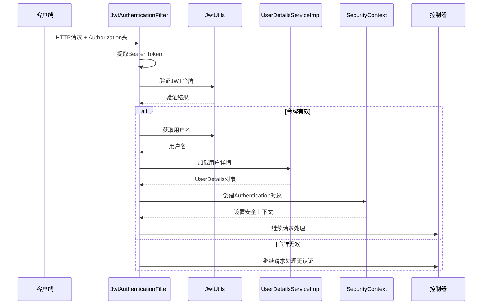
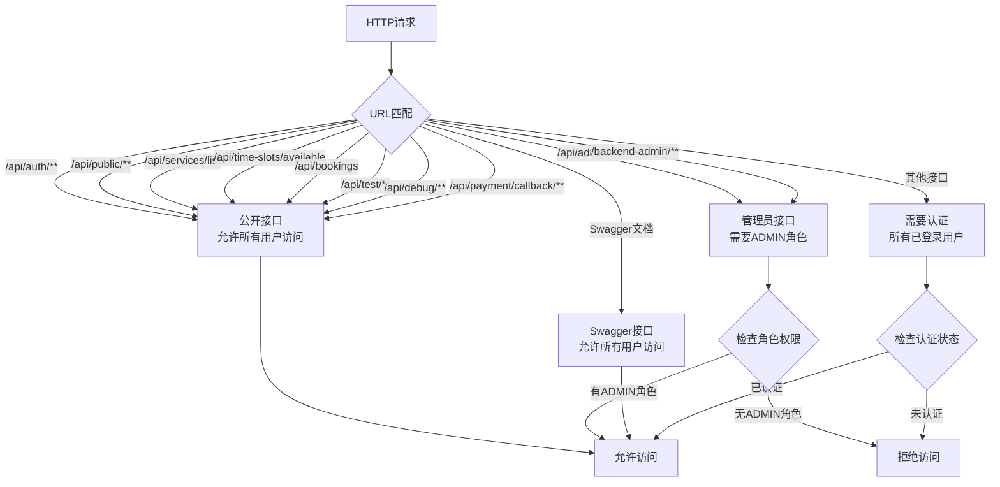
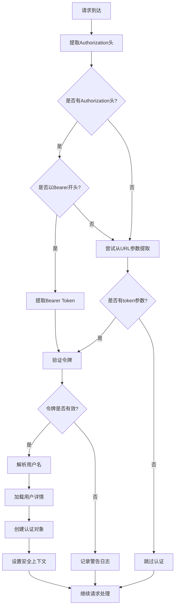
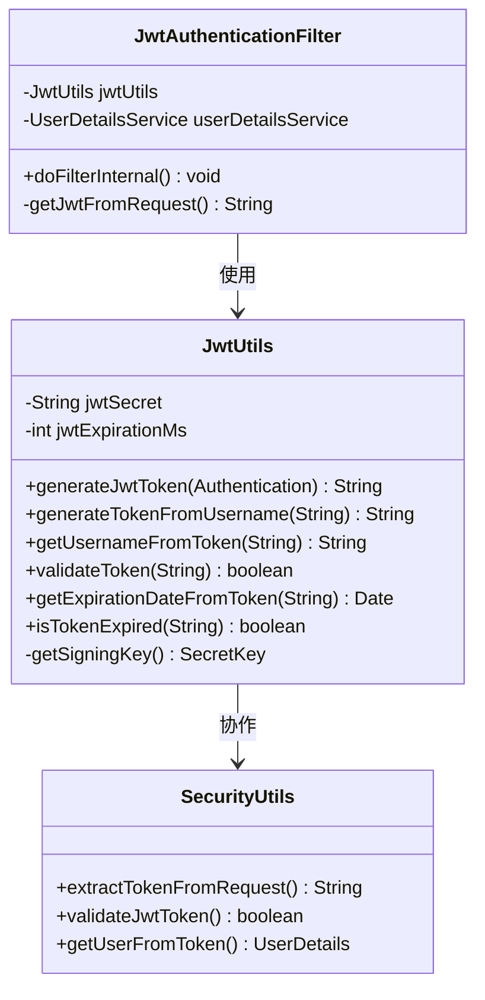
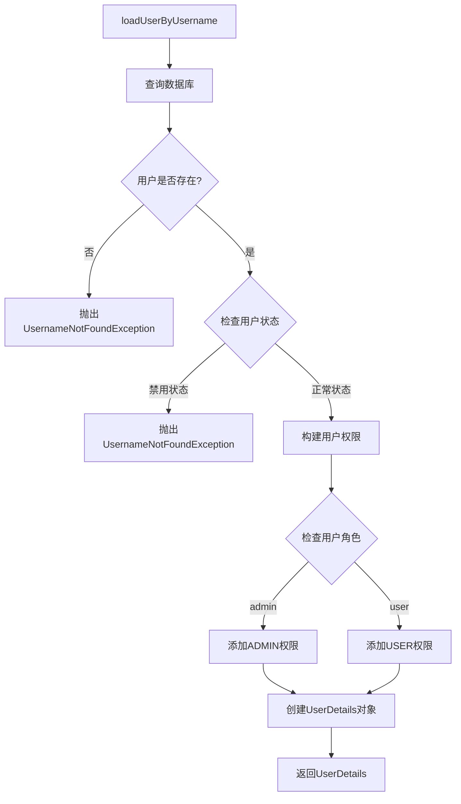
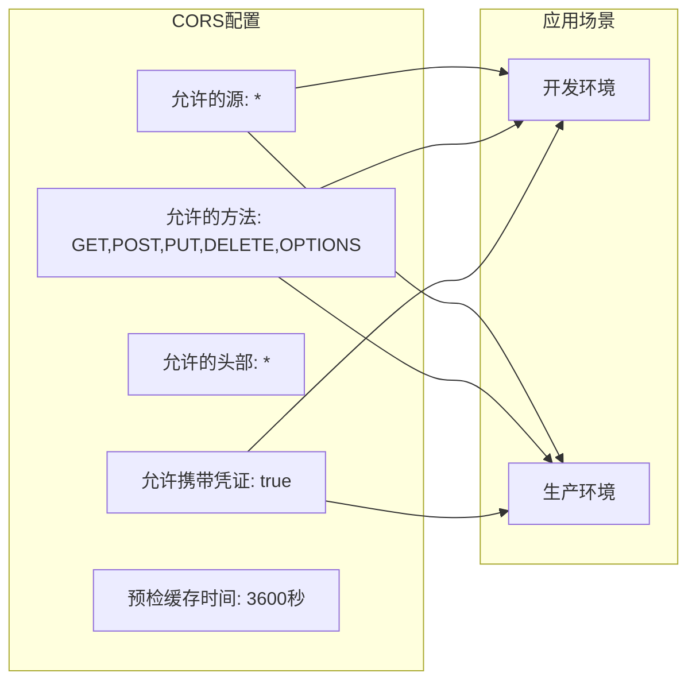
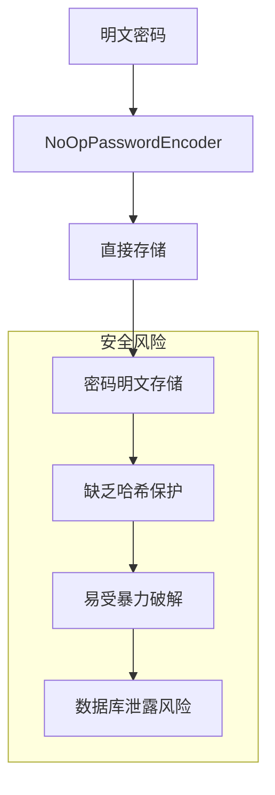
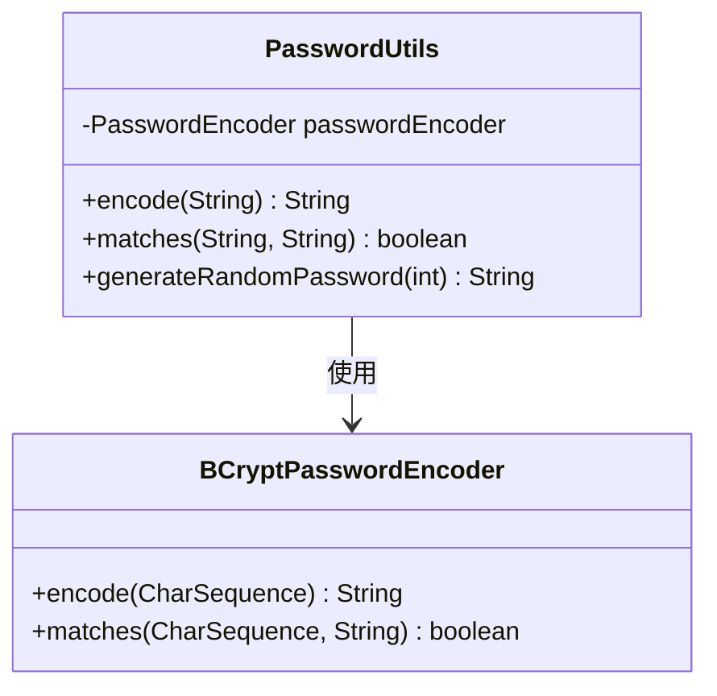
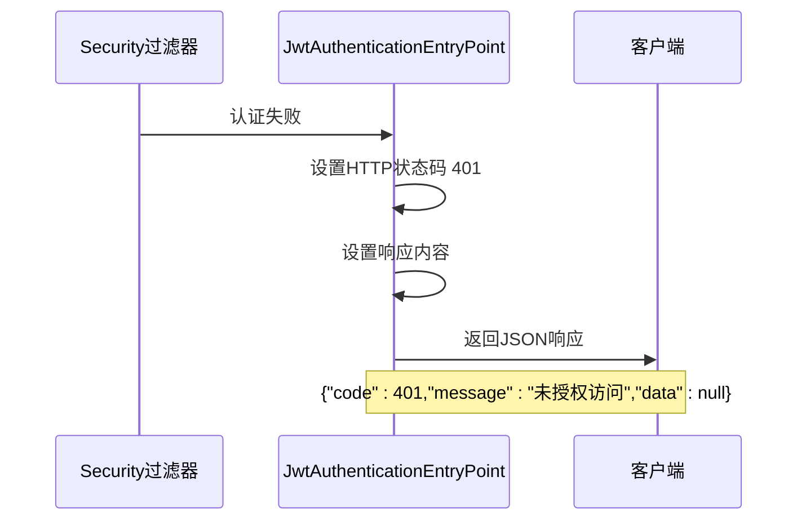

# 安全认证机制

<cite>
**本文档引用的文件**
- [JwtAuthenticationFilter.java](file://backend/src/main/java/com/carwash/common/JwtAuthenticationFilter.java)
- [JwtAuthenticationEntryPoint.java](file://backend/src/main/java/com/carwash/common/JwtAuthenticationEntryPoint.java)
- [SecurityConfig.java](file://backend/src/main/java/com/carwash/config/SecurityConfig.java)
- [JwtUtils.java](file://backend/src/main/java/com/carwash/utils/JwtUtils.java)
- [UserDetailsServiceImpl.java](file://backend/src/main/java/com/carwash/service/impl/UserDetailsServiceImpl.java)
- [AuthController.java](file://backend/src/main/java/com/carwash/controller/AuthController.java)
- [CorsConfig.java](file://backend/src/main/java/com/carwash/config/CorsConfig.java)
- [PasswordUtils.java](file://backend/src/main/java/com/carwash/utils/PasswordUtils.java)
- [application.yml](file://backend/src/main/resources/application.yml)
- [UserService.java](file://backend/src/main/java/com/carwash/service/UserService.java)
</cite>

## 目录
1. [概述](#概述)
2. [JWT认证架构](#jwt认证架构)
3. [SecurityConfig配置详解](#securityconfig配置详解)
4. [JwtAuthenticationFilter工作原理](#jwtauthenticationfilter工作原理)
5. [JWT工具类分析](#jwt工具类分析)
6. [用户权限服务](#用户权限服务)
7. [CORS跨域配置](#cors跨域配置)
8. [密码编码器安全性分析](#密码编码器安全性分析)
9. [认证失败处理机制](#认证失败处理机制)
10. [最佳实践与安全建议](#最佳实践与安全建议)

## 概述

本系统采用基于JWT（JSON Web Token）的无状态安全认证机制，实现了完整的用户身份验证和授权控制。该机制通过Spring Security框架集成，提供了细粒度的接口权限控制，支持公开接口、普通用户接口和管理员接口的不同访问级别。

### 核心特性

- **无状态认证**：基于JWT的无状态设计，支持水平扩展
- **细粒度权限控制**：支持公开接口、用户接口和管理员接口的差异化访问控制
- **CORS跨域支持**：完整的跨域资源共享配置，支持前端开发环境
- **灵活的令牌管理**：支持多种令牌提取方式和过期时间配置
- **安全异常处理**：完善的认证失败处理机制

## JWT认证架构

**图表来源**
- [JwtAuthenticationFilter.java](file://backend/src/main/java/com/carwash/common/JwtAuthenticationFilter.java#L40-L85)
- [JwtUtils.java](file://backend/src/main/java/com/carwash/utils/JwtUtils.java#L71-L103)
- [UserDetailsServiceImpl.java](file://backend/src/main/java/com/carwash/service/impl/UserDetailsServiceImpl.java#L32-L59)

## SecurityConfig配置详解

### 授权策略配置

SecurityConfig通过`requestMatchers`精确匹配URL路径，实现不同级别的接口权限控制：

**图表来源**
- [SecurityConfig.java](file://backend/src/main/java/com/carwash/config/SecurityConfig.java#L76-L97)

### 关键配置项

| 配置项 | 功能描述 | 安全影响 |
|--------|----------|----------|
| `csrf.disable()` | 禁用CSRF保护 | 适用于无状态API，但需确保前端安全 |
| `sessionManagement.STATELESS` | 无状态会话管理 | 支持分布式部署，提高可扩展性 |
| `exceptionHandling` | 异常处理配置 | 统一认证失败响应格式 |
| `addFilterBefore` | JWT过滤器位置 | 在认证过滤器之前执行 |

**章节来源**
- [SecurityConfig.java](file://backend/src/main/java/com/carwash/config/SecurityConfig.java#L62-L103)

## JwtAuthenticationFilter工作原理

### 令牌提取机制

JwtAuthenticationFilter实现了灵活的令牌提取策略：

**图表来源**
- [JwtAuthenticationFilter.java](file://backend/src/main/java/com/carwash/common/JwtAuthenticationFilter.java#L91-L106)

### 认证流程详解

1. **请求拦截**：每次HTTP请求都会经过JwtAuthenticationFilter
2. **令牌提取**：优先从Authorization头提取Bearer Token
3. **令牌验证**：使用JwtUtils验证JWT的有效性和签名
4. **用户加载**：通过UserDetailsServiceImpl加载用户权限信息
5. **认证对象创建**：构建Spring Security的Authentication对象
6. **上下文设置**：将认证信息存入SecurityContext

**章节来源**
- [JwtAuthenticationFilter.java](file://backend/src/main/java/com/carwash/common/JwtAuthenticationFilter.java#L40-L85)

## JWT工具类分析

### 令牌生成与验证

JwtUtils提供了完整的JWT生命周期管理：

**图表来源**
- [JwtUtils.java](file://backend/src/main/java/com/carwash/utils/JwtUtils.java#L22-L133)
- [JwtAuthenticationFilter.java](file://backend/src/main/java/com/carwash/common/JwtAuthenticationFilter.java#L30-L40)

### 令牌验证异常处理

JwtUtils对各种JWT验证异常进行了详细分类和处理：

| 异常类型 | 处理方式 | 安全意义 |
|----------|----------|----------|
| `SecurityException` | 签名无效 | 防止篡改攻击 |
| `MalformedJwtException` | 令牌格式错误 | 防止恶意构造的令牌 |
| `ExpiredJwtException` | 令牌过期 | 自动失效机制 |
| `UnsupportedJwtException` | 不支持的令牌 | 防止算法降级攻击 |
| `IllegalArgumentException` | Claims为空 | 防止空令牌攻击 |

**章节来源**
- [JwtUtils.java](file://backend/src/main/java/com/carwash/utils/JwtUtils.java#L79-L103)

## 用户权限服务

### 用户详情加载机制

UserDetailsServiceImpl实现了Spring Security的UserDetailsService接口：

**图表来源**
- [UserDetailsServiceImpl.java](file://backend/src/main/java/com/carwash/service/impl/UserDetailsServiceImpl.java#L32-L59)

### 权限分配策略

| 用户角色 | 角色权限 | 接口访问范围 |
|----------|----------|--------------|
| `admin` | ROLE_ADMIN, ROLE_USER | 所有接口 |
| `user` | ROLE_USER | 公开接口 + 用户接口 |
| 未认证用户 | 无权限 | 仅公开接口 |

**章节来源**
- [UserDetailsServiceImpl.java](file://backend/src/main/java/com/carwash/service/impl/UserDetailsServiceImpl.java#L65-L81)

## CORS跨域配置

### 配置特点

CORS配置支持前端开发环境的跨域请求：

**图表来源**
- [SecurityConfig.java](file://backend/src/main/java/com/carwash/config/SecurityConfig.java#L109-L130)

### 生产环境建议

生产环境中应限制CORS配置：
- 明确指定允许的域名
- 限制HTTP方法
- 禁用不必要的凭证传递
- 设置合理的预检缓存时间

**章节来源**
- [SecurityConfig.java](file://backend/src/main/java/com/carwash/config/SecurityConfig.java#L109-L130)

## 密码编码器安全性分析

### 开发环境配置

当前系统使用`NoOpPasswordEncoder`作为密码编码器：

**图表来源**
- [SecurityConfig.java](file://backend/src/main/java/com/carwash/config/SecurityConfig.java#L45-L47)

### 生产环境替换建议

推荐使用BCryptPasswordEncoder替代：

| 编码器类型 | 安全等级 | 性能影响 | 推荐程度 |
|------------|----------|----------|----------|
| `NoOpPasswordEncoder` | 低 | 无 | ❌ 开发环境（仅） |
| `BCryptPasswordEncoder` | 高 | 中等 | ✅ 生产环境推荐 |
| `Pbkdf2PasswordEncoder` | 高 | 较高 | ✅ 生产环境可选 |
| `SCryptPasswordEncoder` | 极高 | 高 | ✅ 高安全要求场景 |

### 密码工具类改进

**图表来源**
- [PasswordUtils.java](file://backend/src/main/java/com/carwash/utils/PasswordUtils.java#L15-L42)

**章节来源**
- [SecurityConfig.java](file://backend/src/main/java/com/carwash/config/SecurityConfig.java#L45-L47)
- [PasswordUtils.java](file://backend/src/main/java/com/carwash/utils/PasswordUtils.java#L15-L42)

## 认证失败处理机制

### JwtAuthenticationEntryPoint处理流程

当认证失败时，JwtAuthenticationEntryPoint提供标准化的响应：

**图表来源**
- [JwtAuthenticationEntryPoint.java](file://backend/src/main/java/com/carwash/common/JwtAuthenticationEntryPoint.java#L25-L40)

### 响应格式规范

| 字段 | 类型 | 描述 |
|------|------|------|
| `code` | Number | HTTP状态码（401） |
| `message` | String | 错误消息："未授权访问，请先登录" |
| `data` | Null | 无数据返回 |
| `timestamp` | Number | 时间戳 |

**章节来源**
- [JwtAuthenticationEntryPoint.java](file://backend/src/main/java/com/carwash/common/JwtAuthenticationEntryPoint.java#L25-L40)

## 最佳实践与安全建议

### 安全加固措施

1. **密码安全**
   - 生产环境必须使用强密码编码器（如BCrypt）
   - 实施密码复杂度要求
   - 定期更换密钥和令牌

2. **JWT安全**
   - 使用足够长的密钥（至少64字节）
   - 设置合理的过期时间
   - 实施令牌刷新机制
   - 考虑使用RSA签名算法

3. **网络安全**
   - 启用HTTPS传输
   - 实施严格的CORS策略
   - 配置适当的HTTP头部安全

4. **监控与审计**
   - 记录认证事件
   - 监控异常访问模式
   - 实施自动化的安全扫描

### 性能优化建议

1. **令牌缓存**
   - 实施令牌黑名单机制
   - 使用Redis缓存用户权限信息
   - 优化数据库查询性能

2. **并发处理**
   - 合理配置线程池
   - 实施请求限流
   - 优化内存使用

3. **扩展性考虑**
   - 无状态设计支持水平扩展
   - 分布式会话管理
   - 负载均衡配置

通过以上安全认证机制的深入分析，可以看出该系统在设计上充分考虑了现代Web应用的安全需求，同时保持了良好的可维护性和扩展性。但在生产环境中使用时，需要特别注意密码编码器的选择和CORS配置的安全性。