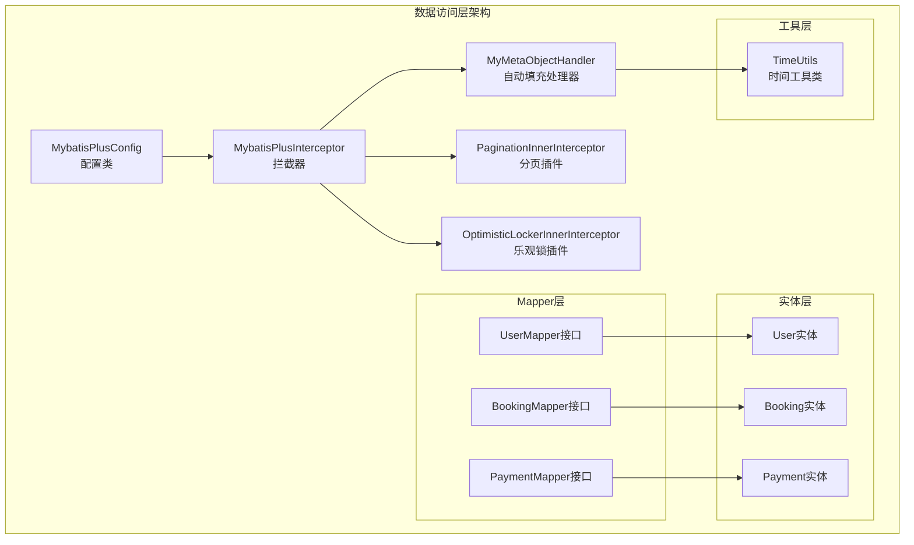
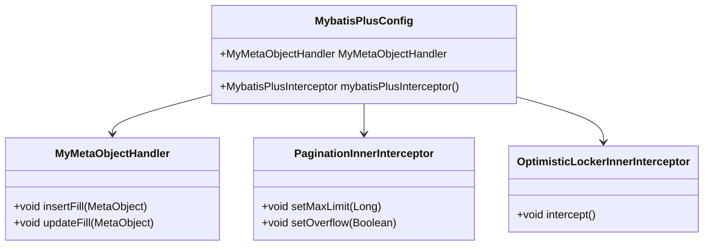
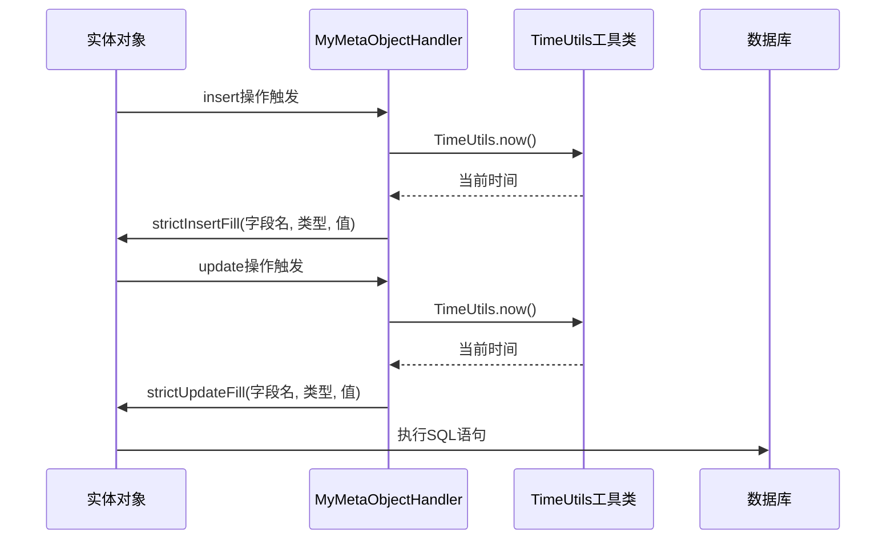
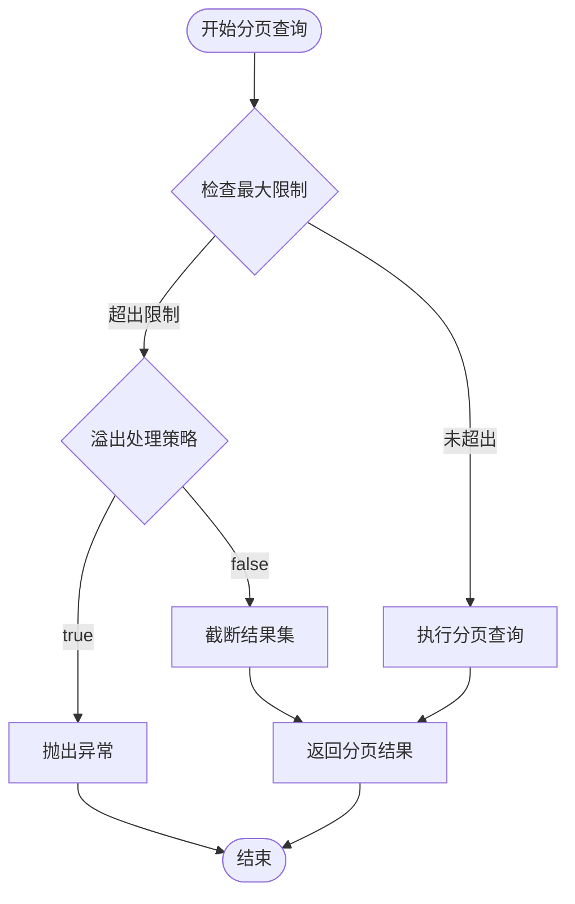
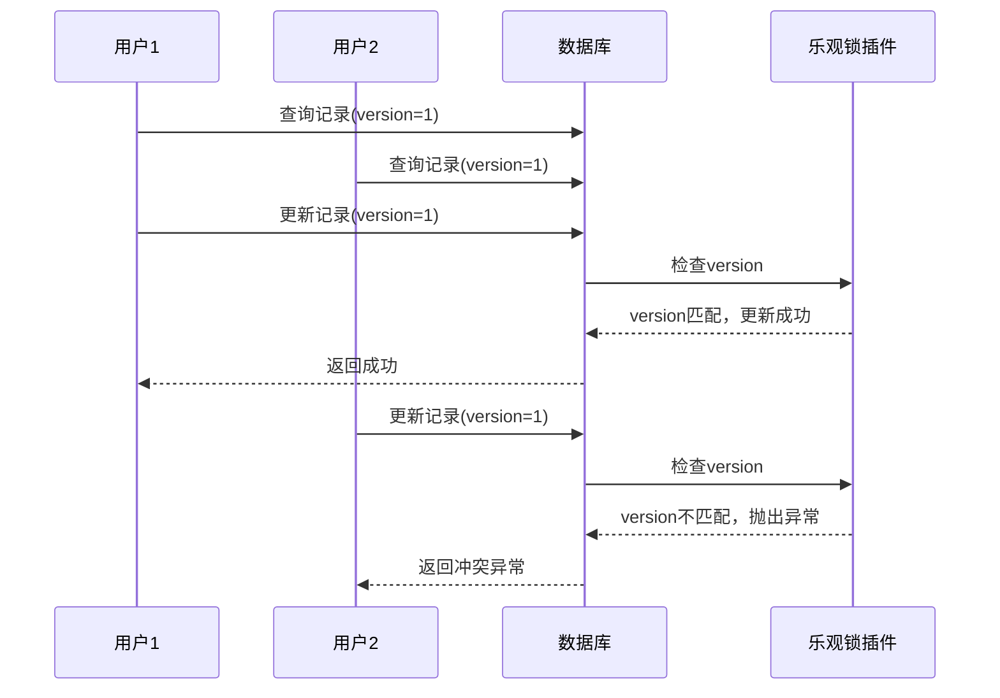
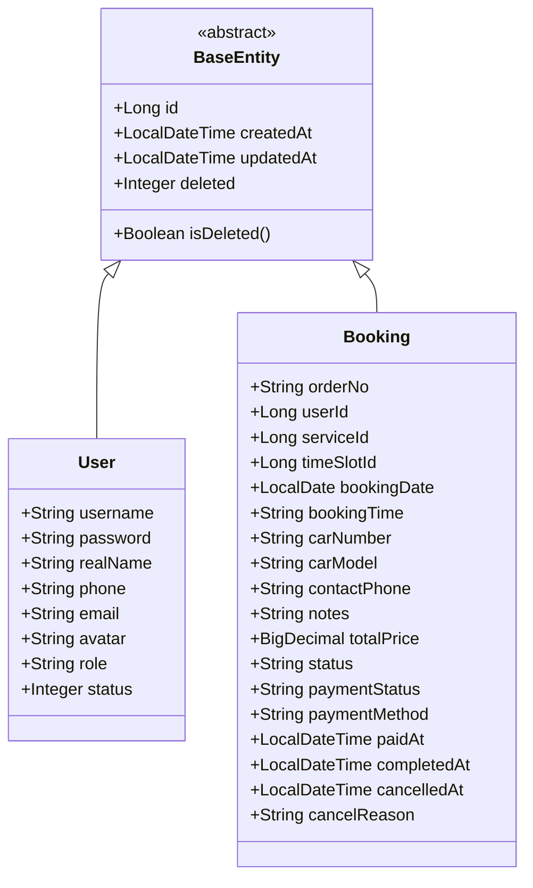
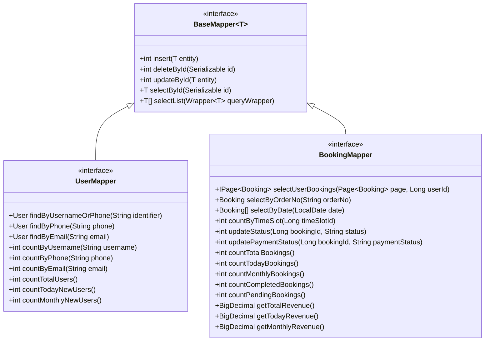
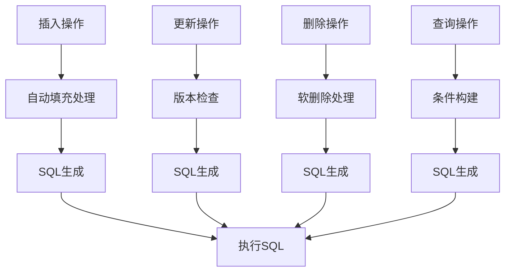
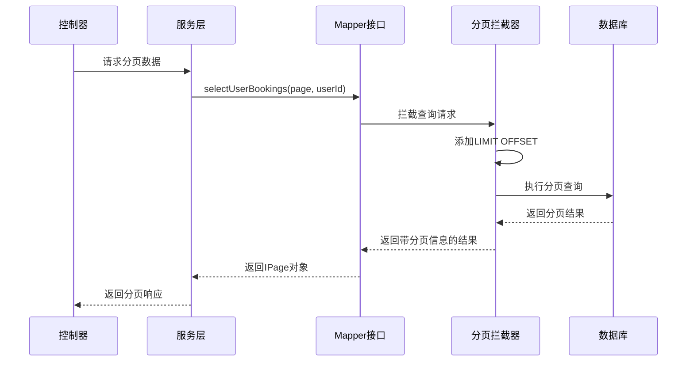
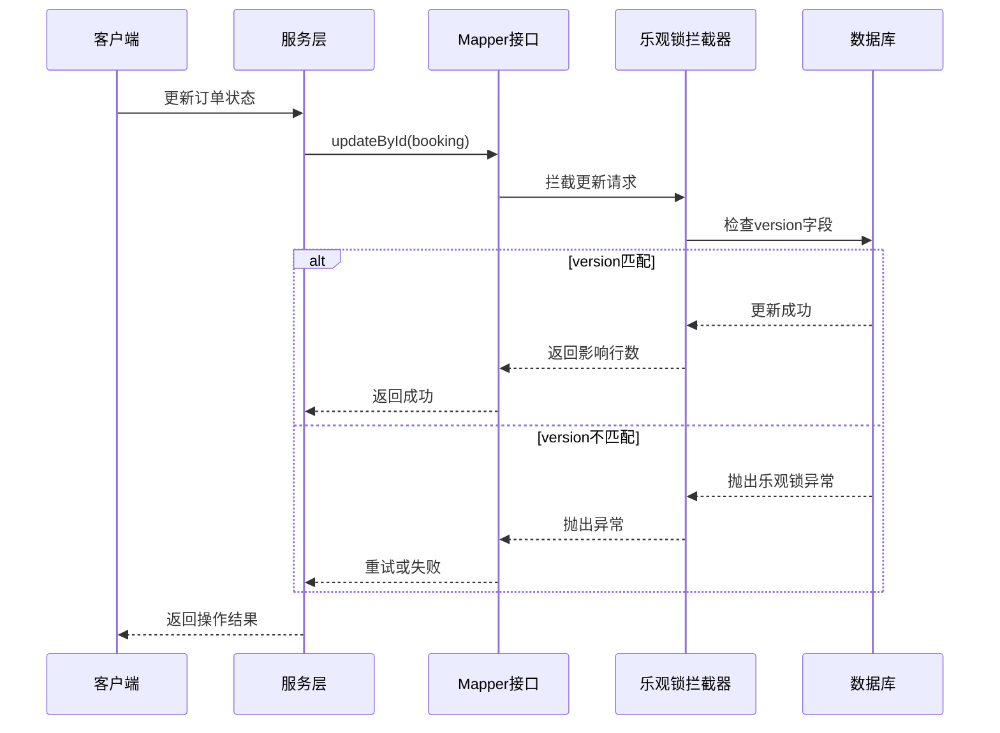

# 数据访问层

<cite>
**本文档引用的文件**
- [MybatisPlusConfig.java](file://backend/src/main/java/com/carwash/config/MybatisPlusConfig.java)
- [User.java](file://backend/src/main/java/com/carwash/entity/User.java)
- [Booking.java](file://backend/src/main/java/com/carwash/entity/Booking.java)
- [UserMapper.java](file://backend/src/main/java/com/carwash/mapper/UserMapper.java)
- [BookingMapper.java](file://backend/src/main/java/com/carwash/mapper/BookingMapper.java)
- [TimeUtils.java](file://backend/src/main/java/com/carwash/utils/TimeUtils.java)
- [PaymentMapper.xml](file://backend/src/main/resources/mapper/PaymentMapper.xml)
- [CarwashApplication.java](file://backend/src/main/java/com/carwash/CarwashApplication.java)
</cite>

## 目录
1. [简介](#简介)
2. [项目结构概览](#项目结构概览)
3. [MyBatis Plus核心配置](#mybatis-plus核心配置)
4. [自动填充处理器详解](#自动填充处理器详解)
5. [分页插件配置与应用](#分页插件配置与应用)
6. [乐观锁插件实现原理](#乐观锁插件实现原理)
7. [实体类与映射关系](#实体类与映射关系)
8. [Mapper接口设计模式](#mapper接口设计模式)
9. [XML映射文件与注解混合使用](#xml映射文件与注解混合使用)
10. [CRUD操作简化实现](#crud操作简化实现)
11. [实际应用场景示例](#实际应用场景示例)
12. [性能优化与最佳实践](#性能优化与最佳实践)
13. [总结](#总结)

## 简介

MyBatis Plus是MyBatis的增强版框架，在保留MyBatis原有功能的基础上，提供了更强大的功能和更简洁的开发体验。在汽车洗车服务预约系统中，MyBatis Plus被广泛应用于数据访问层，通过其内置的插件系统、自动填充、分页等功能，大大简化了数据库操作的复杂度。

本文档将深入解析MyBatis Plus在项目中的集成配置，重点说明核心插件的配置原理和使用方法，展示如何通过注解和XML映射文件实现灵活的数据访问策略。

## 项目结构概览

汽车洗车服务预约系统的数据访问层采用分层架构设计，主要包含以下核心组件：



**图表来源**
- [MybatisPlusConfig.java](file://backend/src/main/java/com/carwash/config/MybatisPlusConfig.java#L22-L70)
- [User.java](file://backend/src/main/java/com/carwash/entity/User.java#L15-L190)
- [Booking.java](file://backend/src/main/java/com/carwash/entity/Booking.java#L17-L333)

## MyBatis Plus核心配置

### 配置类结构分析

MyBatis Plus的核心配置通过`MybatisPlusConfig`类实现，该类负责注册和配置所有必要的拦截器和处理器。



**图表来源**
- [MybatisPlusConfig.java](file://backend/src/main/java/com/carwash/config/MybatisPlusConfig.java#L29-L43)

### 核心配置要点

1. **拦截器注册机制**：通过`@Bean`注解将`MybatisPlusInterceptor`注册为Spring Bean
2. **插件组合策略**：在一个拦截器实例中组合多个功能插件
3. **配置灵活性**：支持动态调整各插件的行为参数

**章节来源**
- [MybatisPlusConfig.java](file://backend/src/main/java/com/carwash/config/MybatisPlusConfig.java#L29-L43)

## 自动填充处理器详解

### 实现原理

MyBatis Plus的自动填充处理器通过实现`MetaObjectHandler`接口，利用反射机制自动填充实体类中的特定字段。



**图表来源**
- [MybatisPlusConfig.java](file://backend/src/main/java/com/carwash/config/MybatisPlusConfig.java#L52-L68)
- [TimeUtils.java](file://backend/src/main/java/com/carwash/utils/TimeUtils.java#L45-L47)

### 时间字段自动填充策略

系统通过统一的时间工具类`TimeUtils`确保时间数据的一致性：

| 字段名称 | 填充时机 | 数据类型 | 填充内容 |
|---------|---------|---------|---------|
| createTime | 插入时 | LocalDateTime | 当前系统时间 |
| updateTime | 插入和更新时 | LocalDateTime | 当前系统时间 |
| createdAt | 插入时 | LocalDateTime | 当前系统时间 |
| updatedAt | 插入和更新时 | LocalDateTime | 当前系统时间 |

### 时间工具类优势

1. **统一时间源**：通过`TimeUtils.now()`确保所有时间字段使用相同的时间基准
2. **时区一致性**：默认使用中国标准时间(Asia/Shanghai)，避免时区差异问题
3. **格式标准化**：提供多种时间格式化选项，满足不同场景需求

**章节来源**
- [MybatisPlusConfig.java](file://backend/src/main/java/com/carwash/config/MybatisPlusConfig.java#L52-L68)
- [TimeUtils.java](file://backend/src/main/java/com/carwash/utils/TimeUtils.java#L45-L47)

## 分页插件配置与应用

### 分页插件配置详解

分页插件是MyBatis Plus的重要功能之一，通过`PaginationInnerInterceptor`实现数据库级别的分页查询。



**图表来源**
- [MybatisPlusConfig.java](file://backend/src/main/java/com/carwash/config/MybatisPlusConfig.java#L33-L36)

### 分页配置参数

| 参数名称 | 默认值 | 说明 | 配置影响 |
|---------|-------|------|---------|
| maxLimit | 500L | 单页最大记录数限制 | 防止大数据量查询导致性能问题 |
| overflow | false | 溢出总页数后的处理策略 | 控制超出限制时的行为 |

### 分页查询实际应用

系统中的分页查询主要体现在以下几个方面：

1. **用户订单查询**：`BookingMapper.selectUserBookings()`
2. **服务列表查询**：`ServiceMapper.getAvailableServices()`
3. **反馈信息查询**：`FeedbackMapper.selectUserFeedback()`
4. **支付记录查询**：`PaymentMapper.selectByUserId()`

**章节来源**
- [MybatisPlusConfig.java](file://backend/src/main/java/com/carwash/config/MybatisPlusConfig.java#L33-L36)
- [BookingMapper.java](file://backend/src/main/java/com/carwash/mapper/BookingMapper.java#L28-L29)

## 乐观锁插件实现原理

### 乐观锁机制概述

乐观锁通过版本号字段实现并发控制，避免悲观锁带来的性能开销。当多个用户同时更新同一记录时，只有第一个成功的事务能够提交更改。



**图表来源**
- [MybatisPlusConfig.java](file://backend/src/main/java/com/carwash/config/MybatisPlusConfig.java#L40)

### 乐观锁插件特性

1. **透明性**：无需在业务代码中显式处理版本号
2. **自动重试**：插件自动处理并发冲突
3. **性能优化**：避免数据库锁等待，提高并发性能

### 应用场景

乐观锁插件主要用于以下场景：
- 订单状态更新
- 用户信息修改
- 系统配置更新
- 服务信息维护

**章节来源**
- [MybatisPlusConfig.java](file://backend/src/main/java/com/carwash/config/MybatisPlusConfig.java#L40)

## 实体类与映射关系

### 实体类设计原则

系统中的实体类遵循以下设计原则：



**图表来源**
- [User.java](file://backend/src/main/java/com/carwash/entity/User.java#L15-L190)
- [Booking.java](file://backend/src/main/java/com/carwash/entity/Booking.java#L17-L333)

### 注解配置详解

| 注解类型 | 主要用途 | 配置示例 | 作用说明 |
|---------|---------|---------|---------|
| @TableName | 表名映射 | `@TableName("users")` | 指定实体对应的数据库表 |
| @TableId | 主键标识 | `@TableId(value = "id", type = IdType.AUTO)` | 配置主键生成策略 |
| @TableField | 字段映射 | `@TableField("username")` | 指定数据库字段名 |
| @TableLogic | 逻辑删除 | `@TableLogic` | 配置软删除字段 |
| @FieldFill | 自动填充 | `@TableField(fill = FieldFill.INSERT)` | 配置自动填充策略 |

**章节来源**
- [User.java](file://backend/src/main/java/com/carwash/entity/User.java#L17-L91)
- [Booking.java](file://backend/src/main/java/com/carwash/entity/Booking.java#L19-L153)

## Mapper接口设计模式

### 接口继承体系

MyBatis Plus采用泛型接口设计，通过继承`BaseMapper<T>`获得基础CRUD功能：



**图表来源**
- [UserMapper.java](file://backend/src/main/java/com/carwash/mapper/UserMapper.java#L15-L73)
- [BookingMapper.java](file://backend/src/main/java/com/carwash/mapper/BookingMapper.java#L22-L108)

### 注解方式的优势

1. **简洁性**：减少XML配置文件的数量
2. **可读性**：SQL语句直接嵌入Java代码中
3. **编译检查**：利用Java编译器进行语法检查
4. **IDE支持**：获得更好的代码补全和重构支持

### SQL注解类型

| 注解类型 | 主要用途 | 示例场景 |
|---------|---------|---------|
| @Select | 查询语句 | 根据条件查询单个或多个记录 |
| @Insert | 插入语句 | 新增记录到数据库 |
| @Update | 更新语句 | 更新现有记录 |
| @Delete | 删除语句 | 删除记录（物理或逻辑） |

**章节来源**
- [UserMapper.java](file://backend/src/main/java/com/carwash/mapper/UserMapper.java#L15-L73)
- [BookingMapper.java](file://backend/src/main/java/com/carwash/mapper/BookingMapper.java#L22-L108)

## XML映射文件与注解混合使用

### 混合使用策略

系统采用注解和XML映射文件相结合的方式，根据具体需求选择最适合的实现方式：

```mermaid
graph TB
subgraph "注解方式"
AnnotationSimple[简单查询<br/>@Select/@Update]
AnnotationDynamic[动态条件<br/>@SelectProvider]
AnnotationBatch[批量操作<br/>@InsertProvider]
end
subgraph "XML方式"
XMLComplex[复杂查询<br/>多表联结]
XMLAggregation[聚合统计<br/>GROUP BY/HAVING]
XMLProcedure[存储过程<br/>CALL]
end
subgraph "混合应用"
PaymentMapper[PaymentMapper.xml<br/>复杂支付查询]
FeedbackMapper[FeedbackMapper.xml<br/>统计报表]
end
AnnotationSimple --> PaymentMapper
AnnotationDynamic --> PaymentMapper
AnnotationBatch --> PaymentMapper
XMLComplex --> PaymentMapper
XMLAggregation --> PaymentMapper
XMLProcedure --> PaymentMapper
```

**图表来源**
- [PaymentMapper.xml](file://backend/src/main/resources/mapper/PaymentMapper.xml#L1-L106)

### XML映射文件特点

1. **复杂SQL支持**：适合处理复杂的多表联结和子查询
2. **可读性强**：SQL语句集中管理，便于维护
3. **性能优化**：支持SQL片段复用和动态SQL构建
4. **调试友好**：可以直接在数据库客户端测试

### 混合使用最佳实践

| 场景 | 推荐方式 | 原因 |
|------|---------|------|
| 简单CRUD | 注解方式 | 代码简洁，易于维护 |
| 复杂查询 | XML方式 | SQL清晰，便于优化 |
| 动态条件 | 注解+Provider | 平衡灵活性和可读性 |
| 统计报表 | XML方式 | 复杂聚合函数，XML更合适 |

**章节来源**
- [PaymentMapper.xml](file://backend/src/main/resources/mapper/PaymentMapper.xml#L1-L106)

## CRUD操作简化实现

### 基础CRUD操作

通过继承`BaseMapper<T>`，系统获得了完整的CRUD功能：



### 特殊操作实现

1. **逻辑删除**：通过`@TableLogic`注解实现软删除
2. **批量操作**：利用MyBatis Plus提供的批量方法
3. **条件查询**：支持复杂的查询条件构建
4. **排序分页**：内置分页和排序功能

**章节来源**
- [UserMapper.java](file://backend/src/main/java/com/carwash/mapper/UserMapper.java#L15-L73)
- [BookingMapper.java](file://backend/src/main/java/com/carwash/mapper/BookingMapper.java#L22-L108)

## 实际应用场景示例

### 分页查询示例

系统中的分页查询展示了MyBatis Plus的强大功能：



**图表来源**
- [BookingMapper.java](file://backend/src/main/java/com/carwash/mapper/BookingMapper.java#L28-L29)

### 乐观锁更新示例

订单状态更新展示了乐观锁的应用：



**图表来源**
- [BookingMapper.java](file://backend/src/main/java/com/carwash/mapper/BookingMapper.java#L52-L53)

### 自动填充应用示例

时间字段的自动填充展示了统一时间管理的优势：

| 操作类型 | 影响字段 | 填充内容 | 时间来源 |
|---------|---------|---------|---------|
| 用户注册 | createTime, updateTime, createdAt, updatedAt | 当前系统时间 | TimeUtils.now() |
| 订单创建 | createTime, updateTime, createdAt, updatedAt | 当前系统时间 | TimeUtils.now() |
| 信息更新 | updateTime, updatedAt | 当前系统时间 | TimeUtils.now() |

**章节来源**
- [MybatisPlusConfig.java](file://backend/src/main/java/com/carwash/config/MybatisPlusConfig.java#L52-L68)

## 性能优化与最佳实践

### 性能优化策略

1. **分页限制**：设置合理的最大分页数量（500条），防止大数据量查询
2. **索引优化**：在常用查询字段上建立适当的索引
3. **批量操作**：对于大量数据操作，使用批量插入和更新
4. **缓存策略**：结合Redis等缓存技术，减少数据库访问频率

### 最佳实践建议

1. **合理使用注解**：简单查询使用注解，复杂查询使用XML
2. **统一时间管理**：通过TimeUtils确保时间数据一致性
3. **适度使用自动填充**：避免过度依赖自动填充，保持数据可追溯性
4. **监控性能指标**：定期监控SQL执行时间和数据库连接池使用情况

### 常见问题预防

1. **分页越界**：设置合理的最大分页限制，避免内存溢出
2. **并发冲突**：使用乐观锁处理高并发场景下的数据竞争
3. **时间同步**：通过统一的时间工具类确保系统时间一致性
4. **资源泄漏**：正确关闭数据库连接，避免连接池耗尽

## 总结

MyBatis Plus在汽车洗车服务预约系统中的成功应用，展现了现代ORM框架的强大功能和灵活性。通过合理的配置和设计，系统实现了：

1. **开发效率提升**：通过自动填充、分页、乐观锁等功能，大幅减少了样板代码
2. **数据一致性保障**：统一的时间管理和自动填充机制确保了数据的准确性
3. **性能优化**：分页限制和乐观锁机制有效提升了系统性能
4. **可维护性增强**：注解和XML混合使用的策略平衡了灵活性和可读性

这种架构设计不仅满足了当前业务需求，也为未来的功能扩展和性能优化奠定了坚实的基础。通过持续的监控和优化，系统能够稳定高效地支撑业务发展。