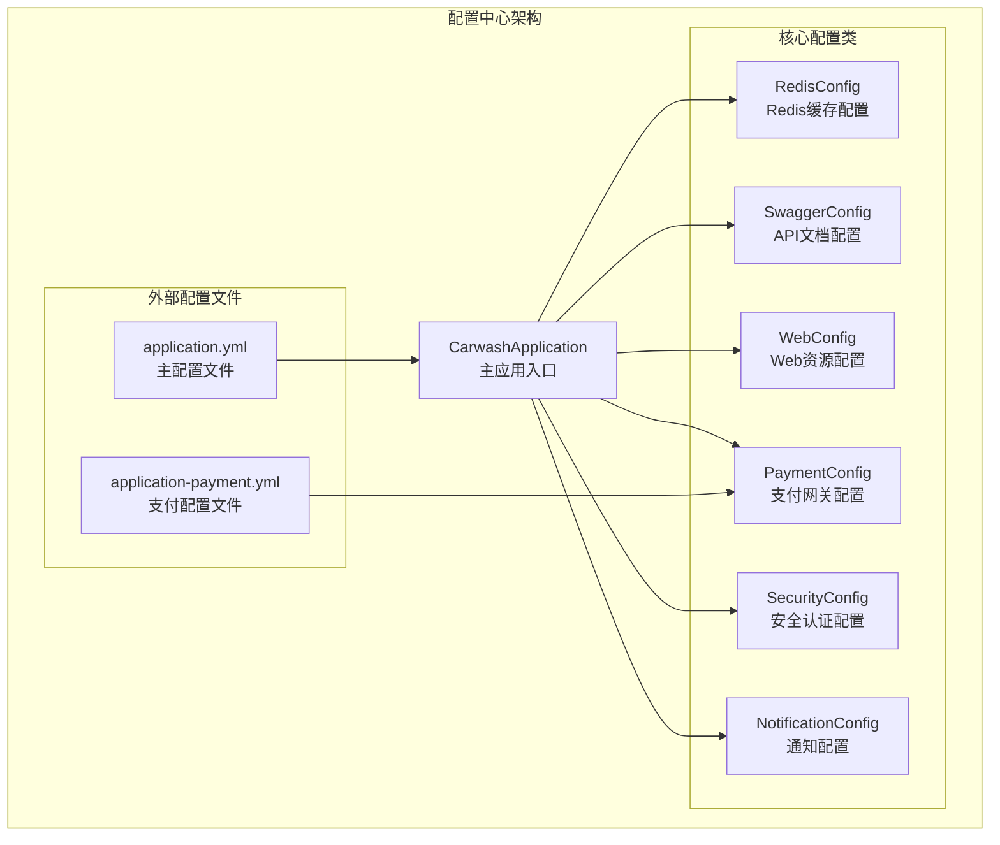
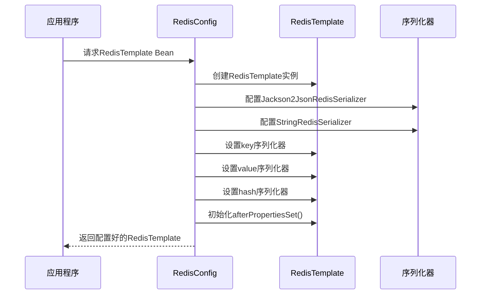
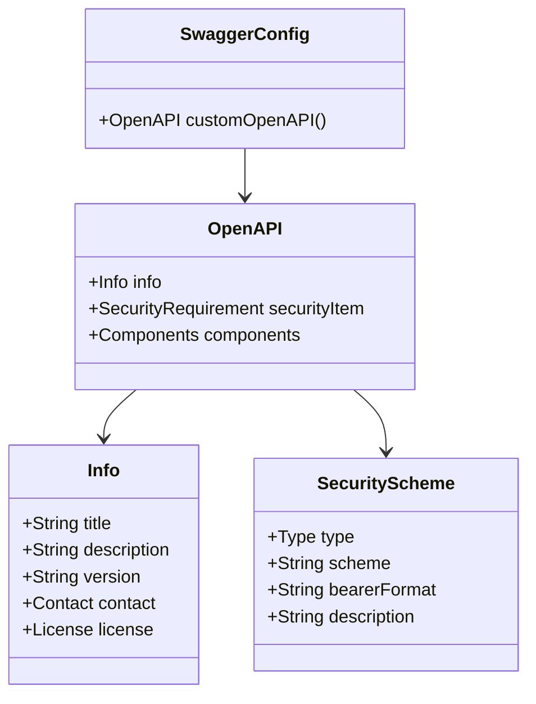
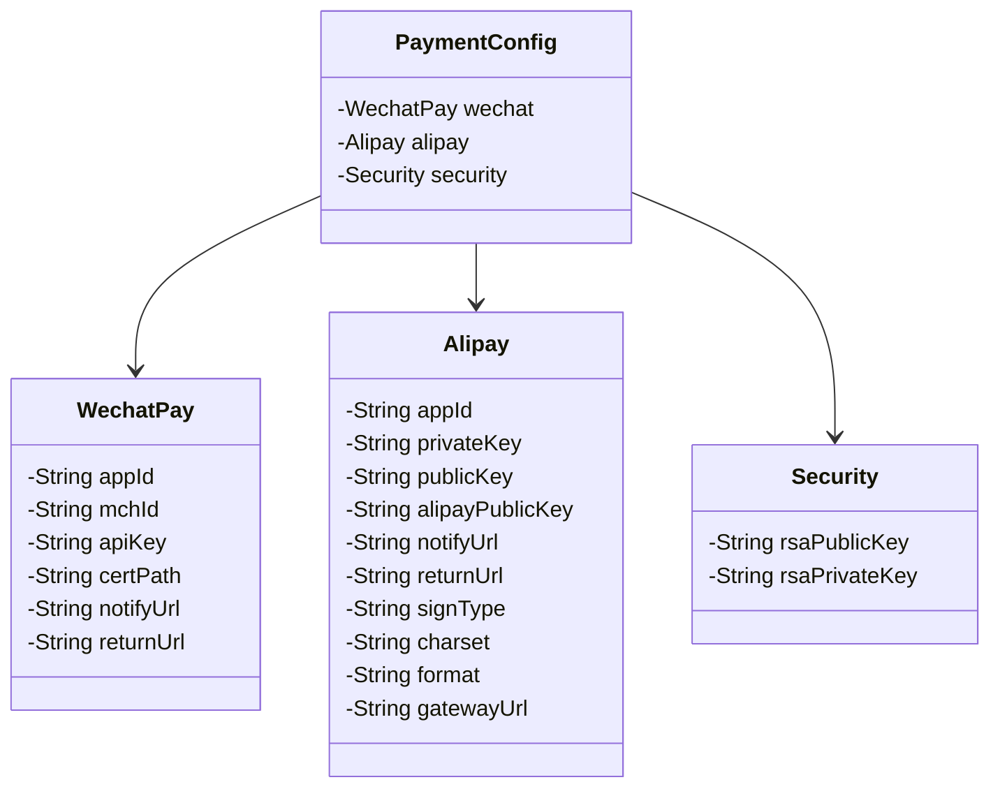
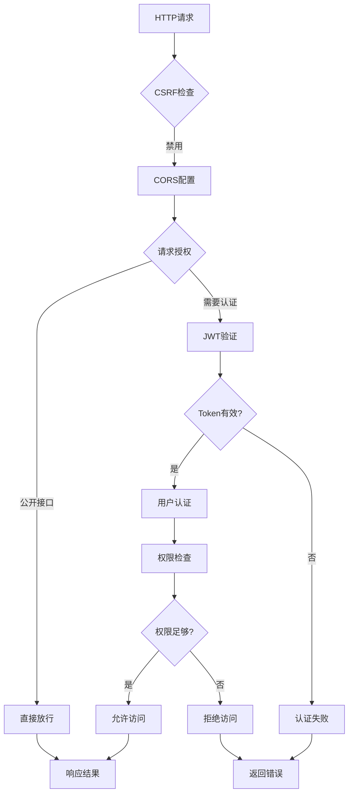
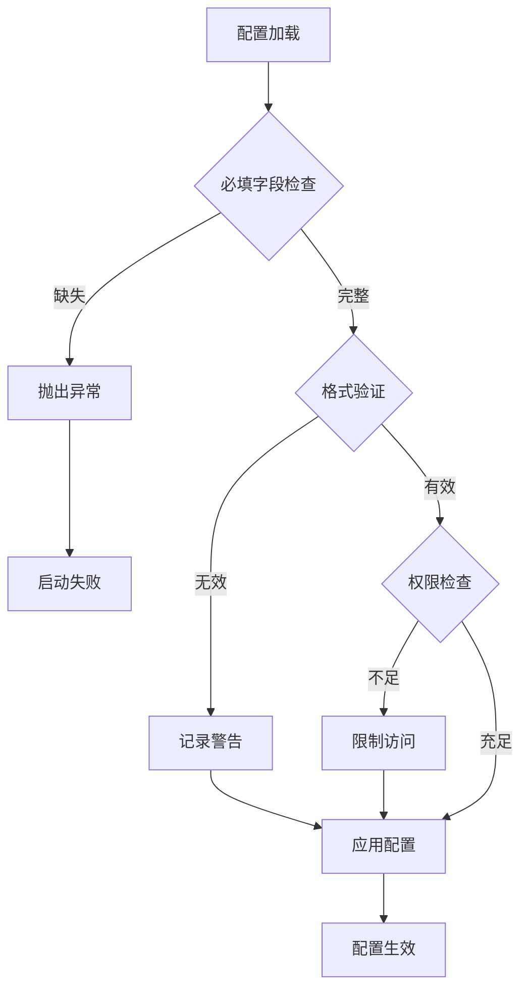

# 配置中心

<cite>
**本文档引用的文件**
- [RedisConfig.java](file://backend/src/main/java/com/carwash/config/RedisConfig.java)
- [SwaggerConfig.java](file://backend/src/main/java/com/carwash/config/SwaggerConfig.java)
- [WebConfig.java](file://backend/src/main/java/com/carwash/config/WebConfig.java)
- [PaymentConfig.java](file://backend/src/main/java/com/carwash/config/PaymentConfig.java)
- [SecurityConfig.java](file://backend/src/main/java/com/carwash/config/SecurityConfig.java)
- [NotificationConfig.java](file://backend/src/main/java/com/carwash/config/NotificationConfig.java)
- [application.yml](file://backend/src/main/resources/application.yml)
- [application-payment.yml](file://backend/src/main/resources/application-payment.yml)
- [CarwashApplication.java](file://backend/src/main/java/com/carwash/CarwashApplication.java)
</cite>

## 目录
1. [引言](#引言)
2. [项目结构概述](#项目结构概述)
3. [核心配置组件](#核心配置组件)
4. [架构概览](#架构概览)
5. [详细组件分析](#详细组件分析)
6. [配置优先级与Profile管理](#配置优先级与profile管理)
7. [安全配置最佳实践](#安全配置最佳实践)
8. [故障排除指南](#故障排除指南)
9. [总结](#总结)

## 引言

Spring Boot配置中心是汽车洗车服务预约系统的核心基础设施，负责管理系统的所有配置参数、外部化配置管理和安全控制。该配置中心采用分层架构设计，通过多个专门的配置类实现不同功能模块的配置管理，确保系统的可维护性、可扩展性和安全性。

## 项目结构概述

配置中心采用模块化设计，每个配置类专注于特定的功能领域：



**图表来源**
- [CarwashApplication.java](file://backend/src/main/java/com/carwash/CarwashApplication.java#L1-L23)
- [RedisConfig.java](file://backend/src/main/java/com/carwash/config/RedisConfig.java#L1-L56)
- [SwaggerConfig.java](file://backend/src/main/java/com/carwash/config/SwaggerConfig.java#L1-L48)

## 核心配置组件

### 配置组件分类

| 配置类 | 功能描述 | 主要职责 | 配置文件依赖 |
|--------|----------|----------|--------------|
| RedisConfig | Redis缓存配置 | 序列化器配置、模板初始化 | 内置 |
| SwaggerConfig | API文档配置 | OpenAPI 3.0文档生成 | 内置 |
| WebConfig | Web资源配置 | 静态资源映射、资源处理器 | 内置 |
| PaymentConfig | 支付网关配置 | 敏感信息外部化管理 | application-payment.yml |
| SecurityConfig | 安全认证配置 | JWT认证、CORS、权限控制 | 内置 |
| NotificationConfig | 通知配置 | 多渠道通知开关管理 | application.yml |

**节来源**
- [RedisConfig.java](file://backend/src/main/java/com/carwash/config/RedisConfig.java#L1-L56)
- [SwaggerConfig.java](file://backend/src/main/java/com/carwash/config/SwaggerConfig.java#L1-L48)
- [WebConfig.java](file://backend/src/main/java/com/carwash/config/WebConfig.java#L1-L39)
- [PaymentConfig.java](file://backend/src/main/java/com/carwash/config/PaymentConfig.java#L1-L225)
- [SecurityConfig.java](file://backend/src/main/java/com/carwash/config/SecurityConfig.java#L1-L133)
- [NotificationConfig.java](file://backend/src/main/java/com/carwash/config/NotificationConfig.java#L1-L202)

## 架构概览

配置中心采用分层架构模式，实现了配置的集中管理和外部化：

```mermaid
graph TD
subgraph "配置层次结构"
A[应用启动层<br/>CarwashApplication] --> B[配置加载层<br/>Spring Boot自动配置]
B --> C[配置解析层<br/>@ConfigurationProperties]
C --> D[配置应用层<br/>各业务配置类]
subgraph "配置来源"
E[application.yml<br/>主配置文件]
F[application-payment.yml<br/>支付配置文件]
G[环境变量<br/>系统属性]
H[命令行参数<br/>启动参数]
end
E --> C
F --> C
G --> C
H --> C
end
subgraph "配置应用流程"
I[配置验证] --> J[配置注入]
J --> K[业务使用]
K --> L[运行时配置]
end
D --> I
```

**图表来源**
- [CarwashApplication.java](file://backend/src/main/java/com/carwash/CarwashApplication.java#L13-L22)
- [application.yml](file://backend/src/main/resources/application.yml#L1-L92)
- [application-payment.yml](file://backend/src/main/resources/application-payment.yml#L1-L34)

## 详细组件分析

### RedisConfig - Redis缓存配置

RedisConfig通过自定义RedisTemplate解决了Java对象序列化的乱码问题，确保Redis存储的键值对能够正确序列化和反序列化。

#### 核心特性

1. **Jackson2JsonRedisSerializer配置**
   - 使用Jackson2JsonRedisSerializer处理Redis value序列化
   - 配置ObjectMapper支持Java对象序列化
   - 启用默认类型识别机制

2. **StringRedisSerializer配置**
   - 使用StringRedisSerializer处理Redis key序列化
   - 确保key的字符串格式一致性

3. **哈希结构序列化**
   - 特别配置了hash key和value的序列化规则
   - 确保Redis hash结构的键值对正确存储



**图表来源**
- [RedisConfig.java](file://backend/src/main/java/com/carwash/config/RedisConfig.java#L28-L55)

**节来源**
- [RedisConfig.java](file://backend/src/main/java/com/carwash/config/RedisConfig.java#L28-L55)

### SwaggerConfig - API文档配置

SwaggerConfig启用OpenAPI 3.0规范，生成交互式的API文档，为开发者提供完整的API参考。

#### 主要功能

1. **OpenAPI 3.0文档生成**
   - 配置API基本信息（标题、描述、版本）
   - 设置联系人信息和许可证
   - 集成JWT Bearer认证机制

2. **安全配置集成**
   - 配置Bearer Authentication安全方案
   - 设置JWT token格式要求
   - 提供认证说明文档



**图表来源**
- [SwaggerConfig.java](file://backend/src/main/java/com/carwash/config/SwaggerConfig.java#L25-L47)

**节来源**
- [SwaggerConfig.java](file://backend/src/main/java/com/carwash/config/SwaggerConfig.java#L25-L47)

### WebConfig - Web资源配置

WebConfig负责静态资源的映射和处理，确保前端资源和Swagger UI能够正确访问。

#### 静态资源映射策略

| 资源类型 | 映射路径 | 存储位置 | 用途 |
|----------|----------|----------|------|
| Swagger UI | `/doc.html` | classpath:/META-INF/resources/ | Swagger文档界面 |
| WebJars | `/webjars/**` | classpath:/META-INF/resources/webjars/ | 第三方库资源 |
| Swagger资源 | `/swagger-resources/**` | classpath:/META-INF/resources/swagger-resources/ | Swagger元数据 |
| API文档 | `/v3/api-docs/**` | classpath:/META-INF/resources/v3/api-docs/ | OpenAPI规范文档 |
| 上传文件 | `/uploads/**` | file:uploads/ | 用户上传文件 |

**节来源**
- [WebConfig.java](file://backend/src/main/java/com/carwash/config/WebConfig.java#L20-L38)

### PaymentConfig - 支付网关配置

PaymentConfig通过@ConfigurationProperties注解实现支付相关配置的外部化管理，支持微信支付和支付宝两种支付方式。

#### 配置结构设计



**图表来源**
- [PaymentConfig.java](file://backend/src/main/java/com/carwash/config/PaymentConfig.java#L11-L225)

#### 敏感信息管理

1. **外部化配置**
   - 支付密钥存储在独立的application-payment.yml文件中
   - 避免敏感信息硬编码在主配置文件中

2. **配置前缀管理**
   - 使用`payment`前缀区分支付相关配置
   - 支持多层级配置结构

3. **类型安全访问**
   - 通过getter/setter方法访问配置属性
   - 利用Lombok简化代码

**节来源**
- [PaymentConfig.java](file://backend/src/main/java/com/carwash/config/PaymentConfig.java#L11-L225)
- [application-payment.yml](file://backend/src/main/resources/application-payment.yml#L1-L34)

### SecurityConfig - 安全认证配置

SecurityConfig实现了基于JWT的认证授权机制，提供了完整的安全控制策略。

#### 安全特性

1. **JWT认证机制**
   - 集成JWT Authentication Filter
   - 配置JWT异常处理机制
   - 实现无状态会话管理

2. **CORS跨域配置**
   - 统一CORS配置管理
   - 支持预检请求缓存
   - 允许凭据传输

3. **权限控制策略**
   - 基于角色的访问控制（RBAC）
   - 方法级别的安全注解支持
   - 公开接口白名单管理



**图表来源**
- [SecurityConfig.java](file://backend/src/main/java/com/carwash/config/SecurityConfig.java#L60-L102)

**节来源**
- [SecurityConfig.java](file://backend/src/main/java/com/carwash/config/SecurityConfig.java#L30-L133)

## 配置优先级与Profile管理

### 配置优先级层次

Spring Boot配置系统遵循以下优先级顺序（从高到低）：

1. **命令行参数** - 最高优先级
2. **环境变量** - 高优先级
3. **Profile特定配置文件** - 中等优先级
4. **通用配置文件** - 较低优先级
5. **默认配置** - 最低优先级

### Profile激活策略

系统支持多种Profile激活方式：

| 激活方式 | 示例 | 用途 |
|----------|------|------|
| 命令行参数 | `--spring.profiles.active=prod` | 开发环境切换 |
| 环境变量 | `SPRING_PROFILES_ACTIVE=dev` | 生产环境部署 |
| 配置文件 | `spring.profiles.active=dev` | 默认Profile设置 |
| 默认Profile | `application.yml` | 基础配置 |

### Profile特定配置

```yaml
# application-dev.yml
spring:
  profiles:
    active: dev
  
server:
  port: 8080

# application-prod.yml  
spring:
  profiles:
    active: prod
  
server:
  port: 8081
```

### 配置文件包含机制

通过`spring.profiles.include`实现配置文件的组合：

```yaml
spring:
  profiles:
    include: payment,monitoring
```

**节来源**
- [application.yml](file://backend/src/main/resources/application.yml#L7-L8)

## 安全配置最佳实践

### 敏感信息保护

1. **配置文件分离**
   - 将敏感配置（如数据库密码、API密钥）放在独立配置文件中
   - 使用`.gitignore`排除敏感配置文件
   - 实施配置文件权限控制

2. **环境变量注入**
   ```bash
   export DATABASE_PASSWORD="secure_password"
   java -jar app.jar --spring.datasource.password=${DATABASE_PASSWORD}
   ```

3. **配置加密**
   - 使用Jasypt等工具对敏感配置进行加密
   - 实施密钥管理策略
   - 定期轮换加密密钥

### 配置验证机制



### 安全配置检查清单

- [ ] 所有敏感配置都使用外部化配置
- [ ] 配置文件权限设置为600或更严格
- [ ] 生产环境禁用调试配置
- [ ] 实施配置审计日志
- [ ] 定期审查配置权限

## 故障排除指南

### 常见配置问题

1. **Redis序列化问题**
   - 症状：Redis存储出现乱码
   - 解决方案：检查RedisConfig中的序列化器配置
   - 验证方法：使用Redis客户端手动验证序列化结果

2. **API文档无法访问**
   - 症状：Swagger UI显示空白或404错误
   - 解决方案：检查WebConfig中的静态资源映射
   - 验证方法：直接访问`/v3/api-docs`端点

3. **支付配置加载失败**
   - 症状：支付功能不可用
   - 解决方案：检查application-payment.yml文件格式和内容
   - 验证方法：在PaymentConfig中添加日志输出

### 配置调试技巧

1. **启用配置调试日志**
   ```yaml
   logging:
     level:
       org.springframework.boot.context.config: DEBUG
   ```

2. **配置属性可视化**
   ```bash
   curl http://localhost:8080/actuator/configprops
   ```

3. **健康检查监控**
   ```bash
   curl http://localhost:8080/actuator/health
   ```

**节来源**
- [RedisConfig.java](file://backend/src/main/java/com/carwash/config/RedisConfig.java#L28-L55)
- [WebConfig.java](file://backend/src/main/java/com/carwash/config/WebConfig.java#L20-L38)
- [application-payment.yml](file://backend/src/main/resources/application-payment.yml#L1-L34)

## 总结

汽车洗车服务预约系统的配置中心设计体现了现代Spring Boot应用的最佳实践：

### 设计优势

1. **模块化架构** - 每个配置类专注于特定功能领域，便于维护和扩展
2. **外部化配置** - 敏感信息和业务配置分离，提高安全性
3. **类型安全** - 使用@ConfigurationProperties提供编译时类型检查
4. **灵活配置** - 支持Profile和环境变量，适应不同部署环境
5. **安全保障** - 集成JWT认证和CORS配置，提供完整的安全控制

### 技术亮点

- **Redis序列化优化** - 解决Java对象存储乱码问题
- **API文档自动化** - 自动生成交互式API文档
- **支付配置管理** - 实现多支付网关的统一配置管理
- **安全认证集成** - 提供完整的JWT认证和授权机制

### 扩展建议

1. **配置中心集成** - 考虑引入Spring Cloud Config实现分布式配置管理
2. **配置热更新** - 实现配置的动态刷新机制
3. **配置版本控制** - 建立配置变更的版本管理和回滚机制
4. **监控告警** - 添加配置异常的监控和告警功能

该配置中心为汽车洗车服务预约系统提供了坚实的基础架构，确保了系统的可维护性、可扩展性和安全性，为后续功能扩展奠定了良好的基础。