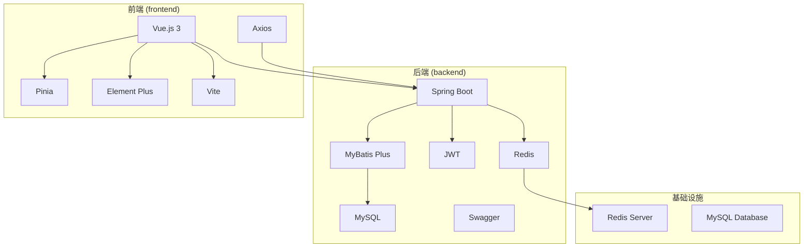
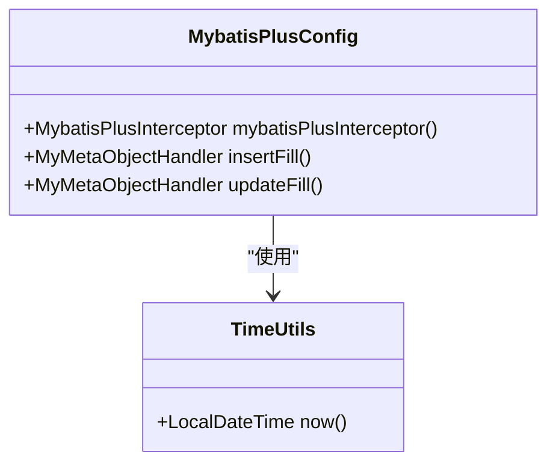
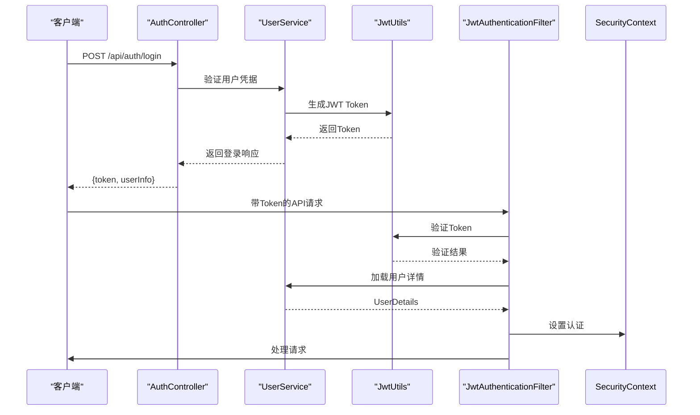
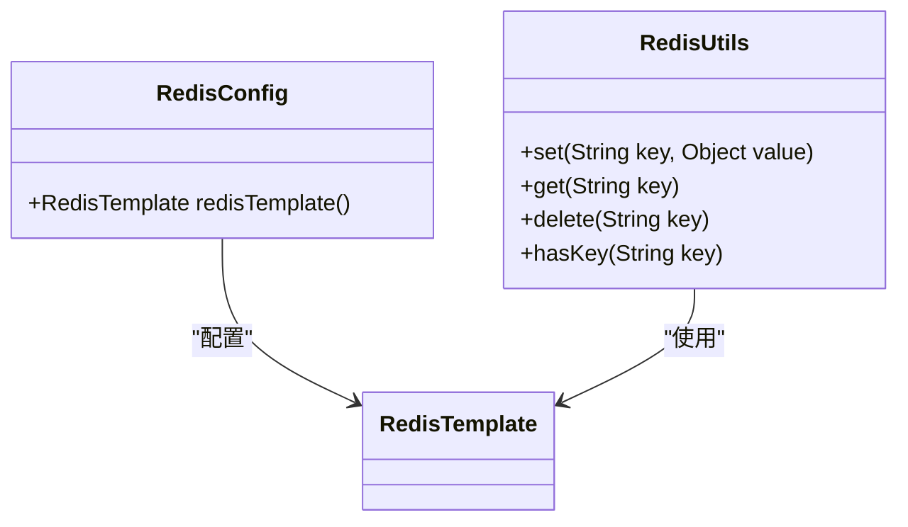
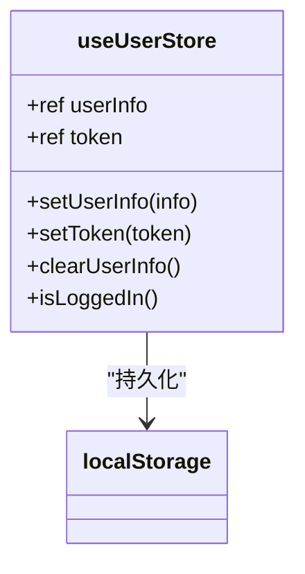
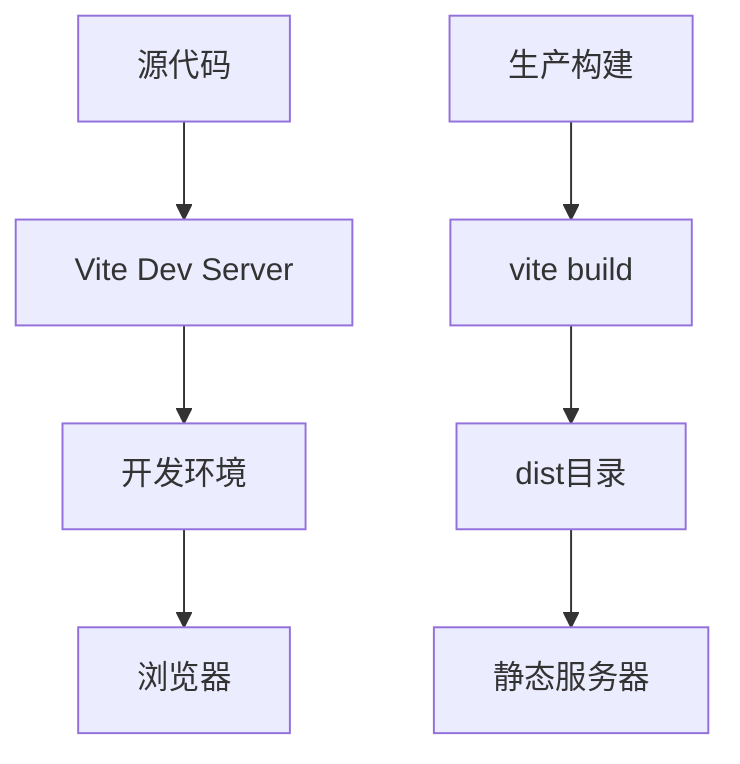
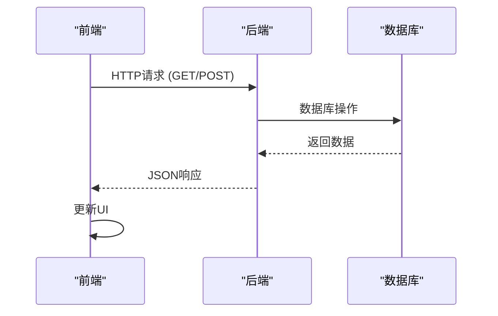

# 技术栈与架构

<cite>
**本文档中引用的文件**  
- [pom.xml](file://backend/pom.xml)
- [package.json](file://frontend/package.json)
- [CarwashApplication.java](file://backend/src/main/java/com/carwash/CarwashApplication.java)
- [main.js](file://frontend/src/main.js)
- [vite.config.js](file://frontend/vite.config.js)
- [SecurityConfig.java](file://backend/src/main/java/com/carwash/config/SecurityConfig.java)
- [MybatisPlusConfig.java](file://backend/src/main/java/com/carwash/config/MybatisPlusConfig.java)
- [RedisConfig.java](file://backend/src/main/java/com/carwash/config/RedisConfig.java)
- [JwtAuthenticationFilter.java](file://backend/src/main/java/com/carwash/common/JwtAuthenticationFilter.java)
- [user.js](file://frontend/src/stores/user.js)
- [request.js](file://frontend/src/api/request.js)
- [AuthController.java](file://backend/src/main/java/com/carwash/controller/AuthController.java)
- [application-payment.yml](file://backend/src/main/resources/application-payment.yml)
- [index.js](file://frontend/src/router/index.js)
</cite>

## 目录
1. [简介](#简介)
2. [项目结构](#项目结构)
3. [后端技术栈](#后端技术栈)
4. [前端技术栈](#前端技术栈)
5. [前后端分离架构](#前后端分离架构)
6. [技术选型理由与版本兼容性](#技术选型理由与版本兼容性)

## 简介
本系统为汽车洗车服务预约系统，采用前后端分离架构，后端基于Spring Boot框架构建RESTful API服务，前端使用Vue.js 3实现响应式用户界面。系统集成了JWT身份认证、Redis缓存、MySQL持久化存储等核心技术，支持多支付渠道集成。整体架构设计注重安全性、可扩展性和用户体验。

## 项目结构

**图示来源**  
- [pom.xml](file://backend/pom.xml)
- [package.json](file://frontend/package.json)

## 后端技术栈

### Spring Boot框架应用
系统后端采用Spring Boot 3.1.5版本作为核心框架，通过`@SpringBootApplication`注解实现自动配置和组件扫描。主启动类`CarwashApplication`位于`com.carwash`包下，负责初始化整个应用上下文。

Spring Boot提供了内嵌Tomcat服务器，简化了部署流程，并通过Starter依赖机制集成了Web、Security、Data Redis、Validation、WebSocket等多个模块，实现了开箱即用的开发体验。

**本节来源**  
- [CarwashApplication.java](file://backend/src/main/java/com/carwash/CarwashApplication.java)
- [pom.xml](file://backend/pom.xml)

### MyBatis Plus的ORM机制
系统采用MyBatis Plus作为持久层框架，版本为3.5.3.1，通过`mybatis-plus-boot-starter`与Spring Boot无缝集成。配置类`MybatisPlusConfig`中定义了分页插件和乐观锁插件，提升了数据库操作效率和并发安全性。

实体类通过注解方式映射数据库表结构，Mapper接口继承`BaseMapper`即可获得CRUD基础方法。系统还实现了自动填充功能，在`MyMetaObjectHandler`中利用`TimeUtils.now()`统一处理创建时间和更新时间字段。

**图示来源**  
- [MybatisPlusConfig.java](file://backend/src/main/java/com/carwash/config/MybatisPlusConfig.java)
- [TimeUtils.java](file://backend/src/main/java/com/carwash/utils/TimeUtils.java)

**本节来源**  
- [MybatisPlusConfig.java](file://backend/src/main/java/com/carwash/config/MybatisPlusConfig.java)

### JWT身份认证流程
系统采用JWT（JSON Web Token）实现无状态身份认证，使用`io.jsonwebtoken`库的0.11.5版本。认证流程如下：

1. 用户登录时，`AuthController`验证凭据后调用`UserService.login()`生成JWT token
2. token通过`JwtUtils`工具类签发，包含用户ID、角色等声明信息
3. 后续请求需在Authorization头中携带Bearer Token
4. `JwtAuthenticationFilter`拦截请求，解析并验证token有效性
5. 验证通过后设置Spring Security上下文，完成认证

安全配置类`SecurityConfig`通过`@EnableGlobalMethodSecurity(prePostEnabled = true)`启用方法级权限控制，结合`@PreAuthorize`注解实现细粒度访问控制。

**图示来源**  
- [AuthController.java](file://backend/src/main/java/com/carwash/controller/AuthController.java)
- [UserService.java](file://backend/src/main/java/com/carwash/service/UserService.java)
- [JwtUtils.java](file://backend/src/main/java/com/carwash/utils/JwtUtils.java)
- [JwtAuthenticationFilter.java](file://backend/src/main/java/com/carwash/common/JwtAuthenticationFilter.java)

**本节来源**  
- [SecurityConfig.java](file://backend/src/main/java/com/carwash/config/SecurityConfig.java)
- [JwtAuthenticationFilter.java](file://backend/src/main/java/com/carwash/common/JwtAuthenticationFilter.java)
- [AuthController.java](file://backend/src/main/java/com/carwash/controller/AuthController.java)

### Redis缓存策略
系统集成Spring Data Redis实现缓存功能，通过`RedisConfig`配置类定制序列化策略。采用`StringRedisSerializer`处理key，`Jackson2JsonRedisSerializer`处理value，避免中文乱码问题。

Redis主要用于：
- 用户会话缓存
- 系统配置缓存
- 临时数据存储
- 支付状态缓存

`RedisUtils`工具类封装了常用操作，提供便捷的缓存读写接口。

**图示来源**  
- [RedisConfig.java](file://backend/src/main/java/com/carwash/config/RedisConfig.java)
- [RedisUtils.java](file://backend/src/main/java/com/carwash/common/utils/RedisUtils.java)

**本节来源**  
- [RedisConfig.java](file://backend/src/main/java/com/carwash/config/RedisConfig.java)

### MySQL持久化方案
系统使用MySQL作为主数据库，通过`mysql-connector-j`驱动连接。实体类采用JPA注解描述表结构关系，MyBatis Plus自动生成SQL语句。

数据库设计包含用户、预约、服务、支付、反馈等核心表，通过外键约束维护数据完整性。系统提供初始化脚本`init.sql`和测试数据脚本，确保环境一致性。

## 前端技术栈

### Vue.js 3的Composition API使用
前端采用Vue.js 3作为核心框架，充分利用Composition API组织逻辑代码。在组件中通过`setup()`函数集中管理响应式数据、计算属性和方法，提高代码可读性和复用性。

系统使用`<script setup>`语法糖简化组件定义，结合TypeScript类型推断提升开发体验。例如在`Appointment.vue`中，使用`ref`和`reactive`创建响应式状态，通过`computed`定义派生数据。

**本节来源**  
- [main.js](file://frontend/src/main.js)
- [package.json](file://frontend/package.json)

### Pinia状态管理
系统采用Pinia作为状态管理库（版本2.3.1），替代传统的Vuex。在`stores/user.js`中定义用户状态store，管理用户信息、token等全局状态。

Pinia的优势包括：
- 更简洁的API设计
- 完整的TypeScript支持
- 模块化组织
- 开发者工具集成

用户登录后，token存储在localStorage中，确保页面刷新后状态持久化。

**图示来源**  
- [user.js](file://frontend/src/stores/user.js)

**本节来源**  
- [user.js](file://frontend/src/stores/user.js)

### Element Plus组件库集成
系统集成Element Plus 2.3.8版本作为UI组件库，提供丰富的可视化组件。在`main.js`中全局注册Element Plus及其图标组件，配置中文语言包。

使用的组件包括：
- `ElMessage`：消息提示
- `ElNotification`：通知提醒
- 表单组件：输入框、选择器、日期选择器
- 数据展示：表格、卡片、标签
- 导航组件：菜单、标签页、面包屑

主题通过`themes.css`文件定制，支持暗色模式切换。

**本节来源**  
- [main.js](file://frontend/src/main.js)
- [package.json](file://frontend/package.json)

### Vite构建工具配置
前端使用Vite 4.4.5作为构建工具，提供快速的开发服务器启动和热更新。`vite.config.js`中配置了以下关键选项：

- 别名`@`指向`src`目录，简化模块导入
- 代理设置将`/api`请求转发到后端`http://localhost:8080`
- 构建输出目录为`dist`，资源分类存放
- 测试环境使用jsdom

开发服务器运行在3003端口，与后端8080端口分离，实现前后端独立开发。

**图示来源**  
- [vite.config.js](file://frontend/vite.config.js)

**本节来源**  
- [vite.config.js](file://frontend/vite.config.js)

## 前后端分离架构

### 架构优势
1. **开发独立性**：前后端团队可并行开发，互不影响
2. **技术选型灵活**：各自选择最适合的技术栈
3. **部署灵活性**：可独立部署和扩展
4. **性能优化**：前端可进行代码分割、懒加载等优化
5. **可维护性**：职责分离，代码结构清晰

### 协作关系
前后端通过RESTful API进行通信，遵循以下规范：
- API基础路径为`/api`
- 统一返回JSON格式数据
- 状态码200表示成功，其他表示错误
- 错误信息包含code和message字段

前端`request.js`封装axios实例，统一处理请求拦截、响应拦截、错误提示等逻辑。路由守卫`index.js`实现权限控制，根据用户角色决定页面访问权限。

**图示来源**  
- [request.js](file://frontend/src/api/request.js)
- [index.js](file://frontend/src/router/index.js)

**本节来源**  
- [request.js](file://frontend/src/api/request.js)
- [index.js](file://frontend/src/router/index.js)

## 技术选型理由与版本兼容性

### 后端技术选型
| 技术 | 版本 | 选型理由 |
|------|------|----------|
| Spring Boot | 3.1.5 | 成熟的Java生态，强大的自动配置能力 |
| MyBatis Plus | 3.5.3.1 | 增强MyBatis功能，减少模板代码 |
| JWT | 0.11.5 | 无状态认证，适合分布式系统 |
| Redis | Spring Data Redis | 高性能缓存，支持多种数据结构 |
| MySQL | 8.0+ | 成熟的关系型数据库，事务支持完善 |

### 前端技术选型
| 技术 | 版本 | 选型理由 |
|------|------|----------|
| Vue.js | 3.3.4 | 渐进式框架，学习曲线平缓 |
| Pinia | 2.3.1 | Vue官方推荐，TypeScript支持优秀 |
| Element Plus | 2.3.8 | 完善的组件库，文档丰富 |
| Vite | 4.4.5 | 快速的构建工具，开发体验佳 |
| Axios | 1.12.2 | 可靠的HTTP客户端，拦截器功能强大 |

### 版本兼容性
系统各组件版本经过严格测试，确保兼容性：
- Spring Boot 3.x要求Java 17，项目已配置
- Vue 3与Vite 4完全兼容
- Element Plus 2.x支持Vue 3
- 所有依赖版本在`package.json`和`pom.xml`中明确指定

系统通过`package-lock.json`和`pom.xml`锁定依赖版本，避免因版本冲突导致的问题。

**本节来源**  
- [pom.xml](file://backend/pom.xml)
- [package.json](file://frontend/package.json)